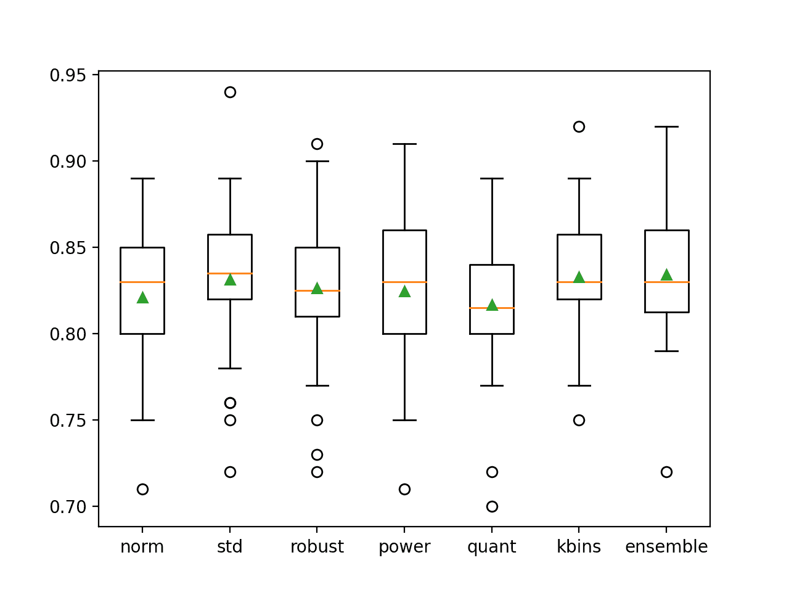

# 使用不同数据转换开发装袋集成

> 原文：<https://machinelearningmastery.com/bagging-ensemble-with-different-data-transformations/>

最后更新于 2021 年 4 月 27 日

Bootstrap 聚合(或 bagging)是一种集成，其中每个模型都在训练数据集的不同样本上进行训练。

bagging 的思想可以推广到用于改变训练数据集和在数据的每个改变版本上拟合相同模型的其他技术。一种方法是使用改变输入变量的规模和概率分布的数据变换，作为训练类似 bagging 的集合的贡献成员的基础。我们可以称之为数据转换装袋或数据转换集成。

在本教程中，您将发现如何开发数据转换集成。

完成本教程后，您将知道:

*   数据转换可以用作 bagging 类型集成的基础，在 bagging 类型集成中，在训练数据集的不同视图上训练相同的模型。
*   如何开发一个用于分类的数据转换集成，并确认该集成的表现优于任何贡献成员。
*   如何开发和评估用于回归预测建模的数据转换集成？

**用我的新书[Python 集成学习算法](https://machinelearningmastery.com/ensemble-learning-algorithms-with-python/)启动你的项目**，包括*分步教程*和所有示例的 *Python 源代码*文件。

我们开始吧。


开发具有不同数据转换的装袋集成
照片由[麦克杰·克劳斯](https://www.flickr.com/photos/138892959@N03/33278904900/)拍摄，保留部分权利。

## 教程概述

本教程分为三个部分；它们是:

1.  数据转换装袋
2.  用于分类的数据变换集成
3.  回归的数据变换集成

## 数据转换装袋

[Bootstrap 聚合](https://machinelearningmastery.com/bagging-ensemble-with-python/)，简称 bagging，是一种集成学习技术，基于在同一训练数据集的多个不同样本上拟合相同模型类型的思想。

希望用于拟合每个模型的训练数据集的微小差异将导致模型能力的微小差异。对于集成学习，这被称为集成成员的多样性，并且旨在使每个贡献成员做出的预测(或预测误差)去相关。

尽管它被设计为与决策树一起使用，并且每个数据样本都是使用 bootstrap 方法(用 rel-selection 进行选择)制作的，但是该方法已经产生了一个完整的研究子领域，对该方法有数百种变体。

我们可以通过改变用于以新的和独特的方式训练每个贡献成员的数据集来构建我们自己的装袋集成。

一种方法是对每个有贡献的集合成员的数据集应用不同的数据准备转换。

这是基于这样一个前提，即我们不能知道将未知底层结构暴露给学习算法的数据集的训练数据集的表示形式。这激发了用一套不同的数据转换来评估模型的需求，例如改变比例和概率分布，以便发现什么是有效的。

这种方法可用于创建同一训练数据集的一组不同变换，对每个变换训练一个模型，并使用简单的统计(如平均)组合预测。

由于没有更好的名称，我们将其称为“**数据转换装袋**或“**数据转换集成**”

我们可以使用许多变换，但一个好的起点可能是改变规模和概率分布的选择，例如:

*   [归一化](https://machinelearningmastery.com/standardscaler-and-minmaxscaler-transforms-in-python/)(固定范围)
*   [标准化](https://machinelearningmastery.com/standardscaler-and-minmaxscaler-transforms-in-python/)(零均值)
*   [稳健标准化](https://machinelearningmastery.com/robust-scaler-transforms-for-machine-learning/)(对异常值稳健)
*   [电力变压器](https://machinelearningmastery.com/power-transforms-with-Sklearn/)(消除歪斜)
*   [分位数变换](https://machinelearningmastery.com/quantile-transforms-for-machine-learning/)(变化分布)
*   [离散化](https://machinelearningmastery.com/discretization-transforms-for-machine-learning/) (k 箱)

当与基于数据转换效果训练不同或非常不同模型的基础模型一起使用时，该方法可能更有效。

改变分布的比例可能只适用于对输入变量的比例变化敏感的模型，如计算加权和的模型，如逻辑回归和神经网络，以及使用距离度量的模型，如 k 近邻和支持向量机。

输入变量概率分布的变化可能会影响大多数机器学习模型。

现在我们已经熟悉了这种方法，让我们来探索如何为分类问题开发一个数据转换集成。

## 用于分类的数据变换集成

我们可以使用 Sklearn 库开发一种装袋分类的数据转换方法。

该库提供了一套我们可以直接使用的标准转换。每个集成成员可以被定义为一个管道，转换之后是预测模型，以避免任何数据泄漏，进而产生乐观的结果。最后，可以使用投票集合来组合来自每个管道的预测。

首先，我们可以定义一个合成的二进制类别数据集，作为探索这种类型集成的基础。

下面的示例创建了一个包含 1，000 个示例的数据集，每个示例包含 20 个输入要素，其中 15 个包含预测目标的信息。

```py
# synthetic classification dataset
from sklearn.datasets import make_classification
# define dataset
X, y = make_classification(n_samples=1000, n_features=20, n_informative=15, n_redundant=5, random_state=1)
# summarize the dataset
print(X.shape, y.shape)
```

运行该示例将创建数据集并总结数据数组的形状，这证实了我们的预期。

```py
(1000, 20) (1000,)
```

接下来，我们使用我们打算在集合中使用的预测模型来建立问题的基线。标准做法是在装袋集成中使用决策树，因此在这种情况下，我们将使用带有默认超参数的[决策树分类器](https://Sklearn.org/stable/modules/generated/sklearn.tree.DecisionTreeClassifier.html)。

我们将使用标准实践来评估模型，在这种情况下，使用三次重复和 10 次重复的重复分层 k-fold 交叉验证。将使用所有折叠和重复的分类准确度的平均值来报告表现。

下面列出了在综合类别数据集上评估决策树的完整示例。

```py
# evaluate decision tree on synthetic classification dataset
from numpy import mean
from numpy import std
from sklearn.datasets import make_classification
from sklearn.model_selection import cross_val_score
from sklearn.model_selection import RepeatedStratifiedKFold
from sklearn.tree import DecisionTreeClassifier
# define dataset
X, y = make_classification(n_samples=1000, n_features=20, n_informative=15, n_redundant=5, random_state=1)
# define the model
model = DecisionTreeClassifier()
# define the evaluation procedure
cv = RepeatedStratifiedKFold(n_splits=10, n_repeats=3, random_state=1)
# evaluate the model
n_scores = cross_val_score(model, X, y, scoring='accuracy', cv=cv, n_jobs=-1)
# report performance
print('Mean Accuracy: %.3f (%.3f)' % (mean(n_scores), std(n_scores)))
```

运行该示例报告了决策树在合成类别数据集上的平均分类准确率。

**注**:考虑到算法或评估程序的随机性，或数值准确率的差异，您的[结果可能会有所不同](https://machinelearningmastery.com/different-results-each-time-in-machine-learning/)。考虑运行该示例几次，并比较平均结果。

在这种情况下，我们可以看到该模型实现了大约 82.3%的分类准确率。

这个分数提供了一个表现基线，我们期望数据转换集成能够在此基础上有所改进。

```py
Mean Accuracy: 0.823 (0.039)
```

接下来，我们可以开发一组决策树，每一个都适合输入数据的不同变换。

首先，我们可以将每个集成成员定义为一个建模管道。第一步是数据转换，第二步是决策树分类器。

例如，带有[最小最大缩放器](https://Sklearn.org/stable/modules/generated/sklearn.preprocessing.MinMaxScaler.html)类的规范化转换的管道如下所示:

```py
...
# normalization
norm = Pipeline([('s', MinMaxScaler()), ('m', DecisionTreeClassifier())])
```

对于我们想要使用的每个转换或转换配置，我们可以重复这一过程，并将所有模型管道添加到列表中。

[VotingClassifier](https://Sklearn.org/stable/modules/generated/sklearn.ensemble.VotingClassifier.html) 类可用于组合所有模型的预测。这个类接受一个“*估值器*”参数，它是一个元组列表，其中每个元组都有一个名称和模型或建模管道。例如:

```py
...
# normalization
norm = Pipeline([('s', MinMaxScaler()), ('m', DecisionTreeClassifier())])
models.append(('norm', norm))
...
# define the voting ensemble
ensemble = VotingClassifier(estimators=models, voting='hard')
```

为了使代码更容易阅读，我们可以定义一个函数 *get_ensemble()* 来创建成员和数据转换 ensemble 本身。

```py
# get a voting ensemble of models
def get_ensemble():
	# define the base models
	models = list()
	# normalization
	norm = Pipeline([('s', MinMaxScaler()), ('m', DecisionTreeClassifier())])
	models.append(('norm', norm))
	# standardization
	std = Pipeline([('s', StandardScaler()), ('m', DecisionTreeClassifier())])
	models.append(('std', std))
	# robust
	robust = Pipeline([('s', RobustScaler()), ('m', DecisionTreeClassifier())])
	models.append(('robust', robust))
	# power
	power = Pipeline([('s', PowerTransformer()), ('m', DecisionTreeClassifier())])
	models.append(('power', power))
	# quantile
	quant = Pipeline([('s', QuantileTransformer(n_quantiles=100, output_distribution='normal')), ('m', DecisionTreeClassifier())])
	models.append(('quant', quant))
	# kbins
	kbins = Pipeline([('s', KBinsDiscretizer(n_bins=20, encode='ordinal')), ('m', DecisionTreeClassifier())])
	models.append(('kbins', kbins))
	# define the voting ensemble
	ensemble = VotingClassifier(estimators=models, voting='hard')
	return ensemble
```

然后，我们可以调用这个函数，并按照正常方式评估投票集合，就像我们对上面的决策树所做的那样。

将这些联系在一起，完整的示例如下所示。

```py
# evaluate data transform bagging ensemble on a classification dataset
from numpy import mean
from numpy import std
from sklearn.datasets import make_classification
from sklearn.model_selection import cross_val_score
from sklearn.model_selection import RepeatedStratifiedKFold
from sklearn.preprocessing import MinMaxScaler
from sklearn.preprocessing import StandardScaler
from sklearn.preprocessing import RobustScaler
from sklearn.preprocessing import PowerTransformer
from sklearn.preprocessing import QuantileTransformer
from sklearn.preprocessing import KBinsDiscretizer
from sklearn.tree import DecisionTreeClassifier
from sklearn.ensemble import VotingClassifier
from sklearn.pipeline import Pipeline

# get a voting ensemble of models
def get_ensemble():
	# define the base models
	models = list()
	# normalization
	norm = Pipeline([('s', MinMaxScaler()), ('m', DecisionTreeClassifier())])
	models.append(('norm', norm))
	# standardization
	std = Pipeline([('s', StandardScaler()), ('m', DecisionTreeClassifier())])
	models.append(('std', std))
	# robust
	robust = Pipeline([('s', RobustScaler()), ('m', DecisionTreeClassifier())])
	models.append(('robust', robust))
	# power
	power = Pipeline([('s', PowerTransformer()), ('m', DecisionTreeClassifier())])
	models.append(('power', power))
	# quantile
	quant = Pipeline([('s', QuantileTransformer(n_quantiles=100, output_distribution='normal')), ('m', DecisionTreeClassifier())])
	models.append(('quant', quant))
	# kbins
	kbins = Pipeline([('s', KBinsDiscretizer(n_bins=20, encode='ordinal')), ('m', DecisionTreeClassifier())])
	models.append(('kbins', kbins))
	# define the voting ensemble
	ensemble = VotingClassifier(estimators=models, voting='hard')
	return ensemble

# define dataset
X, y = make_classification(n_samples=1000, n_features=20, n_informative=15, n_redundant=5, random_state=1)
# get models
ensemble = get_ensemble()
# define the evaluation procedure
cv = RepeatedStratifiedKFold(n_splits=10, n_repeats=3, random_state=1)
# evaluate the model
n_scores = cross_val_score(ensemble, X, y, scoring='accuracy', cv=cv, n_jobs=-1)
# report performance
print('Mean Accuracy: %.3f (%.3f)' % (mean(n_scores), std(n_scores)))
```

运行该示例报告了数据变换集合在合成类别数据集上的平均分类准确率。

**注**:考虑到算法或评估程序的随机性，或数值准确率的差异，您的[结果可能会有所不同](https://machinelearningmastery.com/different-results-each-time-in-machine-learning/)。考虑运行该示例几次，并比较平均结果。

在这种情况下，我们可以看到数据转换集成实现了大约 83.8%的分类准确率，这比单独使用决策树实现了大约 82.3%的准确率有所提升。

```py
Mean Accuracy: 0.838 (0.042)
```

尽管与单个决策树相比，该集成表现良好，但该测试的一个限制是，我们不知道该集成是否比任何贡献成员表现更好。

这很重要，因为如果一个贡献的成员表现得更好，那么使用成员本身作为模型而不是整体会更简单和容易。

我们可以通过评估每个单独模型的表现并将结果与整体进行比较来检查这一点。

首先，我们可以更新 *get_ensemble()* 函数，返回一个由单个集成成员以及集成本身组成的待评估模型列表。

```py
# get a voting ensemble of models
def get_ensemble():
	# define the base models
	models = list()
	# normalization
	norm = Pipeline([('s', MinMaxScaler()), ('m', DecisionTreeClassifier())])
	models.append(('norm', norm))
	# standardization
	std = Pipeline([('s', StandardScaler()), ('m', DecisionTreeClassifier())])
	models.append(('std', std))
	# robust
	robust = Pipeline([('s', RobustScaler()), ('m', DecisionTreeClassifier())])
	models.append(('robust', robust))
	# power
	power = Pipeline([('s', PowerTransformer()), ('m', DecisionTreeClassifier())])
	models.append(('power', power))
	# quantile
	quant = Pipeline([('s', QuantileTransformer(n_quantiles=100, output_distribution='normal')), ('m', DecisionTreeClassifier())])
	models.append(('quant', quant))
	# kbins
	kbins = Pipeline([('s', KBinsDiscretizer(n_bins=20, encode='ordinal')), ('m', DecisionTreeClassifier())])
	models.append(('kbins', kbins))
	# define the voting ensemble
	ensemble = VotingClassifier(estimators=models, voting='hard')
	# return a list of tuples each with a name and model
	return models + [('ensemble', ensemble)]
```

我们可以调用这个函数，枚举每个模型，评估它，报告表现，并存储结果。

```py
...
# get models
models = get_ensemble()
# evaluate each model
results = list()
for name,model in models:
	# define the evaluation method
	cv = RepeatedStratifiedKFold(n_splits=10, n_repeats=3, random_state=1)
	# evaluate the model on the dataset
	n_scores = cross_val_score(model, X, y, scoring='accuracy', cv=cv, n_jobs=-1)
	# report performance
	print('>%s: %.3f (%.3f)' % (name, mean(n_scores), std(n_scores)))
	results.append(n_scores)
```

最后，我们可以将准确度分数的分布绘制为并排的方框图和触须图，并直接比较分数的分布。

从视觉上看，我们希望整体分数的分布比任何单个成员都偏高，并且分布的中心趋势(平均值和中值)也比任何成员都高。

```py
...
# plot the results for comparison
pyplot.boxplot(results, labels=[n for n,_ in models], showmeans=True)
pyplot.show()
```

将这些联系在一起，下面列出了将贡献成员的表现与数据转换集成的表现进行比较的完整示例。

```py
# comparison of data transform ensemble to each contributing member for classification
from numpy import mean
from numpy import std
from sklearn.datasets import make_classification
from sklearn.model_selection import cross_val_score
from sklearn.model_selection import RepeatedStratifiedKFold
from sklearn.preprocessing import MinMaxScaler
from sklearn.preprocessing import StandardScaler
from sklearn.preprocessing import RobustScaler
from sklearn.preprocessing import PowerTransformer
from sklearn.preprocessing import QuantileTransformer
from sklearn.preprocessing import KBinsDiscretizer
from sklearn.tree import DecisionTreeClassifier
from sklearn.ensemble import VotingClassifier
from sklearn.pipeline import Pipeline
from matplotlib import pyplot

# get a voting ensemble of models
def get_ensemble():
	# define the base models
	models = list()
	# normalization
	norm = Pipeline([('s', MinMaxScaler()), ('m', DecisionTreeClassifier())])
	models.append(('norm', norm))
	# standardization
	std = Pipeline([('s', StandardScaler()), ('m', DecisionTreeClassifier())])
	models.append(('std', std))
	# robust
	robust = Pipeline([('s', RobustScaler()), ('m', DecisionTreeClassifier())])
	models.append(('robust', robust))
	# power
	power = Pipeline([('s', PowerTransformer()), ('m', DecisionTreeClassifier())])
	models.append(('power', power))
	# quantile
	quant = Pipeline([('s', QuantileTransformer(n_quantiles=100, output_distribution='normal')), ('m', DecisionTreeClassifier())])
	models.append(('quant', quant))
	# kbins
	kbins = Pipeline([('s', KBinsDiscretizer(n_bins=20, encode='ordinal')), ('m', DecisionTreeClassifier())])
	models.append(('kbins', kbins))
	# define the voting ensemble
	ensemble = VotingClassifier(estimators=models, voting='hard')
	# return a list of tuples each with a name and model
	return models + [('ensemble', ensemble)]

# define dataset
X, y = make_classification(n_samples=1000, n_features=20, n_informative=15, n_redundant=5, random_state=1)
# get models
models = get_ensemble()
# evaluate each model
results = list()
for name,model in models:
	# define the evaluation method
	cv = RepeatedStratifiedKFold(n_splits=10, n_repeats=3, random_state=1)
	# evaluate the model on the dataset
	n_scores = cross_val_score(model, X, y, scoring='accuracy', cv=cv, n_jobs=-1)
	# report performance
	print('>%s: %.3f (%.3f)' % (name, mean(n_scores), std(n_scores)))
	results.append(n_scores)
# plot the results for comparison
pyplot.boxplot(results, labels=[n for n,_ in models], showmeans=True)
pyplot.show()
```

运行该示例首先报告每个单独模型的平均和标准分类准确率，最后是组合模型的集成的表现。

**注**:考虑到算法或评估程序的随机性，或数值准确率的差异，您的[结果可能会有所不同](https://machinelearningmastery.com/different-results-each-time-in-machine-learning/)。考虑运行该示例几次，并比较平均结果。

在这种情况下，我们可以看到许多单个成员表现良好，例如准确率约为 83.3%的“T0”kbins，准确率约为 83.1%的“T2”STD。我们还可以看到，与任何贡献成员相比，该集成实现了更好的整体表现，准确率约为 83.4%。

```py
>norm: 0.821 (0.041)
>std: 0.831 (0.045)
>robust: 0.826 (0.044)
>power: 0.825 (0.045)
>quant: 0.817 (0.042)
>kbins: 0.833 (0.035)
>ensemble: 0.834 (0.040)
```

还创建了一个图形，显示了每个单独模型以及数据转换集合的分类准确率的方框图和触须图。

我们可以看到集成的分布是向上倾斜的，这是我们可能希望的，并且平均值(绿色三角形)略高于单个集成成员的平均值。



单个模型和数据转换集合准确率分布的盒须图

既然我们已经熟悉了如何开发一个用于分类的数据转换集成，那么让我们看看如何对回归做同样的事情。

## 回归的数据变换集成

在本节中，我们将探索为回归预测建模问题开发数据转换集成。

首先，我们可以定义一个合成的二元回归数据集作为探索这种类型集成的基础。

下面的示例创建了一个数据集，其中 100 个输入要素各有 1，000 个示例，其中 10 个包含预测目标的信息。

```py
# synthetic regression dataset
from sklearn.datasets import make_regression
# define dataset
X, y = make_regression(n_samples=1000, n_features=100, n_informative=10, noise=0.1, random_state=1)
# summarize the dataset
print(X.shape, y.shape)
```

运行该示例将创建数据集，并确认数据具有预期的形状。

```py
(1000, 100) (1000,)
```

接下来，我们可以通过拟合和评估我们打算在集成中使用的基础模型来建立合成数据集的表现基线，在本例中，基础模型是[决策树回归器](https://Sklearn.org/stable/modules/generated/sklearn.tree.DecisionTreeRegressor.html)。

该模型将使用重复的 k-fold 交叉验证进行评估，重复 3 次，重复 10 次。数据集上的模型表现将使用平均绝对误差(MAE)报告。Sklearn 将反转分数(使其为负数)，以便框架可以最大化分数。因此，我们可以忽略分数上的符号。

下面的示例评估了合成回归数据集上的决策树。

```py
# evaluate decision tree on synthetic regression dataset
from numpy import mean
from numpy import std
from sklearn.datasets import make_regression
from sklearn.model_selection import cross_val_score
from sklearn.model_selection import RepeatedKFold
from sklearn.tree import DecisionTreeRegressor
# define dataset
X, y = make_regression(n_samples=1000, n_features=100, n_informative=10, noise=0.1, random_state=1)
# define the model
model = DecisionTreeRegressor()
# define the evaluation procedure
cv = RepeatedKFold(n_splits=10, n_repeats=3, random_state=1)
# evaluate the model
n_scores = cross_val_score(model, X, y, scoring='neg_mean_absolute_error', cv=cv, n_jobs=-1)
# report performance
print('MAE: %.3f (%.3f)' % (mean(n_scores), std(n_scores)))
```

运行该示例会报告合成回归数据集上决策树的 MAE。

**注**:考虑到算法或评估程序的随机性，或数值准确率的差异，您的[结果可能会有所不同](https://machinelearningmastery.com/different-results-each-time-in-machine-learning/)。考虑运行该示例几次，并比较平均结果。

在这种情况下，我们可以看到模型实现了大约 139.817 的 MAE。这提供了一个我们期望集合模型改进的表现下限。

```py
MAE: -139.817 (12.449)
```

接下来，我们可以开发和评估该集成。

我们将使用与上一节相同的数据转换。将使用[voting returnalizer](https://Sklearn.org/stable/modules/generated/sklearn.ensemble.VotingRegressor.html)来组合预测，这适用于回归问题。

下面定义的 get_ensemble()函数创建单个模型和集成模型，并将所有模型组合成元组列表进行评估。

```py
# get a voting ensemble of models
def get_ensemble():
	# define the base models
	models = list()
	# normalization
	norm = Pipeline([('s', MinMaxScaler()), ('m', DecisionTreeRegressor())])
	models.append(('norm', norm))
	# standardization
	std = Pipeline([('s', StandardScaler()), ('m', DecisionTreeRegressor())])
	models.append(('std', std))
	# robust
	robust = Pipeline([('s', RobustScaler()), ('m', DecisionTreeRegressor())])
	models.append(('robust', robust))
	# power
	power = Pipeline([('s', PowerTransformer()), ('m', DecisionTreeRegressor())])
	models.append(('power', power))
	# quantile
	quant = Pipeline([('s', QuantileTransformer(n_quantiles=100, output_distribution='normal')), ('m', DecisionTreeRegressor())])
	models.append(('quant', quant))
	# kbins
	kbins = Pipeline([('s', KBinsDiscretizer(n_bins=20, encode='ordinal')), ('m', DecisionTreeRegressor())])
	models.append(('kbins', kbins))
	# define the voting ensemble
	ensemble = VotingRegressor(estimators=models)
	# return a list of tuples each with a name and model
	return models + [('ensemble', ensemble)]
```

然后，我们可以调用这个函数，独立评估每个有贡献的建模管道，并将结果与管道的总体进行比较。

和以前一样，我们的期望是，集成会提升任何单个模型的表现。如果没有，那么应该选择表现最好的个人模型。

将这些联系在一起，下面列出了评估回归数据集的数据转换集成的完整示例。

```py
# comparison of data transform ensemble to each contributing member for regression
from numpy import mean
from numpy import std
from sklearn.datasets import make_regression
from sklearn.model_selection import cross_val_score
from sklearn.model_selection import RepeatedKFold
from sklearn.preprocessing import MinMaxScaler
from sklearn.preprocessing import StandardScaler
from sklearn.preprocessing import RobustScaler
from sklearn.preprocessing import PowerTransformer
from sklearn.preprocessing import QuantileTransformer
from sklearn.preprocessing import KBinsDiscretizer
from sklearn.tree import DecisionTreeRegressor
from sklearn.ensemble import VotingRegressor
from sklearn.pipeline import Pipeline
from matplotlib import pyplot

# get a voting ensemble of models
def get_ensemble():
	# define the base models
	models = list()
	# normalization
	norm = Pipeline([('s', MinMaxScaler()), ('m', DecisionTreeRegressor())])
	models.append(('norm', norm))
	# standardization
	std = Pipeline([('s', StandardScaler()), ('m', DecisionTreeRegressor())])
	models.append(('std', std))
	# robust
	robust = Pipeline([('s', RobustScaler()), ('m', DecisionTreeRegressor())])
	models.append(('robust', robust))
	# power
	power = Pipeline([('s', PowerTransformer()), ('m', DecisionTreeRegressor())])
	models.append(('power', power))
	# quantile
	quant = Pipeline([('s', QuantileTransformer(n_quantiles=100, output_distribution='normal')), ('m', DecisionTreeRegressor())])
	models.append(('quant', quant))
	# kbins
	kbins = Pipeline([('s', KBinsDiscretizer(n_bins=20, encode='ordinal')), ('m', DecisionTreeRegressor())])
	models.append(('kbins', kbins))
	# define the voting ensemble
	ensemble = VotingRegressor(estimators=models)
	# return a list of tuples each with a name and model
	return models + [('ensemble', ensemble)]

# generate regression dataset
X, y = make_regression(n_samples=1000, n_features=100, n_informative=10, noise=0.1, random_state=1)
# get models
models = get_ensemble()
# evaluate each model
results = list()
for name,model in models:
	# define the evaluation method
	cv = RepeatedKFold(n_splits=10, n_repeats=3, random_state=1)
	# evaluate the model on the dataset
	n_scores = cross_val_score(model, X, y, scoring='neg_mean_absolute_error', cv=cv, n_jobs=-1)
	# report performance
	print('>%s: %.3f (%.3f)' % (name, mean(n_scores), std(n_scores)))
	results.append(n_scores)
# plot the results for comparison
pyplot.boxplot(results, labels=[n for n,_ in models], showmeans=True)
pyplot.show()
```

运行该示例首先报告每个单独模型的 MAE，最后是组合模型的集合的表现。

**注**:考虑到算法或评估程序的随机性，或数值准确率的差异，您的[结果可能会有所不同](https://machinelearningmastery.com/different-results-each-time-in-machine-learning/)。考虑运行该示例几次，并比较平均结果。

我们可以看到，每个模型的表现都差不多，MAE 误差分数在 140 左右，都高于孤立使用的决策树。有趣的是，该集成表现最好，超过了所有单个成员和没有变换的树，达到了大约 126.487 的 MAE。

这个结果表明，虽然每个管道的表现比没有转换的单个树差，但是每个管道都产生不同的错误，并且模型的平均值能够利用这些差异来降低错误。

```py
>norm: -140.559 (11.783)
>std: -140.582 (11.996)
>robust: -140.813 (11.827)
>power: -141.089 (12.668)
>quant: -141.109 (11.097)
>kbins: -145.134 (11.638)
>ensemble: -126.487 (9.999)
```

创建一个图形，比较每个管道和集合的 MAE 分数分布。

正如我们所希望的，与所有其他模型相比，集合的分布偏斜度更高，并且具有更高(更小)的中心趋势(分别由绿色三角形和橙色线表示的平均值和中值)。


单个模型和数据转换集合的 MAE 分布的盒须图

## 进一步阅读

如果您想更深入地了解这个主题，本节将提供更多资源。

### 教程

*   [如何用 Python 开发投票集成](https://machinelearningmastery.com/voting-ensembles-with-python/)

### 书

*   [使用集成方法的模式分类](https://amzn.to/2zxc0F7)，2010。
*   [集成方法](https://amzn.to/2XZzrjG)，2012。
*   [集成机器学习](https://amzn.to/2C7syo5)，2012。

### 蜜蜂

*   [硬化。一起。投票分类器 API](https://Sklearn.org/stable/modules/generated/sklearn.ensemble.VotingClassifier.html) 。
*   [硬化。一起。投票输入 API](https://Sklearn.org/stable/modules/generated/sklearn.ensemble.VotingRegressor.html) 。

## 摘要

在本教程中，您发现了如何开发数据转换集成。

具体来说，您了解到:

*   数据转换可以用作 bagging 类型集成的基础，在 bagging 类型集成中，在训练数据集的不同视图上训练相同的模型。
*   如何开发一个用于分类的数据转换集成，并确认该集成的表现优于任何贡献成员。
*   如何开发和评估用于回归预测建模的数据转换集成？

**你有什么问题吗？**
在下面的评论中提问，我会尽力回答。