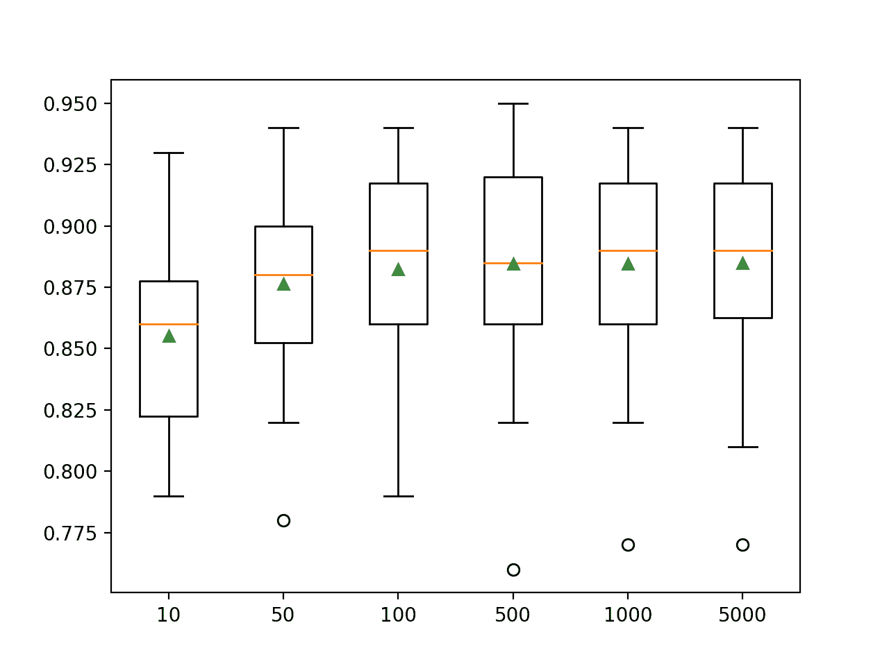
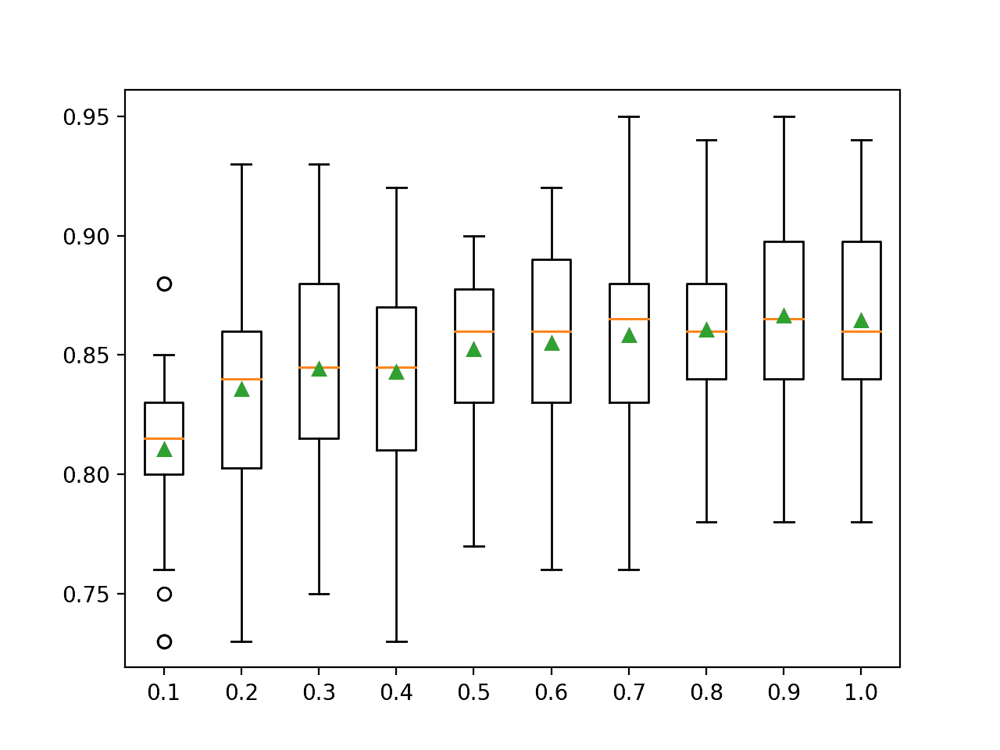
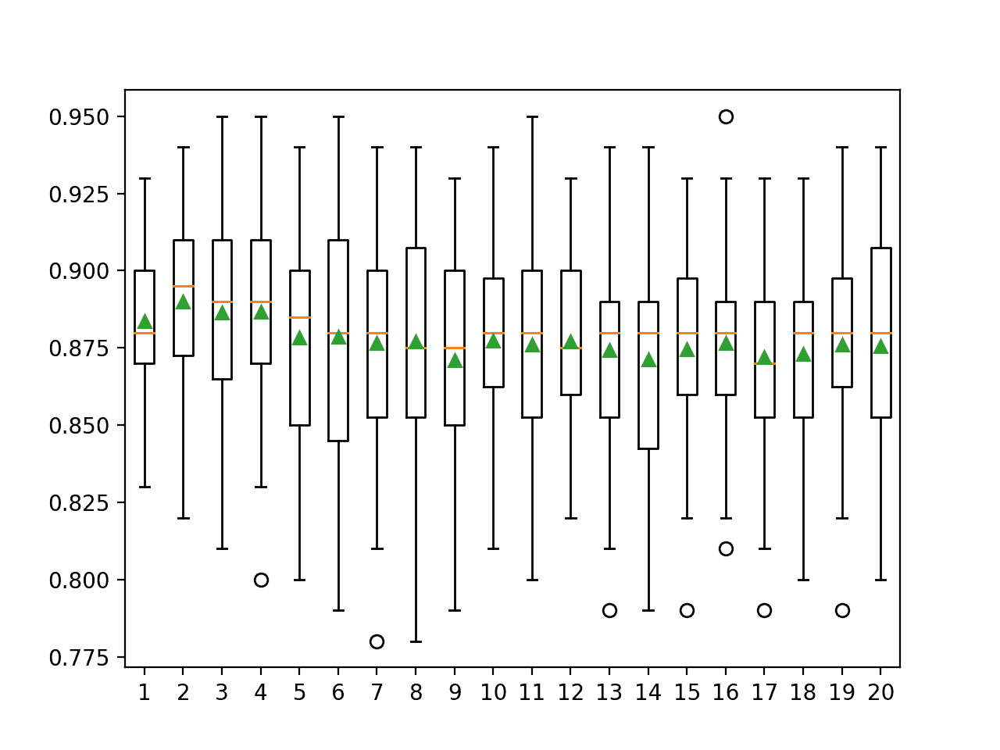

# 如何用 Python 开发装袋集成

> 原文：<https://machinelearningmastery.com/bagging-ensemble-with-python/>

最后更新于 2021 年 4 月 27 日

Bagging 是一种集成机器学习算法，它结合了来自许多决策树的预测。

它也很容易实现，因为它只有很少的关键超参数和合理的试探法来配置这些超参数。

Bagging 总体上表现良好，并为决策树算法的整个集成领域提供了基础，例如流行的随机森林和额外树集成算法，以及不太为人知的粘贴、随机子空间和随机面片集成算法。

在本教程中，您将发现如何为分类和回归开发 Bagging 集成。

完成本教程后，您将知道:

*   Bagging 集成是从适合数据集不同样本的决策树创建的集成。
*   如何用 Sklearn 使用 Bagging 集成进行分类和回归。
*   如何探索 Bagging 模型超参数对模型表现的影响。

**用我的新书[Python 集成学习算法](https://machinelearningmastery.com/ensemble-learning-algorithms-with-python/)启动你的项目**，包括*分步教程*和所有示例的 *Python 源代码*文件。

我们开始吧。

*   **更新 2020 年 8 月**:增加了常见问题部分。


如何用 Python 开发装袋集成
图片由[达文宁](https://flickr.com/photos/daveynin/6281580340/)提供，保留部分权利。

## 教程概述

本教程分为五个部分；它们是:

1.  装袋集成算法
2.  装袋科学工具包-学习应用编程接口
    1.  分类装袋
    2.  回归装袋
3.  装袋超参数
    1.  探索树的数量
    2.  探索样本数量
    3.  探索替代算法
4.  装袋扩展
    1.  粘贴集成
    2.  随机子空间集成
    3.  随机面片集合
5.  常见问题

## 装袋集成算法

Bootstrap Aggregation，简称 Bagging，是一种集成机器学习算法。

具体来说，它是决策树模型的集合，尽管 bagging 技术也可以用于组合其他类型模型的预测。

顾名思义，bootstrap 聚合基于“ *bootstrap* ”样本的思想。

一个[引导样本](https://machinelearningmastery.com/a-gentle-introduction-to-the-bootstrap-method/)是一个带有替换的数据集样本。替换意味着从数据集中提取的样本被替换，允许它在新样本中被再次选择，也可能被多次选择。这意味着样本可能有来自原始数据集的重复示例。

自举采样技术用于从小数据样本中估计总体统计量。这是通过抽取多个自举样本，计算每个样本的统计量，并报告所有样本的平均统计量来实现的。

使用自举采样的一个例子是从一个小数据集中估计总体平均值。从数据集中抽取多个自举样本，计算每个样本的平均值，然后将估计平均值的平均值报告为总体的估计值。

令人惊讶的是，与原始数据集上的单一估计相比，自举方法提供了一种稳健且准确的统计量估计方法。

同样的方法可以用来创建决策树模型的集合。

这是通过从训练数据集中抽取多个引导样本并在每个样本上拟合决策树来实现的。来自决策树的预测然后被组合，以提供比单个决策树(典型地，但不总是)更稳健和准确的预测。

> 装袋预测器是一种生成预测器的多个版本并使用这些版本获得聚合预测器的方法。[……]多个版本是通过对学习集进行引导复制并将其用作新的学习集而形成的

——[装袋预测因子](https://link.springer.com/article/10.1007/BF00058655)，1996。

对回归问题的预测是通过对决策树中的预测取平均值来进行的。通过在决策树所做的预测中对类别进行多数票预测，来对分类问题进行预测。

袋装决策树是有效的，因为每个决策树都适合于稍微不同的训练数据集，这反过来允许每个树有微小的差异，并做出稍微不同的巧妙预测。

从技术上讲，我们说这种方法是有效的，因为这些树在预测之间的相关性很低，反过来，预测误差也很低。

使用决策树，特别是未运行的决策树，因为它们略微超出了训练数据，并且具有较高的方差。可以使用其他高方差机器学习算法，例如具有低的 *k* 值的 [k 最近邻算法](https://machinelearningmastery.com/tutorial-to-implement-k-nearest-neighbors-in-python-from-scratch/)，尽管决策树已经被证明是最有效的。

> 如果扰动学习集会导致构建的预测器发生显著变化，那么装袋可以提高准确性。

——[装袋预测因子](https://link.springer.com/article/10.1007/BF00058655)，1996。

装袋并不总是能带来改善。对于已经表现良好的低方差模型，装袋会导致模型表现下降。

> 实验和理论证据都表明，装袋可以将一个好的但不稳定的过程推向最优化的重要一步。另一方面，它会稍微降低稳定程序的表现。

——[装袋预测因子](https://link.springer.com/article/10.1007/BF00058655)，1996。

## 装袋科学工具包-学习应用编程接口

装袋集成可以从零开始实现，尽管这对初学者来说很有挑战性。

有关示例，请参见教程:

*   [如何用 Python 实现从零开始装袋](https://machinelearningmastery.com/implement-bagging-scratch-python/)

Sklearn Python 机器学习库为机器学习提供了 Bagging 集成的实现。

它有现代版本的图书馆。

首先，通过运行以下脚本来确认您使用的是现代版本的库:

```py
# check Sklearn version
import sklearn
print(sklearn.__version__)
```

运行脚本将打印您的 Sklearn 版本。

您的版本应该相同或更高。如果没有，您必须升级 Sklearn 库的版本。

```py
0.22.1
```

装袋通过[装袋分类器](https://Sklearn.org/stable/modules/generated/sklearn.ensemble.BaggingRegressor.html)和[装袋分类器](https://Sklearn.org/stable/modules/generated/sklearn.ensemble.BaggingClassifier.html)类提供。

这两个模型以相同的方式运行，并采用相同的参数来影响决策树的创建。

随机性用于模型的构建。这意味着算法每次在相同的数据上运行时，都会产生稍微不同的模型。

当使用具有随机学习算法的机器学习算法时，最好通过在多次运行或重复交叉验证中平均它们的表现来评估它们。当拟合最终模型时，可能需要增加树的数量，直到模型的方差在重复评估中减小，或者拟合多个最终模型并对它们的预测进行平均。

让我们看看如何为分类和回归开发一个 Bagging 集成。

### 分类装袋

在本节中，我们将研究如何使用 Bagging 解决分类问题。

首先，我们可以使用 [make_classification()函数](https://Sklearn.org/stable/modules/generated/sklearn.datasets.make_classification.html)创建一个包含 1000 个示例和 20 个输入特征的合成二进制分类问题。

下面列出了完整的示例。

```py
# test classification dataset
from sklearn.datasets import make_classification
# define dataset
X, y = make_classification(n_samples=1000, n_features=20, n_informative=15, n_redundant=5, random_state=5)
# summarize the dataset
print(X.shape, y.shape)
```

运行该示例将创建数据集并总结输入和输出组件的形状。

```py
(1000, 20) (1000,)
```

接下来，我们可以在这个数据集上评估 Bagging 算法。

我们将使用[重复分层 k 折叠交叉验证](https://machinelearningmastery.com/k-fold-cross-validation/)来评估模型，重复 3 次，折叠 10 次。我们将报告所有重复和折叠的模型准确率的平均值和标准偏差。

```py
# evaluate bagging algorithm for classification
from numpy import mean
from numpy import std
from sklearn.datasets import make_classification
from sklearn.model_selection import cross_val_score
from sklearn.model_selection import RepeatedStratifiedKFold
from sklearn.ensemble import BaggingClassifier
# define dataset
X, y = make_classification(n_samples=1000, n_features=20, n_informative=15, n_redundant=5, random_state=5)
# define the model
model = BaggingClassifier()
# evaluate the model
cv = RepeatedStratifiedKFold(n_splits=10, n_repeats=3, random_state=1)
n_scores = cross_val_score(model, X, y, scoring='accuracy', cv=cv, n_jobs=-1, error_score='raise')
# report performance
print('Accuracy: %.3f (%.3f)' % (mean(n_scores), std(n_scores)))
```

运行该示例会报告模型的均值和标准差准确率。

**注**:考虑到算法或评估程序的随机性，或数值准确率的差异，您的[结果可能会有所不同](https://machinelearningmastery.com/different-results-each-time-in-machine-learning/)。考虑运行该示例几次，并比较平均结果。

在这种情况下，我们可以看到具有默认超参数的 Bagging 集成在这个测试数据集上实现了大约 85%的分类准确率。

```py
Accuracy: 0.856 (0.037)
```

我们也可以使用 Bagging 模型作为最终模型，并对分类进行预测。

首先，Bagging 集成适合所有可用数据，然后可以调用 *predict()* 函数对新数据进行预测。

下面的示例在我们的二进制类别数据集上演示了这一点。

```py
# make predictions using bagging for classification
from sklearn.datasets import make_classification
from sklearn.ensemble import BaggingClassifier
# define dataset
X, y = make_classification(n_samples=1000, n_features=20, n_informative=15, n_redundant=5, random_state=5)
# define the model
model = BaggingClassifier()
# fit the model on the whole dataset
model.fit(X, y)
# make a single prediction
row = [[-4.7705504,-1.88685058,-0.96057964,2.53850317,-6.5843005,3.45711663,-7.46225013,2.01338213,-0.45086384,-1.89314931,-2.90675203,-0.21214568,-0.9623956,3.93862591,0.06276375,0.33964269,4.0835676,1.31423977,-2.17983117,3.1047287]]
yhat = model.predict(row)
print('Predicted Class: %d' % yhat[0])
```

运行该示例使 Bagging 集成模型适合整个数据集，然后用于对新的数据行进行预测，就像我们在应用程序中使用该模型时可能做的那样。

```py
Predicted Class: 1
```

现在我们已经熟悉了使用 Bagging 进行分类，让我们看看回归的 API。

### 回归装袋

在这一节中，我们将研究使用 Bagging 解决回归问题。

首先，我们可以使用[make _ revolution()函数](https://Sklearn.org/stable/modules/generated/sklearn.datasets.make_regression.html)创建一个包含 1000 个示例和 20 个输入特征的合成回归问题。

下面列出了完整的示例。

```py
# test regression dataset
from sklearn.datasets import make_regression
# define dataset
X, y = make_regression(n_samples=1000, n_features=20, n_informative=15, noise=0.1, random_state=5)
# summarize the dataset
print(X.shape, y.shape)
```

运行该示例将创建数据集并总结输入和输出组件的形状。

```py
(1000, 20) (1000,)
```

接下来，我们可以在这个数据集上评估 Bagging 算法。

正如我们在上一节中所做的，我们将使用重复的 k-fold 交叉验证来评估模型，重复 3 次，重复 10 次。我们将报告所有重复和折叠模型的平均绝对误差(MAE)。Sklearn 库使 MAE 为负，因此它被最大化而不是最小化。这意味着负 MAE 越大越好，完美模型的 MAE 为 0。

下面列出了完整的示例。

```py
# evaluate bagging ensemble for regression
from numpy import mean
from numpy import std
from sklearn.datasets import make_regression
from sklearn.model_selection import cross_val_score
from sklearn.model_selection import RepeatedKFold
from sklearn.ensemble import BaggingRegressor
# define dataset
X, y = make_regression(n_samples=1000, n_features=20, n_informative=15, noise=0.1, random_state=5)
# define the model
model = BaggingRegressor()
# evaluate the model
cv = RepeatedKFold(n_splits=10, n_repeats=3, random_state=1)
n_scores = cross_val_score(model, X, y, scoring='neg_mean_absolute_error', cv=cv, n_jobs=-1, error_score='raise')
# report performance
print('MAE: %.3f (%.3f)' % (mean(n_scores), std(n_scores)))
```

运行该示例会报告模型的均值和标准差准确率。

**注**:考虑到算法或评估程序的随机性，或数值准确率的差异，您的[结果可能会有所不同](https://machinelearningmastery.com/different-results-each-time-in-machine-learning/)。考虑运行该示例几次，并比较平均结果。

在这种情况下，我们可以看到具有默认超参数的 Bagging 集成实现了大约 100 的 MAE。

```py
MAE: -101.133 (9.757)
```

我们也可以使用 Bagging 模型作为最终模型，并对回归进行预测。

首先，Bagging 集成适合所有可用数据，然后可以调用 *predict()* 函数对新数据进行预测。

下面的例子在我们的回归数据集上演示了这一点。

```py
# bagging ensemble for making predictions for regression
from sklearn.datasets import make_regression
from sklearn.ensemble import BaggingRegressor
# define dataset
X, y = make_regression(n_samples=1000, n_features=20, n_informative=15, noise=0.1, random_state=5)
# define the model
model = BaggingRegressor()
# fit the model on the whole dataset
model.fit(X, y)
# make a single prediction
row = [[0.88950817,-0.93540416,0.08392824,0.26438806,-0.52828711,-1.21102238,-0.4499934,1.47392391,-0.19737726,-0.22252503,0.02307668,0.26953276,0.03572757,-0.51606983,-0.39937452,1.8121736,-0.00775917,-0.02514283,-0.76089365,1.58692212]]
yhat = model.predict(row)
print('Prediction: %d' % yhat[0])
```

运行该示例使 Bagging 集成模型适合整个数据集，然后用于对新的数据行进行预测，就像我们在应用程序中使用该模型时可能做的那样。

```py
Prediction: -134
```

现在我们已经熟悉了使用 Sklearn API 来评估和使用 Bagging 集成，让我们来看看如何配置模型。

## 装袋超参数

在本节中，我们将仔细研究一些您应该考虑为 Bagging 集成进行调整的超参数，以及它们对模型表现的影响。

### 探索树的数量

Bagging 算法的一个重要超参数是集成中使用的决策树的数量。

通常，树的数量会增加，直到模型表现稳定下来。直觉可能暗示更多的树会导致过拟合，尽管事实并非如此。给定学习算法的随机性质，装袋和决策树算法的相关集成(如[随机森林](https://machinelearningmastery.com/implement-random-forest-scratch-python/))似乎在某种程度上不会过拟合训练数据集。

树的数量可以通过“*n _ estimates*”参数设置，默认为 100。

下面的示例探讨了值在 10 到 5，000 之间的树的数量的影响。

```py
# explore bagging ensemble number of trees effect on performance
from numpy import mean
from numpy import std
from sklearn.datasets import make_classification
from sklearn.model_selection import cross_val_score
from sklearn.model_selection import RepeatedStratifiedKFold
from sklearn.ensemble import BaggingClassifier
from matplotlib import pyplot

# get the dataset
def get_dataset():
	X, y = make_classification(n_samples=1000, n_features=20, n_informative=15, n_redundant=5, random_state=5)
	return X, y

# get a list of models to evaluate
def get_models():
	models = dict()
	# define number of trees to consider
	n_trees = [10, 50, 100, 500, 500, 1000, 5000]
	for n in n_trees:
		models[str(n)] = BaggingClassifier(n_estimators=n)
	return models

# evaluate a given model using cross-validation
def evaluate_model(model, X, y):
	# define the evaluation procedure
	cv = RepeatedStratifiedKFold(n_splits=10, n_repeats=3, random_state=1)
	# evaluate the model and collect the results
	scores = cross_val_score(model, X, y, scoring='accuracy', cv=cv, n_jobs=-1)
	return scores

# define dataset
X, y = get_dataset()
# get the models to evaluate
models = get_models()
# evaluate the models and store results
results, names = list(), list()
for name, model in models.items():
	# evaluate the model
	scores = evaluate_model(model, X, y)
	# store the results
	results.append(scores)
	names.append(name)
	# summarize the performance along the way
	print('>%s %.3f (%.3f)' % (name, mean(scores), std(scores)))
# plot model performance for comparison
pyplot.boxplot(results, labels=names, showmeans=True)
pyplot.show()
```

运行该示例首先报告每个配置数量的决策树的平均准确性。

**注**:考虑到算法或评估程序的随机性，或数值准确率的差异，您的[结果可能会有所不同](https://machinelearningmastery.com/different-results-each-time-in-machine-learning/)。考虑运行该示例几次，并比较平均结果。

在这种情况下，我们可以看到在这个数据集上的表现有所提高，直到大约 100 棵树，之后保持不变。

```py
>10 0.855 (0.037)
>50 0.876 (0.035)
>100 0.882 (0.037)
>500 0.885 (0.041)
>1000 0.885 (0.037)
>5000 0.885 (0.038)
```

为每个配置数量的树的准确度分数的分布创建一个方框和须图。

我们可以看到大约 100 棵树后没有进一步改善的总体趋势。



装袋集合大小与分类准确率的箱线图

### 探索样本数量

引导样本的大小也可以变化。

默认情况下，将创建一个与原始数据集具有相同数量示例的引导样本。使用较小的数据集可以增加生成的决策树的方差，并可能导致更好的整体表现。

用于拟合每个决策树的样本数量通过“ *max_samples* ”参数设置。

下面的示例将不同大小的样本作为原始数据集的 10%到 100%(默认值)的比率进行探索。

```py
# explore bagging ensemble number of samples effect on performance
from numpy import mean
from numpy import std
from numpy import arange
from sklearn.datasets import make_classification
from sklearn.model_selection import cross_val_score
from sklearn.model_selection import RepeatedStratifiedKFold
from sklearn.ensemble import BaggingClassifier
from matplotlib import pyplot

# get the dataset
def get_dataset():
	X, y = make_classification(n_samples=1000, n_features=20, n_informative=15, n_redundant=5, random_state=5)
	return X, y

# get a list of models to evaluate
def get_models():
	models = dict()
	# explore ratios from 10% to 100% in 10% increments
	for i in arange(0.1, 1.1, 0.1):
		key = '%.1f' % i
		models[key] = BaggingClassifier(max_samples=i)
	return models

# evaluate a given model using cross-validation
def evaluate_model(model, X, y):
	# define the evaluation procedure
	cv = RepeatedStratifiedKFold(n_splits=10, n_repeats=3, random_state=1)
	# evaluate the model and collect the results
	scores = cross_val_score(model, X, y, scoring='accuracy', cv=cv, n_jobs=-1)
	return scores

# define dataset
X, y = get_dataset()
# get the models to evaluate
models = get_models()
# evaluate the models and store results
results, names = list(), list()
for name, model in models.items():
	# evaluate the model
	scores = evaluate_model(model, X, y)
	# store the results
	results.append(scores)
	names.append(name)
	# summarize the performance along the way
	print('>%s %.3f (%.3f)' % (name, mean(scores), std(scores)))
# plot model performance for comparison
pyplot.boxplot(results, labels=names, showmeans=True)
pyplot.show()
```

运行该示例首先报告每个样本集大小的平均准确度。

**注**:考虑到算法或评估程序的随机性，或数值准确率的差异，您的[结果可能会有所不同](https://machinelearningmastery.com/different-results-each-time-in-machine-learning/)。考虑运行该示例几次，并比较平均结果。

在这种情况下，结果表明，随着样本大小的增加，表现通常会提高，这突出表明默认的 100%的训练数据集大小是合理的。

探索一个更小的样本量，并相应增加树的数量，以减少单个模型的方差，这可能也是有趣的。

```py
>0.1 0.810 (0.036)
>0.2 0.836 (0.044)
>0.3 0.844 (0.043)
>0.4 0.843 (0.041)
>0.5 0.852 (0.034)
>0.6 0.855 (0.042)
>0.7 0.858 (0.042)
>0.8 0.861 (0.033)
>0.9 0.866 (0.041)
>1.0 0.864 (0.042)
```

为每个样本大小的准确度分数分布创建了一个方框和须图。

我们看到随着样本量的增加，准确性有增加的趋势。



装袋样本量与分类准确度的箱线图

### 探索替代算法

决策树是装袋集成中最常用的算法。

这样做的原因是它们易于配置，具有较高的差异，并且通常表现良好。

其他算法可以与 bagging 一起使用，并且必须配置为具有适度高的方差。一个例子是 [k 近邻算法](https://machinelearningmastery.com/tutorial-to-implement-k-nearest-neighbors-in-python-from-scratch/)，其中 *k* 值可以设置为低值。

集合中使用的算法是通过“ *base_estimator* ”参数指定的，并且必须设置为要使用的算法和算法配置的实例。

下面的例子演示了使用一个[kneighgborcsclassifier](https://Sklearn.org/stable/modules/generated/sklearn.neighbors.KNeighborsClassifier.html)作为装袋集成中使用的基本算法。这里，算法与默认超参数一起使用，其中 *k* 设置为 5。

```py
# evaluate bagging with knn algorithm for classification
from numpy import mean
from numpy import std
from sklearn.datasets import make_classification
from sklearn.model_selection import cross_val_score
from sklearn.model_selection import RepeatedStratifiedKFold
from sklearn.neighbors import KNeighborsClassifier
from sklearn.ensemble import BaggingClassifier
# define dataset
X, y = make_classification(n_samples=1000, n_features=20, n_informative=15, n_redundant=5, random_state=5)
# define the model
model = BaggingClassifier(base_estimator=KNeighborsClassifier())
# evaluate the model
cv = RepeatedStratifiedKFold(n_splits=10, n_repeats=3, random_state=1)
n_scores = cross_val_score(model, X, y, scoring='accuracy', cv=cv, n_jobs=-1, error_score='raise')
# report performance
print('Accuracy: %.3f (%.3f)' % (mean(n_scores), std(n_scores)))
```

运行该示例会报告模型的均值和标准差准确率。

**注**:考虑到算法或评估程序的随机性，或数值准确率的差异，您的[结果可能会有所不同](https://machinelearningmastery.com/different-results-each-time-in-machine-learning/)。考虑运行该示例几次，并比较平均结果。

在这种情况下，我们可以看到具有 KNN 和默认超参数的 Bagging 集成在这个测试数据集上实现了大约 88%的分类准确率。

```py
Accuracy: 0.888 (0.036)
```

我们可以测试不同的 k 值，以找到模型方差的正确平衡，从而作为一个袋装集成获得良好的表现。

以下示例测试的袋装 KNN 模型的 *k* 值介于 1 和 20 之间。

```py
# explore bagging ensemble k for knn effect on performance
from numpy import mean
from numpy import std
from sklearn.datasets import make_classification
from sklearn.model_selection import cross_val_score
from sklearn.model_selection import RepeatedStratifiedKFold
from sklearn.ensemble import BaggingClassifier
from sklearn.neighbors import KNeighborsClassifier
from matplotlib import pyplot

# get the dataset
def get_dataset():
	X, y = make_classification(n_samples=1000, n_features=20, n_informative=15, n_redundant=5, random_state=5)
	return X, y

# get a list of models to evaluate
def get_models():
	models = dict()
	# evaluate k values from 1 to 20
	for i in range(1,21):
		# define the base model
		base = KNeighborsClassifier(n_neighbors=i)
		# define the ensemble model
		models[str(i)] = BaggingClassifier(base_estimator=base)
	return models

# evaluate a given model using cross-validation
def evaluate_model(model, X, y):
	# define the evaluation procedure
	cv = RepeatedStratifiedKFold(n_splits=10, n_repeats=3, random_state=1)
	# evaluate the model and collect the results
	scores = cross_val_score(model, X, y, scoring='accuracy', cv=cv, n_jobs=-1)
	return scores

# define dataset
X, y = get_dataset()
# get the models to evaluate
models = get_models()
# evaluate the models and store results
results, names = list(), list()
for name, model in models.items():
	# evaluate the model
	scores = evaluate_model(model, X, y)
	# store the results
	results.append(scores)
	names.append(name)
	# summarize the performance along the way
	print('>%s %.3f (%.3f)' % (name, mean(scores), std(scores)))
# plot model performance for comparison
pyplot.boxplot(results, labels=names, showmeans=True)
pyplot.show()
```

运行该示例首先报告每个 k 值的平均准确率。

**注**:考虑到算法或评估程序的随机性，或数值准确率的差异，您的[结果可能会有所不同](https://machinelearningmastery.com/different-results-each-time-in-machine-learning/)。考虑运行该示例几次，并比较平均结果。

在这种情况下，结果表明，当在 bagging 集合中使用时，较小的 k 值(例如 2 到 4)导致最佳的平均准确率。

```py
>1 0.884 (0.025)
>2 0.890 (0.029)
>3 0.886 (0.035)
>4 0.887 (0.033)
>5 0.878 (0.037)
>6 0.879 (0.042)
>7 0.877 (0.037)
>8 0.877 (0.036)
>9 0.871 (0.034)
>10 0.877 (0.033)
>11 0.876 (0.037)
>12 0.877 (0.030)
>13 0.874 (0.034)
>14 0.871 (0.039)
>15 0.875 (0.034)
>16 0.877 (0.033)
>17 0.872 (0.034)
>18 0.873 (0.036)
>19 0.876 (0.034)
>20 0.876 (0.037)
```

为每个 *k* 值的准确度分数的分布创建一个方框和须图。

我们看到，在开始时，随着样本量的增加，准确度总体呈上升趋势，随后，随着集合中使用的单个 KNN 模型的方差随着更大的 *k* 值而增加，表现略有下降。



装袋 KNN 邻居数量与分类准确率的箱线图

## 装袋扩展

为了提高方法的表现，对 bagging 算法进行了许多修改和扩展。

也许最著名的是[随机森林算法](https://machinelearningmastery.com/implement-random-forest-scratch-python/)。

有一些不太出名但仍然有效的装袋扩展值得研究。

本节演示了其中的一些方法，例如粘贴集成、随机子空间集成和随机面片集成。

我们不是在数据集上与这些扩展赛跑，而是提供如何使用每种技术的工作示例，您可以复制粘贴这些技术，并尝试使用自己的数据集。

### 粘贴集成

粘贴集成是装袋的扩展，包括基于训练数据集的随机样本而不是自举样本来拟合集成成员。

该方法被设计成在训练数据集不适合存储的情况下使用比训练数据集更小的样本量。

> 该过程获取一小部分数据，在每一小部分数据上生成一个预测值，然后将这些预测值粘贴在一起。给出了一个可扩展到万亿字节数据集的版本。这些方法也适用于在线学习。

——[在大型数据库和网上粘贴分类小票](https://link.springer.com/article/10.1023/A:1007563306331)，1999。

下面的示例演示了粘贴集合，方法是将“ *bootstrap* ”参数设置为“ *False* ”，并将通过“ *max_samples* ”在训练数据集中使用的样本数量设置为适中的值，在本例中为训练数据集大小的 50%。

```py
# evaluate pasting ensemble algorithm for classification
from numpy import mean
from numpy import std
from sklearn.datasets import make_classification
from sklearn.model_selection import cross_val_score
from sklearn.model_selection import RepeatedStratifiedKFold
from sklearn.ensemble import BaggingClassifier
# define dataset
X, y = make_classification(n_samples=1000, n_features=20, n_informative=15, n_redundant=5, random_state=5)
# define the model
model = BaggingClassifier(bootstrap=False, max_samples=0.5)
# evaluate the model
cv = RepeatedStratifiedKFold(n_splits=10, n_repeats=3, random_state=1)
n_scores = cross_val_score(model, X, y, scoring='accuracy', cv=cv, n_jobs=-1, error_score='raise')
# report performance
print('Accuracy: %.3f (%.3f)' % (mean(n_scores), std(n_scores)))
```

运行该示例会报告模型的均值和标准差准确率。

**注**:考虑到算法或评估程序的随机性，或数值准确率的差异，您的[结果可能会有所不同](https://machinelearningmastery.com/different-results-each-time-in-machine-learning/)。考虑运行该示例几次，并比较平均结果。

在这种情况下，我们可以看到粘贴集成在这个数据集上实现了大约 84%的分类准确率。

```py
Accuracy: 0.848 (0.039)
```

### 随机子空间集成

随机子空间集成是 bagging 的一个扩展，它涉及到基于从训练数据集中特征的随机子集构建的数据集来拟合集成成员。

它类似于随机森林，只是数据样本是随机的，而不是自举样本，并且为整个决策树选择特征子集，而不是在树中的每个分割点。

> 该分类器由通过伪随机选择特征向量的分量子集而系统地构建的多个树组成，即在随机选择的子空间中构建的树。

——[构建决策森林的随机子空间方法](https://ieeexplore.ieee.org/abstract/document/709601)，1998。

下面的示例演示了随机子空间集成，方法是将“ *bootstrap* ”参数设置为“ *False* ”，并将通过“ *max_features* ”在训练数据集中使用的特征数量设置为适中的值，在本例中为 10。

```py
# evaluate random subspace ensemble algorithm for classification
from numpy import mean
from numpy import std
from sklearn.datasets import make_classification
from sklearn.model_selection import cross_val_score
from sklearn.model_selection import RepeatedStratifiedKFold
from sklearn.ensemble import BaggingClassifier
# define dataset
X, y = make_classification(n_samples=1000, n_features=20, n_informative=15, n_redundant=5, random_state=5)
# define the model
model = BaggingClassifier(bootstrap=False, max_features=10)
# evaluate the model
cv = RepeatedStratifiedKFold(n_splits=10, n_repeats=3, random_state=1)
n_scores = cross_val_score(model, X, y, scoring='accuracy', cv=cv, n_jobs=-1, error_score='raise')
# report performance
print('Accuracy: %.3f (%.3f)' % (mean(n_scores), std(n_scores)))
```

运行该示例会报告模型的均值和标准差准确率。

**注**:考虑到算法或评估程序的随机性，或数值准确率的差异，您的[结果可能会有所不同](https://machinelearningmastery.com/different-results-each-time-in-machine-learning/)。考虑运行该示例几次，并比较平均结果。

在这种情况下，我们可以看到随机子空间集成在这个数据集上实现了大约 86%的分类准确率。

```py
Accuracy: 0.862 (0.040)
```

我们期望在随机子空间中会有许多特征，提供模型方差和模型技能的正确平衡。

下面的例子演示了在从 1 到 20 的随机子空间集合中使用不同数量的特征的效果。

```py
# explore random subspace ensemble ensemble number of features effect on performance
from numpy import mean
from numpy import std
from sklearn.datasets import make_classification
from sklearn.model_selection import cross_val_score
from sklearn.model_selection import RepeatedStratifiedKFold
from sklearn.ensemble import BaggingClassifier
from matplotlib import pyplot

# get the dataset
def get_dataset():
	X, y = make_classification(n_samples=1000, n_features=20, n_informative=15, n_redundant=5, random_state=5)
	return X, y

# get a list of models to evaluate
def get_models():
	models = dict()
	for i in range(1, 21):
		models[str(i)] = BaggingClassifier(bootstrap=False, max_features=i)
	return models

# evaluate a given model using cross-validation
def evaluate_model(model, X, y):
	cv = RepeatedStratifiedKFold(n_splits=10, n_repeats=3, random_state=1)
	scores = cross_val_score(model, X, y, scoring='accuracy', cv=cv, n_jobs=-1, error_score='raise')
	return scores

# define dataset
X, y = get_dataset()
# get the models to evaluate
models = get_models()
# evaluate the models and store results
results, names = list(), list()
for name, model in models.items():
	scores = evaluate_model(model, X, y)
	results.append(scores)
	names.append(name)
	print('>%s %.3f (%.3f)' % (name, mean(scores), std(scores)))
# plot model performance for comparison
pyplot.boxplot(results, labels=names, showmeans=True)
pyplot.show()
```

运行示例首先报告每个特征数量的平均准确率。

在这种情况下，结果表明使用数据集中大约一半数量的特征(例如，在 9 和 13 之间)可能给出该数据集上随机子空间集成的最佳结果。

```py
>1 0.583 (0.047)
>2 0.659 (0.048)
>3 0.731 (0.038)
>4 0.775 (0.045)
>5 0.815 (0.044)
>6 0.820 (0.040)
>7 0.838 (0.034)
>8 0.841 (0.035)
>9 0.854 (0.036)
>10 0.854 (0.041)
>11 0.857 (0.034)
>12 0.863 (0.035)
>13 0.860 (0.043)
>14 0.856 (0.038)
>15 0.848 (0.043)
>16 0.847 (0.042)
>17 0.839 (0.046)
>18 0.831 (0.044)
>19 0.811 (0.043)
>20 0.802 (0.048)
```

为每个随机子空间大小的准确度分数的分布创建一个方框和须图。

我们看到了一个总体趋势，即随着特征数量的增加，准确率增加到大约 10 到 13 个特征，在这一水平上，准确率大致保持不变，然后表现呈适度下降趋势。


随机子空间集合特征数与分类准确率的箱线图

### 随机面片集合

随机面片集成是 bagging 的一个扩展，它包括基于由训练数据集的行(样本)和列(特征)的随机子集构建的数据集来拟合集成成员。

它不使用自举样本，并且可以被认为是组合了粘贴集合的数据集的随机采样和随机子空间集合的特征的随机采样的集合。

> 我们研究了一个非常简单但有效的集成框架，该框架通过从整个数据集中抽取实例和特征的随机子集，从随机数据块中构建集成的每个单独模型。

——[随机补丁集成](https://link.springer.com/chapter/10.1007/978-3-642-33460-3_28)，2012 年。

下面的示例演示了随机面片集合，其中决策树是从训练数据集的随机样本创建的，样本大小限制为训练数据集的 50%，随机子集包含 10 个要素。

```py
# evaluate random patches ensemble algorithm for classification
from numpy import mean
from numpy import std
from sklearn.datasets import make_classification
from sklearn.model_selection import cross_val_score
from sklearn.model_selection import RepeatedStratifiedKFold
from sklearn.ensemble import BaggingClassifier
# define dataset
X, y = make_classification(n_samples=1000, n_features=20, n_informative=15, n_redundant=5, random_state=5)
# define the model
model = BaggingClassifier(bootstrap=False, max_features=10, max_samples=0.5)
# evaluate the model
cv = RepeatedStratifiedKFold(n_splits=10, n_repeats=3, random_state=1)
n_scores = cross_val_score(model, X, y, scoring='accuracy', cv=cv, n_jobs=-1, error_score='raise')
# report performance
print('Accuracy: %.3f (%.3f)' % (mean(n_scores), std(n_scores)))
```

运行该示例会报告模型的均值和标准差准确率。

**注**:考虑到算法或评估程序的随机性，或数值准确率的差异，您的[结果可能会有所不同](https://machinelearningmastery.com/different-results-each-time-in-machine-learning/)。考虑运行该示例几次，并比较平均结果。

在这种情况下，我们可以看到随机补丁集成在这个数据集上实现了大约 84%的分类准确率。

```py
Accuracy: 0.845 (0.036)
```

## 常见问题

在这一节中，我们将更仔细地看看你在装袋集合过程中可能遇到的一些常见症结。

**问:集成应该用什么算法？**

该算法应该具有适度的方差，这意味着它适度地依赖于特定的训练数据。

决策树是默认使用的模型，因为它在实践中运行良好。可以使用其他算法，只要它们被配置为具有适度的方差。

选择的算法应该适度稳定，不像决策树桩那样不稳定，也不像修剪的决策树那样非常稳定，通常使用未修剪的决策树。

> ……众所周知，Bagging 应该用于不稳定的学习器，一般来说，越不稳定，表现提升越大。

—第 52 页，[集合方法](https://amzn.to/2XZzrjG)，2012。

**问:应该用多少个文工团成员？**

模型的表现将随着决策树数量的增加而收敛到一个点，然后保持水平。

> Bagging 的表现随着集成规模(即基础学习器的数量)的增长而收敛…

—第 52 页，[集合方法](https://amzn.to/2XZzrjG)，2012。

因此，不断增加树的数量，直到数据集的表现稳定下来。

**问:文工团不会因为树木太多而过度吗？**

不。装袋集成一般来说不太可能过量。

**问:自举样本应该有多大？**

让引导样本与原始数据集大小一样大是一种好的做法。

这是原始数据集的 100%大小或相等的行数。

**问:哪些问题很适合装袋？**

一般来说，装袋非常适合小规模或中等规模数据集的问题。但这是一个粗略的指南。

> Bagging 最适合于可用训练数据集相对较小的问题。

—第 12 页，[集成机器学习](https://amzn.to/2C7syo5)，2012。

试试看吧。

## 进一步阅读

如果您想更深入地了解这个主题，本节将提供更多资源。

### 教程

*   [引导法的简单介绍](https://machinelearningmastery.com/a-gentle-introduction-to-the-bootstrap-method/)
*   [如何用 Python 实现从零开始装袋](https://machinelearningmastery.com/implement-bagging-scratch-python/)
*   [如何在 Keras 创建深度学习模型的装袋集成](https://machinelearningmastery.com/how-to-create-a-random-split-cross-validation-and-bagging-ensemble-for-deep-learning-in-keras/)
*   [机器学习的装袋和随机森林集成算法](https://machinelearningmastery.com/bagging-and-random-forest-ensemble-algorithms-for-machine-learning/)

### 报纸

*   [装袋预测因子](https://link.springer.com/article/10.1007/BF00058655)，1996。
*   [在大型数据库和网上粘贴分类小票](https://link.springer.com/article/10.1023/A:1007563306331)，1999。
*   [构建决策森林的随机子空间方法](https://ieeexplore.ieee.org/abstract/document/709601)，1998。
*   [随机面片集合](https://link.springer.com/chapter/10.1007/978-3-642-33460-3_28)，2012。

### 蜜蜂

*   [硬化。一起。bagginclassifier API](https://Sklearn.org/stable/modules/generated/sklearn.ensemble.BaggingClassifier.html)。
*   [硬化。一起。bagginger return API](https://Sklearn.org/stable/modules/generated/sklearn.ensemble.BaggingRegressor.html)。

### 文章

*   [引导聚合，维基百科](https://en.wikipedia.org/wiki/Bootstrap_aggregating)。

## 摘要

在本教程中，您发现了如何开发用于分类和回归的 Bagging 集成。

具体来说，您了解到:

*   Bagging 集成是从适合数据集不同样本的决策树创建的集成。
*   如何用 Sklearn 使用 Bagging 集成进行分类和回归。
*   如何探索 Bagging 模型超参数对模型表现的影响。

**你有什么问题吗？**
在下面的评论中提问，我会尽力回答。