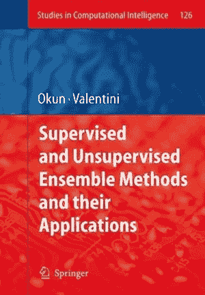
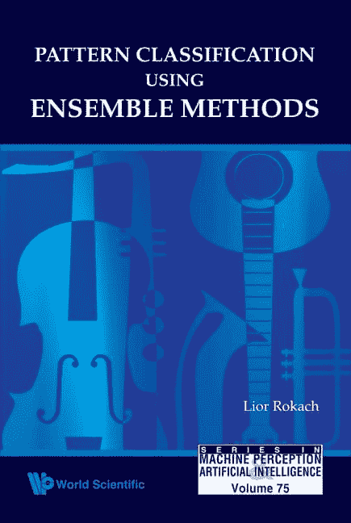
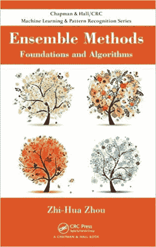
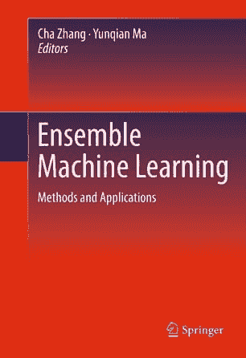

# 6 本集成学习书籍

> 原文：<https://machinelearningmastery.com/ensemble-learning-books/>

最后更新于 2021 年 4 月 27 日

集成学习包括组合来自多个机器学习模型的预测。

其效果可以是提高预测表现和降低模型预测的方差。

大多数关于机器学习的教科书都涵盖了集成方法；尽管如此，还是有专门针对这个话题的书籍。

在这篇文章中，你会发现关于集成机器学习主题的顶级书籍。

看完这篇文章，你会知道:

*   关于集成学习的书籍，包括它们的目录和在哪里可以了解更多。
*   最流行和最常见的机器学习教科书中关于集成学习的章节。
*   对集成学习感兴趣的机器学习从业者的书籍推荐。

**用我的新书[Python 集成学习算法](https://machinelearningmastery.com/ensemble-learning-algorithms-with-python/)启动你的项目**，包括*分步教程*和所有示例的 *Python 源代码*文件。

我们开始吧。

## 集成学习书单

我们将介绍的关于集成学习的书籍如下:

1.  [有监督和无监督集成方法及其应用](https://amzn.to/3humlTt)，2008。
2.  [使用集成方法的模式分类](https://amzn.to/2zxc0F7)，2010。
3.  [集成学习](https://amzn.to/2XYTor0)，2019 年。
4.  [数据挖掘中的集成方法](https://amzn.to/3frGM1A)，2010。
5.  [集成方法](https://amzn.to/2XZzrjG)，2012。
6.  [集成机器学习](https://amzn.to/2C7syo5)，2012。

还有一些 Packt 的书，不过我就不复习了；它们是:

*   [用 R](https://amzn.to/37vLf0i) 进行动手集成学习，2018。
*   [Python 动手集成学习](https://amzn.to/2YCCi0W)，2019 年。
*   [集成机器学习秘籍](https://amzn.to/3hq3l8t)，2019 年。

**是不是错过了一本关于集成学习的书？**
在下面的评论里告诉我。

**你读过这些关于集成学习的书吗？**
你怎么看？评论里告诉我。

让我们仔细看看这些书，包括它们的作者、目录，以及在哪里可以了解更多。

## 有监督和无监督集成方法及其应用

这本书的全名是“[有监督和无监督集成方法及其应用](https://amzn.to/3humlTt)”，由奥列格·奥肯(Oleg Okun)和乔治·瓦伦蒂诺(Giorgio Valentini)编辑，于 2008 年出版。

有监督和无监督集成方法及其应用

这本书收集了一系列不同作者关于集成学习应用的学术论文。

> 这本书包括九章，分为两个部分，池化了有监督和无监督集成应用的贡献。

—第八页，[有监督和无监督集成方法及其应用](https://amzn.to/3humlTt)，2008。

### 目录

*   第一部分:聚类方法的集成及其应用
    *   第一章:聚类集成方法:从单个聚类到组合解决方案
    *   第二章:用于类别数据聚类的随机子空间集成
    *   第三章:基于模糊方法的集成聚类
    *   第四章:面向对象图像分析的协同多策略聚类
*   第二部分:分类方法集成及其应用
    *   第五章:使用多分类器系统的计算机系统中的入侵检测
    *   第 6 章:基于基因表达的癌症分类的最近邻集合
    *   第七章:通过单变量分类器的堆叠进行多变量时间序列分类
    *   第八章:时间序列预测的梯度提升 GARCH 和神经网络
    *   第 9 章:名义数据的级联 VDM 树和二进制决策树

我一般不会向机器学习从业者推荐这本书，除非这本书涵盖的应用程序之一与您当前的项目直接相关。

你可以在这里了解这本书的更多信息:

*   [有监督和无监督集成方法及其应用](https://amzn.to/3humlTt)，2008。

## 使用集成方法的模式分类

这本书的完整标题是“[使用集成方法的模式分类](https://amzn.to/2zxc0F7)”，它是由[利奥·罗卡奇](https://www.linkedin.com/in/liorrokach)编写的，于 2010 年出版。

使用集成方法的模式分类

这本书提供了为学生和学者编写的集成机器学习主题的技术介绍。

> 整本书都特别强调例证的广泛使用。因此，除了集成理论之外，读者还可以从广泛的领域获得大量的人工和现实应用。本书中提到的数据，以及所呈现算法的大多数 Java 实现，都可以通过网络获得。

—第八页，[使用集成方法的模式分类](https://amzn.to/2zxc0F7)，2010。

### 目录

*   第一章:模式分类介绍
*   第二章:集成学习介绍
*   第三章:集合分类
*   第四章:集成多样性
*   第五章:集成选择
*   第 6 章:纠错输出代码
*   第七章:评估分类器的集成

我喜欢这本书的水平。它是技术性的，但并不过度，并且基于在监督预测建模项目中使用集成算法的考虑。我认为这是一个很好的实践者集成学习的教科书。

你可以在这里了解这本书的更多信息:

*   [使用集成方法的模式分类](https://amzn.to/2zxc0F7)，2010。

## 集成学习

这本书的全称是《[集成学习:使用集成方法的模式分类》](https://amzn.to/2XYTor0)》，由 [Lior Rokach](https://www.linkedin.com/in/liorrokach) 撰写，于 2019 年出版。

使用集成方法的集成学习模式分类

这是对《使用集成方法的模式分类》一书的直接更新，并给出了不同的标题。

> 这本书的第一版是十年前出版的。这本书受到机器学习和数据科学社区的好评，并被翻译成中文。[……]第二版旨在更新以前介绍的基本领域的材料，并介绍该领域的新发现；这个版本的三分之一以上是由新材料组成的。

—第七页，[集成学习:使用集成方法的模式分类](https://amzn.to/2XYTor0)，2019。

### 目录

*   第一章:机器学习导论
*   第二章:分类和回归树
*   第三章:集成学习介绍
*   第四章:集合分类
*   第五章:梯度增压机
*   第六章:集成多样性
*   第七章:集成选择
*   第 8 章:纠错输出代码
*   第九章:评估集成分类器

对于学生和从业者来说，这是一本关于集成学习的优秀教科书，如果你必须在两者之间进行选择，它比“使用集成方法的模式分类”更受欢迎。

你可以在这里了解这本书的更多信息:

*   [集成学习:使用集成方法的模式分类](https://amzn.to/2XYTor0)，2019。

## 数据挖掘中的集成方法

这本书的全称是《数据挖掘中的[集成方法:通过组合预测](https://amzn.to/3frGM1A)来提高准确性
[》，作者是乔瓦尼·塞尼和约翰·艾尔德，出版于 2010 年。](https://amzn.to/3frGM1A)

数据挖掘中的集成方法

这是一本关于集成的技术书籍，尽管在 r

> 这本书是针对新手和高级分析研究人员和从业者-特别是在工程，统计和计算机科学。那些很少接触集成的人将学习为什么以及如何使用这种突破性的方法，高级从业者将获得构建更强大模型的洞察力。贯穿全文，提供了 R 中的代码片段来说明所描述的算法，并鼓励读者尝试该技术。

—第一页，[数据挖掘中的集成方法](https://amzn.to/3frGM1A)，2010。

### 目录

*   第一章:发现集成
*   第二章:预测学习和决策树
*   第三章:模型复杂性、模型选择和正则化
*   第四章:重要采样和经典集成方法
*   第五章:规则集成和解释统计
*   第六章:整体复杂性
*   附录 A: AdaBoost 等效于 FSF 程序
*   附录 B:梯度提升和稳健损失函数

我相信这是我多年前购买的第一本关于集成学习的书。对于练习者来说，尤其是那些已经在使用 r 的人来说，这是一门很好的集成学习速成课程，对于大多数练习者来说，可能有点过于数学化了；尽管如此，我认为它可能是上述集合方法教科书的一个很好的小替代品。

你可以在这里了解这本书的更多信息:

*   [数据挖掘中的集成方法](https://amzn.to/3frGM1A)，2010。

## 集成方法

这本书的全名是“[集成方法:基础和算法](https://amzn.to/2XZzrjG)”，由周志华撰写，于 2012 年出版。

集成方法:基础和算法

这是另一本针对学生和学者的关于集成学习的重点教材。

> 这本书向研究人员、学生和实践者介绍了集成方法。这本书由八章组成，自然构成三个部分。

—第七页，[集成方法:基础和算法](https://amzn.to/2XZzrjG)，2012。

### 目录

*   第一章:引言
*   第二章:提升
*   第三章:装袋
*   第四章:组合方法
*   第五章:多样性
*   第六章:整体修剪
*   第七章:集群集成
*   第八章:高级主题

这本书写得很好，涵盖了主要方法，有很好的参考。我认为这是在集成方法基础上的又一个很好的开端，只要读者对一些数学知识感到满意。我喜欢算法描述和工作示例。

你可以在这里了解这本书的更多信息:

*   [集成方法:基础与算法](https://amzn.to/2XZzrjG)，2012。

## 集成机器学习

这本书的全称是《[集成机器学习:方法与应用》](https://amzn.to/2C7syo5)，由查章、马云倩主编，2012 年出版。

集成机器学习

这本书是一系列作者撰写的关于集成机器学习应用的学术论文的集合。

> 尽管集成学习方法最近取得了巨大的成功，但我们发现专门针对这一主题的书籍非常少，更少的书籍提供了关于如何将这种方法应用于现实应用的见解。这本书的主要目标是填补文献中现有的空白，全面涵盖最先进的集成学习方法，并提供一套演示集成学习方法在现实世界中的各种用法的应用程序。

—第五页，[集成机器学习:方法与应用](https://amzn.to/2C7syo5)，2012。

### 目录

*   第一章:集成学习
*   第二章:增强算法:方法、理论和应用综述
*   第三章:增强核估计
*   第四章:针对性学习
*   第五章:随机森林
*   第六章:负相关学习的集成学习
*   第七章:集成团
*   第八章:对象检测
*   第九章:用于人类活动识别的分类器增强
*   第 10 章:用于解剖结构检测和分割的鉴别学习
*   第 1 章:生物信息学的随机森林

像其他论文集一样，我一般不会推荐这本书，除非你是一名学者，或者其中一章与你当前的机器学习项目直接相关。然而，许多章节提供了一个坚实和紧凑的介绍，集成方法，以及如何在具体应用中使用它们。

你可以在这里了解这本书的更多信息:

*   [集成机器学习:方法与应用](https://amzn.to/2C7syo5)，2012。

## 书籍章节

许多机器学习教科书都有关于集成学习的章节。

在这一部分，我们将快速浏览一些更受欢迎的教科书和关于集成学习的相关章节。

2016 年出版的《统计学习及其在 R 中的应用导论》一书在第 8 章中为决策树的提升和装袋提供了坚实的介绍。

*   第 8.2 节:装袋、随机森林、提升

2013 年出版的《应用预测建模》一书涵盖了最流行的集成算法，并以 R 为例，重点介绍了决策树的集成。

*   第 8 章:回归树和基于规则的模型
*   第 14 章:分类树和基于规则的模型

2016 年出版的《[数据挖掘:实用机器学习工具和技术》](https://amzn.to/2YwYsBS)一书提供了一章专门介绍集成学习，涵盖了一系列流行技术，包括提升、装袋和堆叠。

*   第十二章:集成学习。

2012 年出版的《机器学习:概率视角》一书提供了许多关于执行集合的算法的章节，以及一个专门讨论堆叠和纠错输出代码的章节。

*   第 16.2 节:分类和回归树
*   第 16.4 节:增压
*   第 16.6 节:整体学习

2016 年出版的《统计学习的要素》一书涵盖了集成学习的关键算法以及集成学习的一般理论。

*   第 8 章:模型推断和平均
*   第 10 章:增强树和加法树
*   第 15 章:随机森林
*   第 16 章:集成学习

**我是不是错过了你最喜欢的机器学习教材，里面有一节是关于集成学习的？**
在下面的评论里告诉我。

## 推荐

我每本书都有一本，因为我喜欢从多个角度阅读某个主题。

如果你正在寻找一个坚实的教科书致力于整体学习的主题，我会推荐以下之一:

*   [集成方法:基础与算法](https://amzn.to/2XZzrjG)，2012。
*   [集成学习:使用集成方法的模式分类](https://amzn.to/2XYTor0)，2019。

紧随其后的是数据挖掘中的“T0”集成方法，它混合了 r

*   [数据挖掘中的集成方法](https://amzn.to/3frGM1A)，2010。

还有，我推荐*集成方法模式分类*“如果你拿不到最近的”*集成学习:集成方法模式分类*。

*   [使用集成方法的模式分类](https://amzn.to/2zxc0F7)，2010。

## 摘要

在这篇文章中，你发现了一套关于集成机器学习的书籍。

**你有什么问题吗？**
在下面的评论中提问，我会尽力回答。