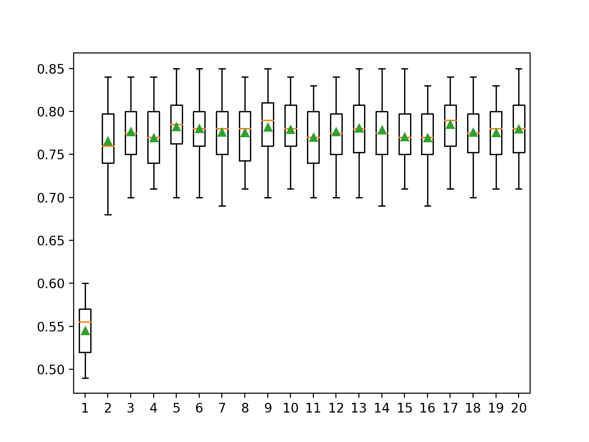

# 机器学习的纠错输出码（ECOC）

> 原文：<https://machinelearningmastery.com/error-correcting-output-codes-ecoc-for-machine-learning/>

最后更新于 2021 年 4 月 27 日

机器学习算法，像逻辑回归和支持向量机，是为两类(二进制)分类问题设计的。

因此，这些算法要么必须针对多类(两个以上)分类问题进行修改，要么根本不使用。**纠错输出码**方法是一种允许将多类分类问题重新定义为多个二进制分类问题的技术，允许直接使用本地二进制分类模型。

与通过将多类分类问题划分为固定数量的二进制分类问题来提供类似解决方案的[一对一和一对一方法](https://machinelearningmastery.com/one-vs-rest-and-one-vs-one-for-multi-class-classification/)不同，纠错输出码技术允许将每个类编码为任意数量的二进制分类问题。当使用超定表示时，它允许额外的模型充当“纠错”预测，从而可以产生更好的预测表现。

在本教程中，您将发现如何使用纠错输出代码进行分类。

完成本教程后，您将知道:

*   纠错输出码是一种在多类分类预测任务中使用二分类模型的技术。
*   如何拟合、评估和使用纠错输出码分类模型进行预测。
*   如何调整和评估纠错输出码使用的每类超参数位数的不同值。

**用我的新书[Python 集成学习算法](https://machinelearningmastery.com/ensemble-learning-algorithms-with-python/)启动你的项目**，包括*分步教程*和所有示例的 *Python 源代码*文件。

我们开始吧。


机器学习的纠错输出代码(ECOC)
图片由 [Fred Hsu](https://www.flickr.com/photos/fhsu/34952685/) 提供，保留部分权利。

## 教程概述

本教程分为三个部分；它们是:

1.  纠错输出码
2.  评估和使用 ECOC 分类器
3.  调整每个类别的位数

## 纠错输出码

[分类任务](https://machinelearningmastery.com/types-of-classification-in-machine-learning/)是标签对给定输入变量具有预测性的任务。

二分类任务是那些目标包含两个值的分类问题，而多类分类问题是那些具有两个以上目标类标签的分类问题。

已经开发了许多用于二进制分类的机器学习模型，尽管它们可能需要修改来处理多类分类问题。例如，逻辑回归和支持向量机是专门为二分类设计的。

> 一些机器学习算法，如 SVM，最初被设计成只解决二进制分类任务。

—第 133 页，[使用集成方法的模式分类](https://amzn.to/2zxc0F7)，2010。

另一种方法是将多类分类问题重构为多个二进制分类问题，而不是限制算法的选择或使算法适应多类问题。可以用来实现这一点的两种常见方法包括一对一(OvR)和一对一(OvO)技术。

*   **OvR** :将多类问题拆分为每类一个二元问题。
*   **OvO** :将多类问题拆分为每对类一个二元问题。

一旦分解为子任务，就可以在每个任务上拟合二分类模型，并将响应最大的模型作为预测。

OvR 和 OvO 都可以被认为是一种集成学习模型，假设多个单独的模型适合于一个预测建模任务，并且一起用于进行预测。在这两种情况下，对“*集成成员*”的预测都是简单的胜者全取法。

> ……将多类任务转换为二进制分类任务的集合，然后将其结果合并。

—第 134 页，[使用集成方法的模式分类](https://amzn.to/2zxc0F7)，2010。

有关一对一和一对一模式的更多信息，请参见教程:

*   [如何使用一比一休息和一比一进行多类分类](https://machinelearningmastery.com/one-vs-rest-and-one-vs-one-for-multi-class-classification/)

一种相关的方法是准备一个二进制编码(例如一个位串)来表示问题中的每个类。字符串中的每一位都可以通过单独的二进制分类问题来预测。对于给定的多类分类问题，可以任意选择长度编码。

明确地说，每个模型接收完整的输入模式，并且只预测输出字符串中的一个位置。在训练过程中，可以训练每个模型为二进制分类任务产生正确的 0 或 1 输出。然后，通过使用每个模型对输入进行预测来创建二进制字符串，然后将二进制字符串与每个类的已知编码进行比较，可以对新示例进行预测。然后选择与预测距离最小的类编码作为输出。

> 长度为 l 的码字归属于每个类别。通常，码字的大小具有比所需更多的比特，以便唯一地表示每个类别。

—第 138 页，[使用集成方法的模式分类](https://amzn.to/2zxc0F7)，2010。

这是一种有趣的方法，与一次编码相比，它允许类表示比所需的更复杂(可能是过度确定的)，并在问题的表示和建模中引入冗余。这是有意为之的，因为表示中的额外比特像纠错码一样起作用来修正、纠正或改进预测。

> ……想法是冗余的“纠错”位允许一些不准确性，并且可以提高表现。

—第 606 页，[统计学习的要素](https://amzn.to/31mzA31)，2016。

这给这项技术起了个名字:纠错输出码，简称 ECOC。

> 纠错输出码(ECOC)是一种基于二进制分类器组合处理多类问题的简单而有效的方法。

—第 90 页，[集合方法](https://amzn.to/2XZzrjG)，2012。

可以注意确保每个编码的类都有非常不同的二进制字符串编码。已经探索了一套不同的编码方案以及构建编码的特定方法，以确保它们在编码空间中相距足够远。有趣的是，随机编码可能也同样有效。

> …分析了 ECOC 方法，并表明随机码分配和最佳构造的纠错码一样有效

—第 606 页，[统计学习的要素](https://amzn.to/31mzA31)，2016。

关于将预测字符串映射到编码类的各种不同编码方案和方法的详细回顾，我推荐使用集成方法的[模式分类](https://amzn.to/2zxc0F7)一书的第 6 章*纠错输出码*。

## 评估和使用 ECOC 分类器

Sklearn 库通过[输出编码分类器类](https://Sklearn.org/stable/modules/generated/sklearn.multiclass.OutputCodeClassifier.html)提供了 ECOC 的实现。

该类将用于拟合每个二进制分类器的模型作为参数，并且可以使用任何机器学习模型。在这种情况下，我们将使用逻辑回归模型，用于二分类。

该类还提供“ *code_size* ”参数，该参数将类的编码大小指定为类数量的倍数，例如每个类标签的编码位数。

例如，如果我们想要长度为 6 位的位串编码，并且我们有三个类，那么我们可以将编码大小指定为 2:

*   编码长度=代码大小*数量类
*   encoding_length = 2 * 3
*   编码长度= 6

下面的例子演示了如何定义一个每类 2 位的*输出编码分类器*的例子，并为编码中的每一位使用一个[物流分类器](https://Sklearn.org/stable/modules/generated/sklearn.linear_model.LogisticRegression.html)模型。

```py
...
# define the binary classification model
model = LogisticRegression()
# define the ecoc model
ecoc = OutputCodeClassifier(model, code_size=2, random_state=1)
```

虽然有许多复杂的方法来构造每个类的编码， *OutputCodeClassifier* 类为每个类选择一个随机的位串编码，至少在编写时是这样。

我们可以在一个综合的多类分类问题上探索*输出编码分类器*的使用。

我们可以使用 [make_classification()函数](https://Sklearn.org/stable/modules/generated/sklearn.datasets.make_classification.html)定义一个包含 1000 个示例、20 个输入特征和三个类的多类分类问题。

下面的示例演示了如何创建数据集并汇总数据集中的行数、列数和类数。

```py
# multi-class classification dataset
from collections import Counter
from sklearn.datasets import make_classification
# define dataset
X, y = make_classification(n_samples=1000, n_features=20, n_informative=15, n_redundant=5, random_state=1, n_classes=3)
# summarize the dataset
print(X.shape, y.shape)
# summarize the number of classes
print(Counter(y))
```

运行该示例将创建数据集并报告行数和列数，从而确认数据集已按预期创建。

然后报告每个类别中的示例数量，显示三个已配置类别中每个类别的案例数量几乎相等。

```py
(1000, 20) (1000,)
Counter({2: 335, 1: 333, 0: 332})
```

接下来，我们可以在数据集上评估纠错输出代码模型。

我们将使用上面定义的每类 2 位的逻辑回归。然后将使用重复的分层 k-fold 交叉验证对模型进行评估，重复 3 次，重复 10 次。我们将使用所有重复和折叠的分类准确率的平均值和标准差来总结模型的表现。

```py
...
# define the evaluation procedure
cv = RepeatedStratifiedKFold(n_splits=10, n_repeats=3, random_state=1)
# evaluate the model and collect the scores
n_scores = cross_val_score(ecoc, X, y, scoring='accuracy', cv=cv, n_jobs=-1)
# summarize the performance
print('Accuracy: %.3f (%.3f)' % (mean(n_scores), std(n_scores)))
```

将这些联系在一起，完整的示例如下所示。

```py
# evaluate error-correcting output codes for multi-class classification
from numpy import mean
from numpy import std
from sklearn.datasets import make_classification
from sklearn.model_selection import cross_val_score
from sklearn.model_selection import RepeatedStratifiedKFold
from sklearn.linear_model import LogisticRegression
from sklearn.multiclass import OutputCodeClassifier
# define dataset
X, y = make_classification(n_samples=1000, n_features=20, n_informative=15, n_redundant=5, random_state=1, n_classes=3)
# define the binary classification model
model = LogisticRegression()
# define the ecoc model
ecoc = OutputCodeClassifier(model, code_size=2, random_state=1)
# define the evaluation procedure
cv = RepeatedStratifiedKFold(n_splits=10, n_repeats=3, random_state=1)
# evaluate the model and collect the scores
n_scores = cross_val_score(ecoc, X, y, scoring='accuracy', cv=cv, n_jobs=-1)
# summarize the performance
print('Accuracy: %.3f (%.3f)' % (mean(n_scores), std(n_scores)))
```

运行该示例定义了模型，并使用定义的测试过程在我们的合成多类类别数据集上对其进行评估。

**注**:考虑到算法或评估程序的随机性，或数值准确率的差异，您的[结果可能会有所不同](https://machinelearningmastery.com/different-results-each-time-in-machine-learning/)。考虑运行该示例几次，并比较平均结果。

在这种情况下，我们可以看到该模型实现了大约 76.6%的平均分类准确率。

```py
Accuracy: 0.766 (0.037)
```

我们可以选择用这个作为我们的最终模型。

这要求我们将模型拟合到所有可用的数据上，并使用它对新数据进行预测。

下面的示例提供了一个完整的示例，说明如何拟合并使用纠错输出模型作为最终模型。

```py
# use error-correcting output codes model as a final model and make a prediction
from sklearn.datasets import make_classification
from sklearn.linear_model import LogisticRegression
from sklearn.multiclass import OutputCodeClassifier
# define dataset
X, y = make_classification(n_samples=1000, n_features=20, n_informative=15, n_redundant=5, random_state=1, n_classes=3)
# define the binary classification model
model = LogisticRegression()
# define the ecoc model
ecoc = OutputCodeClassifier(model, code_size=2, random_state=1)
# fit the model on the whole dataset
ecoc.fit(X, y)
# make a single prediction
row = [[0.04339387, 2.75542632, -3.79522705, -0.71310994, -3.08888853, -1.2963487, -1.92065166, -3.15609907, 1.37532356, 3.61293237, 1.00353523, -3.77126962, 2.26638828, -10.22368666, -0.35137382, 1.84443763, 3.7040748, 2.50964286, 2.18839505, -2.31211692]]
yhat = ecoc.predict(row)
print('Predicted Class: %d' % yhat[0])
```

运行该示例使 ECOC 模型适用于整个数据集，并使用该模型预测单行数据的类标签。

在这种情况下，我们可以看到模型预测了类标签 0。

```py
Predicted Class: 0
```

现在，我们已经熟悉了如何安装和使用 ECOC 模型，让我们仔细看看如何配置它。

## 调整每个类别的位数

ECOC 模型的关键超参数是类标签的编码。

这包括以下属性:

*   表示的选择(位、实数等))
*   每个类标签的编码(随机等。)
*   表示的长度(位数等)。)
*   预测如何映射到类(距离等)。)

[OutputCodeClassifier](https://Sklearn.org/stable/modules/generated/sklearn.multiclass.OutputCodeClassifier.html)Sklearn 实现目前没有提供对这些元素的大量控制。

它控制的元素是用于编码每个类标签的位数。

在本节中，我们可以在每个类标签的不同位数上执行手动网格搜索，并比较结果。这提供了一个模板，您可以在自己的项目中修改和使用。

首先，我们可以定义一个函数来创建和返回数据集。

```py
# get the dataset
def get_dataset():
	X, y = make_classification(n_samples=1000, n_features=20, n_informative=15, n_redundant=5, random_state=1, n_classes=3)
	return X, y
```

然后，我们可以定义一个函数，该函数将创建一组要评估的模型。

每个模型都将是*输出编码分类器*的一个例子，为每个二进制分类问题使用一个逻辑分类器。我们将配置每个型号的*代码大小*不同，数值范围从 1 到 20。

```py
# get a list of models to evaluate
def get_models():
	models = dict()
	for i in range(1,21):
		# create model
		model = LogisticRegression()
		# create error correcting output code classifier
		models[str(i)] = OutputCodeClassifier(model, code_size=i, random_state=1)
	return models
```

我们可以使用相关的 k-fold 交叉验证来评估每个模型，就像我们在上一节中所做的那样，以给出一个分类准确性分数的样本。

```py
# evaluate a give model using cross-validation
def evaluate_model(model):
	cv = RepeatedStratifiedKFold(n_splits=10, n_repeats=3, random_state=1)
	scores = cross_val_score(model, X, y, scoring='accuracy', cv=cv, n_jobs=-1)
	return scores
```

我们可以报告每种配置得分的平均值和标准偏差，并将分布绘制为并排的方框图和触须图，以便直观地比较结果。

```py
...
# evaluate the models and store results
results, names = list(), list()
for name, model in models.items():
	scores = evaluate_model(model)
	results.append(scores)
	names.append(name)
	print('>%s %.3f (%.3f)' % (name, mean(scores), std(scores)))
# plot model performance for comparison
pyplot.boxplot(results, labels=names, showmeans=True)
pyplot.show()
```

将所有这些联系在一起，下面列出了将 ECOC 分类与每个类的位数网格进行比较的完整示例。

```py
# compare the number of bits per class for error-correcting output code classification
from numpy import mean
from numpy import std
from sklearn.datasets import make_classification
from sklearn.model_selection import cross_val_score
from sklearn.model_selection import RepeatedStratifiedKFold
from sklearn.linear_model import LogisticRegression
from sklearn.multiclass import OutputCodeClassifier
from matplotlib import pyplot

# get the dataset
def get_dataset():
	X, y = make_classification(n_samples=1000, n_features=20, n_informative=15, n_redundant=5, random_state=1, n_classes=3)
	return X, y

# get a list of models to evaluate
def get_models():
	models = dict()
	for i in range(1,21):
		# create model
		model = LogisticRegression()
		# create error correcting output code classifier
		models[str(i)] = OutputCodeClassifier(model, code_size=i, random_state=1)
	return models

# evaluate a give model using cross-validation
def evaluate_model(model):
	cv = RepeatedStratifiedKFold(n_splits=10, n_repeats=3, random_state=1)
	scores = cross_val_score(model, X, y, scoring='accuracy', cv=cv, n_jobs=-1)
	return scores

# define dataset
X, y = get_dataset()
# get the models to evaluate
models = get_models()
# evaluate the models and store results
results, names = list(), list()
for name, model in models.items():
	scores = evaluate_model(model)
	results.append(scores)
	names.append(name)
	print('>%s %.3f (%.3f)' % (name, mean(scores), std(scores)))
# plot model performance for comparison
pyplot.boxplot(results, labels=names, showmeans=True)
pyplot.show()
```

运行该示例首先评估每个模型配置，并报告准确度分数的平均值和标准偏差。

**注**:考虑到算法或评估程序的随机性，或数值准确率的差异，您的[结果可能会有所不同](https://machinelearningmastery.com/different-results-each-time-in-machine-learning/)。考虑运行该示例几次，并比较平均结果。

在这种情况下，我们可以看到，每个类可能有 5 或 6 个比特导致最佳表现，报告的平均准确度分数分别约为 78.2%和 78.0%。我们还看到每个类 9、13、17 和 20 位的良好结果，每个类 17 位可能给出大约 78.5%的最佳结果。

```py
>1 0.545 (0.032)
>2 0.766 (0.037)
>3 0.776 (0.036)
>4 0.769 (0.035)
>5 0.782 (0.037)
>6 0.780 (0.037)
>7 0.776 (0.039)
>8 0.775 (0.036)
>9 0.782 (0.038)
>10 0.779 (0.036)
>11 0.770 (0.033)
>12 0.777 (0.037)
>13 0.781 (0.037)
>14 0.779 (0.039)
>15 0.771 (0.033)
>16 0.769 (0.035)
>17 0.785 (0.034)
>18 0.776 (0.038)
>19 0.776 (0.034)
>20 0.780 (0.038)
```

创建一个图形，显示每个模型配置的准确度分数的方框图和触须图。

我们可以看到，除了值 1 之外，每个类的位数在分布和平均准确度分数方面提供了相似的结果，聚类在 77%左右。这表明该方法在各种配置中相当稳定。



ECOC 每类比特的盒须图与分类准确率分布

## 进一步阅读

如果您想更深入地了解这个主题，本节将提供更多资源。

### 相关教程

*   [如何使用一比一休息和一比一进行多类分类](https://machinelearningmastery.com/one-vs-rest-and-one-vs-one-for-multi-class-classification/)

### 报纸

*   [通过纠错输出码解决多类学习问题](https://www.jair.org/index.php/jair/article/view/10127)，1995。

### 书

*   [集成方法](https://amzn.to/2XZzrjG)，2012。
*   [使用集成方法的模式分类](https://amzn.to/2zxc0F7)，2010。
*   [统计学习的要素](https://amzn.to/31mzA31)，2016。

### 蜜蜂

*   [硬化。多类。输出代码分类器 API](https://Sklearn.org/stable/modules/generated/sklearn.multiclass.OutputCodeClassifier.html) 。
*   [纠错输出-代码，sci kit-学习文档](https://Sklearn.org/stable/modules/multiclass.html#ecoc)。

## 摘要

在本教程中，您发现了如何使用纠错输出代码进行分类。

具体来说，您了解到:

*   纠错输出码是一种在多类分类预测任务中使用二分类模型的技术。
*   如何拟合、评估和使用纠错输出码分类模型进行预测。
*   如何调整和评估纠错输出码使用的每类超参数位数的不同值。

**你有什么问题吗？**
在下面的评论中提问，我会尽力回答。