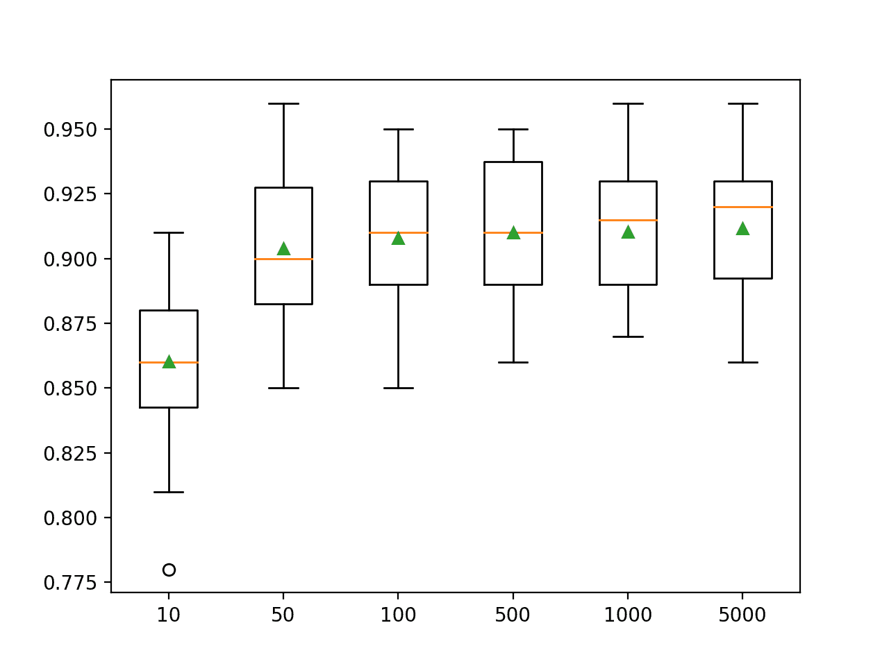
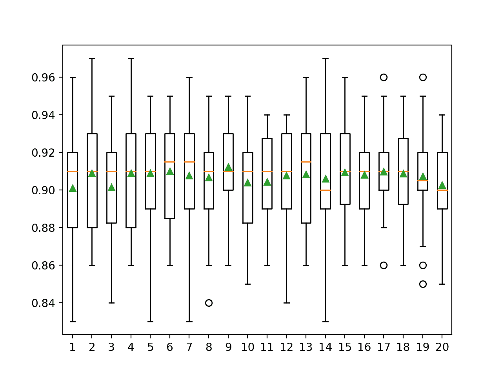

# 如何使用 Python 开发额外树集合

> 原文：<https://machinelearningmastery.com/extra-trees-ensemble-with-python/>

最后更新于 2021 年 4 月 27 日

额外树是一种集成机器学习算法，它结合了许多决策树的预测。

它与广泛使用的随机森林算法有关。尽管它使用更简单的算法来构建用作集成成员的决策树，但它通常可以获得与随机森林算法一样好或更好的表现。

它也很容易使用，因为它只有很少的关键超参数和合理的试探法来配置这些超参数。

在本教程中，您将发现如何为分类和回归开发额外树集合。

完成本教程后，您将知道:

*   额外树集成是决策树的集成，与装袋和随机森林有关。
*   如何使用额外树集合进行分类和回归。
*   如何探索 Extra Trees 模型超参数对模型表现的影响。

**用我的新书[Python 集成学习算法](https://machinelearningmastery.com/ensemble-learning-algorithms-with-python/)启动你的项目**，包括*分步教程*和所有示例的 *Python 源代码*文件。

我们开始吧。


如何用 Python 开发额外树组合
图片由[尼古拉斯·雷蒙德](https://flickr.com/photos/82955120@N05/10325152716/)提供，保留部分权利。

## 教程概述

本教程分为三个部分；它们是:

1.  额外树算法
2.  额外树木科学工具包-学习应用编程接口
    1.  额外的分类树
    2.  回归的额外树
3.  额外树超参数
    1.  探索树的数量
    2.  探索功能数量
    3.  探索每次拆分的最小样本数

## 额外树算法

**极随机化树**，简称 Extra Trees，是一种集成机器学习算法。

具体来说，它是决策树的集合，并且与其他决策树算法的集合相关，例如自举聚合(bagging)和随机森林。

额外树算法通过从训练数据集中创建大量未运行的决策树来工作。在回归的情况下，通过对决策树的预测进行平均来进行预测，或者在分类的情况下，通过使用多数投票来进行预测。

*   **回归**:通过对决策树的预测进行平均而做出的预测。
*   **分类**:决策树多数投票做出的预测。

> 通过在分类问题中的多数投票和在回归问题中的算术平均，树的预测被聚集以产生最终预测。

——[极随机化树](https://link.springer.com/article/10.1007/s10994-006-6226-1)，2006。

与根据训练数据集的引导样本开发每个决策树的装袋和随机森林不同，额外树算法适合整个训练数据集上的每个决策树。

像随机森林一样，额外树算法将在决策树的每个分割点随机采样特征。与使用贪婪算法选择最佳分割点的随机森林不同，额外树算法随机选择分割点。

> 额外树算法根据经典的自上而下的过程构建了一个未运行的决策树或回归树的集合。它与其他基于树的集成方法的两个主要区别是，它通过完全随机地选择切割点来分割节点，并且它使用整个学习样本(而不是自举副本)来生长树。

——[极随机化树](https://link.springer.com/article/10.1007/s10994-006-6226-1)，2006。

因此，算法中有三个主要的超参数需要调整；它们是集成中决策树的数量、为每个分割点随机选择和考虑的输入特征的数量，以及在一个节点中创建新分割点所需的最小样本数量。

> 它有两个参数:K，每个节点随机选择的属性数量，nmin，分割一个节点的最小样本量。[……]我们用 M 表示这个集成的树的数量。

——[极随机化树](https://link.springer.com/article/10.1007/s10994-006-6226-1)，2006。

分割点的随机选择使得集成中的决策树不太相关，尽管这增加了算法的方差。方差的增加可以通过增加集成中使用的树的数量来抵消。

> 参数 K、nmin 和 M 的作用不同:K 决定属性选择过程的强度，nmin 决定平均输出噪声的强度，M 决定集成模型聚合的方差降低的强度。

——[极随机化树](https://link.springer.com/article/10.1007/s10994-006-6226-1)，2006。

## 额外树木科学工具包-学习应用编程接口

额外树集合可以从零开始实现，尽管这对初学者来说很有挑战性。

Sklearn Python 机器学习库为机器学习提供了一个 Extra Trees 的实现。

它可以在最新版本的库中找到。

首先，通过运行以下脚本来确认您使用的是现代版本的库:

```py
# check Sklearn version
import sklearn
print(sklearn.__version__)
```

运行脚本将打印您的 Sklearn 版本。

您的版本应该相同或更高。

如果没有，您必须升级 Sklearn 库的版本。

```py
0.22.1
```

额外树通过[提取树回归器](https://Sklearn.org/stable/modules/generated/sklearn.ensemble.ExtraTreesRegressor.html)和[提取树分类器](https://Sklearn.org/stable/modules/generated/sklearn.ensemble.ExtraTreesClassifier.html)类提供。

这两个模型以相同的方式运行，并采用相同的参数来影响决策树的创建。

随机性用于模型的构建。这意味着算法每次在相同的数据上运行时，都会产生稍微不同的模型。

当使用具有随机学习算法的机器学习算法时，最好通过在多次运行或重复交叉验证中平均它们的表现来评估它们。当拟合最终模型时，可能需要增加树的数量，直到模型的方差在重复评估中减小，或者拟合多个最终模型并对它们的预测进行平均。

让我们看看如何为分类和回归开发一个额外树集合。

### 额外的分类树

在本节中，我们将研究如何使用额外树来解决分类问题。

首先，我们可以使用 [make_classification()函数](https://Sklearn.org/stable/modules/generated/sklearn.datasets.make_classification.html)创建一个包含 1000 个示例和 20 个输入特征的合成二进制分类问题。

下面列出了完整的示例。

```py
# test classification dataset
from sklearn.datasets import make_classification
# define dataset
X, y = make_classification(n_samples=1000, n_features=20, n_informative=15, n_redundant=5, random_state=4)
# summarize the dataset
print(X.shape, y.shape)
```

运行该示例将创建数据集并总结输入和输出组件的形状。

```py
(1000, 20) (1000,)
```

接下来，我们可以在这个数据集上评估一个额外树算法。

我们将使用重复的分层 k 折叠交叉验证来评估模型，重复 3 次，折叠 10 次。我们将报告所有重复和折叠的模型准确率的平均值和标准偏差。

```py
# evaluate extra trees algorithm for classification
from numpy import mean
from numpy import std
from sklearn.datasets import make_classification
from sklearn.model_selection import cross_val_score
from sklearn.model_selection import RepeatedStratifiedKFold
from sklearn.ensemble import ExtraTreesClassifier
# define dataset
X, y = make_classification(n_samples=1000, n_features=20, n_informative=15, n_redundant=5, random_state=4)
# define the model
model = ExtraTreesClassifier()
# evaluate the model
cv = RepeatedStratifiedKFold(n_splits=10, n_repeats=3, random_state=1)
n_scores = cross_val_score(model, X, y, scoring='accuracy', cv=cv, n_jobs=-1, error_score='raise')
# report performance
print('Accuracy: %.3f (%.3f)' % (mean(n_scores), std(n_scores)))
```

运行该示例会报告模型的均值和标准差准确率。

**注**:考虑到算法或评估程序的随机性，或数值准确率的差异，您的[结果可能会有所不同](https://machinelearningmastery.com/different-results-each-time-in-machine-learning/)。考虑运行该示例几次，并比较平均结果。

在这种情况下，我们可以看到带有默认超参数的额外树集成在这个测试数据集上实现了大约 91%的分类准确率。

```py
Accuracy: 0.910 (0.027)
```

我们也可以使用额外树模型作为最终模型，并对分类进行预测。

首先，额外树集合适合所有可用数据，然后可以调用 *predict()* 函数对新数据进行预测。

下面的示例在我们的二进制类别数据集上演示了这一点。

```py
# make predictions using extra trees for classification
from sklearn.datasets import make_classification
from sklearn.ensemble import ExtraTreesClassifier
# define dataset
X, y = make_classification(n_samples=1000, n_features=20, n_informative=15, n_redundant=5, random_state=4)
# define the model
model = ExtraTreesClassifier()
# fit the model on the whole dataset
model.fit(X, y)
# make a single prediction
row = [[-3.52169364,4.00560592,2.94756812,-0.09755101,-0.98835896,1.81021933,-0.32657994,1.08451928,4.98150546,-2.53855736,3.43500614,1.64660497,-4.1557091,-1.55301045,-0.30690987,-1.47665577,6.818756,0.5132918,4.3598337,-4.31785495]]
yhat = model.predict(row)
print('Predicted Class: %d' % yhat[0])
```

运行该示例使 Extra Trees 集成模型适合整个数据集，然后用于对新的数据行进行预测，就像我们在应用程序中使用该模型时可能做的那样。

```py
Predicted Class: 0
```

现在我们已经熟悉了使用额外树进行分类，让我们看看回归的应用编程接口。

### 回归的额外树

在本节中，我们将研究如何使用额外树来解决回归问题。

首先，我们可以使用[make _ revolution()函数](https://Sklearn.org/stable/modules/generated/sklearn.datasets.make_regression.html)创建一个包含 1000 个示例和 20 个输入特征的合成回归问题。

下面列出了完整的示例。

```py
# test regression dataset
from sklearn.datasets import make_regression
# define dataset
X, y = make_regression(n_samples=1000, n_features=20, n_informative=15, noise=0.1, random_state=3)
# summarize the dataset
print(X.shape, y.shape)
```

运行该示例将创建数据集并总结输入和输出组件的形状。

```py
(1000, 20) (1000,)
```

接下来，我们可以在这个数据集上评估一个额外树算法。

与上一节一样，我们将使用重复的 [k 倍交叉验证](https://machinelearningmastery.com/k-fold-cross-validation/)来评估模型，重复 3 次，重复 10 次。我们将报告所有重复和折叠模型的平均绝对误差(MAE)。

Sklearn 库使 MAE 为负，因此它被最大化而不是最小化。这意味着负 MAE 越大越好，完美模型的 MAE 为 0。

下面列出了完整的示例。

```py
# evaluate extra trees ensemble for regression
from numpy import mean
from numpy import std
from sklearn.datasets import make_regression
from sklearn.model_selection import cross_val_score
from sklearn.model_selection import RepeatedKFold
from sklearn.ensemble import ExtraTreesRegressor
# define dataset
X, y = make_regression(n_samples=1000, n_features=20, n_informative=15, noise=0.1, random_state=3)
# define the model
model = ExtraTreesRegressor()
# evaluate the model
cv = RepeatedKFold(n_splits=10, n_repeats=3, random_state=1)
n_scores = cross_val_score(model, X, y, scoring='neg_mean_absolute_error', cv=cv, n_jobs=-1, error_score='raise')
# report performance
print('MAE: %.3f (%.3f)' % (mean(n_scores), std(n_scores)))
```

运行该示例会报告模型的均值和标准差准确率。

**注**:考虑到算法或评估程序的随机性，或数值准确率的差异，您的[结果可能会有所不同](https://machinelearningmastery.com/different-results-each-time-in-machine-learning/)。考虑运行该示例几次，并比较平均结果。

在这种情况下，我们可以看到带有默认超参数的额外树集合达到了大约 70 的 MAE。

```py
MAE: -69.561 (5.616)
```

我们也可以使用额外树模型作为最终模型，并对回归进行预测。

首先，额外树集合适合所有可用数据，然后可以调用 *predict()* 函数对新数据进行预测。

下面的例子在我们的回归数据集上演示了这一点。

```py
# extra trees for making predictions for regression
from sklearn.datasets import make_regression
from sklearn.ensemble import ExtraTreesRegressor
# define dataset
X, y = make_regression(n_samples=1000, n_features=20, n_informative=15, noise=0.1, random_state=3)
# define the model
model = ExtraTreesRegressor()
# fit the model on the whole dataset
model.fit(X, y)
# make a single prediction
row = [[-0.56996683,0.80144889,2.77523539,1.32554027,-1.44494378,-0.80834175,-0.84142896,0.57710245,0.96235932,-0.66303907,-1.13994112,0.49887995,1.40752035,-0.2995842,-0.05708706,-2.08701456,1.17768469,0.13474234,0.09518152,-0.07603207]]
yhat = model.predict(row)
print('Prediction: %d' % yhat[0])
```

运行该示例使 Extra Trees 集成模型适合整个数据集，然后用于对新的数据行进行预测，就像我们在应用程序中使用该模型时可能做的那样。

```py
Prediction: 53
```

现在我们已经熟悉了使用 Sklearn API 来评估和使用 Extra Trees 集合，让我们来看看如何配置模型。

## 额外树超参数

在本节中，我们将仔细研究一些您应该考虑为额外树集合进行调整的超参数，以及它们对模型表现的影响。

## 探索树的数量

额外树算法的一个重要超参数是集成中使用的决策树的数量。

通常，树的数量会增加，直到模型表现稳定下来。直觉可能暗示更多的树会导致过拟合，尽管事实并非如此。考虑到学习算法的随机性，Bagging、Random Forest 和 Extra Trees 算法似乎在某种程度上不会过拟合训练数据集。

树的数量可以通过“*n _ estimates*”参数设置，默认为 100。

下面的示例探讨了值在 10 到 5，000 之间的树的数量的影响。

```py
# explore extra trees number of trees effect on performance
from numpy import mean
from numpy import std
from sklearn.datasets import make_classification
from sklearn.model_selection import cross_val_score
from sklearn.model_selection import RepeatedStratifiedKFold
from sklearn.ensemble import ExtraTreesClassifier
from matplotlib import pyplot

# get the dataset
def get_dataset():
	X, y = make_classification(n_samples=1000, n_features=20, n_informative=15, n_redundant=5, random_state=4)
	return X, y

# get a list of models to evaluate
def get_models():
	models = dict()
	# define number of trees to consider
	n_trees = [10, 50, 100, 500, 1000, 5000]
	for n in n_trees:
		models[str(n)] = ExtraTreesClassifier(n_estimators=n)
	return models

# evaluate a given model using cross-validation
def evaluate_model(model, X, y):
	# define the evaluation procedure
	cv = RepeatedStratifiedKFold(n_splits=10, n_repeats=3, random_state=1)
	# evaluate the model and collect the results
	scores = cross_val_score(model, X, y, scoring='accuracy', cv=cv, n_jobs=-1)
	return scores

# define dataset
X, y = get_dataset()
# get the models to evaluate
models = get_models()
# evaluate the models and store results
results, names = list(), list()
for name, model in models.items():
	# evaluate the model
	scores = evaluate_model(model, X, y)
	# store the results
	results.append(scores)
	names.append(name)
	# summarize the performance along the way
	print('>%s %.3f (%.3f)' % (name, mean(scores), std(scores)))
# plot model performance for comparison
pyplot.boxplot(results, labels=names, showmeans=True)
pyplot.show()
```

运行该示例首先报告每个配置数量的决策树的平均准确性。

**注**:考虑到算法或评估程序的随机性，或数值准确率的差异，您的[结果可能会有所不同](https://machinelearningmastery.com/different-results-each-time-in-machine-learning/)。考虑运行该示例几次，并比较平均结果。

在这种情况下，我们可以看到大约 100 棵树后，表现会上升并保持不变。平均准确度分数在 100、500 和 1000 棵树之间波动，这可能是统计噪声。

```py
>10 0.860 (0.029)
>50 0.904 (0.027)
>100 0.908 (0.026)
>500 0.910 (0.027)
>1000 0.910 (0.026)
>5000 0.912 (0.026)
```

为每个配置数量的树的准确度分数的分布创建一个方框和须图。

我们可以看到表现随着树的数量而增加的总体趋势，也许在 100 棵树后趋于平稳。



额外树集合大小与分类准确率的箱线图

### 探索功能数量

与随机森林一样，为每个分割点随机采样的要素数量可能是为额外树配置的最重要的要素。

像随机森林一样，额外树算法对使用的特定值不敏感，尽管它是一个需要调整的重要超参数。

它通过 *max_features* 参数设置，默认为输入特征数的平方根。在这种情况下，对于我们的测试数据集，这将是 sqrt(20)或大约四个特征。

以下示例探讨了在每个分割点随机选择的特征数量对模型准确率的影响。我们将尝试从 1 到 20 的值，并期望一个大约为 4 的小值根据启发式算法表现良好。

```py
# explore extra trees number of features effect on performance
from numpy import mean
from numpy import std
from sklearn.datasets import make_classification
from sklearn.model_selection import cross_val_score
from sklearn.model_selection import RepeatedStratifiedKFold
from sklearn.ensemble import ExtraTreesClassifier
from matplotlib import pyplot

# get the dataset
def get_dataset():
	X, y = make_classification(n_samples=1000, n_features=20, n_informative=15, n_redundant=5, random_state=4)
	return X, y

# get a list of models to evaluate
def get_models():
	models = dict()
	# explore number of features from 1 to 20
	for i in range(1, 21):
		models[str(i)] = ExtraTreesClassifier(max_features=i)
	return models

# evaluate a given model using cross-validation
def evaluate_model(model, X, y):
	# define the evaluation procedure
	cv = RepeatedStratifiedKFold(n_splits=10, n_repeats=3, random_state=1)
	# evaluate the model and collect the results
	scores = cross_val_score(model, X, y, scoring='accuracy', cv=cv, n_jobs=-1)
	return scores

# define dataset
X, y = get_dataset()
# get the models to evaluate
models = get_models()
# evaluate the models and store results
results, names = list(), list()
for name, model in models.items():
	# evaluate the model
	scores = evaluate_model(model, X, y)
	# store the results
	results.append(scores)
	names.append(name)
	# summarize the performance along the way
	print('>%s %.3f (%.3f)' % (name, mean(scores), std(scores)))
# plot model performance for comparison
pyplot.boxplot(results, labels=names, showmeans=True)
pyplot.show()
```

运行示例首先报告每个特征集大小的平均准确率。

**注**:考虑到算法或评估程序的随机性，或数值准确率的差异，您的[结果可能会有所不同](https://machinelearningmastery.com/different-results-each-time-in-machine-learning/)。考虑运行该示例几次，并比较平均结果。

在这种情况下，结果表明介于 4 和 9 之间的值是合适的，这证实了在这个数据集上 4 是合理的默认值。

考虑到分类准确性的较大平均值和较小标准偏差，9 的值甚至可能更好，尽管分数的差异可能具有统计学意义，也可能不具有统计学意义。

```py
>1 0.901 (0.028)
>2 0.909 (0.028)
>3 0.901 (0.026)
>4 0.909 (0.030)
>5 0.909 (0.028)
>6 0.910 (0.025)
>7 0.908 (0.030)
>8 0.907 (0.025)
>9 0.912 (0.024)
>10 0.904 (0.029)
>11 0.904 (0.025)
>12 0.908 (0.026)
>13 0.908 (0.026)
>14 0.906 (0.030)
>15 0.909 (0.024)
>16 0.908 (0.023)
>17 0.910 (0.021)
>18 0.909 (0.023)
>19 0.907 (0.025)
>20 0.903 (0.025)
```

为每个要素集大小的准确率分数分布创建了一个方框和触须图。

我们看到一种表现上升和峰值的趋势，数值在 4 到 9 之间，随着考虑更大的特征集大小，表现下降或保持不变。



额外树特征集大小与分类准确率的箱线图

### 探索每次拆分的最小样本数

最后一个有趣的超参数是在添加分割之前决策树节点中的样本数量。

只有当样本数等于或超过此值时，才会向决策树添加新的拆分。它通过“ *min_samples_split* ”参数设置，默认为两个样本(最低值)。样本数量越少，分裂越多，树越深，越特化。反过来，这可能意味着由集成中的树做出的预测和潜在的升力表现之间的相关性较低。

下面的示例探讨了拆分前额外树最小样本对模型表现的影响，测试值介于 2 和 14 之间。

```py
# explore extra trees minimum number of samples for a split effect on performance
from numpy import mean
from numpy import std
from sklearn.datasets import make_classification
from sklearn.model_selection import cross_val_score
from sklearn.model_selection import RepeatedStratifiedKFold
from sklearn.ensemble import ExtraTreesClassifier
from matplotlib import pyplot

# get the dataset
def get_dataset():
	X, y = make_classification(n_samples=1000, n_features=20, n_informative=15, n_redundant=5, random_state=4)
	return X, y

# get a list of models to evaluate
def get_models():
	models = dict()
	# explore the number of samples per split from 2 to 14
	for i in range(2, 15):
		models[str(i)] = ExtraTreesClassifier(min_samples_split=i)
	return models

# evaluate a given model using cross-validation
def evaluate_model(model, X, y):
	# define the evaluation procedure
	cv = RepeatedStratifiedKFold(n_splits=10, n_repeats=3, random_state=1)
	# evaluate the model and collect the results
	scores = cross_val_score(model, X, y, scoring='accuracy', cv=cv, n_jobs=-1)
	return scores

# define dataset
X, y = get_dataset()
# get the models to evaluate
models = get_models()
# evaluate the models and store results
results, names = list(), list()
for name, model in models.items():
	# evaluate the model
	scores = evaluate_model(model, X, y)
	# store the results
	results.append(scores)
	names.append(name)
	# summarize the performance along the way
	print('>%s %.3f (%.3f)' % (name, mean(scores), std(scores)))
# plot model performance for comparison
pyplot.boxplot(results, labels=names, showmeans=True)
pyplot.show()
```

运行示例首先报告每个配置的最大树深度的平均准确率。

**注**:考虑到算法或评估程序的随机性，或数值准确率的差异，您的[结果可能会有所不同](https://machinelearningmastery.com/different-results-each-time-in-machine-learning/)。考虑运行该示例几次，并比较平均结果。

在这种情况下，我们可以看到较小的值会导致更好的表现，这证实了两个值的合理默认值。

```py
>2 0.909 (0.025)
>3 0.907 (0.026)
>4 0.907 (0.026)
>5 0.902 (0.028)
>6 0.902 (0.027)
>7 0.904 (0.024)
>8 0.899 (0.026)
>9 0.896 (0.029)
>10 0.896 (0.027)
>11 0.897 (0.028)
>12 0.894 (0.026)
>13 0.890 (0.026)
>14 0.892 (0.027)
```

为每个配置的最大树深的准确率分数分布创建一个方框和须图。

在这种情况下，我们可以看到表现提高的趋势，分割的最小样本更少，如我们所料。


额外树木的箱线图每次分割的最小样本数与分类准确率

## 进一步阅读

如果您想更深入地了解这个主题，本节将提供更多资源。

### 报纸

*   [极随机化树](https://link.springer.com/article/10.1007/s10994-006-6226-1)，2006。

### 蜜蜂

*   [硬化。一起。提取物分类 API](https://Sklearn.org/stable/modules/generated/sklearn.ensemble.ExtraTreesClassifier.html) 。
*   [硬化。一起。外向反转录者 API](https://Sklearn.org/stable/modules/generated/sklearn.ensemble.ExtraTreesRegressor.html) 。

## 摘要

在本教程中，您发现了如何开发用于分类和回归的额外树集合。

具体来说，您了解到:

*   额外树集成是决策树的集成，与装袋和随机森林有关。
*   如何使用额外树集合进行分类和回归。
*   如何探索 Extra Trees 模型超参数对模型表现的影响。

**你有什么问题吗？**
在下面的评论中提问，我会尽力回答。