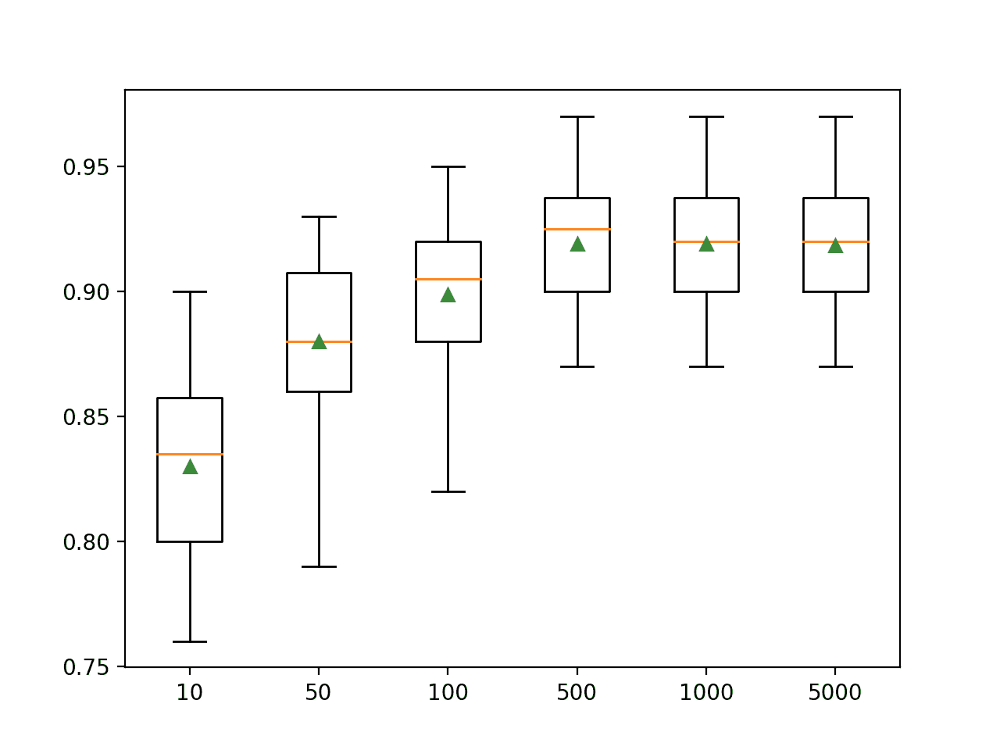
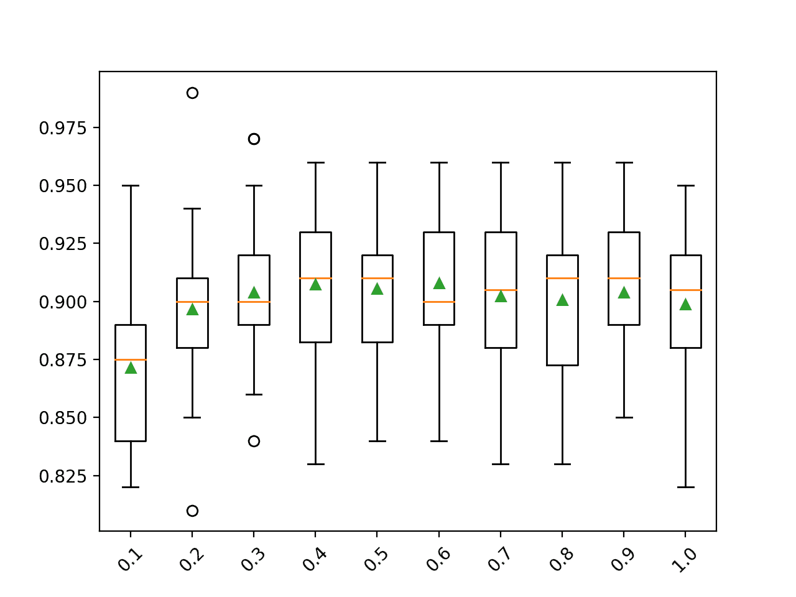
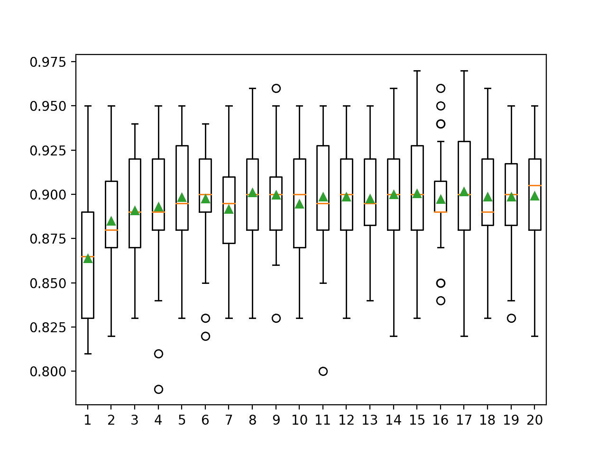
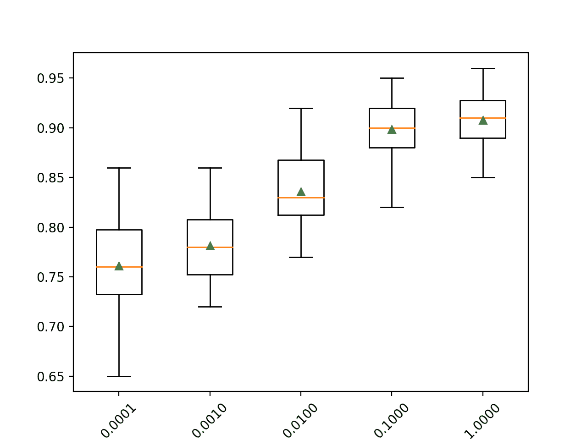

# 如何在 Python 中开发梯度提升机集成

> 原文：<https://machinelearningmastery.com/gradient-boosting-machine-ensemble-in-python/>

最后更新于 2021 年 4 月 27 日

梯度提升机是一个强大的集成机器学习算法，使用决策树。

增强是一种通用的集成技术，包括向集成中顺序添加模型，其中后续模型校正先前模型的表现。AdaBoost 是第一个兑现 boosting 承诺的算法。

梯度提升是 AdaBoosting 的推广，提高了方法的表现，并引入了自举聚合的思想来进一步改进模型，例如在拟合集成成员时随机采样样本和特征。

梯度提升在广泛的表格数据集上表现良好，即使不是最好的，也是[，像 XGBoost 和 LightBoost 这样的算法版本通常在](https://machinelearningmastery.com/start-with-gradient-boosting/)[赢得机器学习竞赛](https://machinelearningmastery.com/gentle-introduction-xgboost-applied-machine-learning/)中发挥重要作用。

在本教程中，您将发现如何为分类和回归开发梯度提升集成。

完成本教程后，您将知道:

*   梯度提升集成是由顺序添加到模型中的决策树创建的集成。
*   如何用 Sklearn 使用梯度提升集成进行分类和回归。
*   如何探索梯度提升模型超参数对模型表现的影响。

**用我的新书[Python 集成学习算法](https://machinelearningmastery.com/ensemble-learning-algorithms-with-python/)启动你的项目**，包括*分步教程*和所有示例的 *Python 源代码*文件。

我们开始吧。

*   **更新 2020 年 8 月**:增加了常见问题部分。添加了网格搜索示例。


如何开发 Python 中的梯度提升机集成
图片由 [Susanne Nilsson](https://flickr.com/photos/infomastern/21801164976/) 提供，保留部分权利。

## 教程概述

本教程分为五个部分；它们是:

1.  梯度提升算法
2.  梯度提升科学工具包-学习应用编程接口
    1.  用于分类的梯度提升
    2.  回归的梯度提升
3.  梯度提升超参数
    1.  探索树的数量
    2.  探索样本数量
    3.  探索功能数量
    4.  探索学习率
    5.  探索树的深度
4.  网格搜索超参数
5.  常见问题

## 梯度提升机算法

梯度提升是指一类集成机器学习算法，可用于分类或回归预测建模问题。

梯度提升也称为梯度树增强、随机梯度提升(扩展)和梯度提升机，简称 GBM。

集成是由决策树模型构建的。树被一次一个地添加到集合中，并且适合于校正由先前模型产生的预测误差。这是一种称为 boosting 的集成机器学习模型。

使用任意可微损失函数和梯度下降优化算法拟合模型。这给这项技术起了一个名字，“梯度提升”，因为随着模型的拟合，损失梯度被最小化，很像一个神经网络。

> 产生优化[成本]的加权分类器组合的一种方法是通过函数空间中的梯度下降

——[函数空间中梯度下降的增强算法](http://papers.nips.cc/paper/1766-boosting-algorithms-as-gradient-descent.pdf)，1999。

朴素梯度提升算法是一种贪婪算法，可以快速过度训练数据集。

它可以受益于惩罚算法各个部分的正则化方法，并且通常通过减少过拟合来提高算法的表现。

基本梯度提升有三种类型的增强可以提高表现:

*   **树约束**:比如树的深度和集成中使用的树的数量。
*   **加权更新**:比如一个学习率，用来限制每棵树对集成的贡献。
*   **随机采样**:比如在特征和样本的随机子集上拟合树。

随机采样的使用通常会导致算法名称更改为“*随机梯度提升*”

> ……在每次迭代中，从完整的训练数据集中随机抽取一个训练数据的子样本(没有替换)。然后使用随机选择的子样本，而不是整个样本，来适应基础学习器。

——[随机梯度提升](https://statweb.stanford.edu/~jhf/ftp/stobst.pdf)，1999。

梯度提升是一种有效的机器学习算法，并且通常是用于在表格和类似结构化数据集上赢得机器学习竞赛(如 Kaggle)的主要算法或主要算法之一。

有关梯度提升算法的更多信息，请参见教程:

*   [机器学习梯度提升算法的简单介绍](https://machinelearningmastery.com/gentle-introduction-gradient-boosting-algorithm-machine-learning/)

现在我们已经熟悉了梯度提升算法，让我们看看如何在 Python 中拟合 GBM 模型。

## 梯度提升科学工具包-学习应用编程接口

梯度提升集成可以从零开始实现，尽管对初学者来说很有挑战性。

Sklearn Python 机器学习库为机器学习提供了梯度提升集成的实现。

该算法在现代版本的库中可用。

首先，通过运行以下脚本来确认您使用的是现代版本的库:

```py
# check Sklearn version
import sklearn
print(sklearn.__version__)
```

运行脚本将打印您的 Sklearn 版本。

您的版本应该相同或更高。如果没有，您必须升级 Sklearn 库的版本。

```py
0.22.1
```

梯度提升通过[梯度提升回归器](https://Sklearn.org/stable/modules/generated/sklearn.ensemble.GradientBoostingRegressor.html)和[梯度提升分类器](https://Sklearn.org/stable/modules/generated/sklearn.ensemble.GradientBoostingClassifier.html)类提供。

这两个模型以相同的方式运行，并采用相同的参数来影响决策树的创建和添加。

随机性用于模型的构建。这意味着算法每次在相同的数据上运行时，都会产生稍微不同的模型。

当使用具有随机学习算法的机器学习算法时，最好通过在多次[运行或重复交叉验证](https://machinelearningmastery.com/k-fold-cross-validation/)中平均它们的表现来评估它们。当拟合最终模型时，可能需要增加树的数量，直到模型的方差在重复评估中减小，或者拟合多个最终模型并对它们的预测进行平均。

让我们看看如何为分类和回归开发一个梯度提升集成。

### 用于分类的梯度提升

在本节中，我们将研究如何使用梯度提升来解决分类问题。

首先，我们可以使用 [make_classification()函数](https://Sklearn.org/stable/modules/generated/sklearn.datasets.make_classification.html)创建一个包含 1000 个示例和 20 个输入特征的合成二进制分类问题。

下面列出了完整的示例。

```py
# test classification dataset
from sklearn.datasets import make_classification
# define dataset
X, y = make_classification(n_samples=1000, n_features=20, n_informative=15, n_redundant=5, random_state=7)
# summarize the dataset
print(X.shape, y.shape)
```

运行该示例将创建数据集并总结输入和输出组件的形状。

```py
(1000, 20) (1000,)
```

接下来，我们可以在这个数据集上评估一个梯度提升算法。

我们将使用重复的分层 k 折叠交叉验证来评估模型，重复 3 次，折叠 10 次。我们将报告所有重复和折叠的模型准确率的平均值和标准偏差。

```py
# evaluate gradient boosting algorithm for classification
from numpy import mean
from numpy import std
from sklearn.datasets import make_classification
from sklearn.model_selection import cross_val_score
from sklearn.model_selection import RepeatedStratifiedKFold
from sklearn.ensemble import GradientBoostingClassifier
# define dataset
X, y = make_classification(n_samples=1000, n_features=20, n_informative=15, n_redundant=5, random_state=7)
# define the model
model = GradientBoostingClassifier()
# define the evaluation method
cv = RepeatedStratifiedKFold(n_splits=10, n_repeats=3, random_state=1)
# evaluate the model on the dataset
n_scores = cross_val_score(model, X, y, scoring='accuracy', cv=cv, n_jobs=-1)
# report performance
print('Mean Accuracy: %.3f (%.3f)' % (mean(n_scores), std(n_scores)))
```

运行该示例会报告模型的均值和标准差准确率。

**注**:考虑到算法或评估程序的随机性，或数值准确率的差异，您的[结果可能会有所不同](https://machinelearningmastery.com/different-results-each-time-in-machine-learning/)。考虑运行该示例几次，并比较平均结果。

在这种情况下，我们可以看到带有默认超参数的梯度提升集成在这个测试数据集上实现了大约 89.9%的分类准确率。

```py
Mean Accuracy: 0.899 (0.030)
```

我们也可以使用梯度提升模型作为最终模型，并对分类进行预测。

首先，对所有可用数据进行梯度提升集成，然后调用 *predict()* 函数对新数据进行预测。

下面的示例在我们的二进制类别数据集上演示了这一点。

```py
# make predictions using gradient boosting for classification
from sklearn.datasets import make_classification
from sklearn.ensemble import GradientBoostingClassifier
# define dataset
X, y = make_classification(n_samples=1000, n_features=20, n_informative=15, n_redundant=5, random_state=7)
# define the model
model = GradientBoostingClassifier()
# fit the model on the whole dataset
model.fit(X, y)
# make a single prediction
row = [0.2929949, -4.21223056, -1.288332, -2.17849815, -0.64527665, 2.58097719, 0.28422388, -7.1827928, -1.91211104, 2.73729512, 0.81395695, 3.96973717, -2.66939799, 3.34692332, 4.19791821, 0.99990998, -0.30201875, -4.43170633, -2.82646737, 0.44916808]
yhat = model.predict([row])
# summarize prediction
print('Predicted Class: %d' % yhat[0])
```

运行该示例使梯度提升集成模型适合整个数据集，然后用于对新的数据行进行预测，就像我们在应用程序中使用该模型时可能做的那样。

```py
Predicted Class: 1
```

现在我们已经熟悉了使用梯度提升进行分类，让我们看看回归的应用编程接口。

### 回归的梯度提升

在本节中，我们将研究使用梯度提升来解决回归问题。

首先，我们可以使用[make _ revolution()函数](https://Sklearn.org/stable/modules/generated/sklearn.datasets.make_regression.html)创建一个包含 1000 个示例和 20 个输入特征的合成回归问题。

下面列出了完整的示例。

```py
# test regression dataset
from sklearn.datasets import make_regression
# define dataset
X, y = make_regression(n_samples=1000, n_features=20, n_informative=15, noise=0.1, random_state=7)
# summarize the dataset
print(X.shape, y.shape)
```

运行该示例将创建数据集并总结输入和输出组件的形状。

```py
(1000, 20) (1000,)
```

接下来，我们可以在这个数据集上评估一个梯度提升算法。

正如我们在上一节中所做的，我们将使用重复的 k-fold 交叉验证来评估模型，重复 3 次，重复 10 次。我们将报告所有重复和折叠模型的平均绝对误差(MAE)。Sklearn 库使 MAE 为负，因此它被最大化而不是最小化。这意味着负 MAE 越大越好，完美模型的 MAE 为 0。

下面列出了完整的示例。

```py
# evaluate gradient boosting ensemble for regression
from numpy import mean
from numpy import std
from sklearn.datasets import make_regression
from sklearn.model_selection import cross_val_score
from sklearn.model_selection import RepeatedKFold
from sklearn.ensemble import GradientBoostingRegressor
# define dataset
X, y = make_regression(n_samples=1000, n_features=20, n_informative=15, noise=0.1, random_state=7)
# define the model
model = GradientBoostingRegressor()
# define the evaluation procedure
cv = RepeatedKFold(n_splits=10, n_repeats=3, random_state=1)
# evaluate the model
n_scores = cross_val_score(model, X, y, scoring='neg_mean_absolute_error', cv=cv, n_jobs=-1)
# report performance
print('MAE: %.3f (%.3f)' % (mean(n_scores), std(n_scores)))
```

运行该示例会报告模型的均值和标准差准确率。

**注**:考虑到算法或评估程序的随机性，或数值准确率的差异，您的[结果可能会有所不同](https://machinelearningmastery.com/different-results-each-time-in-machine-learning/)。考虑运行该示例几次，并比较平均结果。

在这种情况下，我们可以看到带有默认超参数的梯度提升集成实现了大约 62 的 MAE。

```py
MAE: -62.475 (3.254)
```

我们也可以使用梯度提升模型作为最终模型，并对回归进行预测。

首先，梯度提升集合适合所有可用数据，然后可以调用 predict()函数对新数据进行预测。

下面的例子在我们的回归数据集上演示了这一点。

```py
# gradient boosting ensemble for making predictions for regression
from sklearn.datasets import make_regression
from sklearn.ensemble import GradientBoostingRegressor
# define dataset
X, y = make_regression(n_samples=1000, n_features=20, n_informative=15, noise=0.1, random_state=7)
# define the model
model = GradientBoostingRegressor()
# fit the model on the whole dataset
model.fit(X, y)
# make a single prediction
row = [0.20543991, -0.97049844, -0.81403429, -0.23842689, -0.60704084, -0.48541492, 0.53113006, 2.01834338, -0.90745243, -1.85859731, -1.02334791, -0.6877744, 0.60984819, -0.70630121, -1.29161497, 1.32385441, 1.42150747, 1.26567231, 2.56569098, -0.11154792]
yhat = model.predict([row])
# summarize prediction
print('Prediction: %d' % yhat[0])
```

运行该示例使梯度提升集成模型适合整个数据集，然后用于对新的数据行进行预测，就像我们在应用程序中使用该模型时可能做的那样。

```py
Prediction: 37
```

现在我们已经熟悉了使用 Sklearn API 来评估和使用 Gradient Boosting 集成，接下来让我们看看如何配置模型。

## 梯度提升超参数

在本节中，我们将仔细研究一些您应该考虑为梯度提升集成进行调整的超参数，以及它们对模型表现的影响。

可能有四个关键的超参数对模型表现有最大的影响，它们是集成中的模型数量、学习率、通过用于训练每个模型的数据样本的大小或用于树分裂的特征来控制的模型方差，最后是决策树的深度。

在本节中，我们将仔细研究这些超参数中的每一个单独的影响，尽管它们都相互作用，并且应该一起或成对调整，例如学习率与集成大小，以及样本大小/特征数量与树深度。

有关调整梯度提升算法的超参数的更多信息，请参见教程:

*   [如何配置梯度提升算法](https://machinelearningmastery.com/configure-gradient-boosting-algorithm/)

### 探索树的数量

梯度提升集成算法的一个重要超参数是集成中使用的决策树数量。

回想一下，决策树被顺序地添加到模型中，以努力纠正和改进先前的树所做的预测。因此，更多的树往往更好。树的数量也必须与学习率相平衡，例如，更多的树可能需要更小的学习率，更少的树可能需要更大的学习率。

树的数量可以通过“*n _ estimates*”参数设置，默认为 100。

下面的示例探讨了值在 10 到 5，000 之间的树的数量的影响。

```py
# explore gradient boosting number of trees effect on performance
from numpy import mean
from numpy import std
from sklearn.datasets import make_classification
from sklearn.model_selection import cross_val_score
from sklearn.model_selection import RepeatedStratifiedKFold
from sklearn.ensemble import GradientBoostingClassifier
from matplotlib import pyplot

# get the dataset
def get_dataset():
	X, y = make_classification(n_samples=1000, n_features=20, n_informative=15, n_redundant=5, random_state=7)
	return X, y

# get a list of models to evaluate
def get_models():
	models = dict()
	# define number of trees to consider
	n_trees = [10, 50, 100, 500, 1000, 5000]
	for n in n_trees:
		models[str(n)] = GradientBoostingClassifier(n_estimators=n)
	return models

# evaluate a given model using cross-validation
def evaluate_model(model, X, y):
	# define the evaluation procedure
	cv = RepeatedStratifiedKFold(n_splits=10, n_repeats=3, random_state=1)
	# evaluate the model and collect the results
	scores = cross_val_score(model, X, y, scoring='accuracy', cv=cv, n_jobs=-1)
	return scores

# define dataset
X, y = get_dataset()
# get the models to evaluate
models = get_models()
# evaluate the models and store results
results, names = list(), list()
for name, model in models.items():
	# evaluate the model
	scores = evaluate_model(model, X, y)
	# store the results
	results.append(scores)
	names.append(name)
	# summarize the performance along the way
	print('>%s %.3f (%.3f)' % (name, mean(scores), std(scores)))
# plot model performance for comparison
pyplot.boxplot(results, labels=names, showmeans=True)
pyplot.show()
```

运行该示例首先报告每个配置数量的决策树的平均准确性。

**注**:考虑到算法或评估程序的随机性，或数值准确率的差异，您的[结果可能会有所不同](https://machinelearningmastery.com/different-results-each-time-in-machine-learning/)。考虑运行该示例几次，并比较平均结果。

在这种情况下，我们可以看到该数据集上的表现有所提高，直到大约 500 棵树，之后表现似乎趋于平稳。与 AdaBoost 不同，在这种情况下，随着树的数量增加，梯度提升似乎不会过度。

```py
>10 0.830 (0.037)
>50 0.880 (0.033)
>100 0.899 (0.030)
>500 0.919 (0.025)
>1000 0.919 (0.025)
>5000 0.918 (0.026)
```

为每个配置数量的树的准确度分数的分布创建一个方框和须图。

我们可以看到模型表现和集合规模增加的总体趋势。



梯度提升集合大小与分类准确率的箱线图

### 探索样本数量

用于拟合每棵树的样本数量可以变化。这意味着每棵树都适合随机选择的训练数据集子集。

使用更少的样本会为每棵树引入更多的方差，尽管这可以提高模型的整体表现。

用于拟合每棵树的样本数量由“*子样本*参数指定，并且可以设置为训练数据集大小的一小部分。默认情况下，它被设置为 1.0 以使用整个训练数据集。

下面的示例演示了样本大小对模型表现的影响。

```py
# explore gradient boosting ensemble number of samples effect on performance
from numpy import mean
from numpy import std
from numpy import arange
from sklearn.datasets import make_classification
from sklearn.model_selection import cross_val_score
from sklearn.model_selection import RepeatedStratifiedKFold
from sklearn.ensemble import GradientBoostingClassifier
from matplotlib import pyplot

# get the dataset
def get_dataset():
	X, y = make_classification(n_samples=1000, n_features=20, n_informative=15, n_redundant=5, random_state=7)
	return X, y

# get a list of models to evaluate
def get_models():
	models = dict()
	# explore sample ratio from 10% to 100% in 10% increments
	for i in arange(0.1, 1.1, 0.1):
		key = '%.1f' % i
		models[key] = GradientBoostingClassifier(subsample=i)
	return models

# evaluate a given model using cross-validation
def evaluate_model(model, X, y):
	# define the evaluation procedure
	cv = RepeatedStratifiedKFold(n_splits=10, n_repeats=3, random_state=1)
	# evaluate the model and collect the results
	scores = cross_val_score(model, X, y, scoring='accuracy', cv=cv, n_jobs=-1)
	return scores

# define dataset
X, y = get_dataset()
# get the models to evaluate
models = get_models()
# evaluate the models and store results
results, names = list(), list()
for name, model in models.items():
	# evaluate the model
	scores = evaluate_model(model, X, y)
	# store the results
	results.append(scores)
	names.append(name)
	# summarize the performance along the way
	print('>%s %.3f (%.3f)' % (name, mean(scores), std(scores)))
# plot model performance for comparison
pyplot.boxplot(results, labels=names, showmeans=True)
pyplot.show()
```

运行示例首先报告每个配置样本大小的平均准确度。

**注**:考虑到算法或评估程序的随机性，或数值准确率的差异，您的[结果可能会有所不同](https://machinelearningmastery.com/different-results-each-time-in-machine-learning/)。考虑运行该示例几次，并比较平均结果。

在这种情况下，我们可以看到平均表现对于大约是训练数据集一半大小的样本来说可能是最好的，例如 0.4 或更高。

```py
>0.1 0.872 (0.033)
>0.2 0.897 (0.032)
>0.3 0.904 (0.029)
>0.4 0.907 (0.032)
>0.5 0.906 (0.027)
>0.6 0.908 (0.030)
>0.7 0.902 (0.032)
>0.8 0.901 (0.031)
>0.9 0.904 (0.031)
>1.0 0.899 (0.030)
```

为每个配置数量的树的准确度分数的分布创建一个方框和须图。

我们可以看到提高模型表现的总体趋势，可能在 0.4 左右达到峰值，并保持一定水平。



梯度提升集合样本量与分类准确率的箱线图

### 探索功能数量

用于拟合每个决策树的特征数量可以变化。

像改变样本的数量一样，改变特征的数量会在模型中引入额外的方差，这可能会提高表现，尽管这可能需要增加树的数量。

每个树使用的特征数量被视为随机样本，由“ *max_features* ”参数指定，默认为训练数据集中的所有特征。

下面的示例探讨了 1 到 20 之间的测试数据集的特征数量对模型表现的影响。

```py
# explore gradient boosting number of features on performance
from numpy import mean
from numpy import std
from sklearn.datasets import make_classification
from sklearn.model_selection import cross_val_score
from sklearn.model_selection import RepeatedStratifiedKFold
from sklearn.ensemble import GradientBoostingClassifier
from matplotlib import pyplot

# get the dataset
def get_dataset():
	X, y = make_classification(n_samples=1000, n_features=20, n_informative=15, n_redundant=5, random_state=7)
	return X, y

# get a list of models to evaluate
def get_models():
	models = dict()
	# explore number of features from 1 to 20
	for i in range(1,21):
		models[str(i)] = GradientBoostingClassifier(max_features=i)
	return models

# evaluate a given model using cross-validation
def evaluate_model(model, X, y):
	# define the evaluation procedure
	cv = RepeatedStratifiedKFold(n_splits=10, n_repeats=3, random_state=1)
	# evaluate the model and collect the results
	scores = cross_val_score(model, X, y, scoring='accuracy', cv=cv, n_jobs=-1)
	return scores

# define dataset
X, y = get_dataset()
# get the models to evaluate
models = get_models()
# evaluate the models and store results
results, names = list(), list()
for name, model in models.items():
	# evaluate the model
	scores = evaluate_model(model, X, y)
	# store the results
	results.append(scores)
	names.append(name)
	# summarize the performance along the way
	print('>%s %.3f (%.3f)' % (name, mean(scores), std(scores)))
# plot model performance for comparison
pyplot.boxplot(results, labels=names, showmeans=True)
pyplot.show()
```

运行该示例首先报告每个已配置特征数量的平均准确率。

**注**:考虑到算法或评估程序的随机性，或数值准确率的差异，您的[结果可能会有所不同](https://machinelearningmastery.com/different-results-each-time-in-machine-learning/)。考虑运行该示例几次，并比较平均结果。

在这种情况下，我们可以看到平均表现增加到功能数量的一半左右，并且在此之后保持一定水平。令人惊讶的是，去掉一半的输入变量效果如此之小。

```py
>1 0.864 (0.036)
>2 0.885 (0.032)
>3 0.891 (0.031)
>4 0.893 (0.036)
>5 0.898 (0.030)
>6 0.898 (0.032)
>7 0.892 (0.032)
>8 0.901 (0.032)
>9 0.900 (0.029)
>10 0.895 (0.034)
>11 0.899 (0.032)
>12 0.899 (0.030)
>13 0.898 (0.029)
>14 0.900 (0.033)
>15 0.901 (0.032)
>16 0.897 (0.028)
>17 0.902 (0.034)
>18 0.899 (0.032)
>19 0.899 (0.032)
>20 0.899 (0.030)
```

为每个配置数量的树的准确度分数的分布创建一个方框和须图。

我们可以看到提高模型表现的总体趋势，可能在八九个特性左右达到峰值，并保持一定水平。



梯度提升集成特征数量与分类准确率的箱线图

### 探索学习率

学习率控制每个模型对集成预测的贡献量。

较小的速率可能需要集成中更多的决策树，而较大的速率可能需要具有较少树的集成。在对数标度上探索学习率值是很常见的，例如在非常小的值如 0.0001 和 1.0 之间。

学习率可以通过“ *learning_rate* ”参数控制，默认为 0.1。

下面的示例探讨了学习率，并比较了 0.0001 和 1.0 之间的值的效果。

```py
# explore gradient boosting ensemble learning rate effect on performance
from numpy import mean
from numpy import std
from sklearn.datasets import make_classification
from sklearn.model_selection import cross_val_score
from sklearn.model_selection import RepeatedStratifiedKFold
from sklearn.ensemble import GradientBoostingClassifier
from matplotlib import pyplot

# get the dataset
def get_dataset():
	X, y = make_classification(n_samples=1000, n_features=20, n_informative=15, n_redundant=5, random_state=7)
	return X, y

# get a list of models to evaluate
def get_models():
	models = dict()
	# define learning rates to explore
	for i in [0.0001, 0.001, 0.01, 0.1, 1.0]:
		key = '%.4f' % i
		models[key] = GradientBoostingClassifier(learning_rate=i)
	return models

# evaluate a given model using cross-validation
def evaluate_model(model, X, y):
	# define the evaluation procedure
	cv = RepeatedStratifiedKFold(n_splits=10, n_repeats=3, random_state=1)
	# evaluate the model and collect the results
	scores = cross_val_score(model, X, y, scoring='accuracy', cv=cv, n_jobs=-1)
	return scores

# define dataset
X, y = get_dataset()
# get the models to evaluate
models = get_models()
# evaluate the models and store results
results, names = list(), list()
for name, model in models.items():
	# evaluate the model
	scores = evaluate_model(model, X, y)
	# store the results
	results.append(scores)
	names.append(name)
	# summarize the performance along the way
	print('>%s %.3f (%.3f)' % (name, mean(scores), std(scores)))
# plot model performance for comparison
pyplot.boxplot(results, labels=names, showmeans=True)
pyplot.show()
```

运行示例首先报告每个配置的学习率的平均准确性。

**注**:考虑到算法或评估程序的随机性，或数值准确率的差异，您的[结果可能会有所不同](https://machinelearningmastery.com/different-results-each-time-in-machine-learning/)。考虑运行该示例几次，并比较平均结果。

在这种情况下，我们可以看到，较大的学习率会在该数据集上产生更好的表现。我们预计，为较小的学习率向集合中添加更多的树将进一步提升表现。

这突出了树的数量(训练速度)和学习率之间的权衡，例如，我们可以通过使用更少的树和更大的学习率来更快地拟合模型。

```py
>0.0001 0.761 (0.043)
>0.0010 0.781 (0.034)
>0.0100 0.836 (0.034)
>0.1000 0.899 (0.030)
>1.0000 0.908 (0.025)
```

为每个配置数量的树的准确度分数的分布创建一个方框和须图。

我们可以看到模型表现随着学习率的提高而提高的总趋势。



梯度提升集成学习率与分类准确率的箱线图

### 探索树的深度

就像改变用于拟合每棵决策树的样本和特征的数量一样，改变每棵树的深度是梯度提升的另一个重要超参数。

树深度控制每棵树对训练数据集的专门化程度:它可能有多一般或多复杂。优选不太浅和一般的树(如 AdaBoost)，不太深和专门化的树(如[引导聚合](https://machinelearningmastery.com/implement-bagging-scratch-python/))。

梯度提升在中等深度的树中表现良好，在技能和通用性之间找到了平衡。

树深度通过“*最大深度*参数控制，默认为 3。

下面的示例探讨了 1 到 10 之间的树深度以及对模型表现的影响。

```py
# explore gradient boosting tree depth effect on performance
from numpy import mean
from numpy import std
from sklearn.datasets import make_classification
from sklearn.model_selection import cross_val_score
from sklearn.model_selection import RepeatedStratifiedKFold
from sklearn.ensemble import GradientBoostingClassifier
from matplotlib import pyplot

# get the dataset
def get_dataset():
	X, y = make_classification(n_samples=1000, n_features=20, n_informative=15, n_redundant=5, random_state=7)
	return X, y

# get a list of models to evaluate
def get_models():
	models = dict()
	# define max tree depths to explore between 1 and 10
	for i in range(1,11):
		models[str(i)] = GradientBoostingClassifier(max_depth=i)
	return models

# evaluate a given model using cross-validation
def evaluate_model(model, X, y):
	# define the evaluation procedure
	cv = RepeatedStratifiedKFold(n_splits=10, n_repeats=3, random_state=1)
	# evaluate the model and collect the results
	scores = cross_val_score(model, X, y, scoring='accuracy', cv=cv, n_jobs=-1)
	return scores

# define dataset
X, y = get_dataset()
# get the models to evaluate
models = get_models()
# evaluate the models and store results
results, names = list(), list()
for name, model in models.items():
	# evaluate the model
	scores = evaluate_model(model, X, y)
	# store the results
	results.append(scores)
	names.append(name)
	# summarize the performance along the way
	print('>%s %.3f (%.3f)' % (name, mean(scores), std(scores)))
# plot model performance for comparison
pyplot.boxplot(results, labels=names, showmeans=True)
pyplot.show()
```

运行该示例首先报告每个配置的树深度的平均准确率。

**注**:考虑到算法或评估程序的随机性，或数值准确率的差异，您的[结果可能会有所不同](https://machinelearningmastery.com/different-results-each-time-in-machine-learning/)。考虑运行该示例几次，并比较平均结果。

在这种情况下，我们可以看到表现随着树的深度而提高，可能在深度 3 到 6 左右达到峰值，之后更深、更专门化的树会导致表现下降。

```py
>1 0.834 (0.031)
>2 0.877 (0.029)
>3 0.899 (0.030)
>4 0.905 (0.032)
>5 0.916 (0.030)
>6 0.912 (0.031)
>7 0.908 (0.033)
>8 0.888 (0.031)
>9 0.853 (0.036)
>10 0.835 (0.034)
```

为每个配置的树深度的准确率分数分布创建一个方框和须图。

我们可以看到模型表现随着树的深度增加到一定程度的总体趋势，之后表现开始随着过度专门化的树而迅速下降。


梯度提升集成树深度与分类准确率的箱线图

## 网格搜索超参数

梯度提升对算法的配置具有挑战性，因为许多影响模型在训练数据上的行为的关键超参数和超参数相互作用。

因此，使用搜索过程来发现模型超参数的配置是一个好的实践，该配置对于给定的预测建模问题是有效的或最好的。流行的搜索过程包括随机搜索和网格搜索。

在这一节中，我们将看到网格搜索的关键超参数的共同范围的梯度提升算法，你可以使用作为你自己的项目的起点。这可以通过使用 *GridSearchCV* 类并指定将模型超参数名称映射到要搜索的值的字典来实现。

在这种情况下，我们将网格搜索梯度提升的四个关键超参数:集成中使用的树的数量、学习率、用于训练每棵树的子样本大小以及每棵树的最大深度。我们将为每个超参数使用一系列流行的表现良好的值。

每个配置组合将使用重复的 k 倍交叉验证进行评估，配置将使用平均得分进行比较，在这种情况下，使用分类准确率。

下面列出了在我们的合成类别数据集上网格搜索梯度提升算法的关键超参数的完整示例。

```py
# example of grid searching key hyperparameters for gradient boosting on a classification dataset
from sklearn.datasets import make_classification
from sklearn.model_selection import RepeatedStratifiedKFold
from sklearn.model_selection import GridSearchCV
from sklearn.ensemble import GradientBoostingClassifier
# define dataset
X, y = make_classification(n_samples=1000, n_features=20, n_informative=15, n_redundant=5, random_state=7)
# define the model with default hyperparameters
model = GradientBoostingClassifier()
# define the grid of values to search
grid = dict()
grid['n_estimators'] = [10, 50, 100, 500]
grid['learning_rate'] = [0.0001, 0.001, 0.01, 0.1, 1.0]
grid['subsample'] = [0.5, 0.7, 1.0]
grid['max_depth'] = [3, 7, 9]
# define the evaluation procedure
cv = RepeatedStratifiedKFold(n_splits=10, n_repeats=3, random_state=1)
# define the grid search procedure
grid_search = GridSearchCV(estimator=model, param_grid=grid, n_jobs=-1, cv=cv, scoring='accuracy')
# execute the grid search
grid_result = grid_search.fit(X, y)
# summarize the best score and configuration
print("Best: %f using %s" % (grid_result.best_score_, grid_result.best_params_))
# summarize all scores that were evaluated
means = grid_result.cv_results_['mean_test_score']
stds = grid_result.cv_results_['std_test_score']
params = grid_result.cv_results_['params']
for mean, stdev, param in zip(means, stds, params):
    print("%f (%f) with: %r" % (mean, stdev, param))
```

运行该示例可能需要一段时间，具体取决于您的硬件。在运行结束时，首先报告获得最佳分数的配置，然后是所考虑的所有其他配置的分数。

**注**:考虑到算法或评估程序的随机性，或数值准确率的差异，您的[结果可能会有所不同](https://machinelearningmastery.com/different-results-each-time-in-machine-learning/)。考虑运行该示例几次，并比较平均结果。

在这种情况下，我们可以看到，学习率为 0.1、最大深度为 7 级、500 棵树和子样本为 70%的配置表现最好，分类准确率约为 94.6%。

尽管在这种情况下没有测试这些配置，以确保网格搜索在合理的时间内完成，但该模型在有更多树(如 1000 或 5000 棵树)的情况下可能会表现得更好。

```py
Best: 0.946667 using {'learning_rate': 0.1, 'max_depth': 7, 'n_estimators': 500, 'subsample': 0.7}
0.529667 (0.089012) with: {'learning_rate': 0.0001, 'max_depth': 3, 'n_estimators': 10, 'subsample': 0.5}
0.525667 (0.077875) with: {'learning_rate': 0.0001, 'max_depth': 3, 'n_estimators': 10, 'subsample': 0.7}
0.524000 (0.072874) with: {'learning_rate': 0.0001, 'max_depth': 3, 'n_estimators': 10, 'subsample': 1.0}
0.772667 (0.037500) with: {'learning_rate': 0.0001, 'max_depth': 3, 'n_estimators': 50, 'subsample': 0.5}
0.767000 (0.037696) with: {'learning_rate': 0.0001, 'max_depth': 3, 'n_estimators': 50, 'subsample': 0.7}
...
```

## 常见问题

在这一节中，我们将仔细看看梯度提升集成过程中的一些常见症结。

**问:集成应该用什么算法？**

从技术上讲，任何支持实例加权的高方差算法都可以用作集成的基础。

用于速度和模型表现的最常见算法是具有有限树深度的决策树，例如在 4 到 8 级之间。

**问:应该用多少个文工团成员？**

集成中的树的数量应该根据数据集的具体情况和其他超参数(如学习率)进行调整。

**问:文工团不会因为树木太多而过度吗？**

是的，梯度推进模型可能会过度。

使用搜索过程(如网格搜索)仔细选择模型超参数非常重要。

学习率，也称为收缩，可以设置为较小的值，以便随着集成中使用的模型数量的增加而降低学习率，进而降低过拟合的影响。

**问:梯度提升有哪些弊端？**

梯度提升可能很难配置，通常需要网格搜索或类似的搜索过程。

训练梯度提升模型可能非常慢，因为树必须按顺序添加，不像基于装袋和堆叠的模型，集成成员可以并行训练。

**问:哪些问题很适合提振？**

梯度提升在广泛的回归和分类预测建模问题上表现良好。

它可能是结构化数据(表格数据)最流行的算法之一，因为它的平均表现非常好。

## 进一步阅读

如果您想更深入地了解这个主题，本节将提供更多资源。

### 教程

*   [机器学习梯度提升算法的简单介绍](https://machinelearningmastery.com/gentle-introduction-gradient-boosting-algorithm-machine-learning/)
*   [如何配置梯度提升算法](https://machinelearningmastery.com/configure-gradient-boosting-algorithm/)
*   [使用 Sklearn、XGBoost、LightGBM 和 CatBoost 进行梯度提升](https://machinelearningmastery.com/gradient-boosting-with-Sklearn-xgboost-lightgbm-and-catboost/)

### 报纸

*   [弧边](http://statistics.berkeley.edu/sites/default/files/tech-reports/486.pdf)，1998。
*   [随机梯度推进](https://statweb.stanford.edu/~jhf/ftp/stobst.pdf)，1999。
*   [函数空间中梯度下降的增强算法](http://maths.dur.ac.uk/~dma6kp/pdf/face_recognition/Boosting/Mason99AnyboostLong.pdf)，1999。

### 蜜蜂

*   [硬化。一起。梯度提升器 API](https://Sklearn.org/stable/modules/generated/sklearn.ensemble.GradientBoostingRegressor.html) 。
*   [硬化。集合。梯度提升器 API](https://Sklearn.org/stable/modules/generated/sklearn.ensemble.GradientBoostingClassifier.html) 。

### 文章

*   [梯度提升，维基百科](https://en.wikipedia.org/wiki/Gradient_boosting)。

## 摘要

在本教程中，您发现了如何为分类和回归开发梯度提升集成。

具体来说，您了解到:

*   梯度提升集成是由顺序添加到模型中的决策树创建的集成。
*   如何用 Sklearn 使用梯度提升集成进行分类和回归。
*   如何探索梯度提升模型超参数对模型表现的影响。

**你有什么问题吗？**
在下面的评论中提问，我会尽力回答。