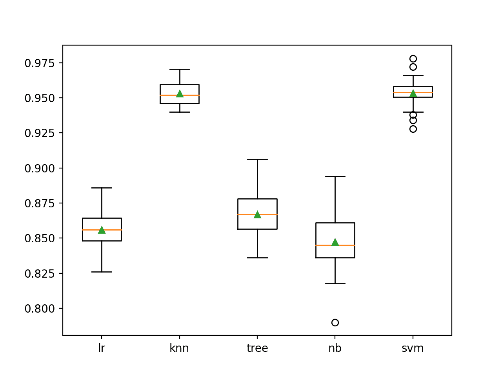

# Python 中的生长和修剪集成

> 原文：<https://machinelearningmastery.com/growing-and-pruning-ensembles-in-python/>

集成成员选择是指优化集成组成的算法。

这可能涉及从可用模型中生长一个集合，或者从完全定义的集合中修剪成员。

目标通常是在对集成表现影响很小或没有影响的情况下降低集成的模型或计算复杂度，并且在某些情况下找到比直接盲目使用所有贡献模型更好的集成成员组合。

在本教程中，您将发现如何从零开始开发集成选择算法。

完成本教程后，您将知道:

*   集成选择包括选择集成成员的子集，这导致比使用所有成员更低的复杂性，有时还会带来更好的表现。
*   如何开发和评估贪婪集成剪枝分类算法？
*   如何开发和评估一个算法贪婪地从零开始增长一个集合。

**用我的新书[Python 集成学习算法](https://machinelearningmastery.com/ensemble-learning-algorithms-with-python/)启动你的项目**，包括*分步教程*和所有示例的 *Python 源代码*文件。

我们开始吧。


Python 中的生长和修剪集成
图片由 [FaBio C](https://www.flickr.com/photos/125514109@N07/50099882653/) 提供，保留部分权利。

## 教程概述

本教程分为四个部分；它们是:

1.  全体成员选择
2.  基线模型和投票
3.  集成修剪示例
4.  集合增长示例

## 全体成员选择

[投票](https://machinelearningmastery.com/voting-ensembles-with-python/)和[堆叠](https://machinelearningmastery.com/stacking-ensemble-machine-learning-with-python/)集合通常会组合来自一组不同模型类型的预测。

虽然集成团可能有大量的集成成员，但很难知道集成团正在使用最佳的成员组合。例如，不是简单地使用所有成员，而是可以通过添加一个或多个不同的模型类型或删除一个或多个模型来获得更好的结果。

这可以通过使用加权平均集成和使用优化算法为每个成员找到合适的权重来解决，允许一些成员具有零权重，这有效地将他们从集成中移除。加权平均集合的问题是，所有模型仍然是集合的一部分，这可能需要比开发和维护更复杂的集合。

另一种方法是优化集成本身的构成。自动选择或优化集成成员的一般方法被称为集成选择。

两种常见的方法包括集成生长和集成修剪。

*   **集成成长**:向集成中添加成员，直到没有观察到进一步的改善。
*   **集合修剪**:从集合中移除成员，直到没有观察到进一步的改进。

**集成增长**是一种技术，其中模型从没有成员开始，并涉及添加新成员，直到没有观察到进一步的改进。这可以用贪婪的方式来执行，一次只添加一个成员，前提是它们导致模型表现的提高。

**集成修剪**是一种技术，其中模型从所有正在考虑的可能成员开始，并从集成中移除成员，直到没有观察到进一步的改进。这可以以贪婪的方式执行，即每次移除一个成员，并且仅当移除成员导致整体集合的表现提升时。

> 给定一组经过训练的个体学习器，而不是组合所有的学习器，集成修剪试图选择个体学习器的子集来组成集成。

—第 119 页，[集成方法:基础和算法](https://amzn.to/2TavTcy)，2012。

集合修剪和增长的优点在于，它可以导致具有较小尺寸(较低复杂度)的集合和/或具有更好预测表现的集合。有时，如果能够大幅降低模型复杂性和维护负担，表现的小幅下降是可取的。或者，在某些项目中，预测技能比所有其他关注点都更重要，集成选择提供了另一种策略来尝试并充分利用贡献模型。

> 减少集成大小主要有两个原因:a)减少计算开销:较小的集成需要较少的计算开销；b)提高准确性:集成中的一些成员可能会降低整体的预测表现。

—第 119 页，[使用集成方法的模式分类](https://amzn.to/2zxc0F7)，2010。

出于计算效率的原因，在期望少量集成成员表现更好的情况下，集成增长可能是优选的，而在期望大量集成成员表现更好的情况下，集成修剪将更有效。

简单的贪婪集成生长和修剪与逐步特征选择技术有很多共同之处，例如回归中使用的技术(例如所谓的逐步回归)。

可以使用更复杂的技术，例如基于成员在数据集上的独立表现来选择要添加到集合或从集合中移除的成员，或者甚至通过使用全局搜索过程来尝试找到导致最佳整体表现的集合成员的组合。

> 人们可以在可能的不同集成子集的空间中执行启发式搜索，同时评估候选子集的集体价值。

—第 123 页，[使用集成方法的模式分类](https://amzn.to/2zxc0F7)，2010。

现在我们已经熟悉了集成选择方法，让我们来探索如何在 Sklearn 中实现集成修剪和集成增长。

## 基线模型和投票

在我们深入开发生长和修剪集成之前，让我们首先建立一个数据集和基线。

我们将使用一个综合二分类问题作为本研究的基础，由 [make_classification()函数](https://Sklearn.org/stable/modules/generated/sklearn.datasets.make_classification.html)定义，有 5000 个例子和 20 个数字输入特征。

下面的示例定义了数据集并总结了其大小。

```py
# test classification dataset
from sklearn.datasets import make_classification
# define dataset
X, y = make_classification(n_samples=5000, n_features=20, n_informative=10, n_redundant=10, random_state=1)
# summarize the dataset
print(X.shape, y.shape)
```

运行该示例以可重复的方式创建数据集，并报告行数和输入要素，符合我们的预期。

```py
(5000, 20) (5000,)
```

接下来，我们可以选择一些候选模型，为我们的集成提供基础。

我们将使用五种标准的机器学习模型，包括逻辑回归、朴素贝叶斯、决策树、支持向量机和 k 近邻算法。

首先，我们可以定义一个函数，用默认超参数创建每个模型。每个模型将被定义为一个具有名称和模型对象的元组，然后被添加到列表中。这是一个有用的结构，既可以枚举模型及其名称，用于独立评估，也可以在以后的集合中使用。

下面的 *get_models()* 函数实现了这一点，并返回要考虑的模型列表。

```py
# get a list of models to evaluate
def get_models():
	models = list()
	models.append(('lr', LogisticRegression()))
	models.append(('knn', KNeighborsClassifier()))
	models.append(('tree', DecisionTreeClassifier()))
	models.append(('nb', GaussianNB()))
	models.append(('svm', SVC(probability=True)))
	return models
```

然后，我们可以定义一个函数，该函数接受单个模型和数据集，并评估模型在数据集上的表现。我们将使用[重复分层 k-fold 交叉验证](https://machinelearningmastery.com/repeated-k-fold-cross-validation-with-python/)来评估一个模型，该模型有 10 次折叠和 3 次重复，这是机器学习中的一个良好实践。

下面的 *evaluate_model()* 函数实现了这一点，并返回所有折叠和重复的分数列表。

```py
# evaluate a give model using cross-validation
def evaluate_model(model, X, y):
	# define the model evaluation procedure
	cv = RepeatedStratifiedKFold(n_splits=10, n_repeats=3, random_state=1)
	# evaluate the model
	scores = cross_val_score(model, X, y, scoring='accuracy', cv=cv, n_jobs=-1)
	return scores
```

然后，我们可以创建模型列表并枚举它们，依次报告每个模型在合成数据集上的表现。

将这些联系在一起，完整的示例如下所示。

```py
# evaluate standard models on the synthetic dataset
from numpy import mean
from numpy import std
from sklearn.datasets import make_classification
from sklearn.model_selection import cross_val_score
from sklearn.model_selection import RepeatedStratifiedKFold
from sklearn.linear_model import LogisticRegression
from sklearn.neighbors import KNeighborsClassifier
from sklearn.tree import DecisionTreeClassifier
from sklearn.svm import SVC
from sklearn.naive_bayes import GaussianNB
from matplotlib import pyplot

# get the dataset
def get_dataset():
	X, y = make_classification(n_samples=5000, n_features=20, n_informative=10, n_redundant=10, random_state=1)
	return X, y

# get a list of models to evaluate
def get_models():
	models = list()
	models.append(('lr', LogisticRegression()))
	models.append(('knn', KNeighborsClassifier()))
	models.append(('tree', DecisionTreeClassifier()))
	models.append(('nb', GaussianNB()))
	models.append(('svm', SVC(probability=True)))
	return models

# evaluate a give model using cross-validation
def evaluate_model(model, X, y):
	# define the model evaluation procedure
	cv = RepeatedStratifiedKFold(n_splits=10, n_repeats=3, random_state=1)
	# evaluate the model
	scores = cross_val_score(model, X, y, scoring='accuracy', cv=cv, n_jobs=-1)
	return scores

# define dataset
X, y = get_dataset()
# get the models to evaluate
models = get_models()
# evaluate the models and store results
results, names = list(), list()
for name, model in models:
	# evaluate model
	scores = evaluate_model(model, X, y)
	# store results
	results.append(scores)
	names.append(name)
	# summarize result
	print('>%s %.3f (%.3f)' % (name, mean(scores), std(scores)))
# plot model performance for comparison
pyplot.boxplot(results, labels=names, showmeans=True)
pyplot.show()
```

运行该示例会评估合成二进制类别数据集上的每个独立机器学习算法。

**注**:考虑到算法或评估程序的随机性，或数值准确率的差异，您的[结果可能会有所不同](https://machinelearningmastery.com/different-results-each-time-in-machine-learning/)。考虑运行该示例几次，并比较平均结果。

在这种情况下，我们可以看到 KNN 模型和 SVM 模型在这个数据集上表现最好，实现了大约 95.3%的平均分类准确率。

这些结果提供了一个表现基线，我们要求任何集成都要超过这个基线，才能被认为对这个数据集有用。

```py
>lr 0.856 (0.014)
>knn 0.953 (0.008)
>tree 0.867 (0.014)
>nb 0.847 (0.021)
>svm 0.953 (0.010)
```

创建一个图形，显示每个算法的准确度分数分布的方框图和触须图。

我们可以看到，KNN 和 SVM 算法的表现比其他算法好得多，尽管所有算法在不同方面都很熟练。这可能会让他们成为集成团中值得考虑的好人选。



独立机器学习模型分类准确率的盒须图

接下来，我们需要建立一个使用所有模型的基线集合。这将提供一个与生长和修剪方法的比较点，生长和修剪方法寻求用更小的模型子集获得更好的表现。

在这种情况下，我们将使用带有软投票的[投票集合](https://machinelearningmastery.com/voting-ensembles-with-python/)。这意味着每个模型将预测概率，并且概率将由集成模型求和，以选择每个输入样本的最终输出预测。

这可以通过使用 [VotingClassifier](https://Sklearn.org/stable/modules/generated/sklearn.ensemble.VotingClassifier.html) 类来实现，其中成员是通过“*估计器*参数来设置的，该参数需要一个模型列表，其中每个模型都是一个具有名称和配置的模型对象的元组，就像我们在上一节中定义的那样。

然后，我们可以通过“*投票*”参数设置要执行的投票类型，在本例中，该参数设置为“*软*”

```py
...
# create the ensemble
ensemble = VotingClassifier(estimators=models, voting='soft')
```

将这些联系在一起，下面的示例评估了合成二进制类别数据集上所有五个模型的投票集合。

```py
# example of a voting ensemble with soft voting of ensemble members
from numpy import mean
from numpy import std
from sklearn.datasets import make_classification
from sklearn.model_selection import cross_val_score
from sklearn.model_selection import RepeatedStratifiedKFold
from sklearn.linear_model import LogisticRegression
from sklearn.neighbors import KNeighborsClassifier
from sklearn.tree import DecisionTreeClassifier
from sklearn.svm import SVC
from sklearn.naive_bayes import GaussianNB
from sklearn.ensemble import VotingClassifier

# get the dataset
def get_dataset():
	X, y = make_classification(n_samples=5000, n_features=20, n_informative=10, n_redundant=10, random_state=1)
	return X, y

# get a list of models to evaluate
def get_models():
	models = list()
	models.append(('lr', LogisticRegression()))
	models.append(('knn', KNeighborsClassifier()))
	models.append(('tree', DecisionTreeClassifier()))
	models.append(('nb', GaussianNB()))
	models.append(('svm', SVC(probability=True)))
	return models

# define dataset
X, y = get_dataset()
# get the models to evaluate
models = get_models()
# create the ensemble
ensemble = VotingClassifier(estimators=models, voting='soft')
# define the evaluation procedure
cv = RepeatedStratifiedKFold(n_splits=10, n_repeats=3, random_state=1)
# evaluate the ensemble
scores = cross_val_score(ensemble, X, y, scoring='accuracy', cv=cv, n_jobs=-1)
# summarize the result
print('Mean Accuracy: %.3f (%.3f)' % (mean(scores), std(scores)))
```

运行该示例使用重复的分层 k 折叠交叉验证来评估所有模型的软投票集合，并报告所有折叠和重复的平均准确性。

**注**:考虑到算法或评估程序的随机性，或数值准确率的差异，您的[结果可能会有所不同](https://machinelearningmastery.com/different-results-each-time-in-machine-learning/)。考虑运行该示例几次，并比较平均结果。

在这种情况下，我们可以看到投票集合实现了大约 92.8%的平均准确率。这比单独使用的 SVM 和 KNN 模型要低，后者的准确率约为 95.3%。

该结果强调了所有模型的简单投票集合导致在这种情况下模型具有更高的复杂性和更差的表现。也许我们可以找到一个成员子集，它比任何单个模型表现得更好，并且比简单地使用所有模型具有更低的复杂性。

```py
Mean Accuracy: 0.928 (0.012)
```

接下来，我们将探索从集成中修剪成员。

## 集成修剪示例

在本节中，我们将探索如何从零开始开发一个贪婪的集成剪枝算法。

在这种情况下，我们将使用一个贪婪算法，它很容易实现。这包括从集合中移除一个成员，评估表演，并为集合中的每个成员重复这一过程。如果被移除，导致最佳表现提升的成员将被永久地从集合中移除，并重复该过程。这种情况一直持续到无法进一步改善为止。

它被称为“*贪婪*”算法，因为它在每一步都寻求最佳的改进。可能成员的最佳组合不在贪婪改进的路径上，在这种情况下，贪婪算法将找不到它，可以使用全局优化算法来代替。

首先，我们可以定义一个函数来评估候选模型列表。该函数将获取模型列表和数据集，并从模型列表中构建投票集成，并使用[重复分层 K 折交叉验证](https://machinelearningmastery.com/repeated-k-fold-cross-validation-with-python/)评估其表现，返回平均分类准确率。

这个函数可以用来评估每个候选人从集合中的移除。下面的 *evaluate_ensemble()* 函数实现了这一点。

```py
# evaluate a list of models
def evaluate_ensemble(models, X, y):
	# check for no models
	if len(models) == 0:
		return 0.0
	# create the ensemble
	ensemble = VotingClassifier(estimators=models, voting='soft')
	# define the evaluation procedure
	cv = RepeatedStratifiedKFold(n_splits=10, n_repeats=3, random_state=1)
	# evaluate the ensemble
	scores = cross_val_score(ensemble, X, y, scoring='accuracy', cv=cv, n_jobs=-1)
	# return mean score
	return mean(scores)
```

接下来，我们可以定义一个执行一轮修剪的函数。

首先，用当前在集合中的所有模型建立表现基线。然后枚举模型列表并依次移除每个模型，并在集成上评估移除模型的效果。如果删除导致表现提高，则会记录新的分数和已删除的特定模型。

重要的是，试删除是在模型列表的副本上执行的，而不是在模型的主列表本身上。这是为了确保我们只从列表中删除一个集成成员，一旦我们知道它将从当前步骤中可能被删除的所有成员中产生尽可能好的改进。

下面的 *prune_round()* 函数在给定集合和数据集中当前模型的列表的情况下实现这一点，并返回分数的提高(如果有的话)和为达到该分数要移除的最佳模型。

```py
# perform a single round of pruning the ensemble
def prune_round(models_in, X, y):
	# establish a baseline
	baseline = evaluate_ensemble(models_in, X, y)
	best_score, removed = baseline, None
	# enumerate removing each candidate and see if we can improve performance
	for m in models_in:
		# copy the list of chosen models
		dup = models_in.copy()
		# remove this model
		dup.remove(m)
		# evaluate new ensemble
		result = evaluate_ensemble(dup, X, y)
		# check for new best
		if result > best_score:
			# store the new best
			best_score, removed = result, m
	return best_score, removed
```

接下来，我们需要推动修剪过程。

这包括运行一轮修剪，直到通过重复调用*修剪 _round()* 函数无法进一步提高准确率。

如果函数为要移除的模型返回 None，我们知道没有单一的贪婪改进是可能的，我们可以返回模型的最终列表。否则，从集合中移除所选模型，并且该过程继续。

下面的*修剪 _ 集成()*函数实现了这一点，并返回最终集成中使用的模型以及通过我们的评估过程获得的分数。

```py
# prune an ensemble from scratch
def prune_ensemble(models, X, y):
	best_score = 0.0
	# prune ensemble until no further improvement
	while True:
		# remove one model to the ensemble
		score, removed = prune_round(models, X, y)
		# check for no improvement
		if removed is None:
			print('>no further improvement')
			break
		# keep track of best score
		best_score = score
		# remove model from the list
		models.remove(removed)
		# report results along the way
		print('>%.3f (removed: %s)' % (score, removed[0]))
	return best_score, models
```

我们可以将所有这些结合到一个综合二进制类别数据集上的集成修剪示例中。

```py
# example of ensemble pruning for classification
from numpy import mean
from numpy import std
from sklearn.datasets import make_classification
from sklearn.model_selection import cross_val_score
from sklearn.model_selection import RepeatedStratifiedKFold
from sklearn.linear_model import LogisticRegression
from sklearn.neighbors import KNeighborsClassifier
from sklearn.tree import DecisionTreeClassifier
from sklearn.svm import SVC
from sklearn.naive_bayes import GaussianNB
from sklearn.ensemble import VotingClassifier
from matplotlib import pyplot

# get the dataset
def get_dataset():
	X, y = make_classification(n_samples=5000, n_features=20, n_informative=10, n_redundant=10, random_state=1)
	return X, y

# get a list of models to evaluate
def get_models():
	models = list()
	models.append(('lr', LogisticRegression()))
	models.append(('knn', KNeighborsClassifier()))
	models.append(('tree', DecisionTreeClassifier()))
	models.append(('nb', GaussianNB()))
	models.append(('svm', SVC(probability=True)))
	return models

# evaluate a list of models
def evaluate_ensemble(models, X, y):
	# check for no models
	if len(models) == 0:
		return 0.0
	# create the ensemble
	ensemble = VotingClassifier(estimators=models, voting='soft')
	# define the evaluation procedure
	cv = RepeatedStratifiedKFold(n_splits=10, n_repeats=3, random_state=1)
	# evaluate the ensemble
	scores = cross_val_score(ensemble, X, y, scoring='accuracy', cv=cv, n_jobs=-1)
	# return mean score
	return mean(scores)

# perform a single round of pruning the ensemble
def prune_round(models_in, X, y):
	# establish a baseline
	baseline = evaluate_ensemble(models_in, X, y)
	best_score, removed = baseline, None
	# enumerate removing each candidate and see if we can improve performance
	for m in models_in:
		# copy the list of chosen models
		dup = models_in.copy()
		# remove this model
		dup.remove(m)
		# evaluate new ensemble
		result = evaluate_ensemble(dup, X, y)
		# check for new best
		if result > best_score:
			# store the new best
			best_score, removed = result, m
	return best_score, removed

# prune an ensemble from scratch
def prune_ensemble(models, X, y):
	best_score = 0.0
	# prune ensemble until no further improvement
	while True:
		# remove one model to the ensemble
		score, removed = prune_round(models, X, y)
		# check for no improvement
		if removed is None:
			print('>no further improvement')
			break
		# keep track of best score
		best_score = score
		# remove model from the list
		models.remove(removed)
		# report results along the way
		print('>%.3f (removed: %s)' % (score, removed[0]))
	return best_score, models

# define dataset
X, y = get_dataset()
# get the models to evaluate
models = get_models()
# prune the ensemble
score, model_list = prune_ensemble(models, X, y)
names = ','.join([n for n,_ in model_list])
print('Models: %s' % names)
print('Final Mean Accuracy: %.3f' % score)
```

运行该示例会执行集成修剪过程，报告每轮移除了哪个模型，以及移除模型后模型的准确性。

**注**:考虑到算法或评估程序的随机性，或数值准确率的差异，您的[结果可能会有所不同](https://machinelearningmastery.com/different-results-each-time-in-machine-learning/)。考虑运行该示例几次，并比较平均结果。

在这种情况下，我们可以看到执行了三轮修剪，删除了朴素贝叶斯、决策树和逻辑回归算法，只剩下平均分类准确率约为 95.7%的 SVM 和 KNN 算法。这比 SVM 和 KNN 单独使用时达到的 95.3%要好得多，也明显比将所有型号组合在一起要好。

模型的最终列表然后可以通过“*估计器*”参数用于新的最终投票集合模型，适合整个数据集并用于对新数据进行预测。

```py
>0.939 (removed: nb)
>0.948 (removed: tree)
>0.957 (removed: lr)
>no further improvement
Models: knn,svm
Final Mean Accuracy: 0.957
```

现在我们已经熟悉了开发和评估集成修剪方法，让我们来看看扩展集成成员的相反情况。

## 集合增长示例

在这一节中，我们将探索如何从零开始开发一个贪婪的集成增长算法。

贪婪地发展一个集成团的结构很像贪婪地修剪成员，尽管是相反的。我们从没有模型的集合开始，添加一个表现最好的模型。然后，只有当模型在添加之前导致整体表现提升时，才会逐个添加模型。

大部分代码与剪枝情况相同，因此我们可以关注差异。

首先，我们必须定义一个函数来执行一轮集合增长。这包括列举所有可以添加的候选模型，并评估依次添加每个模型到集合中的效果。导致最大改进的单个模型随后由函数返回，同时返回它的得分。

下面的 *grow_round()* 函数实现了这个行为。

```py
# perform a single round of growing the ensemble
def grow_round(models_in, models_candidate, X, y):
	# establish a baseline
	baseline = evaluate_ensemble(models_in, X, y)
	best_score, addition = baseline, None
	# enumerate adding each candidate and see if we can improve performance
	for m in models_candidate:
		# copy the list of chosen models
		dup = models_in.copy()
		# add the candidate
		dup.append(m)
		# evaluate new ensemble
		result = evaluate_ensemble(dup, X, y)
		# check for new best
		if result > best_score:
			# store the new best
			best_score, addition = result, m
	return best_score, addition
```

接下来，我们需要一个函数来驱动生长过程。

这涉及到一个循环，它运行一轮又一轮的增长，直到没有进一步的增加导致模型表现的提高。对于可以进行的每个添加，集合中的主要模型列表被更新，并且当前在集合中的模型列表与表现一起被报告。

*grow _ 集成()*函数实现了这一点，并返回模型列表，这些模型被贪婪地确定为产生最佳表现以及预期的平均准确率。

```py
# grow an ensemble from scratch
def grow_ensemble(models, X, y):
	best_score, best_list = 0.0, list()
	# grow ensemble until no further improvement
	while True:
		# add one model to the ensemble
		score, addition = grow_round(best_list, models, X, y)
		# check for no improvement
		if addition is None:
			print('>no further improvement')
			break
		# keep track of best score
		best_score = score
		# remove new model from the list of candidates
		models.remove(addition)
		# add new model to the list of models in the ensemble
		best_list.append(addition)
		# report results along the way
		names = ','.join([n for n,_ in best_list])
		print('>%.3f (%s)' % (score, names))
	return best_score, best_list
```

将这些联系在一起，下面列出了在合成二进制类别数据集上增长的贪婪集成的完整示例。

```py
# example of ensemble growing for classification
from numpy import mean
from numpy import std
from sklearn.datasets import make_classification
from sklearn.model_selection import cross_val_score
from sklearn.model_selection import RepeatedStratifiedKFold
from sklearn.linear_model import LogisticRegression
from sklearn.neighbors import KNeighborsClassifier
from sklearn.tree import DecisionTreeClassifier
from sklearn.svm import SVC
from sklearn.naive_bayes import GaussianNB
from sklearn.ensemble import VotingClassifier
from matplotlib import pyplot

# get the dataset
def get_dataset():
	X, y = make_classification(n_samples=5000, n_features=20, n_informative=10, n_redundant=10, random_state=1)
	return X, y

# get a list of models to evaluate
def get_models():
	models = list()
	models.append(('lr', LogisticRegression()))
	models.append(('knn', KNeighborsClassifier()))
	models.append(('tree', DecisionTreeClassifier()))
	models.append(('nb', GaussianNB()))
	models.append(('svm', SVC(probability=True)))
	return models

# evaluate a list of models
def evaluate_ensemble(models, X, y):
	# check for no models
	if len(models) == 0:
		return 0.0
	# create the ensemble
	ensemble = VotingClassifier(estimators=models, voting='soft')
	# define the evaluation procedure
	cv = RepeatedStratifiedKFold(n_splits=10, n_repeats=3, random_state=1)
	# evaluate the ensemble
	scores = cross_val_score(ensemble, X, y, scoring='accuracy', cv=cv, n_jobs=-1)
	# return mean score
	return mean(scores)

# perform a single round of growing the ensemble
def grow_round(models_in, models_candidate, X, y):
	# establish a baseline
	baseline = evaluate_ensemble(models_in, X, y)
	best_score, addition = baseline, None
	# enumerate adding each candidate and see if we can improve performance
	for m in models_candidate:
		# copy the list of chosen models
		dup = models_in.copy()
		# add the candidate
		dup.append(m)
		# evaluate new ensemble
		result = evaluate_ensemble(dup, X, y)
		# check for new best
		if result > best_score:
			# store the new best
			best_score, addition = result, m
	return best_score, addition

# grow an ensemble from scratch
def grow_ensemble(models, X, y):
	best_score, best_list = 0.0, list()
	# grow ensemble until no further improvement
	while True:
		# add one model to the ensemble
		score, addition = grow_round(best_list, models, X, y)
		# check for no improvement
		if addition is None:
			print('>no further improvement')
			break
		# keep track of best score
		best_score = score
		# remove new model from the list of candidates
		models.remove(addition)
		# add new model to the list of models in the ensemble
		best_list.append(addition)
		# report results along the way
		names = ','.join([n for n,_ in best_list])
		print('>%.3f (%s)' % (score, names))
	return best_score, best_list

# define dataset
X, y = get_dataset()
# get the models to evaluate
models = get_models()
# grow the ensemble
score, model_list = grow_ensemble(models, X, y)
names = ','.join([n for n,_ in model_list])
print('Models: %s' % names)
print('Final Mean Accuracy: %.3f' % score)
```

运行该示例一次递增地向集合添加一个模型，并报告模型集合的平均分类准确率。

**注**:考虑到算法或评估程序的随机性，或数值准确率的差异，您的[结果可能会有所不同](https://machinelearningmastery.com/different-results-each-time-in-machine-learning/)。考虑运行该示例几次，并比较平均结果。

在这种情况下，我们可以看到，集成增长找到了与贪婪集成修剪相同的解决方案，其中 SVM 和 KNN 的集成实现了大约 95.6%的平均分类准确率，比任何单个独立模型和组合所有模型都有所提高。

```py
>0.953 (svm)
>0.956 (svm,knn)
>no further improvement
Models: svm,knn
Final Mean Accuracy: 0.956
```

## 进一步阅读

如果您想更深入地了解这个主题，本节将提供更多资源。

### 教程

*   [如何用 Python 开发投票集成](https://machinelearningmastery.com/voting-ensembles-with-python/)
*   [用 Python 堆叠集成机器学习](https://machinelearningmastery.com/stacking-ensemble-machine-learning-with-python/)

### 书

*   [集成方法:基础与算法](https://amzn.to/2TavTcy)，2012。
*   [使用集成方法的模式分类](https://amzn.to/2zxc0F7)，2010。

### 蜜蜂

*   [硬化。一起。投票分类器 API](https://Sklearn.org/stable/modules/generated/sklearn.ensemble.VotingClassifier.html) 。

## 摘要

在本教程中，您发现了如何从零开始开发集成选择算法。

具体来说，您了解到:

*   集成选择包括选择集成成员的子集，这导致比使用所有成员更低的复杂性，有时还会带来更好的表现。
*   如何开发和评估贪婪集成剪枝分类算法？
*   如何开发和评估一个算法贪婪地从零开始增长一个集合。

**你有什么问题吗？**
在下面的评论中提问，我会尽力回答。