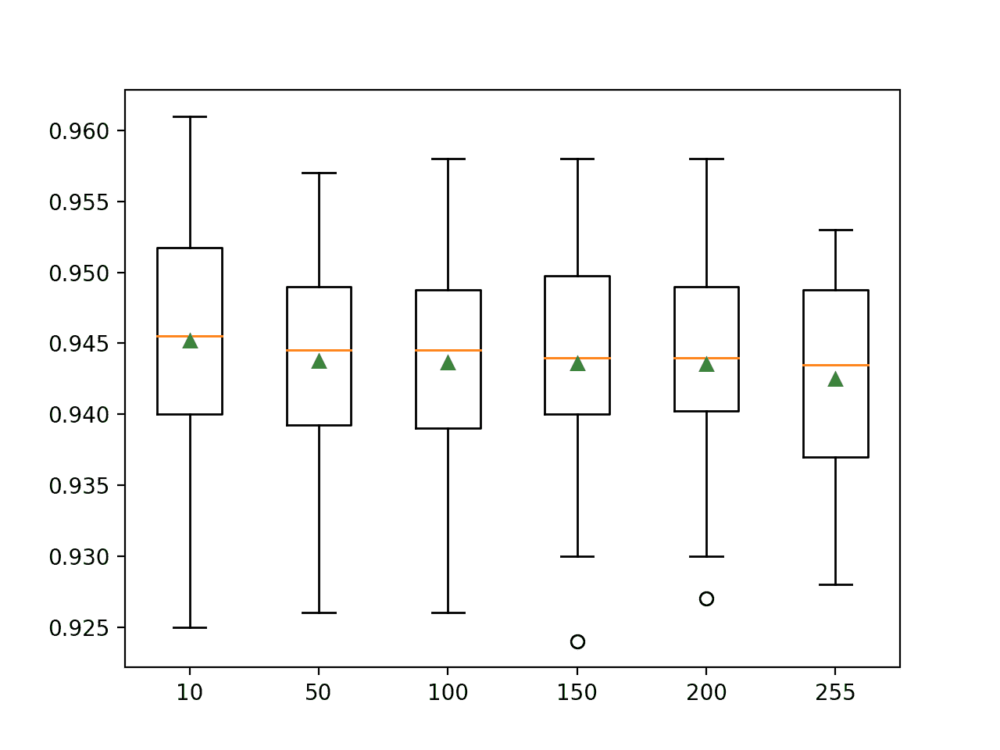

# Python 中基于直方图的梯度提升集成

> 原文：<https://machinelearningmastery.com/histogram-based-gradient-boosting-ensembles/>

最后更新于 2021 年 4 月 27 日

梯度提升是决策树算法的集合。

它可能是结构化(表格)分类和回归预测建模问题最流行的技术之一，因为它在实践中在广泛的数据集上表现良好。

梯度提升的一个主要问题是训练模型的速度很慢。当在具有成千上万个示例(行)的大型数据集上使用模型时，这尤其是一个问题。

通过将连续的输入变量离散化(宁滨)为几百个唯一的值，可以极大地加速训练添加到集合中的树。实现该技术并在该变换下围绕输入变量定制训练算法的梯度提升集成被称为**基于直方图的梯度提升集成**。

在本教程中，您将发现如何开发基于直方图的梯度提升树集成。

完成本教程后，您将知道:

*   基于直方图的梯度提升是一种用于训练梯度提升集成中使用的更快决策树的技术。
*   如何在 Sklearn 库中使用基于直方图的梯度提升的实验实现？
*   如何在 XGBoost 和 LightGBM 第三方库中使用基于直方图的梯度提升集成。

**用我的新书[Python 集成学习算法](https://machinelearningmastery.com/ensemble-learning-algorithms-with-python/)启动你的项目**，包括*分步教程*和所有示例的 *Python 源代码*文件。

我们开始吧。


如何开发基于直方图的梯度提升集成
图片由 [YoTuT](https://www.flickr.com/photos/yotut/5987330231/) 提供，保留部分权利。

## 教程概述

本教程分为四个部分；它们是:

1.  直方图梯度提升
2.  使用 Sklearn 增强直方图梯度
3.  使用 XGBoost 的直方图梯度提升
4.  用 LightGBM 提升直方图梯度

## 直方图梯度提升

[梯度提升](https://machinelearningmastery.com/gradient-boosting-machine-ensemble-in-python/)是一种集成机器学习算法。

Boosting 是指一类集成学习算法，它将树模型顺序添加到集成中。添加到集合中的每个树模型试图校正集合中已经存在的树模型所产生的预测误差。

梯度提升是将像 AdaBoost 这样的增强算法推广到一个统计框架，该框架将训练过程视为一个加法模型，并允许使用任意损失函数，从而大大提高了该技术的能力。因此，梯度提升集成是大多数结构化(例如表格数据)预测建模任务的首选技术。

尽管梯度提升在实践中表现得非常好，但模型训练起来可能很慢。这是因为树必须按顺序创建和添加，不像其他集成模型，如[随机森林](https://machinelearningmastery.com/random-forest-ensemble-in-python/)，集成成员可以并行训练，利用多个中央处理器内核。因此，已经在提高梯度提升训练算法的效率的技术上投入了大量努力。

两个著名的库总结了许多训练梯度提升算法的现代效率技术，包括极限梯度提升(XGBoost)和光梯度提升机(LightGBM)。

可以加速的训练算法的一个方面是构建每个决策树，其速度受训练数据集中的示例数(行)和特征数(列)的限制。大的数据集，例如数万个或更多的例子，会导致非常缓慢地构建树作为每个值上的分割点，因为在构建树的过程中必须考虑每个特征。

> 如果我们能够减少#数据或#特征，我们将能够大大加快 GBDT 的训练。

——[LightGBM:一种高效的梯度提升决策树](https://papers.nips.cc/paper/6907-lightgbm-a-highly-efficient-gradient-boosting-decision-tree)，2017。

通过减少连续输入特征的值的数量，可以显著加快决策树的构建。这可以通过将[或宁滨](https://machinelearningmastery.com/discretization-transforms-for-machine-learning/)值离散化到固定数量的桶中来实现。这可以将每个特征的唯一值的数量从数万减少到几百。

这允许决策树对序数桶(整数)而不是训练数据集中的特定值进行操作。这种输入数据的粗略近似对模型技能的影响通常很小，如果不这样做的话，会提高模型技能，并显著加快决策树的构建。

此外，可以使用有效的数据结构来表示输入数据的宁滨；例如，可以使用直方图，并且可以进一步定制树构建算法，以便在每个树的构建中高效地使用直方图。

这些技术最初是在 20 世纪 90 年代末开发的，用于在大型数据集上高效开发单个决策树，但也可用于决策树的集成，如梯度提升。

因此，在现代机器学习库中，通常将支持“*直方图*”的梯度提升算法称为基于**直方图的梯度提升**。

> 基于直方图的算法不是在排序后的特征值上找到分割点，而是将连续的特征值存储到离散的箱中，并在训练过程中使用这些箱来构建特征直方图。由于基于直方图的算法在内存消耗和训练速度方面都更有效，我们将在此基础上开发我们的工作。

——[LightGBM:一种高效的梯度提升决策树](https://papers.nips.cc/paper/6907-lightgbm-a-highly-efficient-gradient-boosting-decision-tree)，2017。

现在我们已经熟悉了在梯度提升中向决策树的构造中添加直方图的思想，让我们回顾一下我们可以在预测建模项目中使用的一些常见实现。

有三个主要的库支持这项技术；它们是 Sklearn、XGBoost 和 LightGBM。

让我们依次仔细看看每一个。

**注**:我们不是在和算法赛跑；相反，我们只是演示如何配置每个实现来使用直方图方法，并将所有其他不相关的超参数保持在默认值不变。

## 使用 Sklearn 增强直方图梯度

Sklearn 机器学习库提供了一个支持直方图技术的梯度提升实验实现。

具体来说，这在[历史梯度提升分类器](https://Sklearn.org/stable/modules/generated/sklearn.ensemble.HistGradientBoostingClassifier.html)和[历史梯度提升回归器](https://Sklearn.org/stable/modules/generated/sklearn.ensemble.HistGradientBoostingRegressor.html)类中提供。

为了使用这些类，您必须在项目中添加一行，表明您很乐意使用这些实验技术，并且它们的行为可能会随着库的后续发布而改变。

```py
...
# explicitly require this experimental feature
from sklearn.experimental import enable_hist_gradient_boosting
```

Sklearn 文档声称，这些基于直方图的梯度提升实现比库提供的默认梯度提升实现快几个数量级。

> 当样本数量大于数万个样本时，这些基于直方图的估计器可以比梯度提升分类器和梯度提升回归器快几个数量级。

— [基于直方图的梯度提升，Sklearn 用户指南](https://Sklearn.org/stable/modules/ensemble.html#histogram-based-gradient-boosting) e

这些类可以像任何其他 Sklearn 模型一样使用。

默认情况下，集合为每个连续输入特征使用 255 个面元，这可以通过“ *max_bins* ”参数设置。将该值设置为更小的值，例如 50 或 100，可能会进一步提高效率，尽管可能会以牺牲一些模型技能为代价。

树的数量可以通过“ *max_iter* ”参数设置，默认为 100。

```py
...
# define the model
model = HistGradientBoostingClassifier(max_bins=255, max_iter=100)
```

下面的示例显示了如何在包含 10，000 个示例和 100 个特征的合成类别数据集上评估直方图梯度提升算法。

使用重复分层 k 折叠交叉验证评估模型，并报告所有折叠和重复的平均准确性。

```py
# evaluate sklearn histogram gradient boosting algorithm for classification
from numpy import mean
from numpy import std
from sklearn.datasets import make_classification
from sklearn.model_selection import cross_val_score
from sklearn.model_selection import RepeatedStratifiedKFold
from sklearn.experimental import enable_hist_gradient_boosting
from sklearn.ensemble import HistGradientBoostingClassifier
# define dataset
X, y = make_classification(n_samples=10000, n_features=100, n_informative=50, n_redundant=50, random_state=1)
# define the model
model = HistGradientBoostingClassifier(max_bins=255, max_iter=100)
# define the evaluation procedure
cv = RepeatedStratifiedKFold(n_splits=10, n_repeats=3, random_state=1)
# evaluate the model and collect the scores
n_scores = cross_val_score(model, X, y, scoring='accuracy', cv=cv, n_jobs=-1)
# report performance
print('Accuracy: %.3f (%.3f)' % (mean(n_scores), std(n_scores)))
```

运行该示例会评估模型在合成数据集上的表现，并报告平均和标准偏差分类准确率。

**注**:考虑到算法或评估程序的随机性，或数值准确率的差异，您的[结果可能会有所不同](https://machinelearningmastery.com/different-results-each-time-in-machine-learning/)。考虑运行该示例几次，并比较平均结果。

在这种情况下，我们可以看到 Sklearn 直方图梯度提升算法在合成数据集上实现了大约 94.3%的平均准确率。

```py
Accuracy: 0.943 (0.007)
```

我们还可以探索箱的数量对模型表现的影响。

下面的示例评估了模型的表现，每个连续输入要素的箱数从 50 到(大约)250 不等，增量为 50。

下面列出了完整的示例。

```py
# compare number of bins for sklearn histogram gradient boosting
from numpy import mean
from numpy import std
from sklearn.datasets import make_classification
from sklearn.model_selection import cross_val_score
from sklearn.model_selection import RepeatedStratifiedKFold
from sklearn.experimental import enable_hist_gradient_boosting
from sklearn.ensemble import HistGradientBoostingClassifier
from matplotlib import pyplot

# get the dataset
def get_dataset():
	X, y = make_classification(n_samples=10000, n_features=100, n_informative=50, n_redundant=50, random_state=1)
	return X, y

# get a list of models to evaluate
def get_models():
	models = dict()
	for i in [10, 50, 100, 150, 200, 255]:
		models[str(i)] = HistGradientBoostingClassifier(max_bins=i, max_iter=100)
	return models

# evaluate a give model using cross-validation
def evaluate_model(model, X, y):
	# define the evaluation procedure
	cv = RepeatedStratifiedKFold(n_splits=10, n_repeats=3, random_state=1)
	# evaluate the model and collect the scores
	scores = cross_val_score(model, X, y, scoring='accuracy', cv=cv, n_jobs=-1)
	return scores

# define dataset
X, y = get_dataset()
# get the models to evaluate
models = get_models()
# evaluate the models and store results
results, names = list(), list()
for name, model in models.items():
	# evaluate the model and collect the scores
	scores = evaluate_model(model, X, y)
	# stores the results
	results.append(scores)
	names.append(name)
	# report performance along the way
	print('>%s %.3f (%.3f)' % (name, mean(scores), std(scores)))
# plot model performance for comparison
pyplot.boxplot(results, labels=names, showmeans=True)
pyplot.show()
```

运行该示例评估每个配置，报告一路上的平均和标准偏差分类准确率，并最终创建分数分布图。

**注**:考虑到算法或评估程序的随机性，或数值准确率的差异，您的[结果可能会有所不同](https://machinelearningmastery.com/different-results-each-time-in-machine-learning/)。考虑运行该示例几次，并比较平均结果。

在这种情况下，我们可以看到，增加面元的数量可能会降低该数据集上模型的平均准确率。

我们可能会预计，箱数的增加也可能需要树数的增加( *max_iter* )，以确保模型可以有效地探索和利用额外的分割点。

重要的是，拟合一个集合，其中每个变量使用 10 或 50 个箱，比每个输入变量使用 255 个箱要快得多。

```py
>10 0.945 (0.009)
>50 0.944 (0.007)
>100 0.944 (0.008)
>150 0.944 (0.008)
>200 0.944 (0.007)
>255 0.943 (0.007)
```

创建一个图形，使用方框图和触须图比较每种配置的准确度分数分布。

在这种情况下，我们可以看到，增加直方图中的箱数似乎会减少分布的扩散，尽管这可能会降低模型的平均表现。



Sklearn 直方图梯度提升集成的箱数和须图

## 使用 XGBoost 的直方图梯度提升

极限梯度提升，简称 XGBoost，是一个提供高度优化的梯度提升实现的库。

库中实现的技术之一是对连续输入变量使用[直方图。](https://github.com/dmlc/xgboost/issues/1950)

XGBoost 库可以用你喜欢的 Python 包管理器安装，比如 Pip 例如:

```py
sudo pip install xgboost
```

我们可以通过 [XGBClassifier](https://xgboost.readthedocs.io/en/latest/python/python_api.html#xgboost.XGBClassifier) 和[xgbreversor](https://xgboost.readthedocs.io/en/latest/python/python_api.html#xgboost.XGBRegressor)类开发用于 Sklearn 库的 XGBoost 模型。

通过将“ *tree_method* ”参数设置为“*近似*，可以将训练算法配置为使用直方图方法，并且可以通过“ *max_bin* ”参数设置箱数。

```py
...
# define the model
model = XGBClassifier(tree_method='approx', max_bin=255, n_estimators=100)
```

下面的示例演示了如何评估一个 XGBoost 模型，该模型被配置为使用直方图或近似技术来构建每个连续输入要素有 255 个面元的树以及模型中有 100 棵树。

```py
# evaluate xgboost histogram gradient boosting algorithm for classification
from numpy import mean
from numpy import std
from sklearn.datasets import make_classification
from sklearn.model_selection import cross_val_score
from sklearn.model_selection import RepeatedStratifiedKFold
from xgboost import XGBClassifier
# define dataset
X, y = make_classification(n_samples=10000, n_features=100, n_informative=50, n_redundant=50, random_state=1)
# define the model
model = XGBClassifier(tree_method='approx', max_bin=255, n_estimators=100)
# define the evaluation procedure
cv = RepeatedStratifiedKFold(n_splits=10, n_repeats=3, random_state=1)
# evaluate the model and collect the scores
n_scores = cross_val_score(model, X, y, scoring='accuracy', cv=cv, n_jobs=-1)
# report performance
print('Accuracy: %.3f (%.3f)' % (mean(n_scores), std(n_scores)))
```

运行该示例会评估模型在合成数据集上的表现，并报告平均和标准偏差分类准确率。

**注**:考虑到算法或评估程序的随机性，或数值准确率的差异，您的[结果可能会有所不同](https://machinelearningmastery.com/different-results-each-time-in-machine-learning/)。考虑运行该示例几次，并比较平均结果。

在这种情况下，我们可以看到 XGBoost 直方图梯度提升算法在合成数据集上实现了大约 95.7%的平均准确率。

```py
Accuracy: 0.957 (0.007)
```

## 用 LightGBM 提升直方图梯度

Light Gradient Boosting Machine(简称 LightGBM)是另一个像 XGBoost 一样的第三方库，它提供了一个高度优化的梯度提升实现。

它可能在 XGBoost 之前实现了直方图技术，但 XGBoost 后来实现了同样的技术，突出了梯度提升库之间的“*梯度提升效率*”竞争。

LightGBM 库可以用你喜欢的 Python 包管理器安装，比如 Pip 例如:

```py
sudo pip install lightgbm
```

我们可以通过[lgbm 分类器](https://lightgbm.readthedocs.io/en/latest/pythonapi/lightgbm.LGBMClassifier.html)和[lgbm 回归器](https://lightgbm.readthedocs.io/en/latest/pythonapi/lightgbm.LGBMRegressor.html)类开发 LightGBM 模型，用于 Sklearn 库。

默认情况下，训练算法使用直方图。每个连续输入变量的最大箱数可以通过“ *max_bin* ”参数设置。

```py
...
# define the model
model = LGBMClassifier(max_bin=255, n_estimators=100)
```

下面的示例演示了如何评估 LightGBM 模型，该模型被配置为使用直方图或近似技术来构建每个连续输入要素有 255 个面元的树和模型中的 100 棵树。

```py
# evaluate lightgbm histogram gradient boosting algorithm for classification
from numpy import mean
from numpy import std
from sklearn.datasets import make_classification
from sklearn.model_selection import cross_val_score
from sklearn.model_selection import RepeatedStratifiedKFold
from lightgbm import LGBMClassifier
# define dataset
X, y = make_classification(n_samples=10000, n_features=100, n_informative=50, n_redundant=50, random_state=1)
# define the model
model = LGBMClassifier(max_bin=255, n_estimators=100)
# define the evaluation procedure
cv = RepeatedStratifiedKFold(n_splits=10, n_repeats=3, random_state=1)
# evaluate the model and collect the scores
n_scores = cross_val_score(model, X, y, scoring='accuracy', cv=cv, n_jobs=-1)
# report performance
print('Accuracy: %.3f (%.3f)' % (mean(n_scores), std(n_scores)))
```

运行该示例会评估模型在合成数据集上的表现，并报告平均和标准偏差分类准确率。

**注**:考虑到算法或评估程序的随机性，或数值准确率的差异，您的[结果可能会有所不同](https://machinelearningmastery.com/different-results-each-time-in-machine-learning/)。考虑运行该示例几次，并比较平均结果。

在这种情况下，我们可以看到 LightGBM 直方图梯度提升算法在合成数据集上实现了大约 94.2%的平均准确率。

```py
Accuracy: 0.942 (0.006)
```

## 进一步阅读

如果您想更深入地了解这个主题，本节将提供更多资源。

### 教程

*   [如何在 Python 中开发梯度提升机集成](https://machinelearningmastery.com/gradient-boosting-machine-ensemble-in-python/)
*   [使用 Sklearn、XGBoost、LightGBM 和 CatBoost 进行梯度提升](https://machinelearningmastery.com/gradient-boosting-with-Sklearn-xgboost-lightgbm-and-catboost/)

### 报纸

*   [Sprint:数据挖掘的可扩展并行分类器](https://dsf.berkeley.edu/cs286/papers/sprint-vldb1996.pdf)，1996。
*   [cloud:一个用于大数据集的决策树分类器](https://www.aaai.org/Library/KDD/1998/kdd98-001.php)，1998。
*   [通信与内存高效并行决策树构建](https://epubs.siam.org/doi/abs/10.1137/1.9781611972733.11)，2003。
*   [LightGBM:一种高效的梯度提升决策树](https://papers.nips.cc/paper/6907-lightgbm-a-highly-efficient-gradient-boosting-decision-tree)，2017。
*   [XGBoost:一个可扩展的树木提升系统](https://arxiv.org/abs/1603.02754)，2016。

### 蜜蜂

*   [硬化。一起。组渐增分类器 API](https://Sklearn.org/stable/modules/generated/sklearn.ensemble.HistGradientBoostingClassifier.html) 。
*   [硬化。一起。组曲提升器 API](https://Sklearn.org/stable/modules/generated/sklearn.ensemble.HistGradientBoostingRegressor.html) 。
*   [xboost，快速直方图优化生长器，8 倍至 10 倍加速](https://github.com/dmlc/xgboost/issues/1950)
*   [xgboost。xgbcclassifier API](https://xgboost.readthedocs.io/en/latest/python/python_api.html#xgboost.XGBClassifier)。
*   [xboost。xgbreversor API](https://xgboost.readthedocs.io/en/latest/python/python_api.html#xgboost.XGBRegressor)。
*   [光弹。LGBMClassifier API](https://lightgbm.readthedocs.io/en/latest/pythonapi/lightgbm.LGBMClassifier.html) 。
*   [light GBM . lgbmr API](https://lightgbm.readthedocs.io/en/latest/pythonapi/lightgbm.LGBMRegressor.html)。

## 摘要

在本教程中，您发现了如何开发基于直方图的梯度提升树集成。

具体来说，您了解到:

*   基于直方图的梯度提升是一种用于训练梯度提升集成中使用的更快决策树的技术。
*   如何在 Sklearn 库中使用基于直方图的梯度提升的实验实现？
*   如何在 XGBoost 和 LightGBM 第三方库中使用基于直方图的梯度提升集成。

**你有什么问题吗？**
在下面的评论中提问，我会尽力回答。