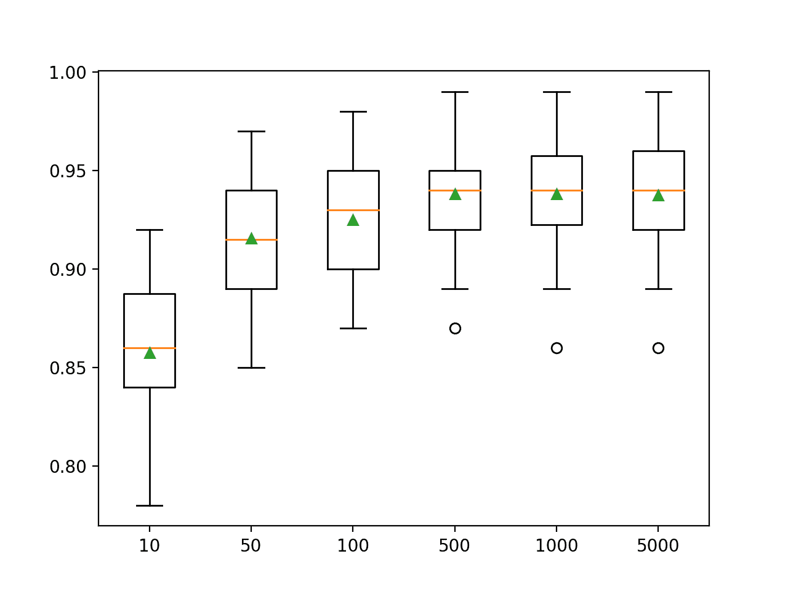
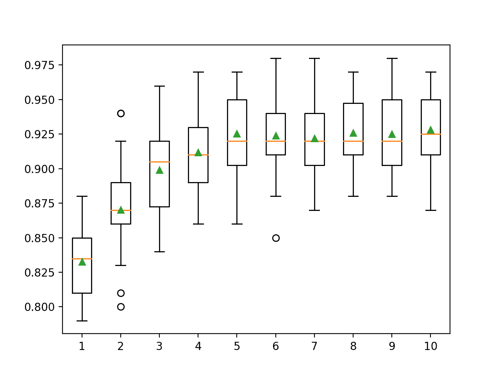
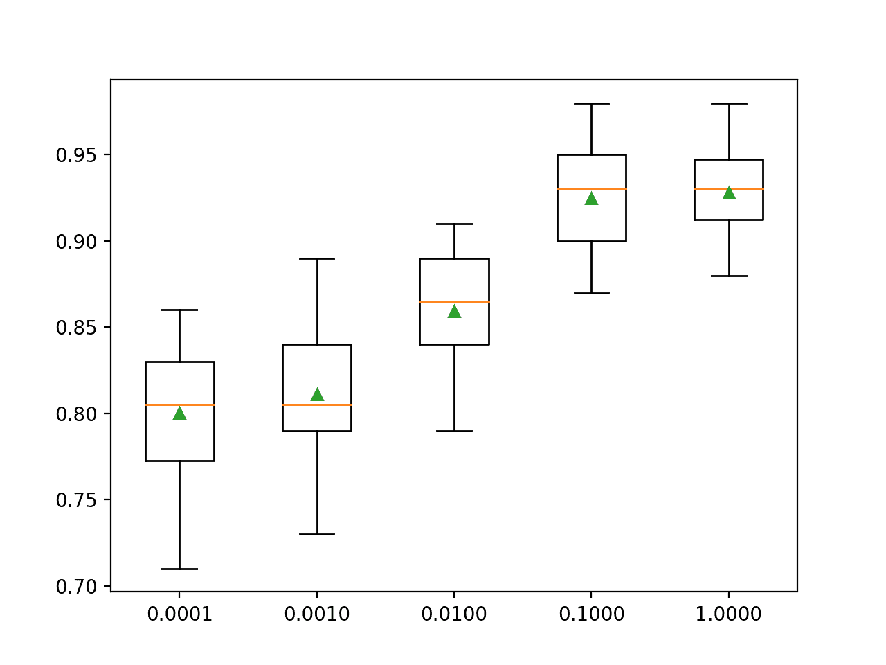
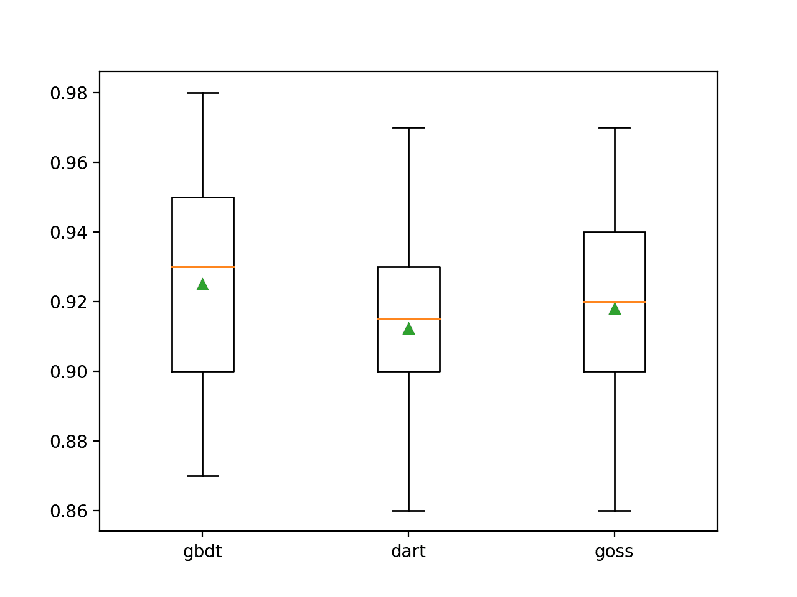

# 如何开轻量梯度提升机（LightGBM）集合

> 原文：<https://machinelearningmastery.com/light-gradient-boosted-machine-lightgbm-ensemble/>

最后更新于 2021 年 4 月 27 日

Light Gradient Boosted Machine，简称 **LightGBM** ，是一个开源库，提供了一个高效且有效的梯度提升算法的实现。

LightGBM 通过添加一种自动特征选择以及关注具有更大梯度的增强示例来扩展梯度提升算法。这可以大大加快训练速度，提高预测表现。

因此，当使用表格数据进行回归和分类预测建模任务时，LightGBM 已经成为机器学习竞赛的事实算法。因此，它应该为梯度提升方法以及极限梯度提升(XGBoost)的日益流行和广泛采用承担部分责任。

在本教程中，您将发现如何开发用于分类和回归的光梯度提升机集成。

完成本教程后，您将知道:

*   光梯度提升机(LightGBM)是随机梯度提升集成算法的一个高效开源实现。
*   如何用 Sklearn API 开发用于分类和回归的 LightGBM 集成？
*   如何探索 LightGBM 模型超参数对模型表现的影响？

**用我的新书[Python 集成学习算法](https://machinelearningmastery.com/ensemble-learning-algorithms-with-python/)启动你的项目**，包括*分步教程*和所有示例的 *Python 源代码*文件。

我们开始吧。


如何通过 [GPA 照片档案](https://www.flickr.com/photos/iip-photo-archive/35938248601/)开轻量梯度提升机(LightGBM)集成
照片，保留部分权利。

## 教程概述

本教程分为三个部分；它们是:

1.  光梯度提升机算法
2.  LightGBM Sklearn API
    1.  用于分类的 LightGBM 集成
    2.  回归的 LightGBM 集成
3.  LightGBM 超参数
    1.  探索树的数量
    2.  探索树的深度
    3.  探索学习率
    4.  探索提升类型

## 光梯度提升机算法

[梯度提升](https://machinelearningmastery.com/gradient-boosting-machine-ensemble-in-python/)是指一类可用于分类或回归预测建模问题的集成机器学习算法。

集成是由决策树模型构建的。树被一次一个地添加到集合中，并且适合于校正由先前模型产生的预测误差。这是一种称为 boosting 的集成机器学习模型。

使用任意可微损失函数和梯度下降优化算法拟合模型。这给这项技术起了一个名字，“梯度提升”，因为随着模型的拟合，损失梯度被最小化，很像一个神经网络。

有关梯度提升的更多信息，请参见教程:

*   [机器学习梯度提升算法的简单介绍](https://machinelearningmastery.com/gentle-introduction-gradient-boosting-algorithm-machine-learning/)

Light Gradient Boosted Machine，简称 LightGBM，是梯度提升的开源实现，旨在比其他实现更高效，甚至更有效。

因此， [LightGBM](https://github.com/Microsoft/LightGBM) 指的是开源项目、软件库和机器学习算法。这样，它非常类似于[极限梯度提升或 XGBoost 技术](https://machinelearningmastery.com/gentle-introduction-xgboost-applied-machine-learning/)。

LightGBM 是由柯等人在 2017 年发表的论文中描述的，论文标题为“ [LightGBM:一种高效的梯度提升决策树](https://papers.nips.cc/paper/6907-lightgbm-a-highly-efficient-gradient-boosting-decision-tree)”实现引入了两个关键思想:高斯和 EFB。

基于梯度的单侧采样(简称 GOSS)是对梯度提升方法的修改，它将注意力集中在那些导致更大梯度的训练示例上，从而加快学习速度并降低方法的计算复杂度。

> 使用 GOSS，我们排除了很大一部分具有小梯度的数据实例，并且只使用其余的来估计信息增益。我们证明，由于具有较大梯度的数据实例在信息增益的计算中起着更重要的作用，GOSS 可以用小得多的数据量获得相当精确的信息增益估计。

——[LightGBM:一种高效的梯度提升决策树](https://papers.nips.cc/paper/6907-lightgbm-a-highly-efficient-gradient-boosting-decision-tree)，2017。

排他特征捆绑，简称 EFB，是一种捆绑稀疏(大部分为零)互斥特征的方法，例如已经过一次热编码的分类变量输入。因此，这是一种自动特征选择。

> ……我们捆绑互斥的特征(即它们很少同时取非零值)，以减少特征的数量。

——[LightGBM:一种高效的梯度提升决策树](https://papers.nips.cc/paper/6907-lightgbm-a-highly-efficient-gradient-boosting-decision-tree)，2017。

这两个变化加起来可以将算法的训练时间加快 20 倍。因此，LightGBM 可以被认为是梯度提升决策树(GBDT)，增加了 GOSS 和 EFB。

> 我们称我们的新 GBDT 实现为 GOSS 和 EFB LightGBM。我们在多个公共数据集上的实验表明，LightGBM 将传统 GBDT 的训练过程加快了 20 多倍，同时达到了几乎相同的准确率

——[LightGBM:一种高效的梯度提升决策树](https://papers.nips.cc/paper/6907-lightgbm-a-highly-efficient-gradient-boosting-decision-tree)，2017。

## LightGBM Sklearn API

LightGBM 可以作为独立的库安装，LightGBM 模型可以使用 Sklearn API 开发。

第一步是安装 LightGBM 库，如果还没有安装的话。这可以在大多数平台上使用 pip python 包管理器来实现；例如:

```py
sudo pip install lightgbm
```

然后，您可以通过运行以下脚本来确认 LightGBM 库安装正确，并且可以使用。

```py
# check lightgbm version
import lightgbm
print(lightgbm.__version__)
```

运行该脚本将打印您安装的 LightGBM 库的版本。

您的版本应该相同或更高。如果没有，您必须升级 LightGBM 库的版本。

```py
2.3.1
```

如果您需要开发环境的特定说明，请参阅教程:

*   [LightGBM 安装指南](https://lightgbm.readthedocs.io/en/latest/Installation-Guide.html)

LightGBM 库有自己的定制 API，尽管我们将通过 Sklearn 包装类使用该方法:[lgbmreversor](https://lightgbm.readthedocs.io/en/latest/pythonapi/lightgbm.LGBMRegressor.html)和 [LGBMClassifier](https://lightgbm.readthedocs.io/en/latest/pythonapi/lightgbm.LGBMClassifier.html) 。这将允许我们使用 Sklearn 机器学习库中的全套工具来准备数据和评估模型。

这两个模型以相同的方式运行，并采用相同的参数来影响决策树的创建和添加。

随机性用于模型的构建。这意味着算法每次在相同的数据上运行时，都会产生稍微不同的模型。

当使用具有随机学习算法的机器学习算法时，最好通过在多次运行或重复交叉验证中平均它们的表现来评估它们。当拟合最终模型时，可能需要增加树的数量，直到模型的方差在重复评估中减小，或者拟合多个最终模型并对它们的预测进行平均。

让我们看看如何为分类和回归开发一个 LightGBM 集成。

### 用于分类的 LightGBM 集成

在本节中，我们将研究如何使用 LightGBM 解决分类问题。

首先，我们可以使用 [make_classification()函数](https://Sklearn.org/stable/modules/generated/sklearn.datasets.make_classification.html)创建一个包含 1000 个示例和 20 个输入特征的合成二进制分类问题。

下面列出了完整的示例。

```py
# test classification dataset
from sklearn.datasets import make_classification
# define dataset
X, y = make_classification(n_samples=1000, n_features=20, n_informative=15, n_redundant=5, random_state=7)
# summarize the dataset
print(X.shape, y.shape)
```

运行该示例将创建数据集并总结输入和输出组件的形状。

```py
(1000, 20) (1000,)
```

接下来，我们可以在这个数据集上评估一个 LightGBM 算法。

我们将使用三次重复和 10 次折叠的重复分层 k 折叠交叉验证来评估模型。我们将报告所有重复和折叠的模型准确率的平均值和标准偏差。

```py
# evaluate lightgbm algorithm for classification
from numpy import mean
from numpy import std
from sklearn.datasets import make_classification
from sklearn.model_selection import cross_val_score
from sklearn.model_selection import RepeatedStratifiedKFold
from lightgbm import LGBMClassifier
# define dataset
X, y = make_classification(n_samples=1000, n_features=20, n_informative=15, n_redundant=5, random_state=7)
# define the model
model = LGBMClassifier()
# evaluate the model
cv = RepeatedStratifiedKFold(n_splits=10, n_repeats=3, random_state=1)
n_scores = cross_val_score(model, X, y, scoring='accuracy', cv=cv, n_jobs=-1)
# report performance
print('Accuracy: %.3f (%.3f)' % (mean(n_scores), std(n_scores)))
```

运行该示例会报告模型的均值和标准差准确率。

**注**:考虑到算法或评估程序的随机性，或数值准确率的差异，您的[结果可能会有所不同](https://machinelearningmastery.com/different-results-each-time-in-machine-learning/)。考虑运行该示例几次，并比较平均结果。

在这种情况下，我们可以看到带有默认超参数的 LightGBM 集成在这个测试数据集上实现了大约 92.5%的分类准确率。

```py
Accuracy: 0.925 (0.031)
```

我们也可以使用 LightGBM 模型作为最终模型，并对分类进行预测。

首先，LightGBM 集合适合所有可用数据，然后可以调用 *predict()* 函数对新数据进行预测。

下面的示例在我们的二进制类别数据集上演示了这一点。

```py
# make predictions using lightgbm for classification
from sklearn.datasets import make_classification
from lightgbm import LGBMClassifier
# define dataset
X, y = make_classification(n_samples=1000, n_features=20, n_informative=15, n_redundant=5, random_state=7)
# define the model
model = LGBMClassifier()
# fit the model on the whole dataset
model.fit(X, y)
# make a single prediction
row = [0.2929949,-4.21223056,-1.288332,-2.17849815,-0.64527665,2.58097719,0.28422388,-7.1827928,-1.91211104,2.73729512,0.81395695,3.96973717,-2.66939799,3.34692332,4.19791821,0.99990998,-0.30201875,-4.43170633,-2.82646737,0.44916808]
yhat = model.predict([row])
print('Predicted Class: %d' % yhat[0])
```

运行该示例使 LightGBM 集成模型适合整个数据集，然后用于对新的数据行进行预测，就像我们在应用程序中使用该模型时可能做的那样。

```py
Predicted Class: 1
```

现在我们已经熟悉了使用 LightGBM 进行分类，让我们看看回归的 API。

### 回归的 LightGBM 集成

在本节中，我们将研究如何使用 LightGBM 解决回归问题。

首先，我们可以使用[make _ revolution()函数](https://Sklearn.org/stable/modules/generated/sklearn.datasets.make_regression.html)创建一个包含 1000 个示例和 20 个输入特征的合成回归问题。

下面列出了完整的示例。

```py
# test regression dataset
from sklearn.datasets import make_regression
# define dataset
X, y = make_regression(n_samples=1000, n_features=20, n_informative=15, noise=0.1, random_state=7)
# summarize the dataset
print(X.shape, y.shape)
```

运行该示例将创建数据集并总结输入和输出组件的形状。

```py
(1000, 20) (1000,)
```

接下来，我们可以在这个数据集上评估一个 LightGBM 算法。

正如我们在上一节中所做的，我们将使用重复的 k-fold 交叉验证来评估模型，重复 3 次，重复 10 次。我们将报告所有重复和折叠模型的平均绝对误差(MAE)。Sklearn 库使 MAE 为负，因此它被最大化而不是最小化。这意味着负 MAE 越大越好，完美模型的 MAE 为 0。

下面列出了完整的示例。

```py
# evaluate lightgbm ensemble for regression
from numpy import mean
from numpy import std
from sklearn.datasets import make_regression
from sklearn.model_selection import cross_val_score
from sklearn.model_selection import RepeatedKFold
from lightgbm import LGBMRegressor
# define dataset
X, y = make_regression(n_samples=1000, n_features=20, n_informative=15, noise=0.1, random_state=7)
# define the model
model = LGBMRegressor()
# evaluate the model
cv = RepeatedKFold(n_splits=10, n_repeats=3, random_state=1)
n_scores = cross_val_score(model, X, y, scoring='neg_mean_absolute_error', cv=cv, n_jobs=-1, error_score='raise')
# report performance
print('MAE: %.3f (%.3f)' % (mean(n_scores), std(n_scores)))
```

运行该示例会报告模型的均值和标准差准确率。

**注**:考虑到算法或评估程序的随机性，或数值准确率的差异，您的[结果可能会有所不同](https://machinelearningmastery.com/different-results-each-time-in-machine-learning/)。考虑运行该示例几次，并比较平均结果。

在这种情况下，我们可以看到带有默认超参数的 LightGBM 集成实现了大约 60 的 MAE。

```py
MAE: -60.004 (2.887)
```

我们也可以使用 LightGBM 模型作为最终模型，并对回归进行预测。

首先，LightGBM 集合适合所有可用数据，然后可以调用 *predict()* 函数对新数据进行预测。

下面的例子在我们的回归数据集上演示了这一点。

```py
# gradient lightgbm for making predictions for regression
from sklearn.datasets import make_regression
from lightgbm import LGBMRegressor
# define dataset
X, y = make_regression(n_samples=1000, n_features=20, n_informative=15, noise=0.1, random_state=7)
# define the model
model = LGBMRegressor()
# fit the model on the whole dataset
model.fit(X, y)
# make a single prediction
row = [0.20543991,-0.97049844,-0.81403429,-0.23842689,-0.60704084,-0.48541492,0.53113006,2.01834338,-0.90745243,-1.85859731,-1.02334791,-0.6877744,0.60984819,-0.70630121,-1.29161497,1.32385441,1.42150747,1.26567231,2.56569098,-0.11154792]
yhat = model.predict([row])
print('Prediction: %d' % yhat[0])
```

运行该示例使 LightGBM 集成模型适合整个数据集，然后用于对新的数据行进行预测，就像我们在应用程序中使用该模型时可能做的那样。

```py
Prediction: 52
```

现在我们已经熟悉了使用 Sklearn API 来评估和使用 LightGBM 集成，让我们来看看如何配置模型。

## LightGBM 超参数

在本节中，我们将仔细研究一些您应该考虑为 LightGBM 集成进行调整的超参数，以及它们对模型表现的影响。

对于 LightGBM，我们可以查看许多超参数，尽管在这种情况下，我们将查看树的数量和树的深度、学习率和提升类型。

有关调优 LightGBM 超参数的一般建议，请参见文档:

*   [LightGBM 参数调谐](https://lightgbm.readthedocs.io/en/latest/Parameters-Tuning.html)。

### 探索树的数量

LightGBM 集成算法的一个重要超参数是集成中使用的决策树数量。

回想一下，决策树被顺序地添加到模型中，以努力纠正和改进先前的树所做的预测。因此，更多的树往往更好。

树的数量可以通过“*n _ estimates*”参数设置，默认为 100。

下面的示例探讨了值在 10 到 5，000 之间的树的数量的影响。

```py
# explore lightgbm number of trees effect on performance
from numpy import mean
from numpy import std
from sklearn.datasets import make_classification
from sklearn.model_selection import cross_val_score
from sklearn.model_selection import RepeatedStratifiedKFold
from lightgbm import LGBMClassifier
from matplotlib import pyplot

# get the dataset
def get_dataset():
	X, y = make_classification(n_samples=1000, n_features=20, n_informative=15, n_redundant=5, random_state=7)
	return X, y

# get a list of models to evaluate
def get_models():
	models = dict()
	trees = [10, 50, 100, 500, 1000, 5000]
	for n in trees:
		models[str(n)] = LGBMClassifier(n_estimators=n)
	return models

# evaluate a give model using cross-validation
def evaluate_model(model):
	cv = RepeatedStratifiedKFold(n_splits=10, n_repeats=3, random_state=1)
	scores = cross_val_score(model, X, y, scoring='accuracy', cv=cv, n_jobs=-1)
	return scores

# define dataset
X, y = get_dataset()
# get the models to evaluate
models = get_models()
# evaluate the models and store results
results, names = list(), list()
for name, model in models.items():
	scores = evaluate_model(model)
	results.append(scores)
	names.append(name)
	print('>%s %.3f (%.3f)' % (name, mean(scores), std(scores)))
# plot model performance for comparison
pyplot.boxplot(results, labels=names, showmeans=True)
pyplot.show()
```

运行该示例首先报告每个配置数量的决策树的平均准确性。

**注**:考虑到算法或评估程序的随机性，或数值准确率的差异，您的[结果可能会有所不同](https://machinelearningmastery.com/different-results-each-time-in-machine-learning/)。考虑运行该示例几次，并比较平均结果。

在这种情况下，我们可以看到该数据集上的表现有所提高，直到大约 500 棵树，之后表现似乎趋于平稳。

```py
>10 0.857 (0.033)
>50 0.916 (0.032)
>100 0.925 (0.031)
>500 0.938 (0.026)
>1000 0.938 (0.028)
>5000 0.937 (0.028)
```

为每个配置数量的树的准确度分数的分布创建一个方框和须图。

我们可以看到模型表现和集合规模增加的总体趋势。



LightGBM 集合大小与分类准确率的箱线图

### 探索树的深度

改变加入集成的每棵树的深度是梯度提升的另一个重要超参数。

树深度控制每棵树对训练数据集的专门化程度:它可能有多一般或多复杂。优选不太浅和一般的树(如 [AdaBoost](https://machinelearningmastery.com/adaboost-ensemble-in-python/) )和不太深和专门化的树(如 [bootstrap aggregation](https://machinelearningmastery.com/bagging-ensemble-with-python/) )。

梯度提升通常在深度适中的树中表现良好，在技能和通用性之间找到了平衡。

树深度通过“ *max_depth* ”参数控制，默认为一个未指定的值，因为控制树有多复杂的默认机制是使用叶节点的数量。

有两种主要方法来控制树的复杂性:树的最大深度和树中终端节点(叶子)的最大数量。在这种情况下，我们正在探索叶子的数量，因此我们需要通过设置“*num _ leaks*”参数来增加叶子的数量以支持更深的树。

下面的示例探讨了 1 到 10 之间的树深度以及对模型表现的影响。

```py
# explore lightgbm tree depth effect on performance
from numpy import mean
from numpy import std
from sklearn.datasets import make_classification
from sklearn.model_selection import cross_val_score
from sklearn.model_selection import RepeatedStratifiedKFold
from lightgbm import LGBMClassifier
from matplotlib import pyplot

# get the dataset
def get_dataset():
	X, y = make_classification(n_samples=1000, n_features=20, n_informative=15, n_redundant=5, random_state=7)
	return X, y

# get a list of models to evaluate
def get_models():
	models = dict()
	for i in range(1,11):
		models[str(i)] = LGBMClassifier(max_depth=i, num_leaves=2**i)
	return models

# evaluate a give model using cross-validation
def evaluate_model(model):
	cv = RepeatedStratifiedKFold(n_splits=10, n_repeats=3, random_state=1)
	scores = cross_val_score(model, X, y, scoring='accuracy', cv=cv, n_jobs=-1)
	return scores

# define dataset
X, y = get_dataset()
# get the models to evaluate
models = get_models()
# evaluate the models and store results
results, names = list(), list()
for name, model in models.items():
	scores = evaluate_model(model)
	results.append(scores)
	names.append(name)
	print('>%s %.3f (%.3f)' % (name, mean(scores), std(scores)))
# plot model performance for comparison
pyplot.boxplot(results, labels=names, showmeans=True)
pyplot.show()
```

运行该示例首先报告每个配置的树深度的平均准确率。

**注**:考虑到算法或评估程序的随机性，或数值准确率的差异，您的[结果可能会有所不同](https://machinelearningmastery.com/different-results-each-time-in-machine-learning/)。考虑运行该示例几次，并比较平均结果。

在这种情况下，我们可以看到表现随着树的深度而提高，可能一直到 10 级。探索更深的树木可能会很有趣。

```py
>1 0.833 (0.028)
>2 0.870 (0.033)
>3 0.899 (0.032)
>4 0.912 (0.026)
>5 0.925 (0.031)
>6 0.924 (0.029)
>7 0.922 (0.027)
>8 0.926 (0.027)
>9 0.925 (0.028)
>10 0.928 (0.029)
```

为每个配置的树深度的准确率分数分布创建一个方框和须图。

我们可以看到随着树的深度增加到五个级别的深度，模型表现增加的总体趋势，之后表现开始合理地持平。



LightGBM 集成树深度与分类准确率的箱线图

### 探索学习率

学习率控制每个模型对集成预测的贡献量。

较小的速率可能需要集合中更多的决策树。

学习率可以通过“ *learning_rate* ”参数控制，默认为 0.1。

下面的示例探讨了学习率，并比较了 0.0001 和 1.0 之间的值的效果。

```py
# explore lightgbm learning rate effect on performance
from numpy import mean
from numpy import std
from sklearn.datasets import make_classification
from sklearn.model_selection import cross_val_score
from sklearn.model_selection import RepeatedStratifiedKFold
from lightgbm import LGBMClassifier
from matplotlib import pyplot

# get the dataset
def get_dataset():
	X, y = make_classification(n_samples=1000, n_features=20, n_informative=15, n_redundant=5, random_state=7)
	return X, y

# get a list of models to evaluate
def get_models():
	models = dict()
	rates = [0.0001, 0.001, 0.01, 0.1, 1.0]
	for r in rates:
		key = '%.4f' % r
		models[key] = LGBMClassifier(learning_rate=r)
	return models

# evaluate a give model using cross-validation
def evaluate_model(model):
	cv = RepeatedStratifiedKFold(n_splits=10, n_repeats=3, random_state=1)
	scores = cross_val_score(model, X, y, scoring='accuracy', cv=cv, n_jobs=-1)
	return scores

# define dataset
X, y = get_dataset()
# get the models to evaluate
models = get_models()
# evaluate the models and store results
results, names = list(), list()
for name, model in models.items():
	scores = evaluate_model(model)
	results.append(scores)
	names.append(name)
	print('>%s %.3f (%.3f)' % (name, mean(scores), std(scores)))
# plot model performance for comparison
pyplot.boxplot(results, labels=names, showmeans=True)
pyplot.show()
```

运行示例首先报告每个配置的学习率的平均准确性。

**注**:考虑到算法或评估程序的随机性，或数值准确率的差异，您的[结果可能会有所不同](https://machinelearningmastery.com/different-results-each-time-in-machine-learning/)。考虑运行该示例几次，并比较平均结果。

在这种情况下，我们可以看到，较大的学习率会在该数据集上产生更好的表现。我们预计，为较小的学习率向集合中添加更多的树将进一步提升表现。

```py
>0.0001 0.800 (0.038)
>0.0010 0.811 (0.035)
>0.0100 0.859 (0.035)
>0.1000 0.925 (0.031)
>1.0000 0.928 (0.025)
```

为每个配置的学习率的准确度分数的分布创建一个方框和须图。

我们可以看到模型表现随着学习率的增加一直到 1.0 的大值而提高的总体趋势。



LightGBM 学习率与分类准确率的箱线图

### 探索提升类型

LightGBM 的一个特点是它支持许多不同的提升算法，称为提升类型。

可以通过“ *boosting_type* ”参数指定 boosting 类型，并取一个字符串来指定类型。这些选项包括:

*   **gbdt** ':梯度提升决策树(GDBT)。
*   **dart** ':丢弃者遇到多重加性回归树(dart)。
*   **goss** ':基于梯度的单侧采样(goss)。

默认为 GDBT，是经典的梯度提升算法。

DART 在 2015 年的一篇题为《 [DART:丢弃生遇到多重加性回归树](https://arxiv.org/abs/1505.01866)》的论文中有所描述，顾名思义，它将[丢弃生](https://machinelearningmastery.com/dropout-for-regularizing-deep-neural-networks/)的概念从深度学习添加到多重加性回归树(MART)算法中，这是梯度提升决策树的前身。

> 这个算法有很多名字，包括梯度树增强、增强树和多重加性回归树(MART)。我们用后者来指代这个算法。

——[DART:丢弃者遇到多重加性回归树](https://arxiv.org/abs/1505.01866)，2015。

GOSS 是随着 LightGBM 纸和图书馆一起推出的。该方法试图仅使用导致较大误差梯度的实例来更新模型并丢弃其余的。

> ……我们排除了很大一部分具有小梯度的数据实例，仅使用其余数据来估计信息增益。

——[LightGBM:一种高效的梯度提升决策树](https://papers.nips.cc/paper/6907-lightgbm-a-highly-efficient-gradient-boosting-decision-tree)，2017。

下面的示例将合成类别数据集上的 LightGBM 与三种关键增强技术进行了比较。

```py
# explore lightgbm boosting type effect on performance
from numpy import arange
from numpy import mean
from numpy import std
from sklearn.datasets import make_classification
from sklearn.model_selection import cross_val_score
from sklearn.model_selection import RepeatedStratifiedKFold
from lightgbm import LGBMClassifier
from matplotlib import pyplot

# get the dataset
def get_dataset():
	X, y = make_classification(n_samples=1000, n_features=20, n_informative=15, n_redundant=5, random_state=7)
	return X, y

# get a list of models to evaluate
def get_models():
	models = dict()
	types = ['gbdt', 'dart', 'goss']
	for t in types:
		models[t] = LGBMClassifier(boosting_type=t)
	return models

# evaluate a give model using cross-validation
def evaluate_model(model):
	cv = RepeatedStratifiedKFold(n_splits=10, n_repeats=3, random_state=1)
	scores = cross_val_score(model, X, y, scoring='accuracy', cv=cv, n_jobs=-1)
	return scores

# define dataset
X, y = get_dataset()
# get the models to evaluate
models = get_models()
# evaluate the models and store results
results, names = list(), list()
for name, model in models.items():
	scores = evaluate_model(model)
	results.append(scores)
	names.append(name)
	print('>%s %.3f (%.3f)' % (name, mean(scores), std(scores)))
# plot model performance for comparison
pyplot.boxplot(results, labels=names, showmeans=True)
pyplot.show()
```

运行示例首先报告每种配置的升压类型的平均准确率。

**注**:考虑到算法或评估程序的随机性，或数值准确率的差异，您的[结果可能会有所不同](https://machinelearningmastery.com/different-results-each-time-in-machine-learning/)。考虑运行该示例几次，并比较平均结果。

在这种情况下，我们可以看到默认的增强方法比评估的其他两种技术表现得更好。

```py
>gbdt 0.925 (0.031)
>dart 0.912 (0.028)
>goss 0.918 (0.027)
```

为每种配置的增强方法的准确度分数分布创建一个方框和须图，允许直接比较技术。



LightGBM 增强类型与分类准确率的箱线图

## 进一步阅读

如果您想更深入地了解这个主题，本节将提供更多资源。

### 相关教程

*   [机器学习梯度提升算法的简单介绍](https://machinelearningmastery.com/gentle-introduction-gradient-boosting-algorithm-machine-learning/)
*   [使用 Sklearn、XGBoost、LightGBM 和 CatBoost 进行梯度提升](https://machinelearningmastery.com/gradient-boosting-with-Sklearn-xgboost-lightgbm-and-catboost/)

### 报纸

*   [LightGBM:一种高效的梯度提升决策树](https://papers.nips.cc/paper/6907-lightgbm-a-highly-efficient-gradient-boosting-decision-tree)，2017。
*   [DART:丢弃者遇到多重加性回归树](https://arxiv.org/abs/1505.01866)，2015。

### 蜜蜂

*   [光格姆项目，GitHub](https://github.com/microsoft/LightGBM)
*   [LightGBM 的文档](https://lightgbm.readthedocs.io/)。
*   [LightGBM 安装指南](https://lightgbm.readthedocs.io/en/latest/Installation-Guide.html)
*   [LightGBM 参数调谐](https://lightgbm.readthedocs.io/en/latest/Parameters-Tuning.html)。
*   [光弹。LGBMClassifier API](https://lightgbm.readthedocs.io/en/latest/pythonapi/lightgbm.LGBMClassifier.html) 。
*   [light GBM . lgbmr API](https://lightgbm.readthedocs.io/en/latest/pythonapi/lightgbm.LGBMRegressor.html)。

### 文章

*   [梯度提升，维基百科](https://en.wikipedia.org/wiki/Gradient_boosting)。

## 摘要

在本教程中，您发现了如何开发用于分类和回归的光梯度提升机集成。

具体来说，您了解到:

*   光梯度提升机(LightGBM)是随机梯度提升集成算法的一个有效的开源实现。
*   如何用 Sklearn API 开发用于分类和回归的 LightGBM 集成？
*   如何探索 LightGBM 模型超参数对模型表现的影响？

**你有什么问题吗？**
在下面的评论中提问，我会尽力回答。