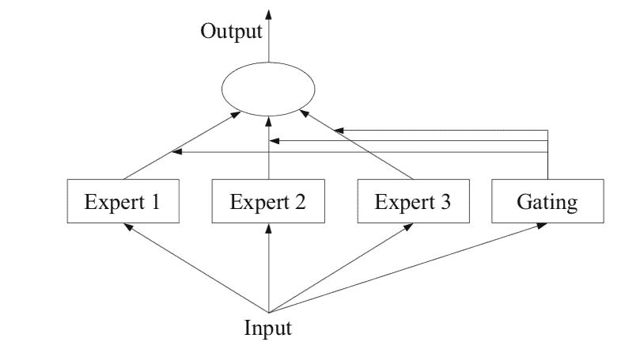

# 混合专家集成的温和介绍

> 原文：<https://machinelearningmastery.com/mixture-of-experts/>

最后更新于 2021 年 11 月 7 日

**专家混合**是神经网络领域发展起来的集成学习技术。

它包括将预测建模任务分解为子任务，在每个子任务上训练一个专家模型，开发一个门控模型，该模型根据要预测的输入学习信任哪个专家，并组合预测。

尽管该技术最初是使用神经网络专家和门控模型描述的，但它可以推广到使用任何类型的模型。因此，它显示出与堆叠概括的强相似性，并且属于被称为元学习的集成学习方法的类别。

在本教程中，您将发现集成学习的专家混合方法。

完成本教程后，您将知道:

*   集成学习的一种直观方法包括将任务划分为子任务，并在每个子任务上培养专家。
*   专家混合是一种集成学习方法，它试图使用专家模型根据子任务明确地解决预测建模问题。
*   分治法与决策树的构建有关，元学习器法与堆叠概括集成法有关。

**用我的新书[Python 集成学习算法](https://machinelearningmastery.com/ensemble-learning-algorithms-with-python/)启动你的项目**，包括*分步教程*和所有示例的 *Python 源代码*文件。

我们开始吧。

《混合专家集成》的温柔介绍[拉德克·库恰尔斯基](https://www.flickr.com/photos/137294100@N08/43707103572/)摄，版权所有。

## 教程概述

本教程分为三个部分；它们是:

1.  子任务和专家
2.  专家混合
    1.  子任务
    2.  专家模型
    3.  门控模型
    4.  联营法
3.  与其他技术的关系
    1.  专家和决策树的混合
    2.  专家和堆叠的混合

## 子任务和专家

一些预测建模任务非常复杂，尽管它们可能适合于自然划分为子任务。

例如，考虑一个一维函数，它在二维中有一个像 S 一样的复杂形状。我们可以尝试设计一个完全模拟函数的模型，但是如果我们知道函数的形式，S 形，我们也可以把问题分成三个部分:顶部的曲线，底部的曲线和连接曲线的线。

这是一种解决问题的**分治**方法，是许多预测建模自动化方法以及更广泛的解决问题方法的基础。

这种方法也可以作为开发集成学习方法的基础。

例如，我们可以基于问题的一些领域知识将输入特征空间划分为子空间。然后可以在问题的每个子空间上训练模型，实际上是特定子问题的专家。然后，模型会学习需要哪个专家来预测未来的新例子。

子问题可能重叠，也可能不重叠，来自类似或相关子问题的专家可能能够为技术上超出其专业知识的例子做出贡献。

这种集成学习的方法是一种称为专家混合的技术的基础。

## 专家混合

**混合专家**，简称 MoE 或 ME，是一种集成学习技术，实现了在预测建模问题的子任务上训练专家的思想。

> 在神经网络社区中，一些研究人员已经检查了分解方法。[……]专家混合(ME)方法，分解输入空间，以便每个专家检查空间的不同部分。[……]门控网络负责组合各种专家。

—第 73 页，[使用集成方法的模式分类](https://amzn.to/2zxc0F7)，2010。

该方法有四个要素，它们是:

*   将任务分成子任务。
*   为每个子任务培养一名专家。
*   使用门控模型来决定使用哪个专家。
*   池预测和门控模型输出进行预测。

下图取自 2012 年出版的《集合方法》第 94 页，提供了该方法的架构元素的有用概述。

专家模型与专家成员和选通网络的混合示例
取自:集成方法

### 子任务

第一步是将预测建模问题分成子任务。这通常涉及到使用领域知识。例如，一幅图像可以被分成单独的元素，如背景、前景、对象、颜色、线条等等。

> ……ME 采用分而治之的策略，将复杂的任务分解成几个更简单、更小的子任务，并针对不同的子任务对单个学习器(称为专家)进行培训。

—第 94 页，[集合方法](https://amzn.to/2XZzrjG)，2012。

对于那些任务划分为子任务不明显的问题，可以使用更简单、更通用的方法。例如，可以想象一种方法，该方法将输入特征空间按列组划分，或者根据标准分布的距离度量、内联和离群值来分离特征空间中的示例，等等。

> ……在 ME 中，一个关键问题是如何找到任务的自然划分，然后从子解中推导出整体解。

—第 94 页，[集合方法](https://amzn.to/2XZzrjG)，2012。

### 专家模型

接下来，为每个子任务设计一个专家。

专家混合方法最初是在人工神经网络领域开发和探索的，因此传统上，专家本身是神经网络模型，用于在回归的情况下预测数值，或者在分类的情况下预测类别标签。

> 应该清楚的是，我们可以为专家“插入”任何模型。例如，我们可以使用神经网络来表示门控功能和专家。结果被称为混合密度网络。

—第 344 页，[机器学习:概率视角](https://amzn.to/2YrVLmp)，2012。

每个专家接收相同的输入模式(行)并做出预测。

### 门控模型

模型用于解释每个专家做出的预测，并帮助决定对于给定的输入信任哪个专家。这被称为门控模型或门控网络，因为它传统上是一个神经网络模型。

选通网络将提供给专家模型的输入模式作为输入，并输出每个专家在对输入进行预测时应有的贡献。

> ……由选通网络确定的权重是基于给定的输入动态分配的，因为 MoE 可以有效地了解每个集成成员学习了特征空间的哪个部分

—第 16 页，[集成机器学习](https://amzn.to/2C7syo5)，2012。

选通网络是该方法的关键，并且模型有效地学习为给定的输入选择子任务类型，并且反过来信任专家来做出强有力的预测。

> 专家混合也可以看作是一种分类器选择算法，其中个体分类器被训练成为特征空间某一部分的专家。

—第 16 页，[集成机器学习](https://amzn.to/2C7syo5)，2012。

当使用神经网络模型时，门控网络和专家一起被训练，使得门控网络学习何时信任每个专家来做出预测。该培训程序传统上使用[期望最大化](https://machinelearningmastery.com/expectation-maximization-em-algorithm/) (EM)来实现。选通网络可能有一个软最大值输出，为每个专家给出类似概率的置信度得分。

> 一般来说，训练过程试图实现两个目标:对于给定的专家，找到最优的选通函数；对于给定的选通函数，就选通函数指定的分布对专家进行培训。

—第 95 页，[集合方法](https://amzn.to/2XZzrjG)，2012。

### 联营法

最后，专家模型的混合必须进行预测，这是使用池化或聚合机制实现的。这可能就像选择由选通网络提供最大输出或置信度的专家一样简单。

可选地，可以进行加权和预测，该加权和预测明确地组合了每个专家进行的预测和选通网络估计的置信度。您可能会想到其他方法来有效利用预测和门控网络输出。

> 然后，池化/组合系统可以选择具有最高权重的单个分类器，或者计算每个类别的分类器输出的加权和，并挑选接收最高加权和的类别。

—第 16 页，[集成机器学习](https://amzn.to/2C7syo5)，2012。

## 与其他技术的关系

专家混合法今天不太流行，也许是因为它被描述在神经网络领域。

尽管如此，这项技术已经有超过 25 年的进步和探索，你可以在 2012 年的论文“[二十年的专家混合](https://ieeexplore.ieee.org/abstract/document/6215056)”中看到一个很好的总结。”

重要的是，我建议考虑该技术更广泛的意图，并探索如何在您自己的预测建模问题上使用它。

例如:

*   有没有明显的或系统的方法可以将预测建模问题分成子任务？
*   你能在每个子任务上训练专门的方法吗？
*   考虑开发一个模型来预测每个专家模型的可信度。

### 专家和决策树的混合

我们还可以看到分类和回归树专家的混合之间的关系，通常被称为 CART。

决策树适合使用对特征空间的分治方法。每个分割被选为输入特征的常数值，并且每个子树可以被认为是子模型。

> 专家混合主要在神经网络社区中进行研究。在这个思路中，研究人员一般会考虑分而治之的策略，尝试联合学习参数模型的混合，并使用组合规则来获得整体解决方案。

—第 16 页，[集合方法](https://amzn.to/2XZzrjG)，2012。

在设计专家混合时，我们可以采用类似的递归分解方法将预测建模任务分解为子问题。这通常被称为专家的层级混合。

> 专家分层混合(HME)程序可被视为基于树的方法的变体。主要区别在于，树分裂不是硬决策，而是软概率决策。

—第 329 页，[统计学习的要素](https://amzn.to/31mzA31)，2016。

与决策树不同，将任务划分为子任务通常是显式的和自上而下的。此外，与决策树不同，专家混合试图调查所有的专家子模型，而不是单个模型。

> HMEs 和树的 CART 实现之间还有其他区别。在 HME，线性(或逻辑回归)模型适用于每个终端节点，而不是像 CART 那样的常数。拆分可以是多路的，而不仅仅是二进制的，并且拆分是输入的线性组合的概率函数，而不是像 CART 的标准使用那样的单个输入。

—第 329 页，[统计学习的要素](https://amzn.to/31mzA31)，2016。

然而，对于给定的预测建模问题，这些差异可能会引发方法上的变化。

例如:

*   考虑将特征空间或问题划分为子任务的自动或通用方法，以帮助拓宽方法的适用性。
*   考虑探索信任最佳专家的组合方法，以及寻求专家间加权共识的方法。

### 专家和堆叠的混合

该技术的应用不必局限于神经网络模型，一系列标准的机器学习技术可以用于寻找类似的目的。

这样，专家混合方法属于更广泛的集成学习方法类别，该类别还将包括[堆叠泛化](https://machinelearningmastery.com/stacking-ensemble-machine-learning-with-python/)，称为**堆叠**。就像专家的混合一样，堆叠训练一组不同的机器学习模型，然后学习一个更高阶的模型来最好地组合预测。

我们可以将这类集成学习方法称为元学习模型。也就是说，模型试图从输出中学习，或者学习如何最好地组合其他低级模型的输出。

> 元学习是向学习器(分类者)学习的过程。[……]为了诱导元分类器，首先训练基本分类器(第一阶段)，然后训练元分类器(第二阶段)。

—第 82 页，[使用集成方法的模式分类](https://amzn.to/2zxc0F7)，2010。

与专家的混合不同，堆叠模型通常都适合同一训练数据集，例如，没有将任务分解为子任务。此外，与专家的混合不同，组合来自较低层次模型的预测的较高层次模型通常不接收提供给较低层次模型的输入模式，而是将来自每个较低层次模型的预测作为输入。

> 元学习方法最适合于某些分类器始终正确分类或始终错误分类某些实例的情况。

—第 82 页，[使用集成方法的模式分类](https://amzn.to/2zxc0F7)，2010。

然而，没有理由不能开发出混合叠加和混合专家模型，在给定的预测建模问题上，这两种方法都比单独的方法表现得更好。

例如:

*   考虑将堆叠中的较低层模型视为在训练数据的不同视角上训练的专家。也许这可能涉及使用一种更软的方法将问题分解为子问题，其中不同的数据转换或特征选择方法用于每个模型。
*   考虑在堆叠中向元模型提供输入模式，以使低层模型的权重或贡献以预测的特定上下文为条件。

## 进一步阅读

如果您想更深入地了解这个主题，本节将提供更多资源。

### 报纸

*   [二十年的专家混合](https://ieeexplore.ieee.org/abstract/document/6215056)，2012 年。

### 书

*   [使用集成方法的模式分类](https://amzn.to/2zxc0F7)，2010。
*   [集成方法](https://amzn.to/2XZzrjG)，2012。
*   [集成机器学习](https://amzn.to/2C7syo5)，2012。
*   [数据挖掘中的集成方法](https://amzn.to/3frGM1A)，2010。
*   [统计学习的要素](https://amzn.to/31mzA31)，2016。
*   [机器学习:概率视角](https://amzn.to/2YrVLmp)，2012。
*   [用于模式识别的神经网络](https://amzn.to/3fWgcOh)，1995。
*   [深度学习](https://amzn.to/3ds4KZ8)，2016 年。

### 文章

*   一起学习，维基百科。
*   [专家混合，维基百科](https://en.wikipedia.org/wiki/Mixture_of_experts)。

## 摘要

在本教程中，您发现了专家混合的集成学习方法。

具体来说，您了解到:

*   集成学习的一种直观方法包括将任务划分为子任务，并在每个子任务上培养专家。
*   专家混合是一种集成学习方法，它试图使用专家模型根据子任务明确地解决预测建模问题。
*   分治法与决策树的构建有关，元学习器法与堆叠概括集成法有关。

**你有什么问题吗？**
在下面的评论中提问，我会尽力回答。