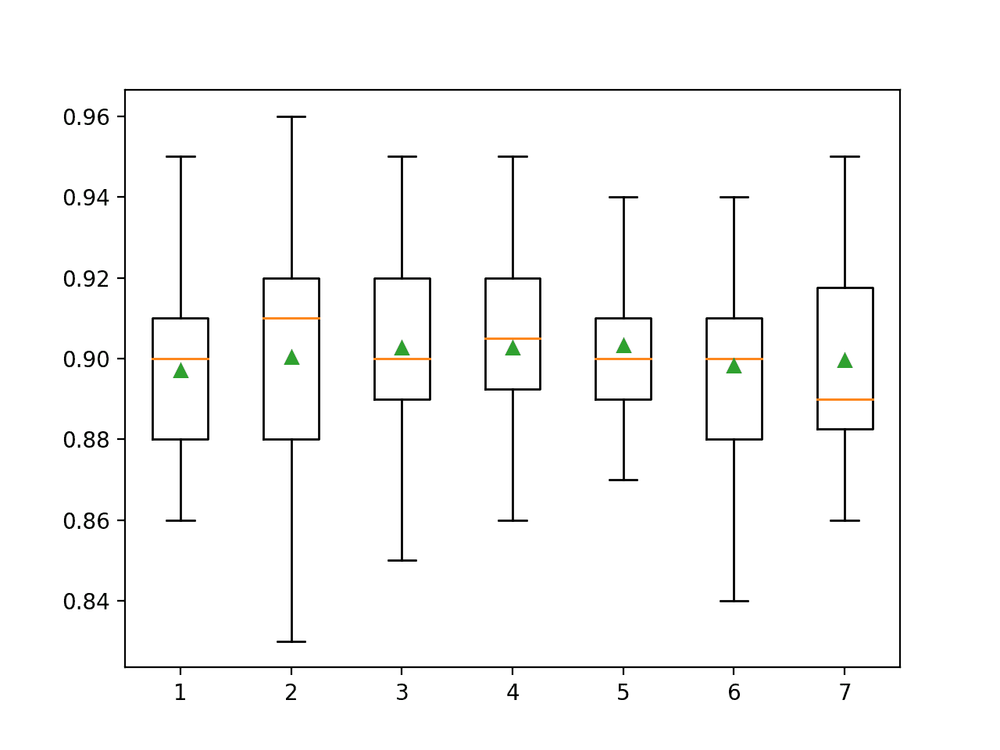
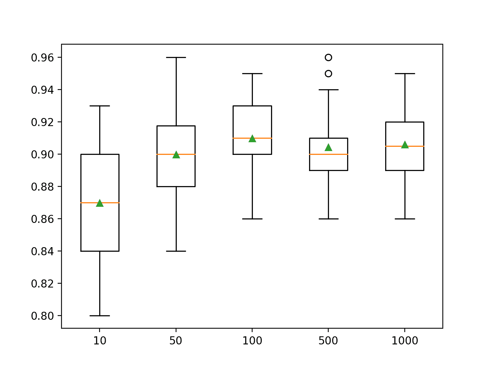
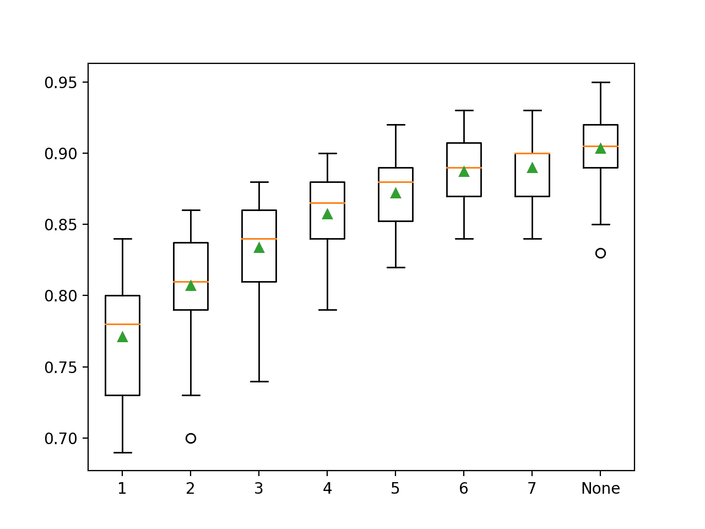

# 如何用 Python 开发随机森林集成

> 原文：<https://machinelearningmastery.com/random-forest-ensemble-in-python/>

最后更新于 2021 年 4 月 27 日

随机森林是一种集成机器学习算法。

鉴于其在广泛的分类和回归预测建模问题上的良好或优异的表现，它可能是最受欢迎和广泛使用的机器学习算法。

它也很容易使用，因为它只有很少的关键超参数和合理的试探法来配置这些超参数。

在本教程中，您将发现如何开发用于分类和回归的随机森林集合。

完成本教程后，您将知道:

*   随机森林集成是决策树的集成，是装袋的自然延伸。
*   如何用 Sklearn 使用随机森林集成进行分类和回归？
*   如何探索随机森林模型超参数对模型表现的影响？

**用我的新书[Python 集成学习算法](https://machinelearningmastery.com/ensemble-learning-algorithms-with-python/)启动你的项目**，包括*分步教程*和所有示例的 *Python 源代码*文件。

我们开始吧。

*   **更新 2020 年 8 月**:增加了常见问题部分。


如何用 Python 开发随机森林集成
图片由[希拉·桑德](https://flickr.com/photos/sheila_sund/30461181307/)提供，保留部分权利。

## 教程概述

本教程分为四个部分；它们是:

1.  随机森林算法
2.  随机森林科学工具包-学习应用编程接口
    1.  随机森林分类
    2.  回归的随机森林
3.  随机森林超参数
    1.  探索样本数量
    2.  探索功能数量
    3.  探索树的数量
    4.  探索树的深度
4.  常见问题

## 随机森林算法

随机森林是决策树算法的集合。

它是决策树[自举聚合(bagging)](https://machinelearningmastery.com/bagging-ensemble-with-python/) 的扩展，可用于分类和回归问题。

在装袋过程中，会创建许多决策树，其中每个树都是从训练数据集的不同引导样本创建的。一个[自举样本](https://machinelearningmastery.com/a-gentle-introduction-to-the-bootstrap-method/)是训练数据集的一个样本，其中一个样本可能在样本中出现不止一次，称为**替换采样**。

Bagging 是一种有效的集成算法，因为每个决策树都适合于稍微不同的训练数据集，并且反过来具有稍微不同的表现。与普通的决策树模型不同，例如[分类和回归树](https://machinelearningmastery.com/classification-and-regression-trees-for-machine-learning/) (CART)，集成中使用的树是未标记的，这使得它们对训练数据集略微过度。这是可取的，因为它有助于使每棵树更加不同，并且具有较少的相关预测或预测误差。

来自这些树的预测在所有决策树中被平均，导致比模型中的任何单个树更好的表现。

> 集合中的每个模型随后被用于生成新样本的预测，并且这些 m 个预测被平均以给出森林的预测

—第 199 页，[应用预测建模](https://amzn.to/2O3BuOa)，2013 年。

回归问题的预测是集合中所有树的预测平均值。对分类问题的预测是对集合中所有树的类别标签的多数投票。

*   **回归**:预测是整个决策树的平均预测。
*   **分类**:预测是跨决策树预测的多数票类标签。

> 和装袋一样，森林中的每棵树都对新样本的分类投一票，整个集合中每个类的投票比例就是预测的概率向量。

—第 387 页，[应用预测建模](https://amzn.to/2O3BuOa)，2013 年。

随机森林包括从训练数据集中的自举样本构建大量决策树，如 bagging。

与装袋不同，随机森林还包括在构建树的每个分割点选择输入特征(列或变量)的子集。通常，构建决策树包括评估数据中每个输入变量的值，以便选择分割点。通过将特征简化为可以在每个分割点考虑的随机子集，它迫使集合中的每个决策树更加不同。

> 随机森林通过对树木去相关的小调整，提供了对袋装树木的改进。[……]但是当构建这些决策树时，每次考虑树中的分裂时，从 p 个预测器的完整集合中选择 m 个预测器的随机样本作为分裂候选。

—第 320 页，[R](https://amzn.to/37xa7DT)中应用的统计学习介绍，2014。

结果是，由集成中的每棵树做出的预测，进而预测误差，或多或少是不同的或相关的。当对来自这些相关性较低的树的预测进行平均以做出预测时，它通常比袋装决策树产生更好的表现。

也许为随机森林调整的最重要的超参数是在每个分割点要考虑的随机特征的数量。

> 随机森林的调整参数是随机选择的预测因子 k 的数量，在每次分裂时从中选择，通常称为 mtry。在回归背景下，Breiman (2001)建议将 mtry 设置为预测因子数量的三分之一。

—第 199 页，[应用预测建模](https://amzn.to/2O3BuOa)，2013 年。

回归的一个好的启发式方法是将这个超参数设置为输入特征数的 1/3。

*   num _ features _ for _ split = total _ input _ features/3

> 对于分类问题，Breiman (2001)建议将 mtry 设置为预测数的平方根。

—第 387 页，[应用预测建模](https://amzn.to/2O3BuOa)，2013 年。

一个很好的分类启发式方法是将这个超参数设置为输入特征数的平方根。

*   num _ features _ for _ split = sqrt(total _ input _ feature)

另一个需要调整的重要超参数是决策树的深度。更深的树通常对训练数据更过度，但相关性也更低，这反过来可以提高集成的表现。深度从 1 到 10 级可能是有效的。

最后，可以设置集成中决策树的数量。通常，这种情况会增加，直到看不到进一步的改善。

## 随机森林科学工具包-学习应用编程接口

随机森林集成可以从零开始实现，尽管这对初学者来说很有挑战性。

Sklearn Python 机器学习库为机器学习提供了一个随机森林的实现。

它有现代版本的图书馆。

首先，通过运行以下脚本来确认您使用的是现代版本的库:

```py
# check Sklearn version
import sklearn
print(sklearn.__version__)
```

运行脚本将打印您的 Sklearn 版本。

您的版本应该相同或更高。如果没有，您必须升级 Sklearn 库的版本。

```py
0.22.1
```

随机森林通过[随机森林回归器](https://Sklearn.org/stable/modules/generated/sklearn.ensemble.RandomForestRegressor.html)和[随机森林分类器](https://Sklearn.org/stable/modules/generated/sklearn.ensemble.RandomForestClassifier.html)类提供。

这两个模型以相同的方式运行，并采用相同的参数来影响决策树的创建。

随机性用于模型的构建。这意味着算法每次在相同的数据上运行时，都会产生稍微不同的模型。

当使用具有随机学习算法的机器学习算法时，通过在多次运行或重复[交叉验证](https://machinelearningmastery.com/k-fold-cross-validation/)中平均它们的表现来评估它们是一个很好的实践。当拟合最终模型时，可能需要增加树的数量，直到模型的方差在重复评估中减小，或者拟合多个最终模型并对它们的预测进行平均。

让我们看看如何为分类和回归任务开发一个随机森林集成。

### 随机森林分类

在本节中，我们将研究使用随机森林解决分类问题。

首先，我们可以使用 [make_classification()函数](https://Sklearn.org/stable/modules/generated/sklearn.datasets.make_classification.html)创建一个包含 1000 个示例和 20 个输入特征的合成二进制分类问题。

下面列出了完整的示例。

```py
# test classification dataset
from sklearn.datasets import make_classification
# define dataset
X, y = make_classification(n_samples=1000, n_features=20, n_informative=15, n_redundant=5, random_state=3)
# summarize the dataset
print(X.shape, y.shape)
```

运行该示例将创建数据集并总结输入和输出组件的形状。

```py
(1000, 20) (1000,)
```

接下来，我们可以在这个数据集上评估一个随机森林算法。

我们将使用[重复分层 k 折叠交叉验证](https://machinelearningmastery.com/cross-validation-for-imbalanced-classification/)来评估模型，重复 3 次，折叠 10 次。我们将报告所有重复和折叠的模型准确率的平均值和标准偏差。

```py
# evaluate random forest algorithm for classification
from numpy import mean
from numpy import std
from sklearn.datasets import make_classification
from sklearn.model_selection import cross_val_score
from sklearn.model_selection import RepeatedStratifiedKFold
from sklearn.ensemble import RandomForestClassifier
# define dataset
X, y = make_classification(n_samples=1000, n_features=20, n_informative=15, n_redundant=5, random_state=3)
# define the model
model = RandomForestClassifier()
# evaluate the model
cv = RepeatedStratifiedKFold(n_splits=10, n_repeats=3, random_state=1)
n_scores = cross_val_score(model, X, y, scoring='accuracy', cv=cv, n_jobs=-1, error_score='raise')
# report performance
print('Accuracy: %.3f (%.3f)' % (mean(n_scores), std(n_scores)))
```

运行该示例会报告模型的均值和标准差准确率。

**注**:考虑到算法或评估程序的随机性，或数值准确率的差异，您的[结果可能会有所不同](https://machinelearningmastery.com/different-results-each-time-in-machine-learning/)。考虑运行该示例几次，并比较平均结果。

在这种情况下，我们可以看到带有默认超参数的随机森林集成达到了大约 90.5%的分类准确率。

```py
Accuracy: 0.905 (0.025)
```

我们也可以使用随机森林模型作为最终模型，并对分类进行预测。

首先对所有可用数据进行随机森林集合拟合，然后调用 *predict()* 函数对新数据进行预测。

下面的示例在我们的二进制类别数据集上演示了这一点。

```py
# make predictions using random forest for classification
from sklearn.datasets import make_classification
from sklearn.ensemble import RandomForestClassifier
# define dataset
X, y = make_classification(n_samples=1000, n_features=20, n_informative=15, n_redundant=5, random_state=3)
# define the model
model = RandomForestClassifier()
# fit the model on the whole dataset
model.fit(X, y)
# make a single prediction
row = [[-8.52381793,5.24451077,-12.14967704,-2.92949242,0.99314133,0.67326595,-0.38657932,1.27955683,-0.60712621,3.20807316,0.60504151,-1.38706415,8.92444588,-7.43027595,-2.33653219,1.10358169,0.21547782,1.05057966,0.6975331,0.26076035]]
yhat = model.predict(row)
print('Predicted Class: %d' % yhat[0])
```

运行该示例使随机森林集成模型适合整个数据集，然后用于对新的数据行进行预测，就像我们在应用程序中使用该模型时可能做的那样。

```py
Predicted Class: 0
```

现在我们已经熟悉了使用随机森林进行分类，让我们看看回归的 API。

### 回归的随机森林

在本节中，我们将研究使用随机森林解决回归问题。

首先，我们可以使用[make _ revolution()函数](https://Sklearn.org/stable/modules/generated/sklearn.datasets.make_regression.html)创建一个包含 1000 个示例和 20 个输入特征的合成回归问题。

下面列出了完整的示例。

```py
# test regression dataset
from sklearn.datasets import make_regression
# define dataset
X, y = make_regression(n_samples=1000, n_features=20, n_informative=15, noise=0.1, random_state=2)
# summarize the dataset
print(X.shape, y.shape)
```

运行该示例将创建数据集并总结输入和输出组件的形状。

```py
(1000, 20) (1000,)
```

接下来，我们可以在这个数据集上评估一个随机森林算法。

正如我们在上一节中所做的，我们将使用重复的 k-fold 交叉验证来评估模型，重复 3 次，重复 10 次。我们将报告所有重复和折叠模型的平均绝对误差(MAE)。Sklearn 库使 MAE 为负，因此它被最大化而不是最小化。这意味着负 MAE 越大越好，完美模型的 MAE 为 0。

下面列出了完整的示例。

```py
# evaluate random forest ensemble for regression
from numpy import mean
from numpy import std
from sklearn.datasets import make_regression
from sklearn.model_selection import cross_val_score
from sklearn.model_selection import RepeatedKFold
from sklearn.ensemble import RandomForestRegressor
# define dataset
X, y = make_regression(n_samples=1000, n_features=20, n_informative=15, noise=0.1, random_state=2)
# define the model
model = RandomForestRegressor()
# evaluate the model
cv = RepeatedKFold(n_splits=10, n_repeats=3, random_state=1)
n_scores = cross_val_score(model, X, y, scoring='neg_mean_absolute_error', cv=cv, n_jobs=-1, error_score='raise')
# report performance
print('MAE: %.3f (%.3f)' % (mean(n_scores), std(n_scores)))
```

运行该示例会报告模型的均值和标准差 MAE。

**注**:考虑到算法或评估程序的随机性，或数值准确率的差异，您的[结果可能会有所不同](https://machinelearningmastery.com/different-results-each-time-in-machine-learning/)。考虑运行该示例几次，并比较平均结果。

在这种情况下，我们可以看到具有默认超参数的随机森林集合达到了大约 90 的 MAE。

```py
MAE: -90.149 (7.924)
```

我们也可以使用随机森林模型作为最终模型，并对回归进行预测。

首先对所有可用数据进行随机森林集合拟合，然后调用 *predict()* 函数对新数据进行预测。

下面的例子在我们的回归数据集上演示了这一点。

```py
# random forest for making predictions for regression
from sklearn.datasets import make_regression
from sklearn.ensemble import RandomForestRegressor
# define dataset
X, y = make_regression(n_samples=1000, n_features=20, n_informative=15, noise=0.1, random_state=2)
# define the model
model = RandomForestRegressor()
# fit the model on the whole dataset
model.fit(X, y)
# make a single prediction
row = [[-0.89483109,-1.0670149,-0.25448694,-0.53850126,0.21082105,1.37435592,0.71203659,0.73093031,-1.25878104,-2.01656886,0.51906798,0.62767387,0.96250155,1.31410617,-1.25527295,-0.85079036,0.24129757,-0.17571721,-1.11454339,0.36268268]]
yhat = model.predict(row)
print('Prediction: %d' % yhat[0])
```

运行该示例使随机森林集成模型适合整个数据集，然后用于对新的数据行进行预测，就像我们在应用程序中使用该模型时可能做的那样。

```py
Prediction: -173
```

现在我们已经熟悉了使用 Sklearn API 来评估和使用随机森林集合，让我们来看看如何配置模型。

## 随机森林超参数

在本节中，我们将仔细研究一些您应该考虑为随机森林集合进行调整的超参数，以及它们对模型表现的影响。

### 探索样本数量

集成中的每个决策树都适合从训练数据集中提取的[自举样本](https://machinelearningmastery.com/a-gentle-introduction-to-the-bootstrap-method/)。

如果您愿意，可以通过将“ *bootstrap* ”参数设置为 *False* 来关闭。在这种情况下，整个训练数据集将用于训练每个决策树。**不建议这样**。

“ *max_samples* ”参数可以设置为 0 到 1 之间的浮点数，以控制训练数据集大小的百分比，从而使引导样本用于训练每个决策树。

例如，如果训练数据集有 100 行，则 *max_samples* 参数可以设置为 0.5，并且每个决策树将适合具有(100 * 0.5)或 50 行数据的引导样本。

较小的样本量会使树更加不同，而较大的样本量会使树更加相似。将 *max_samples* 设置为“ *None* ”将使样本大小与训练数据集的大小相同，这是默认设置。

下面的示例演示了 10%到 100%的不同引导样本大小对随机森林算法的影响。

```py
# explore random forest bootstrap sample size on performance
from numpy import mean
from numpy import std
from numpy import arange
from sklearn.datasets import make_classification
from sklearn.model_selection import cross_val_score
from sklearn.model_selection import RepeatedStratifiedKFold
from sklearn.ensemble import RandomForestClassifier
from matplotlib import pyplot

# get the dataset
def get_dataset():
	X, y = make_classification(n_samples=1000, n_features=20, n_informative=15, n_redundant=5, random_state=3)
	return X, y

# get a list of models to evaluate
def get_models():
	models = dict()
	# explore ratios from 10% to 100% in 10% increments
	for i in arange(0.1, 1.1, 0.1):
		key = '%.1f' % i
		# set max_samples=None to use 100%
		if i == 1.0:
			i = None
		models[key] = RandomForestClassifier(max_samples=i)
	return models

# evaluate a given model using cross-validation
def evaluate_model(model, X, y):
	# define the evaluation procedure
	cv = RepeatedStratifiedKFold(n_splits=10, n_repeats=3, random_state=1)
	# evaluate the model and collect the results
	scores = cross_val_score(model, X, y, scoring='accuracy', cv=cv, n_jobs=-1)
	return scores

# define dataset
X, y = get_dataset()
# get the models to evaluate
models = get_models()
# evaluate the models and store results
results, names = list(), list()
for name, model in models.items():
	# evaluate the model
	scores = evaluate_model(model, X, y)
	# store the results
	results.append(scores)
	names.append(name)
	# summarize the performance along the way
	print('>%s %.3f (%.3f)' % (name, mean(scores), std(scores)))
# plot model performance for comparison
pyplot.boxplot(results, labels=names, showmeans=True)
pyplot.show()
```

运行示例首先报告每个数据集大小的平均准确率。

**注**:考虑到算法或评估程序的随机性，或数值准确率的差异，您的[结果可能会有所不同](https://machinelearningmastery.com/different-results-each-time-in-machine-learning/)。考虑运行该示例几次，并比较平均结果。

在这种情况下，结果表明使用与训练数据集大小相等的引导样本大小可以在该数据集上获得最佳结果。

这是默认设置，在大多数情况下应该使用。

```py
>10 0.856 (0.031)
>20 0.873 (0.029)
>30 0.881 (0.021)
>40 0.891 (0.033)
>50 0.893 (0.025)
>60 0.897 (0.030)
>70 0.902 (0.024)
>80 0.903 (0.024)
>90 0.900 (0.026)
>100 0.903 (0.027)
```

为每个自举样本大小的准确度分数分布创建一个方框和须图。

在这种情况下，我们可以看到一个普遍的趋势，即样本越大，模型的表现越好。

您可能希望扩展此示例，看看如果引导样本大小大于或甚至远大于训练数据集，会发生什么情况(例如，您可以将一个整数值设置为样本数，而不是训练数据集大小的浮动百分比)。


随机森林自举样本量与分类准确率的箱线图

### 探索功能数量

为每个分割点随机采样的要素数量可能是为随机森林配置的最重要的要素。

它通过 *max_features* 参数设置，默认为输入特征数的平方根。在这种情况下，对于我们的测试数据集，这将是 *sqrt(20)* 或大约四个特征。

以下示例探讨了在每个分割点随机选择的特征数量对模型准确率的影响。我们将尝试从 1 到 7 的值，并期望一个小的值，大约 4，在启发式的基础上表现良好。

```py
# explore random forest number of features effect on performance
from numpy import mean
from numpy import std
from sklearn.datasets import make_classification
from sklearn.model_selection import cross_val_score
from sklearn.model_selection import RepeatedStratifiedKFold
from sklearn.ensemble import RandomForestClassifier
from matplotlib import pyplot

# get the dataset
def get_dataset():
	X, y = make_classification(n_samples=1000, n_features=20, n_informative=15, n_redundant=5, random_state=3)
	return X, y

# get a list of models to evaluate
def get_models():
	models = dict()
	# explore number of features from 1 to 7
	for i in range(1,8):
		models[str(i)] = RandomForestClassifier(max_features=i)
	return models

# evaluate a given model using cross-validation
def evaluate_model(model, X, y):
	# define the evaluation procedure
	cv = RepeatedStratifiedKFold(n_splits=10, n_repeats=3, random_state=1)
	# evaluate the model and collect the results
	scores = cross_val_score(model, X, y, scoring='accuracy', cv=cv, n_jobs=-1)
	return scores

# define dataset
X, y = get_dataset()
# get the models to evaluate
models = get_models()
# evaluate the models and store results
results, names = list(), list()
for name, model in models.items():
	# evaluate the model
	scores = evaluate_model(model, X, y)
	# store the results
	results.append(scores)
	names.append(name)
	# summarize the performance along the way
	print('>%s %.3f (%.3f)' % (name, mean(scores), std(scores)))
# plot model performance for comparison
pyplot.boxplot(results, labels=names, showmeans=True)
pyplot.show()
```

运行示例首先报告每个特征集大小的平均准确率。

**注**:考虑到算法或评估程序的随机性，或数值准确率的差异，您的[结果可能会有所不同](https://machinelearningmastery.com/different-results-each-time-in-machine-learning/)。考虑运行该示例几次，并比较平均结果。

在这种情况下，结果表明介于 3 和 5 之间的值是合适的，这证实了在这个数据集上 4 是合理的默认值。如果分类准确度的标准偏差小于三或四，则五的值可能更好。

```py
>1 0.897 (0.023)
>2 0.900 (0.028)
>3 0.903 (0.027)
>4 0.903 (0.022)
>5 0.903 (0.019)
>6 0.898 (0.025)
>7 0.900 (0.024)
```

为每个要素集大小的准确率分数分布创建了一个方框和触须图。

我们可以看到表现上升并达到峰值的趋势，其值在 3 到 5 之间，当考虑更大的特征集大小时，表现会再次下降。



随机森林特征集大小与分类准确率的箱线图

### 探索树的数量

树的数量是为随机林配置的另一个关键超参数。

通常，树的数量会增加，直到模型表现稳定下来。直觉可能暗示更多的树会导致过拟合，尽管事实并非如此。给定学习算法的随机性质，bagging 和随机森林算法似乎在某种程度上都不会过拟合训练数据集。

树的数量可以通过“*n _ estimates*”参数设置，默认为 100。

下面的示例探讨了值在 10 到 1000 之间的树的数量的影响。

```py
# explore random forest number of trees effect on performance
from numpy import mean
from numpy import std
from sklearn.datasets import make_classification
from sklearn.model_selection import cross_val_score
from sklearn.model_selection import RepeatedStratifiedKFold
from sklearn.ensemble import RandomForestClassifier
from matplotlib import pyplot

# get the dataset
def get_dataset():
	X, y = make_classification(n_samples=1000, n_features=20, n_informative=15, n_redundant=5, random_state=3)
	return X, y

# get a list of models to evaluate
def get_models():
	models = dict()
	# define number of trees to consider
	n_trees = [10, 50, 100, 500, 1000]
	for n in n_trees:
		models[str(n)] = RandomForestClassifier(n_estimators=n)
	return models

# evaluate a given model using cross-validation
def evaluate_model(model, X, y):
	# define the evaluation procedure
	cv = RepeatedStratifiedKFold(n_splits=10, n_repeats=3, random_state=1)
	# evaluate the model and collect the results
	scores = cross_val_score(model, X, y, scoring='accuracy', cv=cv, n_jobs=-1)
	return scores

# define dataset
X, y = get_dataset()
# get the models to evaluate
models = get_models()
# evaluate the models and store results
results, names = list(), list()
for name, model in models.items():
	# evaluate the model
	scores = evaluate_model(model, X, y)
	# store the results
	results.append(scores)
	names.append(name)
	# summarize the performance along the way
	print('>%s %.3f (%.3f)' % (name, mean(scores), std(scores)))
# plot model performance for comparison
pyplot.boxplot(results, labels=names, showmeans=True)
pyplot.show()
```

运行该示例首先报告每个配置的树数的平均准确率。

**注**:考虑到算法或评估程序的随机性，或数值准确率的差异，您的[结果可能会有所不同](https://machinelearningmastery.com/different-results-each-time-in-machine-learning/)。考虑运行该示例几次，并比较平均结果。

在这种情况下，我们可以看到大约 100 棵树后，表现会上升并保持不变。平均准确度分数在 100、500 和 1000 棵树之间波动，这可能是统计噪声。

```py
>10 0.870 (0.036)
>50 0.900 (0.028)
>100 0.910 (0.024)
>500 0.904 (0.024)
>1000 0.906 (0.023)
```

为每个配置数量的树的准确度分数的分布创建一个方框和须图。



随机森林集合大小与分类准确率的箱线图

### 探索树的深度

最后一个有趣的超参数是集成中使用的决策树的最大深度。

默认情况下，树被构建到任意深度，并且不被修剪。这是一个明智的默认，尽管我们也可以探索不同固定深度的拟合树。

最大树深度可以通过*最大深度*参数指定，默认设置为*无*(无最大深度)。

下面的例子探讨了随机森林最大树深对模型表现的影响。

```py
# explore random forest tree depth effect on performance
from numpy import mean
from numpy import std
from sklearn.datasets import make_classification
from sklearn.model_selection import cross_val_score
from sklearn.model_selection import RepeatedStratifiedKFold
from sklearn.ensemble import RandomForestClassifier
from matplotlib import pyplot

# get the dataset
def get_dataset():
	X, y = make_classification(n_samples=1000, n_features=20, n_informative=15, n_redundant=5, random_state=3)
	return X, y

# get a list of models to evaluate
def get_models():
	models = dict()
	# consider tree depths from 1 to 7 and None=full
	depths = [i for i in range(1,8)] + [None]
	for n in depths:
		models[str(n)] = RandomForestClassifier(max_depth=n)
	return models

# evaluate a given model using cross-validation
def evaluate_model(model, X, y):
	# define the evaluation procedure
	cv = RepeatedStratifiedKFold(n_splits=10, n_repeats=3, random_state=1)
	# evaluate the model and collect the results
	scores = cross_val_score(model, X, y, scoring='accuracy', cv=cv, n_jobs=-1)
	return scores

# define dataset
X, y = get_dataset()
# get the models to evaluate
models = get_models()
# evaluate the models and store results
results, names = list(), list()
for name, model in models.items():
	# evaluate the model
	scores = evaluate_model(model, X, y)
	# store the results
	results.append(scores)
	names.append(name)
	# summarize the performance along the way
	print('>%s %.3f (%.3f)' % (name, mean(scores), std(scores)))
# plot model performance for comparison
pyplot.boxplot(results, labels=names, showmeans=True)
pyplot.show()
```

运行示例首先报告每个配置的最大树深度的平均准确率。

**注**:考虑到算法或评估程序的随机性，或数值准确率的差异，您的[结果可能会有所不同](https://machinelearningmastery.com/different-results-each-time-in-machine-learning/)。考虑运行该示例几次，并比较平均结果。

在这种情况下，我们可以看到更大的深度会带来更好的模型表现，默认的无最大深度会在这个数据集上获得最佳表现。

```py
>1 0.771 (0.040)
>2 0.807 (0.037)
>3 0.834 (0.034)
>4 0.857 (0.030)
>5 0.872 (0.025)
>6 0.887 (0.024)
>7 0.890 (0.025)
>None 0.903 (0.027)
```

为每个配置的最大树深的准确率分数分布创建一个方框和须图。

在这种情况下，我们可以看到表现随着树深度的增加而提高的趋势，支持无最大深度的默认值。



随机森林最大树深与分类准确率的箱线图

## 常见问题

在这一节中，我们将仔细研究 radom forest 集成过程中的一些常见症结。

**问:集成应该用什么算法？**

随机森林被设计成决策树算法的集合。

**问:应该用多少个文工团成员？**

应该增加树的数量，直到数据集的表现没有进一步提高。

> 作为起点，我们建议至少使用 1000 棵树。如果交叉验证表现配置文件在 1，000 棵树上仍在改进，则合并更多的树，直到表现达到平衡。

—第 200 页，[应用预测建模](https://amzn.to/2O3BuOa)，2013 年。

**问:文工团不会因为树木太多而过度吗？**

不。一般来说，随机森林群落不太可能过度繁殖。

> 另一种说法是随机森林“不能过度收集”数据。毫无疑问，增加[树木数量]不会导致随机森林序列过度砍伐…

—第 596 页，[统计学习的要素](https://amzn.to/3ahyI1O)，2016。

**问:自举样本应该有多大？**

让引导样本与原始数据集大小一样大是一种好的做法。

这是原始数据集的 100%大小或相等的行数。

**问:每个分割点应该选择多少特征？**

最佳实践是测试一组不同的值，并发现最适合数据集的值。

作为一种启发，您可以使用:

*   **分类**:特征数量的平方根。
*   **回归**:特征数量的三分之一。

**问:有哪些问题很适合随机森林？**

众所周知，随机森林在广泛的分类和回归问题上效果很好，甚至是最好的。试试看吧。

> 作者对随机森林的成功提出了宏大的主张:“最准确”、“最可解释”等等。根据我们的经验，随机森林做得非常好，只需要很少的调整。

—第 590 页，[统计学习的要素](https://amzn.to/3ahyI1O)，2016。

## 进一步阅读

如果您想更深入地了解这个主题，本节将提供更多资源。

### 教程

*   [如何在 Python 中从零开始实现随机森林](https://machinelearningmastery.com/implement-random-forest-scratch-python/)

### 报纸

*   [随机森林](https://link.springer.com/article/10.1023/A:1010933404324)，2001。

### 书

*   [应用预测建模](https://amzn.to/2O3BuOa)，2013。
*   [统计学习的要素](https://amzn.to/3ahyI1O)，2016。
*   [R](https://amzn.to/37xa7DT)中应用的统计学习导论，2014。

### 蜜蜂

*   [硬化。一起。随机应变回归 API](https://Sklearn.org/stable/modules/generated/sklearn.ensemble.RandomForestRegressor.html) 。
*   [硬化。一起。随机应变分类 API](https://Sklearn.org/stable/modules/generated/sklearn.ensemble.RandomForestClassifier.html) 。

### 文章

*   [随机森林，维基百科](https://en.wikipedia.org/wiki/Random_forest)。

## 摘要

在本教程中，您发现了如何开发用于分类和回归的随机森林集合。

具体来说，您了解到:

*   随机森林集成是决策树的集成，是装袋的自然延伸。
*   如何用 Sklearn 使用随机森林集成进行分类和回归？
*   如何探索随机森林模型超参数对模型表现的影响？

**你有什么问题吗？**
在下面的评论中提问，我会尽力回答。