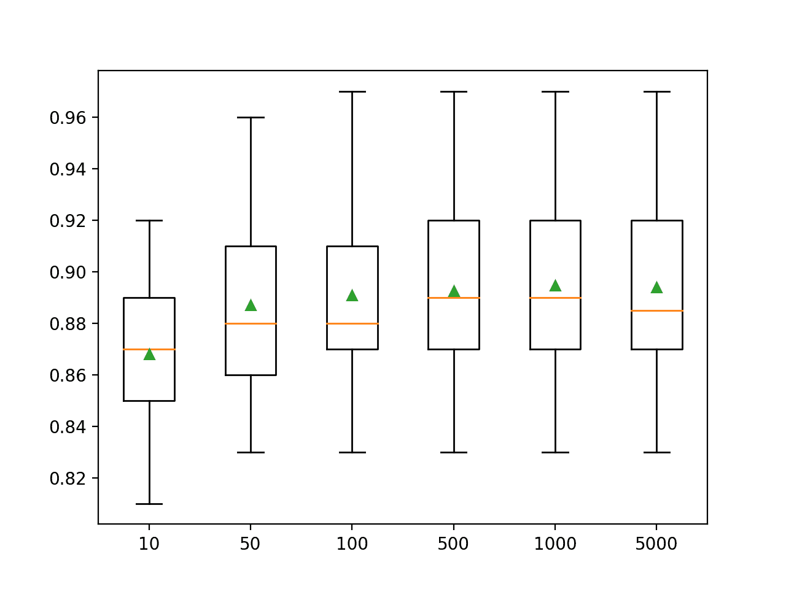

# 如何用 XGBoost 开发随机森林集成

> 原文：<https://machinelearningmastery.com/random-forest-ensembles-with-xgboost/>

最后更新于 2021 年 4 月 27 日

**XGBoost 库**提供了梯度提升的有效实现，可以配置为训练随机森林集合。

**随机森林**是比梯度提升更简单的算法。XGBoost 库允许以一种重新调整用途和利用库中实现的计算效率来训练随机森林模型的方式来训练模型。

在本教程中，您将发现如何使用 XGBoost 库开发随机森林集成。

完成本教程后，您将知道:

*   XGBoost 提供了梯度提升的有效实现，可以配置为训练随机森林集成。
*   如何使用 XGBoost API 训练和评估用于分类和回归的随机森林集成模型。
*   如何调整 XGBoost 随机森林集合模型的超参数。

**用我的新书[Python 集成学习算法](https://machinelearningmastery.com/ensemble-learning-algorithms-with-python/)启动你的项目**，包括*分步教程*和所有示例的 *Python 源代码*文件。

我们开始吧。


如何用 XGBoost 开发随机森林集成
摄影:简·莫西曼，版权所有。

## 教程概述

本教程分为五个部分；它们是:

1.  带扩展的随机森林
2.  随机森林的扩展应用编程接口
3.  为分类选择随机森林
4.  用于回归的随机森林
5.  随机森林超参数

## 带扩展的随机森林

[XGBoost](https://github.com/dmlc/xgboost) 是一个开源库，提供了梯度提升集成算法的高效实现，简称为 Extreme Gradient Boosting 或 XGBoost。

因此，XGBoost 指的是项目、库和算法本身。

梯度提升是分类和回归预测建模项目的首选算法，因为它通常会获得最佳表现。梯度提升的问题是训练一个模型通常非常慢，并且这个问题被大数据集所加剧。

XGBoost 通过引入大量技术来解决梯度提升的速度问题，这些技术可以显著加速模型的训练，并且通常会带来更好的模型整体表现。

您可以在本教程中了解更多关于 XGBoost 的信息:

*   [应用机器学习 XGBoost 的温和介绍](https://machinelearningmastery.com/gentle-introduction-xgboost-applied-machine-learning/)

除了支持梯度提升，核心的 XGBoost 算法还可以配置为支持其他类型的树集成算法，如随机森林。

随机森林是决策树算法的集合。

每个决策树都适合训练数据集的一个[自举样本](https://machinelearningmastery.com/a-gentle-introduction-to-the-bootstrap-method/)。这是训练数据集的一个示例，其中给定的示例(行)可以被选择多次，称为带替换的采样。

重要的是，考虑了树中每个分割点的输入变量(列)的随机子集。这确保了添加到集合中的每棵树都是有技巧的，但随机方式不同。在每个分割点考虑的特征数量通常是一个小子集。例如，在分类问题上，常见的启发式方法是选择等于特征总数平方根的特征数，例如，如果数据集有 20 个输入变量，则选择 4 个。

您可以在教程中了解更多关于随机森林集成算法的信息:

*   [如何用 Python 开发随机森林集成](https://machinelearningmastery.com/random-forest-ensemble-in-python/)

使用 XGBoost 库训练随机森林集成的主要好处是速度。预计它的使用速度将明显快于其他实现，例如本机 Sklearn 实现。

现在我们知道了 XGBoost 提供了对随机森林集成的支持，让我们看看具体的 API。

## 随机森林的扩展应用编程接口

第一步是安装 XGBoost 库。

我建议使用 pip 包管理器，从命令行使用以下命令:

```py
sudo pip install xgboost
```

安装后，我们可以加载库，并在 Python 脚本中打印版本，以确认它安装正确。

```py
# check xgboost version
import xgboost
# display version
print(xgboost.__version__)
```

运行脚本将加载 XGBoost 库并打印库版本号。

您的版本号应该相同或更高。

```py
1.0.2
```

XGBoost 库提供了两个包装类，允许该库提供的随机森林实现与 Sklearn 机器学习库一起使用。

它们分别是用于分类和回归的 [XGBRFClassifier](https://xgboost.readthedocs.io/en/latest/python/python_api.html#xgboost.XGBRFClassifier) 和[xgbrfreversor](https://xgboost.readthedocs.io/en/latest/python/python_api.html#xgboost.XGBRFRegressor)类。

```py
...
# define the model
model = XGBRFClassifier()
```

集成中使用的树的数量可以通过“*n _ estimator*”参数来设置，通常，这是增加的，直到模型没有观察到表现的进一步提高。通常使用成百上千棵树。

```py
...
# define the model
model = XGBRFClassifier(n_estimators=100)
```

XGBoost 不支持为每个决策树绘制引导样本。这是图书馆的一个局限。

相反，可以通过“*子样本*”参数将训练数据集的子样本指定为 0.0 到 1.0 之间的百分比(训练数据集中的 100%行)。建议使用 0.8 或 0.9 的值，以确保数据集足够大，可以训练出熟练的模型，但又足够不同，可以在集成中引入一些多样性。

```py
...
# define the model
model = XGBRFClassifier(n_estimators=100, subsample=0.9)
```

训练模型时在每个分割点使用的特征数量可以通过“ *colsample_bynode* ”参数指定，并取数据集中 0.0 到 1.0 的列数百分比(训练数据集中输入行的 100%)。

如果我们的训练数据集中有 20 个输入变量，并且分类问题的启发式方法是特征数量的平方根，那么这可以设置为 sqrt(20) / 20，或者大约 4 / 20 或 0.2。

```py
...
# define the model
model = XGBRFClassifier(n_estimators=100, subsample=0.9, colsample_bynode=0.2)
```

您可以在这里了解更多关于如何为随机森林集成配置 XGBoost 库的信息:

*   [XGBoost 中的随机森林](https://xgboost.readthedocs.io/en/latest/tutorials/rf.html)

既然我们已经熟悉了如何使用 XGBoost API 来定义随机森林集合，那么让我们来看看一些工作示例。

## 为分类选择随机森林

在本节中，我们将着眼于为分类问题开发一个 XGBoost 随机森林集成。

首先，我们可以使用 [make_classification()函数](https://Sklearn.org/stable/modules/generated/sklearn.datasets.make_classification.html)创建一个包含 1000 个示例和 20 个输入特征的合成二进制分类问题。

下面列出了完整的示例。

```py
# test classification dataset
from sklearn.datasets import make_classification
# define dataset
X, y = make_classification(n_samples=1000, n_features=20, n_informative=15, n_redundant=5, random_state=7)
# summarize the dataset
print(X.shape, y.shape)
```

运行该示例将创建数据集并总结输入和输出组件的形状。

```py
(1000, 20) (1000,)
```

接下来，我们可以在这个数据集上评估一个 XGBoost 随机森林算法。

我们将使用[重复分层 k 折叠交叉验证](https://machinelearningmastery.com/cross-validation-for-imbalanced-classification/)来评估模型，重复 3 次，折叠 10 次。我们将报告所有重复和折叠的模型准确率的平均值和标准偏差。

```py
# evaluate xgboost random forest algorithm for classification
from numpy import mean
from numpy import std
from sklearn.datasets import make_classification
from sklearn.model_selection import cross_val_score
from sklearn.model_selection import RepeatedStratifiedKFold
from xgboost import XGBRFClassifier
# define dataset
X, y = make_classification(n_samples=1000, n_features=20, n_informative=15, n_redundant=5, random_state=7)
# define the model
model = XGBRFClassifier(n_estimators=100, subsample=0.9, colsample_bynode=0.2)
# define the model evaluation procedure
cv = RepeatedStratifiedKFold(n_splits=10, n_repeats=3, random_state=1)
# evaluate the model and collect the scores
n_scores = cross_val_score(model, X, y, scoring='accuracy', cv=cv, n_jobs=-1)
# report performance
print('Mean Accuracy: %.3f (%.3f)' % (mean(n_scores), std(n_scores)))
```

运行该示例会报告模型的均值和标准差准确率。

**注**:考虑到算法或评估程序的随机性，或数值准确率的差异，您的[结果可能会有所不同](https://machinelearningmastery.com/different-results-each-time-in-machine-learning/)。考虑运行该示例几次，并比较平均结果。

在这种情况下，我们可以看到 XGBoost 随机森林集成实现了大约 89.1%的分类准确率。

```py
Mean Accuracy: 0.891 (0.036)
```

我们也可以使用 XGBoost 随机森林模型作为最终模型，进行分类预测。

首先，XGBoost 随机森林集合适合所有可用数据，然后可以调用 *predict()* 函数对新数据进行预测。

下面的示例在我们的二进制类别数据集上演示了这一点。

```py
# make predictions using xgboost random forest for classification
from numpy import asarray
from sklearn.datasets import make_classification
from xgboost import XGBRFClassifier
# define dataset
X, y = make_classification(n_samples=1000, n_features=20, n_informative=15, n_redundant=5, random_state=7)
# define the model
model = XGBRFClassifier(n_estimators=100, subsample=0.9, colsample_bynode=0.2)
# fit the model on the whole dataset
model.fit(X, y)
# define a row of data
row = [0.2929949,-4.21223056,-1.288332,-2.17849815,-0.64527665,2.58097719,0.28422388,-7.1827928,-1.91211104,2.73729512,0.81395695,3.96973717,-2.66939799,3.34692332,4.19791821,0.99990998,-0.30201875,-4.43170633,-2.82646737,0.44916808]
row = asarray([row])
# make a prediction
yhat = model.predict(row)
# summarize the prediction
print('Predicted Class: %d' % yhat[0])
```

运行该示例使 XGBoost 随机森林集成模型适用于整个数据集，然后用于对新的数据行进行预测，就像我们在应用程序中使用该模型时可能做的那样。

```py
Predicted Class: 1
```

现在我们已经熟悉了使用随机森林进行分类，让我们看看回归的 API。

## 用于回归的随机森林

在本节中，我们将着眼于为回归问题开发一个 XGBoost 随机森林集成。

首先，我们可以使用[make _ revolution()函数](https://Sklearn.org/stable/modules/generated/sklearn.datasets.make_regression.html)创建一个包含 1000 个示例和 20 个输入特征的合成回归问题。

下面列出了完整的示例。

```py
# test regression dataset
from sklearn.datasets import make_regression
# define dataset
X, y = make_regression(n_samples=1000, n_features=20, n_informative=15, noise=0.1, random_state=7)
# summarize the dataset
print(X.shape, y.shape)
```

运行该示例将创建数据集并总结输入和输出组件的形状。

```py
(1000, 20) (1000,)
```

接下来，我们可以在这个数据集上评估一个 XGBoost 随机森林集成。

正如我们在上一节中所做的，我们将使用重复的 k-fold 交叉验证来评估模型，重复 3 次，重复 10 次。

我们将报告所有重复和折叠模型的平均绝对误差(MAE)。Sklearn 库使 MAE 为负，因此它被最大化而不是最小化。这意味着负 MAE 越大越好，完美模型的 MAE 为 0。

下面列出了完整的示例。

```py
# evaluate xgboost random forest ensemble for regression
from numpy import mean
from numpy import std
from sklearn.datasets import make_regression
from sklearn.model_selection import cross_val_score
from sklearn.model_selection import RepeatedKFold
from xgboost import XGBRFRegressor
# define dataset
X, y = make_regression(n_samples=1000, n_features=20, n_informative=15, noise=0.1, random_state=7)
# define the model
model = XGBRFRegressor(n_estimators=100, subsample=0.9, colsample_bynode=0.2)
# define the model evaluation procedure
cv = RepeatedKFold(n_splits=10, n_repeats=3, random_state=1)
# evaluate the model and collect the scores
n_scores = cross_val_score(model, X, y, scoring='neg_mean_absolute_error', cv=cv, n_jobs=-1)
# report performance
print('MAE: %.3f (%.3f)' % (mean(n_scores), std(n_scores)))
```

运行该示例会报告模型的均值和标准差 MAE。

**注**:考虑到算法或评估程序的随机性，或数值准确率的差异，您的[结果可能会有所不同](https://machinelearningmastery.com/different-results-each-time-in-machine-learning/)。考虑运行该示例几次，并比较平均结果。

在这种情况下，我们可以看到具有默认超参数的随机森林集合达到了大约 108 的 MAE。

```py
MAE: -108.290 (5.647)
```

我们还可以使用 XGBoost 随机森林集合作为最终模型，并对回归进行预测。

首先，随机森林集合适用于所有可用数据，然后可以调用 predict()函数对新数据进行预测。

下面的例子在我们的回归数据集上演示了这一点。

```py
# gradient xgboost random forest for making predictions for regression
from numpy import asarray
from sklearn.datasets import make_regression
from xgboost import XGBRFRegressor
# define dataset
X, y = make_regression(n_samples=1000, n_features=20, n_informative=15, noise=0.1, random_state=7)
# define the model
model = XGBRFRegressor(n_estimators=100, subsample=0.9, colsample_bynode=0.2)
# fit the model on the whole dataset
model.fit(X, y)
# define a single row of data
row = [0.20543991,-0.97049844,-0.81403429,-0.23842689,-0.60704084,-0.48541492,0.53113006,2.01834338,-0.90745243,-1.85859731,-1.02334791,-0.6877744,0.60984819,-0.70630121,-1.29161497,1.32385441,1.42150747,1.26567231,2.56569098,-0.11154792]
row = asarray([row])
# make a prediction
yhat = model.predict(row)
# summarize the prediction
print('Prediction: %d' % yhat[0])
```

运行该示例使 XGBoost 随机森林集成模型适用于整个数据集，然后用于对新的数据行进行预测，就像我们在应用程序中使用该模型时可能做的那样。

```py
Prediction: 17
```

既然我们已经熟悉了如何开发和评估 XGBoost 随机森林集成，那么让我们来看看如何配置模型。

## 随机森林超参数

在本节中，我们将仔细研究一些您应该考虑为随机森林集合进行调整的超参数，以及它们对模型表现的影响。

### 探索树的数量

树的数量是为 XGBoost 随机林配置的另一个关键超参数。

通常，树的数量会增加，直到模型表现稳定下来。直觉可能暗示更多的树会导致过拟合，尽管事实并非如此。给定学习算法的随机性质，bagging 和随机森林算法似乎在某种程度上都不会过拟合训练数据集。

树的数量可以通过“*n _ estimates*”参数设置，默认为 100。

下面的示例探讨了值在 10 到 1000 之间的树的数量的影响。

```py
# explore xgboost random forest number of trees effect on performance
from numpy import mean
from numpy import std
from sklearn.datasets import make_classification
from sklearn.model_selection import cross_val_score
from sklearn.model_selection import RepeatedStratifiedKFold
from xgboost import XGBRFClassifier
from matplotlib import pyplot

# get the dataset
def get_dataset():
	X, y = make_classification(n_samples=1000, n_features=20, n_informative=15, n_redundant=5, random_state=7)
	return X, y

# get a list of models to evaluate
def get_models():
	models = dict()
	# define the number of trees to consider
	n_trees = [10, 50, 100, 500, 1000, 5000]
	for v in n_trees:
		models[str(v)] = XGBRFClassifier(n_estimators=v, subsample=0.9, colsample_bynode=0.2)
	return models

# evaluate a give model using cross-validation
def evaluate_model(model, X, y):
	# define the model evaluation procedure
	cv = RepeatedStratifiedKFold(n_splits=10, n_repeats=3, random_state=1)
	# evaluate the model
	scores = cross_val_score(model, X, y, scoring='accuracy', cv=cv, n_jobs=-1)
	return scores

# define dataset
X, y = get_dataset()
# get the models to evaluate
models = get_models()
# evaluate the models and store results
results, names = list(), list()
for name, model in models.items():
	# evaluate the model and collect the results
	scores = evaluate_model(model, X, y)
	# store the results
	results.append(scores)
	names.append(name)
	# summarize performance along the way
	print('>%s %.3f (%.3f)' % (name, mean(scores), std(scores)))
# plot model performance for comparison
pyplot.boxplot(results, labels=names, showmeans=True)
pyplot.show()
```

运行该示例首先报告每个配置的树数的平均准确率。

**注**:考虑到算法或评估程序的随机性，或数值准确率的差异，您的[结果可能会有所不同](https://machinelearningmastery.com/different-results-each-time-in-machine-learning/)。考虑运行该示例几次，并比较平均结果。

在这种情况下，我们可以看到大约 500 棵树后，表现会上升并保持不变。平均准确度分数在 500、1000 和 5000 棵树之间波动，这可能是统计噪声。

```py
>10 0.868 (0.030)
>50 0.887 (0.034)
>100 0.891 (0.036)
>500 0.893 (0.033)
>1000 0.895 (0.035)
>5000 0.894 (0.036)
```

为每个配置数量的树的准确度分数的分布创建一个方框和须图。



XGBoost 随机森林集合大小与分类准确率的箱线图

### 探索功能数量

为每个分割点随机采样的要素数量可能是为随机森林配置的最重要的要素。

它是通过“ *colsample_bynode* ”参数设置的，该参数从 0 到 1 取输入特征数量的百分比。

以下示例探讨了在每个分割点随机选择的特征数量对模型准确率的影响。我们将尝试从 0.0 到 1.0 的值，增量为 0.1，尽管我们预计低于 0.2 或 0.3 的值会产生良好或最佳的表现，因为这相当于输入特征数量的平方根，这是一种常见的启发式方法。

```py
# explore xgboost random forest number of features effect on performance
from numpy import mean
from numpy import std
from numpy import arange
from sklearn.datasets import make_classification
from sklearn.model_selection import cross_val_score
from sklearn.model_selection import RepeatedStratifiedKFold
from xgboost import XGBRFClassifier
from matplotlib import pyplot

# get the dataset
def get_dataset():
	X, y = make_classification(n_samples=1000, n_features=20, n_informative=15, n_redundant=5, random_state=7)
	return X, y

# get a list of models to evaluate
def get_models():
	models = dict()
	for v in arange(0.1, 1.1, 0.1):
		key = '%.1f' % v
		models[key] = XGBRFClassifier(n_estimators=100, subsample=0.9, colsample_bynode=v)
	return models

# evaluate a give model using cross-validation
def evaluate_model(model, X, y):
	# define the model evaluation procedure
	cv = RepeatedStratifiedKFold(n_splits=10, n_repeats=3, random_state=1)
	# evaluate the model
	scores = cross_val_score(model, X, y, scoring='accuracy', cv=cv, n_jobs=-1)
	return scores

# define dataset
X, y = get_dataset()
# get the models to evaluate
models = get_models()
# evaluate the models and store results
results, names = list(), list()
for name, model in models.items():
	# evaluate the model and collect the results
	scores = evaluate_model(model, X, y)
	# store the results
	results.append(scores)
	names.append(name)
	# summarize performance along the way
	print('>%s %.3f (%.3f)' % (name, mean(scores), std(scores)))
# plot model performance for comparison
pyplot.boxplot(results, labels=names, showmeans=True)
pyplot.show()
```

运行示例首先报告每个特征集大小的平均准确率。

**注**:考虑到算法或评估程序的随机性，或数值准确率的差异，您的[结果可能会有所不同](https://machinelearningmastery.com/different-results-each-time-in-machine-learning/)。考虑运行该示例几次，并比较平均结果。

在这种情况下，随着集成成员使用更多的输入特征，我们可以看到平均模型表现下降的总体趋势。

结果表明，在这种情况下，推荐值 0.2 将是一个不错的选择。

```py
>0.1 0.889 (0.032)
>0.2 0.891 (0.036)
>0.3 0.887 (0.032)
>0.4 0.886 (0.030)
>0.5 0.878 (0.033)
>0.6 0.874 (0.031)
>0.7 0.869 (0.027)
>0.8 0.867 (0.027)
>0.9 0.856 (0.023)
>1.0 0.846 (0.027)
```

为每个要素集大小的准确率分数分布创建了一个方框和触须图。

我们可以看到表现随着决策树所考虑的特征数量而下降的趋势。


XGBoost 随机森林特征集大小与分类准确率的方框图

## 进一步阅读

如果您想更深入地了解这个主题，本节将提供更多资源。

### 教程

*   [应用机器学习 XGBoost 的温和介绍](https://machinelearningmastery.com/gentle-introduction-xgboost-applied-machine-learning/)
*   [如何用 Python 开发随机森林集成](https://machinelearningmastery.com/random-forest-ensemble-in-python/)
*   [使用 Sklearn、XGBoost、LightGBM 和 CatBoost 进行梯度提升](https://machinelearningmastery.com/gradient-boosting-with-Sklearn-xgboost-lightgbm-and-catboost/)
*   [如何用 scikit 开发你的第一个 Python xboost 模型-学习](https://machinelearningmastery.com/develop-first-xgboost-model-python-Sklearn/)

### 蜜蜂

*   [XGBoost 中的随机森林](https://xgboost.readthedocs.io/en/latest/tutorials/rf.html)
*   [xgboost。xgbrfcclass ification API](https://xgboost.readthedocs.io/en/latest/python/python_api.html#xgboost.XGBRFClassifier)。
*   [xgboost。xgbrfregresor API](https://xgboost.readthedocs.io/en/latest/python/python_api.html#xgboost.XGBRFRegressor)。

## 摘要

在本教程中，您发现了如何使用 XGBoost 库开发随机森林集成。

具体来说，您了解到:

*   XGBoost 提供了梯度提升的有效实现，可以配置为训练随机森林集成。
*   如何使用 XGBoost API 训练和评估用于分类和回归的随机森林集成模型。
*   如何调整 XGBoost 随机森林集合模型的超参数。

**你有什么问题吗？**
在下面的评论中提问，我会尽力回答。