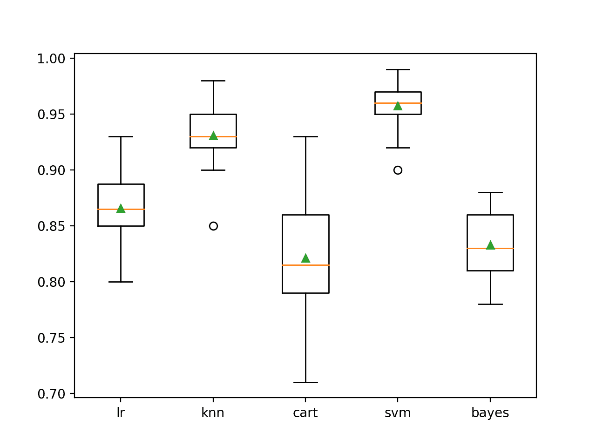
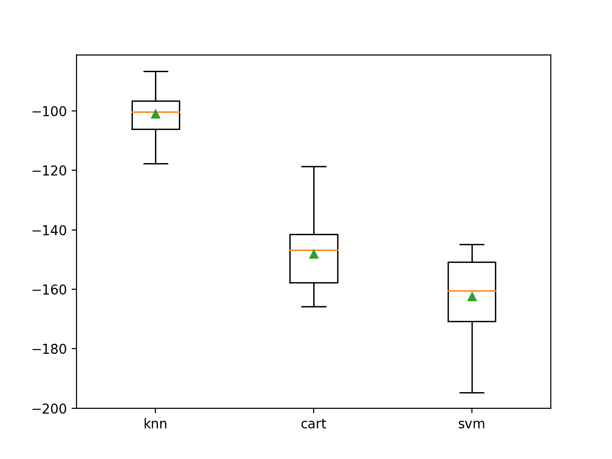
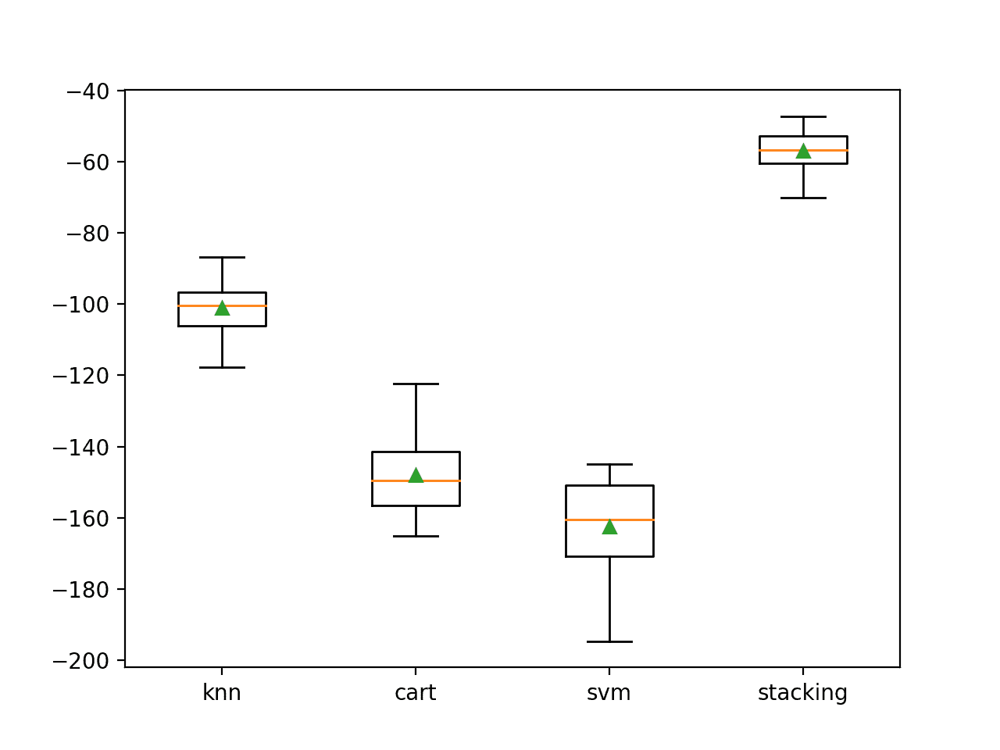

# 使用 Python 开发堆叠集成机器学习

> 原文：<https://machinelearningmastery.com/stacking-ensemble-machine-learning-with-python/>

最后更新于 2021 年 4 月 27 日

堆叠或堆叠泛化是一种集成机器学习算法。

它使用元学习算法来学习如何最好地组合来自两个或多个基本机器学习算法的预测。

堆叠的好处是，它可以利用一系列在分类或回归任务中表现良好的模型的能力，并做出比集成中的任何单个模型表现更好的预测。

在本教程中，您将发现 Python 中的堆叠泛化集成或堆叠。

完成本教程后，您将知道:

*   堆叠是一种集成机器学习算法，它学习如何最好地组合来自多个表现良好的机器学习模型的预测。
*   Sklearn 库提供了 Python 中堆叠集成的标准实现。
*   如何使用堆叠集成进行回归和分类预测建模？

**用我的新书[Python 集成学习算法](https://machinelearningmastery.com/ensemble-learning-algorithms-with-python/)启动你的项目**，包括*分步教程*和所有示例的 *Python 源代码*文件。

我们开始吧。

*   **2020 年 8 月更新**:改进代码示例，增加更多参考。


用 Python 堆叠集成机器学习
图片由[lamix](https://flickr.com/photos/lamoix/3757737766/)提供，保留部分权利。

## 教程概述

本教程分为四个部分；它们是:

1.  堆叠一般化
2.  堆叠科学工具包-学习应用编程接口
3.  分类堆叠
4.  回归的叠加

## 堆叠一般化

堆叠泛化或简称“T0”堆叠是一种集成机器学习算法。

它包括在同一数据集上组合来自多个机器学习模型的预测，如装袋和提升。

堆叠解决了这个问题:

*   给定多个在一个问题上很熟练的机器学习模型，但是以不同的方式，你如何选择使用哪个模型(信任)？

解决这个问题的方法是使用另一个机器学习模型，该模型学习何时使用或信任集成中的每个模型。

*   与装袋不同，在堆叠中，模型通常是不同的(例如，不是所有的决策树)，并且适合同一数据集(例如，代替训练数据集的样本)。
*   与增强不同，在堆叠中，使用单个模型来学习如何最好地组合来自贡献模型的预测(例如，代替校正先前模型的预测的模型序列)。

堆叠模型的体系结构包括两个或多个基础模型，通常称为 0 级模型，以及一个组合基础模型预测的元模型，称为 1 级模型。

*   **0 级模型(*基础模型* )** :模型适合训练数据，并且其预测被编译。
*   **一级模型(*元模型* )** :学习如何最好地组合基础模型预测的模型。

元模型基于基础模型对样本外数据的预测进行训练。也就是说，不用于训练基本模型的数据被馈送到基本模型，进行预测，并且这些预测连同预期输出一起提供用于拟合元模型的训练数据集的输入和输出对。

用作元模型输入的基本模型的输出在回归的情况下可以是真实值，在分类的情况下可以是概率值、类概率值或类标签。

为元模型准备训练数据集的最常见方法是通过基础模型的 [k 倍交叉验证](https://machinelearningmastery.com/k-fold-cross-validation/)，其中[超倍预测](https://machinelearningmastery.com/out-of-fold-predictions-in-machine-learning/)被用作元模型的训练数据集的基础。

元模型的训练数据还可以包括基础模型的输入，例如训练数据的输入元素。这可以为元模型提供关于如何最好地组合来自元模型的预测的附加上下文。

一旦为元模型准备了训练数据集，就可以在这个数据集上独立地训练元模型，并且可以在整个原始训练数据集上训练基本模型。

当多个不同的机器学习模型在一个数据集上有技能，但在不同的方面有技能时，堆叠是合适的。另一种说法是，模型做出的预测或模型做出的预测中的误差是不相关的或具有低相关性。

基础模型通常复杂多样。因此，使用一系列对如何解决预测建模任务做出非常不同假设的模型通常是一个好主意，例如线性模型、决策树、支持向量机、神经网络等。其他集成算法也可以用作基础模型，例如随机森林。

*   **基础模型**:使用不同范围的模型，对预测任务做出不同的假设。

元模型通常很简单，提供了对基础模型所做预测的平滑解释。因此，线性模型通常用作元模型，例如回归任务的线性回归(预测数值)和分类任务的逻辑回归(预测类别标签)。虽然这很常见，但不是必需的。

*   **回归元模型**:线性回归。
*   **分类元模型**:逻辑回归。

使用一个简单的线性模型作为元模型通常会给出堆叠的通俗名称“*混合*”与预测一样，是基本模型所做预测的加权平均或混合。

[超级学习器](https://machinelearningmastery.com/super-learner-ensemble-in-python/)可以被认为是一种特殊类型的堆叠。

堆叠旨在提高建模表现，尽管不能保证在所有情况下都能带来改进。

实现表现的提高取决于问题的复杂性，以及它是否足够好地由训练数据表示，并且足够复杂，以至于可以通过组合预测来学习更多。这也取决于基础模型的选择，以及它们在预测(或误差)方面是否足够熟练和足够不相关。

如果基础模型的表现与堆叠集成一样好或更好，则应该使用基础模型，因为它的复杂性更低(例如，描述、训练和维护更简单)。

## 堆叠科学工具包-学习应用编程接口

堆叠可以从零开始实现，尽管这对初学者来说很有挑战性。

有关在 Python 中从零开始实现堆栈的示例，请参见教程:

*   [如何用 Python 从零开始实现堆叠泛化(堆叠)](https://machinelearningmastery.com/implementing-stacking-scratch-python/)

有关为深度学习从零开始实现堆叠的示例，请参见教程:

*   [如何在 Python 中开发深度学习神经网络的堆叠集成](https://machinelearningmastery.com/stacking-ensemble-for-deep-learning-neural-networks/)

Sklearn Python 机器学习库为机器学习提供了堆栈的实现。

它在 0.22 版及更高版本的库中可用。

首先，通过运行以下脚本来确认您使用的是现代版本的库:

```py
# check Sklearn version
import sklearn
print(sklearn.__version__)
```

运行脚本将打印您的 Sklearn 版本。

您的版本应该相同或更高。如果没有，您必须升级 Sklearn 库的版本。

```py
0.22.1
```

堆叠通过[堆叠回归器](https://Sklearn.org/stable/modules/generated/sklearn.ensemble.StackingRegressor.html)和[堆叠分类器](https://Sklearn.org/stable/modules/generated/sklearn.ensemble.StackingClassifier.html)类提供。

两个模型的操作方式相同，采用的参数也相同。使用模型需要指定一个估计量列表(0 级模型)和一个最终估计量(1 级或元模型)。

0 级模型或基础模型的列表通过“*估计器*参数提供。这是一个 Python 列表，其中列表中的每个元素都是一个元组，具有模型的名称和配置的模型实例。

例如，下面定义了两个 0 级模型:

```py
...
models = [('lr',LogisticRegression()),('svm',SVC())
stacking = StackingClassifier(estimators=models)
```

列表中的每个模型也可以是[管道](https://Sklearn.org/stable/modules/generated/sklearn.pipeline.Pipeline.html)，包括模型在训练数据集中拟合模型之前所需的任何数据准备。例如:

```py
...
models = [('lr',LogisticRegression()),('svm',make_pipeline(StandardScaler(),SVC()))
stacking = StackingClassifier(estimators=models)
```

一级模型或元模型通过“ *final_estimator* ”参数提供。默认情况下，回归设置为*线性回归*，分类设置为*后勤回归*，这些都是您可能不想更改的合理默认值。

元模型的数据集是使用交叉验证准备的。默认情况下，使用 5 倍交叉验证，尽管这可以通过“ *cv* ”参数进行更改，并设置为数字(例如，10 倍交叉验证为 10)或交叉验证对象(例如，*stratifiedfold*)。

有时，如果为元模型准备的数据集也包括 0 级模型的输入，例如输入训练数据，则可以获得更好的表现。这可以通过将“*通过*”参数设置为真来实现，默认情况下不启用。

现在我们已经熟悉了 Sklearn 中的堆栈 API，让我们来看看一些工作示例。

## 分类堆叠

在这一节中，我们将研究使用堆叠来解决分类问题。

首先，我们可以使用 [make_classification()函数](https://Sklearn.org/stable/modules/generated/sklearn.datasets.make_classification.html)创建一个包含 1000 个示例和 20 个输入特征的合成二进制分类问题。

下面列出了完整的示例。

```py
# test classification dataset
from sklearn.datasets import make_classification
# define dataset
X, y = make_classification(n_samples=1000, n_features=20, n_informative=15, n_redundant=5, random_state=1)
# summarize the dataset
print(X.shape, y.shape)
```

运行该示例将创建数据集并总结输入和输出组件的形状。

```py
(1000, 20) (1000,)
```

接下来，我们可以在数据集上评估一套不同的机器学习模型。

具体来说，我们将评估以下五种算法:

*   逻辑回归。
*   k-最近邻居。
*   决策树。
*   支持向量机。
*   朴素贝叶斯。

将使用默认模型超参数评估每个算法。下面的函数 *get_models()* 创建我们想要评估的模型。

```py
# get a list of models to evaluate
def get_models():
	models = dict()
	models['lr'] = LogisticRegression()
	models['knn'] = KNeighborsClassifier()
	models['cart'] = DecisionTreeClassifier()
	models['svm'] = SVC()
	models['bayes'] = GaussianNB()
	return models
```

每个模型将使用重复的 k 倍交叉验证进行评估。

下面的 *evaluate_model()* 函数获取一个模型实例，并从三次重复的分层 10 倍交叉验证中返回一个分数列表。

```py
# evaluate a given model using cross-validation
def evaluate_model(model, X, y):
	cv = RepeatedStratifiedKFold(n_splits=10, n_repeats=3, random_state=1)
	scores = cross_val_score(model, X, y, scoring='accuracy', cv=cv, n_jobs=-1, error_score='raise')
	return scores
```

然后，我们可以报告每种算法的平均表现，并创建一个方框图和触须图来比较每种算法的准确性分数分布。

将这些联系在一起，完整的示例如下所示。

```py
# compare standalone models for binary classification
from numpy import mean
from numpy import std
from sklearn.datasets import make_classification
from sklearn.model_selection import cross_val_score
from sklearn.model_selection import RepeatedStratifiedKFold
from sklearn.linear_model import LogisticRegression
from sklearn.neighbors import KNeighborsClassifier
from sklearn.tree import DecisionTreeClassifier
from sklearn.svm import SVC
from sklearn.naive_bayes import GaussianNB
from matplotlib import pyplot

# get the dataset
def get_dataset():
	X, y = make_classification(n_samples=1000, n_features=20, n_informative=15, n_redundant=5, random_state=1)
	return X, y

# get a list of models to evaluate
def get_models():
	models = dict()
	models['lr'] = LogisticRegression()
	models['knn'] = KNeighborsClassifier()
	models['cart'] = DecisionTreeClassifier()
	models['svm'] = SVC()
	models['bayes'] = GaussianNB()
	return models

# evaluate a given model using cross-validation
def evaluate_model(model, X, y):
	cv = RepeatedStratifiedKFold(n_splits=10, n_repeats=3, random_state=1)
	scores = cross_val_score(model, X, y, scoring='accuracy', cv=cv, n_jobs=-1, error_score='raise')
	return scores

# define dataset
X, y = get_dataset()
# get the models to evaluate
models = get_models()
# evaluate the models and store results
results, names = list(), list()
for name, model in models.items():
	scores = evaluate_model(model, X, y)
	results.append(scores)
	names.append(name)
	print('>%s %.3f (%.3f)' % (name, mean(scores), std(scores)))
# plot model performance for comparison
pyplot.boxplot(results, labels=names, showmeans=True)
pyplot.show()
```

运行该示例首先报告每个模型的平均值和标准偏差准确率。

**注**:考虑到算法或评估程序的随机性，或数值准确率的差异，您的[结果可能会有所不同](https://machinelearningmastery.com/different-results-each-time-in-machine-learning/)。考虑运行该示例几次，并比较平均结果。

我们可以看到，在这种情况下，SVM 表现最好，平均准确率约为 95.7%。

```py
>lr 0.866 (0.029)
>knn 0.931 (0.025)
>cart 0.821 (0.050)
>svm 0.957 (0.020)
>bayes 0.833 (0.031)
```

然后创建一个方框图，比较每个模型的分布准确率分数，让我们清楚地看到 KNN 和 SVM 的平均表现优于 LR、CART 和 Bayes。



二分类独立模型准确率的箱线图

这里我们有五种不同的算法表现良好，大概在这个数据集上以不同的方式。

接下来，我们可以尝试使用堆叠将这五个模型组合成单个集成模型。

我们可以使用逻辑回归模型来学习如何最好地组合来自五个独立模型的预测。

下面的 *get_stacking()* 函数定义了 [StackingClassifier](https://Sklearn.org/stable/modules/generated/sklearn.ensemble.StackingClassifier.html) 模型，首先定义了五个基本模型的元组列表，然后定义了逻辑回归元模型，使用 5 重交叉验证来组合来自基本模型的预测。

```py
# get a stacking ensemble of models
def get_stacking():
	# define the base models
	level0 = list()
	level0.append(('lr', LogisticRegression()))
	level0.append(('knn', KNeighborsClassifier()))
	level0.append(('cart', DecisionTreeClassifier()))
	level0.append(('svm', SVC()))
	level0.append(('bayes', GaussianNB()))
	# define meta learner model
	level1 = LogisticRegression()
	# define the stacking ensemble
	model = StackingClassifier(estimators=level0, final_estimator=level1, cv=5)
	return model
```

我们可以在要评估的模型列表中包含堆叠集合，以及独立的模型。

```py
# get a list of models to evaluate
def get_models():
	models = dict()
	models['lr'] = LogisticRegression()
	models['knn'] = KNeighborsClassifier()
	models['cart'] = DecisionTreeClassifier()
	models['svm'] = SVC()
	models['bayes'] = GaussianNB()
	models['stacking'] = get_stacking()
	return models
```

我们的期望是堆叠集合将比任何单个基础模型表现得更好。

这并不总是这样，如果不是这样，那么应该使用基础模型而不是集合模型。

下面列出了评估堆叠集合模型和独立模型的完整示例。

```py
# compare ensemble to each baseline classifier
from numpy import mean
from numpy import std
from sklearn.datasets import make_classification
from sklearn.model_selection import cross_val_score
from sklearn.model_selection import RepeatedStratifiedKFold
from sklearn.linear_model import LogisticRegression
from sklearn.neighbors import KNeighborsClassifier
from sklearn.tree import DecisionTreeClassifier
from sklearn.svm import SVC
from sklearn.naive_bayes import GaussianNB
from sklearn.ensemble import StackingClassifier
from matplotlib import pyplot

# get the dataset
def get_dataset():
	X, y = make_classification(n_samples=1000, n_features=20, n_informative=15, n_redundant=5, random_state=1)
	return X, y

# get a stacking ensemble of models
def get_stacking():
	# define the base models
	level0 = list()
	level0.append(('lr', LogisticRegression()))
	level0.append(('knn', KNeighborsClassifier()))
	level0.append(('cart', DecisionTreeClassifier()))
	level0.append(('svm', SVC()))
	level0.append(('bayes', GaussianNB()))
	# define meta learner model
	level1 = LogisticRegression()
	# define the stacking ensemble
	model = StackingClassifier(estimators=level0, final_estimator=level1, cv=5)
	return model

# get a list of models to evaluate
def get_models():
	models = dict()
	models['lr'] = LogisticRegression()
	models['knn'] = KNeighborsClassifier()
	models['cart'] = DecisionTreeClassifier()
	models['svm'] = SVC()
	models['bayes'] = GaussianNB()
	models['stacking'] = get_stacking()
	return models

# evaluate a give model using cross-validation
def evaluate_model(model, X, y):
	cv = RepeatedStratifiedKFold(n_splits=10, n_repeats=3, random_state=1)
	scores = cross_val_score(model, X, y, scoring='accuracy', cv=cv, n_jobs=-1, error_score='raise')
	return scores

# define dataset
X, y = get_dataset()
# get the models to evaluate
models = get_models()
# evaluate the models and store results
results, names = list(), list()
for name, model in models.items():
	scores = evaluate_model(model, X, y)
	results.append(scores)
	names.append(name)
	print('>%s %.3f (%.3f)' % (name, mean(scores), std(scores)))
# plot model performance for comparison
pyplot.boxplot(results, labels=names, showmeans=True)
pyplot.show()
```

运行示例首先报告每个模型的表现。这包括每个基础模型的表现，然后是堆叠集合。

**注**:考虑到算法或评估程序的随机性，或数值准确率的差异，您的[结果可能会有所不同](https://machinelearningmastery.com/different-results-each-time-in-machine-learning/)。考虑运行该示例几次，并比较平均结果。

在这种情况下，我们可以看到叠加集成的平均表现似乎比任何单个模型都好，达到了大约 96.4%的准确率。

```py
>lr 0.866 (0.029)
>knn 0.931 (0.025)
>cart 0.820 (0.044)
>svm 0.957 (0.020)
>bayes 0.833 (0.031)
>stacking 0.964 (0.019)
```

创建一个显示模型分类准确率分布的方框图。

在这里，我们可以看到叠加模型的平均和中值准确率略高于 SVM 模型。


二分类的独立和堆叠模型准确率的箱线图

如果我们选择一个叠加集合作为我们的最终模型，我们可以像任何其他模型一样，拟合并使用它来对新数据进行预测。

首先对所有可用数据进行叠加集合拟合，然后调用 *predict()* 函数对新数据进行预测。

下面的示例在我们的二进制类别数据集上演示了这一点。

```py
# make a prediction with a stacking ensemble
from sklearn.datasets import make_classification
from sklearn.ensemble import StackingClassifier
from sklearn.linear_model import LogisticRegression
from sklearn.neighbors import KNeighborsClassifier
from sklearn.tree import DecisionTreeClassifier
from sklearn.svm import SVC
from sklearn.naive_bayes import GaussianNB
# define dataset
X, y = make_classification(n_samples=1000, n_features=20, n_informative=15, n_redundant=5, random_state=1)
# define the base models
level0 = list()
level0.append(('lr', LogisticRegression()))
level0.append(('knn', KNeighborsClassifier()))
level0.append(('cart', DecisionTreeClassifier()))
level0.append(('svm', SVC()))
level0.append(('bayes', GaussianNB()))
# define meta learner model
level1 = LogisticRegression()
# define the stacking ensemble
model = StackingClassifier(estimators=level0, final_estimator=level1, cv=5)
# fit the model on all available data
model.fit(X, y)
# make a prediction for one example
data = [[2.47475454,0.40165523,1.68081787,2.88940715,0.91704519,-3.07950644,4.39961206,0.72464273,-4.86563631,-6.06338084,-1.22209949,-0.4699618,1.01222748,-0.6899355,-0.53000581,6.86966784,-3.27211075,-6.59044146,-2.21290585,-3.139579]]
yhat = model.predict(data)
print('Predicted Class: %d' % (yhat))
```

运行该示例使堆叠集成模型适合整个数据集，然后用于对新的数据行进行预测，就像我们在应用程序中使用该模型时可能做的那样。

```py
Predicted Class: 0
```

## 回归的叠加

在这一节中，我们将研究使用堆叠来解决回归问题。

首先，我们可以使用[make _ revolution()函数](https://Sklearn.org/stable/modules/generated/sklearn.datasets.make_regression.html)创建一个包含 1000 个示例和 20 个输入特征的合成回归问题。

下面列出了完整的示例。

```py
# test regression dataset
from sklearn.datasets import make_regression
# define dataset
X, y = make_regression(n_samples=1000, n_features=20, n_informative=15, noise=0.1, random_state=1)
# summarize the dataset
print(X.shape, y.shape)
```

运行该示例将创建数据集并总结输入和输出组件的形状。

```py
(1000, 20) (1000,)
```

接下来，我们可以在数据集上评估一套不同的机器学习模型。

具体来说，我们将评估以下三种算法:

*   k-最近邻居。
*   决策树。
*   支持向量回归。

**注**:测试数据集可以使用线性回归模型轻松求解，因为数据集是在封面下使用线性模型创建的。因此，我们将这个模型排除在示例之外，这样我们就可以展示堆叠集成方法的优势。

将使用默认模型超参数评估每个算法。下面的函数 *get_models()* 创建我们想要评估的模型。

```py
# get a list of models to evaluate
def get_models():
	models = dict()
	models['knn'] = KNeighborsRegressor()
	models['cart'] = DecisionTreeRegressor()
	models['svm'] = SVR()
	return models
```

每个模型将使用重复的 k 倍交叉验证进行评估。下面的 *evaluate_model()* 函数获取一个模型实例，并返回三次重复 10 倍交叉验证的分数列表。

```py
# evaluate a given model using cross-validation
def evaluate_model(model, X, y):
	cv = RepeatedKFold(n_splits=10, n_repeats=3, random_state=1)
	scores = cross_val_score(model, X, y, scoring='neg_mean_absolute_error', cv=cv, n_jobs=-1, error_score='raise')
	return scores
```

然后，我们可以报告每种算法的平均表现，并创建一个方框图和触须图来比较每种算法的准确性分数分布。

在这种情况下，将使用平均绝对误差(MAE)报告模型表现。Sklearn 库反转该错误的符号，使其最大化，从-无穷大到 0，以获得最佳分数。

将这些联系在一起，完整的示例如下所示。

```py
# compare machine learning models for regression
from numpy import mean
from numpy import std
from sklearn.datasets import make_regression
from sklearn.model_selection import cross_val_score
from sklearn.model_selection import RepeatedKFold
from sklearn.linear_model import LinearRegression
from sklearn.neighbors import KNeighborsRegressor
from sklearn.tree import DecisionTreeRegressor
from sklearn.svm import SVR
from matplotlib import pyplot

# get the dataset
def get_dataset():
	X, y = make_regression(n_samples=1000, n_features=20, n_informative=15, noise=0.1, random_state=1)
	return X, y

# get a list of models to evaluate
def get_models():
	models = dict()
	models['knn'] = KNeighborsRegressor()
	models['cart'] = DecisionTreeRegressor()
	models['svm'] = SVR()
	return models

# evaluate a given model using cross-validation
def evaluate_model(model, X, y):
	cv = RepeatedKFold(n_splits=10, n_repeats=3, random_state=1)
	scores = cross_val_score(model, X, y, scoring='neg_mean_absolute_error', cv=cv, n_jobs=-1, error_score='raise')
	return scores

# define dataset
X, y = get_dataset()
# get the models to evaluate
models = get_models()
# evaluate the models and store results
results, names = list(), list()
for name, model in models.items():
	scores = evaluate_model(model, X, y)
	results.append(scores)
	names.append(name)
	print('>%s %.3f (%.3f)' % (name, mean(scores), std(scores)))
# plot model performance for comparison
pyplot.boxplot(results, labels=names, showmeans=True)
pyplot.show()
```

运行该示例首先报告每个模型的平均和标准偏差 MAE。

**注**:考虑到算法或评估程序的随机性，或数值准确率的差异，您的[结果可能会有所不同](https://machinelearningmastery.com/different-results-each-time-in-machine-learning/)。考虑运行该示例几次，并比较平均结果。

我们可以看到，在这种情况下，KNN 表现最好，平均负 MAE 约为-100。

```py
>knn -101.019 (7.161)
>cart -148.100 (11.039)
>svm -162.419 (12.565)
```

然后创建一个方框图，比较每个模型的负 MAE 分数分布。



回归的独立模型负平均绝对误差的箱线图

在这里，我们有三种不同的算法表现良好，大概在这个数据集上以不同的方式。

接下来，我们可以尝试使用堆叠将这三个模型组合成单个集成模型。

我们可以使用线性回归模型来学习如何最好地组合来自三个独立模型的预测。

下面的 *get_stacking()* 函数定义了[stackingreductor](https://Sklearn.org/stable/modules/generated/sklearn.ensemble.StackingRegressor.html)模型，首先定义三个基本模型的元组列表，然后定义线性回归元模型，使用 5 重交叉验证来组合来自基本模型的预测。

```py
# get a stacking ensemble of models
def get_stacking():
	# define the base models
	level0 = list()
	level0.append(('knn', KNeighborsRegressor()))
	level0.append(('cart', DecisionTreeRegressor()))
	level0.append(('svm', SVR()))
	# define meta learner model
	level1 = LinearRegression()
	# define the stacking ensemble
	model = StackingRegressor(estimators=level0, final_estimator=level1, cv=5)
	return model
```

我们可以在要评估的模型列表中包含堆叠集合，以及独立的模型。

```py
# get a list of models to evaluate
def get_models():
	models = dict()
	models['knn'] = KNeighborsRegressor()
	models['cart'] = DecisionTreeRegressor()
	models['svm'] = SVR()
	models['stacking'] = get_stacking()
	return models
```

我们的期望是堆叠集合将比任何单个基础模型表现得更好。

这并不总是这样，如果不是这样，那么应该使用基础模型来支持集成模型。

下面列出了评估堆叠集合模型和独立模型的完整示例。

```py
# compare ensemble to each standalone models for regression
from numpy import mean
from numpy import std
from sklearn.datasets import make_regression
from sklearn.model_selection import cross_val_score
from sklearn.model_selection import RepeatedKFold
from sklearn.linear_model import LinearRegression
from sklearn.neighbors import KNeighborsRegressor
from sklearn.tree import DecisionTreeRegressor
from sklearn.svm import SVR
from sklearn.ensemble import StackingRegressor
from matplotlib import pyplot

# get the dataset
def get_dataset():
	X, y = make_regression(n_samples=1000, n_features=20, n_informative=15, noise=0.1, random_state=1)
	return X, y

# get a stacking ensemble of models
def get_stacking():
	# define the base models
	level0 = list()
	level0.append(('knn', KNeighborsRegressor()))
	level0.append(('cart', DecisionTreeRegressor()))
	level0.append(('svm', SVR()))
	# define meta learner model
	level1 = LinearRegression()
	# define the stacking ensemble
	model = StackingRegressor(estimators=level0, final_estimator=level1, cv=5)
	return model

# get a list of models to evaluate
def get_models():
	models = dict()
	models['knn'] = KNeighborsRegressor()
	models['cart'] = DecisionTreeRegressor()
	models['svm'] = SVR()
	models['stacking'] = get_stacking()
	return models

# evaluate a given model using cross-validation
def evaluate_model(model, X, y):
	cv = RepeatedKFold(n_splits=10, n_repeats=3, random_state=1)
	scores = cross_val_score(model, X, y, scoring='neg_mean_absolute_error', cv=cv, n_jobs=-1, error_score='raise')
	return scores

# define dataset
X, y = get_dataset()
# get the models to evaluate
models = get_models()
# evaluate the models and store results
results, names = list(), list()
for name, model in models.items():
	scores = evaluate_model(model, X, y)
	results.append(scores)
	names.append(name)
	print('>%s %.3f (%.3f)' % (name, mean(scores), std(scores)))
# plot model performance for comparison
pyplot.boxplot(results, labels=names, showmeans=True)
pyplot.show()
```

运行示例首先报告每个模型的表现。这包括每个基础模型的表现，然后是堆叠集合。

**注**:考虑到算法或评估程序的随机性，或数值准确率的差异，您的[结果可能会有所不同](https://machinelearningmastery.com/different-results-each-time-in-machine-learning/)。考虑运行该示例几次，并比较平均结果。

在这种情况下，我们可以看到叠加集成的平均表现似乎比任何单个模型都好，平均负 MAE 约为-56。

```py
>knn -101.019 (7.161)
>cart -148.017 (10.635)
>svm -162.419 (12.565)
>stacking -56.893 (5.253)
```

创建一个方框图，显示模型误差分数的分布。在这里，我们可以看到堆叠模型的平均和中间分数比任何单个模型都高。



回归的独立和叠加模型负平均绝对误差的箱线图

如果我们选择一个叠加集合作为我们的最终模型，我们可以像任何其他模型一样，拟合并使用它来对新数据进行预测。

首先对所有可用数据进行叠加集合拟合，然后调用 *predict()* 函数对新数据进行预测。

下面的例子在我们的回归数据集上演示了这一点。

```py
# make a prediction with a stacking ensemble
from sklearn.datasets import make_regression
from sklearn.linear_model import LinearRegression
from sklearn.neighbors import KNeighborsRegressor
from sklearn.tree import DecisionTreeRegressor
from sklearn.svm import SVR
from sklearn.ensemble import StackingRegressor
# define dataset
X, y = make_regression(n_samples=1000, n_features=20, n_informative=15, noise=0.1, random_state=1)
# define the base models
level0 = list()
level0.append(('knn', KNeighborsRegressor()))
level0.append(('cart', DecisionTreeRegressor()))
level0.append(('svm', SVR()))
# define meta learner model
level1 = LinearRegression()
# define the stacking ensemble
model = StackingRegressor(estimators=level0, final_estimator=level1, cv=5)
# fit the model on all available data
model.fit(X, y)
# make a prediction for one example
data = [[0.59332206,-0.56637507,1.34808718,-0.57054047,-0.72480487,1.05648449,0.77744852,0.07361796,0.88398267,2.02843157,1.01902732,0.11227799,0.94218853,0.26741783,0.91458143,-0.72759572,1.08842814,-0.61450942,-0.69387293,1.69169009]]
yhat = model.predict(data)
print('Predicted Value: %.3f' % (yhat))
```

运行该示例使堆叠集成模型适合整个数据集，然后用于对新的数据行进行预测，就像我们在应用程序中使用该模型时可能做的那样。

```py
Predicted Value: 556.264
```

## 进一步阅读

如果您想更深入地了解这个主题，本节将提供更多资源。

### 相关教程

*   [如何用 Python 从零开始实现堆叠泛化(堆叠)](https://machinelearningmastery.com/implementing-stacking-scratch-python/)
*   [如何用 Keras 开发 Python 深度学习神经网络的堆叠集成](https://machinelearningmastery.com/stacking-ensemble-for-deep-learning-neural-networks/)
*   [如何在 Python 中开发超级学习器集成](https://machinelearningmastery.com/super-learner-ensemble-in-python/)
*   [如何在机器学习中使用折外预测](https://machinelearningmastery.com/out-of-fold-predictions-in-machine-learning/)
*   [k 倍交叉验证的温和介绍](https://machinelearningmastery.com/k-fold-cross-validation/)

### 报纸

*   [堆叠概括](https://www.sciencedirect.com/science/article/abs/pii/S0893608005800231)，1992。
*   [堆叠概括:什么时候起作用？](https://researchcommons.waikato.ac.nz/handle/10289/1066)，1997 年。
*   [堆叠概括中的问题](https://arxiv.org/abs/1105.5466)，1999。

### 书

*   [数据挖掘:实用机器学习工具与技术](https://amzn.to/2NJT1L8)，2016。
*   [统计学习的要素](https://amzn.to/38tJjVt)，2017。
*   [机器学习:概率视角](https://amzn.to/2Rzlc0K)，2012。

### 蜜蜂

*   [硬化。一起。StackingClassifier API](https://Sklearn.org/stable/modules/generated/sklearn.ensemble.StackingClassifier.html) 。
*   [硬化。一起。stack ingresor API](https://Sklearn.org/stable/modules/generated/sklearn.ensemble.StackingRegressor.html)。
*   [sklearn . datasets . make _ classification API](https://Sklearn.org/stable/modules/generated/sklearn.datasets.make_classification.html)。
*   [sklearn . datasets . make _ revolution API](https://Sklearn.org/stable/modules/generated/sklearn.datasets.make_regression.html)。

### 文章

*   一起学习，维基百科。

## 摘要

在本教程中，您发现了 Python 中的堆叠泛化集成或堆叠。

具体来说，您了解到:

*   堆叠是一种集成机器学习算法，它学习如何最好地组合来自多个表现良好的机器学习模型的预测。
*   Sklearn 库提供了 Python 中堆叠集成的标准实现。
*   如何使用堆叠集成进行回归和分类预测建模？

你有什么问题吗？
在下面的评论中提问，我会尽力回答。