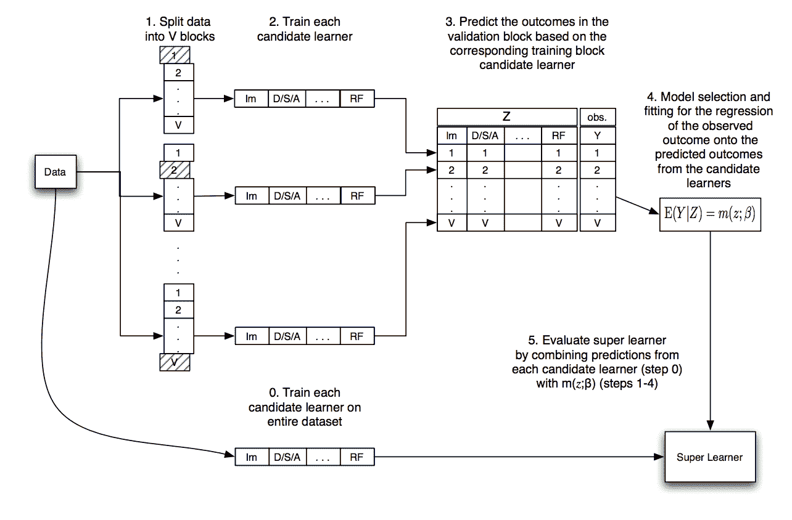

# 如何在 Python 中开发超级学习器集成

> 原文：<https://machinelearningmastery.com/super-learner-ensemble-in-python/>

最后更新于 2021 年 8 月 24 日

为预测建模问题选择机器学习算法涉及使用 K 折交叉验证来评估许多不同的模型和模型配置。

超级学习器是一种[集成机器学习](https://machinelearningmastery.com/bagging-and-random-forest-ensemble-algorithms-for-machine-learning/)算法，它结合了您可能为预测建模问题调查的所有模型和模型配置，并使用它们来做出与您可能调查的任何单个模型一样好或更好的预测。

超级学习器算法是[堆叠概括](https://machinelearningmastery.com/implementing-stacking-scratch-python/)的应用，称为堆叠或混合，应用于 [k 折叠交叉验证](https://machinelearningmastery.com/k-fold-cross-validation/)，其中所有模型使用相同的 k 折叠数据分割，元模型适合每个模型的折外预测。

在本教程中，您将发现超级学习器集成机器学习算法。

完成本教程后，您将知道:

*   超级学习器是在 k 倍交叉验证期间使用折外预测的堆叠概括的应用。
*   超级学习器集成算法使用 Sklearn 模型在 Python 中直接实现。
*   ML-集成(mlens)库提供了一个方便的实现，允许超级学习器只需几行代码就能适应和使用。

**用我的新书[Python 集成学习算法](https://machinelearningmastery.com/ensemble-learning-algorithms-with-python/)启动你的项目**，包括*分步教程*和所有示例的 *Python 源代码*文件。

我们开始吧。

*   **2020 年 1 月更新**:针对 Sklearn v0.22 API 的变化进行了更新。


如何开发 Python 超级学习器集成
图片由[马克·戈恩](https://flickr.com/photos/mark-gunn/31230981477/)提供，保留部分权利。

## 教程概述

本教程分为三个部分；它们是:

1.  什么是超级学习器？
2.  使用 Sklearn 手动培养超级学习器
3.  超级学习器与最大似然集成库

## 什么是超级学习器？

预测建模问题有数百种模型可供选择；哪一个最好？

然后，在选择了一个模型之后，您如何为您的特定数据集最好地配置它？

这些都是应用机器学习中的开放性问题。目前我们最好的答案是使用经验实验来测试和发现什么最适合您的数据集。

> 在实践中，对于给定的预测问题和数据集，通常不可能先验地知道哪个学习器表现最好。

——[超级学习器](https://www.degruyter.com/view/j/sagmb.2007.6.issue-1/sagmb.2007.6.1.1309/sagmb.2007.6.1.1309.xml)，2007 年。

这包括选择可能适合您的回归或分类问题的许多不同算法，并使用重采样技术评估它们在数据集上的表现，例如 [k 倍交叉验证](https://machinelearningmastery.com/k-fold-cross-validation/)。

然后选择根据 k 倍交叉验证在数据集上表现最好的算法，适合所有可用数据，然后您可以开始使用它进行预测。

还有一种替代方法。

考虑到您已经在数据集上安装了许多不同的算法，并且一些算法已经用不同的配置进行了多次评估。您的问题可能有几十个或几百个不同的模型。为什么不使用所有这些模型，而使用组中最好的模型呢？

这就是所谓的“*超级学习器*”集成算法背后的直觉。

超级学习器算法包括首先预定义数据的 k 倍分割，然后评估同一分割数据上的所有不同算法和算法配置。然后，所有超出范围的预测都被保留下来，并用于训练一种算法，学习如何最好地组合预测。

> 这些算法可能在所使用的协变量子集、基函数、损失函数、搜索算法和调谐参数范围等方面有所不同。

——[预测中的超级学习器](https://biostats.bepress.com/ucbbiostat/paper266/)，2010。

这个模型的结果应该不会比 k 倍交叉验证期间评估的最佳表现模型差，并且有可能比任何单一模型表现更好。

超级学习器算法是由来自伯克利的马克·范德莱恩、T2、埃里克·波利和 T4 在他们 2007 年的论文《超级学习器》中提出的它发表在一份生物学杂志上，该杂志可能不受更广泛的机器学习社区的影响。

超级学习器技术是一般方法的一个例子，简称为“*堆叠概括*”或“*堆叠*”，在应用机器学习中被称为混合，因为通常使用线性模型作为元模型。

> 超级学习器与神经网络环境中引入的堆叠算法有关…

——[预测中的超级学习器](https://biostats.bepress.com/ucbbiostat/paper266/)，2010。

有关主题堆叠的更多信息，请参见帖子:

*   [如何用 Keras 开发 Python 深度学习神经网络的堆叠集成](https://machinelearningmastery.com/stacking-ensemble-for-deep-learning-neural-networks/)
*   [如何用 Python 从零开始实现堆叠泛化(堆叠)](https://machinelearningmastery.com/implementing-stacking-scratch-python/)

我们可以把“*超级学习器*”想象成一种专门针对 k-fold 交叉验证的堆叠的具体配置。

我有时见过这种类型的混合集成，称为交叉验证集成。

该程序可总结如下:

*   1.选择训练数据集的 k 倍分割。
*   2.选择 m 个基本模型或模型配置。
*   3.对于每个基本模型:
    *   a.使用 k 倍交叉验证进行评估。
    *   b.存储所有超出范围的预测。
    *   c.在完整的训练数据集上拟合模型并存储。
*   4.根据不一致的预测建立一个元模型。
*   5.在保持数据集上评估模型或使用模型进行预测。

下图取自原始论文，总结了这个数据流。



超级学习器算法的数据流图
取自“超级学习器”

让我们仔细看看这个过程中可能存在的一些常见症结。

**问:元模型的输入和输出是什么？**

元模型接受来自基本模型的预测作为输入，并预测训练数据集的目标作为输出:

*   **输入**:基础模型的预测。
*   **输出**:训练数据集的预测。

例如，如果我们有 50 个基本模型，那么一个输入样本将是一个具有 50 个值的向量，向量中的每个值代表来自训练数据集的一个样本的一个基本模型的预测。

如果我们在训练数据集中有 1000 个示例(行)和 50 个模型，那么元模型的输入数据将是 1000 行和 50 列。

**问:元模型不会过度训练数据吗？**

可能不会。

这是超级学习器的诀窍，也是一般的堆叠概括过程。

元模型的输入是超折叠(超样本)预测。总的来说，模型的异常预测代表了模型对训练中没有看到的数据进行预测的技能或能力。

通过在其他模型的样本外预测上训练元模型，元模型学习如何校正每个模型的样本外预测，以及如何最佳地组合来自多个模型的样本外预测；实际上，它同时完成了这两项任务。

重要的是，为了了解元模型的真正能力，必须对新的样本外数据进行评估。也就是说，不用于训练基本模型的数据。

**问:这个可以用于回归和分类吗？**

是的，在回归(预测数值)的论文中有描述。

它也可以用于分类(预测类标签)，尽管在组合预测时，最好预测概率以赋予元模型更大的粒度。

**问:为什么我们要在整个训练数据集上拟合每个基础模型？**

每个基础模型都适合整个训练数据集，以便以后可以使用该模型对训练过程中没有看到的新示例进行预测。

在超级学习器需要预测之前，严格不需要这一步。

**问:我们如何做预测？**

为了对新样本(数据行)进行预测，首先，将数据行作为输入提供给每个基本模型，以从每个模型生成预测。

然后将基础模型的预测连接成一个向量，并作为输入提供给元模型。元模型然后对数据行进行最终预测。

我们可以将此过程总结如下:

*   1.取一个模型在训练中没有看到的样本。
*   2.对于每个基础模型:
    *   a.给定样本进行预测。
    *   b.商店预测。
*   3.将子模型中的预测连接成一个向量。
*   4.提供向量作为元模型的输入，以进行最终预测。

现在我们已经熟悉了超级学习器算法，让我们来看一个工作示例。

## 使用 Sklearn 手动培养超级学习器

超级学习器算法在 Sklearn Python 机器学习库之上实现起来相对简单。

在本节中，我们将为回归和分类开发一个超级学习的例子，您可以根据自己的问题进行调整。

### 回归超级学习器

我们将使用[make _ revolution()](https://Sklearn.org/stable/modules/generated/sklearn.datasets.make_regression.html)测试问题，生成 1000 个示例(行)和 100 个特征(列)。这是一个简单的回归问题，输入和输出之间存在线性关系，并带有附加噪声。

我们将分割数据，以便 50%用于训练模型，50%用于评估最终的超级模型和基础模型。

```py
...
# create the inputs and outputs
X, y = make_regression(n_samples=1000, n_features=100, noise=0.5)
# split
X, X_val, y, y_val = train_test_split(X, y, test_size=0.50)
print('Train', X.shape, y.shape, 'Test', X_val.shape, y_val.shape)
```

接下来，我们将定义一系列不同的回归模型。

在这种情况下，我们将使用九种配置适中的不同算法。您可以使用您喜欢的任何型号或型号配置。

下面的 *get_models()* 函数定义了所有的模型，并将它们作为一个列表返回。

```py
# create a list of base-models
def get_models():
	models = list()
	models.append(LinearRegression())
	models.append(ElasticNet())
	models.append(SVR(gamma='scale'))
	models.append(DecisionTreeRegressor())
	models.append(KNeighborsRegressor())
	models.append(AdaBoostRegressor())
	models.append(BaggingRegressor(n_estimators=10))
	models.append(RandomForestRegressor(n_estimators=10))
	models.append(ExtraTreesRegressor(n_estimators=10))
	return models
```

接下来，我们将使用 k 倍交叉验证进行超倍预测，这些预测将用作训练元模型或“T0”超级学习器的数据集。

这包括首先将数据分成 k 个折叠；我们将使用 10。对于每个折叠，我们将在分割的训练部分拟合模型，并在分割的测试部分做出折外的预测。对每个模型重复这一过程，并存储所有超出范围的预测。

每个[折外预测](https://machinelearningmastery.com/out-of-fold-predictions-in-machine-learning)将是元模型输入的一列。我们将从每个算法中为一个数据折叠收集列，水平堆叠行。然后，对于我们收集的所有列组，我们将这些行垂直堆叠成一个包含 500 行和 9 列的长数据集。

下面的*get _ out _ of _ fold _ predictions()*函数对给定的测试数据集和模型列表执行此操作；它将返回训练元模型所需的输入和输出数据集。

```py
# collect out of fold predictions form k-fold cross validation
def get_out_of_fold_predictions(X, y, models):
	meta_X, meta_y = list(), list()
	# define split of data
	kfold = KFold(n_splits=10, shuffle=True)
	# enumerate splits
	for train_ix, test_ix in kfold.split(X):
		fold_yhats = list()
		# get data
		train_X, test_X = X[train_ix], X[test_ix]
		train_y, test_y = y[train_ix], y[test_ix]
		meta_y.extend(test_y)
		# fit and make predictions with each sub-model
		for model in models:
			model.fit(train_X, train_y)
			yhat = model.predict(test_X)
			# store columns
			fold_yhats.append(yhat.reshape(len(yhat),1))
		# store fold yhats as columns
		meta_X.append(hstack(fold_yhats))
	return vstack(meta_X), asarray(meta_y)
```

然后，我们可以调用函数来获取模型，调用函数来准备元模型数据集。

```py
...
# get models
models = get_models()
# get out of fold predictions
meta_X, meta_y = get_out_of_fold_predictions(X, y, models)
print('Meta ', meta_X.shape, meta_y.shape)
```

接下来，我们可以在整个训练数据集上拟合所有的基础模型。

```py
# fit all base models on the training dataset
def fit_base_models(X, y, models):
	for model in models:
		model.fit(X, y)
```

然后，我们可以在准备好的数据集上拟合元模型。

在这种情况下，我们将使用线性回归模型作为元模型，就像在原始论文中使用的那样。

```py
# fit a meta model
def fit_meta_model(X, y):
	model = LinearRegression()
	model.fit(X, y)
	return model
```

接下来，我们可以在保持数据集上评估基础模型。

```py
# evaluate a list of models on a dataset
def evaluate_models(X, y, models):
	for model in models:
		yhat = model.predict(X)
		mse = mean_squared_error(y, yhat)
		print('%s: RMSE %.3f' % (model.__class__.__name__, sqrt(mse)))
```

最后，使用超级学习器(基础和元模型)对保持数据集进行预测，并评估该方法的表现。

下面的 super_learner_predictions()函数将使用元模型对新数据进行预测。

```py
# make predictions with stacked model
def super_learner_predictions(X, models, meta_model):
	meta_X = list()
	for model in models:
		yhat = model.predict(X)
		meta_X.append(yhat.reshape(len(yhat),1))
	meta_X = hstack(meta_X)
	# predict
	return meta_model.predict(meta_X)
```

我们可以调用这个函数并评估结果。

```py
...
# evaluate meta model
yhat = super_learner_predictions(X_val, models, meta_model)
print('Super Learner: RMSE %.3f' % (sqrt(mean_squared_error(y_val, yhat))))
```

将所有这些结合起来，下面列出了使用 Sklearn 模型进行回归的超级学习器算法的完整示例。

```py
# example of a super learner model for regression
from math import sqrt
from numpy import hstack
from numpy import vstack
from numpy import asarray
from sklearn.datasets import make_regression
from sklearn.model_selection import KFold
from sklearn.model_selection import train_test_split
from sklearn.metrics import mean_squared_error
from sklearn.linear_model import LinearRegression
from sklearn.linear_model import ElasticNet
from sklearn.neighbors import KNeighborsRegressor
from sklearn.tree import DecisionTreeRegressor
from sklearn.svm import SVR
from sklearn.ensemble import AdaBoostRegressor
from sklearn.ensemble import BaggingRegressor
from sklearn.ensemble import RandomForestRegressor
from sklearn.ensemble import ExtraTreesRegressor

# create a list of base-models
def get_models():
	models = list()
	models.append(LinearRegression())
	models.append(ElasticNet())
	models.append(SVR(gamma='scale'))
	models.append(DecisionTreeRegressor())
	models.append(KNeighborsRegressor())
	models.append(AdaBoostRegressor())
	models.append(BaggingRegressor(n_estimators=10))
	models.append(RandomForestRegressor(n_estimators=10))
	models.append(ExtraTreesRegressor(n_estimators=10))
	return models

# collect out of fold predictions form k-fold cross validation
def get_out_of_fold_predictions(X, y, models):
	meta_X, meta_y = list(), list()
	# define split of data
	kfold = KFold(n_splits=10, shuffle=True)
	# enumerate splits
	for train_ix, test_ix in kfold.split(X):
		fold_yhats = list()
		# get data
		train_X, test_X = X[train_ix], X[test_ix]
		train_y, test_y = y[train_ix], y[test_ix]
		meta_y.extend(test_y)
		# fit and make predictions with each sub-model
		for model in models:
			model.fit(train_X, train_y)
			yhat = model.predict(test_X)
			# store columns
			fold_yhats.append(yhat.reshape(len(yhat),1))
		# store fold yhats as columns
		meta_X.append(hstack(fold_yhats))
	return vstack(meta_X), asarray(meta_y)

# fit all base models on the training dataset
def fit_base_models(X, y, models):
	for model in models:
		model.fit(X, y)

# fit a meta model
def fit_meta_model(X, y):
	model = LinearRegression()
	model.fit(X, y)
	return model

# evaluate a list of models on a dataset
def evaluate_models(X, y, models):
	for model in models:
		yhat = model.predict(X)
		mse = mean_squared_error(y, yhat)
		print('%s: RMSE %.3f' % (model.__class__.__name__, sqrt(mse)))

# make predictions with stacked model
def super_learner_predictions(X, models, meta_model):
	meta_X = list()
	for model in models:
		yhat = model.predict(X)
		meta_X.append(yhat.reshape(len(yhat),1))
	meta_X = hstack(meta_X)
	# predict
	return meta_model.predict(meta_X)

# create the inputs and outputs
X, y = make_regression(n_samples=1000, n_features=100, noise=0.5)
# split
X, X_val, y, y_val = train_test_split(X, y, test_size=0.50)
print('Train', X.shape, y.shape, 'Test', X_val.shape, y_val.shape)
# get models
models = get_models()
# get out of fold predictions
meta_X, meta_y = get_out_of_fold_predictions(X, y, models)
print('Meta ', meta_X.shape, meta_y.shape)
# fit base models
fit_base_models(X, y, models)
# fit the meta model
meta_model = fit_meta_model(meta_X, meta_y)
# evaluate base models
evaluate_models(X_val, y_val, models)
# evaluate meta model
yhat = super_learner_predictions(X_val, models, meta_model)
print('Super Learner: RMSE %.3f' % (sqrt(mean_squared_error(y_val, yhat))))
```

运行该示例首先报告准备好的数据集的形状，然后报告元模型的数据集的形状。

接下来，在保持数据集上报告每个基本模型的表现，最后，在保持数据集上报告超级学习器的表现。

**注**:考虑到算法或评估程序的随机性，或数值准确率的差异，您的[结果可能会有所不同](https://machinelearningmastery.com/different-results-each-time-in-machine-learning/)。考虑运行该示例几次，并比较平均结果。

在这种情况下，我们可以看到线性模型在数据集上表现良好，而非线性算法表现不太好。

我们还可以看到，超级学习器超越了所有的基础模型。

```py
Train (500, 100) (500,) Test (500, 100) (500,)
Meta  (500, 9) (500,)

LinearRegression: RMSE 0.548
ElasticNet: RMSE 67.142
SVR: RMSE 172.717
DecisionTreeRegressor: RMSE 159.137
KNeighborsRegressor: RMSE 154.064
AdaBoostRegressor: RMSE 98.422
BaggingRegressor: RMSE 108.915
RandomForestRegressor: RMSE 115.637
ExtraTreesRegressor: RMSE 105.749

Super Learner: RMSE 0.546
```

你可以想象在这个例子中插入各种不同的模型，包括 XGBoost 和 Keras 深度学习模型。

既然我们已经看到了如何为回归开发一个超级学习器，让我们看一个分类的例子。

### 分类超级学习器

分类的超级学习器算法也差不多。

元学习器的输入可以是类别标签或类别概率，考虑到预测中捕获的粒度或不确定性增加，后者更可能有用。

在这个问题中，我们将使用 [make_blobs()测试分类问题](https://Sklearn.org/stable/modules/generated/sklearn.datasets.make_blobs.html)，并使用 100 个输入变量和两个类标签的 1000 个示例。

```py
...
# create the inputs and outputs
X, y = make_blobs(n_samples=1000, centers=2, n_features=100, cluster_std=20)
# split
X, X_val, y, y_val = train_test_split(X, y, test_size=0.50)
print('Train', X.shape, y.shape, 'Test', X_val.shape, y_val.shape)
```

接下来，我们可以更改 *get_models()* 函数来定义一套线性和非线性分类算法。

```py
# create a list of base-models
def get_models():
	models = list()
	models.append(LogisticRegression(solver='liblinear'))
	models.append(DecisionTreeClassifier())
	models.append(SVC(gamma='scale', probability=True))
	models.append(GaussianNB())
	models.append(KNeighborsClassifier())
	models.append(AdaBoostClassifier())
	models.append(BaggingClassifier(n_estimators=10))
	models.append(RandomForestClassifier(n_estimators=10))
	models.append(ExtraTreesClassifier(n_estimators=10))
	return models
```

接下来，我们可以通过调用 *predict_proba()* 函数来更改*get _ out _ of _ fold _ predictions()*函数来预测概率。

```py
# collect out of fold predictions form k-fold cross validation
def get_out_of_fold_predictions(X, y, models):
	meta_X, meta_y = list(), list()
	# define split of data
	kfold = KFold(n_splits=10, shuffle=True)
	# enumerate splits
	for train_ix, test_ix in kfold.split(X):
		fold_yhats = list()
		# get data
		train_X, test_X = X[train_ix], X[test_ix]
		train_y, test_y = y[train_ix], y[test_ix]
		meta_y.extend(test_y)
		# fit and make predictions with each sub-model
		for model in models:
			model.fit(train_X, train_y)
			yhat = model.predict_proba(test_X)
			# store columns
			fold_yhats.append(yhat)
		# store fold yhats as columns
		meta_X.append(hstack(fold_yhats))
	return vstack(meta_X), asarray(meta_y)
```

在 *fit_meta_model()* 函数中，将使用逻辑回归算法而不是线性回归算法作为元算法。

```py
# fit a meta model
def fit_meta_model(X, y):
	model = LogisticRegression(solver='liblinear')
	model.fit(X, y)
	return model
```

分类准确率将用于报告模型表现。

下面列出了使用 Sklearn 模型进行分类的超级学习器算法的完整示例。

```py
# example of a super learner model for binary classification
from numpy import hstack
from numpy import vstack
from numpy import asarray
from sklearn.datasets import make_blobs
from sklearn.model_selection import KFold
from sklearn.model_selection import train_test_split
from sklearn.metrics import accuracy_score
from sklearn.neighbors import KNeighborsClassifier
from sklearn.linear_model import LogisticRegression
from sklearn.tree import DecisionTreeClassifier
from sklearn.svm import SVC
from sklearn.naive_bayes import GaussianNB
from sklearn.ensemble import AdaBoostClassifier
from sklearn.ensemble import BaggingClassifier
from sklearn.ensemble import RandomForestClassifier
from sklearn.ensemble import ExtraTreesClassifier

# create a list of base-models
def get_models():
	models = list()
	models.append(LogisticRegression(solver='liblinear'))
	models.append(DecisionTreeClassifier())
	models.append(SVC(gamma='scale', probability=True))
	models.append(GaussianNB())
	models.append(KNeighborsClassifier())
	models.append(AdaBoostClassifier())
	models.append(BaggingClassifier(n_estimators=10))
	models.append(RandomForestClassifier(n_estimators=10))
	models.append(ExtraTreesClassifier(n_estimators=10))
	return models

# collect out of fold predictions form k-fold cross validation
def get_out_of_fold_predictions(X, y, models):
	meta_X, meta_y = list(), list()
	# define split of data
	kfold = KFold(n_splits=10, shuffle=True)
	# enumerate splits
	for train_ix, test_ix in kfold.split(X):
		fold_yhats = list()
		# get data
		train_X, test_X = X[train_ix], X[test_ix]
		train_y, test_y = y[train_ix], y[test_ix]
		meta_y.extend(test_y)
		# fit and make predictions with each sub-model
		for model in models:
			model.fit(train_X, train_y)
			yhat = model.predict_proba(test_X)
			# store columns
			fold_yhats.append(yhat)
		# store fold yhats as columns
		meta_X.append(hstack(fold_yhats))
	return vstack(meta_X), asarray(meta_y)

# fit all base models on the training dataset
def fit_base_models(X, y, models):
	for model in models:
		model.fit(X, y)

# fit a meta model
def fit_meta_model(X, y):
	model = LogisticRegression(solver='liblinear')
	model.fit(X, y)
	return model

# evaluate a list of models on a dataset
def evaluate_models(X, y, models):
	for model in models:
		yhat = model.predict(X)
		acc = accuracy_score(y, yhat)
		print('%s: %.3f' % (model.__class__.__name__, acc*100))

# make predictions with stacked model
def super_learner_predictions(X, models, meta_model):
	meta_X = list()
	for model in models:
		yhat = model.predict_proba(X)
		meta_X.append(yhat)
	meta_X = hstack(meta_X)
	# predict
	return meta_model.predict(meta_X)

# create the inputs and outputs
X, y = make_blobs(n_samples=1000, centers=2, n_features=100, cluster_std=20)
# split
X, X_val, y, y_val = train_test_split(X, y, test_size=0.50)
print('Train', X.shape, y.shape, 'Test', X_val.shape, y_val.shape)
# get models
models = get_models()
# get out of fold predictions
meta_X, meta_y = get_out_of_fold_predictions(X, y, models)
print('Meta ', meta_X.shape, meta_y.shape)
# fit base models
fit_base_models(X, y, models)
# fit the meta model
meta_model = fit_meta_model(meta_X, meta_y)
# evaluate base models
evaluate_models(X_val, y_val, models)
# evaluate meta model
yhat = super_learner_predictions(X_val, models, meta_model)
print('Super Learner: %.3f' % (accuracy_score(y_val, yhat) * 100))
```

像以前一样，报告数据集和准备好的元数据集的形状，然后是基础模型在保持数据集上的表现，最后是超级模型本身在保持数据集上的表现。

**注**:考虑到算法或评估程序的随机性，或数值准确率的差异，您的[结果可能会有所不同](https://machinelearningmastery.com/different-results-each-time-in-machine-learning/)。考虑运行该示例几次，并比较平均结果。

在这种情况下，我们可以看到超级学习器的表现比基本学习器算法稍好。

```py
Train (500, 100) (500,) Test (500, 100) (500,)
Meta (500, 18) (500,)

LogisticRegression: 96.600
DecisionTreeClassifier: 74.400
SVC: 97.400
GaussianNB: 97.800
KNeighborsClassifier: 95.400
AdaBoostClassifier: 93.200
BaggingClassifier: 84.400
RandomForestClassifier: 82.800
ExtraTreesClassifier: 82.600

Super Learner: 98.000
```

## 超级学习器与最大似然集成库

手动实现超级学习器是一个很好的练习，但并不理想。

我们可能会在实现中引入错误，并且所列出的示例没有利用多核来加快执行速度。

谢天谢地， [Sebastian Flennerhag](http://flennerhag.com/) 在他的[ML-integration(mlens)Python 库](https://github.com/flennerhag/mlens)中提供了一个高效且经过测试的超级学习器算法和其他集成算法的实现。它专门设计用于 Sklearn 模型。

首先，必须安装库，这可以通过 pip 实现，如下所示:

```py
sudo pip install mlens
```

接下来，可以定义一个超级学习器类，通过调用 *add()* 函数添加模型，通过调用 *add_meta()* 函数添加元学习器，然后像其他 Sklearn 模型一样使用模型。

```py
...
# configure model
ensemble = SuperLearner(...)
# add list of base learners
ensemble.add(...)
# add meta learner
ensemble.add_meta(...)
# use model ...
```

我们可以用这个类来解决前一节中的回归和分类问题。

### 用最大似然集成库进行回归的超级学习器

首先，我们可以为我们的问题定义一个计算 RMSE 的函数，超级学习器可以用它来评估基本模型。

```py
# cost function for base models
def rmse(yreal, yhat):
	return sqrt(mean_squared_error(yreal, yhat))
```

接下来，我们可以为超级载体配置 10 倍交叉验证、我们的评估函数，以及在准备超倍预测作为元模型输入时使用整个训练数据集。

下面的*get _ super _ leaner()*函数实现了这一点。

```py
# create the super learner
def get_super_learner(X):
	ensemble = SuperLearner(scorer=rmse, folds=10, shuffle=True, sample_size=len(X))
	# add base models
	models = get_models()
	ensemble.add(models)
	# add the meta model
	ensemble.add_meta(LinearRegression())
	return ensemble
```

然后，我们可以在训练数据集上拟合模型。

```py
...
# fit the super learner
ensemble.fit(X, y)
```

一旦拟合，我们可以通过访问模型上的“*数据*”属性，使用 k 倍交叉验证获得训练数据集中每个基础模型的表现的良好报告。

```py
...
# summarize base learners
print(ensemble.data)
```

仅此而已。

将这些联系在一起，下面列出了使用 mlens 回归库评估超级学习器的完整示例。

```py
# example of a super learner for regression using the mlens library
from math import sqrt
from sklearn.datasets import make_regression
from sklearn.model_selection import train_test_split
from sklearn.metrics import mean_squared_error
from sklearn.linear_model import LinearRegression
from sklearn.linear_model import ElasticNet
from sklearn.neighbors import KNeighborsRegressor
from sklearn.tree import DecisionTreeRegressor
from sklearn.svm import SVR
from sklearn.ensemble import AdaBoostRegressor
from sklearn.ensemble import BaggingRegressor
from sklearn.ensemble import RandomForestRegressor
from sklearn.ensemble import ExtraTreesRegressor
from mlens.ensemble import SuperLearner

# create a list of base-models
def get_models():
	models = list()
	models.append(LinearRegression())
	models.append(ElasticNet())
	models.append(SVR(gamma='scale'))
	models.append(DecisionTreeRegressor())
	models.append(KNeighborsRegressor())
	models.append(AdaBoostRegressor())
	models.append(BaggingRegressor(n_estimators=10))
	models.append(RandomForestRegressor(n_estimators=10))
	models.append(ExtraTreesRegressor(n_estimators=10))
	return models

# cost function for base models
def rmse(yreal, yhat):
	return sqrt(mean_squared_error(yreal, yhat))

# create the super learner
def get_super_learner(X):
	ensemble = SuperLearner(scorer=rmse, folds=10, shuffle=True, sample_size=len(X))
	# add base models
	models = get_models()
	ensemble.add(models)
	# add the meta model
	ensemble.add_meta(LinearRegression())
	return ensemble

# create the inputs and outputs
X, y = make_regression(n_samples=1000, n_features=100, noise=0.5)
# split
X, X_val, y, y_val = train_test_split(X, y, test_size=0.50)
print('Train', X.shape, y.shape, 'Test', X_val.shape, y_val.shape)
# create the super learner
ensemble = get_super_learner(X)
# fit the super learner
ensemble.fit(X, y)
# summarize base learners
print(ensemble.data)
# evaluate meta model
yhat = ensemble.predict(X_val)
print('Super Learner: RMSE %.3f' % (rmse(y_val, yhat)))
```

运行该示例首先报告每个基本模型的 RMSE(得分-m)，然后报告超级学习器本身的 RMSE。

考虑到在后端使用多线程允许使用机器的所有内核，拟合和评估非常快。

**注**:考虑到算法或评估程序的随机性，或数值准确率的差异，您的[结果可能会有所不同](https://machinelearningmastery.com/different-results-each-time-in-machine-learning/)。考虑运行该示例几次，并比较平均结果。

在这种情况下，我们可以看到超级学习器表现良好。

请注意，我们无法将表中的基本学习器分数与超级学习器进行比较，因为基本学习器仅在训练数据集上进行评估，而不是在保持数据集上进行评估。

```py
[MLENS] backend: threading
Train (500, 100) (500,) Test (500, 100) (500,)
                                  score-m  score-s  ft-m  ft-s  pt-m  pt-s
layer-1  adaboostregressor          86.67     9.35  0.56  0.02  0.03  0.01
layer-1  baggingregressor           94.46    11.70  0.22  0.01  0.01  0.00
layer-1  decisiontreeregressor     137.99    12.29  0.03  0.00  0.00  0.00
layer-1  elasticnet                 62.79     5.51  0.01  0.00  0.00  0.00
layer-1  extratreesregressor        84.18     7.87  0.15  0.03  0.00  0.01
layer-1  kneighborsregressor       152.42     9.85  0.00  0.00  0.00  0.00
layer-1  linearregression            0.59     0.07  0.02  0.01  0.00  0.00
layer-1  randomforestregressor      93.19    10.10  0.20  0.02  0.00  0.00
layer-1  svr                       162.56    12.48  0.03  0.00  0.00  0.00

Super Learner: RMSE 0.571
```

### 基于最大似然集成库的超级分类学习器

ML-集成也很容易用于分类问题，遵循相同的一般模式。

在这种情况下，我们将使用分类器模型列表和逻辑回归模型作为元模型。

下面列出了使用 mlens 库为测试分类问题拟合和评估超级学习器模型的完整示例。

```py
# example of a super learner using the mlens library
from sklearn.datasets import make_blobs
from sklearn.model_selection import train_test_split
from sklearn.metrics import accuracy_score
from sklearn.neighbors import KNeighborsClassifier
from sklearn.linear_model import LogisticRegression
from sklearn.tree import DecisionTreeClassifier
from sklearn.svm import SVC
from sklearn.naive_bayes import GaussianNB
from sklearn.ensemble import AdaBoostClassifier
from sklearn.ensemble import BaggingClassifier
from sklearn.ensemble import RandomForestClassifier
from sklearn.ensemble import ExtraTreesClassifier
from mlens.ensemble import SuperLearner

# create a list of base-models
def get_models():
	models = list()
	models.append(LogisticRegression(solver='liblinear'))
	models.append(DecisionTreeClassifier())
	models.append(SVC(gamma='scale', probability=True))
	models.append(GaussianNB())
	models.append(KNeighborsClassifier())
	models.append(AdaBoostClassifier())
	models.append(BaggingClassifier(n_estimators=10))
	models.append(RandomForestClassifier(n_estimators=10))
	models.append(ExtraTreesClassifier(n_estimators=10))
	return models

# create the super learner
def get_super_learner(X):
	ensemble = SuperLearner(scorer=accuracy_score, folds=10, shuffle=True, sample_size=len(X))
	# add base models
	models = get_models()
	ensemble.add(models)
	# add the meta model
	ensemble.add_meta(LogisticRegression(solver='lbfgs'))
	return ensemble

# create the inputs and outputs
X, y = make_blobs(n_samples=1000, centers=2, n_features=100, cluster_std=20)
# split
X, X_val, y, y_val = train_test_split(X, y, test_size=0.50)
print('Train', X.shape, y.shape, 'Test', X_val.shape, y_val.shape)
# create the super learner
ensemble = get_super_learner(X)
# fit the super learner
ensemble.fit(X, y)
# summarize base learners
print(ensemble.data)
# make predictions on hold out set
yhat = ensemble.predict(X_val)
print('Super Learner: %.3f' % (accuracy_score(y_val, yhat) * 100))
```

运行该示例总结了数据集的形状、基础模型的表现，以及超级学习器在保持数据集上的表现。

**注**:考虑到算法或评估程序的随机性，或数值准确率的差异，您的[结果可能会有所不同](https://machinelearningmastery.com/different-results-each-time-in-machine-learning/)。考虑运行该示例几次，并比较平均结果。

同样，我们可以看到超级学习器在这个测试问题上表现良好，更重要的是，与上一节中的手动示例相比，非常快速地适应和评估。

```py
[MLENS] backend: threading
Train (500, 100) (500,) Test (500, 100) (500,)
                                   score-m  score-s  ft-m  ft-s  pt-m  pt-s
layer-1  adaboostclassifier           0.90     0.04  0.51  0.05  0.04  0.01
layer-1  baggingclassifier            0.83     0.06  0.21  0.01  0.01  0.00
layer-1  decisiontreeclassifier       0.68     0.07  0.03  0.00  0.00  0.00
layer-1  extratreesclassifier         0.80     0.05  0.09  0.01  0.00  0.00
layer-1  gaussiannb                   0.96     0.04  0.01  0.00  0.00  0.00
layer-1  kneighborsclassifier         0.90     0.03  0.00  0.00  0.03  0.01
layer-1  logisticregression           0.93     0.03  0.01  0.00  0.00  0.00
layer-1  randomforestclassifier       0.81     0.06  0.09  0.03  0.00  0.00
layer-1  svc                          0.96     0.03  0.10  0.01  0.00  0.00

Super Learner: 97.400
```

## 进一步阅读

如果您想更深入地了解这个主题，本节将提供更多资源。

### 教程

*   [如何用 Keras 开发 Python 深度学习神经网络的堆叠集成](https://machinelearningmastery.com/stacking-ensemble-for-deep-learning-neural-networks/)
*   [如何用 Python 从零开始实现堆叠泛化(堆叠)](https://machinelearningmastery.com/implementing-stacking-scratch-python/)
*   [如何在 Keras 创建深度学习模型的装袋集成](https://machinelearningmastery.com/how-to-create-a-random-split-cross-validation-and-bagging-ensemble-for-deep-learning-in-keras/)
*   [如何在机器学习中使用折外预测](https://machinelearningmastery.com/out-of-fold-predictions-in-machine-learning)

### 书

*   [针对性学习:观察和实验数据的因果推断](https://amzn.to/30aiIx1)，2011。
*   [数据科学中的目标学习:复杂纵向研究的因果推理](https://amzn.to/3099cKm)，2018。

### 报纸

*   [超级学习器](https://www.degruyter.com/view/j/sagmb.2007.6.issue-1/sagmb.2007.6.1.1309/sagmb.2007.6.1.1309.xml)，2007 年。
*   [预测中的超级学习器](https://biostats.bepress.com/ucbbiostat/paper266/)，2010。
*   [超级学习](https://link.springer.com/chapter/10.1007/978-1-4419-9782-1_3)，2011 年。
*   [超级学习，幻灯片](https://vanderlaan-lab.org/teach-files/BASS_sec1_3.1.pdf)。

### 软件

*   [超级学习器:超级学习器预测，CRAN](https://cran.r-project.org/web/packages/SuperLearner/) 。
*   [超级载体:预测模型集成方法，GitHub](https://github.com/ecpolley/SuperLearner) 。
*   [超级载体指南，晕影](https://cran.r-project.org/web/packages/SuperLearner/vignettes/Guide-to-SuperLearner.html)，2017。

### Python 软件

*   [ml-组合，主页](http://ml-ensemble.com/)。
*   [ml-en 文档](http://ml-ensemble.com/info/tutorials/start.html#ensemble-guide)。
*   ml-ns，GitHub 。

## 摘要

在本教程中，您发现了超级学习器集成机器学习算法。

具体来说，您了解到:

*   超级学习器是在 k 倍交叉验证期间使用折外预测的堆叠概括的应用。
*   超级学习器集成算法使用 Sklearn 模型在 Python 中直接实现。
*   ML-集成(mlens)库提供了一个方便的实现，允许超级学习器只需几行代码就能适应和使用。

你有什么问题吗？
在下面的评论中提问，我会尽力回答。