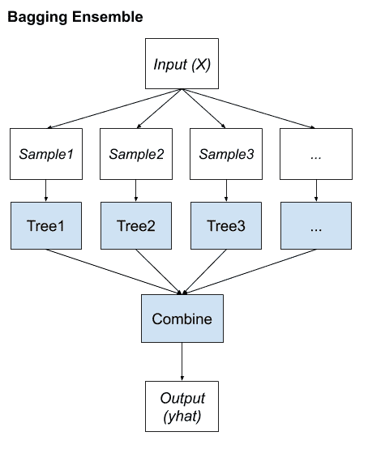
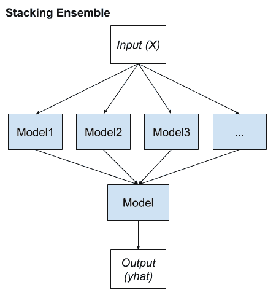
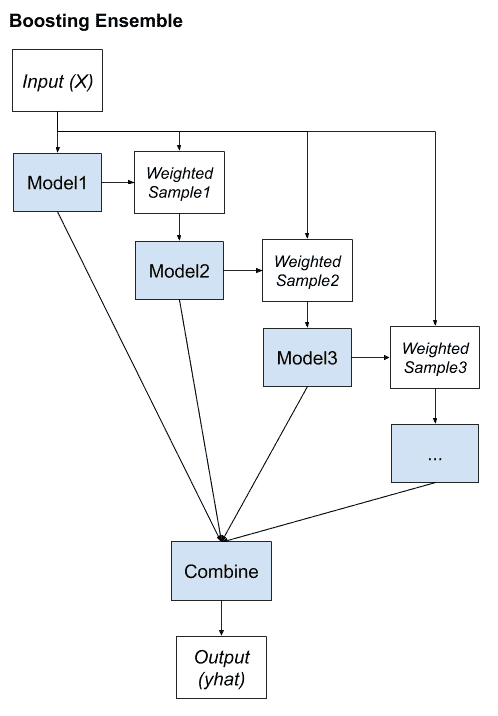

# 集成学习算法的温和介绍

> 原文：<https://machinelearningmastery.com/tour-of-ensemble-learning-algorithms/>

最后更新于 2021 年 4 月 27 日

**集成学习**是一种通用的机器学习元方法，通过组合来自多个模型的预测来寻求更好的预测表现。

尽管有看似无限多的集成可以为您的预测建模问题开发，但有三种方法主导着集成学习领域。如此之多，以至于除了算法本身，每一个都是一个研究领域，产生了许多更专业的方法。

集成学习方法的三个主要类别是**装袋**、**堆叠**和**提升**，对每种方法都有详细的了解并在您的预测建模项目中加以考虑是很重要的。

但是，在此之前，在对数学和代码进行分层之前，您需要对这些方法以及每种方法背后的关键思想进行温和的介绍。

在本教程中，您将发现机器学习的三种标准集成学习技术。

完成本教程后，您将知道:

*   装袋包括在同一数据集的不同样本上拟合许多决策树，并对预测进行平均。
*   堆叠包括在同一数据上拟合许多不同的模型类型，并使用另一个模型来学习如何最好地组合预测。
*   增强包括按顺序添加集成成员，这些成员修正由先前模型做出的预测，并输出预测的加权平均值。

**用我的新书[Python 集成学习算法](https://machinelearningmastery.com/ensemble-learning-algorithms-with-python/)启动你的项目**，包括*分步教程*和所有示例的 *Python 源代码*文件。

我们开始吧。

集成学习算法的温和介绍[拉吉夫·布坦](https://www.flickr.com/photos/134758269@N08/23516255140/)摄，版权所有。

## 教程概述

本教程分为四个部分；它们是:

1.  标准集成学习策略
2.  装袋集成学习
3.  堆叠集成学习
4.  促进集成学习

## 标准集成学习策略

集成学习是指将两个或多个模型的预测结合起来的算法。

尽管实现这一点的方法几乎是无限的，但在实践中最常讨论和使用的集成学习技术可能有三类。它们之所以受欢迎，很大程度上是因为它们易于实现，并且在广泛的预测建模问题上取得了成功。

> 在过去的几年中，已经开发了大量基于集成的分类器。然而，这些算法中的许多都是一些精选的少数成熟算法的变体，这些算法的能力也得到了广泛的测试和广泛的报道。

—第 11 页，[集成机器学习](https://amzn.to/2C7syo5)，2012。

鉴于它们的广泛使用，我们可以将其称为“*标准*”集成学习策略；它们是:

1.  装袋。
2.  堆叠。
3.  提升。

有一种算法描述了每种方法，尽管更重要的是，每种方法的成功都催生了无数的扩展和相关技术。因此，将每一个都描述为集成学习的一类技术或标准方法更有用。

与其深入研究每种方法的细节，不如逐步了解、总结和对比每种方法。同样重要的是要记住，尽管这些方法的讨论和使用无处不在，但这三种方法本身并不能定义集成学习的范围。

接下来，让我们仔细看看装袋。

## 装袋集成学习

[Bootstrap 聚合](https://machinelearningmastery.com/bagging-ensemble-with-python/)，简称 bagging，是一种通过改变训练数据来寻找一组不同的集成成员的集成学习方法。

> Bagging 这个名字来自 Bootstrap AGGregatING 的缩写。顾名思义，装袋的两个关键要素是引导和聚合。

—第 48 页，[集合方法](https://amzn.to/2XZzrjG)，2012。

这通常涉及使用单一的机器学习算法，几乎总是一个未运行的决策树，并在同一训练数据集的不同样本上训练每个模型。然后使用简单的统计数据，如投票或平均，将全体成员做出的预测结合起来。

> 通过在其上训练每个分类器的自举副本内的变化，以及通过使用相对较弱的分类器来确保集合中的多样性，所述相对较弱的分类器的决策边界相对于训练数据中相对较小的扰动而可测量地变化。

—第 11 页，[集成机器学习](https://amzn.to/2C7syo5)，2012。

该方法的关键是数据集的每个样本准备训练集合成员的方式。每个模型都有自己独特的数据集样本。

示例(行)是从数据集中随机抽取的，尽管进行了替换。

> Bagging 采用 bootstrap 分布来生成不同的基础学习器。换句话说，它应用自举采样来获得用于训练基础学习器的数据子集。

—第 48 页，[集合方法](https://amzn.to/2XZzrjG)，2012。

替换意味着如果选择了一行，它将返回到训练数据集中，以便在同一训练数据集中进行可能的重新选择。这意味着对于给定的训练数据集，可以零次、一次或多次选择一行数据。

这被称为[引导样本](https://machinelearningmastery.com/a-gentle-introduction-to-the-bootstrap-method/)。这是一种常用于小数据集统计中的技术，用于估计数据样本的统计值。通过准备多个不同的自举样本并估计统计量和计算估计值的平均值，可以实现比直接从数据集简单估计更好的期望量的总体估计。

以同样的方式，可以准备多个不同的训练数据集，用于估计预测模型，并进行预测。对模型间的预测进行平均通常比直接在训练数据集上拟合单个模型得到更好的预测。

我们可以将装袋的关键要素总结如下:

*   训练数据集的引导样本。
*   未标记的决策树适合每个样本。
*   简单的投票或平均预测。

总的来说，bagging 的贡献在于用于拟合每个集成成员的训练数据的变化，这反过来导致了熟练但不同的模型。

装袋集成

这是一种通用方法，易于扩展。例如，可以引入对训练数据集的更多改变，可以替换适合训练数据的算法，并且可以修改用于组合预测的机制。

许多流行的集成算法都基于这种方法，包括:

*   袋装决策树(标准袋装)
*   随机森林
*   额外树

接下来，让我们仔细看看堆叠。

## 堆叠集成学习

[堆叠泛化](https://machinelearningmastery.com/stacking-ensemble-machine-learning-with-python/)，简称堆叠，是一种集成方法，通过改变适合训练数据的模型类型并使用模型组合预测来寻找不同的成员组。

> 堆叠是一个通用的过程，在这个过程中，一个学习器被训练来组合各个学习器。这里，个体学习器被称为第一级学习器，而组合者被称为第二级学习器或元学习器。

—第 83 页，[集合方法](https://amzn.to/2XZzrjG)，2012。

叠加有自己的术语，其中集合成员被称为 0 级模型，用于组合预测的模型被称为 1 级模型。

模型的两级层次结构是最常见的方法，尽管可以使用更多层的模型。例如，我们可能有 3 个或 5 个一级模型和一个二级模型来组合一级模型的预测，以进行预测，而不是一个一级模型。

> 堆叠可能是最流行的元学习技术。通过使用元学习器，该方法试图归纳哪些分类器是可靠的，哪些是不可靠的。

—第 82 页，[使用集成方法的模式分类](https://amzn.to/2zxc0F7)，2010。

任何机器学习模型都可以用于聚合预测，尽管通常使用线性模型，例如用于回归的线性回归和用于二分类的逻辑回归。这促使模型的复杂性停留在较低层次的集合成员模型和简单模型上，以学习如何利用各种各样的预测。

> 使用可训练的组合器，可以确定哪些分类器可能在特征空间的哪个部分成功，并相应地组合它们。

—第 15 页，[集成机器学习](https://amzn.to/2C7syo5)，2012。

我们可以将堆叠的关键要素总结如下:

*   未更改的训练数据集。
*   每个集成成员有不同的机器学习算法。
*   机器学习模型学习如何最好地组合预测。

多样性来自用作集成成员的不同机器学习模型。

因此，希望使用一套以非常不同的方式学习或构建的模型，确保它们做出不同的假设，进而具有较少的相关预测误差。

叠加集成

许多流行的集成算法都基于这种方法，包括:

*   堆叠模型(规范堆叠)
*   混合
*   太棒了

接下来，让我们仔细看看 boosting。

## 促进集成学习

[Boosting](https://machinelearningmastery.com/gradient-boosting-machine-ensemble-in-python/) 是一种集成方法，旨在改变训练数据，将注意力集中在训练数据集上以前的拟合模型出错的例子上。

> 在增强过程中，[……]每个后续分类器的训练数据集越来越关注由先前生成的分类器错误分类的实例。

—第 13 页，[集成机器学习](https://amzn.to/2C7syo5)，2012。

提升集成的关键特性是校正预测误差的想法。模型被拟合并顺序地添加到集合中，使得第二模型试图校正第一模型的预测，第三模型校正第二模型，等等。

这通常包括使用非常简单的决策树，只做一个或几个决定，在 boosting 中称为弱学习器。弱学习器的预测通过简单的投票或平均进行组合，尽管贡献的权重与他们的表现或能力成正比。目标是从许多有目的的“T2”弱学习器中培养出一个所谓的“强学习器”

> …一种迭代方法，用于从一组弱分类器中生成一个强分类器，该方法能够实现任意低的训练误差，每个弱分类器几乎不能比随机猜测做得更好。

—第 13 页，[集成机器学习](https://amzn.to/2C7syo5)，2012。

通常，训练数据集保持不变，取而代之的是，学习算法被修改以基于特定示例(数据行)是否已经被先前添加的集成成员正确或不正确地预测来或多或少地关注它们。例如，可以对数据行进行加权，以指示学习算法在学习模型时必须给予的关注量。

我们可以将提升的关键要素总结如下:

*   将训练数据偏向那些难以预测的例子。
*   迭代地添加集合成员来修正先前模型的预测。
*   使用模型的加权平均值组合预测。

将许多弱学习器组合成强学习器的想法最早是从理论上提出的，许多算法都被提出，但收效甚微。直到[自适应 Boosting (AdaBoost)](https://machinelearningmastery.com/adaboost-ensemble-in-python/) 算法被开发出来，Boosting 才被证明是一种有效的集成方法。

> 术语增强指的是能够将弱学习器转化为强学习器的一系列算法。

—第 23 页，[集合方法](https://amzn.to/2XZzrjG)，2012。

自 AdaBoost 以来，已经开发了许多增强方法，其中一些，如随机梯度提升，可能是表格(结构化)数据分类和回归的最有效技术之一。

提升集成

总而言之，许多流行的集成算法都基于这种方法，包括:

*   标准升压
*   梯度增压机
*   随机梯度提升(XGBoost 和类似)

这就完成了我们的标准集成学习技巧之旅。

## 进一步阅读

如果您想更深入地了解这个主题，本节将提供更多资源。

### 书

*   [使用集成方法的模式分类](https://amzn.to/2zxc0F7)，2010。
*   [集成方法](https://amzn.to/2XZzrjG)，2012。
*   [集成机器学习](https://amzn.to/2C7syo5)，2012。
*   [数据挖掘中的集成方法](https://amzn.to/3frGM1A)，2010。

### 文章

*   一起学习，维基百科。
*   [引导聚合，维基百科](https://en.wikipedia.org/wiki/Bootstrap_aggregating)。
*   [Boosting(机器学习)，维基百科](https://en.wikipedia.org/wiki/Boosting_(machine_learning))。

## 摘要

在本教程中，您发现了机器学习的三种标准集成学习技术。

具体来说，您了解到:

*   装袋包括在同一数据集的不同样本上拟合许多决策树，并对预测进行平均。
*   堆叠包括在同一数据上拟合许多不同的模型类型，并使用另一个模型来学习如何最好地组合预测。
*   增强包括按顺序添加集成成员，这些成员校正由先前模型做出的预测，并输出预测的加权平均值。

**你有什么问题吗？**
在下面的评论中提问，我会尽力回答。