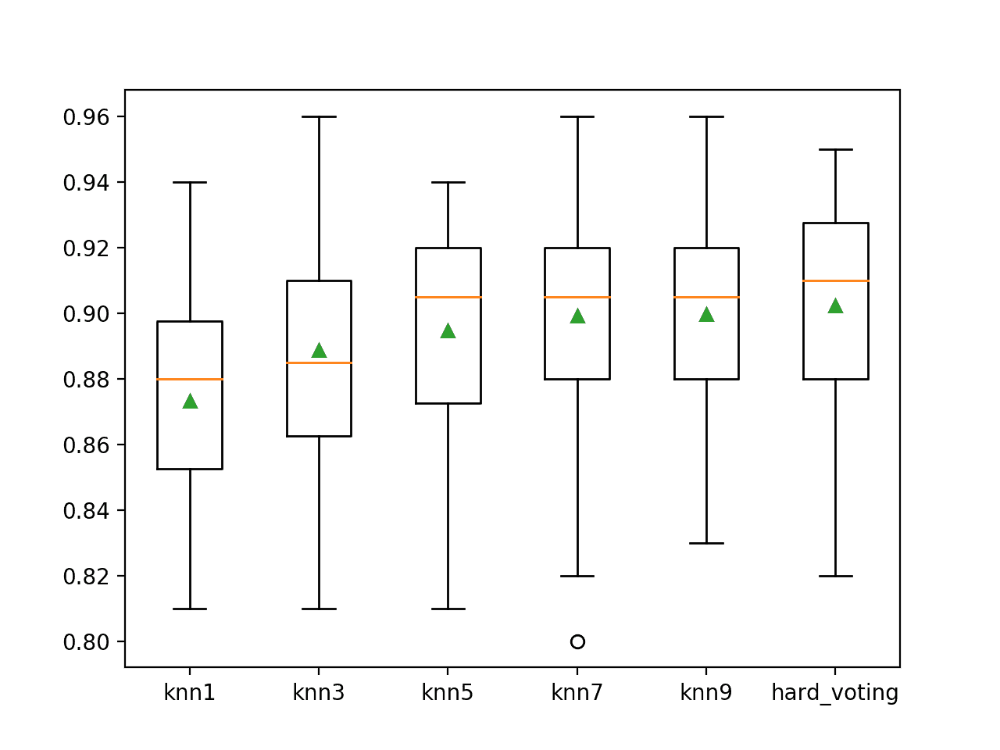
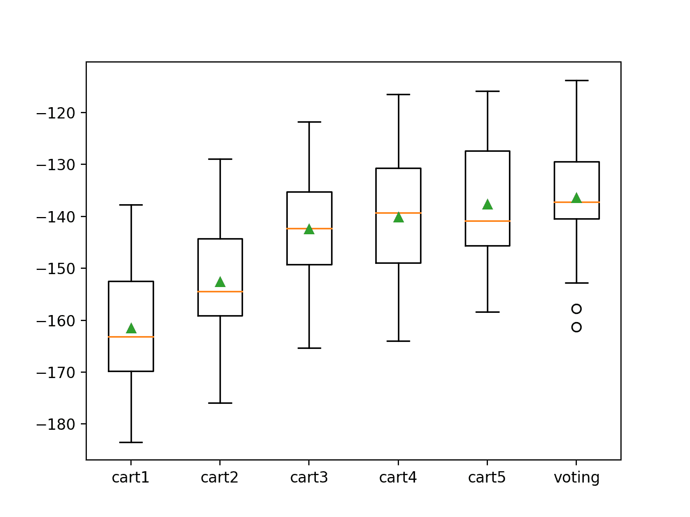

# 如何用 Python 开发投票集成

> 原文：<https://machinelearningmastery.com/voting-ensembles-with-python/>

最后更新于 2021 年 4 月 27 日

投票是一种集成机器学习算法。

对于回归，投票集合包括做出预测，该预测是多个其他回归模型的平均值。

在分类中，**硬投票**集合包括对来自其他模型的清晰类标签的投票进行求和，并预测投票最多的类。一个**软投票**集成包括对类别标签的预测概率求和，并预测具有最大和概率的类别标签。

在本教程中，您将发现如何在 Python 中为机器学习算法创建投票集成。

完成本教程后，您将知道:

*   投票集合包括对分类模型做出的预测进行求和，或者对回归模型做出的预测进行平均。
*   投票组合是如何工作的，何时使用投票组合，以及该方法的局限性。
*   如何实现用于分类预测建模的硬投票集成和软投票集成？

**用我的新书[Python 集成学习算法](https://machinelearningmastery.com/ensemble-learning-algorithms-with-python/)启动你的项目**，包括*分步教程*和所有示例的 *Python 源代码*文件。

我们开始吧。


如何用 Python 开发投票集成
图片由[土地管理局](https://flickr.com/photos/mypubliclands/19863061002/)提供，保留部分权利。

## 教程概述

本教程分为四个部分；它们是:

1.  投票团
2.  投票集成 Scikit-学习应用编程接口
3.  分类投票集成
    1.  用于分类的硬投票集成
    2.  用于分类的软投票集成
4.  回归投票集成

## 投票团

投票集成(或“*多数投票集成*”)是一种集成机器学习模型，它结合了来自多个其他模型的预测。

这是一种可以用来提高模型表现的技术，理想情况下比集成中使用的任何单个模型都获得更好的表现。

投票集合通过组合来自多个模型的预测来工作。它可以用于分类或回归。在回归的情况下，这包括计算模型预测的平均值。在分类的情况下，对每个标签的预测进行求和，并预测具有多数票的标签。

*   **回归投票集成**:预测是贡献模型的平均值。
*   **分类投票集成**:预测是投稿模型的多数票。

分类的多数票预测有两种方法；他们是硬投票和软投票。

硬投票包括对每个类别标签的预测进行求和，并预测投票最多的类别标签。软投票包括对每个类别标签的预测概率(或类似概率的分数)求和，并预测具有最大概率的类别标签。

*   **硬投票**。从模型中预测得票最多的班级
*   **软投票**。从模型中预测概率总和最大的类。

投票集合可以被认为是元模型，模型的模型。

作为一个元模型，它可以用于任何现有的训练机器学习模型的集合，并且现有的模型不需要知道它们正在集成中使用。这意味着您可以探索在任何拟合模型集或子集上使用投票集成来完成预测建模任务。

当您有两个或更多在预测建模任务中表现良好的模型时，投票集合是合适的。集成中使用的模型必须与他们的预测基本一致。

> 组合输出的一种方法是投票——与装袋中使用的机制相同。然而，(未加权)投票只有在学习方案表现相当好的情况下才有意义。如果三个分类器中有两个做出了非常不正确的预测，我们就有麻烦了！

—第 497 页，[数据挖掘:实用机器学习工具与技术](https://amzn.to/2NJT1L8)，2016。

在以下情况下使用投票集成:

*   集成中的所有模特一般都有同样好的表现。
*   全体模特大多已经同意了。

当投票集合中使用的模型预测清晰的类别标签时，硬投票是合适的。当投票集成中使用的模型预测类成员的概率时，软投票是合适的。软投票可用于不能自然预测类别成员概率的模型，尽管在用于集成(例如支持向量机、k 近邻和决策树)之前可能需要[校准它们的类概率分数](https://machinelearningmastery.com/calibrated-classification-model-in-Sklearn/)。

*   硬投票是针对预测类标签的模型。
*   软投票适用于预测类成员概率的模型。

投票集合不能保证比集合中使用的任何单一模型提供更好的表现。如果集合中使用的任何给定模型比投票集合表现得更好，则可能应该使用该模型来代替投票集合。

情况并非总是如此。投票集合可以降低单个模型预测的差异。这可以从回归任务的预测误差的较低方差中看出。这也可以从分类任务准确性的较低差异中看出。这种较低的方差可能导致总体的较低的平均表现，考虑到模型的较高稳定性或置信度，这可能是所希望的。

如果出现以下情况，请使用投票组合:

*   它比集成中使用的任何模型都有更好的表现。
*   它导致比集合中使用的任何模型更低的方差。

投票集成对于使用随机学习算法的机器学习模型特别有用，并且每次在相同的数据集上训练时都会产生不同的最终模型。一个例子是使用随机梯度下降拟合的神经网络。

有关此主题的更多信息，请参见教程:

*   [如何为深度学习神经网络开发加权平均集成](https://machinelearningmastery.com/weighted-average-ensemble-for-deep-learning-neural-networks/)

投票集成的另一个特别有用的情况是，将同一机器学习算法的多次拟合与稍微不同的超参数相结合。

投票组合在以下情况下最有效:

*   组合使用随机学习算法训练的模型的多次拟合。
*   用不同的超参数组合模型的多次拟合。

投票集合的一个限制是，它对所有模型都一视同仁，这意味着所有模型对预测的贡献都是一样的。如果有些模型在某些情况下很好，而在其他情况下很差，这就是一个问题。

解决这个问题的投票集合的扩展是使用贡献模型的加权平均或加权投票。这有时被称为混合。进一步的扩展是使用机器学习模型来学习在进行预测时何时以及信任每个模型的程度。这被称为堆叠概括，简称堆叠。

投票集合的扩展:

*   加权平均集成(混合)。
*   堆叠泛化(堆叠)。

现在我们已经熟悉了投票集成，让我们来仔细看看如何创建投票集成模型。

## 投票集成 Scikit-学习应用编程接口

投票集成可以从零开始实现，尽管对初学者来说可能很有挑战性。

Sklearn Python 机器学习库为机器学习提供了投票的实现。

它在 0.22 版及更高版本的库中可用。

首先，通过运行以下脚本来确认您使用的是现代版本的库:

```py
# check Sklearn version
import sklearn
print(sklearn.__version__)
```

运行脚本将打印您的 Sklearn 版本。

您的版本应该相同或更高。如果没有，您必须升级 Sklearn 库的版本。

```py
0.22.1
```

投票通过[语音回归器](https://Sklearn.org/stable/modules/generated/sklearn.ensemble.VotingRegressor.html)和[语音分类器](https://Sklearn.org/stable/modules/generated/sklearn.ensemble.VotingClassifier.html)类提供。

两个模型的操作方式相同，采用的参数也相同。使用该模型要求您指定一个做出预测并在投票集合中组合的估计器列表。

基本模型列表通过“*估计值*参数提供。这是一个 Python 列表，其中列表中的每个元素都是一个元组，具有模型的名称和配置的模型实例。列表中的每个模型必须有唯一的名称。

例如，下面定义了两个基本模型:

```py
...
models = [('lr',LogisticRegression()),('svm',SVC())]
ensemble = VotingClassifier(estimators=models)
```

列表中的每个模型也可以是[管道](https://Sklearn.org/stable/modules/generated/sklearn.pipeline.Pipeline.html)，包括模型在训练数据集上拟合模型之前所需的任何数据准备。

例如:

```py
...
models = [('lr',LogisticRegression()),('svm',make_pipeline(StandardScaler(),SVC()))]
ensemble = VotingClassifier(estimators=models)
```

使用投票集合进行分类时，可以通过“*投票*”参数指定投票类型，如硬投票或软投票，并将其设置为字符串“*硬*”(默认)或“*软*”。

例如:

```py
...
models = [('lr',LogisticRegression()),('svm',SVC())]
ensemble = VotingClassifier(estimators=models, voting='soft')
```

现在我们已经熟悉了 Sklearn 中的投票集成 API，让我们来看看一些工作示例。

## 分类投票集成

在这一节中，我们将研究使用堆叠来解决分类问题。

首先，我们可以使用 [make_classification()函数](https://Sklearn.org/stable/modules/generated/sklearn.datasets.make_classification.html)创建一个包含 1000 个示例和 20 个输入特征的合成二进制分类问题。

下面列出了完整的示例。

```py
# test classification dataset
from sklearn.datasets import make_classification
# define dataset
X, y = make_classification(n_samples=1000, n_features=20, n_informative=15, n_redundant=5, random_state=2)
# summarize the dataset
print(X.shape, y.shape)
```

运行该示例将创建数据集并总结输入和输出组件的形状。

```py
(1000, 20) (1000,)
```

接下来，我们将演示这个数据集的硬投票和软投票。

### 用于分类的硬投票集成

我们可以用 [k 最近邻算法](https://machinelearningmastery.com/tutorial-to-implement-k-nearest-neighbors-in-python-from-scratch/)来演示硬投票。

我们可以拟合五个不同版本的 KNN 算法，每个版本在进行预测时使用不同数量的邻居。我们将使用 1、3、5、7 和 9 个邻居(奇数以避免平局)。

我们的期望是，通过组合由每个不同的 KNN 模型预测的预测类别标签，平均而言，硬投票集成将获得比集成中使用的任何独立模型更好的预测表现。

首先，我们可以创建一个名为 *get_voting()* 的函数，该函数创建每个 KNN 模型，并将这些模型组合成一个硬投票集合。

```py
# get a voting ensemble of models
def get_voting():
	# define the base models
	models = list()
	models.append(('knn1', KNeighborsClassifier(n_neighbors=1)))
	models.append(('knn3', KNeighborsClassifier(n_neighbors=3)))
	models.append(('knn5', KNeighborsClassifier(n_neighbors=5)))
	models.append(('knn7', KNeighborsClassifier(n_neighbors=7)))
	models.append(('knn9', KNeighborsClassifier(n_neighbors=9)))
	# define the voting ensemble
	ensemble = VotingClassifier(estimators=models, voting='hard')
	return ensemble
```

然后，我们可以创建一个要评估的模型列表，包括每个独立版本的 KNN 模型配置和硬投票集合。

这将有助于我们在分类准确率分数的分布方面直接比较 KNN 模型和集合的每个独立配置。下面的 *get_models()* 函数创建模型列表供我们评估。

```py
# get a list of models to evaluate
def get_models():
	models = dict()
	models['knn1'] = KNeighborsClassifier(n_neighbors=1)
	models['knn3'] = KNeighborsClassifier(n_neighbors=3)
	models['knn5'] = KNeighborsClassifier(n_neighbors=5)
	models['knn7'] = KNeighborsClassifier(n_neighbors=7)
	models['knn9'] = KNeighborsClassifier(n_neighbors=9)
	models['hard_voting'] = get_voting()
	return models
```

每个模型将使用重复的 [k 倍交叉验证](https://machinelearningmastery.com/k-fold-cross-validation/)进行评估。

下面的 *evaluate_model()* 函数获取一个模型实例，并返回分层 10 倍交叉验证的三次重复的分数列表。

```py
# evaluate a give model using cross-validation
def evaluate_model(model, X, y):
	cv = RepeatedStratifiedKFold(n_splits=10, n_repeats=3, random_state=1)
	scores = cross_val_score(model, X, y, scoring='accuracy', cv=cv, n_jobs=-1, error_score='raise')
	return scores
```

然后，我们可以报告每个算法的平均表现，还可以创建一个方框图和触须图来比较每个算法的准确性分数分布。

将这些联系在一起，完整的示例如下所示。

```py
# compare hard voting to standalone classifiers
from numpy import mean
from numpy import std
from sklearn.datasets import make_classification
from sklearn.model_selection import cross_val_score
from sklearn.model_selection import RepeatedStratifiedKFold
from sklearn.neighbors import KNeighborsClassifier
from sklearn.ensemble import VotingClassifier
from matplotlib import pyplot

# get the dataset
def get_dataset():
	X, y = make_classification(n_samples=1000, n_features=20, n_informative=15, n_redundant=5, random_state=2)
	return X, y

# get a voting ensemble of models
def get_voting():
	# define the base models
	models = list()
	models.append(('knn1', KNeighborsClassifier(n_neighbors=1)))
	models.append(('knn3', KNeighborsClassifier(n_neighbors=3)))
	models.append(('knn5', KNeighborsClassifier(n_neighbors=5)))
	models.append(('knn7', KNeighborsClassifier(n_neighbors=7)))
	models.append(('knn9', KNeighborsClassifier(n_neighbors=9)))
	# define the voting ensemble
	ensemble = VotingClassifier(estimators=models, voting='hard')
	return ensemble

# get a list of models to evaluate
def get_models():
	models = dict()
	models['knn1'] = KNeighborsClassifier(n_neighbors=1)
	models['knn3'] = KNeighborsClassifier(n_neighbors=3)
	models['knn5'] = KNeighborsClassifier(n_neighbors=5)
	models['knn7'] = KNeighborsClassifier(n_neighbors=7)
	models['knn9'] = KNeighborsClassifier(n_neighbors=9)
	models['hard_voting'] = get_voting()
	return models

# evaluate a give model using cross-validation
def evaluate_model(model, X, y):
	cv = RepeatedStratifiedKFold(n_splits=10, n_repeats=3, random_state=1)
	scores = cross_val_score(model, X, y, scoring='accuracy', cv=cv, n_jobs=-1, error_score='raise')
	return scores

# define dataset
X, y = get_dataset()
# get the models to evaluate
models = get_models()
# evaluate the models and store results
results, names = list(), list()
for name, model in models.items():
	scores = evaluate_model(model, X, y)
	results.append(scores)
	names.append(name)
	print('>%s %.3f (%.3f)' % (name, mean(scores), std(scores)))
# plot model performance for comparison
pyplot.boxplot(results, labels=names, showmeans=True)
pyplot.show()
```

运行该示例首先报告每个模型的平均值和标准偏差准确率。

**注**:考虑到算法或评估程序的随机性，或数值准确率的差异，您的[结果可能会有所不同](https://machinelearningmastery.com/different-results-each-time-in-machine-learning/)。考虑运行该示例几次，并比较平均结果。

我们可以看到，与模型的所有独立版本相比，硬投票集成实现了约 90.2%的更好的分类准确率。

```py
>knn1 0.873 (0.030)
>knn3 0.889 (0.038)
>knn5 0.895 (0.031)
>knn7 0.899 (0.035)
>knn9 0.900 (0.033)
>hard_voting 0.902 (0.034)
```

然后创建一个方块-触须图，比较每个模型的分布准确率分数，让我们清楚地看到，平均而言，硬投票集合比所有独立模型表现更好。



二进制分类中硬投票集成与独立模型的箱图比较

如果我们选择一个硬投票集合作为我们的最终模型，我们可以像任何其他模型一样，拟合并使用它来对新数据进行预测。

首先，硬投票集合适合所有可用数据，然后可以调用 *predict()* 函数对新数据进行预测。

下面的示例在我们的二进制类别数据集上演示了这一点。

```py
# make a prediction with a hard voting ensemble
from sklearn.datasets import make_classification
from sklearn.ensemble import VotingClassifier
from sklearn.neighbors import KNeighborsClassifier
# define dataset
X, y = make_classification(n_samples=1000, n_features=20, n_informative=15, n_redundant=5, random_state=2)
# define the base models
models = list()
models.append(('knn1', KNeighborsClassifier(n_neighbors=1)))
models.append(('knn3', KNeighborsClassifier(n_neighbors=3)))
models.append(('knn5', KNeighborsClassifier(n_neighbors=5)))
models.append(('knn7', KNeighborsClassifier(n_neighbors=7)))
models.append(('knn9', KNeighborsClassifier(n_neighbors=9)))
# define the hard voting ensemble
ensemble = VotingClassifier(estimators=models, voting='hard')
# fit the model on all available data
ensemble.fit(X, y)
# make a prediction for one example
data = [[5.88891819,2.64867662,-0.42728226,-1.24988856,-0.00822,-3.57895574,2.87938412,-1.55614691,-0.38168784,7.50285659,-1.16710354,-5.02492712,-0.46196105,-0.64539455,-1.71297469,0.25987852,-0.193401,-5.52022952,0.0364453,-1.960039]]
yhat = ensemble.predict(data)
print('Predicted Class: %d' % (yhat))
```

运行该示例使硬投票集成模型适合整个数据集，然后用于对新的数据行进行预测，就像我们在应用程序中使用该模型时可能做的那样。

```py
Predicted Class: 1
```

### 用于分类的软投票集成

我们可以用[支持向量机](https://machinelearningmastery.com/support-vector-machines-for-machine-learning/) (SVM)算法来演示软投票。

SVM 算法本身并不预测概率，尽管它可以被配置为通过在 [SVC 类](https://Sklearn.org/stable/modules/generated/sklearn.svm.SVC.html)中将“*概率*”参数设置为“*真*”来预测类似概率的分数。

我们可以用一个多项式核来拟合五个不同版本的 SVM 算法，每个核具有不同的多项式次数，通过“*度*参数来设置。我们将使用 1-5 度。

我们的期望是，通过组合由每个不同的 SVM 模型预测的预测类别成员概率分数，平均而言，软投票集成将获得比集成中使用的任何独立模型更好的预测表现。

首先，我们可以创建一个名为 *get_voting()* 的函数来创建 SVM 模型，并将它们组合成一个软投票集合。

```py
# get a voting ensemble of models
def get_voting():
	# define the base models
	models = list()
	models.append(('svm1', SVC(probability=True, kernel='poly', degree=1)))
	models.append(('svm2', SVC(probability=True, kernel='poly', degree=2)))
	models.append(('svm3', SVC(probability=True, kernel='poly', degree=3)))
	models.append(('svm4', SVC(probability=True, kernel='poly', degree=4)))
	models.append(('svm5', SVC(probability=True, kernel='poly', degree=5)))
	# define the voting ensemble
	ensemble = VotingClassifier(estimators=models, voting='soft')
	return ensemble
```

然后，我们可以创建一个要评估的模型列表，包括每个独立版本的 SVM 模型配置和软投票集合。

这将有助于我们在分类准确率分数的分布方面直接比较 SVM 模型和集合的每个独立配置。下面的 *get_models()* 函数创建模型列表供我们评估。

```py
# get a list of models to evaluate
def get_models():
	models = dict()
	models['svm1'] = SVC(probability=True, kernel='poly', degree=1)
	models['svm2'] = SVC(probability=True, kernel='poly', degree=2)
	models['svm3'] = SVC(probability=True, kernel='poly', degree=3)
	models['svm4'] = SVC(probability=True, kernel='poly', degree=4)
	models['svm5'] = SVC(probability=True, kernel='poly', degree=5)
	models['soft_voting'] = get_voting()
	return models
```

我们可以使用重复的 k-fold 交叉验证来评估和报告模型表现，就像我们在上一节中所做的那样。

将这些联系在一起，完整的示例如下所示。

```py
# compare soft voting ensemble to standalone classifiers
from numpy import mean
from numpy import std
from sklearn.datasets import make_classification
from sklearn.model_selection import cross_val_score
from sklearn.model_selection import RepeatedStratifiedKFold
from sklearn.svm import SVC
from sklearn.ensemble import VotingClassifier
from matplotlib import pyplot

# get the dataset
def get_dataset():
	X, y = make_classification(n_samples=1000, n_features=20, n_informative=15, n_redundant=5, random_state=2)
	return X, y

# get a voting ensemble of models
def get_voting():
	# define the base models
	models = list()
	models.append(('svm1', SVC(probability=True, kernel='poly', degree=1)))
	models.append(('svm2', SVC(probability=True, kernel='poly', degree=2)))
	models.append(('svm3', SVC(probability=True, kernel='poly', degree=3)))
	models.append(('svm4', SVC(probability=True, kernel='poly', degree=4)))
	models.append(('svm5', SVC(probability=True, kernel='poly', degree=5)))
	# define the voting ensemble
	ensemble = VotingClassifier(estimators=models, voting='soft')
	return ensemble

# get a list of models to evaluate
def get_models():
	models = dict()
	models['svm1'] = SVC(probability=True, kernel='poly', degree=1)
	models['svm2'] = SVC(probability=True, kernel='poly', degree=2)
	models['svm3'] = SVC(probability=True, kernel='poly', degree=3)
	models['svm4'] = SVC(probability=True, kernel='poly', degree=4)
	models['svm5'] = SVC(probability=True, kernel='poly', degree=5)
	models['soft_voting'] = get_voting()
	return models

# evaluate a give model using cross-validation
def evaluate_model(model, X, y):
	cv = RepeatedStratifiedKFold(n_splits=10, n_repeats=3, random_state=1)
	scores = cross_val_score(model, X, y, scoring='accuracy', cv=cv, n_jobs=-1, error_score='raise')
	return scores

# define dataset
X, y = get_dataset()
# get the models to evaluate
models = get_models()
# evaluate the models and store results
results, names = list(), list()
for name, model in models.items():
	scores = evaluate_model(model, X, y)
	results.append(scores)
	names.append(name)
	print('>%s %.3f (%.3f)' % (name, mean(scores), std(scores)))
# plot model performance for comparison
pyplot.boxplot(results, labels=names, showmeans=True)
pyplot.show()
```

运行该示例首先报告每个模型的平均值和标准偏差准确率。

**注**:考虑到算法或评估程序的随机性，或数值准确率的差异，您的[结果可能会有所不同](https://machinelearningmastery.com/different-results-each-time-in-machine-learning/)。考虑运行该示例几次，并比较平均结果。

我们可以看到，与模型的所有独立版本相比，软投票集成实现了约 92.4%的更好的分类准确率。

```py
>svm1 0.855 (0.035)
>svm2 0.859 (0.034)
>svm3 0.890 (0.035)
>svm4 0.808 (0.037)
>svm5 0.850 (0.037)
>soft_voting 0.924 (0.028)
```

然后创建一个方块-触须图，比较每个模型的分布准确率分数，使我们能够清楚地看到软投票集合的平均表现优于所有独立模型。


二进制分类的软投票集成与独立模型的箱图比较

如果我们选择一个软投票集合作为我们的最终模型，我们可以像任何其他模型一样，拟合并使用它来对新数据进行预测。

首先，软投票集成适用于所有可用数据，然后可以调用 *predict()* 函数对新数据进行预测。

下面的示例在我们的二进制类别数据集上演示了这一点。

```py
# make a prediction with a soft voting ensemble
from sklearn.datasets import make_classification
from sklearn.ensemble import VotingClassifier
from sklearn.svm import SVC
# define dataset
X, y = make_classification(n_samples=1000, n_features=20, n_informative=15, n_redundant=5, random_state=2)
# define the base models
models = list()
models.append(('svm1', SVC(probability=True, kernel='poly', degree=1)))
models.append(('svm2', SVC(probability=True, kernel='poly', degree=2)))
models.append(('svm3', SVC(probability=True, kernel='poly', degree=3)))
models.append(('svm4', SVC(probability=True, kernel='poly', degree=4)))
models.append(('svm5', SVC(probability=True, kernel='poly', degree=5)))
# define the soft voting ensemble
ensemble = VotingClassifier(estimators=models, voting='soft')
# fit the model on all available data
ensemble.fit(X, y)
# make a prediction for one example
data = [[5.88891819,2.64867662,-0.42728226,-1.24988856,-0.00822,-3.57895574,2.87938412,-1.55614691,-0.38168784,7.50285659,-1.16710354,-5.02492712,-0.46196105,-0.64539455,-1.71297469,0.25987852,-0.193401,-5.52022952,0.0364453,-1.960039]]
yhat = ensemble.predict(data)
print('Predicted Class: %d' % (yhat))
```

运行该示例使软投票集成模型适合整个数据集，然后用于对新的数据行进行预测，就像我们在应用程序中使用该模型时可能做的那样。

```py
Predicted Class: 1
```

## 回归投票集成

在这一节中，我们将研究使用投票来解决回归问题。

首先，我们可以使用[make _ revolution()函数](https://Sklearn.org/stable/modules/generated/sklearn.datasets.make_regression.html)创建一个包含 1000 个示例和 20 个输入特征的合成回归问题。

下面列出了完整的示例。

```py
# test regression dataset
from sklearn.datasets import make_regression
# define dataset
X, y = make_regression(n_samples=1000, n_features=20, n_informative=15, noise=0.1, random_state=1)
# summarize the dataset
print(X.shape, y.shape)
```

运行该示例将创建数据集并总结输入和输出组件的形状。

```py
(1000, 20) (1000,)
```

我们可以用决策树算法演示回归的集成投票，有时称为[分类和回归树](https://machinelearningmastery.com/classification-and-regression-trees-for-machine-learning/) (CART)算法。

我们可以拟合 CART 算法的五个不同版本，每个版本都有不同的决策树最大深度，通过“ *max_depth* ”参数设置。我们将使用 1-5 的深度。

我们的期望是，通过组合由每个不同的 CART 模型预测的值，平均而言，投票集成将获得比集成中使用的任何独立模型更好的预测表现。

首先，我们可以创建一个名为 *get_voting()* 的函数，该函数创建每个 CART 模型并将这些模型组合成一个投票集合。

```py
# get a voting ensemble of models
def get_voting():
	# define the base models
	models = list()
	models.append(('cart1', DecisionTreeRegressor(max_depth=1)))
	models.append(('cart2', DecisionTreeRegressor(max_depth=2)))
	models.append(('cart3', DecisionTreeRegressor(max_depth=3)))
	models.append(('cart4', DecisionTreeRegressor(max_depth=4)))
	models.append(('cart5', DecisionTreeRegressor(max_depth=5)))
	# define the voting ensemble
	ensemble = VotingRegressor(estimators=models)
	return ensemble
```

然后，我们可以创建一个要评估的模型列表，包括 CART 模型配置的每个独立版本和软投票集合。

这将有助于我们直接比较 CART 模型的每个独立配置和错误分数分布的集合。下面的 *get_models()* 函数创建模型列表供我们评估。

```py
# get a list of models to evaluate
def get_models():
	models = dict()
	models['cart1'] = DecisionTreeRegressor(max_depth=1)
	models['cart2'] = DecisionTreeRegressor(max_depth=2)
	models['cart3'] = DecisionTreeRegressor(max_depth=3)
	models['cart4'] = DecisionTreeRegressor(max_depth=4)
	models['cart5'] = DecisionTreeRegressor(max_depth=5)
	models['voting'] = get_voting()
	return models
```

我们可以使用重复的 [k 倍交叉验证](https://machinelearningmastery.com/k-fold-cross-validation/)来评估和报告模型表现，就像我们在上一节中所做的那样。

使用平均绝对误差(MAE)评估模型。Sklearn 将分数设为负值，这样可以最大化分数。这意味着报告的 MAE 分数为负，数值越大越好，0 表示没有误差。

将这些联系在一起，完整的示例如下所示。

```py
# compare voting ensemble to each standalone models for regression
from numpy import mean
from numpy import std
from sklearn.datasets import make_regression
from sklearn.model_selection import cross_val_score
from sklearn.model_selection import RepeatedKFold
from sklearn.tree import DecisionTreeRegressor
from sklearn.ensemble import VotingRegressor
from matplotlib import pyplot

# get the dataset
def get_dataset():
	X, y = make_regression(n_samples=1000, n_features=20, n_informative=15, noise=0.1, random_state=1)
	return X, y

# get a voting ensemble of models
def get_voting():
	# define the base models
	models = list()
	models.append(('cart1', DecisionTreeRegressor(max_depth=1)))
	models.append(('cart2', DecisionTreeRegressor(max_depth=2)))
	models.append(('cart3', DecisionTreeRegressor(max_depth=3)))
	models.append(('cart4', DecisionTreeRegressor(max_depth=4)))
	models.append(('cart5', DecisionTreeRegressor(max_depth=5)))
	# define the voting ensemble
	ensemble = VotingRegressor(estimators=models)
	return ensemble

# get a list of models to evaluate
def get_models():
	models = dict()
	models['cart1'] = DecisionTreeRegressor(max_depth=1)
	models['cart2'] = DecisionTreeRegressor(max_depth=2)
	models['cart3'] = DecisionTreeRegressor(max_depth=3)
	models['cart4'] = DecisionTreeRegressor(max_depth=4)
	models['cart5'] = DecisionTreeRegressor(max_depth=5)
	models['voting'] = get_voting()
	return models

# evaluate a give model using cross-validation
def evaluate_model(model, X, y):
	cv = RepeatedKFold(n_splits=10, n_repeats=3, random_state=1)
	scores = cross_val_score(model, X, y, scoring='neg_mean_absolute_error', cv=cv, n_jobs=-1, error_score='raise')
	return scores

# define dataset
X, y = get_dataset()
# get the models to evaluate
models = get_models()
# evaluate the models and store results
results, names = list(), list()
for name, model in models.items():
	scores = evaluate_model(model, X, y)
	results.append(scores)
	names.append(name)
	print('>%s %.3f (%.3f)' % (name, mean(scores), std(scores)))
# plot model performance for comparison
pyplot.boxplot(results, labels=names, showmeans=True)
pyplot.show()
```

运行该示例首先报告每个模型的平均值和标准偏差准确率。

**注**:考虑到算法或评估程序的随机性，或数值准确率的差异，您的[结果可能会有所不同](https://machinelearningmastery.com/different-results-each-time-in-machine-learning/)。考虑运行该示例几次，并比较平均结果。

我们可以看到，投票集成实现了更好的均方误差，约为-136.338，与模型的所有独立版本相比，这更大(更好)。

```py
>cart1 -161.519 (11.414)
>cart2 -152.596 (11.271)
>cart3 -142.378 (10.900)
>cart4 -140.086 (12.469)
>cart5 -137.641 (12.240)
>voting -136.338 (11.242)
```

然后创建一个方框图，比较每个模型的负 MAE 分数分布，让我们清楚地看到，平均而言，投票集合比所有独立模型表现更好。



投票集合与独立回归模型的箱线图比较

如果我们选择一个投票集合作为我们的最终模型，我们可以像任何其他模型一样，拟合并使用它来对新数据进行预测。

首先，投票集合适合所有可用数据，然后可以调用 *predict()* 函数对新数据进行预测。

下面的示例在我们的二进制类别数据集上演示了这一点。

```py
# make a prediction with a voting ensemble
from sklearn.datasets import make_regression
from sklearn.tree import DecisionTreeRegressor
from sklearn.ensemble import VotingRegressor
# define dataset
X, y = make_regression(n_samples=1000, n_features=20, n_informative=15, noise=0.1, random_state=1)
# define the base models
models = list()
models.append(('cart1', DecisionTreeRegressor(max_depth=1)))
models.append(('cart2', DecisionTreeRegressor(max_depth=2)))
models.append(('cart3', DecisionTreeRegressor(max_depth=3)))
models.append(('cart4', DecisionTreeRegressor(max_depth=4)))
models.append(('cart5', DecisionTreeRegressor(max_depth=5)))
# define the voting ensemble
ensemble = VotingRegressor(estimators=models)
# fit the model on all available data
ensemble.fit(X, y)
# make a prediction for one example
data = [[0.59332206,-0.56637507,1.34808718,-0.57054047,-0.72480487,1.05648449,0.77744852,0.07361796,0.88398267,2.02843157,1.01902732,0.11227799,0.94218853,0.26741783,0.91458143,-0.72759572,1.08842814,-0.61450942,-0.69387293,1.69169009]]
yhat = ensemble.predict(data)
print('Predicted Value: %.3f' % (yhat))
```

运行该示例使投票集成模型适合整个数据集，然后用于对新的数据行进行预测，就像我们在应用程序中使用该模型时可能做的那样。

```py
Predicted Value: 141.319
```

## 进一步阅读

如果您想更深入地了解这个主题，本节将提供更多资源。

### 教程

*   [如何为深度学习神经网络开发加权平均集成](https://machinelearningmastery.com/weighted-average-ensemble-for-deep-learning-neural-networks/)
*   [如何用 Keras 开发 Python 深度学习神经网络的堆叠集成](https://machinelearningmastery.com/stacking-ensemble-for-deep-learning-neural-networks/)

### 书

*   [数据挖掘:实用机器学习工具与技术](https://amzn.to/2NJT1L8)，2016。

### 蜜蜂

*   [集成方法 sci kit-学习 API](https://Sklearn.org/stable/modules/ensemble.html) 。
*   [硬化。一起。投票分类器 API](https://Sklearn.org/stable/modules/generated/sklearn.ensemble.VotingClassifier.html) 。
*   [硬化。一起。投票输入 API](https://Sklearn.org/stable/modules/generated/sklearn.ensemble.VotingRegressor.html) 。

## 摘要

在本教程中，您发现了如何在 Python 中为机器学习算法创建投票集成。

具体来说，您了解到:

*   投票集合包括对分类模型做出的预测进行求和，或者对回归模型做出的预测进行平均。
*   投票组合是如何工作的，何时使用投票组合，以及该方法的局限性。
*   如何实现用于分类预测建模的硬投票集成和软投票集成？

**你有什么问题吗？**
在下面的评论中提问，我会尽力回答。