# Pix2Pix 生成对抗网络的温和介绍

> 原文：<https://machinelearningmastery.com/a-gentle-introduction-to-pix2pix-generative-adversarial-network/>

最后更新于 2019 年 12 月 6 日

图像到图像的转换是给定源图像到目标图像的受控转换。

一个例子可能是黑白照片到彩色照片的转换。

图像到图像的翻译是一个具有挑战性的问题，对于给定的翻译任务或数据集，通常需要专门的模型和损失函数。

Pix2Pix GAN 是一种通用的图像到图像转换方法。它基于条件生成对抗网络，在该网络中，以给定的输入图像为条件生成目标图像。在这种情况下，Pix2Pix GAN 改变损失函数，使得生成的图像在目标域的内容中是可信的，并且是输入图像的可信翻译。

在这篇文章中，你将发现图像到图像转换的 Pix2Pix 条件生成对抗网络。

看完这篇文章，你会知道:

*   图像到图像的翻译通常需要专门的模型和手工制作的损失函数。
*   Pix2Pix GAN 为图像到图像的翻译提供了通用模型和损失函数。
*   Pix2Pix GAN 在各种各样的图像生成任务中进行了演示，包括将照片从白天翻译成黑夜，将产品草图翻译成照片。

**用我的新书[Python 生成对抗网络](https://machinelearningmastery.com/generative_adversarial_networks/)启动你的项目**，包括*分步教程*和所有示例的 *Python 源代码*文件。

我们开始吧。

## 概观

本教程分为五个部分；它们是:

1.  图像到图像的翻译问题
2.  用于图像到图像转换的 Pix2Pix GAN
3.  Pix2Pix 建筑细节
4.  Pix2Pix GAN 的应用
5.  对 Pix2Pix 架构选择的洞察

## 图像到图像的翻译问题

图像到图像的转换是以特定或受控的方式改变给定图像的问题。

例如，将风景照片从白天转换为黑夜，或将分割图像转换为照片。

> 与自动语言翻译类似，我们将自动图像到图像转换定义为在给定足够的训练数据的情况下，将场景的一种可能表示翻译成另一种表示的任务。

——[条件对抗网络下的图像到图像转换](https://arxiv.org/abs/1611.07004)，2016。

这是一个具有挑战性的问题，通常需要为所执行的翻译任务类型开发专门的模型和手工制作的损失函数。

经典的方法使用每像素分类或回归模型，其问题是每个预测的像素独立于它之前预测的像素，并且图像的更广泛的结构可能会丢失。

> 图像到图像的转换问题通常被表述为每像素分类或回归。这些公式将输出空间视为“非结构化的”，即每个输出像素都被视为有条件地独立于给定输入图像的所有其他像素。

——[条件对抗网络下的图像到图像转换](https://arxiv.org/abs/1611.07004)，2016。

理想情况下，需要一种通用的技术，这意味着相同的通用模型和损失函数可以用于多个不同的图像到图像转换任务。

## 用于图像到图像转换的 Pix2Pix GAN

Pix2Pix 是一个为通用图像到图像转换而设计的生成对抗网络模型。

该方法由菲利普·伊索拉(Phillip Isola)等人在 2016 年发表的论文《条件对抗网络下的 T2 图像到图像转换》(T3)中提出，并于 2017 年在 CVPR 的 T4 会议上提出。

GAN 架构是一种训练生成器模型的方法，通常用于生成图像。鉴别器模型被训练为将图像分类为真实的(来自数据集)或虚假的(生成的)，生成器被训练为欺骗鉴别器模型。

有条件的 GAN，或称 cGAN，是 GAN 体系结构的扩展，它提供了对生成的图像的控制，例如允许生成给定类的图像。Pix2Pix GAN 是 cGAN 的一种实现，其中图像的生成取决于给定的图像。

> 正如条件生成元学习数据的生成模型一样，条件生成元也学习条件生成模型。这使得 cGANs 适用于图像到图像的转换任务，在这种任务中，我们对输入图像进行调节并生成相应的输出图像。

——[条件对抗网络下的图像到图像转换](https://arxiv.org/abs/1611.07004)，2016。

生成器模型以给定的图像作为输入，并生成图像的翻译版本。鉴别器模型被给予一个输入图像和一个真实的或生成的配对图像，并且必须确定配对图像是真实的还是伪造的。最后，生成器模型被训练成既欺骗鉴别器模型又最小化生成图像和预期目标图像之间的损失。

因此，Pix2Pix GAN 必须在由输入图像(翻译前)和输出或目标图像(翻译后)组成的图像数据集上进行训练。

这种通用架构允许针对一系列图像到图像的转换任务来训练 Pix2Pix 模型。

## Pix2Pix 建筑细节

Pix2Pix GAN 架构涉及生成器模型、鉴别器模型和模型优化过程的仔细规范。

生成器和鉴别器模型都使用标准的卷积-BatchNormalization-ReLU 层块，这在深度卷积神经网络中很常见。论文附录中提供了具体的层配置。

> 生成器和鉴别器都使用卷积形式的模块。

——[条件对抗网络下的图像到图像转换](https://arxiv.org/abs/1611.07004)，2016。

让我们仔细看看这两种模型架构以及用于优化模型权重的损失函数。

### 网络生成器模型

生成器模型以图像作为输入，与传统的 GAN 模型不同，它不从潜在空间中取一点作为输入。

取而代之的是，随机性的来源来自于在训练期间和进行预测时使用的丢失层。

> 相反，对于我们的最终模型，我们只以下降的形式提供噪声，在训练和测试时应用于发电机的几个层。

——[条件对抗网络下的图像到图像转换](https://arxiv.org/abs/1611.07004)，2016。

*   **输入**:来自源域的图像
*   **输出**:目标域的图像

生成器使用了一个 U-Net 模型架构，而不是通用的编码器-解码器模型。

编码器-解码器生成器体系结构包括将图像作为输入，并在几个层上对其进行下采样，直到瓶颈层，然后在输出具有期望大小的最终图像之前，在几个层上再次对表示进行上采样。

U-Net 模型架构非常相似，它涉及到向下采样到瓶颈，然后再次向上采样到输出图像，但是在编码器和解码器中相同大小的层之间建立了链接或跳过连接，从而绕过了瓶颈。

> 对于许多图像转换问题，在输入和输出之间共享了大量的低级信息，并且希望将这些信息直接传送到网络上。[……]为了给生成器提供一种方法来绕过像这样的信息瓶颈，我们按照“U-Net”的一般形状添加了跳过连接。

——[条件对抗网络下的图像到图像转换](https://arxiv.org/abs/1611.07004)，2016。

例如，编码器的第一层具有与解码器的最后一层相同大小的特征映射，并与解码器合并。对编码器中的每一层和解码器的相应层重复这一过程，形成一个 U 形模型。

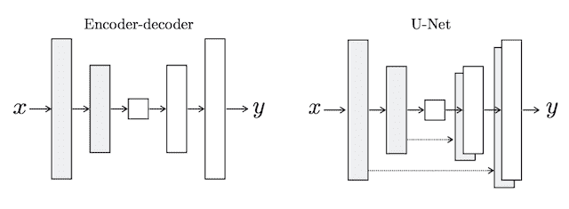

编码器-解码器生成器和 U 网生成器模型的描述。
摘自:条件对抗网络下的图像转图像转换。

### 帕奇根鉴别器模型

鉴别器模型获取来自源域的图像和来自目标域的图像，并预测来自目标域的图像是源图像的真实版本还是生成版本的可能性。

*   **输入**:源域的图像，目标域的图像。
*   **输出**:来自目标域的图像是源图像的真实翻译的概率。

鉴别器模型的输入强调了在训练模型时需要一个由成对的源图像和目标图像组成的图像数据集。

与使用深度卷积神经网络对图像进行分类的传统 GAN 模型不同，Pix2Pix 模型使用 PatchGAN。这是一个深度卷积神经网络，旨在将输入图像的斑块分类为真实或虚假，而不是整个图像。

> ……我们设计了一个鉴别器架构——我们称之为 PatchGAN——它只在补丁的规模上惩罚结构。这个鉴别器试图分类图像中的每个 NxN 补丁是真的还是假的。我们在图像上运行这个鉴别器卷积，平均所有响应，以提供 d 的最终输出。

——[条件对抗网络下的图像到图像转换](https://arxiv.org/abs/1611.07004)，2016。

PatchGAN 鉴别器模型被实现为深度卷积神经网络，但是层数被配置为使得网络的每个输出的有效感受野映射到输入图像中的特定大小。网络的输出是真实/虚假预测的单个特征图，可以对其进行平均以给出单个分数。

发现 70×70 的补丁大小在一系列图像到图像的翻译任务中是有效的。

### 复合对抗性损失和 L1 损失

鉴别器模型以独立的方式训练，与传统的 GAN 模型相同，最小化了识别真实和虚假图像的负对数可能性，尽管以源图像为条件。

与发生器相比，鉴别器的训练太快，因此鉴别器损耗减半，以便减慢训练过程。

*   鉴别器损耗= 0.5 *鉴别器损耗

使用鉴别器模型的对抗损失和源图像和预期目标图像的生成平移之间的 L1 或平均绝对像素差来训练生成器模型。

对抗性损失和 L1 损失合并成一个复合损失函数，用于更新发电机模型。L2 损失也进行了评估，发现导致图像模糊。

> 鉴别器的工作保持不变，但是生成器的任务不仅是愚弄鉴别器，而且是在 L2 意义上接近地面真实输出。我们也探索了这个选项，使用 L1 距离而不是 L2，因为 L1 鼓励减少模糊

——[条件对抗网络下的图像到图像转换](https://arxiv.org/abs/1611.07004)，2016。

对抗性损失影响发生器模型是否能够输出在目标域中似是而非的图像，而 L1 损失使发生器模型正则化以输出作为源图像的似是而非的翻译的图像。因此，L1 损失与对抗损失的组合由新的超参数λ控制，该超参数λ被设置为 10，例如在训练期间给予发生器的 L1 损失的重要性是对抗损失的 10 倍。

*   发电机损耗=对抗性损耗+λ* L1 损耗

## Pix2Pix GAN 的应用

Pix2Pix GAN 在一系列有趣的图像到图像转换任务中进行了演示。

例如，论文列出了 9 个应用；它们是:

*   语义标签照片，在 Cityscapes 数据集上训练。
*   建筑标签->照片，在立面上训练。
*   地图航拍照片，基于谷歌地图刮取的数据进行训练。
*   黑白->彩色照片。
*   边缘->照片。
*   素描->照片。
*   白天->晚上拍照。
*   热感->彩色照片。
*   缺少像素的照片->修复照片，在巴黎街景上训练。

在这一节中，我们将回顾一些论文中的例子。

### 照片的语义标签

下面的例子演示了语义标签图像到街景照片的转换。

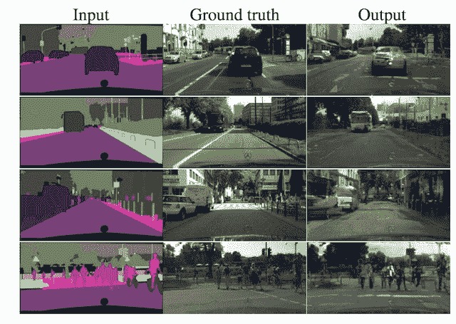

将语义图像转换成城市景观照片。
摘自:条件对抗网络下的图像转图像转换。

另一个例子是展示照片的建筑立面的语义标记图像。

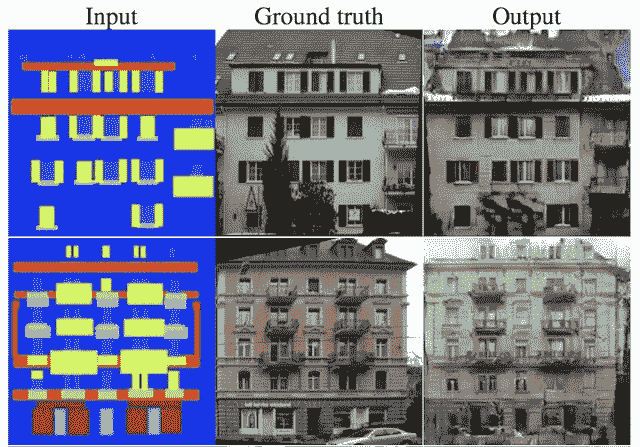

Pix2Pix GAN 将语义图像转换成建筑物正面的照片。
摘自:条件对抗网络下的图像转图像转换。

### 白天到晚上的照片

下面的例子演示了白天到夜间照片的转换。

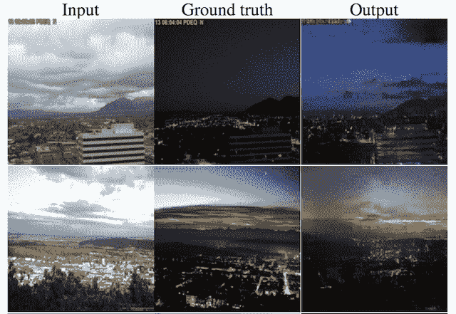

Pix2Pix GAN 白天照片到夜间的翻译。
摘自:条件对抗网络下的图像转图像转换。

### 要拍摄的产品草图

下面的例子演示了如何将包的产品草图翻译成照片。

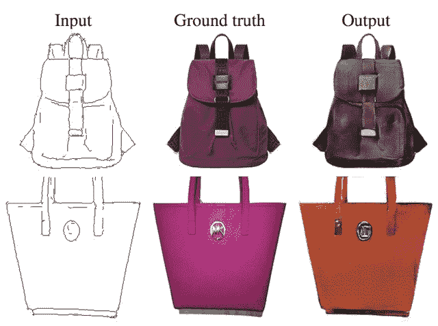

Pix2Pix GAN 将包的产品草图翻译成照片。
摘自:条件对抗网络下的图像转图像转换。

类似的例子也被用来把鞋的草图翻译成照片。

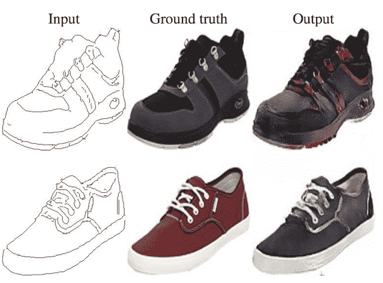

Pix2Pix GAN 将鞋子的产品草图翻译成照片。
摘自:条件对抗网络下的图像转图像转换。

### 照片修复

下面的例子展示了修复巴黎街景的照片。

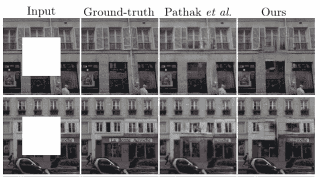

Pix2Pix GAN 修复巴黎照片。
摘自:条件对抗网络下的图像转图像转换。

### 热像仪到彩色照片

下面的例子演示了热图像到街景彩色照片的转换。

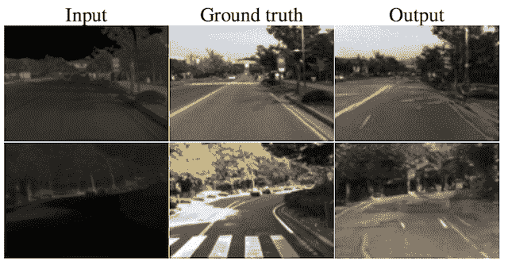

热图像到彩色照片的 Pix2Pix GAN 转换。
摘自:条件对抗网络下的图像转图像转换。

## 对 Pix2Pix 架构选择的洞察

作者探索和分析了不同模型配置和损失函数对图像质量的影响，支持架构选择。

这些实验的发现也许揭示了为什么 Pix2Pix 方法在广泛的图像转换任务中是有效的。

### 损失函数分析

进行实验以比较用于训练发电机模型的不同损失函数。

其中包括仅使用 L1 损失，仅使用有条件的对抗性损失，仅使用无条件的对抗性损失，以及 L1 与每一种对抗性损失的组合。

结果很有趣，显示了 L1 和条件性对抗损失可以单独产生合理的图像，尽管 L1 图像是模糊的，而 cGAN 图像引入了伪影。两者的结合给出了最清晰的结果。

> 只有 L1 导致合理但模糊的结果。仅 cGAN】就给出了更清晰的结果，但在某些应用程序中引入了视觉伪像。将这两个项相加(λ= 100)可以减少这些伪像。

——[条件对抗网络下的图像到图像转换](https://arxiv.org/abs/1611.07004)，2016。

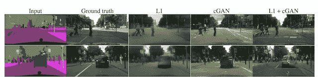

使用 L1、条件对抗和复合损失函数生成的图像。
摘自:条件对抗网络下的图像转图像转换。

### 发电机模型分析

将 U-Net 生成器模型体系结构与更常见的编码器-解码器生成器模型体系结构进行了比较。

将这两种方法与仅 L1 损失和 L1 +条件对抗损失进行了比较，表明编码器-解码器能够在两种情况下生成图像，但是当使用 U-Net 架构时，图像要清晰得多。

> 在我们的实验中，编码器-解码器无法学习生成逼真的图像。U-Net 的优势似乎并不局限于条件 GANs:当 U-Net 和编码器-解码器都以 L1 损失进行训练时，U-Net 再次获得了优越的结果。

——[条件对抗网络下的图像到图像转换](https://arxiv.org/abs/1611.07004)，2016。

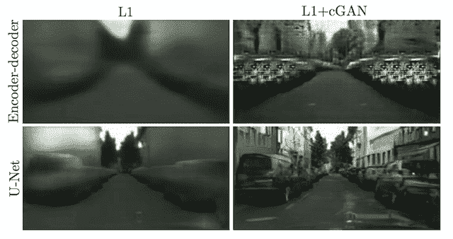

在不同损失下使用编码器-解码器和 U-Net 生成器模型生成的图像。
摘自:条件对抗网络下的图像转图像转换。

### 鉴别器模型分析

进行实验来比较具有不同大小的有效感受野的 PatchGAN 鉴别器。

从 1×1 感受野(PixelGAN)到全尺寸的 286×286 或 ImageGAN，以及更小的 16×16 和 70×70 patch gan，对该模型的不同版本进行了测试。

感受野越大，网络越深。这意味着 1×1 PixelGAN 是最浅的模型，286×286 ImageGAN 是最深的模型。

结果表明，非常小的感受野可以生成有效的图像，尽管全尺寸的 ImageGAN 提供了更清晰的结果，但更难训练。使用较小的 70×70 感受野提供了表现(模型深度)和图像质量的良好折衷。

> 70×70 的 PatchGAN […]表现稍好。超出此范围，扩展到完整的 286×286 ImageGAN，似乎并不能提高视觉质量[……]这可能是因为 ImageGAN 比 70 × 70 PatchGAN 具有更多的参数和更大的深度，并且可能更难训练。

——[条件对抗网络下的图像到图像转换](https://arxiv.org/abs/1611.07004)，2016。

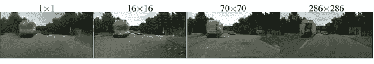

使用具有不同大小感受野的补丁生成图像。
摘自:条件对抗网络下的图像转图像转换。

## 进一步阅读

如果您想更深入地了解这个主题，本节将提供更多资源。

*   [条件对抗网络下的图像到图像转换](https://arxiv.org/abs/1611.07004)，2016。
*   [带条件对抗网的图像到图像转换，主页](https://phillipi.github.io/pix2pix/)。
*   [带条件对抗网的图像到图像转换，GitHub](https://github.com/phillipi/pix2pix) 。
*   [pytorch-cyclelegan-and-pix 2 pix，GitHub](https://github.com/junyanz/pytorch-CycleGAN-and-pix2pix) 。
*   [互动影像转影像演示](https://affinelayer.com/pixsrv/)，2017 年。
*   [Pix2Pix 数据集](http://efrosgans.eecs.berkeley.edu/pix2pix/datasets/)

## 摘要

在这篇文章中，你发现了图像到图像转换的 Pix2Pix 条件生成对抗网络。

具体来说，您了解到:

*   图像到图像的翻译通常需要专门的模型和手工制作的损失函数。
*   Pix2Pix GAN 为图像到图像的翻译提供了通用模型和损失函数。
*   Pix2Pix GAN 在各种各样的图像生成任务中进行了演示，包括将照片从白天翻译成黑夜，将产品草图翻译成照片。

你有什么问题吗？
在下面的评论中提问，我会尽力回答。