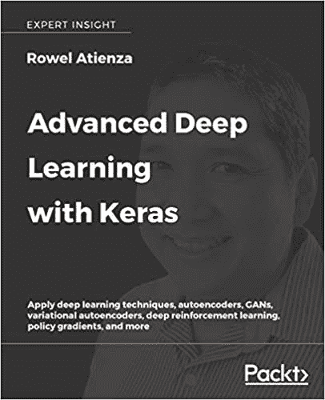
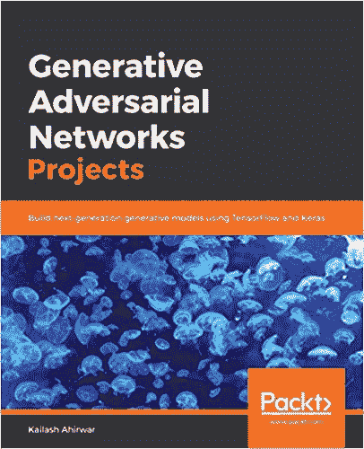
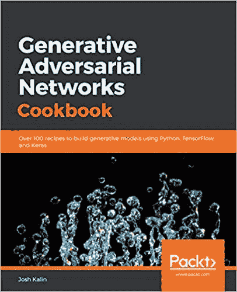
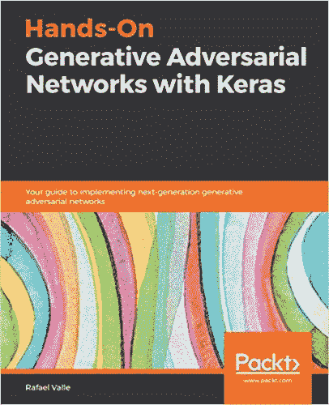
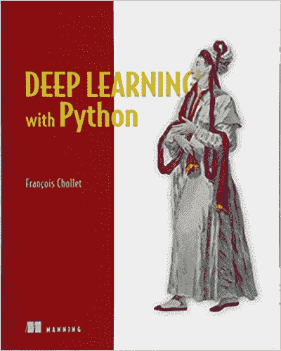

# 9 本关于生成对抗网络的书

> 原文：<https://machinelearningmastery.com/books-on-generative-adversarial-networks-gans/>

最后更新于 2019 年 8 月 21 日

生成对抗网络，简称 GANs，是伊恩·古德费勒等人在 2014 年发表的题为“生成对抗网络”的论文中首次描述的

从那以后，GANs 受到了很多关注，因为它们可能是生成大型高质量合成图像的最有效技术之一。

因此，已经有很多关于 GANs 的书，主要集中在如何在实践中开发和使用模型。

在这篇文章中，你会发现关于生成对抗网络的书籍。

**用我的新书[Python 生成对抗网络](https://machinelearningmastery.com/generative_adversarial_networks/)启动你的项目**，包括*分步教程*和所有示例的 *Python 源代码*文件。

我们开始吧。

## GAN 书籍

大部分的书都是在 Packt 出版公司的指导下编写和发行的。

几乎所有的书都有同样的问题:即质量普遍较低，总结了第三方代码在 GitHub 上的使用情况，几乎没有原创内容。这尤其适用于来自 Packt 的书籍。

尽管如此，了解一下有哪些书以及涵盖的主题还是很有用的。这既有助于选择自学书籍，也有助于了解开始使用 GANs 时您可能想要探索的主题类型。

我们将回顾以下七本书:

1.  [GANs 正在运行](https://amzn.to/2Igu0Ul)。
2.  [生成性深度学习](https://amzn.to/2F0njFt)。
3.  [用 Keras 高级深度学习](https://amzn.to/2Wt1p7G)。
4.  [学习生成对抗网络](https://amzn.to/2MavhS3)。
5.  [生成对抗网络项目](https://amzn.to/2YYdBLh)。
6.  [生成对抗网络秘籍](https://amzn.to/2MgzNyJ)。
7.  [与 Keras 的动手生成对抗网络](https://amzn.to/2VThkrv)。

此外，我们还将复习两本热门深度学习书籍的 GAN 部分。

1.  [深度学习](https://amzn.to/2MmZNbH)。
2.  [Python 深度学习](https://amzn.to/2QEg9v3)

如果我错过了一本关于 GANs 的书，请在下面的评论中告诉我。

这些书似乎大多涵盖了相同的 GAN 架构，例如:

*   **标准** : GAN、DCGAN。
*   **条件** : cGAN、SS-GAN、InfoGAN、ACGAN。
*   **损失** : WGAN，WGAN-GP，LSGAN。
*   **图像转换** : Pix2Pix，CycleGAN。
*   **高级 GANs** : BigGAN，PG-GAN，StyleGAN。
*   **其他** : StackGAN、3DGAN、BEGAN、SRGAN、DiscoGAN、SEGAN。

让我们仔细看看每本书涵盖的主题。

## 1.行动中的甘斯

**标题**:行动中的甘斯:生成对抗网络的深度学习

由[雅库布·朗格](https://www.linkedin.com/in/jakublangr/)[弗拉基米尔·博克](https://vladimirbok.com/)撰写，2019 年出版。

这本书温和地介绍了使用 Keras 深度学习库的 GANs。

行动中的甘斯

*   [GANs 在行动，亚马逊](https://amzn.to/2Igu0Ul)。
*   [甘斯在行动，曼宁](https://www.manning.com/books/gans-in-action)。
*   [图书源代码，GitHub](https://github.com/GANs-in-Action/gans-in-action) 。

### 目录

*   第 1 章:GANs 简介
*   第 2 章:自动编码器作为 GANs 的路径
*   第三章:你的第一个 GAN:生成手写数字
*   第四章:深度卷积神经网络
*   第 5 章:培训和常见挑战:为成功而组织
*   第 6 章:与 GANs 一起进步
*   第七章:半监督 GAN
*   第八章:条件 GAN
*   第九章:循环干
*   第十章:对抗性例子
*   第 11 章:GANs 的实际应用
*   第十二章:展望未来

## 2.生成性深度学习

**标题** : 生成性深度学习:教机器绘画、写作、作曲和演奏

[大卫·福斯特](https://www.linkedin.com/in/davidtfoster/)执笔，2019 年出版。

生成性深度学习

这本书侧重于更一般的问题，生成建模与深度学习，允许变分自动编码器进行讨论。它确实涵盖了一系列的 GAN 模型，但也包括使用 LSTMs 的语言建模。

*   [生成式深度学习，亚马逊](https://amzn.to/2F0njFt)。
*   [生成性深度学习，奥赖利](https://www.oreilly.com/library/view/generative-deep-learning/9781492041931/)。

### 目录

*   第一部分:生成性深度学习导论
    *   第一章。生成建模
    *   第二章。深度学习
    *   第三章。可变自动编码器
    *   第四章。生成对抗网络
*   第 2 部分:教机器绘画、写作、作曲和演奏
    *   第五章。颜料
    *   第六章。写
    *   第七章。构成
    *   第八章。玩
    *   第九章。生成建模的未来

## 3.通过 Keras 进行高级深度学习

**标题**:利用 Keras 进行高级深度学习:应用深度学习技术、自动编码器、GANs、变分自动编码器、深度强化学习、策略梯度等

作者[罗威尔·阿蒂恩萨](https://twitter.com/jacobe)，2018 年出版。

这本书是关于更一般的主题的高级深度学习与 Keras，允许覆盖自动编码器，变分自动编码器，和深度强化学习。然而，这本书有四章是关于 GAN 的，我认为这是一本 GAN 的书。

通过 Keras 进行高级深度学习

*   [亚马逊 Keras 高级深度学习](https://amzn.to/2Wt1p7G)。
*   [与 Keras、Packt](https://www.packtpub.com/au/big-data-and-business-intelligence/advanced-deep-learning-keras) 高级深度学习。
*   [图书源代码，GitHub](https://github.com/PacktPublishing/Advanced-Deep-Learning-with-Keras) 。

### 目录

*   第 1 章:用 Kera 介绍高级深度学习
*   第 2 章:深度神经网络
*   第 3 章:自动编码器
*   第四章:生成对抗网络
*   第 5 章:改进的 GANs
*   第 6 章:解开代理问题
*   第 7 章:跨域 GANs
*   第八章:可变自动编码器
*   第 9 章:深度强化学习
*   第 10 章:政策梯度方法

## 4.学习生成对抗网络

**标题**:学习生成对抗网络:下一代深度学习简化版。

[Kuntal Ganguly](https://github.com/Kuntal-G) 执笔，2017 年出版。

这本书对 GANs 做了非常简单的介绍。这本书可能已经被 Packt 删除或取消出版，并被视频课程取代。

学习生成对抗网络

*   [学习生成对抗网络，亚马逊](https://amzn.to/2MavhS3)。
*   [图书源代码，GitHub 第二](https://github.com/PacktPublishing/Learning-Generative-Adversarial-Networks) ( [这里](https://github.com/Kuntal-G/Books))。

### 目录

*   第 1 章:深度学习介绍
*   第二章:无监督学习
*   第 3 章:跨不同领域传递图像风格
*   第四章:从你的文本中构建真实的图像
*   第 5 章:使用各种生成模型生成图像
*   第 6 章:将机器学习带入生产

## 5.生成对抗网络项目

**标题**:生成对抗网络项目:使用 TensorFlow 和 Keras 构建下一代生成模型。

[Kailash Ahirwar](https://github.com/kailashahirwar) 执笔，2019 年出版。

这本书用 Keras 中的代码示例总结了一系列 GANs。

生成对抗网络项目

*   [生成对抗网络项目，亚马逊](https://amzn.to/2YYdBLh)。
*   [生成对抗网络项目，Packt](https://www.packtpub.com/big-data-and-business-intelligence/generative-adversarial-networks-projects) 。
*   [书籍源代码](https://github.com/PacktPublishing/Generative-Adversarial-Networks-Projects)

### 目录

*   第一章:生成对抗网络导论
*   第 2 章:三维甘-使用甘生成形状
*   第三章:基于条件遗传神经网络的人脸衰老
*   第 4 章:使用 DCGANs 生成动漫角色
*   第 5 章:使用 SRGANs 生成照片级真实感图像
*   第 6 章:层叠–文本到照片的真实感图像合成
*   第七章:循环干——把绘画变成照片
*   第 8 章:条件 GAN——使用条件性对抗网络的图像到图像转换
*   第 9 章:预测 GANs 的未来

## 6.生成对抗网络秘籍

**标题**:生成对抗网络秘籍:100 多种使用 Python、TensorFlow 和 Keras 构建生成模型的秘籍

作者[乔希·卡琳](https://www.linkedin.com/in/josh-kalin-96b6152b/)，2018 年出版。

生成对抗网络秘籍

*   [生成对抗网络秘籍，亚马逊](https://amzn.to/2MgzNyJ)。
*   [生成对抗网络秘籍，Packt](https://www.packtpub.com/big-data-and-business-intelligence/generative-adversarial-networks-cookbook) 。
*   [图书源代码](https://github.com/PacktPublishing/Generative-Adversarial-Networks-Cookbook)。

### 目录

*   第一章:什么是生成对抗网络
*   第 2 章:数据优先、轻松的环境和数据准备
*   第三章:我在百行以下的第一个 GAN
*   第四章:梦想用 DCGAN 建造新的户外建筑
*   第 5 章:Pix2Pix 图像到图像的翻译
*   第六章:用 CycleGAN 风格传递你的形象
*   第七章:用模拟图像创建逼真的眼球
*   第 8 章:使用 GANs 从图像到三维模型

## 7.用 Keras 实践生成对抗网络

**标题**:用 Keras 实践生成对抗网络:实现下一代生成对抗网络的指南

作者[拉斐尔·瓦莱](https://github.com/rafaelvalle)，2019 年出版。

这可能是最好的 Packt 出版的书籍之一，因为代码看起来质量更好，覆盖了更广泛的 GANs。

用 Keras 实践生成对抗网络

*   [与亚马逊 Keras 的实践生成对抗网络](https://amzn.to/2VThkrv)。
*   [与 Keras、Packt 的动手生成对抗网络](https://www.packtpub.com/big-data-and-business-intelligence/hands-generative-adversarial-networks-keras)。
*   [图书源代码](https://github.com/PacktPublishing/Hands-On-Generative-Adversarial-Networks-with-Keras)。

### 目录

*   第 1 部分:简介和环境设置
    *   第 1 章:深度学习基础和环境设置
    *   第二章:生成模型介绍
*   第 2 部分:培训全球网络
    *   第三章:培训甘斯
    *   第四章:评估你的第一个 GAN
    *   第五章:提高你的第一个 GAN
*   第三部分:GANS 在计算机视觉、自然语言处理和音频中的应用
    *   第 6 章:用 GANs 合成和操作图像
    *   第七章:肝的渐进式增长
    *   第 8 章:使用 GANs 生成离散序列
    *   第 9 章:用 GANs 进行文本到图像的合成
    *   第 10 章:使用 GANs 进行语音增强
    *   第 11 章:龙舌兰酒——鉴别 GAN 样品
    *   第 12 章:GANs 的下一步是什么

## 其他书中的甘斯

关于深度学习的其他现代书籍中也涉及到了 GANs 的主题。

下面列出了两个重要的例子。

### 8.深度学习

伊恩·古德费勒(Ian Goodfellow)等人在 2016 年出版的名为《深度学习》的教科书中描述了 GANs，具体如下:

*   第二十章:深度生成模型。

第 20.10.4 节标题为“*生成对抗网络*”提供了在撰写本文时对 GANs 的简短介绍，即在原始论文发表两年后。

如果能看到古德费勒在未来某个时候就这个话题写一本专门的教科书，那就太好了。

深度学习

### 9.使用 Python 进行深度学习

Francois Chollet 在 2017 年出版的名为《用 Python 进行深度学习》的书中也谈到了 GANs，具体来说:

*   第八章:生成性深度学习。

在标题为“生成对抗网络简介”的第 8.5 节中，介绍了 GANs 的主题，并介绍了为 CIFAR-10 数据集中的一个图像类(青蛙)开发 GAN 的工作示例。这里提供了源代码:

*   [图书源代码](https://github.com/fchollet/deep-learning-with-python-notebooks)。

使用 Python 进行深度学习

## 摘要

在这篇文章中，你发现了一套关于生成对抗网络的书籍。

你读过列出的书吗？
在下面的评论中让我知道你对它的看法。

你有什么问题吗？
在下面的评论中提问，我会尽力回答。