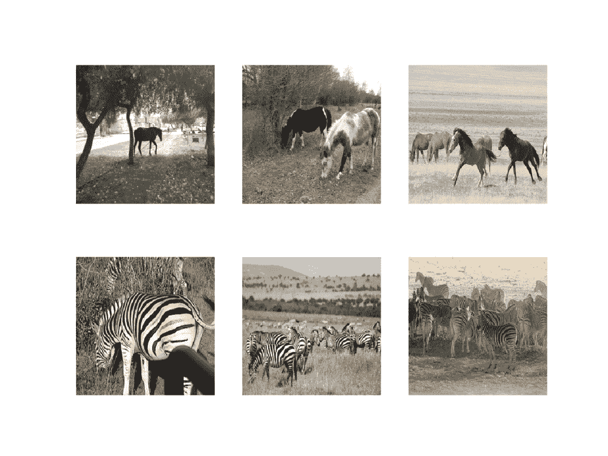
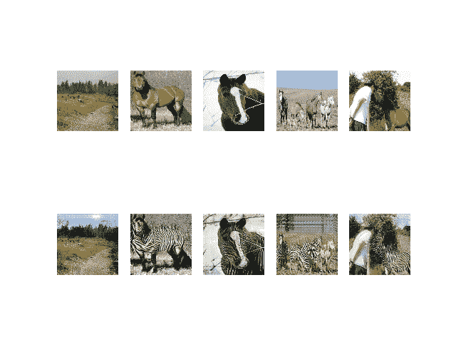
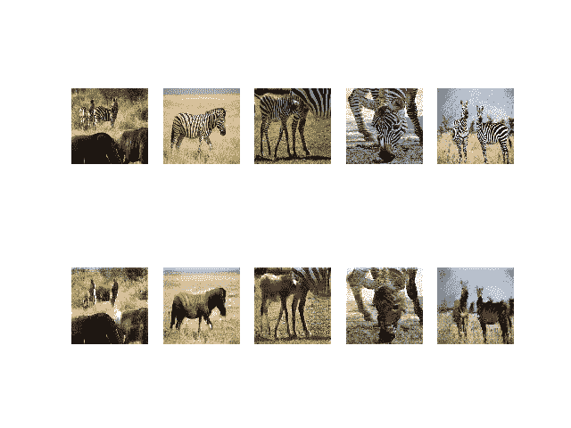
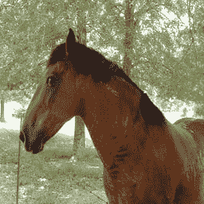
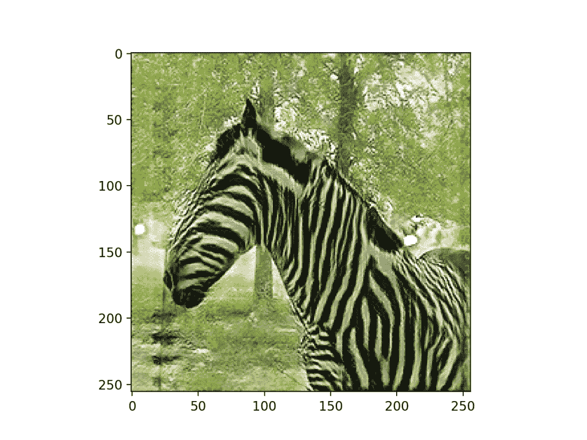

# 如何用 Keras 开发用于图像到图像转换的 CycleGAN

> 原文：<https://machinelearningmastery.com/cyclegan-tutorial-with-keras/>

最后更新于 2020 年 9 月 1 日

循环生成对抗网络是一种训练深度卷积神经网络的方法，用于图像到图像的翻译任务。

与其他用于图像转换的 GAN 模型不同，CycleGAN 不需要成对图像的数据集。例如，如果我们对将橙子的照片转换成苹果感兴趣，我们不需要手动转换成苹果的橙子训练数据集。这允许在训练数据集可能不存在的问题上开发翻译模型，例如将绘画翻译成照片。

在本教程中，您将发现如何开发一个 CycleGAN 模型来将马的照片翻译成斑马，然后再翻译回来。

完成本教程后，您将知道:

*   如何加载和准备马到斑马的图像转换数据集进行建模。
*   如何训练一对 CycleGAN 发电机模型，将马翻译成斑马，斑马翻译成马。
*   如何加载保存的 CycleGAN 模型，并使用它们来翻译照片。

**用我的新书[Python 生成对抗网络](https://machinelearningmastery.com/generative_adversarial_networks/)启动你的项目**，包括*分步教程*和所有示例的 *Python 源代码*文件。

我们开始吧。


如何使用 Keras 开发用于图像到图像转换的 cycle gan[a . Munar](https://www.flickr.com/photos/tzirma/4346635061/)摄，保留部分权利。

## 教程概述

本教程分为四个部分；它们是:

1.  什么是循环干？
2.  如何为斑马数据集准备马
3.  如何开发将马翻译成斑马的自行车
4.  如何使用循环生成器执行图像转换

## 什么是循环干？

朱俊彦等人在 2017 年的论文《使用循环一致对抗网络的不成对图像到图像的翻译》中描述了循环根模型

CycleGAN 模型的好处是可以在没有成对例子的情况下进行训练。也就是说，为了训练模型，它不需要翻译前后的照片示例，例如白天和晚上同一城市景观的照片。相反，该模型能够使用来自每个领域的照片集合，并提取和利用集合中图像的潜在风格，以便执行翻译。

模型架构由两个生成器模型组成:一个生成器(生成器-A)用于为第一个域(域-A)生成图像，第二个生成器(生成器-B)用于为第二个域(域-B)生成图像。

*   生成器-A ->域-A
*   生成器-B ->域-B

生成器模型执行图像转换，这意味着图像生成过程取决于输入图像，特别是来自另一个域的图像。生成器-A 从域-B 获取图像作为输入，生成器-B 从域-A 获取图像作为输入。

*   域-B ->生成器-A ->域-A
*   域-A ->生成器-B ->域-B

每个生成器都有相应的鉴别器模型。第一个鉴别器模型(鉴别器-A)从域-A 获取真实图像，从生成器-A 获取生成的图像，并预测它们是真实的还是伪造的。第二个鉴别器模型(Discriminator-B)从 Domain-B 获取真实图像，从 Generator-B 获取生成的图像，并预测它们是真实的还是伪造的。

*   域-A ->鉴别器-A->[真/假]
*   域-B ->生成器-A ->鉴别器-A->[真/假]
*   域-B ->鉴别器-B->[真/假]
*   域-A ->生成器-B ->鉴别器-B->[真/假]

鉴别器和生成器模型是在一个对抗性的零和过程中训练的，就像正常的 GAN 模型一样。生成器学会更好地欺骗鉴别器，鉴别器学会更好地检测假图像。模型一起在训练过程中找到平衡。

此外，生成器模型被正则化以不仅在目标域中创建新图像，而且从源域翻译输入图像的更多重构版本。这是通过将生成的图像用作相应生成器模型的输入并将输出图像与原始图像进行比较来实现的。将图像通过两个发生器称为一个循环。每对生成器模型一起被训练以更好地再现原始源图像，这被称为周期一致性。

*   域-B ->生成器-A ->域-A ->生成器-B ->域-B
*   域-A ->生成器-B ->域-B ->生成器-A ->域-A

该架构还有一个元素，称为身份映射。这是发生器被提供有作为来自目标域的输入的图像的地方，并且期望生成相同的图像而不改变。对体系结构的这种添加是可选的，尽管会导致输入图像的颜色轮廓更好地匹配。

*   领域-A ->生成器-A ->领域-A
*   域-B ->生成器-B ->域-B

既然我们已经熟悉了模型架构，我们就可以依次仔细看看每个模型，以及它们是如何实现的。

[论文](https://arxiv.org/abs/1703.10593)很好地描述了模型和训练过程，尽管[官方火炬实现](https://github.com/junyanz/CycleGAN)被用作每个模型和训练过程的最终描述，并为下面描述的模型实现提供了基础。

## 如何为斑马数据集准备马

报纸上令人印象深刻的骑自行车的例子之一是把马的照片变成斑马，反之，斑马变成马。

该论文的作者称之为“*对象变形*的问题，苹果和橘子的照片也证明了这一点。

在本教程中，我们将从零开始开发一个 CycleGAN，用于从马到斑马的图像到图像的转换(或对象变形)，反之亦然。

我们将这个数据集称为“*马 2 斑马*”。该数据集的 zip 文件约为 111 兆字节，可从 CycleGAN 网页下载:

*   [下载马到斑马数据集(111 兆字节)](https://people.eecs.berkeley.edu/~taesung_park/CycleGAN/datasets/horse2zebra.zip)

将数据集下载到当前工作目录中。

您将看到以下目录结构:

```py
horse2zebra
├── testA
├── testB
├── trainA
└── trainB
```

“ *A* ”类别指的是马， *B* 类别指的是斑马，数据集由列车和测试元素组成。我们将加载所有照片，并将它们用作训练数据集。

照片为正方形，形状为 256×256，文件名如“ *n02381460_2.jpg* ”。

下面的示例将从火车和测试文件夹中加载所有照片，并为 A 类创建一组图像，为 b 类创建另一组图像

然后，两个数组都以压缩的 NumPy 数组格式保存到一个新文件中。

```py
# example of preparing the horses and zebra dataset
from os import listdir
from numpy import asarray
from numpy import vstack
from keras.preprocessing.image import img_to_array
from keras.preprocessing.image import load_img
from numpy import savez_compressed

# load all images in a directory into memory
def load_images(path, size=(256,256)):
	data_list = list()
	# enumerate filenames in directory, assume all are images
	for filename in listdir(path):
		# load and resize the image
		pixels = load_img(path + filename, target_size=size)
		# convert to numpy array
		pixels = img_to_array(pixels)
		# store
		data_list.append(pixels)
	return asarray(data_list)

# dataset path
path = 'horse2zebra/'
# load dataset A
dataA1 = load_images(path + 'trainA/')
dataAB = load_images(path + 'testA/')
dataA = vstack((dataA1, dataAB))
print('Loaded dataA: ', dataA.shape)
# load dataset B
dataB1 = load_images(path + 'trainB/')
dataB2 = load_images(path + 'testB/')
dataB = vstack((dataB1, dataB2))
print('Loaded dataB: ', dataB.shape)
# save as compressed numpy array
filename = 'horse2zebra_256.npz'
savez_compressed(filename, dataA, dataB)
print('Saved dataset: ', filename)
```

运行示例首先将所有图像加载到内存中，显示 A 类(马)有 1，187 张照片，B 类(斑马)有 1，474 张照片。

然后，数组以压缩的 NumPy 格式保存，文件名为“ *horse2zebra_256.npz* ”。注意:这个数据文件大约 570 兆字节，比原始图像大，因为我们将像素值存储为 32 位浮点值。

```py
Loaded dataA:  (1187, 256, 256, 3)
Loaded dataB:  (1474, 256, 256, 3)
Saved dataset:  horse2zebra_256.npz
```

然后，我们可以加载数据集并绘制一些照片，以确认我们正在正确处理图像数据。

下面列出了完整的示例。

```py
# load and plot the prepared dataset
from numpy import load
from matplotlib import pyplot
# load the dataset
data = load('horse2zebra_256.npz')
dataA, dataB = data['arr_0'], data['arr_1']
print('Loaded: ', dataA.shape, dataB.shape)
# plot source images
n_samples = 3
for i in range(n_samples):
	pyplot.subplot(2, n_samples, 1 + i)
	pyplot.axis('off')
	pyplot.imshow(dataA[i].astype('uint8'))
# plot target image
for i in range(n_samples):
	pyplot.subplot(2, n_samples, 1 + n_samples + i)
	pyplot.axis('off')
	pyplot.imshow(dataB[i].astype('uint8'))
pyplot.show()
```

运行示例首先加载数据集，确认示例的数量和彩色图像的形状符合我们的预期。

```py
Loaded: (1187, 256, 256, 3) (1474, 256, 256, 3)
```

创建一个图，显示一行来自马照片数据集(dataA)的三幅图像和一行来自斑马数据集(dataB)的三幅图像。



霍斯 2 泽巴数据集的照片图

现在我们已经准备好了用于建模的数据集，我们可以开发 CycleGAN 生成器模型，该模型可以将照片从一个类别转换到另一个类别，反之亦然。

## 如何开发自行车——从马到斑马

在本节中，我们将开发 CycleGAN 模型，用于将马的照片翻译成斑马，将斑马的照片翻译成马

论文中描述的相同模型架构和配置被用于一系列图像到图像的翻译任务。这个架构在正文中有描述，在论文的附录中有更多的细节，还有一个[完全工作的实现](https://github.com/junyanz/CycleGAN/)作为开源为 Torch 深度学习框架实现。

本节中的实现将使用 Keras 深度学习框架，该框架直接基于论文中描述的模型，并在作者的代码库中实现，旨在拍摄和生成大小为 256×256 像素的彩色图像。

该架构由四个模型、两个鉴别器模型和两个生成器模型组成。

鉴别器是执行图像分类的深度[卷积神经网络](https://machinelearningmastery.com/convolutional-layers-for-deep-learning-neural-networks/)。它将源图像作为输入，并预测目标图像是真实图像还是假图像的可能性。使用了两个鉴别器模型，一个用于域 A(马)，一个用于域 B(斑马)。

鉴别器的设计基于模型的有效感受野，它定义了模型的一个输出与输入图像中的像素数之间的关系。这被称为 PatchGAN 模型，经过精心设计，模型的每个输出预测都映射到输入图像的 70×70 的正方形或面片。这种方法的好处是相同的模型可以应用于不同尺寸的输入图像，例如大于或小于 256×256 像素。

模型的输出取决于输入图像的大小，但可能是一个值或值的平方激活图。每一个值都是输入图像中的一个补丁是真实的可能性的概率。如果需要，可以对这些值进行平均，以给出总体可能性或分类分数。

模型中使用了卷积-batchorm-LeakyReLU 层的模式，这是深度卷积鉴别器模型所共有的。与其他型号不同，CycleGAN 鉴别器使用*实例化*代替*批处理化*。这是一种非常简单的标准化类型，包括标准化(例如，缩放至标准高斯)每个输出要素图上的值，而不是跨一批要素进行标准化。

在 [keras-contrib 项目](https://github.com/keras-team/keras-contrib)中提供了实例规范化的实现，该项目提供了对社区提供的 keras 特性的早期访问。

keras-contrib 库可以通过 pip 安装，如下所示:

```py
sudo pip install git+https://www.github.com/keras-team/keras-contrib.git
```

或者，如果您使用的是 [Anaconda](https://machinelearningmastery.com/setup-python-environment-machine-learning-deep-learning-anaconda/) 虚拟环境，[如在 EC2](https://machinelearningmastery.com/develop-evaluate-large-deep-learning-models-keras-amazon-web-services/) 上:

```py
git clone https://www.github.com/keras-team/keras-contrib.git
cd keras-contrib
sudo ~/anaconda3/envs/tensorflow_p36/bin/python setup.py install
```

新的*实例化*层可以如下使用:

```py
...
from keras_contrib.layers.normalization.instancenormalization import InstanceNormalization
# define layer
layer = InstanceNormalization(axis=-1)
...
```

“*轴*”参数设置为-1，以确保每个要素地图的要素都是标准化的。

下面的 *define_discriminator()* 函数按照文中模型的设计实现了 70×70 的 PatchGAN 鉴别器模型。该模型以 256×256 大小的图像作为输入，并输出一个预测补丁。使用最小二乘损失(L2)优化模型，最小二乘损失()实现为均方误差，并使用权重，以便模型的更新具有通常效果的一半(0.5)。CycleGAN 论文的作者推荐这种模型更新的权重，以减缓训练期间相对于生成器模型的鉴别器的变化。

```py
# define the discriminator model
def define_discriminator(image_shape):
	# weight initialization
	init = RandomNormal(stddev=0.02)
	# source image input
	in_image = Input(shape=image_shape)
	# C64
	d = Conv2D(64, (4,4), strides=(2,2), padding='same', kernel_initializer=init)(in_image)
	d = LeakyReLU(alpha=0.2)(d)
	# C128
	d = Conv2D(128, (4,4), strides=(2,2), padding='same', kernel_initializer=init)(d)
	d = InstanceNormalization(axis=-1)(d)
	d = LeakyReLU(alpha=0.2)(d)
	# C256
	d = Conv2D(256, (4,4), strides=(2,2), padding='same', kernel_initializer=init)(d)
	d = InstanceNormalization(axis=-1)(d)
	d = LeakyReLU(alpha=0.2)(d)
	# C512
	d = Conv2D(512, (4,4), strides=(2,2), padding='same', kernel_initializer=init)(d)
	d = InstanceNormalization(axis=-1)(d)
	d = LeakyReLU(alpha=0.2)(d)
	# second last output layer
	d = Conv2D(512, (4,4), padding='same', kernel_initializer=init)(d)
	d = InstanceNormalization(axis=-1)(d)
	d = LeakyReLU(alpha=0.2)(d)
	# patch output
	patch_out = Conv2D(1, (4,4), padding='same', kernel_initializer=init)(d)
	# define model
	model = Model(in_image, patch_out)
	# compile model
	model.compile(loss='mse', optimizer=Adam(lr=0.0002, beta_1=0.5), loss_weights=[0.5])
	return model
```

生成器模型比鉴别器模型更复杂。

生成器是一个编码器-解码器模型架构。该模型拍摄源图像(例如，马的照片)并生成目标图像(例如，斑马的照片)。它是这样做的:首先对输入图像进行下采样或编码到瓶颈层，然后用多个使用跳过连接的 ResNet 层解释编码，接着用一系列层将表示上采样或解码到输出图像的大小。

首先，我们需要一个函数来定义 [ResNet 块](https://machinelearningmastery.com/how-to-implement-major-architecture-innovations-for-convolutional-neural-networks/)。这些块由两个 3×3 有线电视新闻网层组成，其中块的输入按通道连接到块的输出。

这是在 *resnet_block()* 函数中实现的，该函数在第二个块之后创建了两个带有 3×3 过滤器的*卷积-实例化*块和 [1×1 步长](https://machinelearningmastery.com/padding-and-stride-for-convolutional-neural-networks/)块，并且没有 [ReLU 激活](https://machinelearningmastery.com/rectified-linear-activation-function-for-deep-learning-neural-networks/)，与 [build_conv_block()函数](https://github.com/junyanz/CycleGAN/blob/master/models/architectures.lua#L197)中的官方 Torch 实现相匹配。为了简单起见，使用相同的填充，而不是文中推荐的反射填充。

```py
# generator a resnet block
def resnet_block(n_filters, input_layer):
	# weight initialization
	init = RandomNormal(stddev=0.02)
	# first layer convolutional layer
	g = Conv2D(n_filters, (3,3), padding='same', kernel_initializer=init)(input_layer)
	g = InstanceNormalization(axis=-1)(g)
	g = Activation('relu')(g)
	# second convolutional layer
	g = Conv2D(n_filters, (3,3), padding='same', kernel_initializer=init)(g)
	g = InstanceNormalization(axis=-1)(g)
	# concatenate merge channel-wise with input layer
	g = Concatenate()([g, input_layer])
	return g
```

接下来，我们可以定义一个函数，为 256×256 个输入图像创建 9-resnet 块版本。通过将 *image_shape* 设置为(128 x128 x3)*n _ resnet*函数参数设置为 6，可以轻松将其更改为 6-resnet 块版本。

重要的是，该模型输出的像素值与输入的形状相同，并且像素值在[-1，1]的范围内，这是 GAN 发生器模型的典型情况。

```py
# define the standalone generator model
def define_generator(image_shape, n_resnet=9):
	# weight initialization
	init = RandomNormal(stddev=0.02)
	# image input
	in_image = Input(shape=image_shape)
	# c7s1-64
	g = Conv2D(64, (7,7), padding='same', kernel_initializer=init)(in_image)
	g = InstanceNormalization(axis=-1)(g)
	g = Activation('relu')(g)
	# d128
	g = Conv2D(128, (3,3), strides=(2,2), padding='same', kernel_initializer=init)(g)
	g = InstanceNormalization(axis=-1)(g)
	g = Activation('relu')(g)
	# d256
	g = Conv2D(256, (3,3), strides=(2,2), padding='same', kernel_initializer=init)(g)
	g = InstanceNormalization(axis=-1)(g)
	g = Activation('relu')(g)
	# R256
	for _ in range(n_resnet):
		g = resnet_block(256, g)
	# u128
	g = Conv2DTranspose(128, (3,3), strides=(2,2), padding='same', kernel_initializer=init)(g)
	g = InstanceNormalization(axis=-1)(g)
	g = Activation('relu')(g)
	# u64
	g = Conv2DTranspose(64, (3,3), strides=(2,2), padding='same', kernel_initializer=init)(g)
	g = InstanceNormalization(axis=-1)(g)
	g = Activation('relu')(g)
	# c7s1-3
	g = Conv2D(3, (7,7), padding='same', kernel_initializer=init)(g)
	g = InstanceNormalization(axis=-1)(g)
	out_image = Activation('tanh')(g)
	# define model
	model = Model(in_image, out_image)
	return model
```

鉴别器模型直接在真实和生成的图像上训练，而生成器模型不是。

相反，生成器模型通过它们相关的鉴别器模型来训练。具体来说，它们被更新以最小化由鉴别器为标记为“*真实*”的生成图像预测的损失，这被称为对抗性损失。因此，鼓励他们生成更适合目标领域的图像。

当与另一个发生器模型一起使用时，发生器模型也会根据它们在源图像再生时的效率进行更新，称为周期损失。最后，当从目标域提供一个称为身份丢失的示例时，生成器模型期望输出没有翻译的图像。

总之，每个发电机模型通过四个输出和四个损耗函数的组合进行优化:

*   对抗性损失(L2 或均方误差)。
*   身份损失(L1 或平均绝对误差)。
*   正向周期损失(L1 或平均绝对误差)。
*   反向循环损失(L1 或平均绝对误差)。

这可以通过定义用于训练每个生成器模型的复合模型来实现，该模型只负责更新该生成器模型的权重，尽管需要与相关的鉴别器模型和另一个生成器模型共享权重。

这在下面的 *define_composite_model()* 函数中实现，该函数获取一个已定义的发电机模型( *g_model_1* )以及发电机模型输出的已定义鉴别器模型( *d_model* )和另一个发电机模型( *g_model_2* )。其他模型的权重被标记为不可训练，因为我们只对更新第一个生成器模型感兴趣，即这个复合模型的焦点。

鉴别器连接到发生器的输出，以便将产生的图像分类为真实的或伪造的。复合模型的第二个输入被定义为来自目标域(而不是源域)的图像，生成器期望在没有身份映射转换的情况下输出该图像。接下来，正向循环损耗包括将发生器的输出连接到另一个发生器，后者将重建源图像。最后，后向循环丢失涉及来自用于身份映射的目标域的图像，该图像也通过另一个生成器传递，该生成器的输出连接到我们的主生成器作为输入，并输出来自目标域的该图像的重构版本。

综上所述，合成模型有两个输入用于来自域 A 和域 B 的真实照片，四个输出用于鉴别器输出、身份生成图像、正向循环生成图像和反向循环生成图像。

对于复合模型，只有第一个或主发电机模型的权重被更新，这是通过所有损失函数的加权和来完成的。循环损失的权重(10 倍)大于论文中描述的对抗性损失，身份损失的权重始终是循环损失的一半(5 倍)，与官方实现源代码相匹配。

```py
# define a composite model for updating generators by adversarial and cycle loss
def define_composite_model(g_model_1, d_model, g_model_2, image_shape):
	# ensure the model we're updating is trainable
	g_model_1.trainable = True
	# mark discriminator as not trainable
	d_model.trainable = False
	# mark other generator model as not trainable
	g_model_2.trainable = False
	# discriminator element
	input_gen = Input(shape=image_shape)
	gen1_out = g_model_1(input_gen)
	output_d = d_model(gen1_out)
	# identity element
	input_id = Input(shape=image_shape)
	output_id = g_model_1(input_id)
	# forward cycle
	output_f = g_model_2(gen1_out)
	# backward cycle
	gen2_out = g_model_2(input_id)
	output_b = g_model_1(gen2_out)
	# define model graph
	model = Model([input_gen, input_id], [output_d, output_id, output_f, output_b])
	# define optimization algorithm configuration
	opt = Adam(lr=0.0002, beta_1=0.5)
	# compile model with weighting of least squares loss and L1 loss
	model.compile(loss=['mse', 'mae', 'mae', 'mae'], loss_weights=[1, 5, 10, 10], optimizer=opt)
	return model
```

我们需要为每个生成器模型创建一个复合模型，例如用于斑马到马翻译的生成器-A (BtoA)，以及用于马到斑马翻译的生成器-B (AtoB)。

所有这些跨越两个领域的前进和后退都变得令人困惑。下面是每个复合模型的所有输入和输出的完整列表。同一性和循环损失被计算为每个翻译序列的输入和输出图像之间的 L1 距离。对抗损失计算为模型输出和目标值之间的 L2 距离，真实值为 1.0，虚假值为 0.0。

**发电机-复合模型(BtoA 或斑马对马)**

模型的输入、转换和输出如下:

*   **对抗损失:域-B** - >生成器-A - >域-A - >鉴别器-A - >【真/假】
*   **身份丢失**:域-A - >生成器-A - >域-A
*   **正向循环损耗**:域-B - >发电机-A - >域-A - >发电机-B - >域-B
*   **反向循环损耗**:域-A - >发电机-B - >域-B - >发电机-A - >域-A

我们可以将输入和输出总结为:

*   **输入**:域-B，域-A
*   **输出**:实数，域-A，域-B，域-A

**发电机-B 复合模型(AtoB 或马对斑马)**

模型的输入、转换和输出如下:

*   **对抗损失**:域-A - >生成器-B - >域-B - >鉴别器-B - >【真/假】
*   **身份丢失**:域-B - >生成器-B - >域-B
*   **正向循环损耗**:域-A - >发电机-B - >域-B - >发电机-A - >域-A
*   **反向循环损耗**:域-B - >发电机-A - >域-A - >发电机-B - >域-B

我们可以将输入和输出总结为:

*   **输入**:域-A，域-B
*   **输出**:实数，域-B，域-A，域-B

定义模型是循环的难点；剩下的就是标准的 GAN 训练，相对简单。

接下来，我们可以以压缩的 NumPy 数组格式加载我们的配对图像数据集。这将返回两个 NumPy 数组的列表:第一个用于源图像，第二个用于对应的目标图像。

```py
# load and prepare training images
def load_real_samples(filename):
	# load the dataset
	data = load(filename)
	# unpack arrays
	X1, X2 = data['arr_0'], data['arr_1']
	# scale from [0,255] to [-1,1]
	X1 = (X1 - 127.5) / 127.5
	X2 = (X2 - 127.5) / 127.5
	return [X1, X2]
```

每次训练迭代，我们都需要来自每个域的真实图像样本，作为鉴别器和复合生成器模型的输入。这可以通过随机选择一批样品来实现。

下面的 *generate_real_samples()* 函数实现了这一点，将一个域的 [NumPy 数组](https://machinelearningmastery.com/gentle-introduction-n-dimensional-arrays-python-numpy/)作为输入，并返回随机选择的图像的请求数量，以及表示图像是真实的 PatchGAN 鉴别器模型的目标(*目标=1.0* )。因此，还提供了 PatchgAN 输出的形状，在 256×256 图像的情况下，这将是 16，或 16x16x1 激活图，由 patch_shape 函数参数定义。

```py
# select a batch of random samples, returns images and target
def generate_real_samples(dataset, n_samples, patch_shape):
	# choose random instances
	ix = randint(0, dataset.shape[0], n_samples)
	# retrieve selected images
	X = dataset[ix]
	# generate 'real' class labels (1)
	y = ones((n_samples, patch_shape, patch_shape, 1))
	return X, y
```

类似地，在每次训练迭代中，需要生成图像的样本来更新每个鉴别器模型。

下面的 *generate_fake_samples()* 函数在给定生成器模型和来自源域的真实图像样本的情况下生成该样本。同样，为每个生成的图像的目标值提供了 PatchGAN 的正确形状，表明它们是假的或生成的(*目标=0.0* )。

```py
# generate a batch of images, returns images and targets
def generate_fake_samples(g_model, dataset, patch_shape):
	# generate fake instance
	X = g_model.predict(dataset)
	# create 'fake' class labels (0)
	y = zeros((len(X), patch_shape, patch_shape, 1))
	return X, y
```

典型地，GAN 模型不收敛；相反，在生成器和鉴别器模型之间找到了平衡。因此，我们不能轻易判断培训是否应该停止。因此，我们可以保存模型，并在训练期间定期使用它生成样本图像到图像的转换，例如每一个或五个训练时期。

然后，我们可以在训练结束时查看生成的图像，并使用图像质量来选择最终模型。

下面的 *save_models()* 功能将[以 H5 格式将每个发电机模型](https://machinelearningmastery.com/save-load-keras-deep-learning-models/)保存到当前目录，包括文件名中的训练迭代编号。这需要安装 [h5py 库](https://www.h5py.org/)。

```py
# save the generator models to file
def save_models(step, g_model_AtoB, g_model_BtoA):
	# save the first generator model
	filename1 = 'g_model_AtoB_%06d.h5' % (step+1)
	g_model_AtoB.save(filename1)
	# save the second generator model
	filename2 = 'g_model_BtoA_%06d.h5' % (step+1)
	g_model_BtoA.save(filename2)
	print('>Saved: %s and %s' % (filename1, filename2))
```

下面的*summary _ performance()*函数使用给定的生成器模型来生成一些随机选择的源照片的翻译版本，并将该图保存到文件中。

源图像绘制在第一行，生成的图像绘制在第二行。同样，绘图文件名包括训练迭代号。

```py
# generate samples and save as a plot and save the model
def summarize_performance(step, g_model, trainX, name, n_samples=5):
	# select a sample of input images
	X_in, _ = generate_real_samples(trainX, n_samples, 0)
	# generate translated images
	X_out, _ = generate_fake_samples(g_model, X_in, 0)
	# scale all pixels from [-1,1] to [0,1]
	X_in = (X_in + 1) / 2.0
	X_out = (X_out + 1) / 2.0
	# plot real images
	for i in range(n_samples):
		pyplot.subplot(2, n_samples, 1 + i)
		pyplot.axis('off')
		pyplot.imshow(X_in[i])
	# plot translated image
	for i in range(n_samples):
		pyplot.subplot(2, n_samples, 1 + n_samples + i)
		pyplot.axis('off')
		pyplot.imshow(X_out[i])
	# save plot to file
	filename1 = '%s_generated_plot_%06d.png' % (name, (step+1))
	pyplot.savefig(filename1)
	pyplot.close()
```

我们几乎准备好定义模型的训练。

鉴别器模型直接在真实和生成的图像上更新，尽管为了进一步管理鉴别器模型学习的速度，维护了一个假图像池。

本文为每个鉴别器模型定义了一个由 50 个生成图像组成的图像池，首先填充该图像池，然后通过替换现有图像或直接使用生成的图像来增加新图像。我们可以将其实现为每个鉴别器的 Python 图像列表，并使用下面的 *update_image_pool()* 函数来维护每个池列表。

```py
# update image pool for fake images
def update_image_pool(pool, images, max_size=50):
	selected = list()
	for image in images:
		if len(pool) < max_size:
			# stock the pool
			pool.append(image)
			selected.append(image)
		elif random() < 0.5:
			# use image, but don't add it to the pool
			selected.append(image)
		else:
			# replace an existing image and use replaced image
			ix = randint(0, len(pool))
			selected.append(pool[ix])
			pool[ix] = image
	return asarray(selected)
```

我们现在可以定义每个生成器模型的训练。

下面的 *train()* 函数将所有六个模型(两个鉴别器、两个生成器和两个复合模型)与数据集一起作为参数，并训练模型。

批量大小固定在一张图片上，以匹配论文中的描述，模型适合 [100 个时代](https://machinelearningmastery.com/difference-between-a-batch-and-an-epoch/)。假设马数据集有 1，187 个图像，一个纪元被定义为 1，187 个批次和相同数量的训练迭代。每个时期使用两个生成器生成图像，并且每五个时期或(1187 * 5) 5，935 次训练迭代保存模型。

实现模型更新的顺序是为了匹配官方的 Torch 实现。首先，从每个域中选择一批真实图像，然后为每个域生成一批假图像。假图像然后被用来更新每个鉴别器的假图像池。

接下来，生成器-A 模型(斑马到马)通过复合模型更新，然后是鉴别器-A 模型(马)。然后更新生成器-B(马对斑马)合成模型和鉴别器-B(斑马)模型。

然后在训练迭代结束时报告每个更新模型的损失。重要的是，仅报告用于更新每个发电机的加权平均损失。

```py
# train cyclegan models
def train(d_model_A, d_model_B, g_model_AtoB, g_model_BtoA, c_model_AtoB, c_model_BtoA, dataset):
	# define properties of the training run
	n_epochs, n_batch, = 100, 1
	# determine the output square shape of the discriminator
	n_patch = d_model_A.output_shape[1]
	# unpack dataset
	trainA, trainB = dataset
	# prepare image pool for fakes
	poolA, poolB = list(), list()
	# calculate the number of batches per training epoch
	bat_per_epo = int(len(trainA) / n_batch)
	# calculate the number of training iterations
	n_steps = bat_per_epo * n_epochs
	# manually enumerate epochs
	for i in range(n_steps):
		# select a batch of real samples
		X_realA, y_realA = generate_real_samples(trainA, n_batch, n_patch)
		X_realB, y_realB = generate_real_samples(trainB, n_batch, n_patch)
		# generate a batch of fake samples
		X_fakeA, y_fakeA = generate_fake_samples(g_model_BtoA, X_realB, n_patch)
		X_fakeB, y_fakeB = generate_fake_samples(g_model_AtoB, X_realA, n_patch)
		# update fakes from pool
		X_fakeA = update_image_pool(poolA, X_fakeA)
		X_fakeB = update_image_pool(poolB, X_fakeB)
		# update generator B->A via adversarial and cycle loss
		g_loss2, _, _, _, _  = c_model_BtoA.train_on_batch([X_realB, X_realA], [y_realA, X_realA, X_realB, X_realA])
		# update discriminator for A -> [real/fake]
		dA_loss1 = d_model_A.train_on_batch(X_realA, y_realA)
		dA_loss2 = d_model_A.train_on_batch(X_fakeA, y_fakeA)
		# update generator A->B via adversarial and cycle loss
		g_loss1, _, _, _, _ = c_model_AtoB.train_on_batch([X_realA, X_realB], [y_realB, X_realB, X_realA, X_realB])
		# update discriminator for B -> [real/fake]
		dB_loss1 = d_model_B.train_on_batch(X_realB, y_realB)
		dB_loss2 = d_model_B.train_on_batch(X_fakeB, y_fakeB)
		# summarize performance
		print('>%d, dA[%.3f,%.3f] dB[%.3f,%.3f] g[%.3f,%.3f]' % (i+1, dA_loss1,dA_loss2, dB_loss1,dB_loss2, g_loss1,g_loss2))
		# evaluate the model performance every so often
		if (i+1) % (bat_per_epo * 1) == 0:
			# plot A->B translation
			summarize_performance(i, g_model_AtoB, trainA, 'AtoB')
			# plot B->A translation
			summarize_performance(i, g_model_BtoA, trainB, 'BtoA')
		if (i+1) % (bat_per_epo * 5) == 0:
			# save the models
			save_models(i, g_model_AtoB, g_model_BtoA)
```

将所有这些结合在一起，下面列出了训练 CycleGAN 模型将马的照片翻译成斑马并将斑马的照片翻译成马的完整示例。

```py
# example of training a cyclegan on the horse2zebra dataset
from random import random
from numpy import load
from numpy import zeros
from numpy import ones
from numpy import asarray
from numpy.random import randint
from keras.optimizers import Adam
from keras.initializers import RandomNormal
from keras.models import Model
from keras.models import Input
from keras.layers import Conv2D
from keras.layers import Conv2DTranspose
from keras.layers import LeakyReLU
from keras.layers import Activation
from keras.layers import Concatenate
from keras_contrib.layers.normalization.instancenormalization import InstanceNormalization
from matplotlib import pyplot

# define the discriminator model
def define_discriminator(image_shape):
	# weight initialization
	init = RandomNormal(stddev=0.02)
	# source image input
	in_image = Input(shape=image_shape)
	# C64
	d = Conv2D(64, (4,4), strides=(2,2), padding='same', kernel_initializer=init)(in_image)
	d = LeakyReLU(alpha=0.2)(d)
	# C128
	d = Conv2D(128, (4,4), strides=(2,2), padding='same', kernel_initializer=init)(d)
	d = InstanceNormalization(axis=-1)(d)
	d = LeakyReLU(alpha=0.2)(d)
	# C256
	d = Conv2D(256, (4,4), strides=(2,2), padding='same', kernel_initializer=init)(d)
	d = InstanceNormalization(axis=-1)(d)
	d = LeakyReLU(alpha=0.2)(d)
	# C512
	d = Conv2D(512, (4,4), strides=(2,2), padding='same', kernel_initializer=init)(d)
	d = InstanceNormalization(axis=-1)(d)
	d = LeakyReLU(alpha=0.2)(d)
	# second last output layer
	d = Conv2D(512, (4,4), padding='same', kernel_initializer=init)(d)
	d = InstanceNormalization(axis=-1)(d)
	d = LeakyReLU(alpha=0.2)(d)
	# patch output
	patch_out = Conv2D(1, (4,4), padding='same', kernel_initializer=init)(d)
	# define model
	model = Model(in_image, patch_out)
	# compile model
	model.compile(loss='mse', optimizer=Adam(lr=0.0002, beta_1=0.5), loss_weights=[0.5])
	return model

# generator a resnet block
def resnet_block(n_filters, input_layer):
	# weight initialization
	init = RandomNormal(stddev=0.02)
	# first layer convolutional layer
	g = Conv2D(n_filters, (3,3), padding='same', kernel_initializer=init)(input_layer)
	g = InstanceNormalization(axis=-1)(g)
	g = Activation('relu')(g)
	# second convolutional layer
	g = Conv2D(n_filters, (3,3), padding='same', kernel_initializer=init)(g)
	g = InstanceNormalization(axis=-1)(g)
	# concatenate merge channel-wise with input layer
	g = Concatenate()([g, input_layer])
	return g

# define the standalone generator model
def define_generator(image_shape, n_resnet=9):
	# weight initialization
	init = RandomNormal(stddev=0.02)
	# image input
	in_image = Input(shape=image_shape)
	# c7s1-64
	g = Conv2D(64, (7,7), padding='same', kernel_initializer=init)(in_image)
	g = InstanceNormalization(axis=-1)(g)
	g = Activation('relu')(g)
	# d128
	g = Conv2D(128, (3,3), strides=(2,2), padding='same', kernel_initializer=init)(g)
	g = InstanceNormalization(axis=-1)(g)
	g = Activation('relu')(g)
	# d256
	g = Conv2D(256, (3,3), strides=(2,2), padding='same', kernel_initializer=init)(g)
	g = InstanceNormalization(axis=-1)(g)
	g = Activation('relu')(g)
	# R256
	for _ in range(n_resnet):
		g = resnet_block(256, g)
	# u128
	g = Conv2DTranspose(128, (3,3), strides=(2,2), padding='same', kernel_initializer=init)(g)
	g = InstanceNormalization(axis=-1)(g)
	g = Activation('relu')(g)
	# u64
	g = Conv2DTranspose(64, (3,3), strides=(2,2), padding='same', kernel_initializer=init)(g)
	g = InstanceNormalization(axis=-1)(g)
	g = Activation('relu')(g)
	# c7s1-3
	g = Conv2D(3, (7,7), padding='same', kernel_initializer=init)(g)
	g = InstanceNormalization(axis=-1)(g)
	out_image = Activation('tanh')(g)
	# define model
	model = Model(in_image, out_image)
	return model

# define a composite model for updating generators by adversarial and cycle loss
def define_composite_model(g_model_1, d_model, g_model_2, image_shape):
	# ensure the model we're updating is trainable
	g_model_1.trainable = True
	# mark discriminator as not trainable
	d_model.trainable = False
	# mark other generator model as not trainable
	g_model_2.trainable = False
	# discriminator element
	input_gen = Input(shape=image_shape)
	gen1_out = g_model_1(input_gen)
	output_d = d_model(gen1_out)
	# identity element
	input_id = Input(shape=image_shape)
	output_id = g_model_1(input_id)
	# forward cycle
	output_f = g_model_2(gen1_out)
	# backward cycle
	gen2_out = g_model_2(input_id)
	output_b = g_model_1(gen2_out)
	# define model graph
	model = Model([input_gen, input_id], [output_d, output_id, output_f, output_b])
	# define optimization algorithm configuration
	opt = Adam(lr=0.0002, beta_1=0.5)
	# compile model with weighting of least squares loss and L1 loss
	model.compile(loss=['mse', 'mae', 'mae', 'mae'], loss_weights=[1, 5, 10, 10], optimizer=opt)
	return model

# load and prepare training images
def load_real_samples(filename):
	# load the dataset
	data = load(filename)
	# unpack arrays
	X1, X2 = data['arr_0'], data['arr_1']
	# scale from [0,255] to [-1,1]
	X1 = (X1 - 127.5) / 127.5
	X2 = (X2 - 127.5) / 127.5
	return [X1, X2]

# select a batch of random samples, returns images and target
def generate_real_samples(dataset, n_samples, patch_shape):
	# choose random instances
	ix = randint(0, dataset.shape[0], n_samples)
	# retrieve selected images
	X = dataset[ix]
	# generate 'real' class labels (1)
	y = ones((n_samples, patch_shape, patch_shape, 1))
	return X, y

# generate a batch of images, returns images and targets
def generate_fake_samples(g_model, dataset, patch_shape):
	# generate fake instance
	X = g_model.predict(dataset)
	# create 'fake' class labels (0)
	y = zeros((len(X), patch_shape, patch_shape, 1))
	return X, y

# save the generator models to file
def save_models(step, g_model_AtoB, g_model_BtoA):
	# save the first generator model
	filename1 = 'g_model_AtoB_%06d.h5' % (step+1)
	g_model_AtoB.save(filename1)
	# save the second generator model
	filename2 = 'g_model_BtoA_%06d.h5' % (step+1)
	g_model_BtoA.save(filename2)
	print('>Saved: %s and %s' % (filename1, filename2))

# generate samples and save as a plot and save the model
def summarize_performance(step, g_model, trainX, name, n_samples=5):
	# select a sample of input images
	X_in, _ = generate_real_samples(trainX, n_samples, 0)
	# generate translated images
	X_out, _ = generate_fake_samples(g_model, X_in, 0)
	# scale all pixels from [-1,1] to [0,1]
	X_in = (X_in + 1) / 2.0
	X_out = (X_out + 1) / 2.0
	# plot real images
	for i in range(n_samples):
		pyplot.subplot(2, n_samples, 1 + i)
		pyplot.axis('off')
		pyplot.imshow(X_in[i])
	# plot translated image
	for i in range(n_samples):
		pyplot.subplot(2, n_samples, 1 + n_samples + i)
		pyplot.axis('off')
		pyplot.imshow(X_out[i])
	# save plot to file
	filename1 = '%s_generated_plot_%06d.png' % (name, (step+1))
	pyplot.savefig(filename1)
	pyplot.close()

# update image pool for fake images
def update_image_pool(pool, images, max_size=50):
	selected = list()
	for image in images:
		if len(pool) < max_size:
			# stock the pool
			pool.append(image)
			selected.append(image)
		elif random() < 0.5:
			# use image, but don't add it to the pool
			selected.append(image)
		else:
			# replace an existing image and use replaced image
			ix = randint(0, len(pool))
			selected.append(pool[ix])
			pool[ix] = image
	return asarray(selected)

# train cyclegan models
def train(d_model_A, d_model_B, g_model_AtoB, g_model_BtoA, c_model_AtoB, c_model_BtoA, dataset):
	# define properties of the training run
	n_epochs, n_batch, = 100, 1
	# determine the output square shape of the discriminator
	n_patch = d_model_A.output_shape[1]
	# unpack dataset
	trainA, trainB = dataset
	# prepare image pool for fakes
	poolA, poolB = list(), list()
	# calculate the number of batches per training epoch
	bat_per_epo = int(len(trainA) / n_batch)
	# calculate the number of training iterations
	n_steps = bat_per_epo * n_epochs
	# manually enumerate epochs
	for i in range(n_steps):
		# select a batch of real samples
		X_realA, y_realA = generate_real_samples(trainA, n_batch, n_patch)
		X_realB, y_realB = generate_real_samples(trainB, n_batch, n_patch)
		# generate a batch of fake samples
		X_fakeA, y_fakeA = generate_fake_samples(g_model_BtoA, X_realB, n_patch)
		X_fakeB, y_fakeB = generate_fake_samples(g_model_AtoB, X_realA, n_patch)
		# update fakes from pool
		X_fakeA = update_image_pool(poolA, X_fakeA)
		X_fakeB = update_image_pool(poolB, X_fakeB)
		# update generator B->A via adversarial and cycle loss
		g_loss2, _, _, _, _  = c_model_BtoA.train_on_batch([X_realB, X_realA], [y_realA, X_realA, X_realB, X_realA])
		# update discriminator for A -> [real/fake]
		dA_loss1 = d_model_A.train_on_batch(X_realA, y_realA)
		dA_loss2 = d_model_A.train_on_batch(X_fakeA, y_fakeA)
		# update generator A->B via adversarial and cycle loss
		g_loss1, _, _, _, _ = c_model_AtoB.train_on_batch([X_realA, X_realB], [y_realB, X_realB, X_realA, X_realB])
		# update discriminator for B -> [real/fake]
		dB_loss1 = d_model_B.train_on_batch(X_realB, y_realB)
		dB_loss2 = d_model_B.train_on_batch(X_fakeB, y_fakeB)
		# summarize performance
		print('>%d, dA[%.3f,%.3f] dB[%.3f,%.3f] g[%.3f,%.3f]' % (i+1, dA_loss1,dA_loss2, dB_loss1,dB_loss2, g_loss1,g_loss2))
		# evaluate the model performance every so often
		if (i+1) % (bat_per_epo * 1) == 0:
			# plot A->B translation
			summarize_performance(i, g_model_AtoB, trainA, 'AtoB')
			# plot B->A translation
			summarize_performance(i, g_model_BtoA, trainB, 'BtoA')
		if (i+1) % (bat_per_epo * 5) == 0:
			# save the models
			save_models(i, g_model_AtoB, g_model_BtoA)

# load image data
dataset = load_real_samples('horse2zebra_256.npz')
print('Loaded', dataset[0].shape, dataset[1].shape)
# define input shape based on the loaded dataset
image_shape = dataset[0].shape[1:]
# generator: A -> B
g_model_AtoB = define_generator(image_shape)
# generator: B -> A
g_model_BtoA = define_generator(image_shape)
# discriminator: A -> [real/fake]
d_model_A = define_discriminator(image_shape)
# discriminator: B -> [real/fake]
d_model_B = define_discriminator(image_shape)
# composite: A -> B -> [real/fake, A]
c_model_AtoB = define_composite_model(g_model_AtoB, d_model_B, g_model_BtoA, image_shape)
# composite: B -> A -> [real/fake, B]
c_model_BtoA = define_composite_model(g_model_BtoA, d_model_A, g_model_AtoB, image_shape)
# train models
train(d_model_A, d_model_B, g_model_AtoB, g_model_BtoA, c_model_AtoB, c_model_BtoA, dataset)
```

该示例可以在 CPU 硬件上运行，尽管建议使用 GPU 硬件。

该示例可能需要几个小时才能在现代 GPU 硬件上运行。

如果需要，可以通过亚马逊 EC2 访问便宜的 GPU 硬件；请参见教程:

*   [如何设置亚马逊 AWS EC2 GPUs 训练 Keras 深度学习模型(分步)](https://machinelearningmastery.com/develop-evaluate-large-deep-learning-models-keras-amazon-web-services/)

**注**:考虑到算法或评估程序的随机性，或数值准确率的差异，您的[结果可能会有所不同](https://machinelearningmastery.com/different-results-each-time-in-machine-learning/)。考虑运行该示例几次，并比较平均结果。

在每个训练迭代中报告损失，包括真假示例的鉴别器-A 损失( *dA* )、真假示例的鉴别器-B 损失( *dB* )以及生成器-AtoB 和生成器-BtoA 损失，每个损失都是对抗、同一性、前向和后向循环损失的加权平均值( *g* )。

如果鉴别器的损耗变为零并在那里停留很长时间，考虑重新开始训练，因为这是训练失败的一个例子。

```py
>1, dA[2.284,0.678] dB[1.422,0.918] g[18.747,18.452]
>2, dA[2.129,1.226] dB[1.039,1.331] g[19.469,22.831]
>3, dA[1.644,3.909] dB[1.097,1.680] g[19.192,23.757]
>4, dA[1.427,1.757] dB[1.236,3.493] g[20.240,18.390]
>5, dA[1.737,0.808] dB[1.662,2.312] g[16.941,14.915]
...
>118696, dA[0.004,0.016] dB[0.001,0.001] g[2.623,2.359]
>118697, dA[0.001,0.028] dB[0.003,0.002] g[3.045,3.194]
>118698, dA[0.002,0.008] dB[0.001,0.002] g[2.685,2.071]
>118699, dA[0.010,0.010] dB[0.001,0.001] g[2.430,2.345]
>118700, dA[0.002,0.008] dB[0.000,0.004] g[2.487,2.169]
>Saved: g_model_AtoB_118700.h5 and g_model_BtoA_118700.h5
```

生成的图像图在每个时期结束时或每 1，187 次训练迭代后保存，迭代号用在文件名中。

```py
AtoB_generated_plot_001187.png
AtoB_generated_plot_002374.png
...
BtoA_generated_plot_001187.png
BtoA_generated_plot_002374.png
```

每五个纪元或(1187 * 5) 5，935 次训练迭代后保存模型，并且在文件名中再次使用迭代编号。

```py
g_model_AtoB_053415.h5
g_model_AtoB_059350.h5
...
g_model_BtoA_053415.h5
g_model_BtoA_059350.h5
```

生成图像的图可以用于选择模型，并且更多的训练迭代不一定意味着生成的图像质量更好。

马到斑马的翻译在大约 50 个时代后开始变得可靠。



53，415 次训练迭代后，马的源照片(上排)和斑马的翻译照片(下排)的绘图

从斑马到马的翻译似乎对模型学习来说更具挑战性，尽管有些似是而非的翻译也开始在 50 到 60 个时代后产生。

我怀疑，如本文所用，通过增加 100 个具有权重衰减的训练时期，可能会获得更高质量的结果，或许还可以使用一个数据生成器，系统地处理每个数据集，而不是随机采样。



90，212 次训练迭代后斑马的源照片(上排)和马的翻译照片(下排)的绘图

既然我们已经安装了 CycleGAN 生成器，我们就可以使用它们来临时翻译照片。

## 如何使用循环生成器执行图像转换

保存的生成器模型可以被加载并用于特定的图像转换。

第一步是加载数据集。我们可以使用与上一节中开发的相同的 *load_real_samples()* 函数。

```py
...
# load dataset
A_data, B_data = load_real_samples('horse2zebra_256.npz')
print('Loaded', A_data.shape, B_data.shape)
```

查看生成的图像图，选择一对可用于图像生成的模型。在这种情况下，我们将使用在纪元 89(训练迭代 89，025)前后保存的模型。我们的生成器模型使用了来自 *keras_contrib* 库的定制层，特别是*实例化*层。因此，我们需要指定在加载每个生成器模型时如何加载该层。

这可以通过指定层名称到对象的字典映射并将其作为参数传递给 *load_model()* keras 函数来实现。

```py
...
# load the models
cust = {'InstanceNormalization': InstanceNormalization}
model_AtoB = load_model('g_model_AtoB_089025.h5', cust)
model_BtoA = load_model('g_model_BtoA_089025.h5', cust)
```

我们可以使用上一节中开发的 *select_sample()* 函数从数据集中选择一张随机照片。

```py
# select a random sample of images from the dataset
def select_sample(dataset, n_samples):
	# choose random instances
	ix = randint(0, dataset.shape[0], n_samples)
	# retrieve selected images
	X = dataset[ix]
	return X
```

接下来，我们可以使用 Generator-AtoB 模型，首先从 Domain-A(马)中选择一幅随机图像作为输入，使用 Generator-AtoB 将其翻译成 Domain-B(斑马)，然后使用 Generator-BtoA 模型重建原始图像(马)。

```py
# plot A->B->A
A_real = select_sample(A_data, 1)
B_generated  = model_AtoB.predict(A_real)
A_reconstructed = model_BtoA.predict(B_generated)
```

然后，我们可以将这三张照片并排绘制为原始照片或真实照片、翻译后的照片以及原始照片的重建。下面的 *show_plot()* 函数实现了这一点。

```py
# plot the image, the translation, and the reconstruction
def show_plot(imagesX, imagesY1, imagesY2):
	images = vstack((imagesX, imagesY1, imagesY2))
	titles = ['Real', 'Generated', 'Reconstructed']
	# scale from [-1,1] to [0,1]
	images = (images + 1) / 2.0
	# plot images row by row
	for i in range(len(images)):
		# define subplot
		pyplot.subplot(1, len(images), 1 + i)
		# turn off axis
		pyplot.axis('off')
		# plot raw pixel data
		pyplot.imshow(images[i])
		# title
		pyplot.title(titles[i])
	pyplot.show()
```

然后我们可以调用这个函数来绘制真实的和生成的照片。

```py
...
show_plot(A_real, B_generated, A_reconstructed)
```

这是对两个模型的一个很好的测试，但是，我们也可以反向执行相同的操作。

具体来说，一张来自域 B(斑马)的真实照片被翻译成域 A(马)，然后被重建为域 B(斑马)。

```py
# plot B->A->B
B_real = select_sample(B_data, 1)
A_generated  = model_BtoA.predict(B_real)
B_reconstructed = model_AtoB.predict(A_generated)
show_plot(B_real, A_generated, B_reconstructed)
```

将所有这些结合在一起，下面列出了完整的示例。

```py
# example of using saved cyclegan models for image translation
from keras.models import load_model
from numpy import load
from numpy import vstack
from matplotlib import pyplot
from numpy.random import randint
from keras_contrib.layers.normalization.instancenormalization import InstanceNormalization

# load and prepare training images
def load_real_samples(filename):
	# load the dataset
	data = load(filename)
	# unpack arrays
	X1, X2 = data['arr_0'], data['arr_1']
	# scale from [0,255] to [-1,1]
	X1 = (X1 - 127.5) / 127.5
	X2 = (X2 - 127.5) / 127.5
	return [X1, X2]

# select a random sample of images from the dataset
def select_sample(dataset, n_samples):
	# choose random instances
	ix = randint(0, dataset.shape[0], n_samples)
	# retrieve selected images
	X = dataset[ix]
	return X

# plot the image, the translation, and the reconstruction
def show_plot(imagesX, imagesY1, imagesY2):
	images = vstack((imagesX, imagesY1, imagesY2))
	titles = ['Real', 'Generated', 'Reconstructed']
	# scale from [-1,1] to [0,1]
	images = (images + 1) / 2.0
	# plot images row by row
	for i in range(len(images)):
		# define subplot
		pyplot.subplot(1, len(images), 1 + i)
		# turn off axis
		pyplot.axis('off')
		# plot raw pixel data
		pyplot.imshow(images[i])
		# title
		pyplot.title(titles[i])
	pyplot.show()

# load dataset
A_data, B_data = load_real_samples('horse2zebra_256.npz')
print('Loaded', A_data.shape, B_data.shape)
# load the models
cust = {'InstanceNormalization': InstanceNormalization}
model_AtoB = load_model('g_model_AtoB_089025.h5', cust)
model_BtoA = load_model('g_model_BtoA_089025.h5', cust)
# plot A->B->A
A_real = select_sample(A_data, 1)
B_generated  = model_AtoB.predict(A_real)
A_reconstructed = model_BtoA.predict(B_generated)
show_plot(A_real, B_generated, A_reconstructed)
# plot B->A->B
B_real = select_sample(B_data, 1)
A_generated  = model_BtoA.predict(B_real)
B_reconstructed = model_AtoB.predict(A_generated)
show_plot(B_real, A_generated, B_reconstructed)
```

运行该示例首先选择一张马的随机照片，翻译它，然后尝试重建原始照片。


使用 CycleGAN 绘制真实的马照片、翻译成斑马和重建的马照片。

然后以相反的方式执行类似的过程，选择斑马的随机照片，将其翻译成马，然后重建斑马的原始照片。


使用 CycleGAN 绘制斑马的真实照片、翻译成马以及重建斑马的照片。

**注**:考虑到算法或评估程序的随机性，或数值准确率的差异，您的[结果可能会有所不同](https://machinelearningmastery.com/different-results-each-time-in-machine-learning/)。考虑运行该示例几次，并比较平均结果。

模型并不完美，尤其是斑马到马的模型，所以你可能需要生成许多翻译的例子来回顾。

这两种模型在重建图像时似乎都更有效，这很有趣，因为它们本质上执行的翻译任务与在真实照片上操作时相同。这可能是训练中对抗损失不够强的一个信号。

我们可能还想在单个照片文件上单独使用一个生成器模型。

首先，我们可以从训练数据集中选择一张照片。在这种情况下，我们将使用“*horse 2 zebra/trainA/n 02381460 _ 541 . jpg*”。



一匹马的照片

我们可以开发一个函数来加载这个图像，并将其缩放到 256×256 的首选大小，将像素值缩放到[-1，1]的范围，并将像素阵列转换为单个样本。

下面的 *load_image()* 函数实现了这一点。

```py
def load_image(filename, size=(256,256)):
	# load and resize the image
	pixels = load_img(filename, target_size=size)
	# convert to numpy array
	pixels = img_to_array(pixels)
	# transform in a sample
	pixels = expand_dims(pixels, 0)
	# scale from [0,255] to [-1,1]
	pixels = (pixels - 127.5) / 127.5
	return pixels
```

然后，我们可以像以前一样加载我们选择的图像以及 AtoB 生成器模型。

```py
...
# load the image
image_src = load_image('horse2zebra/trainA/n02381460_541.jpg')
# load the model
cust = {'InstanceNormalization': InstanceNormalization}
model_AtoB = load_model('g_model_AtoB_089025.h5', cust)
```

然后，我们可以转换加载的图像，将像素值缩放回预期范围，并绘制结果。

```py
...
# translate image
image_tar = model_AtoB.predict(image_src)
# scale from [-1,1] to [0,1]
image_tar = (image_tar + 1) / 2.0
# plot the translated image
pyplot.imshow(image_tar[0])
pyplot.show()
```

将这些结合在一起，完整的示例如下所示。

```py
# example of using saved cyclegan models for image translation
from numpy import load
from numpy import expand_dims
from keras.models import load_model
from keras_contrib.layers.normalization.instancenormalization import InstanceNormalization
from keras.preprocessing.image import img_to_array
from keras.preprocessing.image import load_img
from matplotlib import pyplot

# load an image to the preferred size
def load_image(filename, size=(256,256)):
	# load and resize the image
	pixels = load_img(filename, target_size=size)
	# convert to numpy array
	pixels = img_to_array(pixels)
	# transform in a sample
	pixels = expand_dims(pixels, 0)
	# scale from [0,255] to [-1,1]
	pixels = (pixels - 127.5) / 127.5
	return pixels

# load the image
image_src = load_image('horse2zebra/trainA/n02381460_541.jpg')
# load the model
cust = {'InstanceNormalization': InstanceNormalization}
model_AtoB = load_model('g_model_AtoB_100895.h5', cust)
# translate image
image_tar = model_AtoB.predict(image_src)
# scale from [-1,1] to [0,1]
image_tar = (image_tar + 1) / 2.0
# plot the translated image
pyplot.imshow(image_tar[0])
pyplot.show()
```

运行该示例加载选定的图像，加载生成器模型，将马的照片转换为斑马，并绘制结果。



用 CycleGAN 把马的照片翻译成斑马的照片

## 扩展ˌ扩张

本节列出了一些您可能希望探索的扩展教程的想法。

*   **更小的图像尺寸**。更新示例以使用更小的图像大小，例如 128×128，并调整生成器模型的大小以使用 6 个 ResNet 层，如 cycleGAN 论文中所用。
*   **不同的数据集**。更新示例以使用苹果到橘子数据集。
*   **无身份映射**。更新示例以训练没有身份映射的生成器模型并比较结果。

如果你探索这些扩展，我很想知道。
在下面的评论中发表你的发现。

## 进一步阅读

如果您想更深入地了解这个主题，本节将提供更多资源。

### 报纸

*   [使用循环一致对抗网络的不成对图像到图像转换](https://arxiv.org/abs/1703.10593)，2017。

### 项目

*   [GitHub cycle gan 项目(官方)。](https://github.com/junyanz/CycleGAN/)
*   [py torch-cycle gan-and-pix2pix(官方)，GitHub](https://github.com/junyanz/pytorch-CycleGAN-and-pix2pix) 。
*   [循环干项目页面(官方)](https://junyanz.github.io/CycleGAN/)

### 应用程序接口

*   [硬数据集 API](https://keras.io/datasets/) .
*   [Keras 顺序模型 API](https://keras.io/models/sequential/)
*   [Keras 卷积层应用编程接口](https://keras.io/layers/convolutional/)
*   [如何“冻结”Keras 层？](https://keras.io/getting-started/faq/#how-can-i-freeze-keras-layers)
*   [硬贡献项目](https://github.com/keras-team/keras-contrib)

### 文章

*   [循环数据集](https://people.eecs.berkeley.edu/~taesung_park/CycleGAN/datasets)

## 摘要

在本教程中，您发现了如何开发一个 CycleGAN 模型来将马的照片翻译成斑马，然后再翻译回来。

具体来说，您了解到:

*   如何加载和准备马到斑马图像转换数据集进行建模。
*   如何训练一对 CycleGAN 发电机模型，将马翻译成斑马，斑马翻译成马。
*   如何加载保存的 CycleGAN 模型，并使用它们来翻译照片。

你有什么问题吗？
在下面的评论中提问，我会尽力回答。