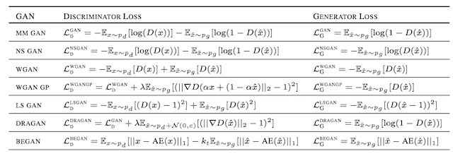

# 生成对抗性网络损失函数的温和介绍

> 原文：<https://machinelearningmastery.com/generative-adversarial-network-loss-functions/>

[生成对抗网络](https://machinelearningmastery.com/what-are-generative-adversarial-networks-gans/)，简称 GAN，是一种深度学习架构，用于训练图像合成的生成模型。

GAN 体系结构相对简单，尽管对初学者来说仍然具有挑战性的一个方面是 GAN 损耗函数。主要原因是该架构涉及两个模型的同时训练:生成器和鉴别器。

鉴别器模型像任何其他深度学习神经网络一样被更新，尽管生成器使用鉴别器作为损失函数，这意味着生成器的损失函数是隐式的，并且在训练期间被学习。

在这篇文章中，你将发现生成对抗网络的损失函数的介绍。

看完这篇文章，你会知道:

*   GAN 架构是用最小最大 GAN 损耗来定义的，尽管它通常使用非饱和损耗函数来实现。
*   现代 GANs 中常用的交替损失函数包括最小二乘法和 Wasserstein 损失函数。
*   当计算预算和模型超参数等其他因素保持不变时，GAN 损失函数的大规模评估表明差别不大。

**用我的新书[Python 生成对抗网络](https://machinelearningmastery.com/generative_adversarial_networks/)启动你的项目**，包括*分步教程*和所有示例的 *Python 源代码*文件。

我们开始吧。

生成对抗性网络损失功能简介
图片由[杨浩良](https://www.flickr.com/photos/yang117/34849567362/)提供，版权所有。

## 概观

本教程分为四个部分；它们是:

1.  GAN 损耗的挑战
2.  标准 GAN 损耗函数
3.  交替 GAN 损耗函数
4.  不同 GAN 损耗函数的影响

## GAN 损耗的挑战

生成对抗网络，简称 GAN，是一种深度学习架构，用于训练图像合成的生成模型。

事实证明，它们非常有效，在生成逼真的人脸、场景等方面取得了令人印象深刻的效果。

GAN 体系结构相对简单，尽管对初学者来说仍然具有挑战性的一个方面是 GAN 损耗函数。

GAN 架构由两个模型组成:鉴别器和生成器。鉴别器直接在真实和生成的图像上训练，并负责将图像分类为真实或虚假(生成的)。生成器不是直接训练的，而是通过鉴别器模型训练的。

具体来说，学习鉴别器来为发生器提供损耗函数。

这两个模型在两人游戏中竞争，同时对竞争的生成器和鉴别器模型进行改进。

我们通常寻求模型在训练数据集上的收敛，该收敛被观察为训练数据集上所选损失函数的最小化。在 GAN 中，收敛标志着两个玩家游戏的结束。相反，寻求发生器和鉴别器损耗之间的平衡。

我们将仔细研究用于训练发生器和鉴别器模型的官方 GAN 损耗函数，以及一些可以替代使用的替代流行损耗函数。

## 标准 GAN 损耗函数

伊恩·古德费勒等人在 2014 年的论文《生成对抗网络》中描述了 GAN 架构

该方法引入了两个损失函数:第一个被称为最小最大 GAN 损失，第二个被称为非饱和 GAN 损失。

### 鉴别器损耗

在两种方案下，鉴别器损耗是相同的。鉴别器试图最大化分配给真实和虚假图像的概率。

> 我们训练 D，以最大化为训练示例和来自 g 的样本分配正确标签的概率。

——[生成对抗网络](https://arxiv.org/abs/1406.2661)，2014。

从数学上来说，鉴别器寻求最大化真实图像的对数概率的平均值和伪造图像的反转概率的对数。

*   最大化对数 D(x) +对数(1–D(G(z)))

如果直接实现，这将需要使用随机上升而不是随机下降来改变模型权重。

它通常被实现为传统的二进制分类问题，对于生成的图像和真实的图像分别使用标签 0 和 1。

该模型适合寻求最小化平均值[二元交叉熵](https://machinelearningmastery.com/how-to-choose-loss-functions-when-training-deep-learning-neural-networks/)，也称为对数损失。

*   最小化 y _ true *-log(y _ predicted)+(1–y _ true)*-log(1–y _ predicted)

### 最小最大 GAN 损耗

极大极小 GAN 损失指的是鉴别器和发生器模型的极大极小同时优化。

[Minimax](https://en.wikipedia.org/wiki/Minimax) 是指两人回合游戏中的一种优化策略，目的是在对方最差的情况下，将损失或成本降到最低。

对于 GAN，发生器和鉴别器是两个玩家，轮流更新他们的模型权重。最小值和最大值是指发电机损耗最小化和鉴频器损耗最大化。

*   最小最大值(D，G)

如上所述，鉴别器寻求最大化真实图像的对数概率和伪造图像的逆概率的对数的平均值。

*   鉴别器:最大化对数 D(x) +对数(1–D(G(z)))

生成器寻求最小化由鉴别器预测的假图像的逆概率的对数。这具有鼓励生成器生成伪造概率低的样本的效果。

*   生成器:最小化对数(1–D(G(z)))

> 在这里，生成器学习生成伪造概率较低的样本。

——[GANs 生来平等吗？一项大型研究](https://arxiv.org/abs/1711.10337)，2018 年。

GAN 的这种损失框架被发现在作为极小极大博弈的模型分析中是有用的，但是在实践中，发现在实践中，发生器的这种损失函数饱和。

这意味着如果它不能像鉴别器一样快速学习，鉴别器就赢了，游戏就结束了，模型就不能得到有效的训练。

> 实际上，[损失函数]可能无法为 G 提供足够的梯度来学好。在学习初期，当 G 很差时，D 可以高自信地拒绝样本，因为它们与训练数据明显不同。

——[生成对抗网络](https://arxiv.org/abs/1406.2661)，2014。

### 非饱和 GAN 损耗

非饱和 GAN 损耗是对发生器损耗的修正，以克服饱和问题。

这是一个微妙的变化，涉及到生成器最大化生成图像的鉴别概率的对数，而不是最小化生成图像的反向鉴别概率的对数。

*   生成器:最大化对数(D(G(z)))

这是问题框架的变化。

在前面的例子中，生成器试图最小化图像被预测为假的概率。这里，生成器寻求最大化图像被预测为真实的概率。

> 为了改善梯度信号，作者还提出了非饱和损失，其中生成器的目标是最大化生成的样本是真实的概率。

——[GANs 生来平等吗？一项大型研究](https://arxiv.org/abs/1711.10337)，2018 年。

结果是当更新生成器的权重时更好的梯度信息和更稳定的训练过程。

> 这个目标函数导致 G 和 D 的动力学相同的不动点，但是在学习的早期提供更强的梯度。

——[生成对抗网络](https://arxiv.org/abs/1406.2661)，2014。

实际上，这也是作为二进制分类问题来实现的，就像鉴别器一样。我们可以翻转真假图像的标签，最小化交叉熵，而不是最大化损失。

> ……一种方法是继续对生成器使用交叉熵最小化。我们不是翻转鉴别器成本上的符号来获得生成器的成本，而是翻转用于构建交叉熵成本的目标。

——[NIPS 2016 教程:生成对抗网络](https://arxiv.org/abs/1701.00160)，2016。

## 交替 GAN 损耗函数

损失函数的选择是一个热门的研究课题，许多替代损失函数已经被提出和评估。

在许多 GAN 实现中使用的两种流行的交替损耗函数是最小二乘损耗和 Wasserstein 损耗。

### 最小二乘 GAN 损耗

最小二乘损失是由[毛旭东](https://xudongmao.github.io/)等人在他们 2016 年发表的题为“[最小二乘生成对抗网络](https://arxiv.org/abs/1611.04076)的论文中提出的

他们的方法是基于当生成的图像与真实图像非常不同时使用二进制交叉熵损失的局限性的观察，这可能导致非常小或消失的梯度，并且反过来，很少或没有更新模型。

> ……然而，当使用位于决策边界正确侧但仍远离真实数据的假样本更新生成器时，该损失函数将导致梯度消失的问题。

——[最小二乘生成对抗网络](https://arxiv.org/abs/1611.04076)，2016。

鉴别器寻求最小化真实和虚假图像的预测值和期望值之间的平方差。

*   鉴别器:最小化(d(x)–1)^2+(d(g(z)))^2

生成器试图最小化预测值和期望值之间的平方差总和，就像生成的图像是真实的一样。

*   发电机:最小化(d(g(z))–1)^2

在实践中，这包括分别保持假图像和真实图像的类别标签为 0 和 1，最小化最小二乘，也称为均方误差或 L2 损失。

*   l2 损失=总和(y _ 预测-y_true)^2)

最小二乘损失的好处是，它对较大的误差有更多的惩罚，从而导致较大的校正，而不是消失的梯度和没有模型更新。

> ……最小二乘损失函数能够将假样本移向决策边界，因为最小二乘损失函数会惩罚位于决策边界正确一侧很远的样本。

——[最小二乘生成对抗网络](https://arxiv.org/abs/1611.04076)，2016。

### Wasserstein 甘损失

Wasserstein 损失是由马丁·阿尔乔夫斯基等人在 2017 年发表的题为“Wasserstein 甘”的论文中提出的

Wasserstein 损失是由观察到的，即传统的遗传神经网络的动机是最小化真实和生成图像的实际和预测概率分布之间的距离，即所谓的库尔巴克-莱布勒散度或詹森-香农散度。

相反，他们建议在[地球推进器的距离](https://en.wikipedia.org/wiki/Earth_mover%27s_distance)上建模这个问题，也被称为 Wasserstein-1 距离。运土者的距离根据将一个分布(一堆土)转化为另一个分布的成本来计算两个概率分布之间的距离。

使用 Wasserstein 损失的遗传神经网络包括将鉴别器的概念改变为比发生器模型更新更频繁(例如五倍)的批评器。评论家用真实值而不是预测概率来给图像评分。它还要求模型权重保持较小，例如修剪为[-0.01，0.01]的超立方体。

计算分数，使得真实图像和伪造图像的分数之间的距离最大程度地分开。

损失函数可以通过计算真实图像和伪造图像的平均预测分数并将平均分数分别乘以 1 和-1 来实现。这具有将真实和虚假图像的分数分开的预期效果。

Wasserstein 损失的好处是，它几乎在任何地方都提供了一个有用的梯度，允许继续训练模型。这也意味着较低的 Wasserstein 损失与较好的发生器图像质量相关，这意味着我们明确寻求发生器损失最小化。

> 据我们所知，这是 GAN 文献中第一次显示出这样的性质，其中 GAN 的损失显示出收敛的性质。

——2017 年[一根筋](https://arxiv.org/abs/1701.07875)。

## 不同 GAN 损耗函数的影响

为了提高训练 GAN 模型的稳定性，已经开发和评估了许多损失函数。

最常见的是一般的非饱和损失，以及较大的和较新的 GAN 模型中的最小二乘和 Wasserstein 损失。

因此，对于给定的模型实现，人们对一个损失函数是否真的比另一个损失函数更好很感兴趣。

这个问题激发了马里奥·卢西克等人在 2018 年发表的题为《GANs 是平等的吗？一项大规模研究”

> 尽管非常丰富的研究活动导致了许多有趣的 GAN 算法，但仍然很难评估哪种算法比其他算法表现更好。我们对最先进的模型和评估方法进行了中立的、多方面的大规模实证研究。

——[GANs 生来平等吗？一项大型研究](https://arxiv.org/abs/1711.10337)，2018 年。

他们修正了模型的计算预算和超参数配置，并研究了一套七个损失函数。

这包括上述的极大极小损失、非饱和损失、Wasserstein 损失和最小二乘损失。这项研究还包括对 Wasserstein 减肥法的扩展，以去除被称为 Wasserstein 梯度惩罚减肥法(WGAN GP)的权重削减，以及另外两个方法，DRAGAN 和 BEGAN。

下表摘自论文，提供了鉴别器和发生器不同损耗函数的有用总结。

不同 GAN 损耗函数的总结。
摘自:甘斯生来平等吗？一项大规模研究。

使用一系列 GAN 评估指标对模型进行了系统评估，包括流行的 Frechet 初始距离(FID)。

令人惊讶的是，他们发现，当所有其他元素保持不变时，所有评估的损失函数的表现都大致相同。

> 我们对最先进的 GANs 进行了公平和全面的比较，并根据经验证明，在足够高的计算预算下，几乎所有 GANs 都能达到类似的 FID 值。

——[GANs 生来平等吗？一项大型研究](https://arxiv.org/abs/1711.10337)，2018 年。

这并不意味着损失的选择对于具体问题和型号配置无关紧要。

相反，结果表明，当模型的其他考虑因素(如计算预算和模型配置)保持不变时，损失函数选择的差异就会消失。

## 进一步阅读

如果您想更深入地了解这个主题，本节将提供更多资源。

### 报纸

*   [生成对抗网络](https://arxiv.org/abs/1406.2661)，2014。
*   [NIPS 2016 教程:生成对抗网络](https://arxiv.org/abs/1701.00160)，2016。
*   [最小二乘生成对抗网络](https://arxiv.org/abs/1611.04076)，2016。
*   [水的输入 gan](https://arxiv.org/abs/1701.07875)2017 年。
*   [Wasserstein 甘斯](https://arxiv.org/abs/1704.00028)改良训练，2017。
*   【GANs 生来平等吗？一项大型研究，2018 年。

### 文章

*   [Minimax，维基百科](https://en.wikipedia.org/wiki/Minimax)。
*   [地球移动者的距离，维基百科](https://en.wikipedia.org/wiki/Earth_mover%27s_distance)。

## 摘要

在这篇文章中，你发现了生成对抗网络损失函数的介绍。

具体来说，您了解到:

*   GAN 架构是用最小最大 GAN 损耗来定义的，尽管它通常使用非饱和损耗函数来实现。
*   现代 GANs 中常用的交替损失函数包括最小二乘法和 Wasserstein 损失函数。
*   当计算预算和模型超参数等其他因素保持不变时，GAN 损失函数的大规模评估表明差别不大。

你有什么问题吗？
在下面的评论中提问，我会尽力回答。