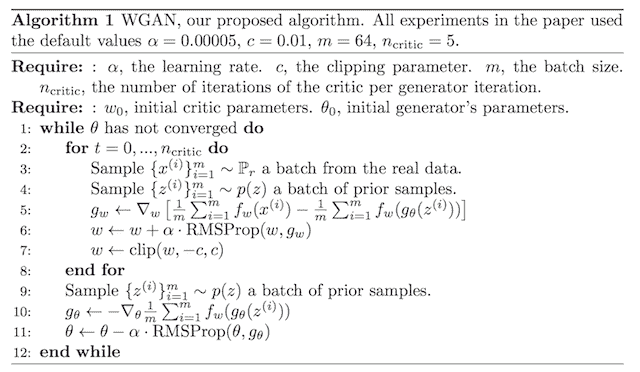
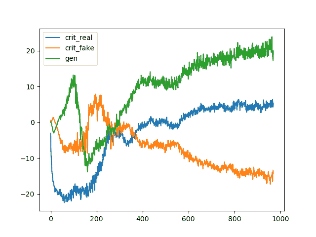
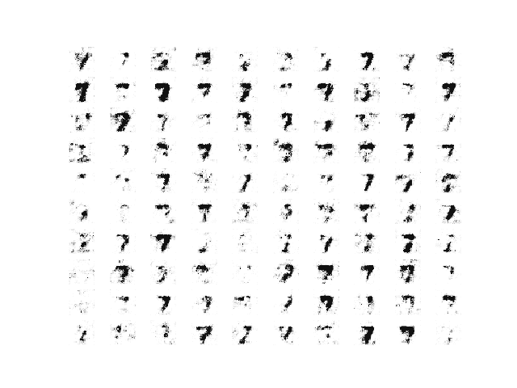
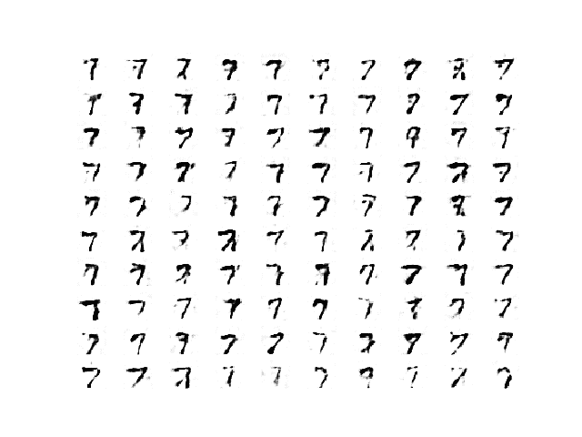

# 如何从零开始开发 Wasserstein 生成对抗网络

> 原文：<https://machinelearningmastery.com/how-to-code-a-wasserstein-generative-adversarial-network-wgan-from-scratch/>

最后更新于 2021 年 1 月 18 日

Wasserstein 生成对抗网络是生成对抗网络的扩展，既提高了训练模型时的稳定性，又提供了与生成图像质量相关的损失函数。

WGAN 的发展有一个密集的数学动机，尽管在实践中只需要对已建立的标准深度卷积生成对抗网络或 DCGAN 进行一些小的修改。

在本教程中，您将发现如何从零开始实现 Wasserstein 生成对抗网络。

完成本教程后，您将知道:

*   标准深度卷积 GAN 和新的 Wasserstein GAN 的区别。
*   如何从头实现 Wasserstein GAN 的具体细节。
*   如何开发用于图像生成的 WGAN 并解释模型的动态行为。

**用我的新书[Python 生成对抗网络](https://machinelearningmastery.com/generative_adversarial_networks/)启动你的项目**，包括*分步教程*和所有示例的 *Python 源代码*文件。

我们开始吧。

*   **2021 年 1 月更新**:更新所以层冻结用批量定额。


如何从零开始编码 Wasserstein 生成对抗网络
图片由[费利西亚诺·吉马雷斯](https://www.flickr.com/photos/40145521@N00/2316564611)提供，版权所有。

## 教程概述

本教程分为三个部分；它们是:

1.  Wasserstein 生成对抗网络
2.  Wasserstein GAN 实现细节
3.  如何训练 Wasserstein GAN 模型

## Wasserstein 生成对抗网络

Wasserstein 甘，简称 WGAN，是由 Martin Arjovsky 等人在 2017 年发表的论文《Wasserstein 甘》中介绍的

它是 GAN 的扩展，寻求一种训练生成器模型的替代方法，以更好地近似给定训练数据集中观察到的数据分布。

WGAN 不是使用鉴别器来分类或预测生成的图像是真的还是假的概率，而是改变鉴别器模型或用给定图像的真实性或假性评分的批评家来代替鉴别器模型。

这种变化是由一个理论论点驱动的，即训练生成器应该寻求最小化在训练数据集中观察到的数据分布和在生成的示例中观察到的分布之间的距离。

WGAN 的好处是训练过程更稳定，对模型架构和超参数配置的选择不太敏感。也许最重要的是，鉴别器的损失似乎与发生器产生的图像质量有关。

## Wasserstein GAN 实现细节

虽然 WGAN 的理论基础是密集的，但是 WGAN 的实现需要对标准的深度卷积 GAN 或 DCGAN 进行一些小的改变。

下图总结了训练 WGAN 的主要训练循环，摘自论文。请注意模型中使用的推荐超参数列表。



Wasserstein 生成对抗网络的算法。
取自:Wasserstein GAN。

工作组的实现差异如下:

1.  在批评模型的输出层使用线性激活函数(而不是 sigmoid)。
2.  对真实图像使用-1 标签，对假图像使用 1 标签(而不是 1 和 0)。
3.  用 Wasserstein 损失来训练批评家和发电机模型。
4.  每次小批量更新后，将关键模型权重限制在有限的范围内(例如[-0.01，0.01])。
5.  每次迭代更新批评模型的次数比生成器多(例如 5 次)。
6.  使用 RMSProp 版本的梯度下降，学习率小，没有动量(例如 0.00005)。

使用标准的 DCGAN 模型作为起点，让我们依次看一下这些实现细节。

### 1.临界输出层中的线性激活

DCGAN 使用鉴别器输出层的 sigmoid 激活函数来预测给定图像真实的可能性。

在 WGAN 中，评论家模型需要线性激活来预测给定图像的真实度分数。

这可以通过在批评模型的输出层中将“*激活*”参数设置为“*线性*”来实现。

```py
# define output layer of the critic model
...
model.add(Dense(1, activation='linear'))
```

线性激活是层的默认激活，因此我们可以不指定激活来获得相同的结果。

```py
# define output layer of the critic model
...
model.add(Dense(1))
```

### 2.真实和虚假图像的类别标签

DCGAN 对假图像使用类 0，对真图像使用类 1，这些类标签用于训练 GAN。

在 DCGAN 中，这些是鉴别器期望达到的精确标签。WGAN 没有给这位评论家贴上精确的标签。相反，它鼓励评论家输出真实和虚假图像的不同分数。

这是通过 Wasserstein 函数实现的，该函数巧妙地利用了正负类标签。

可以实现 WGAN，其中-1 类标签用于真实图像，而+1 类标签用于伪造或生成的图像。

这可以使用[one()NumPy 功能](https://docs.scipy.org/doc/numpy/reference/generated/numpy.ones.html)来实现。

例如:

```py
...
# generate class labels, -1 for 'real'
y = -ones((n_samples, 1))
...
# create class labels with 1.0 for 'fake'
y = ones((n_samples, 1))
```

### 3.Wasserstein 损失函数

DCGAN 将鉴别器训练为二分类模型，以预测给定图像真实的概率。

为了训练该模型，使用二元交叉熵损失函数优化鉴别器。相同的损失函数用于更新发电机模型。

WGAN 模型的主要贡献是使用了一个新的损失函数，该函数鼓励鉴别器预测给定输入的真假分数。这将鉴别器的角色从分类器转变为对图像的真实性或虚假性进行评分的批评家，其中评分之间的差异尽可能大。

我们可以在 Keras 中将 Wasserstein 损失实现为一个自定义函数，该函数计算真实或虚假图像的平均分数。

真实例子的得分是最大的，虚假例子的得分是最小的。假设随机梯度下降是一种最小化算法，我们可以将类别标签乘以平均分数(例如-1 表示真实，1 表示虚假，无效)，这确保了真实和虚假图像对网络的损失最小化。

下面列出了 Keras 的这种损失函数的有效实现。

```py
from keras import backend

# implementation of wasserstein loss
def wasserstein_loss(y_true, y_pred):
	return backend.mean(y_true * y_pred)
```

通过在编译模型时指定函数名，该损失函数可用于训练 Keras 模型。

例如:

```py
...
# compile the model
model.compile(loss=wasserstein_loss, ...)
```

### 4.评论家权重剪辑

DCGAN 不使用任何梯度剪裁，尽管 WGAN 要求对批评模型进行梯度剪裁。

我们可以实现权重裁剪作为 Keras 约束。

这是一个必须扩展*约束*类的类，并定义用于应用操作的 *__call__()* 函数和用于返回任何配置的 *get_config()* 函数的实现。

我们还可以定义 *__init__()* 函数来设置配置，在这种情况下，权重超立方体的边界框的对称大小，例如 0.01。

下面定义了*剪辑约束*类。

```py
# clip model weights to a given hypercube
class ClipConstraint(Constraint):
	# set clip value when initialized
	def __init__(self, clip_value):
		self.clip_value = clip_value

	# clip model weights to hypercube
	def __call__(self, weights):
		return backend.clip(weights, -self.clip_value, self.clip_value)

	# get the config
	def get_config(self):
		return {'clip_value': self.clip_value}
```

要使用约束，可以构造类，然后通过设置 *kernel_constraint* 参数在层中使用；例如:

```py
...
# define the constraint
const = ClipConstraint(0.01)
...
# use the constraint in a layer
model.add(Conv2D(..., kernel_constraint=const))
```

该约束仅在更新批评模型时需要。

### 5.更新评论多于生成器

在 DCGAN 中，生成器和鉴别器模型必须等量更新。

具体来说，鉴别器在每次迭代中用半批真实样本和半批假样本更新，而生成器用单批生成的样本更新。

例如:

```py
...
# main gan training loop
for i in range(n_steps):

	# update the discriminator

	# get randomly selected 'real' samples
	X_real, y_real = generate_real_samples(dataset, half_batch)
	# update critic model weights
	c_loss1 = c_model.train_on_batch(X_real, y_real)
	# generate 'fake' examples
	X_fake, y_fake = generate_fake_samples(g_model, latent_dim, half_batch)
	# update critic model weights
	c_loss2 = c_model.train_on_batch(X_fake, y_fake)

	# update generator

	# prepare points in latent space as input for the generator
	X_gan = generate_latent_points(latent_dim, n_batch)
	# create inverted labels for the fake samples
	y_gan = ones((n_batch, 1))
	# update the generator via the critic's error
	g_loss = gan_model.train_on_batch(X_gan, y_gan)
```

在 WGAN 模型中，批评者模型必须比生成器模型更新得更多。

具体来说，定义了一个新的超参数来控制生成器模型的每次更新都更新评论的次数，称为 n _ criteria，并将其设置为 5。

这可以作为主 GAN 更新循环内的新循环来实现；例如:

```py
...
# main gan training loop
for i in range(n_steps):

	# update the critic
	for _ in range(n_critic):
		# get randomly selected 'real' samples
		X_real, y_real = generate_real_samples(dataset, half_batch)
		# update critic model weights
		c_loss1 = c_model.train_on_batch(X_real, y_real)
		# generate 'fake' examples
		X_fake, y_fake = generate_fake_samples(g_model, latent_dim, half_batch)
		# update critic model weights
		c_loss2 = c_model.train_on_batch(X_fake, y_fake)

	# update generator

	# prepare points in latent space as input for the generator
	X_gan = generate_latent_points(latent_dim, n_batch)
	# create inverted labels for the fake samples
	y_gan = ones((n_batch, 1))
	# update the generator via the critic's error
	g_loss = gan_model.train_on_batch(X_gan, y_gan)
```

### 6.使用随机梯度下降

DCGAN 使用 [Adam 版本的随机梯度下降](https://machinelearningmastery.com/adam-optimization-algorithm-for-deep-learning/)，学习率小，动量适中。

WGAN 推荐使用 [RMSProp 代替](https://machinelearningmastery.com/understand-the-dynamics-of-learning-rate-on-deep-learning-neural-networks/)，学习率小 0.00005。

这可以在编译模型时在 Keras 中实现。例如:

```py
...
# compile model
opt = RMSprop(lr=0.00005)
model.compile(loss=wasserstein_loss, optimizer=opt)
```

## 如何训练 Wasserstein GAN 模型

现在我们知道了 WGAN 的具体实现细节，就可以实现图像生成的模型了。

在本节中，我们将开发一个 WGAN，从 [MNIST 数据集](https://machinelearningmastery.com/how-to-develop-a-cnn-from-scratch-for-fashion-mnist-clothing-classification/)生成一个手写数字(‘7’)。对于 WGAN 来说，这是一个很好的测试问题，因为它是一个小数据集，需要一个简单的模式来快速训练。

第一步是定义模型。

批评模型将一幅 28×28 的灰度图像作为输入，并输出图像真实度或虚假度的分数。它被实现为一个适度的卷积神经网络，使用 DCGAN 设计的最佳实践，例如使用斜率为 0.2 的 [LeakyReLU 激活函数](https://machinelearningmastery.com/rectified-linear-activation-function-for-deep-learning-neural-networks/)、[批量归一化](https://machinelearningmastery.com/how-to-accelerate-learning-of-deep-neural-networks-with-batch-normalization/)，以及使用 [2×2 步距来下采样](https://machinelearningmastery.com/padding-and-stride-for-convolutional-neural-networks/)。

批评模型利用新的 ClipConstraint 权重约束在小批量更新后裁剪模型权重，并使用自定义 *wasserstein_loss()* 函数进行优化，该函数是随机梯度下降的 RMSProp 版本，学习率为 0.00005。

下面的*define _ critical()*函数实现了这一点，定义和编译了 critical 模型并返回。图像的输入形状被参数化为默认函数参数，以使其清晰。

```py
# define the standalone critic model
def define_critic(in_shape=(28,28,1)):
	# weight initialization
	init = RandomNormal(stddev=0.02)
	# weight constraint
	const = ClipConstraint(0.01)
	# define model
	model = Sequential()
	# downsample to 14x14
	model.add(Conv2D(64, (4,4), strides=(2,2), padding='same', kernel_initializer=init, kernel_constraint=const, input_shape=in_shape))
	model.add(BatchNormalization())
	model.add(LeakyReLU(alpha=0.2))
	# downsample to 7x7
	model.add(Conv2D(64, (4,4), strides=(2,2), padding='same', kernel_initializer=init, kernel_constraint=const))
	model.add(BatchNormalization())
	model.add(LeakyReLU(alpha=0.2))
	# scoring, linear activation
	model.add(Flatten())
	model.add(Dense(1))
	# compile model
	opt = RMSprop(lr=0.00005)
	model.compile(loss=wasserstein_loss, optimizer=opt)
	return model
```

生成器模型将潜在空间中的一个点作为输入，并输出单个 28×28 灰度图像。

这是通过使用完全连接的层来解释潜在空间中的点并提供足够的激活来实现的，这些激活可以被重新成形为输出图像的低分辨率版本(例如 7×7)的许多副本(在这种情况下，128 个)。然后对其进行两次上采样，每次使用转置卷积层，将激活区域的大小增加一倍，面积增加四倍。

该模型使用了最佳实践，例如 LeakyReLU 激活、作为步长因子的内核大小以及输出层中的双曲正切(tanh)激活函数。

下面的 *define_generator()* 函数定义了生成器模型，但由于没有直接训练，所以故意不编译，然后返回模型。潜在空间的大小被参数化为函数参数。

```py
# define the standalone generator model
def define_generator(latent_dim):
	# weight initialization
	init = RandomNormal(stddev=0.02)
	# define model
	model = Sequential()
	# foundation for 7x7 image
	n_nodes = 128 * 7 * 7
	model.add(Dense(n_nodes, kernel_initializer=init, input_dim=latent_dim))
	model.add(LeakyReLU(alpha=0.2))
	model.add(Reshape((7, 7, 128)))
	# upsample to 14x14
	model.add(Conv2DTranspose(128, (4,4), strides=(2,2), padding='same', kernel_initializer=init))
	model.add(BatchNormalization())
	model.add(LeakyReLU(alpha=0.2))
	# upsample to 28x28
	model.add(Conv2DTranspose(128, (4,4), strides=(2,2), padding='same', kernel_initializer=init))
	model.add(BatchNormalization())
	model.add(LeakyReLU(alpha=0.2))
	# output 28x28x1
	model.add(Conv2D(1, (7,7), activation='tanh', padding='same', kernel_initializer=init))
	return model
```

接下来，可以定义一个 GAN 模型，它将生成器模型和批评家模型组合成一个更大的模型。

这个较大的模型将用于训练生成器中的模型权重，使用由批评模型计算的输出和误差。批评模型是单独训练的，因此，在这个更大的 GAN 模型中，模型权重被标记为不可训练，以确保只有生成器模型的权重被更新。批评家权重的可训练性的这种改变仅在训练组合的 GAN 模型时有效，而在单独训练批评家时无效。

这个更大的 GAN 模型将潜在空间中的一个点作为输入，使用生成器模型来生成图像，该图像作为输入被馈送到批评者模型，然后输出被评分为真或假。使用带有自定义 *wasserstein_loss()* 函数的 RMSProp 拟合模型。

下面的 *define_gan()* 函数实现了这一点，将已经定义的生成器和评论模型作为输入。

```py
# define the combined generator and critic model, for updating the generator
def define_gan(generator, critic):
	# make weights in the critic not trainable
	for layer in critic.layers:
		if not isinstance(layer, BatchNormalization):
			layer.trainable = False
	# connect them
	model = Sequential()
	# add generator
	model.add(generator)
	# add the critic
	model.add(critic)
	# compile model
	opt = RMSprop(lr=0.00005)
	model.compile(loss=wasserstein_loss, optimizer=opt)
	return model
```

现在我们已经定义了 GAN 模型，我们需要对它进行训练。但是，在我们训练模型之前，我们需要输入数据。

第一步是加载并[缩放 MNIST 数据集](https://machinelearningmastery.com/how-to-manually-scale-image-pixel-data-for-deep-learning/)。通过调用 *load_data()* Keras 函数加载整个数据集，然后选择属于类别 7 的图像子集(大约 5000 个)，例如数字 7 的手写描述。然后，像素值必须缩放到范围[-1，1]以匹配生成器模型的输出。

下面的 *load_real_samples()* 函数实现了这一点，返回 MNIST 训练数据集的加载和缩放子集，为建模做好准备。

```py
# load images
def load_real_samples():
	# load dataset
	(trainX, trainy), (_, _) = load_data()
	# select all of the examples for a given class
	selected_ix = trainy == 7
	X = trainX[selected_ix]
	# expand to 3d, e.g. add channels
	X = expand_dims(X, axis=-1)
	# convert from ints to floats
	X = X.astype('float32')
	# scale from [0,255] to [-1,1]
	X = (X - 127.5) / 127.5
	return X
```

我们将需要数据集的一批(或半批)真实图像来更新 GAN 模型。实现这一点的简单方法是每次从数据集中选择图像的[随机样本](https://machinelearningmastery.com/how-to-generate-random-numbers-in-python/)。

下面的 *generate_real_samples()* 函数实现了这一点，以准备好的数据集为自变量，为评论家选择并返回一个图像的随机样本及其对应的标签，具体为 target=-1 表示它们是真实图像。

```py
# select real samples
def generate_real_samples(dataset, n_samples):
	# choose random instances
	ix = randint(0, dataset.shape[0], n_samples)
	# select images
	X = dataset[ix]
	# generate class labels, -1 for 'real'
	y = -ones((n_samples, 1))
	return X, y
```

接下来，我们需要发电机模型的输入。这些是来自潜在空间的随机点，具体为[高斯分布随机变量](https://machinelearningmastery.com/how-to-generate-random-numbers-in-python/)。

*generate _ 潜伏 _points()* 函数实现了这一点，将潜伏空间的大小作为自变量和所需的点数，作为生成器模型的一批输入样本返回。

```py
# generate points in latent space as input for the generator
def generate_latent_points(latent_dim, n_samples):
	# generate points in the latent space
	x_input = randn(latent_dim * n_samples)
	# reshape into a batch of inputs for the network
	x_input = x_input.reshape(n_samples, latent_dim)
	return x_input
```

接下来，我们需要使用潜在空间中的点作为生成器的输入，以便生成新的图像。

下面的 *generate_fake_samples()* 函数实现了这一点，将生成器模型和潜在空间的大小作为参数，然后在潜在空间中生成点，并将其用作生成器模型的输入。

该函数返回生成的图像及其对应的评论家模型标签，具体来说，target=1 表示它们是伪造的或生成的。

```py
# use the generator to generate n fake examples, with class labels
def generate_fake_samples(generator, latent_dim, n_samples):
	# generate points in latent space
	x_input = generate_latent_points(latent_dim, n_samples)
	# predict outputs
	X = generator.predict(x_input)
	# create class labels with 1.0 for 'fake'
	y = ones((n_samples, 1))
	return X, y
```

我们需要记录模型的表现。也许评估 GAN 表现最可靠的方法是使用生成器生成图像，然后对其进行审查和主观评估。

下面的*summary _ performance()*函数在训练过程中获取给定点的生成器模型，并使用它在 10×10 的网格中生成 100 个图像，然后绘制并保存到文件中。这个模型现在也保存到文件中，以防我们以后想用它来生成更多的图像。

```py
# generate samples and save as a plot and save the model
def summarize_performance(step, g_model, latent_dim, n_samples=100):
	# prepare fake examples
	X, _ = generate_fake_samples(g_model, latent_dim, n_samples)
	# scale from [-1,1] to [0,1]
	X = (X + 1) / 2.0
	# plot images
	for i in range(10 * 10):
		# define subplot
		pyplot.subplot(10, 10, 1 + i)
		# turn off axis
		pyplot.axis('off')
		# plot raw pixel data
		pyplot.imshow(X[i, :, :, 0], cmap='gray_r')
	# save plot to file
	filename1 = 'generated_plot_%04d.png' % (step+1)
	pyplot.savefig(filename1)
	pyplot.close()
	# save the generator model
	filename2 = 'model_%04d.h5' % (step+1)
	g_model.save(filename2)
	print('>Saved: %s and %s' % (filename1, filename2))
```

除了图像质量，跟踪模型随时间的损失和准确性也是一个好主意。

对于每个模型更新，可以跟踪真实和虚假样本的批评者的损失，对于每个更新，生成器的损失也是如此。然后，这些数据可用于在训练结束时创建损失线图。下面的 *plot_history()* 函数实现了这一点，并将结果保存到文件中。

```py
# create a line plot of loss for the gan and save to file
def plot_history(d1_hist, d2_hist, g_hist):
	# plot history
	pyplot.plot(d1_hist, label='crit_real')
	pyplot.plot(d2_hist, label='crit_fake')
	pyplot.plot(g_hist, label='gen')
	pyplot.legend()
	pyplot.savefig('plot_line_plot_loss.png')
	pyplot.close()
```

我们现在已经准备好适应 GAN 模型。

该模型适用于 10 个训练时期，这是任意的，因为该模型可能在最初的几个时期之后开始生成似是而非的数字 7。使用 64 个样本的批次大小，并且每个训练时期涉及 6，265/64，或大约 97 个批次的真实和虚假样本以及对模型的更新。因此，模型被训练了 97 个批次的 10 个时期，或者 970 次迭代。

首先，对半批真实样本更新评论家模型，然后对半批假样本进行更新，一起形成一批权重更新。然后根据 WGAN 算法的要求，重复*n _ critical*(5)次。

然后通过复合 GAN 模型更新发生器。重要的是，对于生成的样本，目标标签被设置为-1 或实数。这具有更新生成器以更好地生成下一批真实样本的效果。

下面的 *train()* 函数实现了这一点，将定义的模型、数据集和潜在维度的大小作为参数，并使用默认参数参数化纪元的数量和批处理大小。发电机模型在训练结束时保存。

在每次迭代中都会报告批评模型和生成器模型的表现。样本图像在每个时期生成并保存，模型表现的线图在运行结束时创建并保存。

```py
# train the generator and critic
def train(g_model, c_model, gan_model, dataset, latent_dim, n_epochs=10, n_batch=64, n_critic=5):
	# calculate the number of batches per training epoch
	bat_per_epo = int(dataset.shape[0] / n_batch)
	# calculate the number of training iterations
	n_steps = bat_per_epo * n_epochs
	# calculate the size of half a batch of samples
	half_batch = int(n_batch / 2)
	# lists for keeping track of loss
	c1_hist, c2_hist, g_hist = list(), list(), list()
	# manually enumerate epochs
	for i in range(n_steps):
		# update the critic more than the generator
		c1_tmp, c2_tmp = list(), list()
		for _ in range(n_critic):
			# get randomly selected 'real' samples
			X_real, y_real = generate_real_samples(dataset, half_batch)
			# update critic model weights
			c_loss1 = c_model.train_on_batch(X_real, y_real)
			c1_tmp.append(c_loss1)
			# generate 'fake' examples
			X_fake, y_fake = generate_fake_samples(g_model, latent_dim, half_batch)
			# update critic model weights
			c_loss2 = c_model.train_on_batch(X_fake, y_fake)
			c2_tmp.append(c_loss2)
		# store critic loss
		c1_hist.append(mean(c1_tmp))
		c2_hist.append(mean(c2_tmp))
		# prepare points in latent space as input for the generator
		X_gan = generate_latent_points(latent_dim, n_batch)
		# create inverted labels for the fake samples
		y_gan = -ones((n_batch, 1))
		# update the generator via the critic's error
		g_loss = gan_model.train_on_batch(X_gan, y_gan)
		g_hist.append(g_loss)
		# summarize loss on this batch
		print('>%d, c1=%.3f, c2=%.3f g=%.3f' % (i+1, c1_hist[-1], c2_hist[-1], g_loss))
		# evaluate the model performance every 'epoch'
		if (i+1) % bat_per_epo == 0:
			summarize_performance(i, g_model, latent_dim)
	# line plots of loss
	plot_history(c1_hist, c2_hist, g_hist)
```

既然已经定义了所有的函数，我们就可以创建模型，加载数据集，并开始训练过程。

```py
# size of the latent space
latent_dim = 50
# create the critic
critic = define_critic()
# create the generator
generator = define_generator(latent_dim)
# create the gan
gan_model = define_gan(generator, critic)
# load image data
dataset = load_real_samples()
print(dataset.shape)
# train model
train(generator, critic, gan_model, dataset, latent_dim)
```

将所有这些结合在一起，下面列出了完整的示例。

```py
# example of a wgan for generating handwritten digits
from numpy import expand_dims
from numpy import mean
from numpy import ones
from numpy.random import randn
from numpy.random import randint
from keras.datasets.mnist import load_data
from keras import backend
from keras.optimizers import RMSprop
from keras.models import Sequential
from keras.layers import Dense
from keras.layers import Reshape
from keras.layers import Flatten
from keras.layers import Conv2D
from keras.layers import Conv2DTranspose
from keras.layers import LeakyReLU
from keras.layers import BatchNormalization
from keras.initializers import RandomNormal
from keras.constraints import Constraint
from matplotlib import pyplot

# clip model weights to a given hypercube
class ClipConstraint(Constraint):
	# set clip value when initialized
	def __init__(self, clip_value):
		self.clip_value = clip_value

	# clip model weights to hypercube
	def __call__(self, weights):
		return backend.clip(weights, -self.clip_value, self.clip_value)

	# get the config
	def get_config(self):
		return {'clip_value': self.clip_value}

# calculate wasserstein loss
def wasserstein_loss(y_true, y_pred):
	return backend.mean(y_true * y_pred)

# define the standalone critic model
def define_critic(in_shape=(28,28,1)):
	# weight initialization
	init = RandomNormal(stddev=0.02)
	# weight constraint
	const = ClipConstraint(0.01)
	# define model
	model = Sequential()
	# downsample to 14x14
	model.add(Conv2D(64, (4,4), strides=(2,2), padding='same', kernel_initializer=init, kernel_constraint=const, input_shape=in_shape))
	model.add(BatchNormalization())
	model.add(LeakyReLU(alpha=0.2))
	# downsample to 7x7
	model.add(Conv2D(64, (4,4), strides=(2,2), padding='same', kernel_initializer=init, kernel_constraint=const))
	model.add(BatchNormalization())
	model.add(LeakyReLU(alpha=0.2))
	# scoring, linear activation
	model.add(Flatten())
	model.add(Dense(1))
	# compile model
	opt = RMSprop(lr=0.00005)
	model.compile(loss=wasserstein_loss, optimizer=opt)
	return model

# define the standalone generator model
def define_generator(latent_dim):
	# weight initialization
	init = RandomNormal(stddev=0.02)
	# define model
	model = Sequential()
	# foundation for 7x7 image
	n_nodes = 128 * 7 * 7
	model.add(Dense(n_nodes, kernel_initializer=init, input_dim=latent_dim))
	model.add(LeakyReLU(alpha=0.2))
	model.add(Reshape((7, 7, 128)))
	# upsample to 14x14
	model.add(Conv2DTranspose(128, (4,4), strides=(2,2), padding='same', kernel_initializer=init))
	model.add(BatchNormalization())
	model.add(LeakyReLU(alpha=0.2))
	# upsample to 28x28
	model.add(Conv2DTranspose(128, (4,4), strides=(2,2), padding='same', kernel_initializer=init))
	model.add(BatchNormalization())
	model.add(LeakyReLU(alpha=0.2))
	# output 28x28x1
	model.add(Conv2D(1, (7,7), activation='tanh', padding='same', kernel_initializer=init))
	return model

# define the combined generator and critic model, for updating the generator
def define_gan(generator, critic):
	# make weights in the critic not trainable
	for layer in critic.layers:
		if not isinstance(layer, BatchNormalization):
			layer.trainable = False
	# connect them
	model = Sequential()
	# add generator
	model.add(generator)
	# add the critic
	model.add(critic)
	# compile model
	opt = RMSprop(lr=0.00005)
	model.compile(loss=wasserstein_loss, optimizer=opt)
	return model

# load images
def load_real_samples():
	# load dataset
	(trainX, trainy), (_, _) = load_data()
	# select all of the examples for a given class
	selected_ix = trainy == 7
	X = trainX[selected_ix]
	# expand to 3d, e.g. add channels
	X = expand_dims(X, axis=-1)
	# convert from ints to floats
	X = X.astype('float32')
	# scale from [0,255] to [-1,1]
	X = (X - 127.5) / 127.5
	return X

# select real samples
def generate_real_samples(dataset, n_samples):
	# choose random instances
	ix = randint(0, dataset.shape[0], n_samples)
	# select images
	X = dataset[ix]
	# generate class labels, -1 for 'real'
	y = -ones((n_samples, 1))
	return X, y

# generate points in latent space as input for the generator
def generate_latent_points(latent_dim, n_samples):
	# generate points in the latent space
	x_input = randn(latent_dim * n_samples)
	# reshape into a batch of inputs for the network
	x_input = x_input.reshape(n_samples, latent_dim)
	return x_input

# use the generator to generate n fake examples, with class labels
def generate_fake_samples(generator, latent_dim, n_samples):
	# generate points in latent space
	x_input = generate_latent_points(latent_dim, n_samples)
	# predict outputs
	X = generator.predict(x_input)
	# create class labels with 1.0 for 'fake'
	y = ones((n_samples, 1))
	return X, y

# generate samples and save as a plot and save the model
def summarize_performance(step, g_model, latent_dim, n_samples=100):
	# prepare fake examples
	X, _ = generate_fake_samples(g_model, latent_dim, n_samples)
	# scale from [-1,1] to [0,1]
	X = (X + 1) / 2.0
	# plot images
	for i in range(10 * 10):
		# define subplot
		pyplot.subplot(10, 10, 1 + i)
		# turn off axis
		pyplot.axis('off')
		# plot raw pixel data
		pyplot.imshow(X[i, :, :, 0], cmap='gray_r')
	# save plot to file
	filename1 = 'generated_plot_%04d.png' % (step+1)
	pyplot.savefig(filename1)
	pyplot.close()
	# save the generator model
	filename2 = 'model_%04d.h5' % (step+1)
	g_model.save(filename2)
	print('>Saved: %s and %s' % (filename1, filename2))

# create a line plot of loss for the gan and save to file
def plot_history(d1_hist, d2_hist, g_hist):
	# plot history
	pyplot.plot(d1_hist, label='crit_real')
	pyplot.plot(d2_hist, label='crit_fake')
	pyplot.plot(g_hist, label='gen')
	pyplot.legend()
	pyplot.savefig('plot_line_plot_loss.png')
	pyplot.close()

# train the generator and critic
def train(g_model, c_model, gan_model, dataset, latent_dim, n_epochs=10, n_batch=64, n_critic=5):
	# calculate the number of batches per training epoch
	bat_per_epo = int(dataset.shape[0] / n_batch)
	# calculate the number of training iterations
	n_steps = bat_per_epo * n_epochs
	# calculate the size of half a batch of samples
	half_batch = int(n_batch / 2)
	# lists for keeping track of loss
	c1_hist, c2_hist, g_hist = list(), list(), list()
	# manually enumerate epochs
	for i in range(n_steps):
		# update the critic more than the generator
		c1_tmp, c2_tmp = list(), list()
		for _ in range(n_critic):
			# get randomly selected 'real' samples
			X_real, y_real = generate_real_samples(dataset, half_batch)
			# update critic model weights
			c_loss1 = c_model.train_on_batch(X_real, y_real)
			c1_tmp.append(c_loss1)
			# generate 'fake' examples
			X_fake, y_fake = generate_fake_samples(g_model, latent_dim, half_batch)
			# update critic model weights
			c_loss2 = c_model.train_on_batch(X_fake, y_fake)
			c2_tmp.append(c_loss2)
		# store critic loss
		c1_hist.append(mean(c1_tmp))
		c2_hist.append(mean(c2_tmp))
		# prepare points in latent space as input for the generator
		X_gan = generate_latent_points(latent_dim, n_batch)
		# create inverted labels for the fake samples
		y_gan = -ones((n_batch, 1))
		# update the generator via the critic's error
		g_loss = gan_model.train_on_batch(X_gan, y_gan)
		g_hist.append(g_loss)
		# summarize loss on this batch
		print('>%d, c1=%.3f, c2=%.3f g=%.3f' % (i+1, c1_hist[-1], c2_hist[-1], g_loss))
		# evaluate the model performance every 'epoch'
		if (i+1) % bat_per_epo == 0:
			summarize_performance(i, g_model, latent_dim)
	# line plots of loss
	plot_history(c1_hist, c2_hist, g_hist)

# size of the latent space
latent_dim = 50
# create the critic
critic = define_critic()
# create the generator
generator = define_generator(latent_dim)
# create the gan
gan_model = define_gan(generator, critic)
# load image data
dataset = load_real_samples()
print(dataset.shape)
# train model
train(generator, critic, gan_model, dataset, latent_dim)
```

运行这个例子很快，在没有图形处理器的现代硬件上大约需要 10 分钟。

**注**:考虑到算法或评估程序的随机性，或数值准确率的差异，您的[结果可能会有所不同](https://machinelearningmastery.com/different-results-each-time-in-machine-learning/)。考虑运行该示例几次，并比较平均结果。

首先，在训练循环的每次迭代中，都会向控制台报告批评模型和生成器模型的丢失。具体来说，c1 是真实例子中的批评者的损失，c2 是生成样本中的批评者的损失，g 是通过批评者训练的生成器的损失。

c1 分数作为损失函数的一部分被反转；这意味着如果他们被报告为阴性，那么他们真的是阳性，如果他们被报告为阳性，那么他们真的是阴性。c2 分数的符号不变。

回想一下，Wasserstein 的损失是为了寻找真实和虚假的分数，而真实和虚假的分数在训练中会有所不同。我们可以在运行接近结束时看到这一点，例如最后一个时期，真实示例的 *c1* 损失为 5.338(真的-5.338)，而虚假示例的 *c2* 损失为-14.260，这种大约 10 个单位的分离至少在之前的几次迭代中是一致的。

我们还可以看到，在这种情况下，模型将发电机的损失评分为 20 分左右。同样，回想一下，我们通过批评模型更新生成器，并将生成的示例视为真实的，目标为-1，因此分数可以解释为-20 左右的值，接近假样本的损失。

```py
...
>961, c1=5.110, c2=-15.388 g=19.579
>962, c1=6.116, c2=-15.222 g=20.054
>963, c1=4.982, c2=-15.192 g=21.048
>964, c1=4.238, c2=-14.689 g=23.911
>965, c1=5.585, c2=-14.126 g=19.578
>966, c1=4.807, c2=-14.755 g=20.034
>967, c1=6.307, c2=-16.538 g=19.572
>968, c1=4.298, c2=-14.178 g=17.956
>969, c1=4.283, c2=-13.398 g=17.326
>970, c1=5.338, c2=-14.260 g=19.927
```

在运行结束时，创建并保存损失的线图。

该图显示了批评者在真实样本上的损失(蓝色)、批评者在虚假样本上的损失(橙色)以及批评者在用虚假样本更新生成器时的损失(绿色)。

在回顾 WGAN 的[学习曲线](https://machinelearningmastery.com/learning-curves-for-diagnosing-machine-learning-model-performance/)时，有一个重要的因素，那就是趋势。

WGAN 的好处是损耗与生成的图像质量相关。对于稳定的训练过程来说，较低的损失意味着更好的图像质量。

在这种情况下，较低的损失具体是指评论家报告的生成图像的较低的 Wasserstein 损失(橙色线)。这种损失的标志不会被目标标签反转(例如，目标标签为+1.0)，因此，随着生成的模型的图像质量的提高，表现良好的 WGAN 应该会显示这条线向下的趋势。



Wasserstein 生成对抗网络的损失和准确率线图

在这种情况下，更多的训练似乎会产生质量更好的图像，主要障碍出现在 200-300 年左右，之后模型的质量仍然很好。

在这个障碍之前和周围，图像质量很差；例如:



100 张由 Wasserstein GAN 手写数字 7 在纪元 97 生成的图像样本。

在这个时代之后，WGAN 继续生成看似可信的手写数字。



100 个样本的手写数字 7 在纪元 970 从 Wasserstein 甘生成的图像。

## 进一步阅读

如果您想更深入地了解这个主题，本节将提供更多资源。

### 报纸

*   [水的输入 gan](https://arxiv.org/abs/1701.07875)2017 年。
*   [Wasserstein 甘斯](https://arxiv.org/abs/1704.00028)改良训练，2017。

### 应用程序接口

*   [硬数据集 API](https://keras.io/datasets/) .
*   [Keras 顺序模型 API](https://keras.io/models/sequential/)
*   [Keras 卷积层应用编程接口](https://keras.io/layers/convolutional/)
*   [如何“冻结”Keras 层？](https://keras.io/getting-started/faq/#how-can-i-freeze-keras-layers)
*   [MatplotLib API](https://matplotlib.org/api/)
*   [NumPy 随机采样(numpy.random) API](https://docs.scipy.org/doc/numpy/reference/routines.random.html)
*   [NumPy 数组操作例程](https://docs.scipy.org/doc/numpy/reference/routines.array-manipulation.html)

### 文章

*   [进水，GitHub](https://github.com/martinarjovsky/WassersteinGAN) 。
*   [Wasserstein 生成对抗网络(WGANS)项目，GitHub](https://github.com/kpandey008/wasserstein-gans) 。
*   [Keras-GAN:生成对抗网络的 Keras 实现，GitHub](https://github.com/eriklindernoren/Keras-GAN) 。
*   [改良 WGAN，keras-contrib 项目，GitHub。](https://github.com/keras-team/keras-contrib/blob/master/examples/improved_wgan.py)

## 摘要

在本教程中，您发现了如何从零开始实现 Wasserstein 生成对抗网络。

具体来说，您了解到:

*   标准深度卷积 GAN 和新的 Wasserstein GAN 的区别。
*   如何从头实现 Wasserstein GAN 的具体细节。
*   如何开发用于图像生成的 WGAN 并解释模型的动态行为。

你有什么问题吗？
在下面的评论中提问，我会尽力回答。