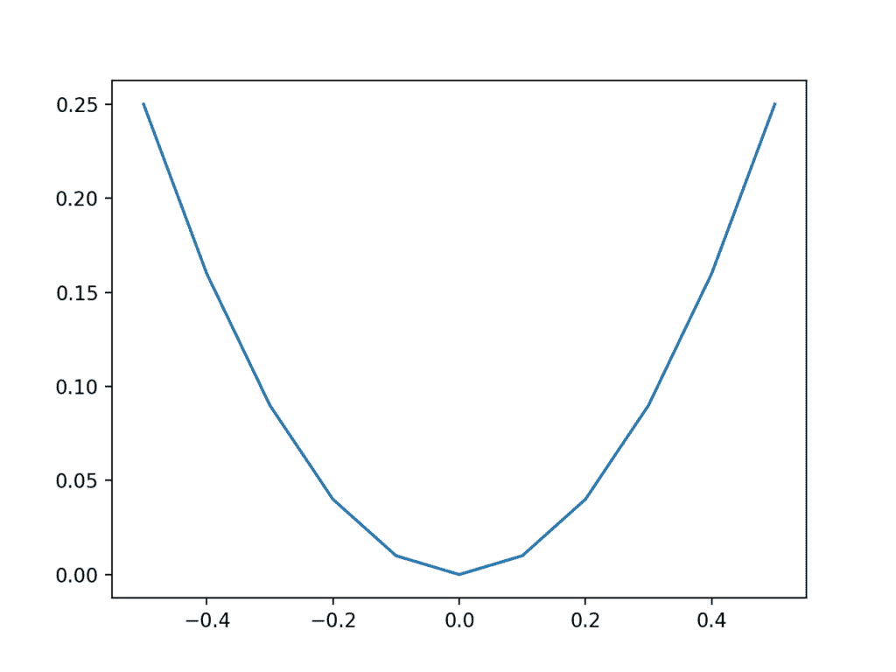
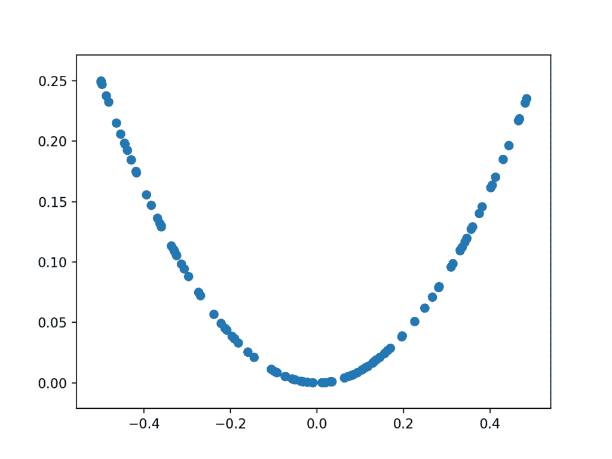
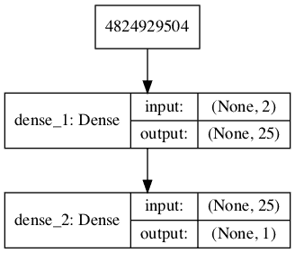
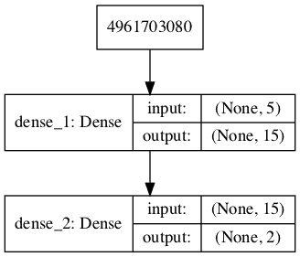
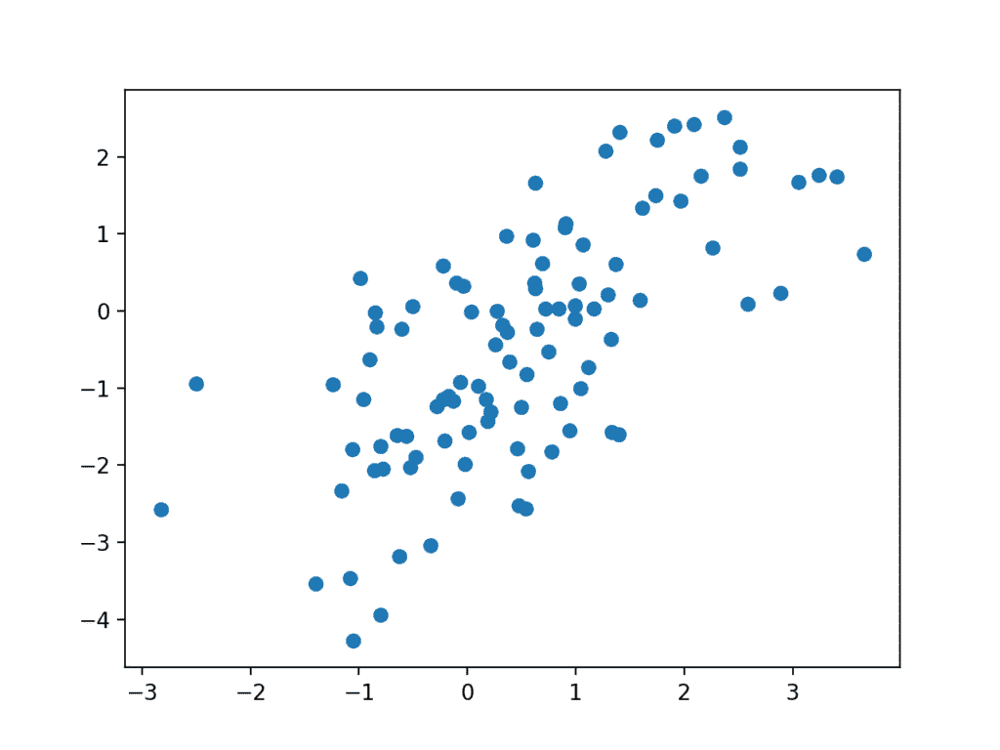
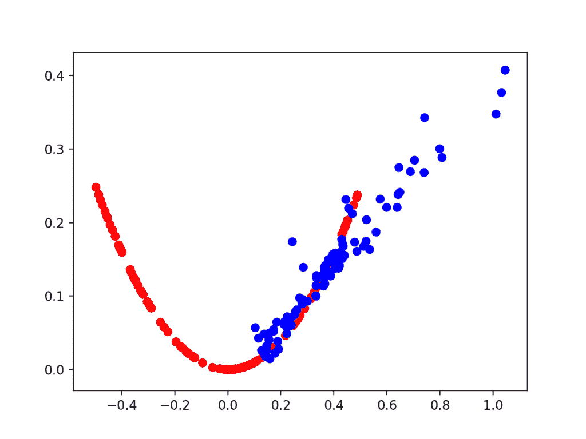
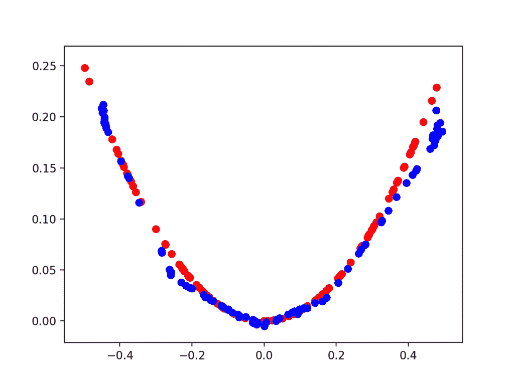

# 如何在 Keras 从零开始开发 1D 生成对抗网络

> 原文：<https://machinelearningmastery.com/how-to-develop-a-generative-adversarial-network-for-a-1-dimensional-function-from-scratch-in-keras/>

最后更新于 2020 年 9 月 1 日

[生成对抗网络](https://machinelearningmastery.com/what-are-generative-adversarial-networks-gans/)，简称 GANs，是一种用于训练强大发电机模型的深度学习架构。

生成器模型能够生成新的人工样本，这些样本很可能来自现有的样本分布。

GANs 由生成器和鉴别器模型组成。生成器负责从域中生成新的样本，鉴别器负责分类样本是真的还是假的(生成的)。重要的是，鉴别器模型的表现用于更新鉴别器本身和生成器模型的模型权重。这意味着生成器从未真正看到域中的示例，而是根据鉴别器的表现进行调整。

这是一个既要理解又要训练的复杂模型。

一种更好地理解 GAN 模型的本质以及如何训练它们的方法是为一个非常简单的任务从头开发一个模型。

一个简单的任务是一维函数，它为从零开始开发一个简单的 GAN 提供了良好的环境。这是因为真实的和生成的样本都可以被标绘和视觉检查，以了解所学的知识。一个简单的函数也不需要复杂的神经网络模型，这意味着架构上使用的特定生成器和鉴别器模型可以很容易理解。

在本教程中，我们将选择一个简单的一维函数，并将其用作使用 Keras 深度学习库从零开始开发和评估生成对抗网络的基础。

完成本教程后，您将知道:

*   从零开始为简单的一维函数开发生成对抗网络的好处。
*   如何开发独立的鉴别器和生成器模型，以及通过鉴别器的预测行为训练生成器的复合模型。
*   如何在问题域真实例子的背景下主观评估生成的样本？

**用我的新书[Python 生成对抗网络](https://machinelearningmastery.com/generative_adversarial_networks/)启动你的项目**，包括*分步教程*和所有示例的 *Python 源代码*文件。

我们开始吧。


如何在 Keras 从零开始发展 1D 生成对抗网络
图片由[土地管理局](https://flickr.com/photos/blmoregon/9680424451/)提供，保留部分权利。

## 教程概述

本教程分为六个部分；它们是:

1.  选择一维函数
2.  定义鉴别器模型
3.  定义生成器模型
4.  训练发电机模型
5.  评估 GAN 的表现
6.  训练 GAN 的完整示例

## 选择一维函数

第一步是选择一个一维函数进行建模。

某种形式的东西:

```py
y = f(x)
```

其中 *x* 为输入值， *y* 为函数的输出值。

具体来说，我们想要一个我们容易理解和绘制的函数。这将有助于设定模型应该生成什么的预期，并有助于使用生成的示例的视觉检查来了解它们的质量。

我们将使用一个简单的功能*x^2*；也就是说，函数将返回输入的平方。你可能还记得高中代数中的这个函数，它是 *u* 形函数。

我们可以用 Python 定义函数如下:

```py
# simple function
def calculate(x):
	return x * x
```

我们可以将输入域定义为-0.5 到 0.5 之间的实数值，并计算该线性范围内每个输入值的输出值，然后绘制结果图，以了解输入与输出之间的关系。

下面列出了完整的示例。

```py
# demonstrate simple x^2 function
from matplotlib import pyplot

# simple function
def calculate(x):
	return x * x

# define inputs
inputs = [-0.5, -0.4, -0.3, -0.2, -0.1, 0, 0.1, 0.2, 0.3, 0.4, 0.5]
# calculate outputs
outputs = [calculate(x) for x in inputs]
# plot the result
pyplot.plot(inputs, outputs)
pyplot.show()
```

运行该示例计算每个输入值的输出值，并创建输入值与输出值的关系图。

我们可以看到，远离 0.0 的值会导致更大的输出值，而接近零的值会导致更小的输出值，并且这种行为在零附近是对称的。

这就是众所周知的 X^2 一维函数的 u 形图。



X^2 函数的输入与输出图。

我们可以从函数中生成随机样本或点。

这可以通过生成介于-0.5 和 0.5 之间的随机值并计算相关的输出值来实现。重复多次将给出函数的点样本，例如“T0”真实样本

使用散点图绘制这些样本将显示相同的 u 形图，尽管由单个随机样本组成。

下面列出了完整的示例。

首先，我们生成 0 到 1 之间的均匀随机值，然后将它们移动到-0.5 到 0.5 的范围内。然后，我们计算每个随机生成的输入值的输出值，并将这些数组组合成一个具有 *n* 行(100)和两列的单个 NumPy 数组。

```py
# example of generating random samples from X^2
from numpy.random import rand
from numpy import hstack
from matplotlib import pyplot

# generate randoms sample from x^2
def generate_samples(n=100):
	# generate random inputs in [-0.5, 0.5]
	X1 = rand(n) - 0.5
	# generate outputs X^2 (quadratic)
	X2 = X1 * X1
	# stack arrays
	X1 = X1.reshape(n, 1)
	X2 = X2.reshape(n, 1)
	return hstack((X1, X2))

# generate samples
data = generate_samples()
# plot samples
pyplot.scatter(data[:, 0], data[:, 1])
pyplot.show()
```

运行该示例会生成 100 个随机输入及其计算输出，并将样本绘制为散点图，显示熟悉的 u 形。



X^2 函数随机生成的输入样本与计算输出的关系图。

我们可以使用这个函数作为为我们的鉴别器函数生成真实样本的起点。具体来说，一个样本由一个包含两个元素的向量组成，一个元素用于输入，一个元素用于一维函数的输出。

我们还可以想象发电机模型如何产生新的样本，我们可以绘制出来，并与 X^2 函数的预期 u 形进行比较。具体来说，生成器将输出一个包含两个元素的向量:一个用于输入，一个用于一维函数的输出。

## 定义鉴别器模型

下一步是定义鉴别器模型。

该模型必须从我们的问题中提取一个样本，例如一个具有两个元素的向量，并输出一个关于样本是真的还是假的分类预测。

这是一个二分类问题。

*   **输入**:两个实值的样本。
*   **输出**:二进制分类，样本真实(或虚假)的可能性。

这个问题很简单，意味着我们不需要复杂的神经网络来建模。

鉴别器模型将有一个包含 25 个节点的隐藏层，我们将使用 [ReLU 激活函数](https://machinelearningmastery.com/rectified-linear-activation-function-for-deep-learning-neural-networks/)和一种称为 he 权重初始化的适当权重初始化方法。

输出层将有一个使用 sigmoid 激活函数进行二进制分类的节点。

该模型将最小化二元交叉熵损失函数，将使用随机梯度下降的 [Adam 版本](https://machinelearningmastery.com/adam-optimization-algorithm-for-deep-learning/)，因为它非常有效。

下面的 *define_discriminator()* 函数定义并返回鉴别器模型。该函数参数化预期的输入数量，默认为两个。

```py
# define the standalone discriminator model
def define_discriminator(n_inputs=2):
	model = Sequential()
	model.add(Dense(25, activation='relu', kernel_initializer='he_uniform', input_dim=n_inputs))
	model.add(Dense(1, activation='sigmoid'))
	# compile model
	model.compile(loss='binary_crossentropy', optimizer='adam', metrics=['accuracy'])
	return model
```

我们可以使用这个函数来定义鉴别器模型并对其进行总结。下面列出了完整的示例。

```py
# define the discriminator model
from keras.models import Sequential
from keras.layers import Dense
from keras.utils.vis_utils import plot_model

# define the standalone discriminator model
def define_discriminator(n_inputs=2):
	model = Sequential()
	model.add(Dense(25, activation='relu', kernel_initializer='he_uniform', input_dim=n_inputs))
	model.add(Dense(1, activation='sigmoid'))
	# compile model
	model.compile(loss='binary_crossentropy', optimizer='adam', metrics=['accuracy'])
	return model

# define the discriminator model
model = define_discriminator()
# summarize the model
model.summary()
# plot the model
plot_model(model, to_file='discriminator_plot.png', show_shapes=True, show_layer_names=True)
```

运行该示例定义了鉴别器模型并对其进行了总结。

```py
_________________________________________________________________
Layer (type)                 Output Shape              Param #
=================================================================
dense_1 (Dense)              (None, 25)                75
_________________________________________________________________
dense_2 (Dense)              (None, 1)                 26
=================================================================
Total params: 101
Trainable params: 101
Non-trainable params: 0
_________________________________________________________________
```

还创建了一个模型图，我们可以看到该模型预期两个输入，并将预测一个输出。

**注**:创建此图假设安装了 pydot 和 graphviz 库。如果这是一个问题，您可以注释掉 *plot_model* 函数的导入语句和对 *plot_model()* 函数的调用。



GAN 中鉴别器模型的绘制

我们现在可以用类标签为 1 的真实例子和类标签为 0 的随机生成的样本开始训练这个模型。

没有必要这样做，但是我们将开发的元素将在以后有用，这有助于看到鉴别器只是一个正常的神经网络模型。

首先，我们可以从预测部分更新我们的 *generate_samples()* 函数，并将其称为 *generate_real_samples()* ，并让它返回真实样本的输出类标签，具体来说，就是 1 个值的数组，其中 class=1 表示 real。

```py
# generate n real samples with class labels
def generate_real_samples(n):
	# generate inputs in [-0.5, 0.5]
	X1 = rand(n) - 0.5
	# generate outputs X^2
	X2 = X1 * X1
	# stack arrays
	X1 = X1.reshape(n, 1)
	X2 = X2.reshape(n, 1)
	X = hstack((X1, X2))
	# generate class labels
	y = ones((n, 1))
	return X, y
```

接下来，我们可以创建这个函数的副本来创建假例子。

在这种情况下，我们将为样本的两个元素生成-1 和 1 范围内的随机值。所有这些示例的输出类标签都是 0。

这个函数将充当我们的假生成器模型。

```py
# generate n fake samples with class labels
def generate_fake_samples(n):
	# generate inputs in [-1, 1]
	X1 = -1 + rand(n) * 2
	# generate outputs in [-1, 1]
	X2 = -1 + rand(n) * 2
	# stack arrays
	X1 = X1.reshape(n, 1)
	X2 = X2.reshape(n, 1)
	X = hstack((X1, X2))
	# generate class labels
	y = zeros((n, 1))
	return X, y
```

接下来，我们需要一个函数来训练和评估鉴别器模型。

这可以通过手动枚举训练时期并为每个时期生成半批真实例子和半批伪造例子，以及在每个例子上更新模型来实现，例如一整批例子。可以使用 *train()* 功能，但是在这种情况下，我们将直接使用 *train_on_batch()* 功能。

然后可以在生成的示例上评估模型，并且我们可以报告真实和虚假样本的分类准确率。

下面的 *train_discriminator()* 函数实现了这一点，对模型进行了 1000 批次的训练，每批次使用 128 个样本(64 个假样本，64 个真样本)。

```py
# train the discriminator model
def train_discriminator(model, n_epochs=1000, n_batch=128):
	half_batch = int(n_batch / 2)
	# run epochs manually
	for i in range(n_epochs):
		# generate real examples
		X_real, y_real = generate_real_samples(half_batch)
		# update model
		model.train_on_batch(X_real, y_real)
		# generate fake examples
		X_fake, y_fake = generate_fake_samples(half_batch)
		# update model
		model.train_on_batch(X_fake, y_fake)
		# evaluate the model
		_, acc_real = model.evaluate(X_real, y_real, verbose=0)
		_, acc_fake = model.evaluate(X_fake, y_fake, verbose=0)
		print(i, acc_real, acc_fake)
```

我们可以将所有这些联系在一起，并在真实和虚假的例子上训练鉴别器模型。

下面列出了完整的示例。

```py
# define and fit a discriminator model
from numpy import zeros
from numpy import ones
from numpy import hstack
from numpy.random import rand
from numpy.random import randn
from keras.models import Sequential
from keras.layers import Dense

# define the standalone discriminator model
def define_discriminator(n_inputs=2):
	model = Sequential()
	model.add(Dense(25, activation='relu', kernel_initializer='he_uniform', input_dim=n_inputs))
	model.add(Dense(1, activation='sigmoid'))
	# compile model
	model.compile(loss='binary_crossentropy', optimizer='adam', metrics=['accuracy'])
	return model

# generate n real samples with class labels
def generate_real_samples(n):
	# generate inputs in [-0.5, 0.5]
	X1 = rand(n) - 0.5
	# generate outputs X^2
	X2 = X1 * X1
	# stack arrays
	X1 = X1.reshape(n, 1)
	X2 = X2.reshape(n, 1)
	X = hstack((X1, X2))
	# generate class labels
	y = ones((n, 1))
	return X, y

# generate n fake samples with class labels
def generate_fake_samples(n):
	# generate inputs in [-1, 1]
	X1 = -1 + rand(n) * 2
	# generate outputs in [-1, 1]
	X2 = -1 + rand(n) * 2
	# stack arrays
	X1 = X1.reshape(n, 1)
	X2 = X2.reshape(n, 1)
	X = hstack((X1, X2))
	# generate class labels
	y = zeros((n, 1))
	return X, y

# train the discriminator model
def train_discriminator(model, n_epochs=1000, n_batch=128):
	half_batch = int(n_batch / 2)
	# run epochs manually
	for i in range(n_epochs):
		# generate real examples
		X_real, y_real = generate_real_samples(half_batch)
		# update model
		model.train_on_batch(X_real, y_real)
		# generate fake examples
		X_fake, y_fake = generate_fake_samples(half_batch)
		# update model
		model.train_on_batch(X_fake, y_fake)
		# evaluate the model
		_, acc_real = model.evaluate(X_real, y_real, verbose=0)
		_, acc_fake = model.evaluate(X_fake, y_fake, verbose=0)
		print(i, acc_real, acc_fake)

# define the discriminator model
model = define_discriminator()
# fit the model
train_discriminator(model)
```

运行该示例生成真实和虚假的示例并更新模型，然后在相同的示例上评估模型并打印分类准确率。

**注**:考虑到算法或评估程序的随机性，或数值准确率的差异，您的[结果可能会有所不同](https://machinelearningmastery.com/different-results-each-time-in-machine-learning/)。考虑运行该示例几次，并比较平均结果。

在这种情况下，模型快速学会以完美的准确率正确识别真实的例子，并且非常擅长以 80%到 90%的准确率识别虚假的例子。

```py
...
995 1.0 0.875
996 1.0 0.921875
997 1.0 0.859375
998 1.0 0.9375
999 1.0 0.8125
```

训练鉴别器模型很简单。目标是训练一个生成器模型，而不是鉴别器模型，这才是 GANs 真正的复杂性所在。

## 定义生成器模型

下一步是定义生成器模型。

生成器模型从潜在空间中获取一个点作为输入，并生成一个新的样本，例如一个包含我们函数的输入和输出元素的向量，例如 x 和 x^2.

潜变量是隐藏的或未被观察到的变量，潜空间是这些变量的多维向量空间。我们可以定义问题潜在空间的大小以及潜在空间中变量的形状或分布。

这是因为潜在空间没有意义，直到生成器模型在学习时开始给空间中的点赋予意义。在训练之后，潜在空间中的点将对应于输出空间中的点，例如生成的样本空间中的点。

我们将定义一个五维的小潜在空间，并使用 GAN 文献中的标准方法，对潜在空间中的每个变量使用高斯分布。我们将通过从标准高斯分布中提取随机数来生成新的输入，即平均值为零，标准偏差为 1。

*   **输入**:潜在空间中的点，例如高斯随机数的五元素向量。
*   **输出**:表示我们的函数(x 和 x^2).)的生成样本的二元向量

生成器模型将像鉴别器模型一样小。

它将有一个包含五个节点的隐藏层，并将使用 [ReLU 激活功能](https://machinelearningmastery.com/rectified-linear-activation-function-for-deep-learning-neural-networks/)和 he 权重初始化。输出层将为生成向量中的两个元素提供两个节点，并将使用线性激活函数。

使用线性激活函数是因为我们知道，我们希望生成器输出一个实值向量，第一个元素的比例为[-0.5，0.5]，第二个元素的比例约为[0.0，0.25]。

模型未编译。其原因是发电机型号不直接匹配。

下面的 *define_generator()* 函数定义并返回生成器模型。

潜在维度的大小是参数化的，以防我们以后想要使用它，模型的输出形状也是参数化的，与定义鉴别器模型的函数相匹配。

```py
# define the standalone generator model
def define_generator(latent_dim, n_outputs=2):
	model = Sequential()
	model.add(Dense(15, activation='relu', kernel_initializer='he_uniform', input_dim=latent_dim))
	model.add(Dense(n_outputs, activation='linear'))
	return model
```

我们可以总结模型，以帮助更好地理解输入和输出形状。

下面列出了完整的示例。

```py
# define the generator model
from keras.models import Sequential
from keras.layers import Dense
from keras.utils.vis_utils import plot_model

# define the standalone generator model
def define_generator(latent_dim, n_outputs=2):
	model = Sequential()
	model.add(Dense(15, activation='relu', kernel_initializer='he_uniform', input_dim=latent_dim))
	model.add(Dense(n_outputs, activation='linear'))
	return model

# define the discriminator model
model = define_generator(5)
# summarize the model
model.summary()
# plot the model
plot_model(model, to_file='generator_plot.png', show_shapes=True, show_layer_names=True)
```

运行该示例定义了生成器模型并对其进行了总结。

```py
_________________________________________________________________
Layer (type)                 Output Shape              Param #
=================================================================
dense_1 (Dense)              (None, 15)                90
_________________________________________________________________
dense_2 (Dense)              (None, 2)                 32
=================================================================
Total params: 122
Trainable params: 122
Non-trainable params: 0
_________________________________________________________________
```

还创建了模型的图，我们可以看到模型期望来自潜在空间的五元素点作为输入，并将预测两元素向量作为输出。

**注**:创建此图假设安装了 pydot 和 graphviz 库。如果这是一个问题，您可以注释掉 *plot_model* 函数的导入语句和对 *plot_model()* 函数的调用。



GAN 中的发电机模型图

我们可以看到，该模型将潜在空间中的一个随机五元向量作为输入，并为我们的一维函数输出一个二元向量。

这种模式目前做不了什么。然而，我们可以演示如何使用它来生成样本。这是不需要的，但是这些元素中的一些在以后可能会有用。

第一步是在潜在空间中生成新的点。我们可以通过调用 [randn() NumPy 函数](https://docs.scipy.org/doc/numpy/reference/generated/numpy.random.randn.html)来实现这一点，该函数用于生成从标准高斯中提取的[随机数](https://machinelearningmastery.com/how-to-generate-random-numbers-in-python/)的数组。

然后随机数的数组可以被重新整形为样本:即 n 行，每行五个元素。下面的*生成 _ 潜在 _ 点()*函数实现了这一点，并在潜在空间中生成所需数量的点，这些点可用作生成器模型的输入。

```py
# generate points in latent space as input for the generator
def generate_latent_points(latent_dim, n):
	# generate points in the latent space
	x_input = randn(latent_dim * n)
	# reshape into a batch of inputs for the network
	x_input = x_input.reshape(n, latent_dim)
	return x_input
```

接下来，我们可以使用生成的点作为生成器模型的输入来生成新的样本，然后绘制样本。

下面的 *generate_fake_samples()* 函数实现了这一点，其中定义的生成器和潜在空间的大小以及模型要生成的点数作为参数传递。

```py
# use the generator to generate n fake examples and plot the results
def generate_fake_samples(generator, latent_dim, n):
	# generate points in latent space
	x_input = generate_latent_points(latent_dim, n)
	# predict outputs
	X = generator.predict(x_input)
	# plot the results
	pyplot.scatter(X[:, 0], X[:, 1])
	pyplot.show()
```

将这些联系在一起，完整的示例如下所示。

```py
# define and use the generator model
from numpy.random import randn
from keras.models import Sequential
from keras.layers import Dense
from matplotlib import pyplot

# define the standalone generator model
def define_generator(latent_dim, n_outputs=2):
	model = Sequential()
	model.add(Dense(15, activation='relu', kernel_initializer='he_uniform', input_dim=latent_dim))
	model.add(Dense(n_outputs, activation='linear'))
	return model

# generate points in latent space as input for the generator
def generate_latent_points(latent_dim, n):
	# generate points in the latent space
	x_input = randn(latent_dim * n)
	# reshape into a batch of inputs for the network
	x_input = x_input.reshape(n, latent_dim)
	return x_input

# use the generator to generate n fake examples and plot the results
def generate_fake_samples(generator, latent_dim, n):
	# generate points in latent space
	x_input = generate_latent_points(latent_dim, n)
	# predict outputs
	X = generator.predict(x_input)
	# plot the results
	pyplot.scatter(X[:, 0], X[:, 1])
	pyplot.show()

# size of the latent space
latent_dim = 5
# define the discriminator model
model = define_generator(latent_dim)
# generate and plot generated samples
generate_fake_samples(model, latent_dim, 100)
```

运行该示例从潜在空间生成 100 个随机点，将其用作生成器的输入，并从我们的一维函数域生成 100 个假样本。

由于生成器没有经过训练，生成的点完全是垃圾，正如我们所料，但我们可以想象，随着模型的训练，这些点将慢慢开始类似目标函数及其 u 形。



生成器模型预测的假样本散点图。

我们现在已经看到了如何定义和使用生成器模型。我们需要以这种方式使用生成器模型来创建样本，以便鉴别器进行分类。

我们没有看到发电机模型是如何训练的；那是下一个。

## 训练发电机模型

生成器模型中的权重根据鉴别器模型的表现进行更新。

当鉴别器擅长检测假样本时，生成器更新较多，当鉴别器模型在检测假样本时相对较差或混乱时，生成器模型更新较少。

这就定义了这两种模式之间的零和或对立关系。

使用 Keras API 实现这一点可能有很多方法，但最简单的方法可能是创建一个包含或封装生成器和鉴别器模型的新模型。

具体来说，可以定义一个新的 GAN 模型，该模型将生成器和鉴别器堆叠在一起，使得生成器接收潜在空间中的随机点作为输入，生成直接馈送到鉴别器模型中的样本，进行分类，并且该更大模型的输出可以用于更新生成器的模型权重。

明确地说，我们不是在谈论新的第三个模型，只是一个逻辑上的第三个模型，它使用独立生成器和鉴别器模型中已经定义的层和权重。

只有鉴别者才关心真假例子的区分；因此，鉴别器模型可以以独立的方式对每个例子进行训练。

生成器模型只关心鉴别器在假例子上的表现。因此，当它是 GAN 模型的一部分时，我们将把鉴别器中的所有层标记为不可训练的，这样它们就不能被更新和过度训练在假的例子上。

当通过这个包含的 GAN 模型训练生成器时，有一个更重要的变化。我们希望鉴别器认为生成器输出的样本是真实的，而不是伪造的。因此，当生成器被训练为 GAN 模型的一部分时，我们将把生成的样本标记为真实的(类 1)。

我们可以想象，鉴别器然后将生成的样本分类为不真实(类别 0)或真实概率低(0.3 或 0.5)。用于更新模型权重的反向传播过程将认为这是一个很大的误差，并将更新模型权重(即，仅生成器中的权重)来校正该误差，这又使得生成器更好地生成似是而非的假样本。

让我们把这个具体化。

*   **输入**:潜在空间中的点，例如高斯随机数的五元素向量。
*   **输出**:二进制分类，样本真实(或虚假)的可能性。

下面的 *define_gan()* 函数将已经定义的生成器和鉴别器模型作为参数，并创建包含这两个模型的新的逻辑第三模型。鉴别器中的权重被标记为不可训练，这仅影响 GAN 模型看到的权重，而不影响独立鉴别器模型。

GAN 模型然后使用相同的二元交叉熵损失函数作为鉴别器和有效的[亚当版本的随机梯度下降](https://machinelearningmastery.com/adam-optimization-algorithm-for-deep-learning/)。

```py
# define the combined generator and discriminator model, for updating the generator
def define_gan(generator, discriminator):
	# make weights in the discriminator not trainable
	discriminator.trainable = False
	# connect them
	model = Sequential()
	# add generator
	model.add(generator)
	# add the discriminator
	model.add(discriminator)
	# compile model
	model.compile(loss='binary_crossentropy', optimizer='adam')
	return model
```

使鉴别器不可训练是 Keras API 中的一个聪明的技巧。

*可训练的*属性会在编译模型时影响模型。鉴别器模型是用可训练层编译的，因此当通过调用 *train_on_batch()* 更新独立模型时，这些层中的模型权重将被更新。

鉴别器模型被标记为不可训练，被添加到 GAN 模型中，并被编译。在该模型中，鉴别器模型的模型权重是不可训练的，并且当通过调用 *train_on_batch()* 更新 GAN 模型时，不能改变。

这里的 Keras API 文档中描述了这种行为:

*   [如何“冻结”Keras 层？](https://keras.io/getting-started/faq/#how-can-i-freeze-keras-layers)

下面列出了创建鉴别器、生成器和复合模型的完整示例。

```py
# demonstrate creating the three models in the gan
from keras.models import Sequential
from keras.layers import Dense
from keras.utils.vis_utils import plot_model

# define the standalone discriminator model
def define_discriminator(n_inputs=2):
	model = Sequential()
	model.add(Dense(25, activation='relu', kernel_initializer='he_uniform', input_dim=n_inputs))
	model.add(Dense(1, activation='sigmoid'))
	# compile model
	model.compile(loss='binary_crossentropy', optimizer='adam', metrics=['accuracy'])
	return model

# define the standalone generator model
def define_generator(latent_dim, n_outputs=2):
	model = Sequential()
	model.add(Dense(15, activation='relu', kernel_initializer='he_uniform', input_dim=latent_dim))
	model.add(Dense(n_outputs, activation='linear'))
	return model

# define the combined generator and discriminator model, for updating the generator
def define_gan(generator, discriminator):
	# make weights in the discriminator not trainable
	discriminator.trainable = False
	# connect them
	model = Sequential()
	# add generator
	model.add(generator)
	# add the discriminator
	model.add(discriminator)
	# compile model
	model.compile(loss='binary_crossentropy', optimizer='adam')
	return model

# size of the latent space
latent_dim = 5
# create the discriminator
discriminator = define_discriminator()
# create the generator
generator = define_generator(latent_dim)
# create the gan
gan_model = define_gan(generator, discriminator)
# summarize gan model
gan_model.summary()
# plot gan model
plot_model(gan_model, to_file='gan_plot.png', show_shapes=True, show_layer_names=True)
```

运行该示例首先会创建复合模型的摘要。

```py
_________________________________________________________________
Layer (type)                 Output Shape              Param #
=================================================================
sequential_2 (Sequential)    (None, 2)                 122
_________________________________________________________________
sequential_1 (Sequential)    (None, 1)                 101
=================================================================
Total params: 223
Trainable params: 122
Non-trainable params: 101
_________________________________________________________________
```

还创建了模型的图，我们可以看到模型期望潜在空间中的五元素点作为输入，并将预测单个输出分类标签。

**注意**，创建此图假设安装了 pydot 和 graphviz 库。如果这是一个问题，您可以注释掉 *plot_model* 函数的导入语句和对 *plot_model()* 函数的调用。


GAN 中复合发生器和鉴别器模型的绘制

训练复合模型包括通过上一节中的*generate _ 潜伏 _points()* 函数和 class=1 标签在潜伏空间中生成一批值的点，并调用 *train_on_batch()* 函数。

下面的 *train_gan()* 函数演示了这一点，尽管它非常无趣，因为每个时期只有生成器会被更新，给鉴别器留下默认的模型权重。

```py
# train the composite model
def train_gan(gan_model, latent_dim, n_epochs=10000, n_batch=128):
	# manually enumerate epochs
	for i in range(n_epochs):
		# prepare points in latent space as input for the generator
		x_gan = generate_latent_points(latent_dim, n_batch)
		# create inverted labels for the fake samples
		y_gan = ones((n_batch, 1))
		# update the generator via the discriminator's error
		gan_model.train_on_batch(x_gan, y_gan)
```

相反，我们需要的是首先用真样本和假样本更新鉴别器模型，然后通过复合模型更新生成器。

这需要组合鉴别器部分定义的 *train_discriminator()* 函数和上面定义的 *train_gan()* 函数中的元素。它还要求 *generate_fake_samples()* 函数使用生成器模型来生成假样本，而不是生成随机数。

下面列出了更新鉴别器模型和生成器(通过复合模型)的完整训练函数。

```py
# train the generator and discriminator
def train(g_model, d_model, gan_model, latent_dim, n_epochs=10000, n_batch=128):
	# determine half the size of one batch, for updating the discriminator
	half_batch = int(n_batch / 2)
	# manually enumerate epochs
	for i in range(n_epochs):
		# prepare real samples
		x_real, y_real = generate_real_samples(half_batch)
		# prepare fake examples
		x_fake, y_fake = generate_fake_samples(g_model, latent_dim, half_batch)
		# update discriminator
		d_model.train_on_batch(x_real, y_real)
		d_model.train_on_batch(x_fake, y_fake)
		# prepare points in latent space as input for the generator
		x_gan = generate_latent_points(latent_dim, n_batch)
		# create inverted labels for the fake samples
		y_gan = ones((n_batch, 1))
		# update the generator via the discriminator's error
		gan_model.train_on_batch(x_gan, y_gan)
```

我们几乎拥有为一维函数开发 GAN 所需的一切。

剩下的一个方面是对模型的评估。

## 评估 GAN 的表现

通常，没有客观的方法来评估 GAN 模型的表现。

在这种特定情况下，我们可以为生成的样本设计一个客观的度量，因为我们知道真正的底层输入域和目标函数，并且可以计算一个客观的误差度量。

尽管如此，我们不会在本教程中计算这个客观误差分数。相反，我们将使用大多数 GAN 应用中使用的主观方法。具体来说，我们将使用生成器生成新的样本，并根据域中的真实样本对它们进行检查。

首先，我们可以使用上面鉴别器部分开发的 *generate_real_samples()* 函数来生成真实的例子。创建这些示例的散点图将创建我们熟悉的目标函数 u 形。

```py
# generate n real samples with class labels
def generate_real_samples(n):
	# generate inputs in [-0.5, 0.5]
	X1 = rand(n) - 0.5
	# generate outputs X^2
	X2 = X1 * X1
	# stack arrays
	X1 = X1.reshape(n, 1)
	X2 = X2.reshape(n, 1)
	X = hstack((X1, X2))
	# generate class labels
	y = ones((n, 1))
	return X, y
```

接下来，我们可以使用生成器模型生成相同数量的假样本。

这需要首先通过上面生成器部分中开发的*生成潜在点()*函数在潜在空间中生成相同数量的点。然后，这些可以传递到生成器模型，并用于生成样本，这些样本也可以绘制在同一散点图上。

```py
# generate points in latent space as input for the generator
def generate_latent_points(latent_dim, n):
	# generate points in the latent space
	x_input = randn(latent_dim * n)
	# reshape into a batch of inputs for the network
	x_input = x_input.reshape(n, latent_dim)
	return x_input
```

下面的 *generate_fake_samples()* 函数生成这些假样本和关联的类标签 0，这些标签在后面会很有用。

```py
# use the generator to generate n fake examples, with class labels
def generate_fake_samples(generator, latent_dim, n):
	# generate points in latent space
	x_input = generate_latent_points(latent_dim, n)
	# predict outputs
	X = generator.predict(x_input)
	# create class labels
	y = zeros((n, 1))
	return X, y
```

将两个样本绘制在同一个图形上，可以直接比较它们，以查看是否覆盖了相同的输入和输出域，以及目标函数的预期形状是否已被适当捕获，至少在主观上是如此。

下面的*summary _ performance()*函数可以在训练期间随时调用，以创建真实点和生成点的散点图，从而了解发电机模型的当前能力。

```py
# plot real and fake points
def summarize_performance(generator, latent_dim, n=100):
	# prepare real samples
	x_real, y_real = generate_real_samples(n)
	# prepare fake examples
	x_fake, y_fake = generate_fake_samples(generator, latent_dim, n)
	# scatter plot real and fake data points
	pyplot.scatter(x_real[:, 0], x_real[:, 1], color='red')
	pyplot.scatter(x_fake[:, 0], x_fake[:, 1], color='blue')
	pyplot.show()
```

同时我们也可能对鉴别器模型的表现感兴趣。

具体来说，我们有兴趣知道鉴别器模型能在多大程度上正确识别真假样本。一个好的生成器模型应该会使鉴别器模型变得混乱，导致真实和虚假例子的分类准确率接近 50%。

我们可以更新*summary _ performance()*函数，也可以将鉴别器和当前历元号作为参数，并在真假示例的样本上报告准确性。

```py
# evaluate the discriminator and plot real and fake points
def summarize_performance(epoch, generator, discriminator, latent_dim, n=100):
	# prepare real samples
	x_real, y_real = generate_real_samples(n)
	# evaluate discriminator on real examples
	_, acc_real = discriminator.evaluate(x_real, y_real, verbose=0)
	# prepare fake examples
	x_fake, y_fake = generate_fake_samples(generator, latent_dim, n)
	# evaluate discriminator on fake examples
	_, acc_fake = discriminator.evaluate(x_fake, y_fake, verbose=0)
	# summarize discriminator performance
	print(epoch, acc_real, acc_fake)
	# scatter plot real and fake data points
	pyplot.scatter(x_real[:, 0], x_real[:, 1], color='red')
	pyplot.scatter(x_fake[:, 0], x_fake[:, 1], color='blue')
	pyplot.show()
```

然后可以在训练期间定期调用该函数。

例如，如果我们选择为 10，000 次迭代训练模型，那么每 2，000 次迭代检查模型的表现可能会很有趣。

我们可以通过 *n_eval* 参数参数化登记频率，并在适当的迭代次数后从 *train()* 函数调用*summary _ performance()*函数来实现。

带此变化的*列车()*功能的更新版本如下。

```py
# train the generator and discriminator
def train(g_model, d_model, gan_model, latent_dim, n_epochs=10000, n_batch=128, n_eval=2000):
	# determine half the size of one batch, for updating the discriminator
	half_batch = int(n_batch / 2)
	# manually enumerate epochs
	for i in range(n_epochs):
		# prepare real samples
		x_real, y_real = generate_real_samples(half_batch)
		# prepare fake examples
		x_fake, y_fake = generate_fake_samples(g_model, latent_dim, half_batch)
		# update discriminator
		d_model.train_on_batch(x_real, y_real)
		d_model.train_on_batch(x_fake, y_fake)
		# prepare points in latent space as input for the generator
		x_gan = generate_latent_points(latent_dim, n_batch)
		# create inverted labels for the fake samples
		y_gan = ones((n_batch, 1))
		# update the generator via the discriminator's error
		gan_model.train_on_batch(x_gan, y_gan)
		# evaluate the model every n_eval epochs
		if (i+1) % n_eval == 0:
			summarize_performance(i, g_model, d_model, latent_dim)
```

## 训练 GAN 的完整示例

我们现在有了在我们选择的一维函数上训练和评估 GAN 所需的一切。

下面列出了完整的示例。

```py
# train a generative adversarial network on a one-dimensional function
from numpy import hstack
from numpy import zeros
from numpy import ones
from numpy.random import rand
from numpy.random import randn
from keras.models import Sequential
from keras.layers import Dense
from matplotlib import pyplot

# define the standalone discriminator model
def define_discriminator(n_inputs=2):
	model = Sequential()
	model.add(Dense(25, activation='relu', kernel_initializer='he_uniform', input_dim=n_inputs))
	model.add(Dense(1, activation='sigmoid'))
	# compile model
	model.compile(loss='binary_crossentropy', optimizer='adam', metrics=['accuracy'])
	return model

# define the standalone generator model
def define_generator(latent_dim, n_outputs=2):
	model = Sequential()
	model.add(Dense(15, activation='relu', kernel_initializer='he_uniform', input_dim=latent_dim))
	model.add(Dense(n_outputs, activation='linear'))
	return model

# define the combined generator and discriminator model, for updating the generator
def define_gan(generator, discriminator):
	# make weights in the discriminator not trainable
	discriminator.trainable = False
	# connect them
	model = Sequential()
	# add generator
	model.add(generator)
	# add the discriminator
	model.add(discriminator)
	# compile model
	model.compile(loss='binary_crossentropy', optimizer='adam')
	return model

# generate n real samples with class labels
def generate_real_samples(n):
	# generate inputs in [-0.5, 0.5]
	X1 = rand(n) - 0.5
	# generate outputs X^2
	X2 = X1 * X1
	# stack arrays
	X1 = X1.reshape(n, 1)
	X2 = X2.reshape(n, 1)
	X = hstack((X1, X2))
	# generate class labels
	y = ones((n, 1))
	return X, y

# generate points in latent space as input for the generator
def generate_latent_points(latent_dim, n):
	# generate points in the latent space
	x_input = randn(latent_dim * n)
	# reshape into a batch of inputs for the network
	x_input = x_input.reshape(n, latent_dim)
	return x_input

# use the generator to generate n fake examples, with class labels
def generate_fake_samples(generator, latent_dim, n):
	# generate points in latent space
	x_input = generate_latent_points(latent_dim, n)
	# predict outputs
	X = generator.predict(x_input)
	# create class labels
	y = zeros((n, 1))
	return X, y

# evaluate the discriminator and plot real and fake points
def summarize_performance(epoch, generator, discriminator, latent_dim, n=100):
	# prepare real samples
	x_real, y_real = generate_real_samples(n)
	# evaluate discriminator on real examples
	_, acc_real = discriminator.evaluate(x_real, y_real, verbose=0)
	# prepare fake examples
	x_fake, y_fake = generate_fake_samples(generator, latent_dim, n)
	# evaluate discriminator on fake examples
	_, acc_fake = discriminator.evaluate(x_fake, y_fake, verbose=0)
	# summarize discriminator performance
	print(epoch, acc_real, acc_fake)
	# scatter plot real and fake data points
	pyplot.scatter(x_real[:, 0], x_real[:, 1], color='red')
	pyplot.scatter(x_fake[:, 0], x_fake[:, 1], color='blue')
	pyplot.show()

# train the generator and discriminator
def train(g_model, d_model, gan_model, latent_dim, n_epochs=10000, n_batch=128, n_eval=2000):
	# determine half the size of one batch, for updating the discriminator
	half_batch = int(n_batch / 2)
	# manually enumerate epochs
	for i in range(n_epochs):
		# prepare real samples
		x_real, y_real = generate_real_samples(half_batch)
		# prepare fake examples
		x_fake, y_fake = generate_fake_samples(g_model, latent_dim, half_batch)
		# update discriminator
		d_model.train_on_batch(x_real, y_real)
		d_model.train_on_batch(x_fake, y_fake)
		# prepare points in latent space as input for the generator
		x_gan = generate_latent_points(latent_dim, n_batch)
		# create inverted labels for the fake samples
		y_gan = ones((n_batch, 1))
		# update the generator via the discriminator's error
		gan_model.train_on_batch(x_gan, y_gan)
		# evaluate the model every n_eval epochs
		if (i+1) % n_eval == 0:
			summarize_performance(i, g_model, d_model, latent_dim)

# size of the latent space
latent_dim = 5
# create the discriminator
discriminator = define_discriminator()
# create the generator
generator = define_generator(latent_dim)
# create the gan
gan_model = define_gan(generator, discriminator)
# train model
train(generator, discriminator, gan_model, latent_dim)
```

运行该示例每 2，000 次训练迭代(批次)报告一次模型表现，并创建一个图。

**注**:考虑到算法或评估程序的随机性，或数值准确率的差异，您的[结果可能会有所不同](https://machinelearningmastery.com/different-results-each-time-in-machine-learning/)。考虑运行该示例几次，并比较平均结果。

我们可以看到训练过程是比较不稳定的。第一列报告迭代次数，第二列报告鉴别器对真实示例的分类准确率，第三列报告鉴别器对生成(伪造)示例的分类准确率。

在这种情况下，我们可以看到鉴别器对真实的例子仍然相对困惑，并且识别假例子的表现各不相同。

```py
1999 0.45 1.0
3999 0.45 0.91
5999 0.86 0.16
7999 0.6 0.41
9999 0.15 0.93
```

为了简洁起见，我将省略提供这里创建的五个图；相反，我们只看两个。

第一个图是在 2000 次迭代后创建的，显示了真实(红色)和假(蓝色)样本。虽然具有正确的函数关系，但是该模型最初在仅正输入域中生成的点的聚类中表现不佳。



2000 次迭代后目标函数的真实和生成示例的散点图。

第二个图显示了经过 10，000 次迭代后真实(红色)与虚假(蓝色)的对比。

在这里，我们可以看到生成器模型在生成似是而非的样本方面做得很合理，输入值在[-0.5 和 0.5]之间的正确域中，输出值显示出 X^2 关系，或者接近这种关系。



10，000 次迭代后目标函数的真实和生成示例的散点图。

## 扩展ˌ扩张

本节列出了一些您可能希望探索的扩展教程的想法。

*   **模型架构**。尝试鉴别器和生成器的替代模型架构，例如更多或更少的节点、层和替代激活函数，例如泄漏 ReLU。
*   **数据缩放**。实验交替激活函数，如双曲正切(tanh)和任何所需的训练数据缩放。
*   **替代目标功能**。用另一个目标函数进行实验，例如简单的正弦波、高斯分布、不同的二次函数，甚至多模态多项式函数。

如果你探索这些扩展，我很想知道。
在下面的评论中发表你的发现。

## 进一步阅读

如果您想更深入地了解这个主题，本节将提供更多资源。

### 应用程序接口

*   [大声 API](https://keras.io/)
*   [如何“冻结”Keras 层？](https://keras.io/getting-started/faq/#how-can-i-freeze-keras-layers)
*   [MatplotLib API](https://matplotlib.org/api/)
*   num py . random . rand API
*   num py . random . rann API
*   num py . zero API
*   [numpy . one API](https://docs.scipy.org/doc/numpy/reference/generated/numpy.ones.html)
*   num py .哈萨克斯坦 API

## 摘要

在本教程中，您发现了如何为一维函数从零开始开发生成对抗网络。

具体来说，您了解到:

*   从零开始为简单的一维函数开发生成对抗网络的好处。
*   如何开发独立的鉴别器和生成器模型，以及通过鉴别器的预测行为训练生成器的复合模型。
*   如何在问题域真实例子的背景下主观评估生成的样本？

你有什么问题吗？
在下面的评论中提问，我会尽力回答。