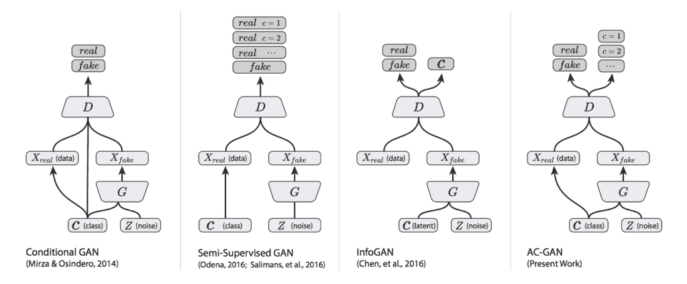
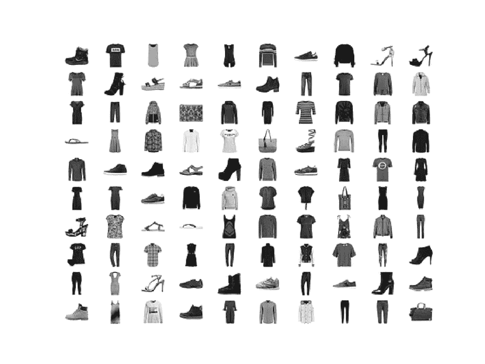
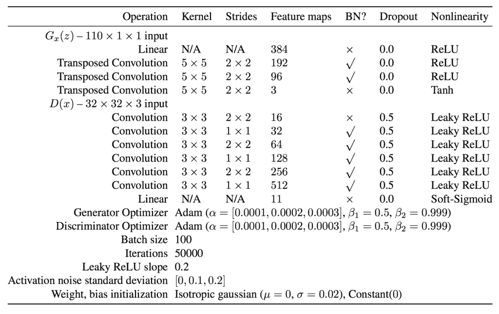
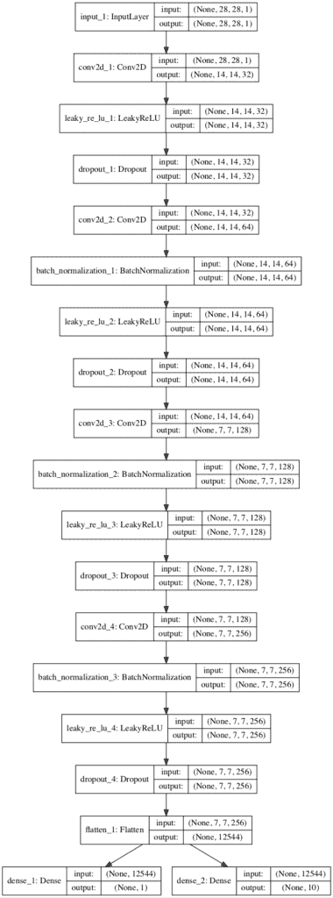
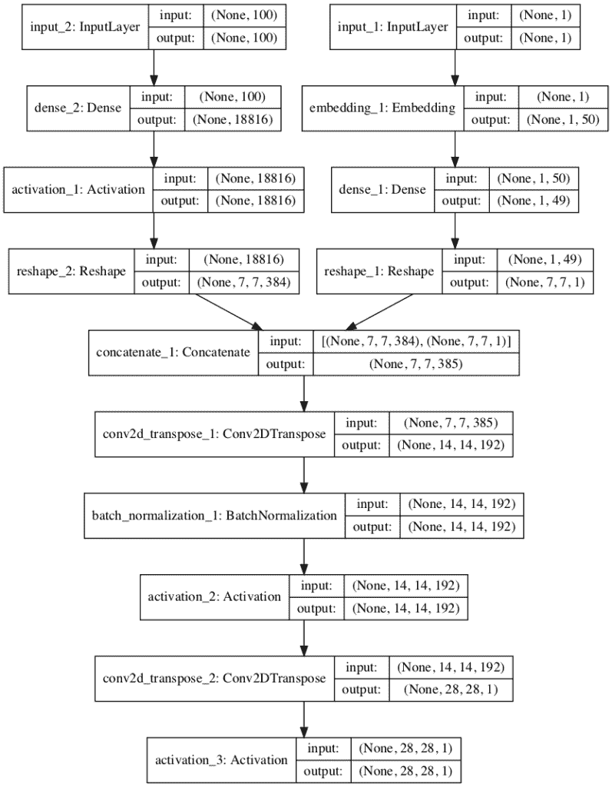
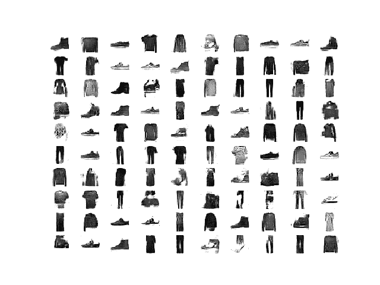
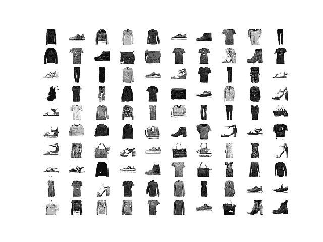
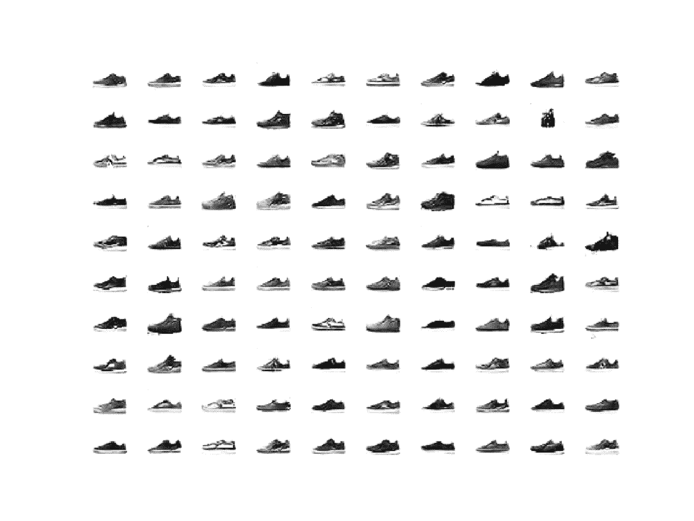
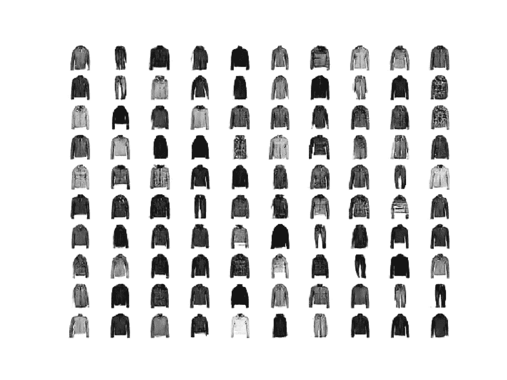

# 如何用 Keras 从零开始开发辅助分类器 GAN(AC-GAN)

> 原文：<https://machinelearningmastery.com/how-to-develop-an-auxiliary-classifier-gan-ac-gan-from-scratch-with-keras/>

最后更新于 2021 年 1 月 18 日

生成对抗网络是一种用于训练生成模型的体系结构，例如用于生成图像的深度卷积神经网络。

条件生成对抗网络，简称 cGAN，是一种 GAN，涉及到通过生成器模型有条件地生成图像。图像生成可以以类标签为条件(如果可用)，允许有针对性地生成给定类型的图像。

辅助分类器 GAN，简称 AC-GAN，是条件 GAN 的扩展，它改变鉴别器来预测给定图像的类别标签，而不是接收它作为输入。它具有稳定训练过程的效果，并允许生成大的高质量图像，同时学习独立于类别标签的潜在空间中的表示。

在本教程中，您将发现如何开发一个辅助分类器生成对抗网络来生成服装照片。

完成本教程后，您将知道:

*   辅助分类器 GAN 是一种条件 GAN，它要求鉴别器预测给定图像的类别标签。
*   如何开发交流 GAN 的发生器、鉴别器和复合模型。
*   如何训练、评估和使用 AC-GAN 从时尚 MNIST 数据集生成服装照片。

**用我的新书[Python 生成对抗网络](https://machinelearningmastery.com/generative_adversarial_networks/)启动你的项目**，包括*分步教程*和所有示例的 *Python 源代码*文件。

我们开始吧。

*   **2021 年 1 月更新**:更新所以层冻结用批量定额。


如何用 Keras 从零开始开发辅助分类器 GAN (AC-GAN)图片由 [ebbe ostebo](https://www.flickr.com/photos/81994612@N06/28779669191) 提供，版权所有。

## 教程概述

本教程分为五个部分；它们是:

1.  辅助分类器生成对抗网络
2.  时尚-MNIST 服装照片数据集
3.  如何定义交流 GAN 模型
4.  如何为时尚 MNIST 开发交流 GAN
5.  如何用人工智能生成服装项目

## 辅助分类器生成对抗网络

生成对抗网络是一种用于训练生成模型的体系结构，通常是用于生成图像的深度卷积神经网络。

该架构由一个生成器模型和一个鉴别器组成，生成器模型从潜在空间中获取随机点作为输入并生成图像，鉴别器用于将图像分类为真实(来自数据集)或虚假(生成)。然后在零和游戏中同时训练两个模型。

有条件的 GAN，简称 CGAN 或 cGAN，是 GAN 架构的扩展，为潜在空间增加了结构。改变 GAN 模型的训练，使得生成器被提供潜在空间中的点和类别标签作为输入，并且尝试为该类别生成图像。鉴别器提供有图像和类别标签，并且必须像以前一样分类图像是真的还是假的。

添加类作为输入使得图像生成过程和图像分类过程以类标签为条件，因此得名。其效果是更稳定的训练过程和生成的生成器模型，该生成器模型可用于生成给定特定类型的图像，例如用于类别标签。

辅助分类器 GAN，简称 AC-GAN，是基于 CGAN 扩展的 GAN 体系结构的进一步扩展。它是由 [Augustus Odena](http://www.augustusodena.com/) 等人从 Google Brain 在 2016 年发表的论文《使用辅助分类器 GANs 的[条件图像合成》中引入的](https://arxiv.org/abs/1610.09585)

与有条件的 GAN 一样，AC-GAN 中的生成器模型被提供有潜在空间中的点和作为输入的类别标签，例如图像生成过程是有条件的。

主要区别在于鉴别器模型，它只提供图像作为输入，不像条件 GAN 提供图像和类标签作为输入。然后，鉴别器模型必须像以前一样预测给定图像是真的还是假的，并且还必须预测图像的类别标签。

> ……模型[…]是有类条件的，但带有一个负责重构类标签的辅助解码器。

——[辅助分类器条件图像合成 GANs](https://arxiv.org/abs/1610.09585) ，2016。

该体系结构以这样的方式描述，即鉴别器和辅助分类器可以被认为是共享模型权重的独立模型。在实践中，鉴别器和辅助分类器可以实现为具有两个输出的单个神经网络模型。

第一个输出是通过 sigmoid 激活函数的单个概率，表示输入图像的“*真实度*”，并使用二进制交叉熵进行优化，就像正常的 GAN 鉴别器模型一样。

第二输出是图像经由 softmax 激活函数属于每个类别的概率，像任何给定的多类别分类神经网络模型一样，并且使用分类交叉熵进行优化。

总结一下:

#### 发电机型号:

*   **输入**:来自潜在空间的随机点，以及类别标签。
*   **输出**:生成的图像。

#### 鉴别器模型:

*   **输入**:图像。
*   **输出**:提供的图像真实的概率，图像属于每个已知类别的概率。

下图总结了一系列条件 GAN 的输入和输出，包括交流 GAN，提供了一些差异的背景。



条件 GAN、半监督 GAN、信息 GAN 和交流 GAN 之间的差异总结。
摘自:辅助分类器 GANs 条件图像合成版。

鉴别器寻求最大化正确分类真实和虚假图像的概率，并正确预测真实或虚假图像(例如，真实图像+虚假图像)的类别标签。生成器寻求最小化鉴别器鉴别真实和伪造图像的能力，同时也最大化鉴别器预测真实和伪造图像的类别标签的能力(例如 LC–LS)。

> 目标函数有两个部分:正确源的对数似然性 LS 和正确类的对数似然性 LC。[……]D 被训练为最大化最小二乘+最小二乘，而 G 被训练为最大化最小二乘。

——[辅助分类器条件图像合成 GANs](https://arxiv.org/abs/1610.09585) ，2016。

生成的生成器学习独立于类标签的潜在空间表示，不像条件 GAN。

> AC-GANs 学习独立于类标签的 z 的表示。

——[辅助分类器条件图像合成 GANs](https://arxiv.org/abs/1610.09585) ，2016。

以这种方式改变条件 GAN 的效果是更稳定的训练过程和模型生成比以前可能的更大尺寸(例如 128×128 像素)的更高质量图像的能力。

> ……我们证明，向 GAN 潜在空间添加更多结构以及专门的成本函数，可以获得更高质量的样本。[……]重要的是，我们从数量上证明了我们的高分辨率样本不仅仅是低分辨率样本的简单重置。

——[辅助分类器条件图像合成 GANs](https://arxiv.org/abs/1610.09585) ，2016。

## 时尚-MNIST 服装照片数据集

[时尚-MNIST 数据集](https://machinelearningmastery.com/how-to-develop-a-cnn-from-scratch-for-fashion-mnist-clothing-classification/)被提议作为 MNIST 手写数字数据集的更具挑战性的替换数据集。

它是一个数据集，由 60，000 个 28×28 像素的小正方形灰度图像组成，包括 10 种服装，如鞋子、t 恤、连衣裙等。

Keras 通过 [fashion_mnist.load_dataset()函数](https://keras.io/datasets/#fashion-mnist-database-of-fashion-articles)提供对时尚 MNIST 数据集的访问。它返回两个元组，一个包含标准训练数据集的输入和输出元素，另一个包含标准测试数据集的输入和输出元素。

下面的示例加载数据集并总结加载数据集的形状。

**注意**:第一次加载数据集时，Keras 会自动下载图片的压缩版本，保存在*的主目录下~/。keras/数据集/* 。下载速度很快，因为压缩形式的数据集只有大约 25 兆字节。

```py
# example of loading the fashion_mnist dataset
from keras.datasets.fashion_mnist import load_data
# load the images into memory
(trainX, trainy), (testX, testy) = load_data()
# summarize the shape of the dataset
print('Train', trainX.shape, trainy.shape)
print('Test', testX.shape, testy.shape)
```

运行该示例将加载数据集，并打印训练的输入和输出组件的形状，以及测试图像的分割。

我们可以看到训练集中有 60K 个例子，测试集中有 10K，每个图像都是 28 乘 28 像素的正方形。

```py
Train (60000, 28, 28) (60000,)
Test (10000, 28, 28) (10000,)
```

图像是黑色背景(像素值为 0)的灰度图像，衣服是白色的(像素值接近 255)。这意味着如果图像被绘制出来，它们大部分是黑色的，中间有一件白色的衣服。

我们可以使用带有 [imshow()函数](https://matplotlib.org/api/_as_gen/matplotlib.pyplot.imshow.html)的 matplotlib 库绘制训练数据集中的一些图像，并通过“ *cmap* ”参数将颜色映射指定为“*灰色*，以正确显示像素值。

```py
# plot raw pixel data
pyplot.imshow(trainX[i], cmap='gray')
```

或者，当我们颠倒颜色，将背景画成白色，将服装画成黑色时，图像更容易查看。

它们更容易观看，因为大部分图像现在是白色的，而感兴趣的区域是黑色的。这可以通过使用反向灰度色图来实现，如下所示:

```py
# plot raw pixel data
pyplot.imshow(trainX[i], cmap='gray_r')
```

以下示例将训练数据集中的前 100 幅图像绘制成 10 乘 10 的正方形。

```py
# example of loading the fashion_mnist dataset
from keras.datasets.fashion_mnist import load_data
from matplotlib import pyplot
# load the images into memory
(trainX, trainy), (testX, testy) = load_data()
# plot images from the training dataset
for i in range(100):
	# define subplot
	pyplot.subplot(10, 10, 1 + i)
	# turn off axis
	pyplot.axis('off')
	# plot raw pixel data
	pyplot.imshow(trainX[i], cmap='gray_r')
pyplot.show()
```

运行该示例会创建一个图形，其中包含 100 幅来自 MNIST 训练数据集的图像，排列成 10×10 的正方形。



时尚 MNIST 数据集中前 100 件服装的图表。

我们将使用训练数据集中的图像作为训练生成对抗网络的基础。

具体来说，生成器模型将学习如何生成新的似是而非的服装项目，使用鉴别器来尝试区分来自时尚 MNIST 训练数据集的真实图像和生成器模型输出的新图像，并预测每个图像的类别标签。

这是一个相对简单的问题，不需要复杂的生成器或鉴别器模型，尽管它确实需要生成灰度输出图像。

## 如何定义交流 GAN 模型

在本节中，我们将开发交流 GAN 的发生器、鉴别器和复合模型。

交流-GAN 论文的附录提供了发电机和鉴频器配置的建议，我们将用作灵感。下表总结了本文中对 CIFAR-10 数据集的建议。



交流-GAN 发电机和鉴别器型号配置建议。
取自:使用辅助分类器 GANs 的条件图像合成。

### 交流-GAN 鉴别器模型

让我们从鉴别器模型开始。

鉴别器模型必须将图像作为输入，并且预测图像的真实度的概率和图像属于每个给定类别的概率。

输入图像的形状为 28x28x1，在时尚 MNIST 数据集中有 10 个服装类别。

该模型可以按照 DCGAN 架构进行定义。也就是说，使用高斯权重初始化、批处理归一化、LeakyReLU、Dropout 和 2×2 步长进行下采样，而不是合并层。

例如，下面是使用 [Keras 函数 API](https://machinelearningmastery.com/keras-functional-api-deep-learning/) 定义的鉴别器模型的主体。

```py
...
# weight initialization
init = RandomNormal(stddev=0.02)
# image input
in_image = Input(shape=in_shape)
# downsample to 14x14
fe = Conv2D(32, (3,3), strides=(2,2), padding='same', kernel_initializer=init)(in_image)
fe = LeakyReLU(alpha=0.2)(fe)
fe = Dropout(0.5)(fe)
# normal
fe = Conv2D(64, (3,3), padding='same', kernel_initializer=init)(fe)
fe = BatchNormalization()(fe)
fe = LeakyReLU(alpha=0.2)(fe)
fe = Dropout(0.5)(fe)
# downsample to 7x7
fe = Conv2D(128, (3,3), strides=(2,2), padding='same', kernel_initializer=init)(fe)
fe = BatchNormalization()(fe)
fe = LeakyReLU(alpha=0.2)(fe)
fe = Dropout(0.5)(fe)
# normal
fe = Conv2D(256, (3,3), padding='same', kernel_initializer=init)(fe)
fe = BatchNormalization()(fe)
fe = LeakyReLU(alpha=0.2)(fe)
fe = Dropout(0.5)(fe)
# flatten feature maps
fe = Flatten()(fe)
...
```

主要区别在于模型有两个输出层。

第一个是单个节点，具有 sigmoid 激活，用于预测图像的真实性。

```py
...
# real/fake output
out1 = Dense(1, activation='sigmoid')(fe)
```

第二种是多个节点，每个类一个，使用 softmax 激活函数来预测给定图像的类标签。

```py
...
# class label output
out2 = Dense(n_classes, activation='softmax')(fe)
```

然后，我们可以用一个输入和两个输出来构建图像。

```py
...
# define model
model = Model(in_image, [out1, out2])
```

该模型必须用两个[损失函数](https://machinelearningmastery.com/how-to-choose-loss-functions-when-training-deep-learning-neural-networks/)训练，第一输出层的二元交叉熵和第二输出层的分类交叉熵损失。

我们可以直接比较整数类标签，而不是像通常那样将类标签的一个热编码与第二个输出层进行比较。我们可以使用稀疏分类交叉熵损失函数自动实现这一点。这将具有分类交叉熵的相同效果，但是避免了必须手动对目标标签进行一次热编码的步骤。

在编译模型时，我们可以通过将函数名列表指定为字符串来通知 Keras 对两个输出层使用两个不同的损失函数；例如:

```py
loss=['binary_crossentropy', 'sparse_categorical_crossentropy']
```

该模型使用随机梯度下降的 [Adam 版本](https://machinelearningmastery.com/adam-optimization-algorithm-for-deep-learning/)进行拟合，学习率小，动量适中，这是 DCGANs 推荐的。

```py
...
# compile model
opt = Adam(lr=0.0002, beta_1=0.5)
model.compile(loss=['binary_crossentropy', 'sparse_categorical_crossentropy'], optimizer=opt)
```

将这些联系在一起，define_discriminator()函数将为 AC-GAN 定义和编译鉴别器模型。

输入图像的形状和类的数量是参数化的，并使用默认值进行设置，允许它们在将来为您自己的项目轻松更改。

```py
# define the standalone discriminator model
def define_discriminator(in_shape=(28,28,1), n_classes=10):
	# weight initialization
	init = RandomNormal(stddev=0.02)
	# image input
	in_image = Input(shape=in_shape)
	# downsample to 14x14
	fe = Conv2D(32, (3,3), strides=(2,2), padding='same', kernel_initializer=init)(in_image)
	fe = LeakyReLU(alpha=0.2)(fe)
	fe = Dropout(0.5)(fe)
	# normal
	fe = Conv2D(64, (3,3), padding='same', kernel_initializer=init)(fe)
	fe = BatchNormalization()(fe)
	fe = LeakyReLU(alpha=0.2)(fe)
	fe = Dropout(0.5)(fe)
	# downsample to 7x7
	fe = Conv2D(128, (3,3), strides=(2,2), padding='same', kernel_initializer=init)(fe)
	fe = BatchNormalization()(fe)
	fe = LeakyReLU(alpha=0.2)(fe)
	fe = Dropout(0.5)(fe)
	# normal
	fe = Conv2D(256, (3,3), padding='same', kernel_initializer=init)(fe)
	fe = BatchNormalization()(fe)
	fe = LeakyReLU(alpha=0.2)(fe)
	fe = Dropout(0.5)(fe)
	# flatten feature maps
	fe = Flatten()(fe)
	# real/fake output
	out1 = Dense(1, activation='sigmoid')(fe)
	# class label output
	out2 = Dense(n_classes, activation='softmax')(fe)
	# define model
	model = Model(in_image, [out1, out2])
	# compile model
	opt = Adam(lr=0.0002, beta_1=0.5)
	model.compile(loss=['binary_crossentropy', 'sparse_categorical_crossentropy'], optimizer=opt)
	return model
```

我们可以定义和总结这个模型。

下面列出了完整的示例。

```py
# example of defining the discriminator model
from keras.models import Model
from keras.layers import Input
from keras.layers import Dense
from keras.layers import Conv2D
from keras.layers import LeakyReLU
from keras.layers import Dropout
from keras.layers import Flatten
from keras.layers import BatchNormalization
from keras.initializers import RandomNormal
from keras.optimizers import Adam
from keras.utils.vis_utils import plot_model

# define the standalone discriminator model
def define_discriminator(in_shape=(28,28,1), n_classes=10):
	# weight initialization
	init = RandomNormal(stddev=0.02)
	# image input
	in_image = Input(shape=in_shape)
	# downsample to 14x14
	fe = Conv2D(32, (3,3), strides=(2,2), padding='same', kernel_initializer=init)(in_image)
	fe = LeakyReLU(alpha=0.2)(fe)
	fe = Dropout(0.5)(fe)
	# normal
	fe = Conv2D(64, (3,3), padding='same', kernel_initializer=init)(fe)
	fe = BatchNormalization()(fe)
	fe = LeakyReLU(alpha=0.2)(fe)
	fe = Dropout(0.5)(fe)
	# downsample to 7x7
	fe = Conv2D(128, (3,3), strides=(2,2), padding='same', kernel_initializer=init)(fe)
	fe = BatchNormalization()(fe)
	fe = LeakyReLU(alpha=0.2)(fe)
	fe = Dropout(0.5)(fe)
	# normal
	fe = Conv2D(256, (3,3), padding='same', kernel_initializer=init)(fe)
	fe = BatchNormalization()(fe)
	fe = LeakyReLU(alpha=0.2)(fe)
	fe = Dropout(0.5)(fe)
	# flatten feature maps
	fe = Flatten()(fe)
	# real/fake output
	out1 = Dense(1, activation='sigmoid')(fe)
	# class label output
	out2 = Dense(n_classes, activation='softmax')(fe)
	# define model
	model = Model(in_image, [out1, out2])
	# compile model
	opt = Adam(lr=0.0002, beta_1=0.5)
	model.compile(loss=['binary_crossentropy', 'sparse_categorical_crossentropy'], optimizer=opt)
	return model

# define the discriminator model
model = define_discriminator()
# summarize the model
model.summary()
# plot the model
plot_model(model, to_file='discriminator_plot.png', show_shapes=True, show_layer_names=True)
```

运行示例首先打印模型的摘要。

这确认了输入图像和两个输出层的预期形状，尽管线性组织确实使两个独立的输出层清晰。

```py
__________________________________________________________________________________________________
Layer (type)                    Output Shape         Param #     Connected to
==================================================================================================
input_1 (InputLayer)            (None, 28, 28, 1)    0
__________________________________________________________________________________________________
conv2d_1 (Conv2D)               (None, 14, 14, 32)   320         input_1[0][0]
__________________________________________________________________________________________________
leaky_re_lu_1 (LeakyReLU)       (None, 14, 14, 32)   0           conv2d_1[0][0]
__________________________________________________________________________________________________
dropout_1 (Dropout)             (None, 14, 14, 32)   0           leaky_re_lu_1[0][0]
__________________________________________________________________________________________________
conv2d_2 (Conv2D)               (None, 14, 14, 64)   18496       dropout_1[0][0]
__________________________________________________________________________________________________
batch_normalization_1 (BatchNor (None, 14, 14, 64)   256         conv2d_2[0][0]
__________________________________________________________________________________________________
leaky_re_lu_2 (LeakyReLU)       (None, 14, 14, 64)   0           batch_normalization_1[0][0]
__________________________________________________________________________________________________
dropout_2 (Dropout)             (None, 14, 14, 64)   0           leaky_re_lu_2[0][0]
__________________________________________________________________________________________________
conv2d_3 (Conv2D)               (None, 7, 7, 128)    73856       dropout_2[0][0]
__________________________________________________________________________________________________
batch_normalization_2 (BatchNor (None, 7, 7, 128)    512         conv2d_3[0][0]
__________________________________________________________________________________________________
leaky_re_lu_3 (LeakyReLU)       (None, 7, 7, 128)    0           batch_normalization_2[0][0]
__________________________________________________________________________________________________
dropout_3 (Dropout)             (None, 7, 7, 128)    0           leaky_re_lu_3[0][0]
__________________________________________________________________________________________________
conv2d_4 (Conv2D)               (None, 7, 7, 256)    295168      dropout_3[0][0]
__________________________________________________________________________________________________
batch_normalization_3 (BatchNor (None, 7, 7, 256)    1024        conv2d_4[0][0]
__________________________________________________________________________________________________
leaky_re_lu_4 (LeakyReLU)       (None, 7, 7, 256)    0           batch_normalization_3[0][0]
__________________________________________________________________________________________________
dropout_4 (Dropout)             (None, 7, 7, 256)    0           leaky_re_lu_4[0][0]
__________________________________________________________________________________________________
flatten_1 (Flatten)             (None, 12544)        0           dropout_4[0][0]
__________________________________________________________________________________________________
dense_1 (Dense)                 (None, 1)            12545       flatten_1[0][0]
__________________________________________________________________________________________________
dense_2 (Dense)                 (None, 10)           125450      flatten_1[0][0]
==================================================================================================
Total params: 527,627
Trainable params: 526,731
Non-trainable params: 896
__________________________________________________________________________________________________
```

还会创建一个模型图，显示输入图像的线性处理和两个清晰的输出层。



辅助分类器 GAN 的鉴别器模型图

既然我们已经定义了交流-GAN 鉴别器模型，我们就可以开发发电机模型了。

### 交流 GAN 发电机模型

生成器模型必须从潜在空间中取一个随机点作为输入，并加上类标签，然后输出一个形状为 28x28x1 的生成灰度图像。

AC-GAN 论文描述了 AC-GAN 生成器模型，该模型采用矢量输入，该矢量输入是潜在空间中的点(100 维)和一个热编码类标签(10 维)的级联，该标签为 110 维。

一种已经被证明有效并且现在被普遍推荐的替代方法是在生成器模型的早期将类标签解释为附加的通道或特征图。

这可以通过使用具有任意维数(例如 50)的学习嵌入来实现，其输出可以由具有线性激活的完全连接的层来解释，从而产生一个额外的 7×7 特征图。

```py
...
# label input
in_label = Input(shape=(1,))
# embedding for categorical input
li = Embedding(n_classes, 50)(in_label)
# linear multiplication
n_nodes = 7 * 7
li = Dense(n_nodes, kernel_initializer=init)(li)
# reshape to additional channel
li = Reshape((7, 7, 1))(li)
```

潜在空间中的点可以由具有足够激活的完全连接的层来解释，以创建多个 7×7 特征图，在本例中为 384，并为我们的输出图像的低分辨率版本提供基础。

类别标签的 7×7 单要素地图解释然后可以按通道连接，从而产生 385 个要素地图。

```py
...
# image generator input
in_lat = Input(shape=(latent_dim,))
# foundation for 7x7 image
n_nodes = 384 * 7 * 7
gen = Dense(n_nodes, kernel_initializer=init)(in_lat)
gen = Activation('relu')(gen)
gen = Reshape((7, 7, 384))(gen)
# merge image gen and label input
merge = Concatenate()([gen, li])
```

然后，这些特征图可以经历两个转置卷积层的过程，以将 7×7 特征图首先上采样到 14×14 像素，然后最后上采样到 28×28 特征，随着每个上缩放步骤，特征图的面积翻了两番。

发生器的输出是一个单一的特征图或灰度图像，形状为 28×28，像素值在范围[-1，1]内，给定 tanh 激活函数的选择。我们使用 [ReLU 激活](https://machinelearningmastery.com/rectified-linear-activation-function-for-deep-learning-neural-networks/)来升级层，而不是 AC-GAN 论文中给出的 LeakyReLU。

```py
# upsample to 14x14
gen = Conv2DTranspose(192, (5,5), strides=(2,2), padding='same', kernel_initializer=init)(merge)
gen = BatchNormalization()(gen)
gen = Activation('relu')(gen)
# upsample to 28x28
gen = Conv2DTranspose(1, (5,5), strides=(2,2), padding='same', kernel_initializer=init)(gen)
out_layer = Activation('tanh')(gen)
```

我们可以将所有这些联系在一起，并结合到下面定义的 define_generator()函数中，该函数将创建并返回交流-GAN 的发电机模型。

模型不是直接训练的，所以故意不编译；相反，它是通过鉴别器模型训练的。

```py
# define the standalone generator model
def define_generator(latent_dim, n_classes=10):
	# weight initialization
	init = RandomNormal(stddev=0.02)
	# label input
	in_label = Input(shape=(1,))
	# embedding for categorical input
	li = Embedding(n_classes, 50)(in_label)
	# linear multiplication
	n_nodes = 7 * 7
	li = Dense(n_nodes, kernel_initializer=init)(li)
	# reshape to additional channel
	li = Reshape((7, 7, 1))(li)
	# image generator input
	in_lat = Input(shape=(latent_dim,))
	# foundation for 7x7 image
	n_nodes = 384 * 7 * 7
	gen = Dense(n_nodes, kernel_initializer=init)(in_lat)
	gen = Activation('relu')(gen)
	gen = Reshape((7, 7, 384))(gen)
	# merge image gen and label input
	merge = Concatenate()([gen, li])
	# upsample to 14x14
	gen = Conv2DTranspose(192, (5,5), strides=(2,2), padding='same', kernel_initializer=init)(merge)
	gen = BatchNormalization()(gen)
	gen = Activation('relu')(gen)
	# upsample to 28x28
	gen = Conv2DTranspose(1, (5,5), strides=(2,2), padding='same', kernel_initializer=init)(gen)
	out_layer = Activation('tanh')(gen)
	# define model
	model = Model([in_lat, in_label], out_layer)
	return model
```

我们可以创建这个模型，并总结和绘制它的结构。

下面列出了完整的示例。

```py
# example of defining the generator model
from keras.models import Model
from keras.layers import Input
from keras.layers import Dense
from keras.layers import Reshape
from keras.layers import Conv2DTranspose
from keras.layers import Embedding
from keras.layers import Concatenate
from keras.layers import Activation
from keras.layers import BatchNormalization
from keras.initializers import RandomNormal
from keras.utils.vis_utils import plot_model

# define the standalone generator model
def define_generator(latent_dim, n_classes=10):
	# weight initialization
	init = RandomNormal(stddev=0.02)
	# label input
	in_label = Input(shape=(1,))
	# embedding for categorical input
	li = Embedding(n_classes, 50)(in_label)
	# linear multiplication
	n_nodes = 7 * 7
	li = Dense(n_nodes, kernel_initializer=init)(li)
	# reshape to additional channel
	li = Reshape((7, 7, 1))(li)
	# image generator input
	in_lat = Input(shape=(latent_dim,))
	# foundation for 7x7 image
	n_nodes = 384 * 7 * 7
	gen = Dense(n_nodes, kernel_initializer=init)(in_lat)
	gen = Activation('relu')(gen)
	gen = Reshape((7, 7, 384))(gen)
	# merge image gen and label input
	merge = Concatenate()([gen, li])
	# upsample to 14x14
	gen = Conv2DTranspose(192, (5,5), strides=(2,2), padding='same', kernel_initializer=init)(merge)
	gen = BatchNormalization()(gen)
	gen = Activation('relu')(gen)
	# upsample to 28x28
	gen = Conv2DTranspose(1, (5,5), strides=(2,2), padding='same', kernel_initializer=init)(gen)
	out_layer = Activation('tanh')(gen)
	# define model
	model = Model([in_lat, in_label], out_layer)
	return model

# define the size of the latent space
latent_dim = 100
# define the generator model
model = define_generator(latent_dim)
# summarize the model
model.summary()
# plot the model
plot_model(model, to_file='generator_plot.png', show_shapes=True, show_layer_names=True)
```

运行该示例首先打印模型中层及其输出形状的摘要。

我们可以确认潜在维度输入是 100 个维度，类标签输入是单个整数。我们还可以确认嵌入类标签的[的输出被正确连接为附加通道，从而在转置卷积层之前产生 385 个 7×7 特征映射。](https://machinelearningmastery.com/what-are-word-embeddings/)

总结还确认了单个灰度 28×28 图像的预期输出形状。

```py
__________________________________________________________________________________________________
Layer (type)                    Output Shape         Param #     Connected to
==================================================================================================
input_2 (InputLayer)            (None, 100)          0
__________________________________________________________________________________________________
input_1 (InputLayer)            (None, 1)            0
__________________________________________________________________________________________________
dense_2 (Dense)                 (None, 18816)        1900416     input_2[0][0]
__________________________________________________________________________________________________
embedding_1 (Embedding)         (None, 1, 50)        500         input_1[0][0]
__________________________________________________________________________________________________
activation_1 (Activation)       (None, 18816)        0           dense_2[0][0]
__________________________________________________________________________________________________
dense_1 (Dense)                 (None, 1, 49)        2499        embedding_1[0][0]
__________________________________________________________________________________________________
reshape_2 (Reshape)             (None, 7, 7, 384)    0           activation_1[0][0]
__________________________________________________________________________________________________
reshape_1 (Reshape)             (None, 7, 7, 1)      0           dense_1[0][0]
__________________________________________________________________________________________________
concatenate_1 (Concatenate)     (None, 7, 7, 385)    0           reshape_2[0][0]
                                                                 reshape_1[0][0]
__________________________________________________________________________________________________
conv2d_transpose_1 (Conv2DTrans (None, 14, 14, 192)  1848192     concatenate_1[0][0]
__________________________________________________________________________________________________
batch_normalization_1 (BatchNor (None, 14, 14, 192)  768         conv2d_transpose_1[0][0]
__________________________________________________________________________________________________
activation_2 (Activation)       (None, 14, 14, 192)  0           batch_normalization_1[0][0]
__________________________________________________________________________________________________
conv2d_transpose_2 (Conv2DTrans (None, 28, 28, 1)    4801        activation_2[0][0]
__________________________________________________________________________________________________
activation_3 (Activation)       (None, 28, 28, 1)    0           conv2d_transpose_2[0][0]
==================================================================================================
Total params: 3,757,176
Trainable params: 3,756,792
Non-trainable params: 384
__________________________________________________________________________________________________
```

还会创建网络图，总结每层的输入和输出形状。

该图确认了网络的两个输入以及输入的正确连接。



辅助分类器 GAN 发生器模型图

现在我们已经定义了生成器模型，我们可以展示它可能是如何适合的。

### 交流-GAN 复合模型

发电机型号不直接更新；相反，它通过鉴别器模型进行更新。

这可以通过创建一个复合模型来实现，该模型将生成器模型堆叠在鉴别器模型之上。

这个复合模型的输入是生成器模型的输入，即来自潜在空间的随机点和类标签。生成器模型直接连接到鉴别器模型，鉴别器模型直接将生成的图像作为输入。最后，鉴别器模型预测生成的图像和类别标签的真实性。因此，使用两个损失函数优化复合模型，鉴别器模型的每个输出对应一个损失函数。

鉴别器模型以独立的方式使用真实和虚假的例子进行更新，我们将在下一节回顾如何做到这一点。因此，我们不希望在更新(训练)复合模型时更新鉴别器模型；我们只想使用这个复合模型来更新生成器模型的权重。

这可以通过在编译复合模型之前将鉴别器的层设置为不可训练来实现。这仅在复合模型查看或使用时对层权重有影响，并防止它们在复合模型更新时被更新。

下面的 *define_gan()* 函数实现了这一点，将已经定义的生成器和鉴别器模型作为输入，并定义了一个新的复合模型，该模型只能用于更新生成器模型。

```py
# define the combined generator and discriminator model, for updating the generator
def define_gan(g_model, d_model):
	# make weights in the discriminator not trainable
	for layer in d_model.layers:
		if not isinstance(layer, BatchNormalization):
			layer.trainable = False
	# connect the outputs of the generator to the inputs of the discriminator
	gan_output = d_model(g_model.output)
	# define gan model as taking noise and label and outputting real/fake and label outputs
	model = Model(g_model.input, gan_output)
	# compile model
	opt = Adam(lr=0.0002, beta_1=0.5)
	model.compile(loss=['binary_crossentropy', 'sparse_categorical_crossentropy'], optimizer=opt)
	return model
```

现在我们已经定义了 AC-GAN 中使用的模型，我们可以将它们放在时尚-MNIST 数据集上。

## 如何为时尚 MNIST 开发交流 GAN

第一步是加载和准备时尚 MNIST 数据集。

我们只需要训练数据集中的图像。图像是黑白的，因此我们必须增加一个额外的通道维度来将它们转换成三维的，正如我们模型的卷积层所预期的那样。最后，[像素值必须缩放](https://machinelearningmastery.com/how-to-manually-scale-image-pixel-data-for-deep-learning/)到范围[-1，1]以匹配生成器模型的输出。

下面的 *load_real_samples()* 函数实现了这一点，返回加载并缩放的时尚 MNIST 训练数据集，准备建模。

```py
# load images
def load_real_samples():
	# load dataset
	(trainX, trainy), (_, _) = load_data()
	# expand to 3d, e.g. add channels
	X = expand_dims(trainX, axis=-1)
	# convert from ints to floats
	X = X.astype('float32')
	# scale from [0,255] to [-1,1]
	X = (X - 127.5) / 127.5
	print(X.shape, trainy.shape)
	return [X, trainy]
```

我们将需要数据集的一批(或半批)真实图像来更新 GAN 模型。实现这一点的简单方法是每次从数据集中随机选择一个图像样本。

下面的 *generate_real_samples()* 函数实现了这一点，以准备好的数据集为参数，选择并返回一个时尚 MNIST 图片和服装类标签的随机样本。

提供给函数的“*数据集*”参数是由从 *load_real_samples()* 函数返回的图像和类标签组成的列表。该函数还为鉴别器返回它们对应的类标签，特别是 class=1，表示它们是真实图像。

```py
# select real samples
def generate_real_samples(dataset, n_samples):
	# split into images and labels
	images, labels = dataset
	# choose random instances
	ix = randint(0, images.shape[0], n_samples)
	# select images and labels
	X, labels = images[ix], labels[ix]
	# generate class labels
	y = ones((n_samples, 1))
	return [X, labels], y
```

接下来，我们需要发电机模型的输入。

这些是来自潜在空间的随机点，具体为[高斯分布随机变量](https://machinelearningmastery.com/how-to-generate-random-numbers-in-python/)。

*generate _ 潜伏 _points()* 函数实现了这一点，将潜伏空间的大小作为自变量和所需的点数，作为生成器模型的一批输入样本返回。该函数还为时尚 MNIST 数据集中的 10 个类别标签返回随机选择的整数[0，9]。

```py
# generate points in latent space as input for the generator
def generate_latent_points(latent_dim, n_samples, n_classes=10):
	# generate points in the latent space
	x_input = randn(latent_dim * n_samples)
	# reshape into a batch of inputs for the network
	z_input = x_input.reshape(n_samples, latent_dim)
	# generate labels
	labels = randint(0, n_classes, n_samples)
	return [z_input, labels]
```

接下来，我们需要使用潜在空间中的点和服装类别标签作为生成器的输入，以便生成新的图像。

下面的 *generate_fake_samples()* 函数实现了这一点，将生成器模型和潜在空间的大小作为参数，然后在潜在空间中生成点，并将其用作生成器模型的输入。

该函数返回生成的图像、它们对应的服装类别标签和它们的鉴别器类别标签，具体来说，class=0 表示它们是伪造的或生成的。

```py
# use the generator to generate n fake examples, with class labels
def generate_fake_samples(generator, latent_dim, n_samples):
	# generate points in latent space
	z_input, labels_input = generate_latent_points(latent_dim, n_samples)
	# predict outputs
	images = generator.predict([z_input, labels_input])
	# create class labels
	y = zeros((n_samples, 1))
	return [images, labels_input], y
```

没有可靠的方法来确定何时停止训练 GAN 相反，为了选择最终的模型，可以对图像进行主观检查。

因此，我们可以定期使用生成器模型生成图像样本，并将生成器模型保存到文件中以备后用。下面的*summary _ performance()*函数实现了这一点，生成 100 幅图像，对它们进行绘图，并将绘图和生成器保存到一个文件名中，该文件名包含训练“*步骤*”编号。

```py
# generate samples and save as a plot and save the model
def summarize_performance(step, g_model, latent_dim, n_samples=100):
	# prepare fake examples
	[X, _], _ = generate_fake_samples(g_model, latent_dim, n_samples)
	# scale from [-1,1] to [0,1]
	X = (X + 1) / 2.0
	# plot images
	for i in range(100):
		# define subplot
		pyplot.subplot(10, 10, 1 + i)
		# turn off axis
		pyplot.axis('off')
		# plot raw pixel data
		pyplot.imshow(X[i, :, :, 0], cmap='gray_r')
	# save plot to file
	filename1 = 'generated_plot_%04d.png' % (step+1)
	pyplot.savefig(filename1)
	pyplot.close()
	# save the generator model
	filename2 = 'model_%04d.h5' % (step+1)
	g_model.save(filename2)
	print('>Saved: %s and %s' % (filename1, filename2))
```

我们现在准备安装 GAN 模型。

该模型适合 100 个训练时期，这是任意的，因为该模型在大约 20 个时期后开始生成看似合理的服装项目。使用 64 个样本的批次大小，并且每个训练时期涉及 60，000/64，或大约 937 批次的真实和虚假样本以及模型的更新。每 10 个纪元，或者每(937 * 10)9370 个训练步骤，调用*summary _ performance()*函数。

对于给定的训练步骤，首先为半批真实样本更新鉴别器模型，然后为半批伪样本更新鉴别器模型，一起形成一批权重更新。然后通过组合的 GAN 模型更新发生器。重要的是，对于假样本，类标签被设置为 1 或真。这具有更新生成器以更好地生成下一批真实样本的效果。

注意，鉴别器和复合模型从调用 *train_on_batch()* 函数返回三个损失值。第一个值是损失值的总和，可以忽略，而第二个值是真实/虚假输出层的损失，第三个值是服装标签分类的损失。

下面的 *train()* 函数实现了这一点，将定义的模型、数据集和潜在维度的大小作为参数，并使用默认参数参数化纪元的数量和批处理大小。发电机模型在训练结束时保存。

```py
# train the generator and discriminator
def train(g_model, d_model, gan_model, dataset, latent_dim, n_epochs=100, n_batch=64):
	# calculate the number of batches per training epoch
	bat_per_epo = int(dataset[0].shape[0] / n_batch)
	# calculate the number of training iterations
	n_steps = bat_per_epo * n_epochs
	# calculate the size of half a batch of samples
	half_batch = int(n_batch / 2)
	# manually enumerate epochs
	for i in range(n_steps):
		# get randomly selected 'real' samples
		[X_real, labels_real], y_real = generate_real_samples(dataset, half_batch)
		# update discriminator model weights
		_,d_r1,d_r2 = d_model.train_on_batch(X_real, [y_real, labels_real])
		# generate 'fake' examples
		[X_fake, labels_fake], y_fake = generate_fake_samples(g_model, latent_dim, half_batch)
		# update discriminator model weights
		_,d_f,d_f2 = d_model.train_on_batch(X_fake, [y_fake, labels_fake])
		# prepare points in latent space as input for the generator
		[z_input, z_labels] = generate_latent_points(latent_dim, n_batch)
		# create inverted labels for the fake samples
		y_gan = ones((n_batch, 1))
		# update the generator via the discriminator's error
		_,g_1,g_2 = gan_model.train_on_batch([z_input, z_labels], [y_gan, z_labels])
		# summarize loss on this batch
		print('>%d, dr[%.3f,%.3f], df[%.3f,%.3f], g[%.3f,%.3f]' % (i+1, d_r1,d_r2, d_f,d_f2, g_1,g_2))
		# evaluate the model performance every 'epoch'
		if (i+1) % (bat_per_epo * 10) == 0:
			summarize_performance(i, g_model, latent_dim)
```

然后，我们可以定义潜在空间的大小，定义所有三个模型，并在加载的时尚 MNIST 数据集上训练它们。

```py
# size of the latent space
latent_dim = 100
# create the discriminator
discriminator = define_discriminator()
# create the generator
generator = define_generator(latent_dim)
# create the gan
gan_model = define_gan(generator, discriminator)
# load image data
dataset = load_real_samples()
# train model
train(generator, discriminator, gan_model, dataset, latent_dim)
```

将所有这些结合在一起，下面列出了完整的示例。

```py
# example of fitting an auxiliary classifier gan (ac-gan) on fashion mnsit
from numpy import zeros
from numpy import ones
from numpy import expand_dims
from numpy.random import randn
from numpy.random import randint
from keras.datasets.fashion_mnist import load_data
from keras.optimizers import Adam
from keras.models import Model
from keras.layers import Input
from keras.layers import Dense
from keras.layers import Reshape
from keras.layers import Flatten
from keras.layers import Conv2D
from keras.layers import Conv2DTranspose
from keras.layers import LeakyReLU
from keras.layers import BatchNormalization
from keras.layers import Dropout
from keras.layers import Embedding
from keras.layers import Activation
from keras.layers import Concatenate
from keras.initializers import RandomNormal
from matplotlib import pyplot

# define the standalone discriminator model
def define_discriminator(in_shape=(28,28,1), n_classes=10):
	# weight initialization
	init = RandomNormal(stddev=0.02)
	# image input
	in_image = Input(shape=in_shape)
	# downsample to 14x14
	fe = Conv2D(32, (3,3), strides=(2,2), padding='same', kernel_initializer=init)(in_image)
	fe = LeakyReLU(alpha=0.2)(fe)
	fe = Dropout(0.5)(fe)
	# normal
	fe = Conv2D(64, (3,3), padding='same', kernel_initializer=init)(fe)
	fe = BatchNormalization()(fe)
	fe = LeakyReLU(alpha=0.2)(fe)
	fe = Dropout(0.5)(fe)
	# downsample to 7x7
	fe = Conv2D(128, (3,3), strides=(2,2), padding='same', kernel_initializer=init)(fe)
	fe = BatchNormalization()(fe)
	fe = LeakyReLU(alpha=0.2)(fe)
	fe = Dropout(0.5)(fe)
	# normal
	fe = Conv2D(256, (3,3), padding='same', kernel_initializer=init)(fe)
	fe = BatchNormalization()(fe)
	fe = LeakyReLU(alpha=0.2)(fe)
	fe = Dropout(0.5)(fe)
	# flatten feature maps
	fe = Flatten()(fe)
	# real/fake output
	out1 = Dense(1, activation='sigmoid')(fe)
	# class label output
	out2 = Dense(n_classes, activation='softmax')(fe)
	# define model
	model = Model(in_image, [out1, out2])
	# compile model
	opt = Adam(lr=0.0002, beta_1=0.5)
	model.compile(loss=['binary_crossentropy', 'sparse_categorical_crossentropy'], optimizer=opt)
	return model

# define the standalone generator model
def define_generator(latent_dim, n_classes=10):
	# weight initialization
	init = RandomNormal(stddev=0.02)
	# label input
	in_label = Input(shape=(1,))
	# embedding for categorical input
	li = Embedding(n_classes, 50)(in_label)
	# linear multiplication
	n_nodes = 7 * 7
	li = Dense(n_nodes, kernel_initializer=init)(li)
	# reshape to additional channel
	li = Reshape((7, 7, 1))(li)
	# image generator input
	in_lat = Input(shape=(latent_dim,))
	# foundation for 7x7 image
	n_nodes = 384 * 7 * 7
	gen = Dense(n_nodes, kernel_initializer=init)(in_lat)
	gen = Activation('relu')(gen)
	gen = Reshape((7, 7, 384))(gen)
	# merge image gen and label input
	merge = Concatenate()([gen, li])
	# upsample to 14x14
	gen = Conv2DTranspose(192, (5,5), strides=(2,2), padding='same', kernel_initializer=init)(merge)
	gen = BatchNormalization()(gen)
	gen = Activation('relu')(gen)
	# upsample to 28x28
	gen = Conv2DTranspose(1, (5,5), strides=(2,2), padding='same', kernel_initializer=init)(gen)
	out_layer = Activation('tanh')(gen)
	# define model
	model = Model([in_lat, in_label], out_layer)
	return model

# define the combined generator and discriminator model, for updating the generator
def define_gan(g_model, d_model):
	# make weights in the discriminator not trainable
	for layer in d_model.layers:
		if not isinstance(layer, BatchNormalization):
			layer.trainable = False
	# connect the outputs of the generator to the inputs of the discriminator
	gan_output = d_model(g_model.output)
	# define gan model as taking noise and label and outputting real/fake and label outputs
	model = Model(g_model.input, gan_output)
	# compile model
	opt = Adam(lr=0.0002, beta_1=0.5)
	model.compile(loss=['binary_crossentropy', 'sparse_categorical_crossentropy'], optimizer=opt)
	return model

# load images
def load_real_samples():
	# load dataset
	(trainX, trainy), (_, _) = load_data()
	# expand to 3d, e.g. add channels
	X = expand_dims(trainX, axis=-1)
	# convert from ints to floats
	X = X.astype('float32')
	# scale from [0,255] to [-1,1]
	X = (X - 127.5) / 127.5
	print(X.shape, trainy.shape)
	return [X, trainy]

# select real samples
def generate_real_samples(dataset, n_samples):
	# split into images and labels
	images, labels = dataset
	# choose random instances
	ix = randint(0, images.shape[0], n_samples)
	# select images and labels
	X, labels = images[ix], labels[ix]
	# generate class labels
	y = ones((n_samples, 1))
	return [X, labels], y

# generate points in latent space as input for the generator
def generate_latent_points(latent_dim, n_samples, n_classes=10):
	# generate points in the latent space
	x_input = randn(latent_dim * n_samples)
	# reshape into a batch of inputs for the network
	z_input = x_input.reshape(n_samples, latent_dim)
	# generate labels
	labels = randint(0, n_classes, n_samples)
	return [z_input, labels]

# use the generator to generate n fake examples, with class labels
def generate_fake_samples(generator, latent_dim, n_samples):
	# generate points in latent space
	z_input, labels_input = generate_latent_points(latent_dim, n_samples)
	# predict outputs
	images = generator.predict([z_input, labels_input])
	# create class labels
	y = zeros((n_samples, 1))
	return [images, labels_input], y

# generate samples and save as a plot and save the model
def summarize_performance(step, g_model, latent_dim, n_samples=100):
	# prepare fake examples
	[X, _], _ = generate_fake_samples(g_model, latent_dim, n_samples)
	# scale from [-1,1] to [0,1]
	X = (X + 1) / 2.0
	# plot images
	for i in range(100):
		# define subplot
		pyplot.subplot(10, 10, 1 + i)
		# turn off axis
		pyplot.axis('off')
		# plot raw pixel data
		pyplot.imshow(X[i, :, :, 0], cmap='gray_r')
	# save plot to file
	filename1 = 'generated_plot_%04d.png' % (step+1)
	pyplot.savefig(filename1)
	pyplot.close()
	# save the generator model
	filename2 = 'model_%04d.h5' % (step+1)
	g_model.save(filename2)
	print('>Saved: %s and %s' % (filename1, filename2))

# train the generator and discriminator
def train(g_model, d_model, gan_model, dataset, latent_dim, n_epochs=100, n_batch=64):
	# calculate the number of batches per training epoch
	bat_per_epo = int(dataset[0].shape[0] / n_batch)
	# calculate the number of training iterations
	n_steps = bat_per_epo * n_epochs
	# calculate the size of half a batch of samples
	half_batch = int(n_batch / 2)
	# manually enumerate epochs
	for i in range(n_steps):
		# get randomly selected 'real' samples
		[X_real, labels_real], y_real = generate_real_samples(dataset, half_batch)
		# update discriminator model weights
		_,d_r1,d_r2 = d_model.train_on_batch(X_real, [y_real, labels_real])
		# generate 'fake' examples
		[X_fake, labels_fake], y_fake = generate_fake_samples(g_model, latent_dim, half_batch)
		# update discriminator model weights
		_,d_f,d_f2 = d_model.train_on_batch(X_fake, [y_fake, labels_fake])
		# prepare points in latent space as input for the generator
		[z_input, z_labels] = generate_latent_points(latent_dim, n_batch)
		# create inverted labels for the fake samples
		y_gan = ones((n_batch, 1))
		# update the generator via the discriminator's error
		_,g_1,g_2 = gan_model.train_on_batch([z_input, z_labels], [y_gan, z_labels])
		# summarize loss on this batch
		print('>%d, dr[%.3f,%.3f], df[%.3f,%.3f], g[%.3f,%.3f]' % (i+1, d_r1,d_r2, d_f,d_f2, g_1,g_2))
		# evaluate the model performance every 'epoch'
		if (i+1) % (bat_per_epo * 10) == 0:
			summarize_performance(i, g_model, latent_dim)

# size of the latent space
latent_dim = 100
# create the discriminator
discriminator = define_discriminator()
# create the generator
generator = define_generator(latent_dim)
# create the gan
gan_model = define_gan(generator, discriminator)
# load image data
dataset = load_real_samples()
# train model
train(generator, discriminator, gan_model, dataset, latent_dim)
```

运行示例可能需要一些时间，建议使用 GPU 硬件，但不是必需的。

**注**:考虑到算法或评估程序的随机性，或数值准确率的差异，您的[结果可能会有所不同](https://machinelearningmastery.com/different-results-each-time-in-machine-learning/)。考虑运行该示例几次，并比较平均结果。

在每次训练迭代中报告损失，包括真实示例上鉴别器(dr)、虚假示例上鉴别器(df)的真实/虚假和类别损失，以及生成图像时通过合成模型更新的生成器(g)。

```py
>1, dr[0.934,2.967], df[1.310,3.006], g[0.878,3.368]
>2, dr[0.711,2.836], df[0.939,3.262], g[0.947,2.751]
>3, dr[0.649,2.980], df[1.001,3.147], g[0.844,3.226]
>4, dr[0.732,3.435], df[0.823,3.715], g[1.048,3.292]
>5, dr[0.860,3.076], df[0.591,2.799], g[1.123,3.313]
...
```

总共生成了 10 个样本图像，并在运行过程中保存了 10 个模型。

经过 10 次迭代后生成的服装图看起来已经很合理了。



10 个时代后 AC-GAN 生成的服装项目示例

图像在整个训练过程中保持可靠。



100 个时代后交流 GAN 生成的服装项目示例

## 如何用人工智能生成服装项目

在这一节中，我们可以加载一个保存的模型，并使用它来生成新的服装项目，这些项目似乎可能来自时尚 MNIST 数据集。

AC-GAN 在技术上不会根据类别标签有条件地生成图像，至少不会以与条件 GAN 相同的方式生成图像。

> AC-GANs 学习独立于类标签的 z 的表示。

——[辅助分类器条件图像合成 GANs](https://arxiv.org/abs/1610.09585) ，2016。

然而，如果以这种方式使用，生成的图像大部分匹配类标签。

以下示例从跑步结束时加载模型(任何保存的模型都可以)，并生成 100 个第 7 类(运动鞋)的示例。

```py
# example of loading the generator model and generating images
from math import sqrt
from numpy import asarray
from numpy.random import randn
from keras.models import load_model
from matplotlib import pyplot

# generate points in latent space as input for the generator
def generate_latent_points(latent_dim, n_samples, n_class):
	# generate points in the latent space
	x_input = randn(latent_dim * n_samples)
	# reshape into a batch of inputs for the network
	z_input = x_input.reshape(n_samples, latent_dim)
	# generate labels
	labels = asarray([n_class for _ in range(n_samples)])
	return [z_input, labels]

# create and save a plot of generated images
def save_plot(examples, n_examples):
	# plot images
	for i in range(n_examples):
		# define subplot
		pyplot.subplot(sqrt(n_examples), sqrt(n_examples), 1 + i)
		# turn off axis
		pyplot.axis('off')
		# plot raw pixel data
		pyplot.imshow(examples[i, :, :, 0], cmap='gray_r')
	pyplot.show()

# load model
model = load_model('model_93700.h5')
latent_dim = 100
n_examples = 100 # must be a square
n_class = 7 # sneaker
# generate images
latent_points, labels = generate_latent_points(latent_dim, n_examples, n_class)
# generate images
X  = model.predict([latent_points, labels])
# scale from [-1,1] to [0,1]
X = (X + 1) / 2.0
# plot the result
save_plot(X, n_examples)
```

在这种情况下，运行该示例会生成 100 张非常可信的运动鞋照片。



交流 GAN 生成的 100 张运动鞋照片示例

用其他类值进行实验可能会很有趣。

例如，下面是 100 个生成的涂层(n_class = 4)。大部分图像是外套，虽然里面有几条裤子，说明潜在空间是部分的，但不是完全的，有阶级条件的。



交流 GAN 生成涂层的 100 张照片示例

## 扩展ˌ扩张

本节列出了一些您可能希望探索的扩展教程的想法。

*   **生成图像**。为每个服装类别生成图像，并比较不同保存模型(例如纪元 10、20 等)的结果。).
*   **备用配置**。更新生成器、鉴别器或两种型号的配置，使其具有或多或少的容量并比较结果。
*   **CIFAR-10 数据集**。更新示例以在 CIFAR-10 数据集上进行训练，并使用本文附录中描述的模型配置。

如果你探索这些扩展，我很想知道。
在下面的评论中发表你的发现。

## 进一步阅读

如果您想更深入地了解这个主题，本节将提供更多资源。

### 报纸

*   [辅助分类器条件图像合成 GANs，2016](https://arxiv.org/abs/1610.09585) 。
*   [使用辅助分类器 GANs 的条件图像合成，评论者评论](https://openreview.net/forum?id=rJXTf9Bxg)。
*   [辅助分类器的条件图像合成 GANs，NIPS 2016，YouTube](https://www.youtube.com/watch?v=myP2TN0_MaE) 。

### 应用程序接口

*   [硬数据集接口。](https://keras.io/datasets/)
*   [Keras 顺序模型 API](https://keras.io/models/sequential/)
*   [Keras 卷积层应用编程接口](https://keras.io/layers/convolutional/)
*   [如何“冻结”Keras 层？](https://keras.io/getting-started/faq/#how-can-i-freeze-keras-layers)
*   [MatplotLib API](https://matplotlib.org/api/)
*   [NumPy 随机采样(numpy.random) API](https://docs.scipy.org/doc/numpy/reference/routines.random.html)
*   [NumPy 数组操作例程](https://docs.scipy.org/doc/numpy/reference/routines.array-manipulation.html)

### 文章

*   [如何训练一个 GAN？让 GANs 发挥作用的提示和技巧](https://github.com/soumith/ganhacks)
*   [时尚-MNIST 项目，GitHub。](https://github.com/zalandoresearch/fashion-mnist)
*   [AC-GAN，硬 GAN 项目](https://github.com/eriklindernoren/Keras-GAN/blob/master/acgan/acgan.py)。
*   [AC-GAN， 硬例子](https://github.com/keras-team/keras/blob/master/examples/mnist_acgan.py) 。

## 摘要

在本教程中，您发现了如何开发一个辅助分类器生成对抗网络来生成服装照片。

具体来说，您了解到:

*   辅助分类器 GAN 是一种条件 GAN，它要求鉴别器预测给定图像的类别标签。
*   如何开发交流 GAN 的发生器、鉴别器和复合模型。
*   如何训练、评估和使用 AC-GAN 从时尚 MNIST 数据集生成服装照片。

你有什么问题吗？
在下面的评论中提问，我会尽力回答。