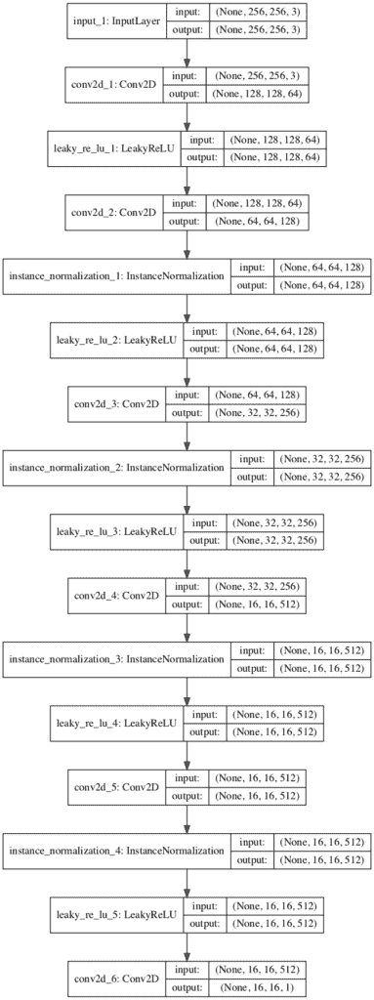
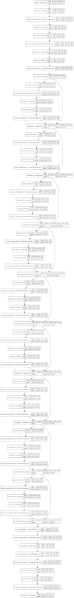

# 如何用 Keras 从零开始实现 CycleGAN 模型

> 原文：<https://machinelearningmastery.com/how-to-develop-cyclegan-models-from-scratch-with-keras/>

循环生成对抗网络，简称 CycleGAN，是一个用于将图像从一个域转换到另一个域的生成器模型。

例如，该模型可用于将马的图像转换为斑马的图像，或者将夜间城市景观的照片转换为白天的城市景观。

CycleGAN 模型的好处是可以在没有成对例子的情况下进行训练。也就是说，为了训练模型，它不需要翻译前后的照片示例，例如白天和晚上同一城市景观的照片。相反，它能够使用来自每个领域的照片集合，并提取和利用集合中图像的潜在风格来执行翻译。

这个模型给人留下了深刻的印象，但是对于初学者来说，它的架构看起来相当复杂。

在本教程中，您将发现如何使用 Keras 深度学习框架从零开始实现 CycleGAN 架构。

完成本教程后，您将知道:

*   如何实现鉴别器和生成器模型？
*   如何定义复合模型，通过对抗损失和周期损失来训练发电机模型？
*   如何实现每次训练迭代更新模型权重的训练过程？

**用我的新书[Python 生成对抗网络](https://machinelearningmastery.com/generative_adversarial_networks/)启动你的项目**，包括*分步教程*和所有示例的 *Python 源代码*文件。

我们开始吧。


如何用 Keras 从零开始开发 CycleGAN 模型
图片由 [anokarina](https://www.flickr.com/photos/anokarina/7650467088/) 提供，保留部分权利。

## 教程概述

本教程分为五个部分；它们是:

1.  什么是 CycleGAN 架构？
2.  如何实现循环根鉴别器模型
3.  如何实现循环生成器模型
4.  如何实现最小二乘和周期损失的复合模型
5.  如何更新鉴别器和生成器模型

## 什么是 CycleGAN 架构？

朱俊彦等人在 2017 年的论文《使用循环一致对抗网络的不成对图像到图像的翻译》中描述了循环根模型

模型架构由两个生成器模型组成:一个生成器(生成器-A)用于为第一个域(域-A)生成图像，第二个生成器(生成器-B)用于为第二个域(域-B)生成图像。

*   生成器-A ->域-A
*   生成器-B ->域-B

生成器模型执行图像转换，这意味着图像生成过程取决于输入图像，特别是来自另一个域的图像。生成器-A 从域-B 获取图像作为输入，生成器-B 从域-A 获取图像作为输入。

*   域-B ->生成器-A ->域-A
*   域-A ->生成器-B ->域-B

每个生成器都有相应的鉴别器模型。

第一个鉴别器模型(鉴别器-A)从域-A 获取真实图像，从生成器-A 获取生成的图像，并预测它们是真实的还是伪造的。第二个鉴别器模型(Discriminator-B)从 Domain-B 获取真实图像，从 Generator-B 获取生成的图像，并预测它们是真实的还是伪造的。

*   域-A ->鉴别器-A->[真/假]
*   域-B ->生成器-A ->鉴别器-A->[真/假]
*   域-B ->鉴别器-B->[真/假]
*   域-A ->生成器-B ->鉴别器-B->[真/假]

鉴别器和生成器模型是在一个对抗性的零和过程中训练的，就像正常的 GAN 模型一样。

生成器学会更好地欺骗鉴别器，鉴别器学会更好地检测假图像。模型一起在训练过程中找到平衡。

此外，生成器模型被正则化不仅是为了在目标域中创建新图像，而是为了从源域创建输入图像的翻译版本。这是通过将生成的图像用作相应生成器模型的输入并将输出图像与原始图像进行比较来实现的。

将图像通过两个发生器称为一个循环。每对生成器模型一起被训练以更好地再现原始源图像，这被称为周期一致性。

*   域-B ->生成器-A ->域-A ->生成器-B ->域-B
*   域-A ->生成器-B ->域-B ->生成器-A ->域-A

该体系结构还有一个称为身份映射的元素。

这是发生器被提供有作为来自目标域的输入的图像的地方，并且期望生成相同的图像而不改变。对体系结构的这种添加是可选的，尽管它会使输入图像的颜色轮廓更好地匹配。

*   领域-A ->生成器-A ->领域-A
*   域-B ->生成器-B ->域-B

既然我们已经熟悉了模型架构，我们就可以依次仔细看看每个模型，以及它们是如何实现的。

[论文](https://arxiv.org/abs/1703.10593)很好地描述了模型和训练过程，尽管[官方火炬实现](https://github.com/junyanz/CycleGAN)被用作每个模型和训练过程的最终描述，并为下面描述的模型实现提供了基础。

## 如何实现循环根鉴别器模型

鉴别器模型负责将真实或生成的图像作为输入，并预测它是真的还是假的。

鉴别器模型被实现为 PatchGAN 模型。

> 对于鉴别器网络，我们使用 70 × 70 面片，其目的是分类 70 × 70 重叠图像面片是真的还是假的。

——[使用循环一致对抗网络的不成对图像到图像转换](https://arxiv.org/abs/1703.10593)，2017。

PatchGAN 在 2016 年发表的题为“[利用马尔可夫生成对抗网络的预计算实时纹理合成”](https://arxiv.org/abs/1604.04382)的论文中进行了描述，并在 2016 年发表的题为“[利用条件对抗网络的图像到图像转换](https://arxiv.org/abs/1611.07004)的论文中描述的用于图像转换的 pix2pix 模型中使用

该架构被描述为通过对源图像的 nxn 个正方形或小块的预测进行平均来区分输入图像是真的还是假的。

> ……我们设计了一个鉴别器架构——我们称之为 PatchGAN——它只在补丁的规模上惩罚结构。这个鉴别器试图分类图像中的每个 NxN 补丁是真的还是假的。我们在图像上运行这个鉴别器卷积，平均所有响应，以提供 d 的最终输出。

——[条件对抗网络下的图像到图像转换](https://arxiv.org/abs/1611.07004)，2016。

这可以通过使用稍微标准的深度卷积鉴别器模型来直接实现。

PatchGAN 鉴别器模型可以输出预测的正方形或单通道特征图，而不是像传统的鉴别器模型那样输出单个值。70×70 是指模型对输入的有效感受野，而不是输出特征图的实际形状。

卷积层的感受野是指该层的一个输出映射到该层的输入中的像素数。有效感受野是指深度卷积模型(多层)输出中的一个像素到输入图像的映射。这里，PatchGAN 是一种基于有效感受野设计深度卷积网络的方法，其中模型的一个输出激活映射到输入图像的 70×70 块，而与输入图像的大小无关。

PatchGAN 具有预测输入图像中每个 70×70 的面片是真的还是假的效果。然后，这些预测可以被平均以给出模型的输出(如果需要的话)，或者直接与期望值(例如 0 或 1 值)的矩阵(或者向量，如果平坦的话)进行比较。

本文描述的鉴别器模型以 256×256 彩色图像作为输入，并定义了一个用于所有测试问题的显式体系结构。该架构使用了 Conv2D-instanceorm-LeakyReLU 层的块，具有 [4×4 过滤器](https://machinelearningmastery.com/convolutional-layers-for-deep-learning-neural-networks/)和 [2×2 步长](https://machinelearningmastery.com/padding-and-stride-for-convolutional-neural-networks/)。

> 让 Ck 表示一个 4×4 卷积-实例-泄漏层，带有 k 个过滤器和步长 2。在最后一层之后，我们应用卷积来产生一维输出。我们没有对第一个 C64 层使用实例表单。我们使用斜率为 0.2 的泄漏 ReLUs。

——[使用循环一致对抗网络的不成对图像到图像转换](https://arxiv.org/abs/1703.10593)，2017。

鉴别器的架构如下:

*   C64-C128-C256-C512

这在 CycleGAN 和 Pix2Pix 命名法中被称为 3 层 PatchGAN，因为排除了第一个隐藏层，该模型有三个隐藏层，可以放大或缩小以给出不同大小的 PatchGAN 模型。

该模型没有在论文中列出，它还有一个最终隐藏层 C512，其步长为[1×1](https://machinelearningmastery.com/padding-and-stride-for-convolutional-neural-networks/)，以及一个输出层 C1，其步长也为 1×1，具有线性激活功能。由于该模型主要使用 256×256 大小的图像作为输入，因此激活的输出特征图的大小为 16×16。如果使用 128×128 的图像作为输入，那么激活的输出特征图的大小将是 8×8。

模型不使用[批量归一化](https://machinelearningmastery.com/how-to-accelerate-learning-of-deep-neural-networks-with-batch-normalization/)；相反，使用实例规范化。

实例规范化在 2016 年发表的题为“[实例规范化:快速风格化的缺失要素](https://arxiv.org/abs/1607.08022)”的论文中有所描述这是一种非常简单的标准化类型，包括标准化(例如，缩放至标准高斯)每个要素图上的值。

其目的是在图像生成过程中从图像中去除特定于图像的对比度信息，从而生成更好的图像。

> 关键思想是用实例规范化层替换生成器体系结构中的批处理规范化层，并在测试时保留它们(而不是像批处理规范化那样冻结和简化它们)。直观地说，规范化过程允许从内容图像中移除特定于实例的对比度信息，这简化了生成。实际上，这导致了图像的极大改善。

——[实例规范化:快速风格化的缺失成分](https://arxiv.org/abs/1607.08022)，2016。

虽然是为生成器模型设计的，但它也可以在鉴别器模型中证明是有效的。

在 [keras-contrib 项目](https://github.com/keras-team/keras-contrib)中提供了实例规范化的实现，该项目提供了对社区提供的 keras 特性的早期访问。

keras-contrib 库可以通过 *pip* 安装，如下所示:

```py
sudo pip install git+https://www.github.com/keras-team/keras-contrib.git
```

或者，如果您使用的是 Anaconda 虚拟环境，[如 EC2 上的](https://machinelearningmastery.com/develop-evaluate-large-deep-learning-models-keras-amazon-web-services/):

```py
git clone https://www.github.com/keras-team/keras-contrib.git
cd keras-contrib
sudo ~/anaconda3/envs/tensorflow_p36/bin/python setup.py install
```

新的*实例化*层可以如下使用:

```py
...
from keras_contrib.layers.normalization.instancenormalization import InstanceNormalization
# define layer
layer = InstanceNormalization(axis=-1)
...
```

*“轴*”参数设置为-1，以确保每个要素地图的要素都是标准化的。

网络权重被初始化为标准偏差为 0.02 的高斯随机数，如对 DCGANs 更一般的描述。

> 权重由高斯分布 N (0，0.02)初始化。

——[使用循环一致对抗网络的不成对图像到图像转换](https://arxiv.org/abs/1703.10593)，2017。

使用最小二乘损失(L2)，即所谓的最小二乘生成对抗网络(LSGAN)更新鉴别器模型。

> ……我们用最小二乘损失代替负对数似然目标。这种损失在训练期间更稳定，并产生更高质量的结果。

——[使用循环一致对抗网络的不成对图像到图像转换](https://arxiv.org/abs/1703.10593)，2017。

这可以使用真实图像的类=1 和伪图像的类=0 的目标值之间的“均方误差”来实现。

此外，论文建议在训练期间将鉴别器的损失减半，以减缓鉴别器相对于生成器的更新。

> 在实践中，我们在优化 D 的同时将目标除以 2，相对于 g 的学习速度，这样会减慢 D 的学习速度。

——[使用循环一致对抗网络的不成对图像到图像转换](https://arxiv.org/abs/1703.10593)，2017。

这可以通过在编译模型时将“ *loss_weights* ”参数设置为 0.5 来实现。请注意，当更新在 [fDx_basic()函数](https://github.com/junyanz/CycleGAN/blob/master/models/cycle_gan_model.lua#L136)中定义的鉴别器模型时，该权重似乎没有在官方的 Torch 实现中实现。

在下面的例子中，我们可以用定义 PatchGAN 鉴别器的 *define_discriminator()* 函数将所有这些联系在一起。模型配置与本文附录中的描述相匹配，附加详细信息来自[Definited _ n _ layers()函数](https://github.com/junyanz/CycleGAN/blob/master/models/architectures.lua#L338)中定义的官方 Torch 实现。

```py
# example of defining a 70x70 patchgan discriminator model
from keras.optimizers import Adam
from keras.initializers import RandomNormal
from keras.models import Model
from keras.models import Input
from keras.layers import Conv2D
from keras.layers import LeakyReLU
from keras.layers import Activation
from keras.layers import Concatenate
from keras.layers import BatchNormalization
from keras_contrib.layers.normalization.instancenormalization import InstanceNormalization
from keras.utils.vis_utils import plot_model

# define the discriminator model
def define_discriminator(image_shape):
	# weight initialization
	init = RandomNormal(stddev=0.02)
	# source image input
	in_image = Input(shape=image_shape)
	# C64
	d = Conv2D(64, (4,4), strides=(2,2), padding='same', kernel_initializer=init)(in_image)
	d = LeakyReLU(alpha=0.2)(d)
	# C128
	d = Conv2D(128, (4,4), strides=(2,2), padding='same', kernel_initializer=init)(d)
	d = InstanceNormalization(axis=-1)(d)
	d = LeakyReLU(alpha=0.2)(d)
	# C256
	d = Conv2D(256, (4,4), strides=(2,2), padding='same', kernel_initializer=init)(d)
	d = InstanceNormalization(axis=-1)(d)
	d = LeakyReLU(alpha=0.2)(d)
	# C512
	d = Conv2D(512, (4,4), strides=(2,2), padding='same', kernel_initializer=init)(d)
	d = InstanceNormalization(axis=-1)(d)
	d = LeakyReLU(alpha=0.2)(d)
	# second last output layer
	d = Conv2D(512, (4,4), padding='same', kernel_initializer=init)(d)
	d = InstanceNormalization(axis=-1)(d)
	d = LeakyReLU(alpha=0.2)(d)
	# patch output
	patch_out = Conv2D(1, (4,4), padding='same', kernel_initializer=init)(d)
	# define model
	model = Model(in_image, patch_out)
	# compile model
	model.compile(loss='mse', optimizer=Adam(lr=0.0002, beta_1=0.5), loss_weights=[0.5])
	return model

# define image shape
image_shape = (256,256,3)
# create the model
model = define_discriminator(image_shape)
# summarize the model
model.summary()
# plot the model
plot_model(model, to_file='discriminator_model_plot.png', show_shapes=True, show_layer_names=True)
```

**注**:*plot _ model()*功能要求同时安装 pydot 和 pygraphviz 库。如果这是一个问题，您可以注释掉这个函数的导入和调用。

运行该示例总结了显示每个层的大小输入和输出的模型。

```py
_________________________________________________________________
Layer (type)                 Output Shape              Param #
=================================================================
input_1 (InputLayer)         (None, 256, 256, 3)       0
_________________________________________________________________
conv2d_1 (Conv2D)            (None, 128, 128, 64)      3136
_________________________________________________________________
leaky_re_lu_1 (LeakyReLU)    (None, 128, 128, 64)      0
_________________________________________________________________
conv2d_2 (Conv2D)            (None, 64, 64, 128)       131200
_________________________________________________________________
instance_normalization_1 (In (None, 64, 64, 128)       256
_________________________________________________________________
leaky_re_lu_2 (LeakyReLU)    (None, 64, 64, 128)       0
_________________________________________________________________
conv2d_3 (Conv2D)            (None, 32, 32, 256)       524544
_________________________________________________________________
instance_normalization_2 (In (None, 32, 32, 256)       512
_________________________________________________________________
leaky_re_lu_3 (LeakyReLU)    (None, 32, 32, 256)       0
_________________________________________________________________
conv2d_4 (Conv2D)            (None, 16, 16, 512)       2097664
_________________________________________________________________
instance_normalization_3 (In (None, 16, 16, 512)       1024
_________________________________________________________________
leaky_re_lu_4 (LeakyReLU)    (None, 16, 16, 512)       0
_________________________________________________________________
conv2d_5 (Conv2D)            (None, 16, 16, 512)       4194816
_________________________________________________________________
instance_normalization_4 (In (None, 16, 16, 512)       1024
_________________________________________________________________
leaky_re_lu_5 (LeakyReLU)    (None, 16, 16, 512)       0
_________________________________________________________________
conv2d_6 (Conv2D)            (None, 16, 16, 1)         8193
=================================================================
Total params: 6,962,369
Trainable params: 6,962,369
Non-trainable params: 0
_________________________________________________________________
```

还创建了模型架构图，以帮助了解图像数据通过模型的输入、输出和转换。



CycleGAN 的 PatchGAN 鉴别器模型图

## 如何实现循环生成器模型

CycleGAN 生成器模型将图像作为输入，并生成翻译后的图像作为输出。

该模型使用一系列下采样卷积块对输入图像进行编码，使用多个残差网络( [ResNet](https://machinelearningmastery.com/how-to-implement-major-architecture-innovations-for-convolutional-neural-networks/) )卷积块对图像进行变换，使用多个上采样卷积块生成输出图像。

> 让 c7s1-k 表示一个 7×7 卷积实例化的层，具有 k 个滤波器和步长 1。dk 表示一个 3×3 卷积-实例化-ReLU 层，具有 k 个过滤器和步长 2。反射填充用于减少伪像。Rk 表示包含两个 3 × 3 卷积层的剩余块，两层上的滤波器数量相同。uk 表示一个 3 × 3 的分数步长卷积实例化层，具有 k 个滤波器和步长 1/2。

——[使用循环一致对抗网络的不成对图像到图像转换](https://arxiv.org/abs/1703.10593)，2017。

128×128 图像的 6-resnet 块生成器的体系结构如下:

*   c7s1-64、d128、d256、R256、R256、R256、R256、R256、R256、u128、u64、c7s1-3

首先，我们需要一个函数来定义 ResNet 块。这些块由两个 3×3 有线电视新闻网层组成，其中块的输入按通道连接到块的输出。

这在 *resnet_block()* 函数中实现，该函数在第二个块之后创建了两个具有 3×3 过滤器和 1×1 步长的 conv-实例化块，并且没有 [ReLU 激活](https://machinelearningmastery.com/rectified-linear-activation-function-for-deep-learning-neural-networks/)，与 [build_conv_block()函数](https://github.com/junyanz/CycleGAN/blob/master/models/architectures.lua#L197)中的官方 Torch 实现相匹配。[为了简单起见，使用相同的填充](https://machinelearningmastery.com/padding-and-stride-for-convolutional-neural-networks/)代替文中推荐的反射填充。

```py
# generator a resnet block
def resnet_block(n_filters, input_layer):
	# weight initialization
	init = RandomNormal(stddev=0.02)
	# first layer convolutional layer
	g = Conv2D(n_filters, (3,3), padding='same', kernel_initializer=init)(input_layer)
	g = InstanceNormalization(axis=-1)(g)
	g = Activation('relu')(g)
	# second convolutional layer
	g = Conv2D(n_filters, (3,3), padding='same', kernel_initializer=init)(g)
	g = InstanceNormalization(axis=-1)(g)
	# concatenate merge channel-wise with input layer
	g = Concatenate()([g, input_layer])
	return g
```

接下来，我们可以定义一个函数，为 256×256 个输入图像创建 9-resnet 块版本。通过将 *image_shape* 设置为(128 x128 x3)*n _ resnet*函数参数设置为 6，可以轻松将其更改为 6-resnet 块版本。

重要的是，该模型输出的像素值与输入的形状相同，并且像素值在[-1，1]的范围内，这是 GAN 发生器模型的典型情况。

```py
# define the standalone generator model
def define_generator(image_shape=(256,256,3), n_resnet=9):
	# weight initialization
	init = RandomNormal(stddev=0.02)
	# image input
	in_image = Input(shape=image_shape)
	# c7s1-64
	g = Conv2D(64, (7,7), padding='same', kernel_initializer=init)(in_image)
	g = InstanceNormalization(axis=-1)(g)
	g = Activation('relu')(g)
	# d128
	g = Conv2D(128, (3,3), strides=(2,2), padding='same', kernel_initializer=init)(g)
	g = InstanceNormalization(axis=-1)(g)
	g = Activation('relu')(g)
	# d256
	g = Conv2D(256, (3,3), strides=(2,2), padding='same', kernel_initializer=init)(g)
	g = InstanceNormalization(axis=-1)(g)
	g = Activation('relu')(g)
	# R256
	for _ in range(n_resnet):
		g = resnet_block(256, g)
	# u128
	g = Conv2DTranspose(128, (3,3), strides=(2,2), padding='same', kernel_initializer=init)(g)
	g = InstanceNormalization(axis=-1)(g)
	g = Activation('relu')(g)
	# u64
	g = Conv2DTranspose(64, (3,3), strides=(2,2), padding='same', kernel_initializer=init)(g)
	g = InstanceNormalization(axis=-1)(g)
	g = Activation('relu')(g)
	# c7s1-3
	g = Conv2D(3, (7,7), padding='same', kernel_initializer=init)(g)
	g = InstanceNormalization(axis=-1)(g)
	out_image = Activation('tanh')(g)
	# define model
	model = Model(in_image, out_image)
	return model
```

生成器模型不是编译的，因为它是通过复合模型训练的，见下一节。

将这些联系在一起，完整的示例如下所示。

```py
# example of an encoder-decoder generator for the cyclegan
from keras.optimizers import Adam
from keras.models import Model
from keras.models import Input
from keras.layers import Conv2D
from keras.layers import Conv2DTranspose
from keras.layers import Activation
from keras.initializers import RandomNormal
from keras.layers import Concatenate
from keras_contrib.layers.normalization.instancenormalization import InstanceNormalization
from keras.utils.vis_utils import plot_model

# generator a resnet block
def resnet_block(n_filters, input_layer):
	# weight initialization
	init = RandomNormal(stddev=0.02)
	# first layer convolutional layer
	g = Conv2D(n_filters, (3,3), padding='same', kernel_initializer=init)(input_layer)
	g = InstanceNormalization(axis=-1)(g)
	g = Activation('relu')(g)
	# second convolutional layer
	g = Conv2D(n_filters, (3,3), padding='same', kernel_initializer=init)(g)
	g = InstanceNormalization(axis=-1)(g)
	# concatenate merge channel-wise with input layer
	g = Concatenate()([g, input_layer])
	return g

# define the standalone generator model
def define_generator(image_shape=(256,256,3), n_resnet=9):
	# weight initialization
	init = RandomNormal(stddev=0.02)
	# image input
	in_image = Input(shape=image_shape)
	# c7s1-64
	g = Conv2D(64, (7,7), padding='same', kernel_initializer=init)(in_image)
	g = InstanceNormalization(axis=-1)(g)
	g = Activation('relu')(g)
	# d128
	g = Conv2D(128, (3,3), strides=(2,2), padding='same', kernel_initializer=init)(g)
	g = InstanceNormalization(axis=-1)(g)
	g = Activation('relu')(g)
	# d256
	g = Conv2D(256, (3,3), strides=(2,2), padding='same', kernel_initializer=init)(g)
	g = InstanceNormalization(axis=-1)(g)
	g = Activation('relu')(g)
	# R256
	for _ in range(n_resnet):
		g = resnet_block(256, g)
	# u128
	g = Conv2DTranspose(128, (3,3), strides=(2,2), padding='same', kernel_initializer=init)(g)
	g = InstanceNormalization(axis=-1)(g)
	g = Activation('relu')(g)
	# u64
	g = Conv2DTranspose(64, (3,3), strides=(2,2), padding='same', kernel_initializer=init)(g)
	g = InstanceNormalization(axis=-1)(g)
	g = Activation('relu')(g)
	# c7s1-3
	g = Conv2D(3, (7,7), padding='same', kernel_initializer=init)(g)
	g = InstanceNormalization(axis=-1)(g)
	out_image = Activation('tanh')(g)
	# define model
	model = Model(in_image, out_image)
	return model

# create the model
model = define_generator()
# summarize the model
model.summary()
# plot the model
plot_model(model, to_file='generator_model_plot.png', show_shapes=True, show_layer_names=True)
```

运行示例首先总结模型。

```py
__________________________________________________________________________________________________
Layer (type)                    Output Shape         Param #     Connected to
==================================================================================================
input_1 (InputLayer)            (None, 256, 256, 3)  0
__________________________________________________________________________________________________
conv2d_1 (Conv2D)               (None, 256, 256, 64) 9472        input_1[0][0]
__________________________________________________________________________________________________
instance_normalization_1 (Insta (None, 256, 256, 64) 128         conv2d_1[0][0]
__________________________________________________________________________________________________
activation_1 (Activation)       (None, 256, 256, 64) 0           instance_normalization_1[0][0]
__________________________________________________________________________________________________
conv2d_2 (Conv2D)               (None, 128, 128, 128 73856       activation_1[0][0]
__________________________________________________________________________________________________
instance_normalization_2 (Insta (None, 128, 128, 128 256         conv2d_2[0][0]
__________________________________________________________________________________________________
activation_2 (Activation)       (None, 128, 128, 128 0           instance_normalization_2[0][0]
__________________________________________________________________________________________________
conv2d_3 (Conv2D)               (None, 64, 64, 256)  295168      activation_2[0][0]
__________________________________________________________________________________________________
instance_normalization_3 (Insta (None, 64, 64, 256)  512         conv2d_3[0][0]
__________________________________________________________________________________________________
activation_3 (Activation)       (None, 64, 64, 256)  0           instance_normalization_3[0][0]
__________________________________________________________________________________________________
conv2d_4 (Conv2D)               (None, 64, 64, 256)  590080      activation_3[0][0]
__________________________________________________________________________________________________
instance_normalization_4 (Insta (None, 64, 64, 256)  512         conv2d_4[0][0]
__________________________________________________________________________________________________
activation_4 (Activation)       (None, 64, 64, 256)  0           instance_normalization_4[0][0]
__________________________________________________________________________________________________
conv2d_5 (Conv2D)               (None, 64, 64, 256)  590080      activation_4[0][0]
__________________________________________________________________________________________________
instance_normalization_5 (Insta (None, 64, 64, 256)  512         conv2d_5[0][0]
__________________________________________________________________________________________________
concatenate_1 (Concatenate)     (None, 64, 64, 512)  0           instance_normalization_5[0][0]
                                                                 activation_3[0][0]
__________________________________________________________________________________________________
conv2d_6 (Conv2D)               (None, 64, 64, 256)  1179904     concatenate_1[0][0]
__________________________________________________________________________________________________
instance_normalization_6 (Insta (None, 64, 64, 256)  512         conv2d_6[0][0]
__________________________________________________________________________________________________
activation_5 (Activation)       (None, 64, 64, 256)  0           instance_normalization_6[0][0]
__________________________________________________________________________________________________
conv2d_7 (Conv2D)               (None, 64, 64, 256)  590080      activation_5[0][0]
__________________________________________________________________________________________________
instance_normalization_7 (Insta (None, 64, 64, 256)  512         conv2d_7[0][0]
__________________________________________________________________________________________________
concatenate_2 (Concatenate)     (None, 64, 64, 768)  0           instance_normalization_7[0][0]
                                                                 concatenate_1[0][0]
__________________________________________________________________________________________________
conv2d_8 (Conv2D)               (None, 64, 64, 256)  1769728     concatenate_2[0][0]
__________________________________________________________________________________________________
instance_normalization_8 (Insta (None, 64, 64, 256)  512         conv2d_8[0][0]
__________________________________________________________________________________________________
activation_6 (Activation)       (None, 64, 64, 256)  0           instance_normalization_8[0][0]
__________________________________________________________________________________________________
conv2d_9 (Conv2D)               (None, 64, 64, 256)  590080      activation_6[0][0]
__________________________________________________________________________________________________
instance_normalization_9 (Insta (None, 64, 64, 256)  512         conv2d_9[0][0]
__________________________________________________________________________________________________
concatenate_3 (Concatenate)     (None, 64, 64, 1024) 0           instance_normalization_9[0][0]
                                                                 concatenate_2[0][0]
__________________________________________________________________________________________________
conv2d_10 (Conv2D)              (None, 64, 64, 256)  2359552     concatenate_3[0][0]
__________________________________________________________________________________________________
instance_normalization_10 (Inst (None, 64, 64, 256)  512         conv2d_10[0][0]
__________________________________________________________________________________________________
activation_7 (Activation)       (None, 64, 64, 256)  0           instance_normalization_10[0][0]
__________________________________________________________________________________________________
conv2d_11 (Conv2D)              (None, 64, 64, 256)  590080      activation_7[0][0]
__________________________________________________________________________________________________
instance_normalization_11 (Inst (None, 64, 64, 256)  512         conv2d_11[0][0]
__________________________________________________________________________________________________
concatenate_4 (Concatenate)     (None, 64, 64, 1280) 0           instance_normalization_11[0][0]
                                                                 concatenate_3[0][0]
__________________________________________________________________________________________________
conv2d_12 (Conv2D)              (None, 64, 64, 256)  2949376     concatenate_4[0][0]
__________________________________________________________________________________________________
instance_normalization_12 (Inst (None, 64, 64, 256)  512         conv2d_12[0][0]
__________________________________________________________________________________________________
activation_8 (Activation)       (None, 64, 64, 256)  0           instance_normalization_12[0][0]
__________________________________________________________________________________________________
conv2d_13 (Conv2D)              (None, 64, 64, 256)  590080      activation_8[0][0]
__________________________________________________________________________________________________
instance_normalization_13 (Inst (None, 64, 64, 256)  512         conv2d_13[0][0]
__________________________________________________________________________________________________
concatenate_5 (Concatenate)     (None, 64, 64, 1536) 0           instance_normalization_13[0][0]
                                                                 concatenate_4[0][0]
__________________________________________________________________________________________________
conv2d_14 (Conv2D)              (None, 64, 64, 256)  3539200     concatenate_5[0][0]
__________________________________________________________________________________________________
instance_normalization_14 (Inst (None, 64, 64, 256)  512         conv2d_14[0][0]
__________________________________________________________________________________________________
activation_9 (Activation)       (None, 64, 64, 256)  0           instance_normalization_14[0][0]
__________________________________________________________________________________________________
conv2d_15 (Conv2D)              (None, 64, 64, 256)  590080      activation_9[0][0]
__________________________________________________________________________________________________
instance_normalization_15 (Inst (None, 64, 64, 256)  512         conv2d_15[0][0]
__________________________________________________________________________________________________
concatenate_6 (Concatenate)     (None, 64, 64, 1792) 0           instance_normalization_15[0][0]
                                                                 concatenate_5[0][0]
__________________________________________________________________________________________________
conv2d_16 (Conv2D)              (None, 64, 64, 256)  4129024     concatenate_6[0][0]
__________________________________________________________________________________________________
instance_normalization_16 (Inst (None, 64, 64, 256)  512         conv2d_16[0][0]
__________________________________________________________________________________________________
activation_10 (Activation)      (None, 64, 64, 256)  0           instance_normalization_16[0][0]
__________________________________________________________________________________________________
conv2d_17 (Conv2D)              (None, 64, 64, 256)  590080      activation_10[0][0]
__________________________________________________________________________________________________
instance_normalization_17 (Inst (None, 64, 64, 256)  512         conv2d_17[0][0]
__________________________________________________________________________________________________
concatenate_7 (Concatenate)     (None, 64, 64, 2048) 0           instance_normalization_17[0][0]
                                                                 concatenate_6[0][0]
__________________________________________________________________________________________________
conv2d_18 (Conv2D)              (None, 64, 64, 256)  4718848     concatenate_7[0][0]
__________________________________________________________________________________________________
instance_normalization_18 (Inst (None, 64, 64, 256)  512         conv2d_18[0][0]
__________________________________________________________________________________________________
activation_11 (Activation)      (None, 64, 64, 256)  0           instance_normalization_18[0][0]
__________________________________________________________________________________________________
conv2d_19 (Conv2D)              (None, 64, 64, 256)  590080      activation_11[0][0]
__________________________________________________________________________________________________
instance_normalization_19 (Inst (None, 64, 64, 256)  512         conv2d_19[0][0]
__________________________________________________________________________________________________
concatenate_8 (Concatenate)     (None, 64, 64, 2304) 0           instance_normalization_19[0][0]
                                                                 concatenate_7[0][0]
__________________________________________________________________________________________________
conv2d_20 (Conv2D)              (None, 64, 64, 256)  5308672     concatenate_8[0][0]
__________________________________________________________________________________________________
instance_normalization_20 (Inst (None, 64, 64, 256)  512         conv2d_20[0][0]
__________________________________________________________________________________________________
activation_12 (Activation)      (None, 64, 64, 256)  0           instance_normalization_20[0][0]
__________________________________________________________________________________________________
conv2d_21 (Conv2D)              (None, 64, 64, 256)  590080      activation_12[0][0]
__________________________________________________________________________________________________
instance_normalization_21 (Inst (None, 64, 64, 256)  512         conv2d_21[0][0]
__________________________________________________________________________________________________
concatenate_9 (Concatenate)     (None, 64, 64, 2560) 0           instance_normalization_21[0][0]
                                                                 concatenate_8[0][0]
__________________________________________________________________________________________________
conv2d_transpose_1 (Conv2DTrans (None, 128, 128, 128 2949248     concatenate_9[0][0]
__________________________________________________________________________________________________
instance_normalization_22 (Inst (None, 128, 128, 128 256         conv2d_transpose_1[0][0]
__________________________________________________________________________________________________
activation_13 (Activation)      (None, 128, 128, 128 0           instance_normalization_22[0][0]
__________________________________________________________________________________________________
conv2d_transpose_2 (Conv2DTrans (None, 256, 256, 64) 73792       activation_13[0][0]
__________________________________________________________________________________________________
instance_normalization_23 (Inst (None, 256, 256, 64) 128         conv2d_transpose_2[0][0]
__________________________________________________________________________________________________
activation_14 (Activation)      (None, 256, 256, 64) 0           instance_normalization_23[0][0]
__________________________________________________________________________________________________
conv2d_22 (Conv2D)              (None, 256, 256, 3)  9411        activation_14[0][0]
__________________________________________________________________________________________________
instance_normalization_24 (Inst (None, 256, 256, 3)  6           conv2d_22[0][0]
__________________________________________________________________________________________________
activation_15 (Activation)      (None, 256, 256, 3)  0           instance_normalization_24[0][0]
==================================================================================================
Total params: 35,276,553
Trainable params: 35,276,553
Non-trainable params: 0
__________________________________________________________________________________________________
```

还会创建一个生成器模型图，显示 ResNet 块中的跳过连接。



自行车发电机模型图

## 如何实现最小二乘和周期损失的复合模型

发电机型号不会直接更新。相反，发电机模型通过复合模型更新。

每个生成器模型的更新都涉及基于四个关注点的模型权重更改:

*   对抗性损失(L2 或均方误差)。
*   身份损失(L1 或平均绝对误差)。
*   正向周期损失(L1 或平均绝对误差)。
*   反向循环损失(L1 或平均绝对误差)。

对抗损失是通过鉴别器更新生成器的标准方法，尽管在这种情况下，使用最小二乘损失函数代替负对数似然(例如[二进制交叉熵](https://machinelearningmastery.com/how-to-choose-loss-functions-when-training-deep-learning-neural-networks/))。

首先，我们可以使用我们的函数来定义 CycleGAN 中使用的两个生成器和两个鉴别器。

```py
...
# input shape
image_shape = (256,256,3)
# generator: A -> B
g_model_AtoB = define_generator(image_shape)
# generator: B -> A
g_model_BtoA = define_generator(image_shape)
# discriminator: A -> [real/fake]
d_model_A = define_discriminator(image_shape)
# discriminator: B -> [real/fake]
d_model_B = define_discriminator(image_shape)
```

每个只负责更新生成器模型权重的生成器模型都需要一个复合模型，尽管需要与相关的鉴别器模型和其他生成器模型共享权重。

这可以通过在复合模型的上下文中将其他模型的权重标记为不可训练来实现，以确保我们只更新预期的生成器。

```py
...
# ensure the model we're updating is trainable
g_model_1.trainable = True
# mark discriminator as not trainable
d_model.trainable = False
# mark other generator model as not trainable
g_model_2.trainable = False
```

模型可以使用 [Keras 函数 API](https://machinelearningmastery.com/keras-functional-api-deep-learning/) 分段构建。

第一步是从源域定义真实图像的输入，通过我们的生成器模型，然后将生成器的输出连接到鉴别器，并将其分类为真实或虚假。

```py
...
# discriminator element
input_gen = Input(shape=image_shape)
gen1_out = g_model_1(input_gen)
output_d = d_model(gen1_out)
```

接下来，我们可以将身份映射元素与来自目标域的真实图像的新输入连接起来，通过我们的生成器模型传递它，并直接输出(希望)未翻译的图像。

```py
...
# identity element
input_id = Input(shape=image_shape)
output_id = g_model_1(input_id)
```

到目前为止，我们有一个复合模型，有两个真实图像输入和一个鉴别器分类和身份图像输出。接下来，我们需要添加正向和反向循环。

正向循环可以通过将我们的发电机的输出连接到另一个发电机来实现，另一个发电机的输出可以与我们的发电机的输入进行比较，并且应该相同。

```py
...
# forward cycle
output_f = g_model_2(gen1_out)
```

后向循环更复杂，涉及来自目标域的真实图像的输入通过另一个生成器，然后通过我们的生成器，该生成器应该匹配来自目标域的真实图像。

```py
...
# backward cycle
gen2_out = g_model_2(input_id)
output_b = g_model_1(gen2_out)
```

就这样。

然后，我们可以用两个输入定义这个复合模型:一个真实图像用于源域和目标域，四个输出，一个用于鉴别器，一个用于身份映射生成器，一个用于正向循环的另一个生成器，一个来自反向循环的生成器。

```py
...
# define model graph
model = Model([input_gen, input_id], [output_d, output_id, output_f, output_b])
```

鉴频器输出的对抗性损失使用最小二乘损失，它被实现为 L2 或均方误差。发生器的输出与图像进行比较，并使用平均绝对误差实现的 L1 损耗进行优化。

生成器被更新为四个损失值的加权平均值。对抗损失通常被加权，而前向和后向循环损失使用称为*λ*的参数加权，并被设置为 10，例如比对抗损失重要 10 倍。身份丢失也作为 lambda 参数的一部分进行加权，在官方 Torch 实现中设置为 0.5 * 10 或 5。

```py
...
# compile model with weighting of least squares loss and L1 loss
model.compile(loss=['mse', 'mae', 'mae', 'mae'], loss_weights=[1, 5, 10, 10], optimizer=opt)
```

我们可以将所有这些联系在一起，并定义函数 *define_composite_model()* 来创建一个复合模型，用于训练给定的生成器模型。

```py
# define a composite model for updating generators by adversarial and cycle loss
def define_composite_model(g_model_1, d_model, g_model_2, image_shape):
	# ensure the model we're updating is trainable
	g_model_1.trainable = True
	# mark discriminator as not trainable
	d_model.trainable = False
	# mark other generator model as not trainable
	g_model_2.trainable = False
	# discriminator element
	input_gen = Input(shape=image_shape)
	gen1_out = g_model_1(input_gen)
	output_d = d_model(gen1_out)
	# identity element
	input_id = Input(shape=image_shape)
	output_id = g_model_1(input_id)
	# forward cycle
	output_f = g_model_2(gen1_out)
	# backward cycle
	gen2_out = g_model_2(input_id)
	output_b = g_model_1(gen2_out)
	# define model graph
	model = Model([input_gen, input_id], [output_d, output_id, output_f, output_b])
	# define optimization algorithm configuration
	opt = Adam(lr=0.0002, beta_1=0.5)
	# compile model with weighting of least squares loss and L1 loss
	model.compile(loss=['mse', 'mae', 'mae', 'mae'], loss_weights=[1, 5, 10, 10], optimizer=opt)
	return model
```

然后可以调用该函数来准备一个复合模型，用于训练 *g_model_AtoB* 发电机模型和 *g_model_BtoA* 模型；例如:

```py
...
# composite: A -> B -> [real/fake, A]
c_model_AtoBtoA = define_composite_model(g_model_AtoB, d_model_B, g_model_BtoA, image_shape)
# composite: B -> A -> [real/fake, B]
c_model_BtoAtoB = define_composite_model(g_model_BtoA, d_model_A, g_model_AtoB, image_shape)
```

总结和绘制复合模型有点混乱，因为它无助于清楚地看到模型的输入和输出。

我们可以总结以下每个复合模型的输入和输出。回想一下，如果一个给定的模型在复合模型中被使用了不止一次，那么我们就是在共享或重用同一组权重。

**发电机-复合模型**

只有发电机-A 砝码是可训练的，其他型号的砝码是不可训练的。

*   **对抗损失**:域-B - >生成器-A - >域-A - >鉴别器-A - >【真/假】
*   **身份丢失**:域-A - >生成器-A - >域-A
*   **正向循环损耗**:域-B - >发电机-A - >域-A - >发电机-B - >域-B
*   **反向循环损耗**:域-A - >发电机-B - >域-B - >发电机-A - >域-A

**发电机-B 复合模型**

只有发电机 B 的重量是可训练的，其他型号的重量是不可训练的。

*   **对抗损失**:域-A - >生成器-B - >域-B - >鉴别器-B - >【真/假】
*   **身份丢失**:域-B - >生成器-B - >域-B
*   **正向循环损耗**:域-A - >发电机-B - >域-B - >发电机-A - >域-A
*   **反向循环损耗**:域-B - >发电机-A - >域-A - >发电机-B - >域-B

为了完整起见，下面列出了创建所有模型的完整示例。

```py
# example of defining composite models for training cyclegan generators
from keras.optimizers import Adam
from keras.models import Model
from keras.models import Sequential
from keras.models import Input
from keras.layers import Conv2D
from keras.layers import Conv2DTranspose
from keras.layers import Activation
from keras.layers import LeakyReLU
from keras.initializers import RandomNormal
from keras.layers import Concatenate
from keras_contrib.layers.normalization.instancenormalization import InstanceNormalization
from keras.utils.vis_utils import plot_model

# define the discriminator model
def define_discriminator(image_shape):
	# weight initialization
	init = RandomNormal(stddev=0.02)
	# source image input
	in_image = Input(shape=image_shape)
	# C64
	d = Conv2D(64, (4,4), strides=(2,2), padding='same', kernel_initializer=init)(in_image)
	d = LeakyReLU(alpha=0.2)(d)
	# C128
	d = Conv2D(128, (4,4), strides=(2,2), padding='same', kernel_initializer=init)(d)
	d = InstanceNormalization(axis=-1)(d)
	d = LeakyReLU(alpha=0.2)(d)
	# C256
	d = Conv2D(256, (4,4), strides=(2,2), padding='same', kernel_initializer=init)(d)
	d = InstanceNormalization(axis=-1)(d)
	d = LeakyReLU(alpha=0.2)(d)
	# C512
	d = Conv2D(512, (4,4), strides=(2,2), padding='same', kernel_initializer=init)(d)
	d = InstanceNormalization(axis=-1)(d)
	d = LeakyReLU(alpha=0.2)(d)
	# second last output layer
	d = Conv2D(512, (4,4), padding='same', kernel_initializer=init)(d)
	d = InstanceNormalization(axis=-1)(d)
	d = LeakyReLU(alpha=0.2)(d)
	# patch output
	patch_out = Conv2D(1, (4,4), padding='same', kernel_initializer=init)(d)
	# define model
	model = Model(in_image, patch_out)
	# compile model
	model.compile(loss='mse', optimizer=Adam(lr=0.0002, beta_1=0.5), loss_weights=[0.5])
	return model

# generator a resnet block
def resnet_block(n_filters, input_layer):
	# weight initialization
	init = RandomNormal(stddev=0.02)
	# first layer convolutional layer
	g = Conv2D(n_filters, (3,3), padding='same', kernel_initializer=init)(input_layer)
	g = InstanceNormalization(axis=-1)(g)
	g = Activation('relu')(g)
	# second convolutional layer
	g = Conv2D(n_filters, (3,3), padding='same', kernel_initializer=init)(g)
	g = InstanceNormalization(axis=-1)(g)
	# concatenate merge channel-wise with input layer
	g = Concatenate()([g, input_layer])
	return g

# define the standalone generator model
def define_generator(image_shape, n_resnet=9):
	# weight initialization
	init = RandomNormal(stddev=0.02)
	# image input
	in_image = Input(shape=image_shape)
	# c7s1-64
	g = Conv2D(64, (7,7), padding='same', kernel_initializer=init)(in_image)
	g = InstanceNormalization(axis=-1)(g)
	g = Activation('relu')(g)
	# d128
	g = Conv2D(128, (3,3), strides=(2,2), padding='same', kernel_initializer=init)(g)
	g = InstanceNormalization(axis=-1)(g)
	g = Activation('relu')(g)
	# d256
	g = Conv2D(256, (3,3), strides=(2,2), padding='same', kernel_initializer=init)(g)
	g = InstanceNormalization(axis=-1)(g)
	g = Activation('relu')(g)
	# R256
	for _ in range(n_resnet):
		g = resnet_block(256, g)
	# u128
	g = Conv2DTranspose(128, (3,3), strides=(2,2), padding='same', kernel_initializer=init)(g)
	g = InstanceNormalization(axis=-1)(g)
	g = Activation('relu')(g)
	# u64
	g = Conv2DTranspose(64, (3,3), strides=(2,2), padding='same', kernel_initializer=init)(g)
	g = InstanceNormalization(axis=-1)(g)
	g = Activation('relu')(g)
	# c7s1-3
	g = Conv2D(3, (7,7), padding='same', kernel_initializer=init)(g)
	g = InstanceNormalization(axis=-1)(g)
	out_image = Activation('tanh')(g)
	# define model
	model = Model(in_image, out_image)
	return model

# define a composite model for updating generators by adversarial and cycle loss
def define_composite_model(g_model_1, d_model, g_model_2, image_shape):
	# ensure the model we're updating is trainable
	g_model_1.trainable = True
	# mark discriminator as not trainable
	d_model.trainable = False
	# mark other generator model as not trainable
	g_model_2.trainable = False
	# discriminator element
	input_gen = Input(shape=image_shape)
	gen1_out = g_model_1(input_gen)
	output_d = d_model(gen1_out)
	# identity element
	input_id = Input(shape=image_shape)
	output_id = g_model_1(input_id)
	# forward cycle
	output_f = g_model_2(gen1_out)
	# backward cycle
	gen2_out = g_model_2(input_id)
	output_b = g_model_1(gen2_out)
	# define model graph
	model = Model([input_gen, input_id], [output_d, output_id, output_f, output_b])
	# define optimization algorithm configuration
	opt = Adam(lr=0.0002, beta_1=0.5)
	# compile model with weighting of least squares loss and L1 loss
	model.compile(loss=['mse', 'mae', 'mae', 'mae'], loss_weights=[1, 5, 10, 10], optimizer=opt)
	return model

# input shape
image_shape = (256,256,3)
# generator: A -> B
g_model_AtoB = define_generator(image_shape)
# generator: B -> A
g_model_BtoA = define_generator(image_shape)
# discriminator: A -> [real/fake]
d_model_A = define_discriminator(image_shape)
# discriminator: B -> [real/fake]
d_model_B = define_discriminator(image_shape)
# composite: A -> B -> [real/fake, A]
c_model_AtoB = define_composite_model(g_model_AtoB, d_model_B, g_model_BtoA, image_shape)
# composite: B -> A -> [real/fake, B]
c_model_BtoA = define_composite_model(g_model_BtoA, d_model_A, g_model_AtoB, image_shape)
```

## 如何更新鉴别器和生成器模型

训练定义的模型相对简单。

首先，我们必须定义一个助手函数，它将选择一批真实图像和相关的目标(1.0)。

```py
# select a batch of random samples, returns images and target
def generate_real_samples(dataset, n_samples, patch_shape):
	# choose random instances
	ix = randint(0, dataset.shape[0], n_samples)
	# retrieve selected images
	X = dataset[ix]
	# generate 'real' class labels (1)
	y = ones((n_samples, patch_shape, patch_shape, 1))
	return X, y
```

同样，我们需要一个函数来生成一批假图像和相关的目标(0.0)。

```py
# generate a batch of images, returns images and targets
def generate_fake_samples(g_model, dataset, patch_shape):
	# generate fake instance
	X = g_model.predict(dataset)
	# create 'fake' class labels (0)
	y = zeros((len(X), patch_shape, patch_shape, 1))
	return X, y
```

现在，我们可以定义单次训练迭代的步骤。我们将基于官方 Torch 实现中的实现在 [OptimizeParameters()函数](https://github.com/junyanz/CycleGAN/blob/master/models/cycle_gan_model.lua#L230) ( **注**:官方代码使用了更加混乱的倒排命名约定)中对更新的顺序进行建模。

1.  更新生成器-B (A->B)
2.  更新鉴别器-B
3.  更新生成器-A (B->A)
4.  更新鉴别器-A

首先，我们必须通过调用*为域-A 和域-B 生成 _real_samples()* 来选择一批真实图像。

通常，批次大小( *n_batch* )设置为 1。在这种情况下，我们将假设 256×256 个输入图像，这意味着用于 PatchGAN 鉴别器的 *n_patch* 将是 16。

```py
...
# select a batch of real samples
X_realA, y_realA = generate_real_samples(trainA, n_batch, n_patch)
X_realB, y_realB = generate_real_samples(trainB, n_batch, n_patch)
```

接下来，我们可以使用所选的真实图像批次来生成相应批次的生成图像或假图像。

```py
...
# generate a batch of fake samples
X_fakeA, y_fakeA = generate_fake_samples(g_model_BtoA, X_realB, n_patch)
X_fakeB, y_fakeB = generate_fake_samples(g_model_AtoB, X_realA, n_patch)
```

该论文描述了使用先前生成的图像池，从中随机选择示例并用于更新鉴别器模型，其中池大小被设置为 50 个图像。

> …[我们]使用生成图像的历史来更新鉴别器，而不是使用最新的生成器生成的图像。我们保留了一个图像缓冲区，用于存储 50 个先前创建的图像。

——[使用循环一致对抗网络的不成对图像到图像转换](https://arxiv.org/abs/1703.10593)，2017。

这可以通过使用每个域的列表和使用函数填充池来实现，然后在池达到容量时随机替换池中的元素。

下面的 *update_image_pool()* 功能是基于 [image_pool.lua](https://github.com/junyanz/CycleGAN/blob/master/util/image_pool.lua) 中的官方 Torch 实现实现的。

```py
# update image pool for fake images
def update_image_pool(pool, images, max_size=50):
	selected = list()
	for image in images:
		if len(pool) < max_size:
			# stock the pool
			pool.append(image)
			selected.append(image)
		elif random() < 0.5:
			# use image, but don't add it to the pool
			selected.append(image)
		else:
			# replace an existing image and use replaced image
			ix = randint(0, len(pool))
			selected.append(pool[ix])
			pool[ix] = image
	return asarray(selected)
```

然后，我们可以用生成的假图像更新我们的图像池，其结果可以用来训练鉴别器模型。

```py
...
# update fakes from pool
X_fakeA = update_image_pool(poolA, X_fakeA)
X_fakeB = update_image_pool(poolB, X_fakeB)
```

接下来，我们可以更新生成器-A。

*train_on_batch()* 函数将为四个损失函数中的每一个返回一个值，每个输出一个值，以及用于更新我们感兴趣的模型权重的加权和(第一个值)。

```py
...
# update generator B->A via adversarial and cycle loss
g_loss2, _, _, _, _  = c_model_BtoA.train_on_batch([X_realB, X_realA], [y_realA, X_realA, X_realB, X_realA])
```

然后，我们可以使用可能来自或可能不来自图像池的假图像来更新鉴别器模型。

```py
...
# update discriminator for A -> [real/fake]
dA_loss1 = d_model_A.train_on_batch(X_realA, y_realA)
dA_loss2 = d_model_A.train_on_batch(X_fakeA, y_fakeA)
```

然后，我们可以对其他生成器和鉴别器模型进行同样的操作。

```py
...
# update generator A->B via adversarial and cycle loss
g_loss1, _, _, _, _ = c_model_AtoB.train_on_batch([X_realA, X_realB], [y_realB, X_realB, X_realA, X_realB])
# update discriminator for B -> [real/fake]
dB_loss1 = d_model_B.train_on_batch(X_realB, y_realB)
dB_loss2 = d_model_B.train_on_batch(X_fakeB, y_fakeB)
```

在训练运行结束时，我们可以报告真实和虚假图像上的鉴别器模型以及每个生成器模型的当前损失。

```py
...
# summarize performance
print('>%d, dA[%.3f,%.3f] dB[%.3f,%.3f] g[%.3f,%.3f]' % (i+1, dA_loss1,dA_loss2, dB_loss1,dB_loss2, g_loss1,g_loss2))
```

将这些联系在一起，我们可以定义一个名为 *train()* 的函数，该函数获取每个已定义模型的一个实例和一个加载的数据集(两个 NumPy 数组的列表，每个域一个)，并训练该模型。

如本文所述，使用批量 1，模型适合 100 个训练时期。

```py
# train cyclegan models
def train(d_model_A, d_model_B, g_model_AtoB, g_model_BtoA, c_model_AtoB, c_model_BtoA, dataset):
	# define properties of the training run
	n_epochs, n_batch, = 100, 1
	# determine the output square shape of the discriminator
	n_patch = d_model_A.output_shape[1]
	# unpack dataset
	trainA, trainB = dataset
	# prepare image pool for fakes
	poolA, poolB = list(), list()
	# calculate the number of batches per training epoch
	bat_per_epo = int(len(trainA) / n_batch)
	# calculate the number of training iterations
	n_steps = bat_per_epo * n_epochs
	# manually enumerate epochs
	for i in range(n_steps):
		# select a batch of real samples
		X_realA, y_realA = generate_real_samples(trainA, n_batch, n_patch)
		X_realB, y_realB = generate_real_samples(trainB, n_batch, n_patch)
		# generate a batch of fake samples
		X_fakeA, y_fakeA = generate_fake_samples(g_model_BtoA, X_realB, n_patch)
		X_fakeB, y_fakeB = generate_fake_samples(g_model_AtoB, X_realA, n_patch)
		# update fakes from pool
		X_fakeA = update_image_pool(poolA, X_fakeA)
		X_fakeB = update_image_pool(poolB, X_fakeB)
		# update generator B->A via adversarial and cycle loss
		g_loss2, _, _, _, _  = c_model_BtoA.train_on_batch([X_realB, X_realA], [y_realA, X_realA, X_realB, X_realA])
		# update discriminator for A -> [real/fake]
		dA_loss1 = d_model_A.train_on_batch(X_realA, y_realA)
		dA_loss2 = d_model_A.train_on_batch(X_fakeA, y_fakeA)
		# update generator A->B via adversarial and cycle loss
		g_loss1, _, _, _, _ = c_model_AtoB.train_on_batch([X_realA, X_realB], [y_realB, X_realB, X_realA, X_realB])
		# update discriminator for B -> [real/fake]
		dB_loss1 = d_model_B.train_on_batch(X_realB, y_realB)
		dB_loss2 = d_model_B.train_on_batch(X_fakeB, y_fakeB)
		# summarize performance
		print('>%d, dA[%.3f,%.3f] dB[%.3f,%.3f] g[%.3f,%.3f]' % (i+1, dA_loss1,dA_loss2, dB_loss1,dB_loss2, g_loss1,g_loss2))
```

然后可以用我们定义的模型和加载的数据集直接调用训练函数。

```py
...
# load a dataset as a list of two numpy arrays
dataset = ...
# train models
train(d_model_A, d_model_B, g_model_AtoB, g_model_BtoA, c_model_AtoB, c_model_BtoA, dataset)
```

作为一种改进，可能希望将对每个鉴别器模型的更新组合成单个操作，如在官方实现的 [fDx_basic()函数](https://github.com/junyanz/CycleGAN/blob/master/models/cycle_gan_model.lua#L136)中执行的那样。

此外，该论文描述了在另外 100 个时期(总共 200 个)更新模型，其中学习率衰减到 0.0。这也可以作为培训过程的一个小的扩展。

## 进一步阅读

如果您想更深入地了解这个主题，本节将提供更多资源。

### 报纸

*   [使用循环一致对抗网络的不成对图像到图像转换](https://arxiv.org/abs/1703.10593)，2017。
*   [实时风格转移和超分辨率的感知损失](https://arxiv.org/abs/1603.08155)，2016。
*   [条件对抗网络下的图像到图像转换](https://arxiv.org/abs/1611.07004)，2016。
*   [最小二乘生成对抗网络](https://arxiv.org/abs/1611.04076)，2016。
*   [用马尔可夫生成对抗网络预计算实时纹理合成](https://arxiv.org/abs/1604.04382)，2016。
*   [实例规范化:快速风格化的缺失成分](https://arxiv.org/abs/1607.08022)
*   [层归一化](https://arxiv.org/abs/1607.06450)

### 应用程序接口

*   [响亮的 API](https://keras.io/) 。
*   [keras-contrib : Keras 社区贡献，GitHub](https://github.com/keras-team/keras-contrib) 。

### 项目

*   [吉通网 CycleGAN 项目(官方)](https://github.com/junyanz/CycleGAN/)
*   [py torch-cycle gan-and-pix2pix(官方)，GitHub](https://github.com/junyanz/pytorch-CycleGAN-and-pix2pix) 。
*   [循环干项目页面(官方)](https://junyanz.github.io/CycleGAN/)
*   [Keras-GAN:生成对抗网络的 Keras 实现](https://github.com/eriklindernoren/Keras-GAN)。
*   [CycleGAN-Keras:使用 tensorflow 后端](https://github.com/simontomaskarlsson/CycleGAN-Keras)实现 CycleGAN 的 Keras。
*   [cyclegan-keras: keras 实现 cycle gan](https://github.com/MingwangLin/cyclegan-keras)

### 文章

*   [提问:PatchGAN 鉴别器](https://github.com/junyanz/pytorch-CycleGAN-and-pix2pix/issues/39)。
*   [感受野计算器](https://fomoro.com/projects/project/receptive-field-calculator)

## 摘要

在本教程中，您发现了如何使用 Keras 深度学习框架从零开始实现 CycleGAN 架构。

具体来说，您了解到:

*   如何实现鉴别器和生成器模型？
*   如何定义复合模型，通过对抗损失和周期损失来训练发电机模型？
*   如何实现每次训练迭代更新模型权重的训练过程？

你有什么问题吗？
在下面的评论中提问，我会尽力回答。