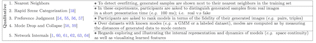
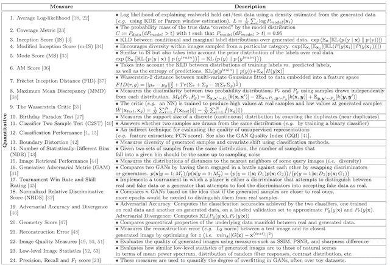

# 如何评估生成对抗网络

> 原文：<https://machinelearningmastery.com/how-to-evaluate-generative-adversarial-networks/>

[生成对抗网络](https://machinelearningmastery.com/what-are-generative-adversarial-networks-gans/)，简称 GANs，是开发生成模型的有效深度学习方法。

与用损失函数训练直到收敛的其他深度学习神经网络模型不同，GAN 生成器模型是使用称为鉴别器的第二个模型训练的，该模型学习将图像分类为真实的或生成的。发生器和鉴别器模型被一起训练以保持平衡。

因此，不存在用于训练 GAN 发生器模型的[目标损失函数](https://machinelearningmastery.com/loss-and-loss-functions-for-training-deep-learning-neural-networks/)，也没有办法仅从损失来客观地评估训练的进度和模型的相对或绝对质量。

相反，已经开发了一套定性和定量技术来基于生成的合成图像的质量和多样性来评估 GAN 模型的表现。

在这篇文章中，你将发现基于生成的合成图像评估生成对抗网络模型的技术。

看完这篇文章，你会知道:

*   在训练 GAN 发生器模型时没有使用目标函数，这意味着必须使用生成的合成图像的质量来评估模型。
*   开始时，手动检查生成的图像是一个很好的起点。
*   定量测量，如初始得分和 Frechet 初始距离，可以与定性评估相结合，以提供对 GAN 模型的稳健评估。

**用我的新书[Python 生成对抗网络](https://machinelearningmastery.com/generative_adversarial_networks/)启动你的项目**，包括*分步教程*和所有示例的 *Python 源代码*文件。

我们开始吧。

如何评估生成对抗网络
卡罗尔·范胡克摄，版权所有。

## 概观

本教程分为五个部分；它们是:

1.  评估 GAN 发电机模型的问题
2.  人工 GAN 发生器评估
3.  定性 GAN 发生器评估
4.  GAN 发生器的定量评估
5.  使用哪种 GAN 评估方案

## 评估 GAN 发电机模型的问题

生成对抗网络是一种基于深度学习的生成模型。

事实证明，在一系列问题领域中，GANs 在生成高质量和大型合成图像方面都非常有效。

生成器模型不是直接训练的，而是由第二个模型训练的，称为鉴别器，它学习区分真实图像和伪造或生成的图像。因此，发电机模型没有目标函数或目标度量。

> 生成对抗网络缺乏目标函数，使得不同模型的表现难以比较。

——[训练 GANs 的改进技术](https://arxiv.org/abs/1606.03498)，2016 年。

这意味着没有一个普遍认可的方法来评估一个给定的 GAN 发电机模型。

这是 GANs 研究和使用的一个问题；例如，当:

*   在训练过程中选择最终的 GAN 发生器模型。
*   选择生成的图像来演示 GAN 发电机模型的能力。
*   比较 GAN 模型架构。
*   比较 GAN 模型配置。

GAN 发电机模型的客观评估仍然是一个开放的问题。

> 虽然已经引入了几个衡量标准，但到目前为止，对于哪一个衡量标准最能体现模型的优势和局限性以及应用于公平的模型比较，还没有达成共识。

——[GAN 评估办法的利弊](https://arxiv.org/abs/1802.03446)，2018 年。

因此，GAN 生成器模型是基于生成的图像质量来评估的，通常是在目标问题域的背景下。

## 人工 GAN 发生器评估

许多 GAN 从业者通过人工评估由发电机模型合成的图像，重新开始评估 GAN 发电机。

这包括使用生成器模型创建一批合成图像，然后评估与目标域相关的图像的质量和多样性。

这可以由研究人员或从业者自己完成。

> 人类对样本的视觉检查是评估肝组织最常见和最直观的方法之一。

——[GAN 评估办法的利弊](https://arxiv.org/abs/1802.03446)，2018 年。

生成器模型在许多训练时期内被迭代训练。由于没有对模型表现的客观衡量，我们无法知道何时应该停止训练过程，以及何时应该保存一个[最终模型](https://machinelearningmastery.com/train-final-machine-learning-model/)以备后用。

因此，通常在训练期间使用模型的当前状态来生成大量合成图像，并保存用于生成图像的生成器的当前状态。这允许通过生成的图像对每个保存的发电机模型进行事后评估。

一个训练时期是指用于更新模型的训练数据集中的图像的一个循环。模型可以跨训练时期系统地保存，例如每一个、五个、十个或更多训练时期。

尽管人工检查是模型评估的最简单方法，但它有许多局限性，包括:

*   它是主观的，包括评审者对模型、模型配置和项目目标的偏见。
*   它需要了解什么是现实的，什么不是目标领域的。
*   它仅限于在合理的时间内可以查看的图像数量。

> ……用人类视觉评估生成图像的质量既昂贵又麻烦，有失偏颇【……】难以重现，也不能完全反映模型的容量。

——[GAN 评估办法的利弊](https://arxiv.org/abs/1802.03446)，2018 年。

几乎确定性的主观性质导致有偏见的模型选择和樱桃采摘，不应该用于非琐碎项目的最终模型选择。

然而，这是从业者熟悉该技术的起点。

令人欣慰的是，已经提出并采用了更复杂的 GAN 发生器评估方法。

有关详细调查，请参见 2018 年题为“GAN 评估措施的利弊”的论文本文将 GAN 发电机模型评估分为定性和定量措施，我们将在以下章节中使用这种划分来回顾其中的一些措施。

## 定性 GAN 发生器评估

定性度量是那些非数字的度量，通常涉及人的主观评估或通过比较进行的评估。

下面列出了评估 GAN 发电机模型的五种定性技术。

1.  最近的邻居。
2.  快速场景分类。
3.  评级和偏好判断。
4.  评估模式删除和模式折叠。
5.  调查和可视化网络内部。

定性 GAN 发生器评估方法总结
摘自:GAN 评估措施的利弊。

也许最常用的定性 GAN 生成器模型是被称为“*评级和偏好判断*”的手动图像检查的扩展

> 这些类型的实验要求受试者根据生成图像的保真度对模型进行评分。

——[GAN 评估办法的利弊](https://arxiv.org/abs/1802.03446)，2018 年。

这是人类评委被要求对真实图像和从该领域生成的图像进行排序或比较的地方。

“*快速场景分类*”方法大体相同，尽管图像呈现给人类评委的时间非常有限，比如几分之一秒，并且被分类为真或假。

图像通常成对呈现，并且询问人类判断者他们更喜欢哪个图像，例如哪个图像更真实。分数或评级是基于特定模型在此类锦标赛上生成图像的次数来确定的。通过对多个不同人类评委的评分进行平均，减少了评判的差异。

这是一项劳动密集型的工作，尽管使用像[亚马逊的机械土耳其人](https://www.mturk.com/)这样的众包平台可以降低成本，使用网络界面可以提高效率。

> 一个直观的表现度量可以通过让人类注释者判断样本的视觉质量来获得。我们使用 Amazon Mechanical Turk【……】使用 web 界面【……】来自动化这个过程，我们使用该界面要求注释者区分生成的数据和真实的数据。

——[训练 GANs 的改进技术](https://arxiv.org/abs/1606.03498)，2016 年。

这种方法的一个主要缺点是人类法官的表现不是固定的，可以随着时间的推移而提高。如果给他们反馈，例如关于如何检测生成的图像的线索，情况尤其如此。

> 通过从这样的反馈中学习，注释者能够更好地指出生成的图像中的缺陷，给出更悲观的质量评估。

——[训练 GANs 的改进技术](https://arxiv.org/abs/1606.03498)，2016 年。

另一种主观总结发电机表现的流行方法是“*最近邻居*”这包括从域中选择真实图像的示例，并定位一个或多个最相似的生成图像进行比较。

距离度量，例如图像像素数据之间的欧几里德距离，通常用于选择最相似的生成图像。

最近邻方法对于评估生成的图像的逼真程度很有用。

## GAN 发生器的定量评估

定量 GAN 发生器评估是指计算用于总结生成图像质量的特定数值分数。

下面列出了评估 GAN 发电机模型的 24 种定量技术。

1.  平均对数似然
2.  覆盖度量
3.  初始得分
4.  修改的初始得分
5.  模式分数
6.  调幅得分
7.  Frechet 初始距离
8.  最大平均差异(MMD)
9.  《Wasserstein 批评家》
10.  生日悖论测试
11.  分类器双样本测试
12.  分类表现
13.  边界失真
14.  统计上不同的箱数(NDB)
15.  图像检索表现
16.  生成对抗性度量
17.  锦标赛胜率和技能等级
18.  标准化相对辨别分数(NRDS)
19.  对抗性准确性和对抗性分歧
20.  几何分数
21.  重建误差
22.  图像质量测量(SSIM、PSNR 和清晰度差异)
23.  低级图像统计
24.  精确度、召回率和 F1 分数

定量 GAN 发生器评估方法总结
摘自:GAN 评估措施的利弊。

Goodfellow 等人 2014 年发表的名为“[生成对抗网络](https://arxiv.org/abs/1406.2661)”的原始 GAN 论文使用了“*平均对数似然*”方法，也称为[核估计或 Parzen 密度估计](https://en.wikipedia.org/wiki/Kernel_density_estimation)，来总结生成图像的质量。

这涉及到评估生成器捕获图像在域中的概率分布有多好的挑战性方法，并且通常被发现对评估 GANs 无效。

> 似然性的 Parzen 窗估计倾向于平凡模型，与样本的视觉保真度无关。此外，它无法逼近高维空间中的真实可能性，也无法对模型进行排序

——[GAN 评估办法的利弊](https://arxiv.org/abs/1802.03446)，2018 年。

评估生成图像的两个广泛采用的指标是初始得分和 Frechet 初始距离。

初始得分是由蒂姆·萨利曼(Tim Salimans)等人在 2016 年发表的题为“T2 训练 GANs 的改进技术”的论文中提出的

> 初始得分(IS)[……]可能是 GAN 评估中最广泛采用的分数。

——[GAN 评估办法的利弊](https://arxiv.org/abs/1802.03446)，2018 年。

计算初始得分包括使用用于图像分类的预先训练的深度学习神经网络模型来对生成的图像进行分类。具体来说，[克里斯蒂安·塞格迪(Christian Szegedy)](https://ai.google/research/people/ChristianSzegedy)等人在 2015 年发表的题为“[重新思考计算机视觉的初始架构](https://arxiv.org/abs/1512.00567)的论文中描述了[初始 v3 模型](https://machinelearningmastery.com/how-to-implement-major-architecture-innovations-for-convolutional-neural-networks/)对初始模型的依赖赋予了初始得分这个名字。

使用该模型对大量生成的图像进行分类。具体地，预测图像属于每个类别的概率。然后将概率汇总在分数中，以捕捉每幅图像看起来有多像一个已知类别，以及图像集在已知类别中的多样性。

初始得分越高，表示生成的图像质量越好。

Frechet 初始距离，或 FID 分数是由[马丁·豪塞尔](https://www.linkedin.com/in/mheusel/)等人在他们 2017 年的论文中提出并使用的，该论文题为“[由两个时间尺度的更新规则训练的 GANs 收敛到局部纳什均衡](https://arxiv.org/abs/1706.08500017)”该分数是作为对现有初始得分的改进而提出的。

> FID 在可区分性、鲁棒性和计算效率方面表现良好。[……]事实证明，FID 与人类的判断是一致的，并且比 is 更能抵抗噪声。

——[GAN 评估办法的利弊](https://arxiv.org/abs/1802.03446)，2018 年。

与初始得分一样，FID 分数使用初始 v3 模型。具体而言，模型的编码层(图像输出分类之前的最后一个池化层)用于捕获输入图像的计算机视觉特定特征。这些激活是为真实和生成的图像集合计算的。

每个真实图像和生成图像的激活被总结为多元高斯分布，然后使用[Frechet 距离](https://en.wikipedia.org/wiki/Fr%C3%A9chet_distance)计算这两个分布之间的距离，也称为 Wasserstein-2 距离。

较低的 FID 分数表示与真实图像的统计特性相匹配的更真实的图像。

## 使用哪种 GAN 评估方案

开始时，最好先手动检查生成的图像，以便评估和选择发电机型号。

*   手动图像检查

开发 GAN 模型对于初学者来说已经足够复杂了。手动检查可以让您在细化模型实现和测试模型配置时走得更远。

一旦你对开发 GAN 模型的信心提高，初始得分和 Frechet 初始距离都可以用来定量总结生成图像的质量。虽然这两项措施很接近，但没有一个最佳且一致的措施。

> 到目前为止，对于最佳分数还没有一致的意见。不同的分数评估图像生成过程的各个方面，单个分数不可能涵盖所有方面。尽管如此，一些衡量标准似乎比其他更合理(例如 FID 评分)。

——[GAN 评估办法的利弊](https://arxiv.org/abs/1802.03446)，2018 年。

这些测量捕捉生成图像的质量和多样性，无论是单独的(前一种)还是与真实图像(后一种)相比，并且被广泛使用。

*   初始得分
*   弗雷谢特初始距离

这两种方法都很容易实现，并且可以对生成的图像进行批量计算。因此，在训练期间系统地生成图像和保存模型的实践可以并且应该继续被用于允许事后模型选择。

最近邻法可用于定性总结生成的图像。如果需要，也可以通过众包平台使用基于人的评级和偏好判断。

*   最近的邻居
*   评级和偏好判断

## 进一步阅读

如果您想更深入地了解这个主题，本节将提供更多资源。

*   [生成对抗网络](https://arxiv.org/abs/1406.2661)，2014。
*   [GAN 评估办法的利弊](https://arxiv.org/abs/1802.03446)，2018 年。
*   [训练 GANs 的改进技术](https://arxiv.org/abs/1606.03498)，2016。
*   [通过两时间尺度更新规则训练的遗传神经网络收敛到局部纳什均衡](https://arxiv.org/abs/1706.08500)，2017。
*   【GANs 生来平等吗？一项大型研究，2017 年。

## 摘要

在这篇文章中，你发现了基于生成的合成图像评估生成对抗网络模型的技术。

具体来说，您了解到:

*   在训练 GAN 发生器模型时没有使用目标函数，这意味着必须使用生成的合成图像的质量来评估模型。
*   开始时，手动检查生成的图像是一个很好的起点。
*   定量测量，如初始得分和 Frechet 初始距离，可以与定性评估相结合，以提供对 GAN 模型的稳健评估。

你有什么问题吗？
在下面的评论中提问，我会尽力回答。