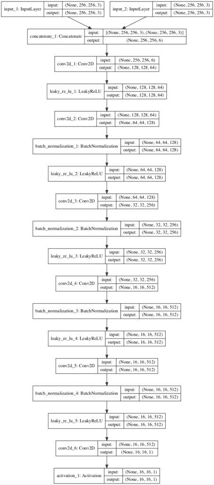
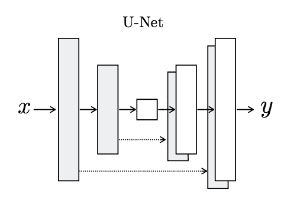
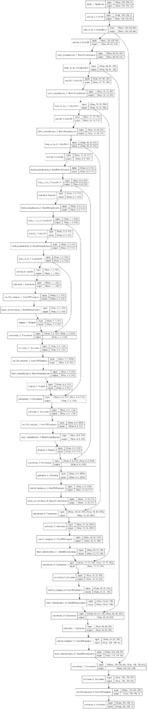
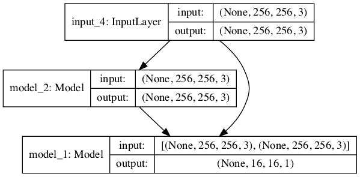

# 如何用 Keras 从零开始实现 Pix2Pix GAN 模型

> 原文：<https://machinelearningmastery.com/how-to-implement-pix2pix-gan-models-from-scratch-with-keras/>

最后更新于 2021 年 4 月 30 日

Pix2Pix GAN 是一个生成器模型，用于执行在成对示例上训练的图像到图像的翻译。

例如，该模型可用于将白天的图像转换为夜间的图像，或者从产品草图(如鞋子)转换为产品照片。

Pix2Pix 模型的好处是，与其他用于条件图像生成的 GANs 相比，它相对简单，能够跨各种图像转换任务生成大型高质量图像。

这个模型给人留下了深刻的印象，但是对于初学者来说，它的架构看起来有些复杂。

在本教程中，您将发现如何使用 Keras 深度学习框架从零开始实现 Pix2Pix GAN 架构。

完成本教程后，您将知道:

*   如何为 Pix2Pix GAN 开发 PatchGAN 鉴别器模型。
*   如何为 Pix2Pix GAN 开发 U-Net 编解码生成器模型。
*   如何实现用于更新生成器的复合模型，以及如何训练两个模型。

**用我的新书[Python 生成对抗网络](https://machinelearningmastery.com/generative_adversarial_networks/)启动你的项目**，包括*分步教程*和所有示例的 *Python 源代码*文件。

我们开始吧。

*   **2021 年 1 月更新**:更新所以层冻结用批量定额。


如何用 Keras 从零开始实现 Pix2Pix GAN 模型
图片由 [Ray 在马尼拉](https://www.flickr.com/photos/rayinmanila/24080283775/)拍摄，保留部分权利。

## 教程概述

本教程分为五个部分；它们是:

1.  什么是 Pix2Pix GAN？
2.  如何实现 PatchGAN 鉴别器模型
3.  如何实现 U 网生成器模型
4.  如何实现对抗性和 L1 损失
5.  如何更新模型权重

## 什么是 Pix2Pix GAN？

Pix2Pix 是一个为通用图像到图像转换而设计的生成对抗网络模型。

该方法由菲利普·伊索拉(Phillip Isola)等人在 2016 年发表的论文《条件对抗网络下的 T2 图像到图像转换》(T3)中提出，并于 2017 年在 CVPR 的 T4 会议上提出。

GAN 架构由一个用于输出新的似是而非的合成图像的生成器模型和一个将图像分类为真实(来自数据集)或虚假(生成)的鉴别器模型组成。鉴别器模型直接更新，而生成器模型通过鉴别器模型更新。这样，两个模型在对抗过程中被同时训练，其中生成器试图更好地欺骗鉴别器，鉴别器试图更好地识别伪造图像。

Pix2Pix 模型是一种条件 GAN 或 cGAN，其中输出图像的生成取决于输入，在这种情况下是源图像。鉴别器同时具有源图像和目标图像，并且必须确定目标是否是源图像的似是而非的变换。

同样，直接更新鉴别器模型，并且通过鉴别器模型更新生成器模型，尽管损耗函数被更新。生成器通过对抗性损失进行训练，这鼓励生成器在目标域中生成似是而非的图像。生成器还通过在生成的图像和预期输出图像之间测量的 L1 损耗来更新。这种额外的损失促使生成器模型创建源图像的似是而非的翻译。

Pix2Pix GAN 已经在一系列图像到图像的转换任务中进行了演示，例如将地图转换为卫星照片，将黑白照片转换为彩色照片，以及将产品草图转换为产品照片。

现在我们已经熟悉了 Pix2Pix GAN，让我们探索如何使用 Keras 深度学习库来实现它。

## 如何实现 PatchGAN 鉴别器模型

Pix2Pix GAN 中的鉴别器模型被实现为一个补丁 GAN。

PatchGAN 是根据感受野的大小设计的，有时也称为有效感受野。感受野是模型的一次输出激活与输入图像上的一个区域之间的关系(实际上是在输入通道中的音量)。

使用大小为 70×70 的 PatchGAN，这意味着模型的输出(或每个输出)映射到输入图像的 70×70 平方。实际上，一个 70×70 的 PatchGAN 会将输入图像的 70×70 的 patches 分类为真或假。

> ……我们设计了一个鉴别器架构——我们称之为 PatchGAN——它只在补丁的规模上惩罚结构。这个鉴别器试图分类图像中的每个 NxN 补丁是真的还是假的。我们在图像上运行这个鉴别器卷积，平均所有响应，以提供 d 的最终输出。

——[条件对抗网络下的图像到图像转换](https://arxiv.org/abs/1611.07004)，2016。

在我们深入了解 PatchGAN 的配置细节之前，掌握感受野的计算非常重要。

感受野不是鉴别器模型输出的大小，例如，它不涉及模型输出的激活图的形状。它是根据输入图像的输出激活图中的一个像素来定义模型的。模型的输出可以是预测输入图像的每个面片是真的还是假的单个值或值的平方激活图。

传统上，感受野是指单个卷积层的激活图的大小，与层的输入、滤波器的大小和步幅的大小有关。有效感受野概括了这一思想，并针对原始图像输入计算了卷积层堆栈输出的感受野。这些术语经常互换使用。

Pix2Pix GAN 的作者提供了一个 Matlab 脚本，在一个名为[感受野大小. m](https://github.com/phillipi/pix2pix/blob/master/scripts/receptive_field_sizes.m) 的脚本中计算不同模型配置的有效感受野大小。通过一个 70×70 PatchGAN 感受野计算的例子，可以对我们的工作有所帮助。

无论输入图像的大小如何，70×70 PatchGAN 都有固定数量的三层(不包括输出层和倒数第二层)。一维感受野的计算公式如下:

*   感受野=(输出大小–1)*步幅+内核大小

其中输出大小是先前层激活图的大小，[跨距](https://machinelearningmastery.com/padding-and-stride-for-convolutional-neural-networks/)是应用于激活时过滤器移动的像素数，内核大小是要应用的过滤器的大小。

PatchGAN 使用 2×2 的固定步长(除了输出层和倒数第二层)和 4×4 的固定内核大小。因此，我们可以计算感受野的大小，从模型输出的一个像素开始，向后到输入图像。

我们可以开发一个名为*感受野()*的 Python 函数来计算感受野，然后计算并打印 Pix2Pix PatchGAN 模型中每一层的感受野。下面列出了完整的示例。

```py
# example of calculating the receptive field for the PatchGAN

# calculate the effective receptive field size
def receptive_field(output_size, kernel_size, stride_size):
    return (output_size - 1) * stride_size + kernel_size

# output layer 1x1 pixel with 4x4 kernel and 1x1 stride
rf = receptive_field(1, 4, 1)
print(rf)
# second last layer with 4x4 kernel and 1x1 stride
rf = receptive_field(rf, 4, 1)
print(rf)
# 3 PatchGAN layers with 4x4 kernel and 2x2 stride
rf = receptive_field(rf, 4, 2)
print(rf)
rf = receptive_field(rf, 4, 2)
print(rf)
rf = receptive_field(rf, 4, 2)
print(rf)
```

运行该示例将打印模型中从输出层到输入层的每一层的感受野大小。

我们可以看到，输出层的每个 1×1 像素映射到输入层的 70×70 感受野。

```py
4
7
16
34
70
```

Pix2Pix 论文的作者探索了不同的 PatchGAN 配置，包括一个称为 PixelGAN 的 1×1 感受野和一个与输入模型的 256×256 像素图像(重新采样为 286×286)匹配的感受野，称为 ImageGAN。他们发现，70×70 PatchGAN 在表现和图像质量之间取得了最佳平衡。

> 70×70 的 PatchGAN […]表现稍好。超出此范围，扩展到完整的 286×286 ImageGAN，似乎不会提高结果的视觉质量。

——[条件对抗网络下的图像到图像转换](https://arxiv.org/abs/1611.07004)，2016。

PatchGAN 的配置在论文的[附录中提供，可以通过查看官方火炬实现中的](https://arxiv.org/abs/1611.07004) [defineD_n_layers()功能](https://github.com/phillipi/pix2pix/blob/master/models.lua#L180)来确认。

该模型将两幅图像作为输入，具体为一幅源图像和一幅目标图像。这些图像在通道级被连接在一起，例如每个图像的 3 个彩色通道变成输入的 6 个通道。

> 让 Ck 表示一个带有 k 个过滤器的卷积-batch ORM-ReLu 层。[……]所有卷积都是 4× 4 空间滤波器，应用于跨距 2。[……]70×70 鉴频器架构为:C64-C128-C256-C512。在最后一层之后，应用卷积来映射到一维输出，随后是 Sigmoid 函数。作为上述表示法的一个例外，BatchNorm 不适用于第一个 C64 层。所有 ReLUs 都有泄漏，斜率为 0.2。

——[条件对抗网络下的图像到图像转换](https://arxiv.org/abs/1611.07004)，2016。

PatchGAN 配置使用简写符号定义为:C64-C128-C256-C512，其中 C 表示卷积-batchorm-LeakyReLU 层的块，数字表示过滤器的数量。[第一层不使用批量归一化](https://machinelearningmastery.com/how-to-accelerate-learning-of-deep-neural-networks-with-batch-normalization/)。如前所述，内核大小固定为 4×4，除了模型的最后两层之外，所有层都使用 2×2 的[步长。LeakyReLU 的斜率设置为 0.2，输出层使用 sigmoid 激活函数。](https://machinelearningmastery.com/padding-and-stride-for-convolutional-neural-networks/)

> 随机抖动是通过将 256 × 256 输入图像的大小调整为 286 × 286，然后随机裁剪回 256×256 的大小来应用的。权重从均值为 0、标准差为 0.02 的高斯分布中初始化。

——[条件对抗网络下的图像到图像转换](https://arxiv.org/abs/1611.07004)，2016。

模型权重通过[随机高斯](https://machinelearningmastery.com/how-to-generate-random-numbers-in-python/)初始化，平均值为 0.0，标准偏差为 0.02。输入模型的图像为 256×256。

> ……我们在优化 D 的同时将目标除以 2，这样会减慢 D 相对于 g 的学习速度，我们使用 minibatch SGD 并应用 Adam 求解器，学习速度为 0.0002，动量参数β1 = 0.5，β2 = 0.999。

——[条件对抗网络下的图像到图像转换](https://arxiv.org/abs/1611.07004)，2016。

模型以一幅图像的批量大小进行训练，随机梯度下降的 [Adam 版本](https://machinelearningmastery.com/adam-optimization-algorithm-for-deep-learning/)以较小的学习范围和适度的动量使用。每次模型更新，鉴别器的损失加权 50%。

将这些联系在一起，我们可以定义一个名为 *define_discriminator()* 的函数，创建 70×70 的 PatchGAN 鉴别器模型。

下面列出了定义模型的完整示例。

```py
# example of defining a 70x70 patchgan discriminator model
from keras.optimizers import Adam
from keras.initializers import RandomNormal
from keras.models import Model
from keras.models import Input
from keras.layers import Conv2D
from keras.layers import LeakyReLU
from keras.layers import Activation
from keras.layers import Concatenate
from keras.layers import BatchNormalization
from keras.utils.vis_utils import plot_model

# define the discriminator model
def define_discriminator(image_shape):
	# weight initialization
	init = RandomNormal(stddev=0.02)
	# source image input
	in_src_image = Input(shape=image_shape)
	# target image input
	in_target_image = Input(shape=image_shape)
	# concatenate images channel-wise
	merged = Concatenate()([in_src_image, in_target_image])
	# C64
	d = Conv2D(64, (4,4), strides=(2,2), padding='same', kernel_initializer=init)(merged)
	d = LeakyReLU(alpha=0.2)(d)
	# C128
	d = Conv2D(128, (4,4), strides=(2,2), padding='same', kernel_initializer=init)(d)
	d = BatchNormalization()(d)
	d = LeakyReLU(alpha=0.2)(d)
	# C256
	d = Conv2D(256, (4,4), strides=(2,2), padding='same', kernel_initializer=init)(d)
	d = BatchNormalization()(d)
	d = LeakyReLU(alpha=0.2)(d)
	# C512
	d = Conv2D(512, (4,4), strides=(2,2), padding='same', kernel_initializer=init)(d)
	d = BatchNormalization()(d)
	d = LeakyReLU(alpha=0.2)(d)
	# second last output layer
	d = Conv2D(512, (4,4), padding='same', kernel_initializer=init)(d)
	d = BatchNormalization()(d)
	d = LeakyReLU(alpha=0.2)(d)
	# patch output
	d = Conv2D(1, (4,4), padding='same', kernel_initializer=init)(d)
	patch_out = Activation('sigmoid')(d)
	# define model
	model = Model([in_src_image, in_target_image], patch_out)
	# compile model
	opt = Adam(lr=0.0002, beta_1=0.5)
	model.compile(loss='binary_crossentropy', optimizer=opt, loss_weights=[0.5])
	return model

# define image shape
image_shape = (256,256,3)
# create the model
model = define_discriminator(image_shape)
# summarize the model
model.summary()
# plot the model
plot_model(model, to_file='discriminator_model_plot.png', show_shapes=True, show_layer_names=True)
```

运行示例首先总结了模型，提供了输入形状如何跨层转换以及模型中参数数量的洞察。

我们可以看到，两个输入图像被连接在一起，以创建一个 256x256x6 的输入到第一隐藏[卷积层](https://machinelearningmastery.com/convolutional-layers-for-deep-learning-neural-networks/)。这种输入图像的连接可以发生在模型的输入层之前，但是允许模型执行连接可以使模型的行为更加清晰。

我们可以看到，模型输出将是一个激活图，大小为 16×16 像素或激活和单个通道，图中的每个值对应于输入 256×256 图像的 70×70 像素块。如果输入图像的大小是 128×128 的一半，则输出特征图也将减半至 8×8。

该模型是一个二进制分类模型，这意味着它以[0，1]范围内的概率预测输出，在这种情况下，是输入图像是真实的还是来自目标数据集的可能性。可以通过模型对这些值进行平均，以给出真实/虚假的预测。训练时，将目标与目标值矩阵进行比较，0 代表假，1 代表真。

```py
__________________________________________________________________________________________________
Layer (type)                    Output Shape         Param #     Connected to
==================================================================================================
input_1 (InputLayer)            (None, 256, 256, 3)  0
__________________________________________________________________________________________________
input_2 (InputLayer)            (None, 256, 256, 3)  0
__________________________________________________________________________________________________
concatenate_1 (Concatenate)     (None, 256, 256, 6)  0           input_1[0][0]
                                                                 input_2[0][0]
__________________________________________________________________________________________________
conv2d_1 (Conv2D)               (None, 128, 128, 64) 6208        concatenate_1[0][0]
__________________________________________________________________________________________________
leaky_re_lu_1 (LeakyReLU)       (None, 128, 128, 64) 0           conv2d_1[0][0]
__________________________________________________________________________________________________
conv2d_2 (Conv2D)               (None, 64, 64, 128)  131200      leaky_re_lu_1[0][0]
__________________________________________________________________________________________________
batch_normalization_1 (BatchNor (None, 64, 64, 128)  512         conv2d_2[0][0]
__________________________________________________________________________________________________
leaky_re_lu_2 (LeakyReLU)       (None, 64, 64, 128)  0           batch_normalization_1[0][0]
__________________________________________________________________________________________________
conv2d_3 (Conv2D)               (None, 32, 32, 256)  524544      leaky_re_lu_2[0][0]
__________________________________________________________________________________________________
batch_normalization_2 (BatchNor (None, 32, 32, 256)  1024        conv2d_3[0][0]
__________________________________________________________________________________________________
leaky_re_lu_3 (LeakyReLU)       (None, 32, 32, 256)  0           batch_normalization_2[0][0]
__________________________________________________________________________________________________
conv2d_4 (Conv2D)               (None, 16, 16, 512)  2097664     leaky_re_lu_3[0][0]
__________________________________________________________________________________________________
batch_normalization_3 (BatchNor (None, 16, 16, 512)  2048        conv2d_4[0][0]
__________________________________________________________________________________________________
leaky_re_lu_4 (LeakyReLU)       (None, 16, 16, 512)  0           batch_normalization_3[0][0]
__________________________________________________________________________________________________
conv2d_5 (Conv2D)               (None, 16, 16, 512)  4194816     leaky_re_lu_4[0][0]
__________________________________________________________________________________________________
batch_normalization_4 (BatchNor (None, 16, 16, 512)  2048        conv2d_5[0][0]
__________________________________________________________________________________________________
leaky_re_lu_5 (LeakyReLU)       (None, 16, 16, 512)  0           batch_normalization_4[0][0]
__________________________________________________________________________________________________
conv2d_6 (Conv2D)               (None, 16, 16, 1)    8193        leaky_re_lu_5[0][0]
__________________________________________________________________________________________________
activation_1 (Activation)       (None, 16, 16, 1)    0           conv2d_6[0][0]
==================================================================================================
Total params: 6,968,257
Trainable params: 6,965,441
Non-trainable params: 2,816
__________________________________________________________________________________________________
```

创建模型的图，以图形形式显示几乎相同的信息。该模型并不复杂，它有一条包含两个输入图像和一个输出预测的线性路径。

**注**:创建图时假设安装了 pydot 和 pygraphviz 库。如果这是一个问题，您可以注释掉导入并调用 *plot_model()* 函数。



Pix2Pix GAN 架构中使用的贴片 GAN 模型图

现在我们知道了如何实现 PatchGAN 鉴别器模型，我们现在可以考虑实现 U-Net 生成器模型。

## 如何实现 U 网生成器模型

Pix2Pix GAN 的生成器模型被实现为一个 U 网。

U-Net 模型是用于图像转换的编码器-解码器模型，其中跳跃连接用于将编码器中的层与解码器中具有相同大小的特征映射的对应层连接起来。

模型的编码器部分由卷积层组成，卷积层使用 2×2 的步长将输入源图像下采样到瓶颈层。模型的解码器部分读取瓶颈输出，并使用转置卷积层向上采样到所需的输出图像大小。

> ……输入通过一系列逐渐下采样的层，直到瓶颈层，此时过程反转。

——[条件对抗网络下的图像到图像转换](https://arxiv.org/abs/1611.07004)，2016。



U-Net 生成器模型的体系结构
取自带有条件对抗网络的图像到图像转换。

在具有相同大小的特征映射的层之间添加跳过连接，使得第一下采样层与最后一个上采样层连接，第二下采样层与第二最后一个上采样层连接，以此类推。这些连接将下采样层中的要素图通道与上采样层中的要素图通道连接起来。

> 具体来说，我们在 I 层和 n-I 层之间添加跳跃连接，其中 n 是总层数。每个跳跃连接只是将 I 层的所有通道与 n-I 层的通道连接起来。

——[条件对抗网络下的图像到图像转换](https://arxiv.org/abs/1611.07004)，2016。

与 GAN 架构中的传统生成器模型不同，U-Net 生成器不从潜在空间中取一点作为输入。取而代之的是，[缺失层](https://machinelearningmastery.com/how-to-reduce-overfitting-with-dropout-regularization-in-keras/)在训练期间和当模型用于进行预测时都被用作随机性的来源，例如在推断时生成图像。

类似地，在训练和推理过程中，批处理规范化也以同样的方式使用，这意味着统计数据是为每个批处理计算的，而不是在训练过程结束时固定的。这称为实例规范化，特别是当批处理大小设置为 1 时，就像 Pix2Pix 模型一样。

> 在推理时，我们以与训练阶段完全相同的方式运行生成器网络。这与通常的协议不同，因为我们在测试时应用丢弃，并且我们使用测试批次的统计数据应用批次标准化，而不是训练批次的聚合统计数据。

——[条件对抗网络下的图像到图像转换](https://arxiv.org/abs/1611.07004)，2016。

在 Keras 中，像 [Dropout](https://machinelearningmastery.com/how-to-reduce-overfitting-with-dropout-regularization-in-keras/) 和 [BatchNormalization](https://machinelearningmastery.com/batch-normalization-for-training-of-deep-neural-networks/) 这样的层在训练和推理模型中的操作是不同的。当调用这些层为“真”时，我们可以设置“*训练*”参数，以确保它们始终在训练模型中运行，即使在推理过程中使用。

例如，在推理和训练过程中会退出的 Dropout 层可以添加到模型中，如下所示:

```py
...
g = Dropout(0.5)(g, training=True)
```

与鉴别器模型一样，生成器模型的配置细节在论文的[附录中定义，并且可以在与官方火炬实现](https://arxiv.org/abs/1611.07004)中的 [defineG_unet()函数进行比较时进行确认。](https://github.com/phillipi/pix2pix/blob/master/models.lua#L47)

编码器像鉴别器模型一样使用卷积-batchorm-LeakyReLU 块，而解码器模型使用卷积-batchorm-dropped-ReLU 块，丢弃率为 50%。所有卷积层使用 4×4 的滤波器大小和 2×2 的步长。

> 让 Ck 表示一个带有 k 个过滤器的卷积-batch ORM-ReLu 层。CDk 表示丢弃率为 50%的卷积-batchnomdrop-ReLU 层。所有卷积都是 4× 4 空间滤波器，应用于步长 2。

——[条件对抗网络下的图像到图像转换](https://arxiv.org/abs/1611.07004)，2016。

U-Net 模型的体系结构使用简写符号定义如下:

*   **编码器**:C64-C128-C256-C512-C512-C512-C512-C512
*   **解码器**:CD512-CD 1024-CD 1024-C1024-C1024-C512-C256-C128

编码器的最后一层是瓶颈层，根据对纸张的修改和代码中的确认，它不使用批量归一化，而是使用一个 [ReLU 激活](https://machinelearningmastery.com/rectified-linear-activation-function-for-deep-learning-neural-networks/)来代替 LeakyRelu。

> …瓶颈层的激活被 batchnorm 操作归零，有效地跳过了最内层。这个问题可以通过从这个层中移除 batchnorm 来解决，就像在公共代码中所做的那样

——[条件对抗网络下的图像到图像转换](https://arxiv.org/abs/1611.07004)，2016。

U-Net 解码器中的滤波器数量有点误导，因为它是与编码器中的等效层串联后的层的滤波器数量。当我们创建模型的图时，这可能会变得更加清楚。

该模型的输出使用具有三个通道的单个卷积层，并且在输出层中使用 tanh 激活函数，这是 GAN 生成器模型所共有的。编码器的第一层不使用批处理标准化。

> 在解码器中的最后一层之后，应用卷积来映射到输出通道的数量(一般为 3 个[…])，随后是 Tanh 函数[…]。batch ORM 不应用于编码器中的第一个 C64 层。编码器中的所有 relu 都是泄漏的，斜率为 0.2，而解码器中的 relu 是不泄漏的。

——[条件对抗网络下的图像到图像转换](https://arxiv.org/abs/1611.07004)，2016。

将这些联系在一起，我们可以定义一个名为 *define_generator()* 的函数，该函数定义了 U-Net 编码器-解码器生成器模型。还提供了两个辅助函数来定义层的编码器块和层的解码器块。

下面列出了定义模型的完整示例。

```py
# example of defining a u-net encoder-decoder generator model
from keras.initializers import RandomNormal
from keras.models import Model
from keras.models import Input
from keras.layers import Conv2D
from keras.layers import Conv2DTranspose
from keras.layers import LeakyReLU
from keras.layers import Activation
from keras.layers import Concatenate
from keras.layers import Dropout
from keras.layers import BatchNormalization
from keras.layers import LeakyReLU
from keras.utils.vis_utils import plot_model

# define an encoder block
def define_encoder_block(layer_in, n_filters, batchnorm=True):
	# weight initialization
	init = RandomNormal(stddev=0.02)
	# add downsampling layer
	g = Conv2D(n_filters, (4,4), strides=(2,2), padding='same', kernel_initializer=init)(layer_in)
	# conditionally add batch normalization
	if batchnorm:
		g = BatchNormalization()(g, training=True)
	# leaky relu activation
	g = LeakyReLU(alpha=0.2)(g)
	return g

# define a decoder block
def decoder_block(layer_in, skip_in, n_filters, dropout=True):
	# weight initialization
	init = RandomNormal(stddev=0.02)
	# add upsampling layer
	g = Conv2DTranspose(n_filters, (4,4), strides=(2,2), padding='same', kernel_initializer=init)(layer_in)
	# add batch normalization
	g = BatchNormalization()(g, training=True)
	# conditionally add dropout
	if dropout:
		g = Dropout(0.5)(g, training=True)
	# merge with skip connection
	g = Concatenate()([g, skip_in])
	# relu activation
	g = Activation('relu')(g)
	return g

# define the standalone generator model
def define_generator(image_shape=(256,256,3)):
	# weight initialization
	init = RandomNormal(stddev=0.02)
	# image input
	in_image = Input(shape=image_shape)
	# encoder model: C64-C128-C256-C512-C512-C512-C512-C512
	e1 = define_encoder_block(in_image, 64, batchnorm=False)
	e2 = define_encoder_block(e1, 128)
	e3 = define_encoder_block(e2, 256)
	e4 = define_encoder_block(e3, 512)
	e5 = define_encoder_block(e4, 512)
	e6 = define_encoder_block(e5, 512)
	e7 = define_encoder_block(e6, 512)
	# bottleneck, no batch norm and relu
	b = Conv2D(512, (4,4), strides=(2,2), padding='same', kernel_initializer=init)(e7)
	b = Activation('relu')(b)
	# decoder model: CD512-CD1024-CD1024-C1024-C1024-C512-C256-C128
	d1 = decoder_block(b, e7, 512)
	d2 = decoder_block(d1, e6, 512)
	d3 = decoder_block(d2, e5, 512)
	d4 = decoder_block(d3, e4, 512, dropout=False)
	d5 = decoder_block(d4, e3, 256, dropout=False)
	d6 = decoder_block(d5, e2, 128, dropout=False)
	d7 = decoder_block(d6, e1, 64, dropout=False)
	# output
	g = Conv2DTranspose(3, (4,4), strides=(2,2), padding='same', kernel_initializer=init)(d7)
	out_image = Activation('tanh')(g)
	# define model
	model = Model(in_image, out_image)
	return model

# define image shape
image_shape = (256,256,3)
# create the model
model = define_generator(image_shape)
# summarize the model
model.summary()
# plot the model
plot_model(model, to_file='generator_model_plot.png', show_shapes=True, show_layer_names=True)
```

运行示例首先总结模型。

该模型只有一个输入和输出，但跳跃连接使摘要难以阅读。

```py
__________________________________________________________________________________________________
Layer (type)                    Output Shape         Param #     Connected to
==================================================================================================
input_1 (InputLayer)            (None, 256, 256, 3)  0
__________________________________________________________________________________________________
conv2d_1 (Conv2D)               (None, 128, 128, 64) 3136        input_1[0][0]
__________________________________________________________________________________________________
leaky_re_lu_1 (LeakyReLU)       (None, 128, 128, 64) 0           conv2d_1[0][0]
__________________________________________________________________________________________________
conv2d_2 (Conv2D)               (None, 64, 64, 128)  131200      leaky_re_lu_1[0][0]
__________________________________________________________________________________________________
batch_normalization_1 (BatchNor (None, 64, 64, 128)  512         conv2d_2[0][0]
__________________________________________________________________________________________________
leaky_re_lu_2 (LeakyReLU)       (None, 64, 64, 128)  0           batch_normalization_1[0][0]
__________________________________________________________________________________________________
conv2d_3 (Conv2D)               (None, 32, 32, 256)  524544      leaky_re_lu_2[0][0]
__________________________________________________________________________________________________
batch_normalization_2 (BatchNor (None, 32, 32, 256)  1024        conv2d_3[0][0]
__________________________________________________________________________________________________
leaky_re_lu_3 (LeakyReLU)       (None, 32, 32, 256)  0           batch_normalization_2[0][0]
__________________________________________________________________________________________________
conv2d_4 (Conv2D)               (None, 16, 16, 512)  2097664     leaky_re_lu_3[0][0]
__________________________________________________________________________________________________
batch_normalization_3 (BatchNor (None, 16, 16, 512)  2048        conv2d_4[0][0]
__________________________________________________________________________________________________
leaky_re_lu_4 (LeakyReLU)       (None, 16, 16, 512)  0           batch_normalization_3[0][0]
__________________________________________________________________________________________________
conv2d_5 (Conv2D)               (None, 8, 8, 512)    4194816     leaky_re_lu_4[0][0]
__________________________________________________________________________________________________
batch_normalization_4 (BatchNor (None, 8, 8, 512)    2048        conv2d_5[0][0]
__________________________________________________________________________________________________
leaky_re_lu_5 (LeakyReLU)       (None, 8, 8, 512)    0           batch_normalization_4[0][0]
__________________________________________________________________________________________________
conv2d_6 (Conv2D)               (None, 4, 4, 512)    4194816     leaky_re_lu_5[0][0]
__________________________________________________________________________________________________
batch_normalization_5 (BatchNor (None, 4, 4, 512)    2048        conv2d_6[0][0]
__________________________________________________________________________________________________
leaky_re_lu_6 (LeakyReLU)       (None, 4, 4, 512)    0           batch_normalization_5[0][0]
__________________________________________________________________________________________________
conv2d_7 (Conv2D)               (None, 2, 2, 512)    4194816     leaky_re_lu_6[0][0]
__________________________________________________________________________________________________
batch_normalization_6 (BatchNor (None, 2, 2, 512)    2048        conv2d_7[0][0]
__________________________________________________________________________________________________
leaky_re_lu_7 (LeakyReLU)       (None, 2, 2, 512)    0           batch_normalization_6[0][0]
__________________________________________________________________________________________________
conv2d_8 (Conv2D)               (None, 1, 1, 512)    4194816     leaky_re_lu_7[0][0]
__________________________________________________________________________________________________
activation_1 (Activation)       (None, 1, 1, 512)    0           conv2d_8[0][0]
__________________________________________________________________________________________________
conv2d_transpose_1 (Conv2DTrans (None, 2, 2, 512)    4194816     activation_1[0][0]
__________________________________________________________________________________________________
batch_normalization_7 (BatchNor (None, 2, 2, 512)    2048        conv2d_transpose_1[0][0]
__________________________________________________________________________________________________
dropout_1 (Dropout)             (None, 2, 2, 512)    0           batch_normalization_7[0][0]
__________________________________________________________________________________________________
concatenate_1 (Concatenate)     (None, 2, 2, 1024)   0           dropout_1[0][0]
                                                                 leaky_re_lu_7[0][0]
__________________________________________________________________________________________________
activation_2 (Activation)       (None, 2, 2, 1024)   0           concatenate_1[0][0]
__________________________________________________________________________________________________
conv2d_transpose_2 (Conv2DTrans (None, 4, 4, 512)    8389120     activation_2[0][0]
__________________________________________________________________________________________________
batch_normalization_8 (BatchNor (None, 4, 4, 512)    2048        conv2d_transpose_2[0][0]
__________________________________________________________________________________________________
dropout_2 (Dropout)             (None, 4, 4, 512)    0           batch_normalization_8[0][0]
__________________________________________________________________________________________________
concatenate_2 (Concatenate)     (None, 4, 4, 1024)   0           dropout_2[0][0]
                                                                 leaky_re_lu_6[0][0]
__________________________________________________________________________________________________
activation_3 (Activation)       (None, 4, 4, 1024)   0           concatenate_2[0][0]
__________________________________________________________________________________________________
conv2d_transpose_3 (Conv2DTrans (None, 8, 8, 512)    8389120     activation_3[0][0]
__________________________________________________________________________________________________
batch_normalization_9 (BatchNor (None, 8, 8, 512)    2048        conv2d_transpose_3[0][0]
__________________________________________________________________________________________________
dropout_3 (Dropout)             (None, 8, 8, 512)    0           batch_normalization_9[0][0]
__________________________________________________________________________________________________
concatenate_3 (Concatenate)     (None, 8, 8, 1024)   0           dropout_3[0][0]
                                                                 leaky_re_lu_5[0][0]
__________________________________________________________________________________________________
activation_4 (Activation)       (None, 8, 8, 1024)   0           concatenate_3[0][0]
__________________________________________________________________________________________________
conv2d_transpose_4 (Conv2DTrans (None, 16, 16, 512)  8389120     activation_4[0][0]
__________________________________________________________________________________________________
batch_normalization_10 (BatchNo (None, 16, 16, 512)  2048        conv2d_transpose_4[0][0]
__________________________________________________________________________________________________
concatenate_4 (Concatenate)     (None, 16, 16, 1024) 0           batch_normalization_10[0][0]
                                                                 leaky_re_lu_4[0][0]
__________________________________________________________________________________________________
activation_5 (Activation)       (None, 16, 16, 1024) 0           concatenate_4[0][0]
__________________________________________________________________________________________________
conv2d_transpose_5 (Conv2DTrans (None, 32, 32, 256)  4194560     activation_5[0][0]
__________________________________________________________________________________________________
batch_normalization_11 (BatchNo (None, 32, 32, 256)  1024        conv2d_transpose_5[0][0]
__________________________________________________________________________________________________
concatenate_5 (Concatenate)     (None, 32, 32, 512)  0           batch_normalization_11[0][0]
                                                                 leaky_re_lu_3[0][0]
__________________________________________________________________________________________________
activation_6 (Activation)       (None, 32, 32, 512)  0           concatenate_5[0][0]
__________________________________________________________________________________________________
conv2d_transpose_6 (Conv2DTrans (None, 64, 64, 128)  1048704     activation_6[0][0]
__________________________________________________________________________________________________
batch_normalization_12 (BatchNo (None, 64, 64, 128)  512         conv2d_transpose_6[0][0]
__________________________________________________________________________________________________
concatenate_6 (Concatenate)     (None, 64, 64, 256)  0           batch_normalization_12[0][0]
                                                                 leaky_re_lu_2[0][0]
__________________________________________________________________________________________________
activation_7 (Activation)       (None, 64, 64, 256)  0           concatenate_6[0][0]
__________________________________________________________________________________________________
conv2d_transpose_7 (Conv2DTrans (None, 128, 128, 64) 262208      activation_7[0][0]
__________________________________________________________________________________________________
batch_normalization_13 (BatchNo (None, 128, 128, 64) 256         conv2d_transpose_7[0][0]
__________________________________________________________________________________________________
concatenate_7 (Concatenate)     (None, 128, 128, 128 0           batch_normalization_13[0][0]
                                                                 leaky_re_lu_1[0][0]
__________________________________________________________________________________________________
activation_8 (Activation)       (None, 128, 128, 128 0           concatenate_7[0][0]
__________________________________________________________________________________________________
conv2d_transpose_8 (Conv2DTrans (None, 256, 256, 3)  6147        activation_8[0][0]
__________________________________________________________________________________________________
activation_9 (Activation)       (None, 256, 256, 3)  0           conv2d_transpose_8[0][0]
==================================================================================================
Total params: 54,429,315
Trainable params: 54,419,459
Non-trainable params: 9,856
__________________________________________________________________________________________________
```

创建模型的图，以图形形式显示几乎相同的信息。该模型很复杂，该图有助于理解跳过连接及其对解码器中滤波器数量的影响。

**注**:创建图时假设安装了 pydot 和 pygraphviz 库。如果这是一个问题，您可以注释掉导入并调用 *plot_model()* 函数。

从输出层向后看，如果我们查看解码器的 Concatenate 层和第一个 can 转置层，我们可以看到通道数为:

*   [128, 256, 512, 1024, 1024, 1024, 1024, 512].

颠倒这个列表给出了解码器中每一层的滤波器数量的所述配置，该配置来自于以下文件:

*   CD 512-CD 1024-CD 1024-C1024-C1024-C512-C256-C128



Pix2Pix GAN 架构中使用的 U-Net 编解码模型图

既然我们已经定义了这两个模型，我们可以看看生成器模型是如何通过鉴别器模型进行更新的。

## 如何实现对抗性和 L1 损失

鉴别器模型可以直接更新，而生成器模型必须通过鉴别器模型更新。

这可以通过在 Keras 中定义一个新的复合模型来实现，该模型将生成器模型的输出作为输入连接到鉴别器模型。然后，鉴别器模型可以预测生成的图像是真的还是假的。我们可以更新合成模型的权重，使生成的图像标签为“*真实*”而不是“*假*，这将导致生成器权重朝着生成更好的假图像的方向更新。我们还可以将鉴别器权重标记为在这种情况下不可训练，以避免误导性更新。

此外，需要更新生成器，以更好地匹配输入图像的目标翻译。这意味着合成模型还必须直接输出生成的图像，允许将其与目标图像进行比较。

因此，我们可以将这个复合模型的输入和输出总结如下:

*   **输入**:源图像
*   **输出**:真/假分类，生成的目标图像。

发生器的权重将通过鉴别器输出的对抗损失和直接图像输出的 L1 损失来更新。损失分数加在一起，其中 L1 损失被视为一个正则项，并通过一个名为*λ*的超参数加权，设置为 100。

*   损失=对抗性损失+λ* L1 损失

下面的 *define_gan()* 函数实现了这一点，将定义的生成器和鉴别器模型作为输入，并创建可用于更新生成器模型权重的复合 gan 模型。

源图像输入作为输入提供给发生器和鉴别器，发生器的输出也作为输入连接到鉴别器。

当分别为鉴别器和发生器输出编译模型时，指定了两个损失函数。*损失权重*参数用于定义每个损失相加后的权重，以更新发电机模型权重。

```py
# define the combined generator and discriminator model, for updating the generator
def define_gan(g_model, d_model, image_shape):
	# make weights in the discriminator not trainable
	for layer in d_model.layers:
		if not isinstance(layer, BatchNormalization):
			layer.trainable = False
	# define the source image
	in_src = Input(shape=image_shape)
	# connect the source image to the generator input
	gen_out = g_model(in_src)
	# connect the source input and generator output to the discriminator input
	dis_out = d_model([in_src, gen_out])
	# src image as input, generated image and classification output
	model = Model(in_src, [dis_out, gen_out])
	# compile model
	opt = Adam(lr=0.0002, beta_1=0.5)
	model.compile(loss=['binary_crossentropy', 'mae'], optimizer=opt, loss_weights=[1,100])
	return model
```

将这一点与前面几节中的模型定义结合起来，下面列出了完整的示例。

```py
# example of defining a composite model for training the generator model
from keras.optimizers import Adam
from keras.initializers import RandomNormal
from keras.models import Model
from keras.models import Input
from keras.layers import Conv2D
from keras.layers import Conv2DTranspose
from keras.layers import LeakyReLU
from keras.layers import Activation
from keras.layers import Concatenate
from keras.layers import Dropout
from keras.layers import BatchNormalization
from keras.layers import LeakyReLU
from keras.utils.vis_utils import plot_model

# define the discriminator model
def define_discriminator(image_shape):
	# weight initialization
	init = RandomNormal(stddev=0.02)
	# source image input
	in_src_image = Input(shape=image_shape)
	# target image input
	in_target_image = Input(shape=image_shape)
	# concatenate images channel-wise
	merged = Concatenate()([in_src_image, in_target_image])
	# C64
	d = Conv2D(64, (4,4), strides=(2,2), padding='same', kernel_initializer=init)(merged)
	d = LeakyReLU(alpha=0.2)(d)
	# C128
	d = Conv2D(128, (4,4), strides=(2,2), padding='same', kernel_initializer=init)(d)
	d = BatchNormalization()(d)
	d = LeakyReLU(alpha=0.2)(d)
	# C256
	d = Conv2D(256, (4,4), strides=(2,2), padding='same', kernel_initializer=init)(d)
	d = BatchNormalization()(d)
	d = LeakyReLU(alpha=0.2)(d)
	# C512
	d = Conv2D(512, (4,4), strides=(2,2), padding='same', kernel_initializer=init)(d)
	d = BatchNormalization()(d)
	d = LeakyReLU(alpha=0.2)(d)
	# second last output layer
	d = Conv2D(512, (4,4), padding='same', kernel_initializer=init)(d)
	d = BatchNormalization()(d)
	d = LeakyReLU(alpha=0.2)(d)
	# patch output
	d = Conv2D(1, (4,4), padding='same', kernel_initializer=init)(d)
	patch_out = Activation('sigmoid')(d)
	# define model
	model = Model([in_src_image, in_target_image], patch_out)
	# compile model
	opt = Adam(lr=0.0002, beta_1=0.5)
	model.compile(loss='binary_crossentropy', optimizer=opt, loss_weights=[0.5])
	return model

# define an encoder block
def define_encoder_block(layer_in, n_filters, batchnorm=True):
	# weight initialization
	init = RandomNormal(stddev=0.02)
	# add downsampling layer
	g = Conv2D(n_filters, (4,4), strides=(2,2), padding='same', kernel_initializer=init)(layer_in)
	# conditionally add batch normalization
	if batchnorm:
		g = BatchNormalization()(g, training=True)
	# leaky relu activation
	g = LeakyReLU(alpha=0.2)(g)
	return g

# define a decoder block
def decoder_block(layer_in, skip_in, n_filters, dropout=True):
	# weight initialization
	init = RandomNormal(stddev=0.02)
	# add upsampling layer
	g = Conv2DTranspose(n_filters, (4,4), strides=(2,2), padding='same', kernel_initializer=init)(layer_in)
	# add batch normalization
	g = BatchNormalization()(g, training=True)
	# conditionally add dropout
	if dropout:
		g = Dropout(0.5)(g, training=True)
	# merge with skip connection
	g = Concatenate()([g, skip_in])
	# relu activation
	g = Activation('relu')(g)
	return g

# define the standalone generator model
def define_generator(image_shape=(256,256,3)):
	# weight initialization
	init = RandomNormal(stddev=0.02)
	# image input
	in_image = Input(shape=image_shape)
	# encoder model: C64-C128-C256-C512-C512-C512-C512-C512
	e1 = define_encoder_block(in_image, 64, batchnorm=False)
	e2 = define_encoder_block(e1, 128)
	e3 = define_encoder_block(e2, 256)
	e4 = define_encoder_block(e3, 512)
	e5 = define_encoder_block(e4, 512)
	e6 = define_encoder_block(e5, 512)
	e7 = define_encoder_block(e6, 512)
	# bottleneck, no batch norm and relu
	b = Conv2D(512, (4,4), strides=(2,2), padding='same', kernel_initializer=init)(e7)
	b = Activation('relu')(b)
	# decoder model: CD512-CD1024-CD1024-C1024-C1024-C512-C256-C128
	d1 = decoder_block(b, e7, 512)
	d2 = decoder_block(d1, e6, 512)
	d3 = decoder_block(d2, e5, 512)
	d4 = decoder_block(d3, e4, 512, dropout=False)
	d5 = decoder_block(d4, e3, 256, dropout=False)
	d6 = decoder_block(d5, e2, 128, dropout=False)
	d7 = decoder_block(d6, e1, 64, dropout=False)
	# output
	g = Conv2DTranspose(3, (4,4), strides=(2,2), padding='same', kernel_initializer=init)(d7)
	out_image = Activation('tanh')(g)
	# define model
	model = Model(in_image, out_image)
	return model

# define the combined generator and discriminator model, for updating the generator
def define_gan(g_model, d_model, image_shape):
	# make weights in the discriminator not trainable
	for layer in d_model.layers:
		if not isinstance(layer, BatchNormalization):
			layer.trainable = False
	# define the source image
	in_src = Input(shape=image_shape)
	# connect the source image to the generator input
	gen_out = g_model(in_src)
	# connect the source input and generator output to the discriminator input
	dis_out = d_model([in_src, gen_out])
	# src image as input, generated image and classification output
	model = Model(in_src, [dis_out, gen_out])
	# compile model
	opt = Adam(lr=0.0002, beta_1=0.5)
	model.compile(loss=['binary_crossentropy', 'mae'], optimizer=opt, loss_weights=[1,100])
	return model

# define image shape
image_shape = (256,256,3)
# define the models
d_model = define_discriminator(image_shape)
g_model = define_generator(image_shape)
# define the composite model
gan_model = define_gan(g_model, d_model, image_shape)
# summarize the model
gan_model.summary()
# plot the model
plot_model(gan_model, to_file='gan_model_plot.png', show_shapes=True, show_layer_names=True)
```

运行示例首先总结复合模型，显示 256×256 的图像输入、来自*模型 _2* (生成器)的相同形状的输出和来自*模型 _1* (鉴别器)的 PatchGAN 分类预测。

```py
__________________________________________________________________________________________________
Layer (type)                    Output Shape         Param #     Connected to
==================================================================================================
input_4 (InputLayer)            (None, 256, 256, 3)  0
__________________________________________________________________________________________________
model_2 (Model)                 (None, 256, 256, 3)  54429315    input_4[0][0]
__________________________________________________________________________________________________
model_1 (Model)                 (None, 16, 16, 1)    6968257     input_4[0][0]
                                                                 model_2[1][0]
==================================================================================================
Total params: 61,397,572
Trainable params: 54,419,459
Non-trainable params: 6,978,113
__________________________________________________________________________________________________
```

还会创建一个复合模型图，显示输入图像如何流入生成器和鉴别器，以及模型是否有两个输出或两个模型的端点。

**注**:创建图时假设安装了 pydot 和 pygraphviz 库。如果这是一个问题，您可以注释掉导入并调用 plot_model()函数。



用于训练 Pix2Pix GAN 架构中发生器的复合 GAN 模型图

## 如何更新模型权重

训练定义的模型相对简单。

首先，我们必须定义一个助手函数，它将选择一批真实的源图像和目标图像以及相关的输出(1.0)。这里，数据集是两个图像阵列的列表。

```py
# select a batch of random samples, returns images and target
def generate_real_samples(dataset, n_samples, patch_shape):
	# unpack dataset
	trainA, trainB = dataset
	# choose random instances
	ix = randint(0, trainA.shape[0], n_samples)
	# retrieve selected images
	X1, X2 = trainA[ix], trainB[ix]
	# generate 'real' class labels (1)
	y = ones((n_samples, patch_shape, patch_shape, 1))
	return [X1, X2], y
```

同样，我们需要一个函数来生成一批假图像和相关的输出(0.0)。这里，样本是将为其生成目标图像的源图像的阵列。

```py
# generate a batch of images, returns images and targets
def generate_fake_samples(g_model, samples, patch_shape):
	# generate fake instance
	X = g_model.predict(samples)
	# create 'fake' class labels (0)
	y = zeros((len(X), patch_shape, patch_shape, 1))
	return X, y
```

现在，我们可以定义单次训练迭代的步骤。

首先，我们必须通过调用 *generate_real_samples()来选择一批源图像和目标图像。*

通常，批次大小( *n_batch* )设置为 1。在这种情况下，我们将假设 256×256 个输入图像，这意味着用于 PatchGAN 鉴别器的 *n_patch* 将是 16，以指示 16×16 的输出特征图。

```py
...
# select a batch of real samples
[X_realA, X_realB], y_real = generate_real_samples(dataset, n_batch, n_patch)
```

接下来，我们可以使用所选择的真实源图像的批次来生成相应批次的生成的或伪造的目标图像。

```py
...
# generate a batch of fake samples
X_fakeB, y_fake = generate_fake_samples(g_model, X_realA, n_patch)
```

然后，我们可以使用真实和伪造的图像，以及它们的目标，来更新独立的鉴别器模型。

```py
...
# update discriminator for real samples
d_loss1 = d_model.train_on_batch([X_realA, X_realB], y_real)
# update discriminator for generated samples
d_loss2 = d_model.train_on_batch([X_realA, X_fakeB], y_fake)
```

到目前为止，这对于在 Keras 更新一个 GAN 是正常的。

接下来，我们可以通过对抗性损失和 L1 损失来更新发电机模型。回想一下，复合 GAN 模型以一批源图像作为输入，首先预测真假分类，其次预测生成的目标。这里，我们向合成模型的鉴别器输出提供一个目标来指示生成的图像是“*真实的*”(class = 1)。提供真实目标图像用于计算它们和生成的目标图像之间的 L1 损失。

我们有两个损失函数，但是为一个批处理更新计算了三个损失值，其中只有第一个损失值是有意义的，因为它是该批处理的对抗性和 L1 损失值的加权和。

```py
...
# update the generator
g_loss, _, _ = gan_model.train_on_batch(X_realA, [y_real, X_realB])
```

仅此而已。

我们可以在一个名为 *train()* 的函数中定义所有这些，该函数获取定义的模型和加载的数据集(作为两个 NumPy 数组的列表)并训练模型。

```py
# train pix2pix models
def train(d_model, g_model, gan_model, dataset, n_epochs=100, n_batch=1, n_patch=16):
	# unpack dataset
	trainA, trainB = dataset
	# calculate the number of batches per training epoch
	bat_per_epo = int(len(trainA) / n_batch)
	# calculate the number of training iterations
	n_steps = bat_per_epo * n_epochs
	# manually enumerate epochs
	for i in range(n_steps):
		# select a batch of real samples
		[X_realA, X_realB], y_real = generate_real_samples(dataset, n_batch, n_patch)
		# generate a batch of fake samples
		X_fakeB, y_fake = generate_fake_samples(g_model, X_realA, n_patch)
		# update discriminator for real samples
		d_loss1 = d_model.train_on_batch([X_realA, X_realB], y_real)
		# update discriminator for generated samples
		d_loss2 = d_model.train_on_batch([X_realA, X_fakeB], y_fake)
		# update the generator
		g_loss, _, _ = gan_model.train_on_batch(X_realA, [y_real, X_realB])
		# summarize performance
		print('>%d, d1[%.3f] d2[%.3f] g[%.3f]' % (i+1, d_loss1, d_loss2, g_loss))
```

然后可以用我们定义的模型和加载的数据集直接调用训练函数。

```py
...
# load image data
dataset = ...
# train model
train(d_model, g_model, gan_model, dataset)
```

## 进一步阅读

如果您想更深入地了解这个主题，本节将提供更多资源。

### 正式的

*   [条件对抗网络下的图像到图像转换](https://arxiv.org/abs/1611.07004)，2016。
*   [带条件对抗网的图像到图像转换，主页](https://phillipi.github.io/pix2pix/)。
*   [带条件对抗网的图像到图像转换，GitHub](https://github.com/phillipi/pix2pix) 。
*   [pytorch-cyclelegan-and-pix 2 pix，GitHub](https://github.com/junyanz/pytorch-CycleGAN-and-pix2pix) 。
*   [互动影像转影像演示](https://affinelayer.com/pixsrv/)，2017 年。
*   [Pix2Pix 数据集](http://efrosgans.eecs.berkeley.edu/pix2pix/datasets/)

### 应用程序接口

*   [硬数据集 API](https://keras.io/datasets/) .
*   [Keras 顺序模型 API](https://keras.io/models/sequential/)
*   [Keras 卷积层应用编程接口](https://keras.io/layers/convolutional/)
*   [如何“冻结”Keras 层？](https://keras.io/getting-started/faq/#how-can-i-freeze-keras-layers)

### 文章

*   [卷积神经网络感受野算法指南](https://medium.com/mlreview/a-guide-to-receptive-field-arithmetic-for-convolutional-neural-networks-e0f514068807)，2017。
*   [提问:PatchGAN 鉴别器](https://github.com/junyanz/pytorch-CycleGAN-and-pix2pix/issues/39)，2017。
*   [感受野大小. m](https://github.com/phillipi/pix2pix/blob/master/scripts/receptive_field_sizes.m)

## 摘要

在本教程中，您发现了如何使用 Keras 深度学习框架从零开始实现 Pix2Pix GAN 架构。

具体来说，您了解到:

*   如何为 Pix2Pix GAN 开发 PatchGAN 鉴别器模型。
*   如何为 Pix2Pix GAN 开发 U-Net 编解码生成器模型。
*   如何实现用于更新生成器的复合模型，以及如何训练两个模型。

你有什么问题吗？
在下面的评论中提问，我会尽力回答。