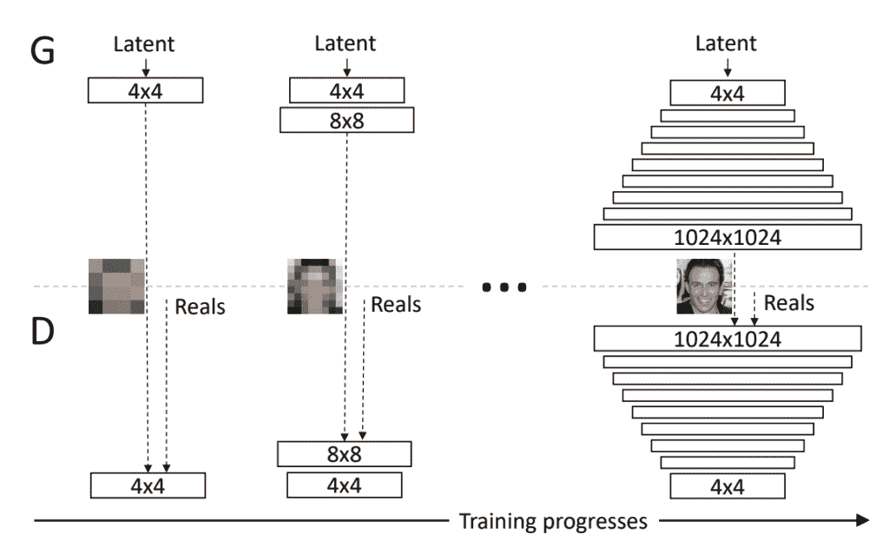
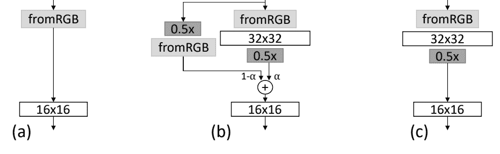
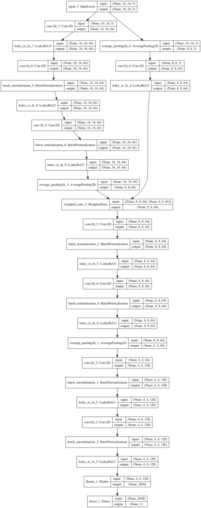
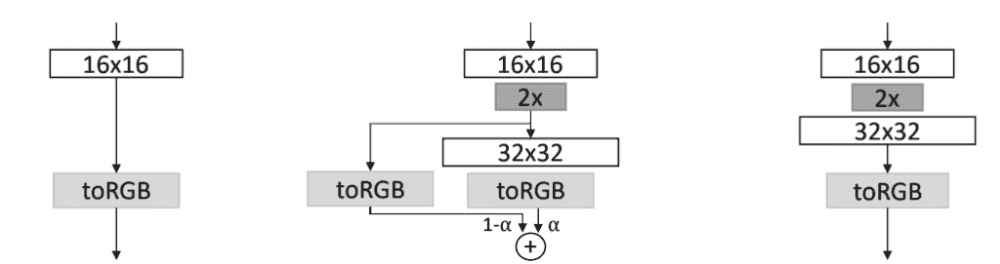
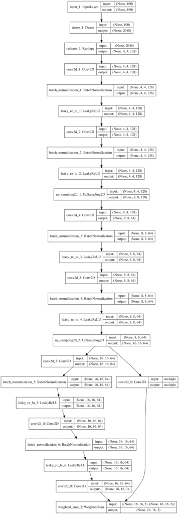

# 如何在 Keras 中实现渐进式增长 GAN 模型

> 原文：<https://machinelearningmastery.com/how-to-implement-progressive-growing-gan-models-in-keras/>

渐进增长生成对抗网络是一种训练深度卷积神经网络模型以生成合成图像的方法。

它是更传统的 GAN 架构的扩展，包括在训练过程中逐渐增加生成图像的大小，从非常小的图像开始，例如 4×4 像素。这允许能够生成非常大的高质量图像的 GAN 模型的稳定训练和增长，例如大小为 1024×1024 像素的合成名人脸的图像。

在本教程中，您将发现如何使用 Keras 从零开始开发渐进增长的生成对抗网络模型。

完成本教程后，您将知道:

*   如何在输出图像增长的每个级别开发预定义的鉴别器和生成器模型。
*   如何通过鉴别器模型定义用于训练生成器模型的复合模型？
*   如何在输出图像增长的每一级循环训练模型的淡入版本和正常版本。

**用我的新书[Python 生成对抗网络](https://machinelearningmastery.com/generative_adversarial_networks/)启动你的项目**，包括*分步教程*和所有示例的 *Python 源代码*文件。

我们开始吧。


如何在 Keras 实现渐进式增长 GAN 模型
图片由[迪奥戈·桑多斯·席尔瓦](https://www.flickr.com/photos/dsantoss/32782524633/)提供，保留部分权利。

## 教程概述

本教程分为五个部分；它们是:

1.  什么是渐进式增长的 GAN 架构？
2.  如何实现渐进增长的 GAN 鉴别器模型
3.  如何实现渐进式增长 GAN 发生器模型
4.  如何实现用于更新生成器的复合模型
5.  如何训练鉴别器和生成器模型

## 什么是渐进式增长的 GAN 架构？

GANs 在生成清晰的合成图像方面很有效，尽管通常受限于可以生成的图像的大小。

渐进式增长 GAN 是 GAN 的扩展，它允许训练能够输出大的高质量图像的生成器模型，例如大小为 1024×1024 像素的真实感人脸。英伟达的 [Tero Karras](https://research.nvidia.com/person/tero-karras) 等人在 2017 年的论文中描述了这一点，论文标题为“[为提高质量、稳定性和变化性而对 GANs 进行渐进式增长](https://arxiv.org/abs/1710.10196)”

渐进式增长 GAN 的关键创新是发生器输出图像尺寸的递增，从 4×4 像素图像开始，加倍到 8×8、16×16 等，直至达到所需的输出分辨率。

> 我们的主要贡献是 GANs 的培训方法，从低分辨率图像开始，然后通过向网络添加层来逐步提高分辨率。

——[为提高质量、稳定性和变化性而进行的肝的渐进式增长](https://arxiv.org/abs/1710.10196)，2017 年。

这是通过一个训练过程来实现的，该过程包括用给定的输出分辨率对模型进行微调的阶段，以及用更大的分辨率缓慢地逐步引入新模型的阶段。

> 当发生器(G)和鉴别器(D)的分辨率加倍时，我们平滑地淡入新的层

——[为提高质量、稳定性和变化性而进行的肝的渐进式增长](https://arxiv.org/abs/1710.10196)，2017 年。

在训练过程中，所有层都保持可训练状态，包括添加新层时的现有层。

> 两个网络中的所有现有层在整个训练过程中都是可训练的。

——[为提高质量、稳定性和变化性而进行的肝的渐进式增长](https://arxiv.org/abs/1710.10196)，2017 年。

渐进式增长 GAN 涉及使用具有相同一般结构的生成器和鉴别器模型，并从非常小的图像开始。在训练期间，新的卷积层块被系统地添加到生成器模型和鉴别器模型中。



向生成器和鉴别器模型逐步添加层的示例。
取自:为提高质量、稳定性和变异而进行的肝的渐进式增长。

层的增量添加允许模型有效地学习粗略级别的细节，并且稍后学习更精细的细节，在生成器和鉴别器侧都是如此。

> 这种增量性质允许训练首先发现图像分布的大尺度结构，然后将注意力转移到越来越精细的细节上，而不是必须同时学习所有尺度。

——[为提高质量、稳定性和变化性而进行的肝的渐进式增长](https://arxiv.org/abs/1710.10196)，2017 年。

模型架构复杂，不能直接实现。

在本教程中，我们将重点介绍如何使用 Keras 深度学习库实现渐进增长的 GAN。

我们将逐步了解如何定义每个鉴别器和生成器模型，如何通过鉴别器模型训练生成器，以及如何在训练过程中更新每个模型。

这些实现细节将为您开发适合自己应用的渐进增长的 GAN 提供基础。

## 如何实现渐进增长的 GAN 鉴别器模型

鉴别器模型被给予图像作为输入，并且必须将它们分类为真实的(来自数据集)或虚假的(生成的)。

在训练过程中，鉴别器必须增长以支持不断增大尺寸的图像，从 4×4 像素彩色图像开始，加倍到 8×8、16×16、32×32 等。

这是通过插入一个新的输入层来支持更大的输入图像，然后插入一个新的层块来实现的。然后对这个新块的输出进行下采样。此外，新图像还被直接下采样，并在与新块的输出组合之前通过旧的输入处理层。

在从较低分辨率转换到较高分辨率(例如 16×16 到 32×32)的过程中，鉴频器模型将有如下两条输入路径:

*   [32×32 图像]>[fromrgb conv]>[new block]>[down sample]->
*   [32×32 image]>[down sample]>[fromrgb conv]->

被下采样的新块的输出和旧输入处理层的输出使用加权平均进行组合，其中加权由称为*α*的新超参数控制。加权和计算如下:

*   输出=((1–alpha)* from RGb)+(alpha * new block)

然后，这两条路径的加权平均值被输入到现有模型的其余部分。

最初，权重完全偏向旧的输入处理层(*α= 0*)并且随着训练迭代线性增加，使得新块被给予更多的权重，直到最终，输出完全是新块的乘积(*α= 1*)。这时，旧的路径可以被移除。

这可以用下图来总结，该图取自显示增长前的模型(a)、较大分辨率的逐步引入期间的模型(b)和逐步引入后的模型(c)。



图中显示了高分辨率相位输入之前(a)、期间(b)和之后(c)鉴频器模型的发展。
取自:为提高质量、稳定性和变异而进行的肝的渐进式增长。

来自 RGB 层的*被实现为一个 [1×1 卷积层](https://machinelearningmastery.com/convolutional-layers-for-deep-learning-neural-networks/)。一个块由两个具有 3×3 大小的滤波器的卷积层和斜率为 0.2 的泄漏 ReLU 激活函数组成，随后是下采样层。平均池用于下采样，这与大多数其他使用转置卷积层的 GAN 模型不同。*

该模型的输出包括两个卷积层，分别具有 3×3 和 4×4 大小的滤波器和漏 ReLU 激活，随后是一个完全连接的层，输出单值预测。该模型使用线性激活函数，而不是像其他鉴别器模型那样使用 sigmoid 激活函数，并且直接通过 Wasserstein 损失(特别是 WGAN-GP)或最小二乘损失进行训练；我们将在本教程中使用后者。模型权重使用何高斯(he_normal)进行初始化，这与本文中使用的方法非常相似。

该模型在输出块的开头使用了一个名为 Minibatch 标准差的自定义层，每个层都使用局部响应归一化，而不是批处理归一化，在本文中称为像素归一化。为了简洁起见，我们将省略迷你批次规范化，在本教程中使用批处理规范化。

一种实现渐进增长的 GAN 的方法是在培训期间按需手动扩展模型。另一种方法是在训练之前预先定义所有的模型，并谨慎地使用 Keras 功能 API 来确保在模型之间共享层并继续训练。

我相信后一种方法可能更容易，也是我们将在本教程中使用的方法。

首先，我们必须定义一个自定义层，以便在新的更高分辨率的输入图像和块中淡入淡出时使用。这个新层必须采用两组具有相同维度(宽度、高度、通道)的激活图，并使用加权和将它们相加。

我们可以将其实现为一个名为*加权求和*的新层，该层扩展了*添加*合并层，并使用超参数“ *alpha* ”来控制每个输入的贡献。下面定义了这个新类。该层仅假设两个输入:第一个用于旧层或现有层的输出，第二个用于新添加的层。新的超参数被定义为后端变量，这意味着我们可以通过改变变量的值随时改变它。

```py
# weighted sum output
class WeightedSum(Add):
	# init with default value
	def __init__(self, alpha=0.0, **kwargs):
		super(WeightedSum, self).__init__(**kwargs)
		self.alpha = backend.variable(alpha, name='ws_alpha')

	# output a weighted sum of inputs
	def _merge_function(self, inputs):
		# only supports a weighted sum of two inputs
		assert (len(inputs) == 2)
		# ((1-a) * input1) + (a * input2)
		output = ((1.0 - self.alpha) * inputs[0]) + (self.alpha * inputs[1])
		return output
```

鉴别器模型比生成器要复杂得多，因为我们必须改变模型输入，所以让我们慢慢来。

首先，我们可以定义一个鉴别器模型，它以一幅 4×4 的彩色图像作为输入，并输出图像是真是假的预测。该模型由 1×1 输入处理层(fromRGB)和输出模块组成。

```py
...
# base model input
in_image = Input(shape=(4,4,3))
# conv 1x1
g = Conv2D(64, (1,1), padding='same', kernel_initializer='he_normal')(in_image)
g = LeakyReLU(alpha=0.2)(g)
# conv 3x3 (output block)
g = Conv2D(128, (3,3), padding='same', kernel_initializer='he_normal')(g)
g = BatchNormalization()(g)
g = LeakyReLU(alpha=0.2)(g)
# conv 4x4
g = Conv2D(128, (4,4), padding='same', kernel_initializer='he_normal')(g)
g = BatchNormalization()(g)
g = LeakyReLU(alpha=0.2)(g)
# dense output layer
g = Flatten()(g)
out_class = Dense(1)(g)
# define model
model = Model(in_image, out_class)
# compile model
model.compile(loss='mse', optimizer=Adam(lr=0.001, beta_1=0, beta_2=0.99, epsilon=10e-8))
```

接下来，我们需要定义一个新的模型来处理这个模型和一个以 8×8 彩色图像作为输入的新鉴别器模型之间的中间阶段。

现有的输入处理层必须接收新的 8×8 图像的下采样版本。必须定义一个新的输入处理层，该层采用 8×8 输入图像，并通过一个由两个卷积层和一个下采样层组成的新块。下采样后的新块的输出和旧的输入处理层必须通过我们新的*加权求和*层使用加权求和加在一起，然后必须重用相同的输出块(两个卷积层和输出层)。

给定第一个定义的模型和我们关于这个模型的知识(例如，对于 Conv2D 和 LeakyReLU，输入处理层的层数是 2)，我们可以使用来自旧模型的层索引来构建这个新的中间或淡入模型。

```py
...
old_model = model
# get shape of existing model
in_shape = list(old_model.input.shape)
# define new input shape as double the size
input_shape = (in_shape[-2].value*2, in_shape[-2].value*2, in_shape[-1].value)
in_image = Input(shape=input_shape)
# define new input processing layer
g = Conv2D(64, (1,1), padding='same', kernel_initializer='he_normal')(in_image)
g = LeakyReLU(alpha=0.2)(g)
# define new block
g = Conv2D(64, (3,3), padding='same', kernel_initializer='he_normal')(g)
g = BatchNormalization()(g)
g = LeakyReLU(alpha=0.2)(g)
g = Conv2D(64, (3,3), padding='same', kernel_initializer='he_normal')(g)
g = BatchNormalization()(g)
g = LeakyReLU(alpha=0.2)(g)
g = AveragePooling2D()(g)
# downsample the new larger image
downsample = AveragePooling2D()(in_image)
# connect old input processing to downsampled new input
block_old = old_model.layers[1](downsample)
block_old = old_model.layers[2](block_old)
# fade in output of old model input layer with new input
g = WeightedSum()([block_old, g])
# skip the input, 1x1 and activation for the old model
for i in range(3, len(old_model.layers)):
	g = old_model.layers[i](g)
# define straight-through model
model = Model(in_image, g)
# compile model
model.compile(loss='mse', optimizer=Adam(lr=0.001, beta_1=0, beta_2=0.99, epsilon=10e-8))
```

目前为止，一切顺利。

我们还需要一个具有相同层的相同模型的版本，而没有来自旧模型的输入处理层的输入的淡入。

在我们淡入下一个加倍的输入图像尺寸之前，需要这个直通版本来进行训练。

我们可以更新上面的例子来创建模型的两个版本。首先是简单的直通版本，然后是用于淡入的版本，该版本重用了新块的层和旧模型的输出层。

下面的*add _ discriminator _ block()*函数实现了这一点，返回两个已定义模型(直通和淡入)的列表，并将旧模型作为参数，并将输入层数定义为默认参数(3)。

为了确保*加权求和*层正确工作，我们已经将所有卷积层固定为总是有 64 个滤波器，并依次输出 64 个特征图。如果旧模型的输入处理层和新块输出之间在特征图(通道)数量方面不匹配，则加权和将失败。

```py
# add a discriminator block
def add_discriminator_block(old_model, n_input_layers=3):
	# get shape of existing model
	in_shape = list(old_model.input.shape)
	# define new input shape as double the size
	input_shape = (in_shape[-2].value*2, in_shape[-2].value*2, in_shape[-1].value)
	in_image = Input(shape=input_shape)
	# define new input processing layer
	d = Conv2D(64, (1,1), padding='same', kernel_initializer='he_normal')(in_image)
	d = LeakyReLU(alpha=0.2)(d)
	# define new block
	d = Conv2D(64, (3,3), padding='same', kernel_initializer='he_normal')(d)
	d = BatchNormalization()(d)
	d = LeakyReLU(alpha=0.2)(d)
	d = Conv2D(64, (3,3), padding='same', kernel_initializer='he_normal')(d)
	d = BatchNormalization()(d)
	d = LeakyReLU(alpha=0.2)(d)
	d = AveragePooling2D()(d)
	block_new = d
	# skip the input, 1x1 and activation for the old model
	for i in range(n_input_layers, len(old_model.layers)):
		d = old_model.layers[i](d)
	# define straight-through model
	model1 = Model(in_image, d)
	# compile model
	model1.compile(loss='mse', optimizer=Adam(lr=0.001, beta_1=0, beta_2=0.99, epsilon=10e-8))
	# downsample the new larger image
	downsample = AveragePooling2D()(in_image)
	# connect old input processing to downsampled new input
	block_old = old_model.layers[1](downsample)
	block_old = old_model.layers[2](block_old)
	# fade in output of old model input layer with new input
	d = WeightedSum()([block_old, block_new])
	# skip the input, 1x1 and activation for the old model
	for i in range(n_input_layers, len(old_model.layers)):
		d = old_model.layers[i](d)
	# define straight-through model
	model2 = Model(in_image, d)
	# compile model
	model2.compile(loss='mse', optimizer=Adam(lr=0.001, beta_1=0, beta_2=0.99, epsilon=10e-8))
	return [model1, model2]
```

这不是一个优雅的功能，因为我们有一些重复，但它是可读的，并将完成工作。

然后，当我们将输入图像的大小增加一倍时，我们可以一次又一次地调用这个函数。重要的是，该函数期望将先前模型的直通版本作为输入。

下面的示例定义了一个名为 *define_discriminator()* 的新函数，该函数定义了我们的基础模型，该模型需要一个 4×4 的彩色图像作为输入，然后在每次需要四倍面积的图像时，重复添加块来创建新版本的鉴别器模型。

```py
# define the discriminator models for each image resolution
def define_discriminator(n_blocks, input_shape=(4,4,3)):
	model_list = list()
	# base model input
	in_image = Input(shape=input_shape)
	# conv 1x1
	d = Conv2D(64, (1,1), padding='same', kernel_initializer='he_normal')(in_image)
	d = LeakyReLU(alpha=0.2)(d)
	# conv 3x3 (output block)
	d = Conv2D(128, (3,3), padding='same', kernel_initializer='he_normal')(d)
	d = BatchNormalization()(d)
	d = LeakyReLU(alpha=0.2)(d)
	# conv 4x4
	d = Conv2D(128, (4,4), padding='same', kernel_initializer='he_normal')(d)
	d = BatchNormalization()(d)
	d = LeakyReLU(alpha=0.2)(d)
	# dense output layer
	d = Flatten()(d)
	out_class = Dense(1)(d)
	# define model
	model = Model(in_image, out_class)
	# compile model
	model.compile(loss='mse', optimizer=Adam(lr=0.001, beta_1=0, beta_2=0.99, epsilon=10e-8))
	# store model
	model_list.append([model, model])
	# create submodels
	for i in range(1, n_blocks):
		# get prior model without the fade-on
		old_model = model_list[i - 1][0]
		# create new model for next resolution
		models = add_discriminator_block(old_model)
		# store model
		model_list.append(models)
	return model_list
```

此函数将返回一个模型列表，其中列表中的每个项目都是一个双元素列表，首先包含该分辨率下模型的直通版本，其次包含该分辨率下模型的淡入版本。

我们可以将所有这些联系在一起，定义一个新的“鉴别器模型”，它将从 4×4 增长到 8×8，最后增长到 16×16。这是通过在调用*定义 _ 鉴别器()*函数时将 *n_blocks* 参数传递给 3 来实现的，用于创建三组模型。

下面列出了完整的示例。

```py
# example of defining discriminator models for the progressive growing gan
from keras.optimizers import Adam
from keras.models import Model
from keras.layers import Input
from keras.layers import Dense
from keras.layers import Flatten
from keras.layers import Conv2D
from keras.layers import AveragePooling2D
from keras.layers import LeakyReLU
from keras.layers import BatchNormalization
from keras.layers import Add
from keras.utils.vis_utils import plot_model
from keras import backend

# weighted sum output
class WeightedSum(Add):
	# init with default value
	def __init__(self, alpha=0.0, **kwargs):
		super(WeightedSum, self).__init__(**kwargs)
		self.alpha = backend.variable(alpha, name='ws_alpha')

	# output a weighted sum of inputs
	def _merge_function(self, inputs):
		# only supports a weighted sum of two inputs
		assert (len(inputs) == 2)
		# ((1-a) * input1) + (a * input2)
		output = ((1.0 - self.alpha) * inputs[0]) + (self.alpha * inputs[1])
		return output

# add a discriminator block
def add_discriminator_block(old_model, n_input_layers=3):
	# get shape of existing model
	in_shape = list(old_model.input.shape)
	# define new input shape as double the size
	input_shape = (in_shape[-2].value*2, in_shape[-2].value*2, in_shape[-1].value)
	in_image = Input(shape=input_shape)
	# define new input processing layer
	d = Conv2D(64, (1,1), padding='same', kernel_initializer='he_normal')(in_image)
	d = LeakyReLU(alpha=0.2)(d)
	# define new block
	d = Conv2D(64, (3,3), padding='same', kernel_initializer='he_normal')(d)
	d = BatchNormalization()(d)
	d = LeakyReLU(alpha=0.2)(d)
	d = Conv2D(64, (3,3), padding='same', kernel_initializer='he_normal')(d)
	d = BatchNormalization()(d)
	d = LeakyReLU(alpha=0.2)(d)
	d = AveragePooling2D()(d)
	block_new = d
	# skip the input, 1x1 and activation for the old model
	for i in range(n_input_layers, len(old_model.layers)):
		d = old_model.layers[i](d)
	# define straight-through model
	model1 = Model(in_image, d)
	# compile model
	model1.compile(loss='mse', optimizer=Adam(lr=0.001, beta_1=0, beta_2=0.99, epsilon=10e-8))
	# downsample the new larger image
	downsample = AveragePooling2D()(in_image)
	# connect old input processing to downsampled new input
	block_old = old_model.layers[1](downsample)
	block_old = old_model.layers[2](block_old)
	# fade in output of old model input layer with new input
	d = WeightedSum()([block_old, block_new])
	# skip the input, 1x1 and activation for the old model
	for i in range(n_input_layers, len(old_model.layers)):
		d = old_model.layers[i](d)
	# define straight-through model
	model2 = Model(in_image, d)
	# compile model
	model2.compile(loss='mse', optimizer=Adam(lr=0.001, beta_1=0, beta_2=0.99, epsilon=10e-8))
	return [model1, model2]

# define the discriminator models for each image resolution
def define_discriminator(n_blocks, input_shape=(4,4,3)):
	model_list = list()
	# base model input
	in_image = Input(shape=input_shape)
	# conv 1x1
	d = Conv2D(64, (1,1), padding='same', kernel_initializer='he_normal')(in_image)
	d = LeakyReLU(alpha=0.2)(d)
	# conv 3x3 (output block)
	d = Conv2D(128, (3,3), padding='same', kernel_initializer='he_normal')(d)
	d = BatchNormalization()(d)
	d = LeakyReLU(alpha=0.2)(d)
	# conv 4x4
	d = Conv2D(128, (4,4), padding='same', kernel_initializer='he_normal')(d)
	d = BatchNormalization()(d)
	d = LeakyReLU(alpha=0.2)(d)
	# dense output layer
	d = Flatten()(d)
	out_class = Dense(1)(d)
	# define model
	model = Model(in_image, out_class)
	# compile model
	model.compile(loss='mse', optimizer=Adam(lr=0.001, beta_1=0, beta_2=0.99, epsilon=10e-8))
	# store model
	model_list.append([model, model])
	# create submodels
	for i in range(1, n_blocks):
		# get prior model without the fade-on
		old_model = model_list[i - 1][0]
		# create new model for next resolution
		models = add_discriminator_block(old_model)
		# store model
		model_list.append(models)
	return model_list

# define models
discriminators = define_discriminator(3)
# spot check
m = discriminators[2][1]
m.summary()
plot_model(m, to_file='discriminator_plot.png', show_shapes=True, show_layer_names=True)
```

运行示例首先总结了第三个模型的淡入版本，显示了 16×16 彩色图像输入和单值输出。

```py
__________________________________________________________________________________________________
Layer (type)                    Output Shape         Param #     Connected to
==================================================================================================
input_3 (InputLayer)            (None, 16, 16, 3)    0
__________________________________________________________________________________________________
conv2d_7 (Conv2D)               (None, 16, 16, 64)   256         input_3[0][0]
__________________________________________________________________________________________________
leaky_re_lu_7 (LeakyReLU)       (None, 16, 16, 64)   0           conv2d_7[0][0]
__________________________________________________________________________________________________
conv2d_8 (Conv2D)               (None, 16, 16, 64)   36928       leaky_re_lu_7[0][0]
__________________________________________________________________________________________________
batch_normalization_5 (BatchNor (None, 16, 16, 64)   256         conv2d_8[0][0]
__________________________________________________________________________________________________
leaky_re_lu_8 (LeakyReLU)       (None, 16, 16, 64)   0           batch_normalization_5[0][0]
__________________________________________________________________________________________________
conv2d_9 (Conv2D)               (None, 16, 16, 64)   36928       leaky_re_lu_8[0][0]
__________________________________________________________________________________________________
average_pooling2d_4 (AveragePoo (None, 8, 8, 3)      0           input_3[0][0]
__________________________________________________________________________________________________
batch_normalization_6 (BatchNor (None, 16, 16, 64)   256         conv2d_9[0][0]
__________________________________________________________________________________________________
conv2d_4 (Conv2D)               (None, 8, 8, 64)     256         average_pooling2d_4[0][0]
__________________________________________________________________________________________________
leaky_re_lu_9 (LeakyReLU)       (None, 16, 16, 64)   0           batch_normalization_6[0][0]
__________________________________________________________________________________________________
leaky_re_lu_4 (LeakyReLU)       (None, 8, 8, 64)     0           conv2d_4[1][0]
__________________________________________________________________________________________________
average_pooling2d_3 (AveragePoo (None, 8, 8, 64)     0           leaky_re_lu_9[0][0]
__________________________________________________________________________________________________
weighted_sum_2 (WeightedSum)    (None, 8, 8, 64)     0           leaky_re_lu_4[1][0]
                                                                 average_pooling2d_3[0][0]
__________________________________________________________________________________________________
conv2d_5 (Conv2D)               (None, 8, 8, 64)     36928       weighted_sum_2[0][0]
__________________________________________________________________________________________________
batch_normalization_3 (BatchNor (None, 8, 8, 64)     256         conv2d_5[2][0]
__________________________________________________________________________________________________
leaky_re_lu_5 (LeakyReLU)       (None, 8, 8, 64)     0           batch_normalization_3[2][0]
__________________________________________________________________________________________________
conv2d_6 (Conv2D)               (None, 8, 8, 64)     36928       leaky_re_lu_5[2][0]
__________________________________________________________________________________________________
batch_normalization_4 (BatchNor (None, 8, 8, 64)     256         conv2d_6[2][0]
__________________________________________________________________________________________________
leaky_re_lu_6 (LeakyReLU)       (None, 8, 8, 64)     0           batch_normalization_4[2][0]
__________________________________________________________________________________________________
average_pooling2d_1 (AveragePoo (None, 4, 4, 64)     0           leaky_re_lu_6[2][0]
__________________________________________________________________________________________________
conv2d_2 (Conv2D)               (None, 4, 4, 128)    73856       average_pooling2d_1[2][0]
__________________________________________________________________________________________________
batch_normalization_1 (BatchNor (None, 4, 4, 128)    512         conv2d_2[4][0]
__________________________________________________________________________________________________
leaky_re_lu_2 (LeakyReLU)       (None, 4, 4, 128)    0           batch_normalization_1[4][0]
__________________________________________________________________________________________________
conv2d_3 (Conv2D)               (None, 4, 4, 128)    262272      leaky_re_lu_2[4][0]
__________________________________________________________________________________________________
batch_normalization_2 (BatchNor (None, 4, 4, 128)    512         conv2d_3[4][0]
__________________________________________________________________________________________________
leaky_re_lu_3 (LeakyReLU)       (None, 4, 4, 128)    0           batch_normalization_2[4][0]
__________________________________________________________________________________________________
flatten_1 (Flatten)             (None, 2048)         0           leaky_re_lu_3[4][0]
__________________________________________________________________________________________________
dense_1 (Dense)                 (None, 1)            2049        flatten_1[4][0]
==================================================================================================
Total params: 488,449
Trainable params: 487,425
Non-trainable params: 1,024
__________________________________________________________________________________________________
```

模型的相同淡入版本的绘图被创建并保存到文件中。

**注**:创建此图假设安装了 pygraphviz 和 pydot 库。如果这是一个问题，请注释掉 import 语句并调用 plot_model()。

该图显示了 16×16 输入图像，该图像经过下采样，并通过了前一模型的 8×8 输入处理层(左)。它还显示了在使用现有模型层继续处理和输出预测之前，添加新块(右)和组合两个输入流的加权平均值。



渐进式增长 GAN 从 8×8 到 16×16 输入图像过渡的淡入鉴别器模型图

既然我们已经看到了如何定义鉴别器模型，那么让我们看看如何定义生成器模型。

## 如何实现渐进式增长 GAN 发生器模型

渐进式增长 GAN 的生成器模型比鉴别器模型更容易在 Keras 中实现。

这样做的原因是因为每次淡入都需要对模型的输出进行微小的更改。

提高发生器的分辨率需要首先对最后一个数据块结尾的输出进行上采样。然后，它被连接到新的块和新的输出层，用于两倍高度和宽度尺寸或四倍面积的图像。在相位输入期间，上采样也连接到旧模型的输出层，并且使用加权平均合并两个输出层的输出。

相位输入完成后，旧的输出层将被移除。

这可以用下图来总结，该图取自显示增长前的模型(a)、较大分辨率的逐步引入期间的模型(b)和逐步引入后的模型(c)。



图中显示了发电机模型在(a)之前、期间(b)和之后(c)高分辨率相位输入的增长情况。
取自:为提高质量、稳定性和变异而进行的肝的渐进式增长。

toRGB 层是具有 3 个 1×1 滤波器的卷积层，足以输出彩色图像。

该模型将潜在空间中的一个点作为输入，例如，如本文所述的 100 元素或 512 元素向量。这被放大以提供 4×4 激活图的基础，接着是具有 4×4 滤波器的卷积层和另一个具有 3×3 滤波器的卷积层。与鉴别器一样，使用了 LeakyReLU 激活，像素归一化也是如此，为了简洁起见，我们将用[批量归一化](https://machinelearningmastery.com/how-to-accelerate-learning-of-deep-neural-networks-with-batch-normalization/)来代替。

一个块包括一个上采样层，后面是两个带有 3×3 滤波器的卷积层。通过使用最近邻方法(例如复制输入行和列)经由上采样 2D 层而不是更常见的转置卷积层来实现上采样。

我们可以定义基线模型，该模型将潜在空间中的一点作为输入，并输出 4×4 彩色图像，如下所示:

```py
...
# base model latent input
in_latent = Input(shape=(100,))
# linear scale up to activation maps
g  = Dense(128 * 4 * 4, kernel_initializer='he_normal')(in_latent)
g = Reshape((4, 4, 128))(g)
# conv 4x4, input block
g = Conv2D(128, (3,3), padding='same', kernel_initializer='he_normal')(g)
g = BatchNormalization()(g)
g = LeakyReLU(alpha=0.2)(g)
# conv 3x3
g = Conv2D(128, (3,3), padding='same', kernel_initializer='he_normal')(g)
g = BatchNormalization()(g)
g = LeakyReLU(alpha=0.2)(g)
# conv 1x1, output block
out_image = Conv2D(3, (1,1), padding='same', kernel_initializer='he_normal')(g)
# define model
model = Model(in_latent, out_image)
```

接下来，我们需要定义一个使用所有相同输入层的模型版本，尽管增加了一个新的块(上采样和 2 个卷积层)和一个新的输出层(1×1 卷积层)。

这将是逐步采用新输出分辨率后的模型。这可以通过使用自己关于基线模型的知识来实现，并且最后一个块的末端是第二个最后一层，例如模型的层列表中索引-2 处的层。

添加了新块和输出层的新模型定义如下:

```py
...
old_model = model
# get the end of the last block
block_end = old_model.layers[-2].output
# upsample, and define new block
upsampling = UpSampling2D()(block_end)
g = Conv2D(64, (3,3), padding='same', kernel_initializer='he_normal')(upsampling)
g = BatchNormalization()(g)
g = LeakyReLU(alpha=0.2)(g)
g = Conv2D(64, (3,3), padding='same', kernel_initializer='he_normal')(g)
g = BatchNormalization()(g)
g = LeakyReLU(alpha=0.2)(g)
# add new output layer
out_image = Conv2D(3, (1,1), padding='same', kernel_initializer='he_normal')(g)
# define model
model = Model(old_model.input, out_image)
```

这很简单；我们已经在最后一个块的末尾切掉了旧的输出层，并嫁接了一个新的块和输出层。

现在我们需要一个新模型的版本来在淡入时使用。

这包括在新块开始时将旧的输出层连接到新的上采样层，并使用上一节中定义的加权采样层的实例来组合新旧输出层的输出。

```py
...
# get the output layer from old model
out_old = old_model.layers[-1]
# connect the upsampling to the old output layer
out_image2 = out_old(upsampling)
# define new output image as the weighted sum of the old and new models
merged = WeightedSum()([out_image2, out_image])
# define model
model2 = Model(old_model.input, merged)
```

我们可以将这两个操作的定义合并到一个名为 *add_generator_block()* 的函数中，如下定义，该函数将扩展给定的模型，并返回添加了 block 的新的 generator 模型( *model1* )和带有旧输出层的新块淡入的模型版本( *model2* )。

```py
# add a generator block
def add_generator_block(old_model):
	# get the end of the last block
	block_end = old_model.layers[-2].output
	# upsample, and define new block
	upsampling = UpSampling2D()(block_end)
	g = Conv2D(64, (3,3), padding='same', kernel_initializer='he_normal')(upsampling)
	g = BatchNormalization()(g)
	g = LeakyReLU(alpha=0.2)(g)
	g = Conv2D(64, (3,3), padding='same', kernel_initializer='he_normal')(g)
	g = BatchNormalization()(g)
	g = LeakyReLU(alpha=0.2)(g)
	# add new output layer
	out_image = Conv2D(3, (1,1), padding='same', kernel_initializer='he_normal')(g)
	# define model
	model1 = Model(old_model.input, out_image)
	# get the output layer from old model
	out_old = old_model.layers[-1]
	# connect the upsampling to the old output layer
	out_image2 = out_old(upsampling)
	# define new output image as the weighted sum of the old and new models
	merged = WeightedSum()([out_image2, out_image])
	# define model
	model2 = Model(old_model.input, merged)
	return [model1, model2]
```

然后，我们可以用我们的基线模型调用这个函数来创建带有一个添加块的模型，并继续用后续模型调用它来继续添加块。

下面的 *define_generator()* 函数实现了这一点，取潜在空间的大小和要添加的块数(要创建的模型)。

基线模型定义为输出形状为 4×4 的彩色图像，由默认参数 *in_dim* 控制。

```py
# define generator models
def define_generator(latent_dim, n_blocks, in_dim=4):
	model_list = list()
	# base model latent input
	in_latent = Input(shape=(latent_dim,))
	# linear scale up to activation maps
	g  = Dense(128 * in_dim * in_dim, kernel_initializer='he_normal')(in_latent)
	g = Reshape((in_dim, in_dim, 128))(g)
	# conv 4x4, input block
	g = Conv2D(128, (3,3), padding='same', kernel_initializer='he_normal')(g)
	g = BatchNormalization()(g)
	g = LeakyReLU(alpha=0.2)(g)
	# conv 3x3
	g = Conv2D(128, (3,3), padding='same', kernel_initializer='he_normal')(g)
	g = BatchNormalization()(g)
	g = LeakyReLU(alpha=0.2)(g)
	# conv 1x1, output block
	out_image = Conv2D(3, (1,1), padding='same', kernel_initializer='he_normal')(g)
	# define model
	model = Model(in_latent, out_image)
	# store model
	model_list.append([model, model])
	# create submodels
	for i in range(1, n_blocks):
		# get prior model without the fade-on
		old_model = model_list[i - 1][0]
		# create new model for next resolution
		models = add_generator_block(old_model)
		# store model
		model_list.append(models)
	return model_list
```

我们可以将所有这些联系在一起，定义一个基线生成器和两个块的添加，总共三个模型，其中定义了每个模型的直通和淡入版本。

下面列出了完整的示例。

```py
# example of defining generator models for the progressive growing gan
from keras.models import Model
from keras.layers import Input
from keras.layers import Dense
from keras.layers import Reshape
from keras.layers import Conv2D
from keras.layers import UpSampling2D
from keras.layers import LeakyReLU
from keras.layers import BatchNormalization
from keras.layers import Add
from keras.utils.vis_utils import plot_model
from keras import backend

# weighted sum output
class WeightedSum(Add):
	# init with default value
	def __init__(self, alpha=0.0, **kwargs):
		super(WeightedSum, self).__init__(**kwargs)
		self.alpha = backend.variable(alpha, name='ws_alpha')

	# output a weighted sum of inputs
	def _merge_function(self, inputs):
		# only supports a weighted sum of two inputs
		assert (len(inputs) == 2)
		# ((1-a) * input1) + (a * input2)
		output = ((1.0 - self.alpha) * inputs[0]) + (self.alpha * inputs[1])
		return output

# add a generator block
def add_generator_block(old_model):
	# get the end of the last block
	block_end = old_model.layers[-2].output
	# upsample, and define new block
	upsampling = UpSampling2D()(block_end)
	g = Conv2D(64, (3,3), padding='same', kernel_initializer='he_normal')(upsampling)
	g = BatchNormalization()(g)
	g = LeakyReLU(alpha=0.2)(g)
	g = Conv2D(64, (3,3), padding='same', kernel_initializer='he_normal')(g)
	g = BatchNormalization()(g)
	g = LeakyReLU(alpha=0.2)(g)
	# add new output layer
	out_image = Conv2D(3, (1,1), padding='same', kernel_initializer='he_normal')(g)
	# define model
	model1 = Model(old_model.input, out_image)
	# get the output layer from old model
	out_old = old_model.layers[-1]
	# connect the upsampling to the old output layer
	out_image2 = out_old(upsampling)
	# define new output image as the weighted sum of the old and new models
	merged = WeightedSum()([out_image2, out_image])
	# define model
	model2 = Model(old_model.input, merged)
	return [model1, model2]

# define generator models
def define_generator(latent_dim, n_blocks, in_dim=4):
	model_list = list()
	# base model latent input
	in_latent = Input(shape=(latent_dim,))
	# linear scale up to activation maps
	g  = Dense(128 * in_dim * in_dim, kernel_initializer='he_normal')(in_latent)
	g = Reshape((in_dim, in_dim, 128))(g)
	# conv 4x4, input block
	g = Conv2D(128, (3,3), padding='same', kernel_initializer='he_normal')(g)
	g = BatchNormalization()(g)
	g = LeakyReLU(alpha=0.2)(g)
	# conv 3x3
	g = Conv2D(128, (3,3), padding='same', kernel_initializer='he_normal')(g)
	g = BatchNormalization()(g)
	g = LeakyReLU(alpha=0.2)(g)
	# conv 1x1, output block
	out_image = Conv2D(3, (1,1), padding='same', kernel_initializer='he_normal')(g)
	# define model
	model = Model(in_latent, out_image)
	# store model
	model_list.append([model, model])
	# create submodels
	for i in range(1, n_blocks):
		# get prior model without the fade-on
		old_model = model_list[i - 1][0]
		# create new model for next resolution
		models = add_generator_block(old_model)
		# store model
		model_list.append(models)
	return model_list

# define models
generators = define_generator(100, 3)
# spot check
m = generators[2][1]
m.summary()
plot_model(m, to_file='generator_plot.png', show_shapes=True, show_layer_names=True)
```

该示例选择最后一个模型的淡入模型进行总结。

运行该示例首先总结了模型中层的线性列表。我们可以看到，最后一个模型从潜在空间中取一个点，输出一个 16×16 的图像。

这与我们的预期相匹配，因为基线模型输出 4×4 的图像，添加一个块会将其增加到 8×8，再添加一个块会将其增加到 16×16。

```py
__________________________________________________________________________________________________
Layer (type)                    Output Shape         Param #     Connected to
==================================================================================================
input_1 (InputLayer)            (None, 100)          0
__________________________________________________________________________________________________
dense_1 (Dense)                 (None, 2048)         206848      input_1[0][0]
__________________________________________________________________________________________________
reshape_1 (Reshape)             (None, 4, 4, 128)    0           dense_1[0][0]
__________________________________________________________________________________________________
conv2d_1 (Conv2D)               (None, 4, 4, 128)    147584      reshape_1[0][0]
__________________________________________________________________________________________________
batch_normalization_1 (BatchNor (None, 4, 4, 128)    512         conv2d_1[0][0]
__________________________________________________________________________________________________
leaky_re_lu_1 (LeakyReLU)       (None, 4, 4, 128)    0           batch_normalization_1[0][0]
__________________________________________________________________________________________________
conv2d_2 (Conv2D)               (None, 4, 4, 128)    147584      leaky_re_lu_1[0][0]
__________________________________________________________________________________________________
batch_normalization_2 (BatchNor (None, 4, 4, 128)    512         conv2d_2[0][0]
__________________________________________________________________________________________________
leaky_re_lu_2 (LeakyReLU)       (None, 4, 4, 128)    0           batch_normalization_2[0][0]
__________________________________________________________________________________________________
up_sampling2d_1 (UpSampling2D)  (None, 8, 8, 128)    0           leaky_re_lu_2[0][0]
__________________________________________________________________________________________________
conv2d_4 (Conv2D)               (None, 8, 8, 64)     73792       up_sampling2d_1[0][0]
__________________________________________________________________________________________________
batch_normalization_3 (BatchNor (None, 8, 8, 64)     256         conv2d_4[0][0]
__________________________________________________________________________________________________
leaky_re_lu_3 (LeakyReLU)       (None, 8, 8, 64)     0           batch_normalization_3[0][0]
__________________________________________________________________________________________________
conv2d_5 (Conv2D)               (None, 8, 8, 64)     36928       leaky_re_lu_3[0][0]
__________________________________________________________________________________________________
batch_normalization_4 (BatchNor (None, 8, 8, 64)     256         conv2d_5[0][0]
__________________________________________________________________________________________________
leaky_re_lu_4 (LeakyReLU)       (None, 8, 8, 64)     0           batch_normalization_4[0][0]
__________________________________________________________________________________________________
up_sampling2d_2 (UpSampling2D)  (None, 16, 16, 64)   0           leaky_re_lu_4[0][0]
__________________________________________________________________________________________________
conv2d_7 (Conv2D)               (None, 16, 16, 64)   36928       up_sampling2d_2[0][0]
__________________________________________________________________________________________________
batch_normalization_5 (BatchNor (None, 16, 16, 64)   256         conv2d_7[0][0]
__________________________________________________________________________________________________
leaky_re_lu_5 (LeakyReLU)       (None, 16, 16, 64)   0           batch_normalization_5[0][0]
__________________________________________________________________________________________________
conv2d_8 (Conv2D)               (None, 16, 16, 64)   36928       leaky_re_lu_5[0][0]
__________________________________________________________________________________________________
batch_normalization_6 (BatchNor (None, 16, 16, 64)   256         conv2d_8[0][0]
__________________________________________________________________________________________________
leaky_re_lu_6 (LeakyReLU)       (None, 16, 16, 64)   0           batch_normalization_6[0][0]
__________________________________________________________________________________________________
conv2d_6 (Conv2D)               multiple             195         up_sampling2d_2[0][0]
__________________________________________________________________________________________________
conv2d_9 (Conv2D)               (None, 16, 16, 3)    195         leaky_re_lu_6[0][0]
__________________________________________________________________________________________________
weighted_sum_2 (WeightedSum)    (None, 16, 16, 3)    0           conv2d_6[1][0]
                                                                 conv2d_9[0][0]
==================================================================================================
Total params: 689,030
Trainable params: 688,006
Non-trainable params: 1,024
__________________________________________________________________________________________________
```

模型的相同淡入版本的绘图被创建并保存到文件中。

**注**:创建此图假设安装了 pygraphviz 和 pydot 库。如果这是一个问题，请注释掉导入语句并调用 *plot_model()* 。

我们可以看到，最后一个块的输出在馈送添加的块和新的输出层以及旧的输出层之前，通过一个 UpSampling2D 层，然后通过加权和合并到最终的输出层。



渐进式增长 GAN 从 8×8 到 16×16 输出图像过渡的淡入发生器模型图

既然我们已经看到了如何定义生成器模型，我们可以回顾一下如何通过鉴别器模型更新生成器模型。

## 如何实现用于更新生成器的复合模型

鉴别器模型直接以真实和虚假图像作为输入进行训练，目标值为假 0，真 1。

发电机模型不是直接训练的；相反，它们是通过鉴别器模型间接训练的，就像普通的 GAN 模型一样。

我们可以为模型的每个增长级别创建一个复合模型，例如，成对的 4×4 生成器和 4×4 鉴别器。我们也可以将直通模式和淡入模式配对在一起。

例如，我们可以检索给定增长水平的生成器和鉴别器模型。

```py
...
g_models, d_models = generators[0], discriminators[0]
```

然后，我们可以使用它们来创建一个用于训练直通发生器的复合模型，其中发生器的输出被直接馈送到鉴别器以进行分类。

```py
# straight-through model
d_models[0].trainable = False
model1 = Sequential()
model1.add(g_models[0])
model1.add(d_models[0])
model1.compile(loss='mse', optimizer=Adam(lr=0.001, beta_1=0, beta_2=0.99, epsilon=10e-8))
```

对淡入发生器的复合模型进行同样的操作。

```py
# fade-in model
d_models[1].trainable = False
model2 = Sequential()
model2.add(g_models[1])
model2.add(d_models[1])
model2.compile(loss='mse', optimizer=Adam(lr=0.001, beta_1=0, beta_2=0.99, epsilon=10e-8))
```

下面的函数名为 *define_composite()* ，它自动执行此操作；给定定义的鉴别器和生成器模型的列表，它将创建一个适当的复合模型来训练每个生成器模型。

```py
# define composite models for training generators via discriminators
def define_composite(discriminators, generators):
	model_list = list()
	# create composite models
	for i in range(len(discriminators)):
		g_models, d_models = generators[i], discriminators[i]
		# straight-through model
		d_models[0].trainable = False
		model1 = Sequential()
		model1.add(g_models[0])
		model1.add(d_models[0])
		model1.compile(loss='mse', optimizer=Adam(lr=0.001, beta_1=0, beta_2=0.99, epsilon=10e-8))
		# fade-in model
		d_models[1].trainable = False
		model2 = Sequential()
		model2.add(g_models[1])
		model2.add(d_models[1])
		model2.compile(loss='mse', optimizer=Adam(lr=0.001, beta_1=0, beta_2=0.99, epsilon=10e-8))
		# store
		model_list.append([model1, model2])
	return model_list
```

将此与上面的鉴别器和生成器模型的定义结合起来，下面列出了在每个预定义的增长级别定义所有模型的完整示例。

```py
# example of defining composite models for the progressive growing gan
from keras.optimizers import Adam
from keras.models import Sequential
from keras.models import Model
from keras.layers import Input
from keras.layers import Dense
from keras.layers import Flatten
from keras.layers import Reshape
from keras.layers import Conv2D
from keras.layers import UpSampling2D
from keras.layers import AveragePooling2D
from keras.layers import LeakyReLU
from keras.layers import BatchNormalization
from keras.layers import Add
from keras.utils.vis_utils import plot_model
from keras import backend

# weighted sum output
class WeightedSum(Add):
	# init with default value
	def __init__(self, alpha=0.0, **kwargs):
		super(WeightedSum, self).__init__(**kwargs)
		self.alpha = backend.variable(alpha, name='ws_alpha')

	# output a weighted sum of inputs
	def _merge_function(self, inputs):
		# only supports a weighted sum of two inputs
		assert (len(inputs) == 2)
		# ((1-a) * input1) + (a * input2)
		output = ((1.0 - self.alpha) * inputs[0]) + (self.alpha * inputs[1])
		return output

# add a discriminator block
def add_discriminator_block(old_model, n_input_layers=3):
	# get shape of existing model
	in_shape = list(old_model.input.shape)
	# define new input shape as double the size
	input_shape = (in_shape[-2].value*2, in_shape[-2].value*2, in_shape[-1].value)
	in_image = Input(shape=input_shape)
	# define new input processing layer
	d = Conv2D(64, (1,1), padding='same', kernel_initializer='he_normal')(in_image)
	d = LeakyReLU(alpha=0.2)(d)
	# define new block
	d = Conv2D(64, (3,3), padding='same', kernel_initializer='he_normal')(d)
	d = BatchNormalization()(d)
	d = LeakyReLU(alpha=0.2)(d)
	d = Conv2D(64, (3,3), padding='same', kernel_initializer='he_normal')(d)
	d = BatchNormalization()(d)
	d = LeakyReLU(alpha=0.2)(d)
	d = AveragePooling2D()(d)
	block_new = d
	# skip the input, 1x1 and activation for the old model
	for i in range(n_input_layers, len(old_model.layers)):
		d = old_model.layers[i](d)
	# define straight-through model
	model1 = Model(in_image, d)
	# compile model
	model1.compile(loss='mse', optimizer=Adam(lr=0.001, beta_1=0, beta_2=0.99, epsilon=10e-8))
	# downsample the new larger image
	downsample = AveragePooling2D()(in_image)
	# connect old input processing to downsampled new input
	block_old = old_model.layers[1](downsample)
	block_old = old_model.layers[2](block_old)
	# fade in output of old model input layer with new input
	d = WeightedSum()([block_old, block_new])
	# skip the input, 1x1 and activation for the old model
	for i in range(n_input_layers, len(old_model.layers)):
		d = old_model.layers[i](d)
	# define straight-through model
	model2 = Model(in_image, d)
	# compile model
	model2.compile(loss='mse', optimizer=Adam(lr=0.001, beta_1=0, beta_2=0.99, epsilon=10e-8))
	return [model1, model2]

# define the discriminator models for each image resolution
def define_discriminator(n_blocks, input_shape=(4,4,3)):
	model_list = list()
	# base model input
	in_image = Input(shape=input_shape)
	# conv 1x1
	d = Conv2D(64, (1,1), padding='same', kernel_initializer='he_normal')(in_image)
	d = LeakyReLU(alpha=0.2)(d)
	# conv 3x3 (output block)
	d = Conv2D(128, (3,3), padding='same', kernel_initializer='he_normal')(d)
	d = BatchNormalization()(d)
	d = LeakyReLU(alpha=0.2)(d)
	# conv 4x4
	d = Conv2D(128, (4,4), padding='same', kernel_initializer='he_normal')(d)
	d = BatchNormalization()(d)
	d = LeakyReLU(alpha=0.2)(d)
	# dense output layer
	d = Flatten()(d)
	out_class = Dense(1)(d)
	# define model
	model = Model(in_image, out_class)
	# compile model
	model.compile(loss='mse', optimizer=Adam(lr=0.001, beta_1=0, beta_2=0.99, epsilon=10e-8))
	# store model
	model_list.append([model, model])
	# create submodels
	for i in range(1, n_blocks):
		# get prior model without the fade-on
		old_model = model_list[i - 1][0]
		# create new model for next resolution
		models = add_discriminator_block(old_model)
		# store model
		model_list.append(models)
	return model_list

# add a generator block
def add_generator_block(old_model):
	# get the end of the last block
	block_end = old_model.layers[-2].output
	# upsample, and define new block
	upsampling = UpSampling2D()(block_end)
	g = Conv2D(64, (3,3), padding='same', kernel_initializer='he_normal')(upsampling)
	g = BatchNormalization()(g)
	g = LeakyReLU(alpha=0.2)(g)
	g = Conv2D(64, (3,3), padding='same', kernel_initializer='he_normal')(g)
	g = BatchNormalization()(g)
	g = LeakyReLU(alpha=0.2)(g)
	# add new output layer
	out_image = Conv2D(3, (1,1), padding='same', kernel_initializer='he_normal')(g)
	# define model
	model1 = Model(old_model.input, out_image)
	# get the output layer from old model
	out_old = old_model.layers[-1]
	# connect the upsampling to the old output layer
	out_image2 = out_old(upsampling)
	# define new output image as the weighted sum of the old and new models
	merged = WeightedSum()([out_image2, out_image])
	# define model
	model2 = Model(old_model.input, merged)
	return [model1, model2]

# define generator models
def define_generator(latent_dim, n_blocks, in_dim=4):
	model_list = list()
	# base model latent input
	in_latent = Input(shape=(latent_dim,))
	# linear scale up to activation maps
	g  = Dense(128 * in_dim * in_dim, kernel_initializer='he_normal')(in_latent)
	g = Reshape((in_dim, in_dim, 128))(g)
	# conv 4x4, input block
	g = Conv2D(128, (3,3), padding='same', kernel_initializer='he_normal')(g)
	g = BatchNormalization()(g)
	g = LeakyReLU(alpha=0.2)(g)
	# conv 3x3
	g = Conv2D(128, (3,3), padding='same', kernel_initializer='he_normal')(g)
	g = BatchNormalization()(g)
	g = LeakyReLU(alpha=0.2)(g)
	# conv 1x1, output block
	out_image = Conv2D(3, (1,1), padding='same', kernel_initializer='he_normal')(g)
	# define model
	model = Model(in_latent, out_image)
	# store model
	model_list.append([model, model])
	# create submodels
	for i in range(1, n_blocks):
		# get prior model without the fade-on
		old_model = model_list[i - 1][0]
		# create new model for next resolution
		models = add_generator_block(old_model)
		# store model
		model_list.append(models)
	return model_list

# define composite models for training generators via discriminators
def define_composite(discriminators, generators):
	model_list = list()
	# create composite models
	for i in range(len(discriminators)):
		g_models, d_models = generators[i], discriminators[i]
		# straight-through model
		d_models[0].trainable = False
		model1 = Sequential()
		model1.add(g_models[0])
		model1.add(d_models[0])
		model1.compile(loss='mse', optimizer=Adam(lr=0.001, beta_1=0, beta_2=0.99, epsilon=10e-8))
		# fade-in model
		d_models[1].trainable = False
		model2 = Sequential()
		model2.add(g_models[1])
		model2.add(d_models[1])
		model2.compile(loss='mse', optimizer=Adam(lr=0.001, beta_1=0, beta_2=0.99, epsilon=10e-8))
		# store
		model_list.append([model1, model2])
	return model_list

# define models
discriminators = define_discriminator(3)
# define models
generators = define_generator(100, 3)
# define composite models
composite = define_composite(discriminators, generators)
```

既然我们知道了如何定义所有的模型，我们就可以回顾一下在训练期间模型是如何更新的。

## 如何训练鉴别器和生成器模型

预定义生成器、鉴别器和复合模型是困难的部分；训练模型是直截了当的，很像训练任何其他 GAN。

重要的是，在每次训练迭代中，每个*加权求和*层中的阿尔法变量必须设置为新值。这必须为生成器和鉴别器模型中的层设置，并允许从旧模型层到新模型层的平滑线性过渡，例如，在固定次数的训练迭代中α值从 0 设置为 1。

下面的 *update_fadein()* 函数实现了这一点，并将循环遍历模型列表，并根据给定数量的训练步骤中的当前步骤设置每个模型的 alpha 值。您可能能够使用回调更优雅地实现这一点。

```py
# update the alpha value on each instance of WeightedSum
def update_fadein(models, step, n_steps):
	# calculate current alpha (linear from 0 to 1)
	alpha = step / float(n_steps - 1)
	# update the alpha for each model
	for model in models:
		for layer in model.layers:
			if isinstance(layer, WeightedSum):
				backend.set_value(layer.alpha, alpha)
```

我们可以为给定数量的训练时期定义一个通用函数来训练给定的生成器、鉴别器和复合模型。

下面的*train _ epoch()*函数实现了这一点，首先在真实图像和伪图像上更新鉴别器模型，然后更新生成器模型，并根据数据集大小和 epoch 的数量对所需的训练迭代次数重复该过程。

该函数调用助手函数，用于通过*生成真实样本()*检索一批真实图像，用生成器*生成一批假样本()*生成一批假样本，并生成潜在空间*中点的样本生成 _ 潜在点()*。你可以很简单地自己定义这些函数。

```py
# train a generator and discriminator
def train_epochs(g_model, d_model, gan_model, dataset, n_epochs, n_batch, fadein=False):
	# calculate the number of batches per training epoch
	bat_per_epo = int(dataset.shape[0] / n_batch)
	# calculate the number of training iterations
	n_steps = bat_per_epo * n_epochs
	# calculate the size of half a batch of samples
	half_batch = int(n_batch / 2)
	# manually enumerate epochs
	for i in range(n_steps):
		# update alpha for all WeightedSum layers when fading in new blocks
		if fadein:
			update_fadein([g_model, d_model, gan_model], i, n_steps)
		# prepare real and fake samples
		X_real, y_real = generate_real_samples(dataset, half_batch)
		X_fake, y_fake = generate_fake_samples(g_model, latent_dim, half_batch)
		# update discriminator model
		d_loss1 = d_model.train_on_batch(X_real, y_real)
		d_loss2 = d_model.train_on_batch(X_fake, y_fake)
		# update the generator via the discriminator's error
		z_input = generate_latent_points(latent_dim, n_batch)
		y_real2 = ones((n_batch, 1))
		g_loss = gan_model.train_on_batch(z_input, y_real2)
		# summarize loss on this batch
		print('>%d, d1=%.3f, d2=%.3f g=%.3f' % (i+1, d_loss1, d_loss2, g_loss))
```

图像必须根据每个模型的大小进行缩放。如果图像在内存中，我们可以定义一个简单的 scale_dataset()函数来缩放加载的图像。

在这种情况下，我们使用 [scikit-image library](https://scikit-image.org/) 中的[skimpage . transform . resize](https://scikit-image.org/docs/dev/api/skimage.transform.html#skimage.transform.resize)函数将 NumPy 像素阵列调整到所需的大小，并使用最近邻插值。

```py
# scale images to preferred size
def scale_dataset(images, new_shape):
	images_list = list()
	for image in images:
		# resize with nearest neighbor interpolation
		new_image = resize(image, new_shape, 0)
		# store
		images_list.append(new_image)
	return asarray(images_list)
```

首先，基线模型必须适合给定数量的训练时期，例如输出 4×4 尺寸图像的模型。

这将需要将加载的图像缩放到由生成器模型输出层的形状定义的所需大小。

```py
# fit the baseline model
g_normal, d_normal, gan_normal = g_models[0][0], d_models[0][0], gan_models[0][0]
# scale dataset to appropriate size
gen_shape = g_normal.output_shape
scaled_data = scale_dataset(dataset, gen_shape[1:])
print('Scaled Data', scaled_data.shape)
# train normal or straight-through models
train_epochs(g_normal, d_normal, gan_normal, scaled_data, e_norm, n_batch)
```

然后我们可以处理每一个增长水平，例如第一个是 8×8。

这包括首先检索模型，将数据缩放到合适的大小，然后拟合淡入模型，接着训练模型的直通版本进行微调。

我们可以对循环中的每个增长水平重复这一过程。

```py
# process each level of growth
for i in range(1, len(g_models)):
	# retrieve models for this level of growth
	[g_normal, g_fadein] = g_models[i]
	[d_normal, d_fadein] = d_models[i]
	[gan_normal, gan_fadein] = gan_models[i]
	# scale dataset to appropriate size
	gen_shape = g_normal.output_shape
	scaled_data = scale_dataset(dataset, gen_shape[1:])
	print('Scaled Data', scaled_data.shape)
	# train fade-in models for next level of growth
	train_epochs(g_fadein, d_fadein, gan_fadein, scaled_data, e_fadein, n_batch)
	# train normal or straight-through models
	train_epochs(g_normal, d_normal, gan_normal, scaled_data, e_norm, n_batch)
```

我们可以把这个联系在一起，定义一个叫做 *train()* 的函数来训练渐进式增长 GAN 函数。

```py
# train the generator and discriminator
def train(g_models, d_models, gan_models, dataset, latent_dim, e_norm, e_fadein, n_batch):
	# fit the baseline model
	g_normal, d_normal, gan_normal = g_models[0][0], d_models[0][0], gan_models[0][0]
	# scale dataset to appropriate size
	gen_shape = g_normal.output_shape
	scaled_data = scale_dataset(dataset, gen_shape[1:])
	print('Scaled Data', scaled_data.shape)
	# train normal or straight-through models
	train_epochs(g_normal, d_normal, gan_normal, scaled_data, e_norm, n_batch)
	# process each level of growth
	for i in range(1, len(g_models)):
		# retrieve models for this level of growth
		[g_normal, g_fadein] = g_models[i]
		[d_normal, d_fadein] = d_models[i]
		[gan_normal, gan_fadein] = gan_models[i]
		# scale dataset to appropriate size
		gen_shape = g_normal.output_shape
		scaled_data = scale_dataset(dataset, gen_shape[1:])
		print('Scaled Data', scaled_data.shape)
		# train fade-in models for next level of growth
		train_epochs(g_fadein, d_fadein, gan_fadein, scaled_data, e_fadein, n_batch, True)
		# train normal or straight-through models
		train_epochs(g_normal, d_normal, gan_normal, scaled_data, e_norm, n_batch)
```

正常阶段的纪元数量由 *e_norm* 参数定义，淡入阶段的纪元数量由 *e_fadein* 参数定义。

必须根据图像数据集的大小指定纪元的数量，并且每个阶段可以使用相同数量的纪元，如本文中所使用的。

> 我们从 4×4 分辨率开始，训练网络，直到我们总共显示出鉴别器 800k 的真实图像。然后，我们在两个阶段之间交替:在接下来的 800k 图像期间淡入第一个 3 层块，为 800k 图像稳定网络，在 800k 图像期间淡入下一个 3 层块，等等。

——[为提高质量、稳定性和变化性而进行的肝的渐进式增长](https://arxiv.org/abs/1710.10196)，2017 年。

然后我们可以像上一节一样定义我们的模型，然后调用训练函数。

```py
# number of growth phase, e.g. 3 = 16x16 images
n_blocks = 3
# size of the latent space
latent_dim = 100
# define models
d_models = define_discriminator(n_blocks)
# define models
g_models = define_generator(100, n_blocks)
# define composite models
gan_models = define_composite(d_models, g_models)
# load image data
dataset = load_real_samples()
# train model
train(g_models, d_models, gan_models, dataset, latent_dim, 100, 100, 16)
```

## 进一步阅读

如果您想更深入地了解这个主题，本节将提供更多资源。

### 正式的

*   [为改善质量、稳定性和变异而进行的肝的渐进式增长](https://arxiv.org/abs/1710.10196)，2017 年。
*   [为提高质量、稳定性和变异性而逐渐生长的肝，官方](https://research.nvidia.com/publication/2017-10_Progressive-Growing-of)。
*   [GitHub](https://github.com/tkarras/progressive_growing_of_gans)gans 项目(官方)的递进生长。
*   [为了提高品质、稳定性和变异，进行性生长肝。开启审核](https://openreview.net/forum?id=Hk99zCeAb&noteId=Hk99zCeAb)。
*   [为提高质量、稳定性和变化性而进行的肝的渐进式增长，YouTube](https://www.youtube.com/watch?v=G06dEcZ-QTg) 。
*   [为提高质量、稳定性和变化性而逐渐生长的肝。](https://www.youtube.com/watch?v=ReZiqCybQPA)

### 应用程序接口

*   [硬数据集 API](https://keras.io/datasets/) .
*   [Keras 顺序模型 API](https://keras.io/models/sequential/)
*   [Keras 卷积层应用编程接口](https://keras.io/layers/convolutional/)
*   [如何“冻结”Keras 层？](https://keras.io/getting-started/faq/#how-can-i-freeze-keras-layers)
*   [硬贡献项目](https://github.com/keras-team/keras-contrib)
*   [浏览.转换.调整应用编程接口](https://scikit-image.org/docs/dev/api/skimage.transform.html#skimage.transform.resize)

### 文章

*   [GitHub](https://github.com/MSC-BUAA/Keras-progressive_growing_of_gans)gans 项目的 Keras-progressive _ growing _。
*   [动手生成-对抗-网络-与-Keras 项目，GitHub](https://github.com/PacktPublishing/Hands-On-Generative-Adversarial-Networks-with-Keras) 。

## 摘要

在本教程中，您发现了如何使用 Keras 从零开始开发渐进增长的生成对抗网络模型。

具体来说，您了解到:

*   如何在输出图像增长的每个级别开发预定义的鉴别器和生成器模型。
*   如何通过鉴别器模型定义用于训练生成器模型的复合模型？
*   如何在输出图像增长的每一级循环训练模型的淡入版本和正常版本。

你有什么问题吗？
在下面的评论中提问，我会尽力回答。