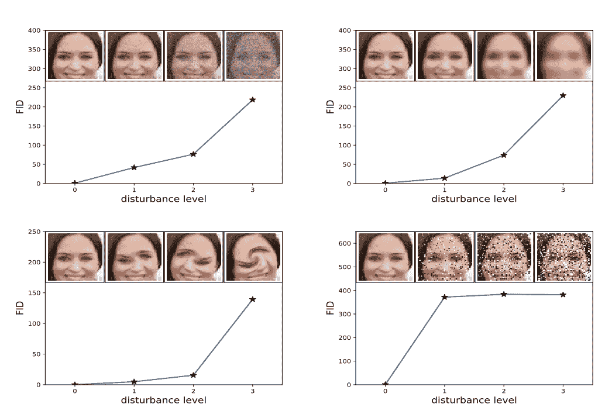

# 如何实现评估 GANs 的 Frechet 初始距离

> 原文：<https://machinelearningmastery.com/how-to-implement-the-frechet-inception-distance-fid-from-scratch/>

最后更新于 2019 年 10 月 11 日

Frechet 初始距离分数(简称 FID)是一种度量标准，用于计算为真实图像和生成图像计算的特征向量之间的距离。

分数总结了两组在使用用于图像分类的初始 v3 模型计算的原始图像的计算机视觉特征的统计方面有多相似。较低的分数表示两组图像更相似，或具有更相似的统计数据，满分为 0.0 表示两组图像相同。

FID 分数用于评估生成对抗网络生成的图像质量，较低的分数已被证明与较高质量的图像有很好的相关性。

在本教程中，您将发现如何实现 Frechet 初始距离来评估生成的图像。

完成本教程后，您将知道:

*   Frechet 初始距离汇总了同一域中真实图像和生成图像的初始特征向量之间的距离。
*   如何在 NumPy 中计算 FID 分数并从零开始实现计算？
*   如何利用 Keras 深度学习库实现 FID 评分，并用真实图像计算。

**用我的新书[Python 生成对抗网络](https://machinelearningmastery.com/generative_adversarial_networks/)启动你的项目**，包括*分步教程*和所有示例的 *Python 源代码*文件。

我们开始吧。

*   【2019 年 10 月更新:修复了方法描述中的小错别字。


如何从零开始实现 Frechet 初始距离(FID)来评估生成的图像
照片由[德诺比克](https://www.flickr.com/photos/132646954@N02/36653868946/)，保留部分权利。

## 教程概述

本教程分为五个部分；它们是:

1.  什么是 FrechetInception 距离？
2.  如何计算弗雷歇初始距离
3.  如何用 NumPy 实现 Frechet 初始距离
4.  如何用 Keras 实现 Frechet 初始距离
5.  如何计算真实图像的弗雷歇初始距离

## 什么是 FrechetInception 距离？

Frechet 初始距离，简称 FID，是一种评估生成图像质量的指标，专门用于评估生成对抗网络的表现。

FID 分数是由[Martin heussel](https://www.linkedin.com/in/mheusel/)等人在他们 2017 年的论文中提出并使用的，该论文的标题为“[通过两时间尺度更新规则训练的 GANs 收敛到局部纳什均衡](https://arxiv.org/abs/1706.08500017)

该分数是作为对现有初始得分(即 IS)的改进而提出的。

> 为了评估 GANs 在图像生成方面的表现，我们引入了“Frechet 初始距离”(FID)，它比初始得分更好地捕捉了生成图像与真实图像的相似性。

——[通过两时间尺度更新规则训练的 GANs 收敛到局部纳什均衡，2017](https://arxiv.org/abs/1706.08500) 。

初始得分基于表现最好的图像分类模型[初始 v3](https://machinelearningmastery.com/how-to-implement-major-architecture-innovations-for-convolutional-neural-networks/) 将合成图像分类为 1000 个已知对象之一的程度来估计合成图像集合的质量。分数结合了每个合成图像的条件类别预测的置信度(质量)和预测类别的边缘概率的积分(多样性)。

初始得分没有记录合成图像与真实图像的对比情况。开发 FID 评分的目标是基于合成图像集合的统计数据与来自目标域的真实图像集合的统计数据进行比较来评估合成图像。

> 初始得分的缺点是没有使用真实世界样本的统计数据，并且与合成样本的统计数据进行比较。

——[通过两时间尺度更新规则训练的 GANs 收敛到局部纳什均衡](https://arxiv.org/abs/1706.08500)，2017。

与初始得分一样，FID 分数使用初始 v3 模型。具体而言，模型的编码层(图像输出分类之前的最后一个池化层)用于捕获输入图像的计算机视觉特定特征。这些激活是为真实和生成的图像集合计算的。

通过计算图像的[平均值和协方差](https://machinelearningmastery.com/introduction-to-expected-value-variance-and-covariance/)，激活被总结为多元高斯。然后计算真实和生成图像集合中激活的统计数据。

然后使用[Frechet 距离](https://en.wikipedia.org/wiki/Fr%C3%A9chet_distance)计算这两个分布之间的距离，也称为 Wasserstein-2 距离。

> 两个高斯图像(合成图像和真实图像)的差异是通过 Frechet 距离(也称为 Wasserstein-2 距离)来测量的。

——[通过两时间尺度更新规则训练的 GANs 收敛到局部纳什均衡](https://arxiv.org/abs/1706.08500)，2017。

使用《Inception v3》模型中的激活来总结每张图像，为该分数命名为“*FrechetInception 距离*”

较低的 FID 表示图像质量较好；相反，较高的分数表示较低质量的图像，并且该关系可以是线性的。

该分数的作者表明，当应用系统失真(如添加随机噪声和模糊)时，较低的 FID 分数与较高质量的图像相关。



图像失真增加如何与高 FID 分数相关的示例。
取自:两时间尺度更新规则训练的 GANs 收敛到局部纳什均衡。

## 如何计算弗雷歇初始距离

FID 分数是通过首先加载一个预先训练好的 Inception v3 模型来计算的。

移除模型的输出层，并将输出作为来自最后一个池化层的激活，即[全局空间池化层](https://machinelearningmastery.com/pooling-layers-for-convolutional-neural-networks/)。

该输出层有 2，048 个激活，因此，每个图像被预测为 2，048 个激活特征。这被称为图像的编码向量或特征向量。

然后为来自问题域的真实图像集合预测 2，048 个特征向量，以提供真实图像如何表示的参考。然后可以为合成图像计算特征向量。

结果将是真实图像和生成图像的 2，048 个特征向量的两个集合。

然后，使用取自论文的以下等式计算 FID 分数:

*   d ^ 2 = | | mu _ 1-mu _ 2 | ^ 2+tr(c _ 1+c _ 2–2 * sqrt(c _ 1 * c _ 2))

分数被称为 *d^2* ，表示它是一个距离，有平方单位。

“*μ_ 1*”和“*μ_ 2*”是指真实图像和生成图像的特征平均，例如 2，048 个元素向量，其中每个元素是在图像上观察到的平均特征。

*C_1* 和 *C_2* 是真实和生成的特征向量的[协方差矩阵](https://en.wikipedia.org/wiki/Covariance_matrix)，通常称为σ。

*| |μ_ 1–mu_2||^2*是指两个均值向量之间的平方差之和。 *Tr* 指的是[迹线性代数运算](https://en.wikipedia.org/wiki/Trace_(linear_algebra))，例如沿着方阵主对角线的元素之和。

sqrt 是方阵的[平方根，作为两个协方差矩阵的乘积给出。](https://en.wikipedia.org/wiki/Square_root_of_a_matrix)

矩阵的平方根也常写成 *M^(1/2)* ，例如矩阵的二分之一次方，也有同样的效果。根据矩阵中的值，该操作可能会失败，因为该操作是使用数值方法求解的。通常，所得矩阵中的一些元素可能是虚的，这通常可以被检测和移除。

## 如何用 NumPy 实现 Frechet 初始距离

用 Python 中的 [NumPy 数组](https://machinelearningmastery.com/gentle-introduction-n-dimensional-arrays-python-numpy/)实现 FID 分数的计算非常简单。

首先，让我们定义一个函数，该函数将获取真实和生成图像的激活集合，并返回 FID 分数。

下面列出的 *calculate_fid()* 函数执行该程序。

这里，我们几乎直接实现了 FID 计算。值得注意的是，TensorFlow 中的[官方实现以稍微不同的顺序实现计算元素，可能是为了提高效率，并在矩阵平方根周围引入了额外的检查，以处理可能的数值不稳定性。](https://github.com/bioinf-jku/TTUR)

如果您在自己的数据集上计算 FID 时遇到问题，我建议查看官方实现并扩展下面的实现来添加这些检查。

```py
# calculate frechet inception distance
def calculate_fid(act1, act2):
	# calculate mean and covariance statistics
	mu1, sigma1 = act1.mean(axis=0), cov(act1, rowvar=False)
	mu2, sigma2 = act2.mean(axis=0), cov(act2, rowvar=False)
	# calculate sum squared difference between means
	ssdiff = numpy.sum((mu1 - mu2)**2.0)
	# calculate sqrt of product between cov
	covmean = sqrtm(sigma1.dot(sigma2))
	# check and correct imaginary numbers from sqrt
	if iscomplexobj(covmean):
		covmean = covmean.real
	# calculate score
	fid = ssdiff + trace(sigma1 + sigma2 - 2.0 * covmean)
	return fid
```

然后我们可以测试这个函数来计算一些人为特征向量的初始得分。

特征向量可能包含小正值，长度为 2，048 个元素。我们可以用小随机数构造两批 10 幅图像的特征向量，如下所示:

```py
...
# define two collections of activations
act1 = random(10*2048)
act1 = act1.reshape((10,2048))
act2 = random(10*2048)
act2 = act2.reshape((10,2048))
```

一个测试是计算一组激活和它本身之间的 FID，我们希望它的分数为 0.0。

然后，我们可以计算两组随机激活之间的距离，我们预计这将是一个很大的数字。

```py
...
# fid between act1 and act1
fid = calculate_fid(act1, act1)
print('FID (same): %.3f' % fid)
# fid between act1 and act2
fid = calculate_fid(act1, act2)
print('FID (different): %.3f' % fid)
```

将这些结合在一起，完整的示例如下所示。

```py
# example of calculating the frechet inception distance
import numpy
from numpy import cov
from numpy import trace
from numpy import iscomplexobj
from numpy.random import random
from scipy.linalg import sqrtm

# calculate frechet inception distance
def calculate_fid(act1, act2):
	# calculate mean and covariance statistics
	mu1, sigma1 = act1.mean(axis=0), cov(act1, rowvar=False)
	mu2, sigma2 = act2.mean(axis=0), cov(act2, rowvar=False)
	# calculate sum squared difference between means
	ssdiff = numpy.sum((mu1 - mu2)**2.0)
	# calculate sqrt of product between cov
	covmean = sqrtm(sigma1.dot(sigma2))
	# check and correct imaginary numbers from sqrt
	if iscomplexobj(covmean):
		covmean = covmean.real
	# calculate score
	fid = ssdiff + trace(sigma1 + sigma2 - 2.0 * covmean)
	return fid

# define two collections of activations
act1 = random(10*2048)
act1 = act1.reshape((10,2048))
act2 = random(10*2048)
act2 = act2.reshape((10,2048))
# fid between act1 and act1
fid = calculate_fid(act1, act1)
print('FID (same): %.3f' % fid)
# fid between act1 and act2
fid = calculate_fid(act1, act2)
print('FID (different): %.3f' % fid)
```

运行该示例首先报告 act1 激活和自身之间的 FID，正如我们所期望的，它是 0.0(**注意**:分数的符号可以忽略)。

两个随机激活集合之间的距离也如我们所料:一个很大的数字，在本例中是 358。

```py
FID (same): -0.000
FID (different): 358.927
```

您可能想尝试计算 FID 分数，并测试其他病理病例。

## 如何用 Keras 实现 Frechet 初始距离

现在我们知道如何计算 FID 分数并在 NumPy 中实现它，我们可以在 Keras 中开发一个实现。

这包括准备图像数据，并使用预训练的初始 v3 模型来计算每个图像的激活或特征向量。

首先，我们可以直接在 Keras 中加载 Inception v3 模型。

```py
...
# load inception v3 model
model = InceptionV3()
```

这将准备一个初始模型的版本，用于将图像分类为 1000 个已知类别之一。我们可以通过 *include_top=False* 参数移除模型的输出(顶部)。令人痛苦的是，这也删除了我们需要的全局平均池层，但是我们可以通过指定*池='avg'* 参数将其添加回来。

当模型的输出层被移除时，我们必须指定输入图像的形状，即 299x299x3 像素，例如 *input_shape=(299，299，3)* 参数。

因此，初始模型可以如下加载:

```py
...
# prepare the inception v3 model
model = InceptionV3(include_top=False, pooling='avg', input_shape=(299,299,3))
```

然后，该模型可用于预测一幅或多幅图像的特征向量。

我们的图像可能没有所需的形状。我们将使用 [scikit-image 库](https://scikit-image.org/)将像素值的 NumPy 数组调整到所需的大小。下面的 *scale_images()* 功能实现了这一点。

```py
# scale an array of images to a new size
def scale_images(images, new_shape):
	images_list = list()
	for image in images:
		# resize with nearest neighbor interpolation
		new_image = resize(image, new_shape, 0)
		# store
		images_list.append(new_image)
	return asarray(images_list)
```

注意，您可能需要安装 scikit-image 库。这可以通过以下方式实现:

```py
sudo pip install scikit-image
```

一旦调整大小，图像像素值也需要进行缩放，以满足对初始模型输入的期望。这可以通过调用*prepare _ input()*函数来实现。

我们可以更新上一节中定义的 *calculate_fid()* 函数，将加载的初始模型和图像数据的两个 NumPy 数组作为参数，而不是激活。然后，该功能将像以前一样，在计算 FID 分数之前计算激活。

*calculate_fid()* 功能的更新版本如下。

```py
# calculate frechet inception distance
def calculate_fid(model, images1, images2):
	# calculate activations
	act1 = model.predict(images1)
	act2 = model.predict(images2)
	# calculate mean and covariance statistics
	mu1, sigma1 = act1.mean(axis=0), cov(act1, rowvar=False)
	mu2, sigma2 = act2.mean(axis=0), cov(act2, rowvar=False)
	# calculate sum squared difference between means
	ssdiff = numpy.sum((mu1 - mu2)**2.0)
	# calculate sqrt of product between cov
	covmean = sqrtm(sigma1.dot(sigma2))
	# check and correct imaginary numbers from sqrt
	if iscomplexobj(covmean):
		covmean = covmean.real
	# calculate score
	fid = ssdiff + trace(sigma1 + sigma2 - 2.0 * covmean)
	return fid
```

然后，我们可以用一些人为的图像集合来测试这个函数，在这种情况下，10 个 32×32 的图像，随机像素值在[0，255]范围内。

```py
...
# define two fake collections of images
images1 = randint(0, 255, 10*32*32*3)
images1 = images1.reshape((10,32,32,3))
images2 = randint(0, 255, 10*32*32*3)
images2 = images2.reshape((10,32,32,3))
```

然后，我们可以将整数像素值转换为浮点值，并将其缩放至所需的 299×299 像素大小。

```py
...
# convert integer to floating point values
images1 = images1.astype('float32')
images2 = images2.astype('float32')
# resize images
images1 = scale_images(images1, (299,299,3))
images2 = scale_images(images2, (299,299,3))
```

然后可以缩放像素值以满足 Inception v3 模型的期望。

```py
...
# pre-process images
images1 = preprocess_input(images1)
images2 = preprocess_input(images2)
```

然后计算 FID 分数，首先在一组图像和自身之间，然后在两组图像之间。

```py
...
# fid between images1 and images1
fid = calculate_fid(model, images1, images1)
print('FID (same): %.3f' % fid)
# fid between images1 and images2
fid = calculate_fid(model, images1, images2)
print('FID (different): %.3f' % fid)
```

将所有这些结合在一起，下面列出了完整的示例。

```py
# example of calculating the frechet inception distance in Keras
import numpy
from numpy import cov
from numpy import trace
from numpy import iscomplexobj
from numpy import asarray
from numpy.random import randint
from scipy.linalg import sqrtm
from keras.applications.inception_v3 import InceptionV3
from keras.applications.inception_v3 import preprocess_input
from keras.datasets.mnist import load_data
from skimage.transform import resize

# scale an array of images to a new size
def scale_images(images, new_shape):
	images_list = list()
	for image in images:
		# resize with nearest neighbor interpolation
		new_image = resize(image, new_shape, 0)
		# store
		images_list.append(new_image)
	return asarray(images_list)

# calculate frechet inception distance
def calculate_fid(model, images1, images2):
	# calculate activations
	act1 = model.predict(images1)
	act2 = model.predict(images2)
	# calculate mean and covariance statistics
	mu1, sigma1 = act1.mean(axis=0), cov(act1, rowvar=False)
	mu2, sigma2 = act2.mean(axis=0), cov(act2, rowvar=False)
	# calculate sum squared difference between means
	ssdiff = numpy.sum((mu1 - mu2)**2.0)
	# calculate sqrt of product between cov
	covmean = sqrtm(sigma1.dot(sigma2))
	# check and correct imaginary numbers from sqrt
	if iscomplexobj(covmean):
		covmean = covmean.real
	# calculate score
	fid = ssdiff + trace(sigma1 + sigma2 - 2.0 * covmean)
	return fid

# prepare the inception v3 model
model = InceptionV3(include_top=False, pooling='avg', input_shape=(299,299,3))
# define two fake collections of images
images1 = randint(0, 255, 10*32*32*3)
images1 = images1.reshape((10,32,32,3))
images2 = randint(0, 255, 10*32*32*3)
images2 = images2.reshape((10,32,32,3))
print('Prepared', images1.shape, images2.shape)
# convert integer to floating point values
images1 = images1.astype('float32')
images2 = images2.astype('float32')
# resize images
images1 = scale_images(images1, (299,299,3))
images2 = scale_images(images2, (299,299,3))
print('Scaled', images1.shape, images2.shape)
# pre-process images
images1 = preprocess_input(images1)
images2 = preprocess_input(images2)
# fid between images1 and images1
fid = calculate_fid(model, images1, images1)
print('FID (same): %.3f' % fid)
# fid between images1 and images2
fid = calculate_fid(model, images1, images2)
print('FID (different): %.3f' % fid)
```

运行该示例首先总结了合成图像的形状及其重新缩放的版本，与我们的预期相符。

**注**:第一次使用 InceptionV3 模型时，Keras 会下载模型权重保存到 *~/。工作站上的 keras/models/* 目录。权重约为 100 兆字节，根据您的互联网连接速度，下载可能需要一些时间。

给定的一组图像和它本身之间的 FID 分数是 0.0，正如我们所期望的，两个随机图像集合之间的距离大约是 35。

```py
Prepared (10, 32, 32, 3) (10, 32, 32, 3)
Scaled (10, 299, 299, 3) (10, 299, 299, 3)
FID (same): -0.000
FID (different): 35.495
```

## 如何计算真实图像的弗雷歇初始距离

计算两组真实图像之间的 FID 分数可能很有用。

Keras 库提供了许多计算机视觉数据集，包括 [CIFAR-10 数据集](https://machinelearningmastery.com/how-to-develop-a-cnn-from-scratch-for-cifar-10-photo-classification/)。这些是小尺寸 32×32 像素的彩色照片，分为训练和测试元素，可按如下方式加载:

```py
...
# load cifar10 images
(images1, _), (images2, _) = cifar10.load_data()
```

训练数据集有 50，000 个图像，而测试数据集只有 10，000 个图像。计算这两个数据集之间的 FID 分数以了解测试数据集在训练数据集中的代表性可能会很有趣。

缩放和评分 50K 图像需要很长时间，因此，我们可以将“*训练集*”简化为 10K 随机样本，如下所示:

```py
...
shuffle(images1)
images1 = images1[:10000]
```

将所有这些联系在一起，我们可以计算列车样本和测试数据集之间的 FID 分数，如下所示。

```py
# example of calculating the frechet inception distance in Keras for cifar10
import numpy
from numpy import cov
from numpy import trace
from numpy import iscomplexobj
from numpy import asarray
from numpy.random import shuffle
from scipy.linalg import sqrtm
from keras.applications.inception_v3 import InceptionV3
from keras.applications.inception_v3 import preprocess_input
from keras.datasets.mnist import load_data
from skimage.transform import resize
from keras.datasets import cifar10

# scale an array of images to a new size
def scale_images(images, new_shape):
	images_list = list()
	for image in images:
		# resize with nearest neighbor interpolation
		new_image = resize(image, new_shape, 0)
		# store
		images_list.append(new_image)
	return asarray(images_list)

# calculate frechet inception distance
def calculate_fid(model, images1, images2):
	# calculate activations
	act1 = model.predict(images1)
	act2 = model.predict(images2)
	# calculate mean and covariance statistics
	mu1, sigma1 = act1.mean(axis=0), cov(act1, rowvar=False)
	mu2, sigma2 = act2.mean(axis=0), cov(act2, rowvar=False)
	# calculate sum squared difference between means
	ssdiff = numpy.sum((mu1 - mu2)**2.0)
	# calculate sqrt of product between cov
	covmean = sqrtm(sigma1.dot(sigma2))
	# check and correct imaginary numbers from sqrt
	if iscomplexobj(covmean):
		covmean = covmean.real
	# calculate score
	fid = ssdiff + trace(sigma1 + sigma2 - 2.0 * covmean)
	return fid

# prepare the inception v3 model
model = InceptionV3(include_top=False, pooling='avg', input_shape=(299,299,3))
# load cifar10 images
(images1, _), (images2, _) = cifar10.load_data()
shuffle(images1)
images1 = images1[:10000]
print('Loaded', images1.shape, images2.shape)
# convert integer to floating point values
images1 = images1.astype('float32')
images2 = images2.astype('float32')
# resize images
images1 = scale_images(images1, (299,299,3))
images2 = scale_images(images2, (299,299,3))
print('Scaled', images1.shape, images2.shape)
# pre-process images
images1 = preprocess_input(images1)
images2 = preprocess_input(images2)
# calculate fid
fid = calculate_fid(model, images1, images2)
print('FID: %.3f' % fid)
```

根据工作站的速度，运行该示例可能需要一些时间。

在运行结束时，我们可以看到训练数据集和测试数据集之间的 FID 分数约为 5。

```py
Loaded (10000, 32, 32, 3) (10000, 32, 32, 3)
Scaled (10000, 299, 299, 3) (10000, 299, 299, 3)
FID: 5.492
```

## 进一步阅读

如果您想更深入地了解这个主题，本节将提供更多资源。

### 报纸

*   [通过两时间尺度更新规则训练的遗传神经网络收敛到局部纳什均衡](https://arxiv.org/abs/1706.08500)，2017。
*   【GANs 生来平等吗？一项大型研究，2017 年。
*   [GAN 评估办法的利弊](https://arxiv.org/abs/1802.03446)，2018 年。

### 代码项目

*   [GitHub TensorFlow 中的正式实现](https://github.com/bioinf-jku/TTUR)。
*   [GitHub](https://github.com/mseitzer/pytorch-fid)中 PyTorch 的 Frechet 初始距离(FID 评分)。

### 应用程序接口

*   num py . trace API。
*   num py . cov API。
*   [num py . isccomplexibjapi](https://docs.scipy.org/doc/numpy/reference/generated/numpy.iscomplexobj.html)。
*   [Keras Inception v3 模型](https://keras.io/applications/#inceptionv3)
*   [sci kit-图像库](https://scikit-image.org/)

### 文章

*   [Frechet 初启距离](https://bluewidz.blogspot.com/2017/12/frechet-inception-distance.html)，2017 年。
*   [Frechet 初启距离](https://nealjean.com/ml/frechet-inception-distance/)，2018 年。
*   淘气距离，维基百科。
*   [协方差矩阵，维基百科](https://en.wikipedia.org/wiki/Covariance_matrix)。
*   [矩阵的平方根，维基百科](https://en.wikipedia.org/wiki/Square_root_of_a_matrix)。

## 摘要

在本教程中，您发现了如何实现 Frechet 初始距离来评估生成的图像。

具体来说，您了解到:

*   Frechet 初始距离汇总了同一域中真实图像和生成图像的初始特征向量之间的距离。
*   如何在 NumPy 中计算 FID 分数并从零开始实现计算？
*   如何利用 Keras 深度学习库实现 FID 评分，并用真实图像计算。

你有什么问题吗？
在下面的评论中提问，我会尽力回答。