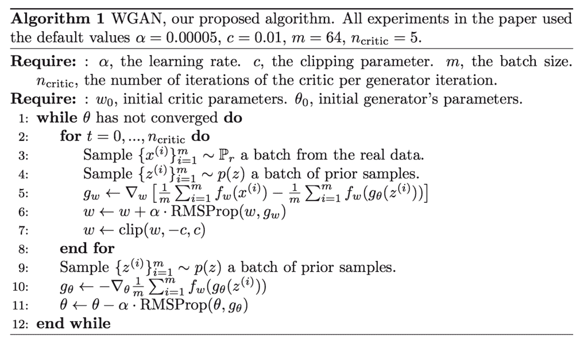

# 如何实现生成对抗网络的 Wasserstein 损失

> 原文：<https://machinelearningmastery.com/how-to-implement-wasserstein-loss-for-generative-adversarial-networks/>

Wasserstein 生成对抗网络是生成对抗网络的扩展，既提高了训练模型时的稳定性，又提供了与生成图像质量相关的损失函数。

它是 GAN 模型的一个重要扩展，需要从预测生成图像“真实”概率的鉴别器向给定图像“真实”评分的批评模型转变。

这种概念上的转变在数学上是利用地球动子距离或 Wasserstein 距离来训练 GAN，GAN 测量训练数据集中观察到的数据分布和生成的示例中观察到的分布之间的距离。

在这篇文章中，你将发现如何为生成对抗网络实现 Wasserstein 损失。

看完这篇文章，你会知道:

*   WGAN 的概念转变，从预测概率的鉴别者转变为预测分数的批评家。
*   WGAN 的实现细节是对标准深度卷积 GAN 的微小改变。
*   Wasserstein 损失函数背后的直觉以及如何从头实现它。

**用我的新书[Python 生成对抗网络](https://machinelearningmastery.com/generative_adversarial_networks/)启动你的项目**，包括*分步教程*和所有示例的 *Python 源代码*文件。

我们开始吧。


如何实现生成对抗网络的 Wasserstein 损失
图片由[布兰登·莱文格](https://www.flickr.com/photos/34205304@N05/7700239718)提供，保留部分权利。

## 概观

本教程分为五个部分；它们是:

1.  GAN 稳定性与鉴别器
2.  什么是 Wasserstein GAN？
3.  Wasserstein GAN 的实现细节
4.  如何实现 Wasserstein 损失
5.  预期标签的常见混淆点

## GAN 稳定性与鉴别器

生成对抗网络，或称 GANs，训练起来很有挑战性。

鉴别器模型必须将给定的输入图像分类为真实(来自数据集)或虚假(生成的)，生成器模型必须生成新的似是而非的图像。

GANs 难以训练的原因是该架构涉及零和游戏中生成器和鉴别器模型的同时训练。稳定的训练需要在两种模型的能力之间找到并保持平衡。

鉴别器模型是学习二进制分类问题的神经网络，在输出层使用 sigmoid 激活函数，并使用二进制交叉熵损失函数进行拟合。因此，该模型预测给定输入是真实的(或假的为 1 减去预测值)的概率为 0 到 1 之间的值。

对于给定的图像，损失函数具有与预测的概率分布与预期的概率分布相差多少成比例地惩罚模型的效果。这为通过鉴别器和生成器反向传播的错误提供了基础，以便在下一批中表现更好。

WGAN 在训练 GAN 时放松了鉴别者的角色，并提出了批评家的替代方案。

## 什么是 Wasserstein GAN？

Wasserstein 甘，简称 WGAN，是由 Martin Arjovsky 等人在 2017 年发表的论文《Wasserstein 甘》中介绍的

它是 GAN 的扩展，寻求一种训练生成器模型的替代方法，以更好地近似给定训练数据集中观察到的数据分布。

WGAN 不是使用鉴别器来分类或预测生成的图像是真的还是假的概率，而是改变鉴别器模型或用给定图像的真实性或假性评分的批评家来代替鉴别器模型。

这种变化是由一个数学论点引起的，即训练生成器应该寻求最小化在训练数据集中观察到的数据分布和在生成的示例中观察到的分布之间的距离。该论点对比了不同的分布距离度量，如库尔巴克-莱布勒散度、詹森-香农散度和地球移动距离，称为 Wasserstein 距离。

> 这种距离之间最根本的区别是它们对概率分布序列收敛的影响。

——2017 年[一根筋](https://arxiv.org/abs/1701.07875)。

他们证明了一个批判性的神经网络可以被训练来逼近 Wasserstein 距离，进而被用来有效地训练发电机模型。

> ……我们定义了一种称为 Wasserstein-GAN 的 GAN 形式，它使 EM 距离的合理有效近似最小化，我们从理论上证明了相应的优化问题是合理的。

——2017 年[一根筋](https://arxiv.org/abs/1701.07875)。

重要的是，Wasserstein 距离具有连续性和可微性的特性，即使在批评家训练有素之后，它也能继续提供线性梯度。

> 电磁距离是连续的和可微的这一事实意味着我们可以(并且应该)训练批评家直到最优性。[……]我们训练批评家越多，我们得到的 Wasserstein 梯度就越可靠，这实际上是有用的，因为 Wasserstein 几乎在任何地方都是可微的。

——2017 年[一根筋](https://arxiv.org/abs/1701.07875)。

这与鉴别器模型不同，鉴别器模型一旦被训练，可能无法为更新生成器模型提供有用的梯度信息。

> 鉴别器学习辨别真假非常快，而且不出所料，没有提供可靠的梯度信息。然而，批评家不能饱和，并且收敛到一个线性函数，该函数在任何地方都给出非常干净的梯度。

——2017 年[一根筋](https://arxiv.org/abs/1701.07875)。

WGAN 的好处是训练过程更稳定，对模型架构和超参数配置的选择不太敏感。

> ……训练 WGANs 不需要在训练鉴别器和生成器时保持谨慎的平衡，也不需要仔细设计网络架构。GANs 中典型的模式下降现象也大大减少。

——2017 年[一根筋](https://arxiv.org/abs/1701.07875)。

也许最重要的是，鉴别器的损失似乎与发生器产生的图像质量有关。

具体地，当评估生成的图像时，批评家的损失越低，生成的图像的期望质量越高。这一点很重要，因为与其他寻求两个模型之间平衡的发电机不同，WGAN 寻求收敛，降低发电机损耗。

> 据我们所知，这是 GAN 文献中第一次显示出这样的性质，其中 GAN 的损失显示出收敛的性质。当在敌对网络中进行研究时，这种特性非常有用，因为人们不需要盯着生成的样本来找出故障模式，也不需要获得哪些模型比其他模型做得更好的信息。

——2017 年[一根筋](https://arxiv.org/abs/1701.07875)。

## Wasserstein GAN 的实现细节

虽然 WGAN 的理论基础是密集的，但是 WGAN 的实现需要对标准的深度卷积 GAN 或 DCGAN 进行一些小的改变。

这些变化如下:

*   在批评模型的输出层使用线性激活函数(而不是 sigmoid)。
*   使用 Wasserstein 损失来训练批评者和生成者模型，这些模型促进了真实图像和生成图像之间更大的分数差异。
*   每次小批量更新后，将关键模型权重限制在有限的范围内(例如[-0.01，0.01])。

> 为了使参数 W 位于一个紧凑的空间中，我们可以做一些简单的事情，即在每次梯度更新后将权重固定在一个固定的框中(比如 W =[0.01，0.01]l)。

——2017 年[一根筋](https://arxiv.org/abs/1701.07875)。

*   每次迭代更新批评模型的次数比生成器多(例如 5 次)。
*   使用 RMSProp 版本的梯度下降，学习率小，没有动量(例如 0.00005)。

> …我们报告说，当使用基于动量的优化器(如 Adam ……)时，WGAN 训练有时会变得不稳定。因此，我们转而使用 RMSProp …

——2017 年[一根筋](https://arxiv.org/abs/1701.07875)。

下图总结了训练 WGAN 的主要训练循环，摘自论文。请注意模型中使用的推荐超参数列表。



Wasserstein 生成对抗网络的算法。
取自:Wasserstein GAN。

## 如何实现 Wasserstein 损失

Wasserstein 损失函数试图增加真实图像和生成图像分数之间的差距。

我们可以将本文中描述的功能总结如下:

*   批评家损失=[真实图像的平均批评家得分]–[虚假图像的平均批评家得分]
*   生成器损失=-[伪图像的平均评论分数]

其中平均分数是通过小批量样本计算的。

这正是 PyTorch 和 TensorFlow 等基于图的深度学习框架的损失实现方式。

一旦我们回忆起随机梯度下降寻求最小化损失，计算就很容易解释。

在生成器的情况下，批评者的较大分数将导致生成器的较小损失，从而鼓励批评者为假图像输出较大分数。比如平均分 10 变成-10，平均分 50 变成-50，哪个小，等等。

在批评家的情况下，真实图像的较大分数导致批评家的较大损失，从而惩罚模型。这鼓励评论家输出真实图像的较小分数。例如，真实图像的平均得分为 20 分，而虚假图像的平均得分为 50 分，则损失为-30 分；真实图像的平均得分为 10 分，伪造图像的平均得分为 50 分，结果是-40 分的损失，以此类推。

在这种情况下，损失的迹象并不重要，只要真实图像的损失是一个小数字，而虚假图像的损失是一个大数字。Wasserstein 的损失促使评论家将这些数字分开。

我们也可以扭转这种情况，鼓励评论家输出真实图像的大分数和虚假图像的小分数，达到同样的效果。一些实现进行了这种改变。

在 Keras 深度学习库中(以及其他一些库中)，我们不能像在论文中描述的那样直接实现 Wasserstein 损失函数，也不能像在 PyTorch 和 TensorFlow 中实现的那样直接实现。相反，我们可以达到同样的效果，而不必让评论家的损失计算依赖于真图像和假图像的损失计算。

思考这个问题的一个好方法是对真实图像进行负评分，对假图像进行正评分，尽管这种在训练中学习的分数的负/正分割不是必需的；只要大一点、小一点就够了。

*   小评论家评分(如< 0): Real – Large Critic Score (e.g. > 0):假

在假图像的情况下，我们可以将平均预测得分乘以-1，这样较大的平均值变成较小的平均值，并且梯度方向正确，即最小化损失。例如，在计算权重更新时，三批假图像的[0.5、0.8 和 1.0]假图像的平均分数将变为[-0.5、-0.8 和-1.0]。

*   假图像损失= -1 *平均评论家评分

真实分数的情况不需要改变，因为我们希望鼓励真实图像的平均分数更小。

*   真实图像的损失=平均评论家评分

这可以通过为假图像分配-1 的预期结果目标和为真实图像分配 1 的预期结果目标，并将损失函数作为预期标签乘以平均分数来实现。-1 标签将乘以假图像的平均分数，并鼓励更大的预测平均值，而+1 标签将乘以真实图像的平均分数，并没有效果，鼓励更小的预测平均值。

*   Wasserstein 损失=标签*平均评论家分数

或者

*   Wasserstein 损失(真实图像)= 1 *平均预测分数
*   Wasserstein 损失(假图像)= -1 *平均预测分数

我们可以在 Keras 中实现这一点，分别为假图像和真实图像分配-1 和 1 的期望标签。反向标签可以用于相同的效果，例如-1 表示真实，+1 表示伪造，以鼓励伪造图像的小分数和真实图像的大分数。一些开发人员确实以这种替代方式实现了 WGAN，这也是正确的。

损失函数可以通过将每个样本的预期标签乘以预测分数(元素方式)然后计算平均值来实现。

```py
def wasserstein_loss(y_true, y_pred):
	return mean(y_true * y_pred)
```

上述函数是实现损失函数的优雅方式；可能更直观的另一种不太优雅的实现如下:

```py
def wasserstein_loss(y_true, y_pred):
 	return mean(y_true) * mean(y_pred)
```

在 Keras 中，可以使用 [Keras 后端 API](https://keras.io/backend/) 实现均值函数，以确保在提供的张量中跨样本计算均值；例如:

```py
from keras import backend

# implementation of wasserstein loss
def wasserstein_loss(y_true, y_pred):
	return backend.mean(y_true * y_pred)
```

现在我们知道了如何在 Keras 中实现 Wasserstein 损失函数，让我们澄清一个常见的误解点。

## 预期标签的常见混淆点

回想一下，我们使用的是假图像的预期标签-1 和真实图像的预期标签+1。

一个常见的混淆点是，一个完美的评论家模型将输出-1 的每一个假图像和+1 的每一个真实图像。

这是不正确的。

再次提醒，我们正在使用随机梯度下降来寻找临界(和发生器)模型中最小化损失函数的权重集。

我们已经确定，我们希望评论家模型对假图像平均输出较大的分数，对真实图像平均输出较小的分数。然后我们设计了一个损失函数来鼓励这种结果。

这是用于训练神经网络模型的损失函数的关键点。他们鼓励期望的模型行为，并且他们不必通过提供预期的结果来实现这一点。在这种情况下，我们定义了我们的 Wasserstein 损失函数来解释评论家模型预测的平均分数，并使用真实和虚假案例的标签来帮助解释。

那么在 Wasserstein 损失下，真假图像的好损失是什么呢？

对于跨 GAN 模型的比较，Wasserstein 不是一个绝对的和可比较的损失。相反，它是相对的，取决于您的模型配置和数据集。重要的是，对于给定的批评模型，它是一致的，并且生成器的收敛(更好的损失)确实与更好的生成图像质量相关。

对于真实图像可以是负分数，对于假图像可以是正分数，但是这不是必需的。所有分数可以是正的，也可以是负的。

损失函数只是鼓励将假图像和真实图像的分数区分为更大和更小，而不一定是正和负。

## 进一步阅读

如果您想更深入地了解这个主题，本节将提供更多资源。

### 报纸

*   [水的输入 gan](https://arxiv.org/abs/1701.07875)2017 年。
*   、GitHub。

### 文章

*   [Wasserstein 生成对抗网络(WGANS)项目，GitHub](https://github.com/kpandey008/wasserstein-gans) 。
*   [Keras-GAN:生成对抗网络的 Keras 实现，GitHub](https://github.com/eriklindernoren/Keras-GAN) 。
*   [从 GAN 到 WGAN](https://lilianweng.github.io/lil-log/2017/08/20/from-GAN-to-WGAN.html) ，2017 年。
*   [甘-水甘&wgan-gp](https://medium.com/@jonathan_hui/gan-wasserstein-gan-wgan-gp-6a1a2aa1b490)2018 年。
*   [改良 WGAN，keras-contrib 项目，GitHub](https://github.com/keras-team/keras-contrib/blob/master/examples/improved_wgan.py) 。
*   [水分入甘](https://www.reddit.com/r/MachineLearning/comments/5qxoaz/r_170107875_wasserstein_gan/)，Reddit。
*   [喀尔巴阡山脉的 GAN 河](https://myurasov.github.io/2017/09/24/wasserstein-gan-keras.html)2017 年。
*   [Wasserstein 甘和坎特罗维奇-鲁宾斯坦二重性](https://vincentherrmann.github.io/blog/wasserstein/)
*   [WGAN Wasserstein 损失函数正确吗？](https://github.com/keras-team/keras-contrib/issues/280)

## 摘要

在这篇文章中，你发现了如何为生成对抗网络实现 Wasserstein 损失。

具体来说，您了解到:

*   WGAN 的概念转变，从预测概率的鉴别者转变为预测分数的批评家。
*   WGAN 的实现细节是对标准深度卷积 GAN 的微小改变。
*   Wasserstein 损失函数背后的直觉以及如何从头实现它。

你有什么问题吗？
在下面的评论中提问，我会尽力回答。