# 如何在生成人脸时探索 GAN 潜在空间

> 原文：<https://machinelearningmastery.com/how-to-interpolate-and-perform-vector-arithmetic-with-faces-using-a-generative-adversarial-network/>

最后更新于 2020 年 9 月 1 日

#### 如何利用插值和矢量算法探索 GAN 的潜在空间。

生成对抗网络是一种用于训练生成模型的体系结构，例如用于生成图像的深度卷积神经网络。

GAN 架构中的生成模型学习将潜在空间中的点映射到生成的图像。潜在空间除了通过生成模型应用于它的意义之外没有其他意义。然而，潜在空间具有可以探索的结构，例如通过在点之间进行插值以及在潜在空间中的点之间执行矢量运算，这些对生成的图像具有有意义的和有目标的效果。

在本教程中，您将发现如何为人脸生成开发一个生成对抗网络，并探索潜在空间的结构以及对生成人脸的影响。

完成本教程后，您将知道:

*   如何开发生成对抗网络来生成人脸？
*   如何在潜在空间中的点之间进行插值，并生成从一个面变形到另一个面的图像。
*   如何在潜在空间中执行矢量算法，并在生成的人脸中获得目标结果。

**用我的新书[Python 生成对抗网络](https://machinelearningmastery.com/generative_adversarial_networks/)启动你的项目**，包括*分步教程*和所有示例的 *Python 源代码*文件。

我们开始吧。

*   **2019 年 11 月更新:**针对 TensorFlow v2.0 和 MTCNN v0.1.0 进行了更新。

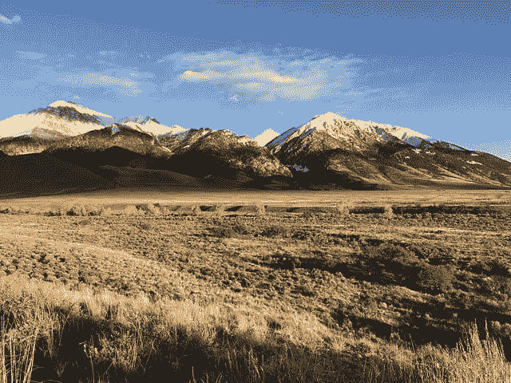

如何使用生成对抗网络对人脸进行插值和矢量运算。
图片由[山间森林服务](https://www.flickr.com/photos/107640324@N05/45701362542)提供，保留部分权利。

## 教程概述

本教程分为五个部分；它们是:

1.  潜在空间中的向量算法
2.  大规模名人脸数据集
3.  如何准备名人脸数据集
4.  如何发展生成对抗网络
5.  如何探索生成人脸的潜在空间

## 潜在空间中的向量算法

GAN 架构中的生成器模型以潜在空间中的一个点作为输入，并生成新的图像。

潜在空间本身没有任何意义。典型地，它是一个 100 维的超球面，每个变量都是从均值为零、标准差为 1 的[高斯分布](https://machinelearningmastery.com/statistical-data-distributions/)中提取的。通过训练，生成器学习将点映射到具有特定输出图像的潜在空间中，并且每次训练模型时，这种映射都是不同的。

当由生成器模型解释时，潜在空间具有结构，并且对于给定的模型，可以查询和导航该结构。

通常，使用潜在空间中的随机点生成新图像。更进一步，可以构建潜在空间中的点(例如，全 0、全 0.5s 或全 1)，并将其用作输入或查询来生成特定图像。

可以在潜在空间中两点之间的线性路径上创建一系列点，例如两个生成的图像。这些点可用于生成一系列图像，这些图像显示了两个生成的图像之间的过渡。

最后，可以保留潜在空间中的点，并在简单的矢量算法中使用这些点在潜在空间中创建新的点，这些点又可以用来生成图像。这是一个有趣的想法，因为它允许直观和有针对性地生成图像。

亚历克·拉德福德等人在 2015 年发表的题为“深度卷积生成对抗网络的无监督表示学习”的重要论文介绍了一种用于训练深度卷积神经网络模型的稳定模型配置，作为 GAN 体系结构的一部分。

在这篇论文中，作者探索了适合大量不同训练数据集的 GANs 的潜在空间，最显著的是名人脸数据集。他们展示了两个有趣的方面。

第一个是有脸的矢量算法。例如，一个微笑的女人的脸减去一个中立的女人的脸加上一个中立的男人的脸导致了一个微笑的男人的脸。

```py
smiling woman - neutral woman + neutral man = smiling man
```

具体而言，对所得面部的潜在空间中的点执行运算。实际上对具有给定特征的多个面进行平均，以提供更稳健的结果。

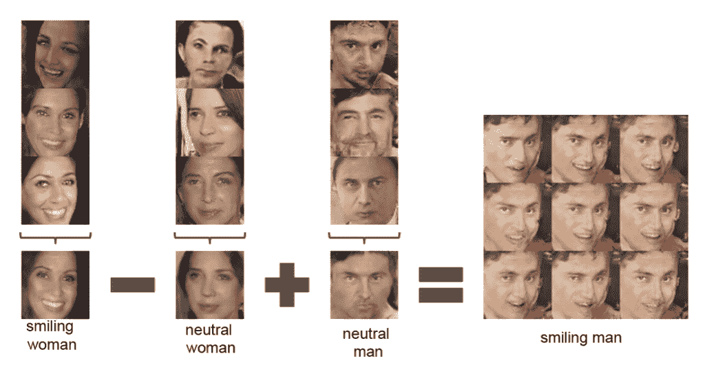

用 GAN 生成人脸的潜在空间中的点的矢量算法的例子。
取自深度卷积生成对抗网络的无监督表示学习。

第二个演示是两个生成的面之间的过渡，具体来说是通过在生成两个面的点之间创建一个穿过潜在维度的线性路径，然后为路径上的点生成所有的面。

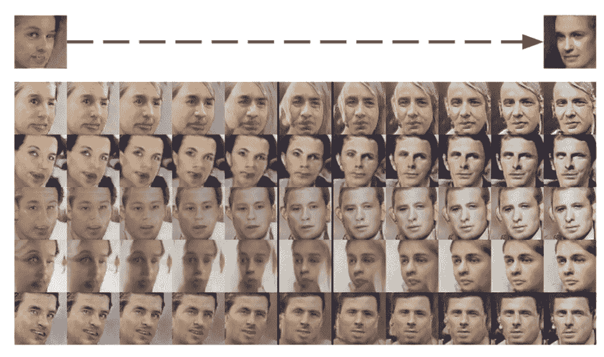

两个 GAN 生成面之间路径上的面示例。
取自深度卷积生成对抗网络的无监督表示学习。

探索 GAN 模型的潜在空间的结构对于问题领域来说是有趣的，并且有助于对生成器模型所学习的内容形成直觉。

在本教程中，我们将开发一个生成人脸照片的 GAN，然后用矢量算法探索模型的潜在空间。

## 大规模名人脸数据集

第一步是选择人脸数据集。

在本教程中，我们将使用[大规模名人脸属性数据集](http://mmlab.ie.cuhk.edu.hk/projects/CelebA.html)，简称为名人脸。这个数据集是由刘紫薇等人为他们 2015 年的论文“从面部部位反应到人脸检测:深度学习方法”开发和发布的

该数据集提供了大约 200，000 张名人脸的照片，以及给定照片中出现的内容的注释，例如眼镜、脸型、帽子、头发类型等。作为数据集的一部分，作者提供了以面部为中心的每张照片的版本，并将其裁剪成大约 150 像素宽、200 像素高的不同大小的人像。我们将以此为基础开发我们的 GAN 模型。

数据集可以很容易地从 Kaggle 网页上下载。注意:这可能需要在 Kaggle 有一个账户。

*   [名人脸属性(名人脸)数据集](https://www.kaggle.com/jessicali9530/celeba-dataset)

具体来说就是下载文件“ *img_align_celeba.zip* ，大概 1.3 千兆字节。为此，请单击 Kaggle 网站上的文件名，然后单击下载图标。

下载可能需要一段时间，这取决于您的互联网连接速度。

下载后，解压缩档案。

这将创建一个名为“ *img_align_celeba* ”的新目录，其中包含所有文件名像*【202599.jpg】*和*202598.jpg*的图像。

接下来，我们可以看看准备建模的原始图像。

## 如何准备名人脸数据集

第一步是开发代码来加载图像。

我们可以使用[枕库](https://machinelearningmastery.com/how-to-load-and-manipulate-images-for-deep-learning-in-python-with-pil-pillow/)加载一个给定的图像文件，将其转换为 RGB 格式(如果需要)并返回一个像素数据数组。下面的 load_image()函数实现了这一点。

```py
# load an image as an rgb numpy array
def load_image(filename):
	# load image from file
	image = Image.open(filename)
	# convert to RGB, if needed
	image = image.convert('RGB')
	# convert to array
	pixels = asarray(image)
	return pixels
```

接下来，我们可以枚举图像目录，依次将每个图像加载为一个像素数组，并返回一个包含所有图像的数组。

数据集中有 20 万张图像，这可能超过了我们的需求，因此我们也可以用一个参数来限制要加载的图像数量。下面的 *load_faces()* 函数实现了这一点。

```py
# load images and extract faces for all images in a directory
def load_faces(directory, n_faces):
	faces = list()
	# enumerate files
	for filename in listdir(directory):
		# load the image
		pixels = load_image(directory + filename)
		# store
		faces.append(pixels)
		# stop once we have enough
		if len(faces) >= n_faces:
			break
	return asarray(faces)
```

最后，一旦加载了图像，我们就可以使用 matplotlib 库中的 *imshow()* 函数来绘制它们。

下面的 *plot_faces()* 函数可以做到这一点，绘制排列成正方形的图像。

```py
# plot a list of loaded faces
def plot_faces(faces, n):
	for i in range(n * n):
		# define subplot
		pyplot.subplot(n, n, 1 + i)
		# turn off axis
		pyplot.axis('off')
		# plot raw pixel data
		pyplot.imshow(faces[i])
	pyplot.show()
```

将这些联系在一起，完整的示例如下所示。

```py
# load and plot faces
from os import listdir
from numpy import asarray
from PIL import Image
from matplotlib import pyplot

# load an image as an rgb numpy array
def load_image(filename):
	# load image from file
	image = Image.open(filename)
	# convert to RGB, if needed
	image = image.convert('RGB')
	# convert to array
	pixels = asarray(image)
	return pixels

# load images and extract faces for all images in a directory
def load_faces(directory, n_faces):
	faces = list()
	# enumerate files
	for filename in listdir(directory):
		# load the image
		pixels = load_image(directory + filename)
		# store
		faces.append(pixels)
		# stop once we have enough
		if len(faces) >= n_faces:
			break
	return asarray(faces)

# plot a list of loaded faces
def plot_faces(faces, n):
	for i in range(n * n):
		# define subplot
		pyplot.subplot(n, n, 1 + i)
		# turn off axis
		pyplot.axis('off')
		# plot raw pixel data
		pyplot.imshow(faces[i])
	pyplot.show()

# directory that contains all images
directory = 'img_align_celeba/'
# load and extract all faces
faces = load_faces(directory, 25)
print('Loaded: ', faces.shape)
# plot faces
plot_faces(faces, 5)
```

运行该示例从目录中总共加载了 25 个图像，然后总结了返回数组的大小。

```py
Loaded: (25, 218, 178, 3)
```

最后，将 25 幅图像绘制在一个 5×5 的正方形中。

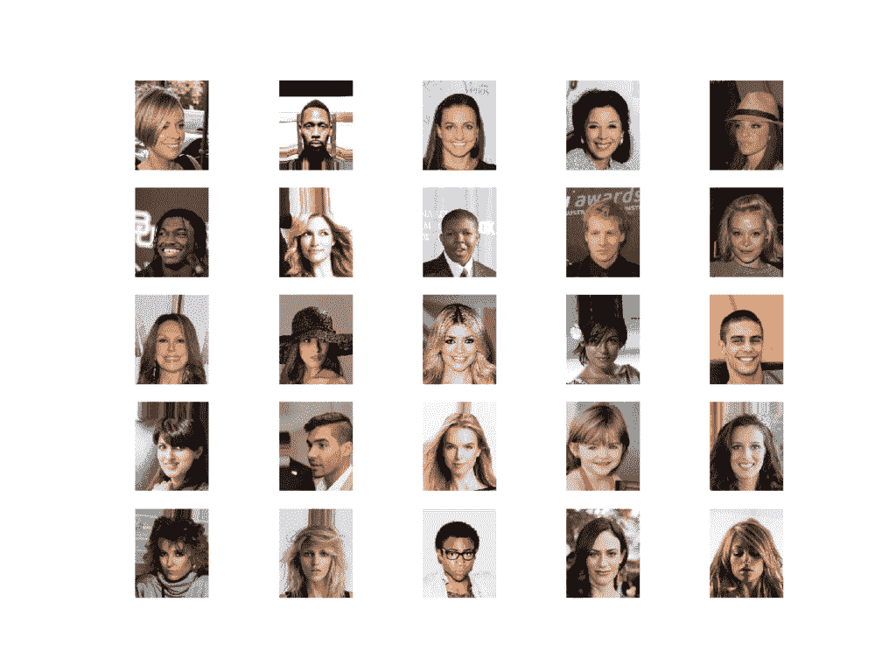

名人脸数据集中 25 张脸的样本图

当使用 GAN 时，如果所有的图像都很小并且是正方形的，那么对数据集建模会更容易。

此外，由于我们只对每张照片中的人脸感兴趣，而对背景不感兴趣，因此我们可以在将结果调整到固定大小之前执行人脸检测并仅提取人脸。

有许多方法可以进行人脸检测。在这种情况下，我们将使用预先训练的多任务级联卷积神经网络。这是一个最先进的人脸检测深度学习模型，在 2016 年发表的题为“使用多任务级联卷积网络的联合人脸检测和对齐”的论文中有所描述

我们将在 [ipazc/mtcnn 项目](https://github.com/ipazc/mtcnn)中使用 Ivan de Paz Centeno 提供的实现。该库可以通过 pip 安装，如下所示:

```py
sudo pip install mtcnn
```

我们可以通过导入库并打印版本来确认库安装正确；例如:

```py
# confirm mtcnn was installed correctly
import mtcnn
# print version
print(mtcnn.__version__)
```

运行该示例将打印库的当前版本。

```py
0.1.0
```

MTCNN 模型非常容易使用。

首先创建一个 MTCNN 模型的实例，然后可以调用 *detect_faces()* 函数传入一幅图像的像素数据。结果是检测到的面的列表，以及在像素偏移值中定义的边界框。

```py
...
# prepare model
model = MTCNN()
# detect face in the image
faces = model.detect_faces(pixels)
# extract details of the face
x1, y1, width, height = faces[0]['box']
```

我们可以更新我们的示例，从每个加载的照片中提取人脸，并将提取的人脸像素调整为固定大小。在这种情况下，我们将使用 80×80 像素的正方形。

下面的 *extract_face()* 函数实现了这一点，将单个照片的 MTCNN 模型和像素值作为参数，返回一个 80x80x3 的像素值数组，其中只有人脸，如果没有检测到人脸，则返回 None(这种情况很少发生)。

```py
# extract the face from a loaded image and resize
def extract_face(model, pixels, required_size=(80, 80)):
	# detect face in the image
	faces = model.detect_faces(pixels)
	# skip cases where we could not detect a face
	if len(faces) == 0:
		return None
	# extract details of the face
	x1, y1, width, height = faces[0]['box']
	# force detected pixel values to be positive (bug fix)
	x1, y1 = abs(x1), abs(y1)
	# convert into coordinates
	x2, y2 = x1 + width, y1 + height
	# retrieve face pixels
	face_pixels = pixels[y1:y2, x1:x2]
	# resize pixels to the model size
	image = Image.fromarray(face_pixels)
	image = image.resize(required_size)
	face_array = asarray(image)
	return face_array
```

我们现在可以更新 *load_faces()* 函数，从加载的照片中提取人脸，并将其存储在返回的人脸列表中。

```py
# load images and extract faces for all images in a directory
def load_faces(directory, n_faces):
	# prepare model
	model = MTCNN()
	faces = list()
	# enumerate files
	for filename in listdir(directory):
		# load the image
		pixels = load_image(directory + filename)
		# get face
		face = extract_face(model, pixels)
		if face is None:
			continue
		# store
		faces.append(face)
		print(len(faces), face.shape)
		# stop once we have enough
		if len(faces) >= n_faces:
			break
	return asarray(faces)
```

将这些联系在一起，完整的示例如下所示。

在这种情况下，我们将加载的人脸总数增加到 50，000 个，以便为我们的 GAN 模型提供一个良好的训练数据集。

```py
# example of extracting and resizing faces into a new dataset
from os import listdir
from numpy import asarray
from numpy import savez_compressed
from PIL import Image
from mtcnn.mtcnn import MTCNN
from matplotlib import pyplot

# load an image as an rgb numpy array
def load_image(filename):
	# load image from file
	image = Image.open(filename)
	# convert to RGB, if needed
	image = image.convert('RGB')
	# convert to array
	pixels = asarray(image)
	return pixels

# extract the face from a loaded image and resize
def extract_face(model, pixels, required_size=(80, 80)):
	# detect face in the image
	faces = model.detect_faces(pixels)
	# skip cases where we could not detect a face
	if len(faces) == 0:
		return None
	# extract details of the face
	x1, y1, width, height = faces[0]['box']
	# force detected pixel values to be positive (bug fix)
	x1, y1 = abs(x1), abs(y1)
	# convert into coordinates
	x2, y2 = x1 + width, y1 + height
	# retrieve face pixels
	face_pixels = pixels[y1:y2, x1:x2]
	# resize pixels to the model size
	image = Image.fromarray(face_pixels)
	image = image.resize(required_size)
	face_array = asarray(image)
	return face_array

# load images and extract faces for all images in a directory
def load_faces(directory, n_faces):
	# prepare model
	model = MTCNN()
	faces = list()
	# enumerate files
	for filename in listdir(directory):
		# load the image
		pixels = load_image(directory + filename)
		# get face
		face = extract_face(model, pixels)
		if face is None:
			continue
		# store
		faces.append(face)
		print(len(faces), face.shape)
		# stop once we have enough
		if len(faces) >= n_faces:
			break
	return asarray(faces)

# directory that contains all images
directory = 'img_align_celeba/'
# load and extract all faces
all_faces = load_faces(directory, 50000)
print('Loaded: ', all_faces.shape)
# save in compressed format
savez_compressed('img_align_celeba.npz', all_faces)
```

鉴于要加载的人脸数量较多，运行该示例可能需要几分钟时间。

在运行结束时，提取和调整大小的面的数组被保存为文件名为“ *img_align_celeba.npz* 的压缩 NumPy 数组。

然后可以随时加载准备好的数据集，如下所示。

```py
# load the prepared dataset
from numpy import load
# load the face dataset
data = load('img_align_celeba.npz')
faces = data['arr_0']
print('Loaded: ', faces.shape)
```

加载数据集总结了阵列的形状，显示了 50K 图像，大小为 80×80 像素，有三个颜色通道。

```py
Loaded: (50000, 80, 80, 3)
```

我们现在准备开发一个 GAN 模型来使用这个数据集生成人脸。

## 如何发展生成对抗网络

在本节中，我们将为我们准备的人脸数据集开发一个 GAN。

第一步是定义模型。

鉴别器模型将一幅 80×80 的彩色图像作为输入，并输出关于该图像是真实的(*类=1* )还是假的(*类=0* )的二进制预测。它被实现为一个适度的卷积神经网络，使用 GAN 设计的最佳实践，例如使用斜率为 0.2 的 [LeakyReLU 激活函数](https://machinelearningmastery.com/rectified-linear-activation-function-for-deep-learning-neural-networks/)，使用 [2×2 步长对](https://machinelearningmastery.com/padding-and-stride-for-convolutional-neural-networks/)进行下采样，以及学习率为 0.0002 且动量为 0.5 的随机梯度下降的 [adam 版本](https://machinelearningmastery.com/adam-optimization-algorithm-for-deep-learning/)

下面的 *define_discriminator()* 函数实现了这一点，定义并编译鉴别器模型并返回。图像的输入形状被参数化为一个默认的函数参数，以防您以后想要为自己的图像数据重用该函数。

```py
# define the standalone discriminator model
def define_discriminator(in_shape=(80,80,3)):
	model = Sequential()
	# normal
	model.add(Conv2D(128, (5,5), padding='same', input_shape=in_shape))
	model.add(LeakyReLU(alpha=0.2))
	# downsample to 40x40
	model.add(Conv2D(128, (5,5), strides=(2,2), padding='same'))
	model.add(LeakyReLU(alpha=0.2))
	# downsample to 20x30
	model.add(Conv2D(128, (5,5), strides=(2,2), padding='same'))
	model.add(LeakyReLU(alpha=0.2))
	# downsample to 10x10
	model.add(Conv2D(128, (5,5), strides=(2,2), padding='same'))
	model.add(LeakyReLU(alpha=0.2))
	# downsample to 5x5
	model.add(Conv2D(128, (5,5), strides=(2,2), padding='same'))
	model.add(LeakyReLU(alpha=0.2))
	# classifier
	model.add(Flatten())
	model.add(Dropout(0.4))
	model.add(Dense(1, activation='sigmoid'))
	# compile model
	opt = Adam(lr=0.0002, beta_1=0.5)
	model.compile(loss='binary_crossentropy', optimizer=opt, metrics=['accuracy'])
	return model
```

生成器模型将潜在空间中的一个点作为输入，并输出单个 80×80 彩色图像。

这是通过使用完全连接的层来解释潜在空间中的点并提供足够的激活来实现的，这些激活可以被重新成形为输出图像的低分辨率版本(例如 5×5)的许多副本(在这种情况下为 128 个)。然后对其进行四次上采样，每次使用转置卷积层将激活区域的大小增加一倍，面积增加四倍。该模型使用了最佳实践，例如 LeakyReLU 激活、作为步长因子的内核大小以及输出层中的双曲正切(tanh)激活函数。

下面的 *define_generator()* 函数定义了生成器模型，但由于没有直接训练，所以故意不编译，然后返回模型。潜在空间的大小被参数化为函数参数。

```py
# define the standalone generator model
def define_generator(latent_dim):
	model = Sequential()
	# foundation for 5x5 feature maps
	n_nodes = 128 * 5 * 5
	model.add(Dense(n_nodes, input_dim=latent_dim))
	model.add(LeakyReLU(alpha=0.2))
	model.add(Reshape((5, 5, 128)))
	# upsample to 10x10
	model.add(Conv2DTranspose(128, (4,4), strides=(2,2), padding='same'))
	model.add(LeakyReLU(alpha=0.2))
	# upsample to 20x20
	model.add(Conv2DTranspose(128, (4,4), strides=(2,2), padding='same'))
	model.add(LeakyReLU(alpha=0.2))
	# upsample to 40x40
	model.add(Conv2DTranspose(128, (4,4), strides=(2,2), padding='same'))
	model.add(LeakyReLU(alpha=0.2))
	# upsample to 80x80
	model.add(Conv2DTranspose(128, (4,4), strides=(2,2), padding='same'))
	model.add(LeakyReLU(alpha=0.2))
	# output layer 80x80x3
	model.add(Conv2D(3, (5,5), activation='tanh', padding='same'))
	return model
```

接下来，可以定义一个 GAN 模型，它将生成器模型和鉴别器模型组合成一个更大的模型。这个更大的模型将被用于训练生成器中的模型权重，使用由鉴别器模型计算的输出和误差。鉴别器模型是单独训练的，因此，在这个更大的 GAN 模型中，模型权重被标记为不可训练，以确保只有生成器模型的权重被更新。鉴别器权重的可训练性的这种改变仅在训练组合的 GAN 模型时有效，而在单独训练鉴别器时无效。

这个更大的 GAN 模型将潜在空间中的一个点作为输入，使用生成器模型生成图像，该图像作为输入被馈送到鉴别器模型，然后输出或分类为真实或虚假。

下面的 *define_gan()* 函数实现了这一点，将已经定义的生成器和鉴别器模型作为输入。

```py
# define the combined generator and discriminator model, for updating the generator
def define_gan(g_model, d_model):
	# make weights in the discriminator not trainable
	d_model.trainable = False
	# connect them
	model = Sequential()
	# add generator
	model.add(g_model)
	# add the discriminator
	model.add(d_model)
	# compile model
	opt = Adam(lr=0.0002, beta_1=0.5)
	model.compile(loss='binary_crossentropy', optimizer=opt)
	return model
```

现在我们已经定义了 GAN 模型，我们需要对它进行训练。但是，在我们训练模型之前，我们需要输入数据。

第一步是加载和缩放预处理的人脸数据集。可以加载保存的 NumPy 数组，就像我们在上一节中所做的那样，然后[像素值必须缩放](https://machinelearningmastery.com/how-to-manually-scale-image-pixel-data-for-deep-learning/)到范围[-1，1]以匹配生成器模型的输出。

下面的 *load_real_samples()* 函数实现了这一点，返回加载和缩放的图像数据，为建模做好准备。

```py
# load and prepare training images
def load_real_samples():
	# load the face dataset
	data = load('img_align_celeba.npz')
	X = data['arr_0']
	# convert from unsigned ints to floats
	X = X.astype('float32')
	# scale from [0,255] to [-1,1]
	X = (X - 127.5) / 127.5
	return X
```

我们将需要数据集的一批(或半批)真实图像来更新 GAN 模型。实现这一点的简单方法是每次从数据集中随机选择一个图像样本。

下面的 *generate_real_samples()* 函数实现了这一点，以准备好的数据集为自变量，为鉴别器选择并返回人脸图像的随机样本及其对应的类标签，具体为*类=1* ，表示它们是真实图像。

```py
# select real samples
def generate_real_samples(dataset, n_samples):
	# choose random instances
	ix = randint(0, dataset.shape[0], n_samples)
	# retrieve selected images
	X = dataset[ix]
	# generate 'real' class labels (1)
	y = ones((n_samples, 1))
	return X, y
```

接下来，我们需要发电机模型的输入。这些是来自潜在空间的随机点，具体为[高斯分布随机变量](https://machinelearningmastery.com/how-to-generate-random-numbers-in-python/)。

*generate _ 潜伏 _points()* 函数实现了这一点，将潜伏空间的大小作为自变量，所需的点数作为生成器模型的一批输入样本返回。

```py
# generate points in latent space as input for the generator
def generate_latent_points(latent_dim, n_samples):
	# generate points in the latent space
	x_input = randn(latent_dim * n_samples)
	# reshape into a batch of inputs for the network
	x_input = x_input.reshape(n_samples, latent_dim)
	return x_input
```

接下来，我们需要使用潜在空间中的点作为生成器的输入，以便生成新的图像。

下面的 *generate_fake_samples()* 函数实现了这一点，将生成器模型和潜在空间的大小作为参数，然后在潜在空间中生成点，并将其用作生成器模型的输入。该函数为鉴别器模型返回生成的图像及其对应的类标签，具体来说，class=0 表示它们是伪造的或生成的。

```py
# use the generator to generate n fake examples, with class labels
def generate_fake_samples(g_model, latent_dim, n_samples):
	# generate points in latent space
	x_input = generate_latent_points(latent_dim, n_samples)
	# predict outputs
	X = g_model.predict(x_input)
	# create 'fake' class labels (0)
	y = zeros((n_samples, 1))
	return X, y
```

我们现在准备安装 GAN 模型。

该模型适用于 100 个训练时期，这是任意的，因为该模型可能在最初的几个时期后开始生成可信的面孔。使用 128 个样本的批次大小，每个训练时期涉及 50，000/128 或大约 390 批次的真样本和假样本以及对模型的更新。

首先对半批真实样本更新鉴别器模型，然后对半批伪样本更新鉴别器模型，共同形成一批权重更新。然后通过组合的 GAN 模型更新发生器。重要的是，对于假样本，类别标签设置为 1 或真。这具有更新生成器以更好地生成下一批真实样本的效果。

下面的 *train()* 函数实现了这一点，将定义的模型、数据集和潜在维度的大小作为参数，并使用默认参数参数化纪元的数量和批处理大小。

```py
# train the generator and discriminator
def train(g_model, d_model, gan_model, dataset, latent_dim, n_epochs=100, n_batch=128):
	bat_per_epo = int(dataset.shape[0] / n_batch)
	half_batch = int(n_batch / 2)
	# manually enumerate epochs
	for i in range(n_epochs):
		# enumerate batches over the training set
		for j in range(bat_per_epo):
			# get randomly selected 'real' samples
			X_real, y_real = generate_real_samples(dataset, half_batch)
			# update discriminator model weights
			d_loss1, _ = d_model.train_on_batch(X_real, y_real)
			# generate 'fake' examples
			X_fake, y_fake = generate_fake_samples(g_model, latent_dim, half_batch)
			# update discriminator model weights
			d_loss2, _ = d_model.train_on_batch(X_fake, y_fake)
			# prepare points in latent space as input for the generator
			X_gan = generate_latent_points(latent_dim, n_batch)
			# create inverted labels for the fake samples
			y_gan = ones((n_batch, 1))
			# update the generator via the discriminator's error
			g_loss = gan_model.train_on_batch(X_gan, y_gan)
			# summarize loss on this batch
			print('>%d, %d/%d, d1=%.3f, d2=%.3f g=%.3f' %
				(i+1, j+1, bat_per_epo, d_loss1, d_loss2, g_loss))
		# evaluate the model performance, sometimes
		if (i+1) % 10 == 0:
			summarize_performance(i, g_model, d_model, dataset, latent_dim)
```

你会注意到每 10 个训练纪元，就会调用*summary _ performance()*函数。

目前没有可靠的方法来自动评估生成图像的质量。因此，我们必须在训练期间定期生成图像，并在这些时间保存模型。这既提供了一个检查点，我们可以稍后加载并使用它来生成图像，也提供了一种防止训练过程失败的方法，这种情况可能会发生。

下面定义了*summary _ performance()*和 *save_plot()* 功能。

*summary _ performance()*函数生成样本，评估鉴别器在真样本和假样本上的表现。报告了分类准确率，并可能提供对模型表现的洞察。调用 *save_plot()* 创建并保存生成的图像的图，然后将模型保存到文件中。

```py
# create and save a plot of generated images
def save_plot(examples, epoch, n=10):
	# scale from [-1,1] to [0,1]
	examples = (examples + 1) / 2.0
	# plot images
	for i in range(n * n):
		# define subplot
		pyplot.subplot(n, n, 1 + i)
		# turn off axis
		pyplot.axis('off')
		# plot raw pixel data
		pyplot.imshow(examples[i])
	# save plot to file
	filename = 'generated_plot_e%03d.png' % (epoch+1)
	pyplot.savefig(filename)
	pyplot.close()

# evaluate the discriminator, plot generated images, save generator model
def summarize_performance(epoch, g_model, d_model, dataset, latent_dim, n_samples=100):
	# prepare real samples
	X_real, y_real = generate_real_samples(dataset, n_samples)
	# evaluate discriminator on real examples
	_, acc_real = d_model.evaluate(X_real, y_real, verbose=0)
	# prepare fake examples
	x_fake, y_fake = generate_fake_samples(g_model, latent_dim, n_samples)
	# evaluate discriminator on fake examples
	_, acc_fake = d_model.evaluate(x_fake, y_fake, verbose=0)
	# summarize discriminator performance
	print('>Accuracy real: %.0f%%, fake: %.0f%%' % (acc_real*100, acc_fake*100))
	# save plot
	save_plot(x_fake, epoch)
	# save the generator model tile file
	filename = 'generator_model_%03d.h5' % (epoch+1)
	g_model.save(filename)
```

然后，我们可以定义潜在空间的大小，定义所有三个模型，并在加载的人脸数据集上训练它们。

```py
# size of the latent space
latent_dim = 100
# create the discriminator
d_model = define_discriminator()
# create the generator
g_model = define_generator(latent_dim)
# create the gan
gan_model = define_gan(g_model, d_model)
# load image data
dataset = load_real_samples()
# train model
train(g_model, d_model, gan_model, dataset, latent_dim)
```

将所有这些结合在一起，下面列出了完整的示例。

```py
# example of a gan for generating faces
from numpy import load
from numpy import zeros
from numpy import ones
from numpy.random import randn
from numpy.random import randint
from keras.optimizers import Adam
from keras.models import Sequential
from keras.layers import Dense
from keras.layers import Reshape
from keras.layers import Flatten
from keras.layers import Conv2D
from keras.layers import Conv2DTranspose
from keras.layers import LeakyReLU
from keras.layers import Dropout
from matplotlib import pyplot

# define the standalone discriminator model
def define_discriminator(in_shape=(80,80,3)):
	model = Sequential()
	# normal
	model.add(Conv2D(128, (5,5), padding='same', input_shape=in_shape))
	model.add(LeakyReLU(alpha=0.2))
	# downsample to 40x40
	model.add(Conv2D(128, (5,5), strides=(2,2), padding='same'))
	model.add(LeakyReLU(alpha=0.2))
	# downsample to 20x30
	model.add(Conv2D(128, (5,5), strides=(2,2), padding='same'))
	model.add(LeakyReLU(alpha=0.2))
	# downsample to 10x10
	model.add(Conv2D(128, (5,5), strides=(2,2), padding='same'))
	model.add(LeakyReLU(alpha=0.2))
	# downsample to 5x5
	model.add(Conv2D(128, (5,5), strides=(2,2), padding='same'))
	model.add(LeakyReLU(alpha=0.2))
	# classifier
	model.add(Flatten())
	model.add(Dropout(0.4))
	model.add(Dense(1, activation='sigmoid'))
	# compile model
	opt = Adam(lr=0.0002, beta_1=0.5)
	model.compile(loss='binary_crossentropy', optimizer=opt, metrics=['accuracy'])
	return model

# define the standalone generator model
def define_generator(latent_dim):
	model = Sequential()
	# foundation for 5x5 feature maps
	n_nodes = 128 * 5 * 5
	model.add(Dense(n_nodes, input_dim=latent_dim))
	model.add(LeakyReLU(alpha=0.2))
	model.add(Reshape((5, 5, 128)))
	# upsample to 10x10
	model.add(Conv2DTranspose(128, (4,4), strides=(2,2), padding='same'))
	model.add(LeakyReLU(alpha=0.2))
	# upsample to 20x20
	model.add(Conv2DTranspose(128, (4,4), strides=(2,2), padding='same'))
	model.add(LeakyReLU(alpha=0.2))
	# upsample to 40x40
	model.add(Conv2DTranspose(128, (4,4), strides=(2,2), padding='same'))
	model.add(LeakyReLU(alpha=0.2))
	# upsample to 80x80
	model.add(Conv2DTranspose(128, (4,4), strides=(2,2), padding='same'))
	model.add(LeakyReLU(alpha=0.2))
	# output layer 80x80x3
	model.add(Conv2D(3, (5,5), activation='tanh', padding='same'))
	return model

# define the combined generator and discriminator model, for updating the generator
def define_gan(g_model, d_model):
	# make weights in the discriminator not trainable
	d_model.trainable = False
	# connect them
	model = Sequential()
	# add generator
	model.add(g_model)
	# add the discriminator
	model.add(d_model)
	# compile model
	opt = Adam(lr=0.0002, beta_1=0.5)
	model.compile(loss='binary_crossentropy', optimizer=opt)
	return model

# load and prepare training images
def load_real_samples():
	# load the face dataset
	data = load('img_align_celeba.npz')
	X = data['arr_0']
	# convert from unsigned ints to floats
	X = X.astype('float32')
	# scale from [0,255] to [-1,1]
	X = (X - 127.5) / 127.5
	return X

# select real samples
def generate_real_samples(dataset, n_samples):
	# choose random instances
	ix = randint(0, dataset.shape[0], n_samples)
	# retrieve selected images
	X = dataset[ix]
	# generate 'real' class labels (1)
	y = ones((n_samples, 1))
	return X, y

# generate points in latent space as input for the generator
def generate_latent_points(latent_dim, n_samples):
	# generate points in the latent space
	x_input = randn(latent_dim * n_samples)
	# reshape into a batch of inputs for the network
	x_input = x_input.reshape(n_samples, latent_dim)
	return x_input

# use the generator to generate n fake examples, with class labels
def generate_fake_samples(g_model, latent_dim, n_samples):
	# generate points in latent space
	x_input = generate_latent_points(latent_dim, n_samples)
	# predict outputs
	X = g_model.predict(x_input)
	# create 'fake' class labels (0)
	y = zeros((n_samples, 1))
	return X, y

# create and save a plot of generated images
def save_plot(examples, epoch, n=10):
	# scale from [-1,1] to [0,1]
	examples = (examples + 1) / 2.0
	# plot images
	for i in range(n * n):
		# define subplot
		pyplot.subplot(n, n, 1 + i)
		# turn off axis
		pyplot.axis('off')
		# plot raw pixel data
		pyplot.imshow(examples[i])
	# save plot to file
	filename = 'generated_plot_e%03d.png' % (epoch+1)
	pyplot.savefig(filename)
	pyplot.close()

# evaluate the discriminator, plot generated images, save generator model
def summarize_performance(epoch, g_model, d_model, dataset, latent_dim, n_samples=100):
	# prepare real samples
	X_real, y_real = generate_real_samples(dataset, n_samples)
	# evaluate discriminator on real examples
	_, acc_real = d_model.evaluate(X_real, y_real, verbose=0)
	# prepare fake examples
	x_fake, y_fake = generate_fake_samples(g_model, latent_dim, n_samples)
	# evaluate discriminator on fake examples
	_, acc_fake = d_model.evaluate(x_fake, y_fake, verbose=0)
	# summarize discriminator performance
	print('>Accuracy real: %.0f%%, fake: %.0f%%' % (acc_real*100, acc_fake*100))
	# save plot
	save_plot(x_fake, epoch)
	# save the generator model tile file
	filename = 'generator_model_%03d.h5' % (epoch+1)
	g_model.save(filename)

# train the generator and discriminator
def train(g_model, d_model, gan_model, dataset, latent_dim, n_epochs=100, n_batch=128):
	bat_per_epo = int(dataset.shape[0] / n_batch)
	half_batch = int(n_batch / 2)
	# manually enumerate epochs
	for i in range(n_epochs):
		# enumerate batches over the training set
		for j in range(bat_per_epo):
			# get randomly selected 'real' samples
			X_real, y_real = generate_real_samples(dataset, half_batch)
			# update discriminator model weights
			d_loss1, _ = d_model.train_on_batch(X_real, y_real)
			# generate 'fake' examples
			X_fake, y_fake = generate_fake_samples(g_model, latent_dim, half_batch)
			# update discriminator model weights
			d_loss2, _ = d_model.train_on_batch(X_fake, y_fake)
			# prepare points in latent space as input for the generator
			X_gan = generate_latent_points(latent_dim, n_batch)
			# create inverted labels for the fake samples
			y_gan = ones((n_batch, 1))
			# update the generator via the discriminator's error
			g_loss = gan_model.train_on_batch(X_gan, y_gan)
			# summarize loss on this batch
			print('>%d, %d/%d, d1=%.3f, d2=%.3f g=%.3f' %
				(i+1, j+1, bat_per_epo, d_loss1, d_loss2, g_loss))
		# evaluate the model performance, sometimes
		if (i+1) % 10 == 0:
			summarize_performance(i, g_model, d_model, dataset, latent_dim)

# size of the latent space
latent_dim = 100
# create the discriminator
d_model = define_discriminator()
# create the generator
g_model = define_generator(latent_dim)
# create the gan
gan_model = define_gan(g_model, d_model)
# load image data
dataset = load_real_samples()
# train model
train(g_model, d_model, gan_model, dataset, latent_dim)
```

在普通硬件上运行该示例可能需要很长时间。

我建议在 GPU 硬件上运行该示例。如果您需要帮助，您可以通过使用 AWS EC2 实例来训练模型来快速入门。请参阅教程:

*   [如何设置亚马逊 AWS EC2 GPUs 训练 Keras 深度学习模型(分步)](https://machinelearningmastery.com/develop-evaluate-large-deep-learning-models-keras-amazon-web-services/)

**注**:考虑到算法或评估程序的随机性，或数值准确率的差异，您的[结果可能会有所不同](https://machinelearningmastery.com/different-results-each-time-in-machine-learning/)。考虑运行该示例几次，并比较平均结果。

鉴别器在真样品和假样品上的损失，以及发生器的损失，在每批之后报告。

```py
>1, 1/390, d1=0.699, d2=0.696 g=0.692
>1, 2/390, d1=0.541, d2=0.702 g=0.686
>1, 3/390, d1=0.213, d2=0.742 g=0.656
>1, 4/390, d1=0.013, d2=0.806 g=0.656
>1, 5/390, d1=0.012, d2=0.772 g=0.682
...
```

对于真实和生成的样本，鉴别器损耗可能会降低到 0.0。

如果发生这种情况，这是一个训练失败的例子，模型很可能无法从中恢复，您应该重新开始训练过程。

```py
...
>34, 130/390, d1=0.844, d2=8.434 g=3.450
>34, 131/390, d1=1.233, d2=12.021 g=3.541
>34, 132/390, d1=1.183, d2=15.759 g=0.000
>34, 133/390, d1=0.000, d2=15.942 g=0.006
>34, 134/390, d1=0.081, d2=15.942 g=0.000
>34, 135/390, d1=0.000, d2=15.942 g=0.000
...
```

查看生成的图，并根据最佳质量的图像选择一个模型。

模型应该在大约 30 个训练阶段后开始生成人脸。

脸不完全清楚，但很明显，它们是脸，所有正确的东西(头发、眼睛、鼻子、嘴巴)都在大致正确的位置。

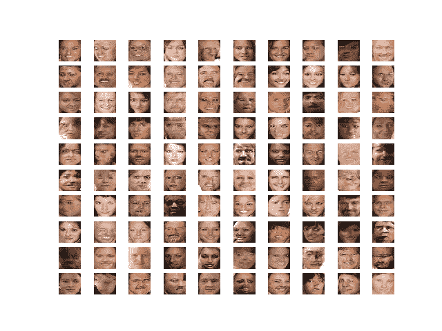

生成对抗网络生成的名人面孔示例

## 如何探索生成人脸的潜在空间

在本节中，我们将使用我们训练的 GAN 模型作为探索潜在空间的基础。

### 如何加载模型和生成面

第一步是加载保存的模型，并确认它可以生成可信的面。

可以使用 Keras API 中的 *load_model()* 函数加载模型。然后，我们可以在潜在空间中生成许多随机点，并将它们用作加载模型的输入，以生成新面孔。然后可以绘制这些面。

下面列出了完整的示例。

```py
# example of loading the generator model and generating images
from numpy import asarray
from numpy.random import randn
from numpy.random import randint
from keras.models import load_model
from matplotlib import pyplot

# generate points in latent space as input for the generator
def generate_latent_points(latent_dim, n_samples, n_classes=10):
	# generate points in the latent space
	x_input = randn(latent_dim * n_samples)
	# reshape into a batch of inputs for the network
	z_input = x_input.reshape(n_samples, latent_dim)
	return z_input

# create a plot of generated images
def plot_generated(examples, n):
	# plot images
	for i in range(n * n):
		# define subplot
		pyplot.subplot(n, n, 1 + i)
		# turn off axis
		pyplot.axis('off')
		# plot raw pixel data
		pyplot.imshow(examples[i, :, :])
	pyplot.show()

# load model
model = load_model('generator_model_030.h5')
# generate images
latent_points = generate_latent_points(100, 25)
# generate images
X  = model.predict(latent_points)
# scale from [-1,1] to [0,1]
X = (X + 1) / 2.0
# plot the result
plot_generated(X, 5)
```

运行该示例首先加载保存的模型。

**注**:考虑到算法或评估程序的随机性，或数值准确率的差异，您的[结果可能会有所不同](https://machinelearningmastery.com/different-results-each-time-in-machine-learning/)。考虑运行该示例几次，并比较平均结果。

然后，在 100 维潜在空间中创建 25 个随机点，提供给生成器模型以创建 25 个面部图像，然后将其绘制在 5×5 的网格中。

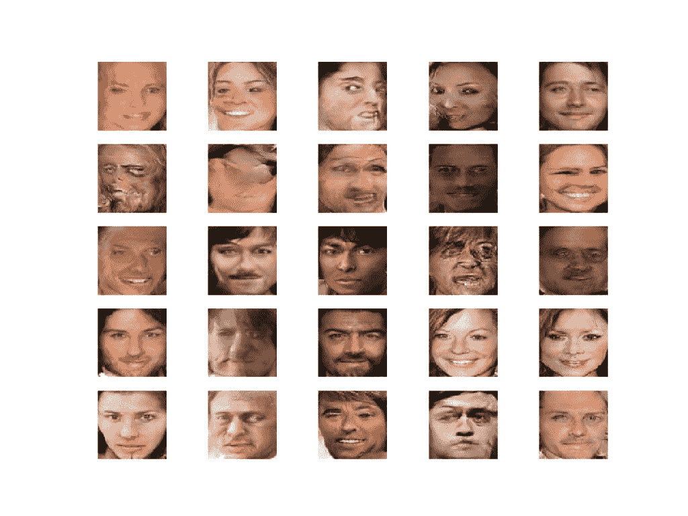

使用加载的 GAN 模型绘制随机生成的人脸

### 如何在生成的面之间进行插值

接下来，我们可以在潜在空间中的两点之间创建一个插值路径，并沿着该路径生成面。

我们可以使用的最简单的插值是潜在空间中两点之间的线性或均匀插值。我们可以使用 [linspace() NumPy 函数](https://docs.scipy.org/doc/numpy/reference/generated/numpy.linspace.html)来计算两点贡献的比率，然后枚举这些比率并为每个比率构造一个向量。

下面的*insert _ points()*函数实现了这一点，并返回潜在空间中两点之间的一系列线性插值向量，包括第一个和最后一个点。

```py
# uniform interpolation between two points in latent space
def interpolate_points(p1, p2, n_steps=10):
	# interpolate ratios between the points
	ratios = linspace(0, 1, num=n_steps)
	# linear interpolate vectors
	vectors = list()
	for ratio in ratios:
		v = (1.0 - ratio) * p1 + ratio * p2
		vectors.append(v)
	return asarray(vectors)
```

然后，我们可以在潜在空间中生成两个点，执行插值，然后为每个插值向量生成一个图像。

结果将是在两个原始图像之间过渡的一系列图像。下面的例子演示了两个面。

```py
# example of interpolating between generated faces
from numpy import asarray
from numpy.random import randn
from numpy.random import randint
from numpy import linspace
from keras.models import load_model
from matplotlib import pyplot

# generate points in latent space as input for the generator
def generate_latent_points(latent_dim, n_samples, n_classes=10):
	# generate points in the latent space
	x_input = randn(latent_dim * n_samples)
	# reshape into a batch of inputs for the network
	z_input = x_input.reshape(n_samples, latent_dim)
	return z_input

# uniform interpolation between two points in latent space
def interpolate_points(p1, p2, n_steps=10):
	# interpolate ratios between the points
	ratios = linspace(0, 1, num=n_steps)
	# linear interpolate vectors
	vectors = list()
	for ratio in ratios:
		v = (1.0 - ratio) * p1 + ratio * p2
		vectors.append(v)
	return asarray(vectors)

# create a plot of generated images
def plot_generated(examples, n):
	# plot images
	for i in range(n):
		# define subplot
		pyplot.subplot(1, n, 1 + i)
		# turn off axis
		pyplot.axis('off')
		# plot raw pixel data
		pyplot.imshow(examples[i, :, :])
	pyplot.show()

# load model
model = load_model('generator_model_030.h5')
# generate points in latent space
pts = generate_latent_points(100, 2)
# interpolate points in latent space
interpolated = interpolate_points(pts[0], pts[1])
# generate images
X = model.predict(interpolated)
# scale from [-1,1] to [0,1]
X = (X + 1) / 2.0
# plot the result
plot_generated(X, len(interpolated))
```

运行该示例计算潜在空间中两点之间的插值路径，为每个点生成图像，并绘制结果。

从左边的第一个面到右边的最后一个面，你可以在十步内看到清晰的线性进展。

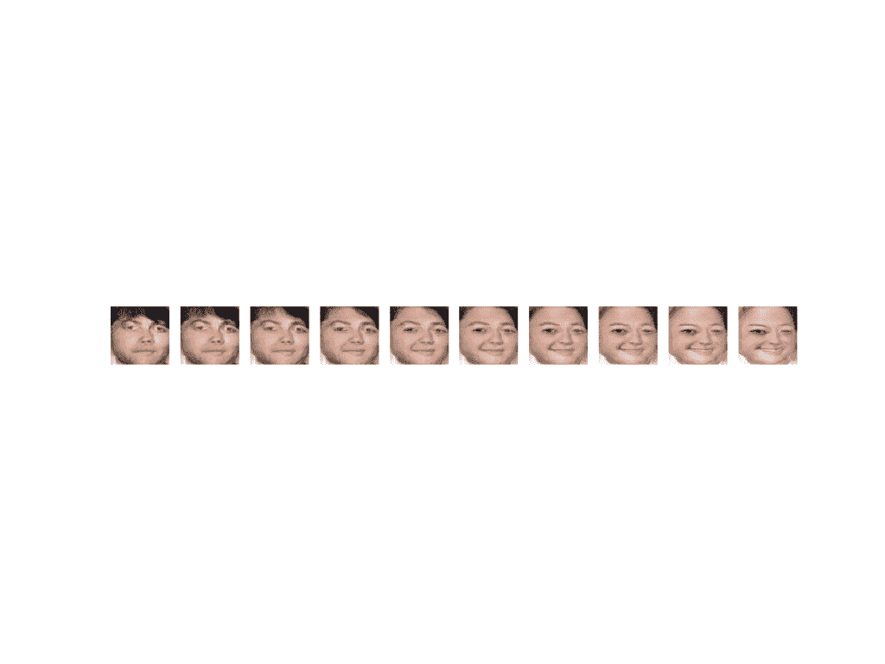

显示两个 GAN 生成面之间线性插值的图

我们可以更新示例，多次重复此过程，以便在单个绘图上看到多个生成的面之间的过渡。

下面列出了完整的示例。

```py
# example of interpolating between generated faces
from numpy import asarray
from numpy import vstack
from numpy.random import randn
from numpy.random import randint
from numpy import linspace
from keras.models import load_model
from matplotlib import pyplot

# generate points in latent space as input for the generator
def generate_latent_points(latent_dim, n_samples, n_classes=10):
	# generate points in the latent space
	x_input = randn(latent_dim * n_samples)
	# reshape into a batch of inputs for the network
	z_input = x_input.reshape(n_samples, latent_dim)
	return z_input

# uniform interpolation between two points in latent space
def interpolate_points(p1, p2, n_steps=10):
	# interpolate ratios between the points
	ratios = linspace(0, 1, num=n_steps)
	# linear interpolate vectors
	vectors = list()
	for ratio in ratios:
		v = (1.0 - ratio) * p1 + ratio * p2
		vectors.append(v)
	return asarray(vectors)

# create a plot of generated images
def plot_generated(examples, n):
	# plot images
	for i in range(n * n):
		# define subplot
		pyplot.subplot(n, n, 1 + i)
		# turn off axis
		pyplot.axis('off')
		# plot raw pixel data
		pyplot.imshow(examples[i, :, :])
	pyplot.show()

# load model
model = load_model('generator_model_030.h5')
# generate points in latent space
n = 20
pts = generate_latent_points(100, n)
# interpolate pairs
results = None
for i in range(0, n, 2):
	# interpolate points in latent space
	interpolated = interpolate_points(pts[i], pts[i+1])
	# generate images
	X = model.predict(interpolated)
	# scale from [-1,1] to [0,1]
	X = (X + 1) / 2.0
	if results is None:
		results = X
	else:
		results = vstack((results, X))
# plot the result
plot_generated(results, 10)
```

运行该示例会创建 10 个不同的面起点和 10 个匹配的面终点，以及它们之间的线性插值。

**注**:考虑到算法或评估程序的随机性，或数值准确率的差异，您的[结果可能会有所不同](https://machinelearningmastery.com/different-results-each-time-in-machine-learning/)。考虑运行该示例几次，并比较平均结果。

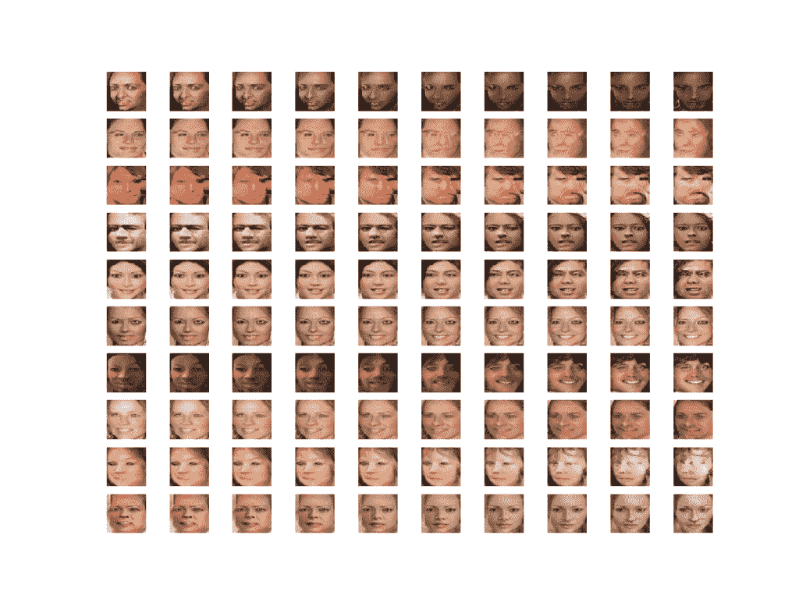

显示两个 GAN 生成面之间多个线性插值的图

在这些情况下，我们进行了线性插值，假设潜在空间是均匀分布的超立方体。从技术上讲，我们选择的潜在空间是 100 维超球面或多模态高斯分布。

有一个数学函数叫做球面线性插值函数，或者叫做“ [Slerp](https://en.wikipedia.org/wiki/Slerp) ”，当插值这个空间时应该使用这个函数，以确保考虑到空间的弯曲。更多细节，我推荐阅读苏史密斯钦塔拉 dcgan.torch 项目中的[线性插值问题。在该项目中，提供了 Python 的 Slerp 函数的实现，我们可以将其用作我们自己的 Slerp 函数的基础，如下所示:](https://github.com/soumith/dcgan.torch/issues/14)

```py
# spherical linear interpolation (slerp)
def slerp(val, low, high):
	omega = arccos(clip(dot(low/norm(low), high/norm(high)), -1, 1))
	so = sin(omega)
	if so == 0:
		# L'Hopital's rule/LERP
		return (1.0-val) * low + val * high
	return sin((1.0-val)*omega) / so * low + sin(val*omega) / so * high
```

这个函数可以从我们的*interpret _ points()*函数调用，而不是执行手动线性插值。

下面列出了此更改的完整示例。

```py
# example of interpolating between generated faces
from numpy import asarray
from numpy import vstack
from numpy.random import randn
from numpy.random import randint
from numpy import arccos
from numpy import clip
from numpy import dot
from numpy import sin
from numpy import linspace
from numpy.linalg import norm
from keras.models import load_model
from matplotlib import pyplot

# generate points in latent space as input for the generator
def generate_latent_points(latent_dim, n_samples, n_classes=10):
	# generate points in the latent space
	x_input = randn(latent_dim * n_samples)
	# reshape into a batch of inputs for the network
	z_input = x_input.reshape(n_samples, latent_dim)
	return z_input

# spherical linear interpolation (slerp)
def slerp(val, low, high):
	omega = arccos(clip(dot(low/norm(low), high/norm(high)), -1, 1))
	so = sin(omega)
	if so == 0:
		# L'Hopital's rule/LERP
		return (1.0-val) * low + val * high
	return sin((1.0-val)*omega) / so * low + sin(val*omega) / so * high

# uniform interpolation between two points in latent space
def interpolate_points(p1, p2, n_steps=10):
	# interpolate ratios between the points
	ratios = linspace(0, 1, num=n_steps)
	# linear interpolate vectors
	vectors = list()
	for ratio in ratios:
		v = slerp(ratio, p1, p2)
		vectors.append(v)
	return asarray(vectors)

# create a plot of generated images
def plot_generated(examples, n):
	# plot images
	for i in range(n * n):
		# define subplot
		pyplot.subplot(n, n, 1 + i)
		# turn off axis
		pyplot.axis('off')
		# plot raw pixel data
		pyplot.imshow(examples[i, :, :])
	pyplot.show()

# load model
model = load_model('generator_model_030.h5')
# generate points in latent space
n = 20
pts = generate_latent_points(100, n)
# interpolate pairs
results = None
for i in range(0, n, 2):
	# interpolate points in latent space
	interpolated = interpolate_points(pts[i], pts[i+1])
	# generate images
	X = model.predict(interpolated)
	# scale from [-1,1] to [0,1]
	X = (X + 1) / 2.0
	if results is None:
		results = X
	else:
		results = vstack((results, X))
# plot the result
plot_generated(results, 10)
```

结果是生成的面之间又有 10 个过渡，这次使用了正确的 Slerp 插值方法。

**注**:考虑到算法或评估程序的随机性，或数值准确率的差异，您的[结果可能会有所不同](https://machinelearningmastery.com/different-results-each-time-in-machine-learning/)。考虑运行该示例几次，并比较平均结果。

这种差异很微妙，但在视觉上更为正确。

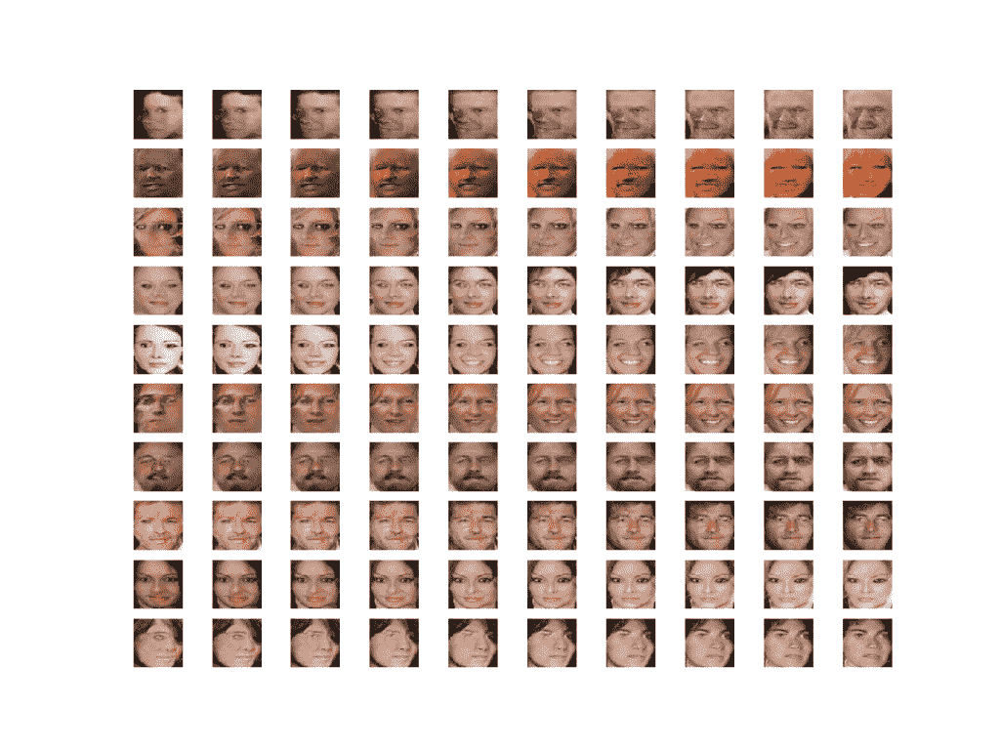

显示两个 GAN 生成面之间多重线性插值的图

### 如何对人脸进行矢量运算

最后，我们可以通过对生成的人脸进行矢量运算来探索潜在空间

首先，我们必须生成大量的人脸，并保存人脸及其对应的潜在向量。然后，我们可以查看生成的人脸图，选择具有我们感兴趣的特征的人脸，记下它们的索引(编号)，并检索它们的潜在空间向量进行操作。

以下示例将加载 GAN 模型，并使用它生成 100 个随机面。

```py
# example of loading the generator model and generating images
from numpy import asarray
from numpy.random import randn
from numpy.random import randint
from keras.models import load_model
from matplotlib import pyplot
from numpy import savez_compressed

# generate points in latent space as input for the generator
def generate_latent_points(latent_dim, n_samples, n_classes=10):
	# generate points in the latent space
	x_input = randn(latent_dim * n_samples)
	# reshape into a batch of inputs for the network
	z_input = x_input.reshape(n_samples, latent_dim)
	return z_input

# create a plot of generated images
def plot_generated(examples, n):
	# plot images
	for i in range(n * n):
		# define subplot
		pyplot.subplot(n, n, 1 + i)
		# turn off axis
		pyplot.axis('off')
		# plot raw pixel data
		pyplot.imshow(examples[i, :, :])
	pyplot.savefig('generated_faces.png')
	pyplot.close()

# load model
model = load_model('generator_model_030.h5')
# generate points in latent space
latent_points = generate_latent_points(100, 100)
# save points
savez_compressed('latent_points.npz', latent_points)
# generate images
X  = model.predict(latent_points)
# scale from [-1,1] to [0,1]
X = (X + 1) / 2.0
# save plot
plot_generated(X, 10)
```

运行该示例加载模型，生成面，并保存潜在矢量和生成的面。

潜在矢量保存到文件名为“*潜伏点. npz* 的压缩 NumPy 数组中。生成的 100 个面绘制在 10×10 的网格中，并保存在名为“ *generated_faces.png* 的文件中。

在这种情况下，我们有大量的人脸可以使用。每个人脸都有一个索引，我们可以用它来检索潜在向量。例如，第一个面是 1，它对应于保存的数组中的第一个向量(索引 0)。

我们将执行操作:

```py
smiling woman - neutral woman + neutral man = smiling man
```

因此，我们需要微笑的女人、中立的女人和中立的男人各有三张脸。

在这种情况下，我们将在图像中使用以下索引:

*   微笑的女人:92，98，99
*   中立女性:9，21，79
*   中立人:10，30，45

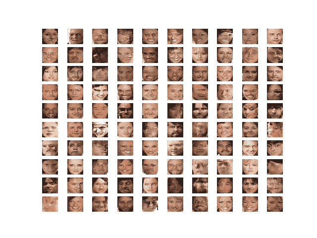

100 个生成的面的图，用作面的矢量算法的基础

现在我们有了潜在的向量和目标算法，我们可以开始了。

首先，我们可以指定我们的首选图像，并加载保存的潜在点的 NumPy 数组。

```py
# retrieve specific points
smiling_woman_ix = [92, 98, 99]
neutral_woman_ix = [9, 21, 79]
neutral_man_ix = [10, 30, 45]
# load the saved latent points
data = load('latent_points.npz')
points = data['arr_0']
```

接下来，我们可以检索每个向量，并计算每个向量类型的平均值(例如微笑的女人)。我们可以直接对单个图像执行矢量算法，但是如果我们使用具有所需属性的几个人脸的平均值，我们将获得更稳健的结果。

下面的 *average_points()* 函数获取加载的潜在空间点数组，检索每个点，计算平均值，并返回所有向量。

```py
# average list of latent space vectors
def average_points(points, ix):
	# convert to zero offset points
	zero_ix = [i-1 for i in ix]
	# retrieve required points
	vectors = points[zero_ix]
	# average the vectors
	avg_vector = mean(vectors, axis=0)
	# combine original and avg vectors
	all_vectors = vstack((vectors, avg_vector))
	return all_vectors
```

我们现在可以使用这个函数来检索潜在空间中所有需要的点并生成图像。

```py
# average vectors
smiling_woman = average_points(points, smiling_woman_ix)
neutral_woman = average_points(points, neutral_woman_ix)
neutral_man = average_points(points, neutral_man_ix)
# combine all vectors
all_vectors = vstack((smiling_woman, neutral_woman, neutral_man))
# generate images
images = model.predict(all_vectors)
# scale pixel values
images = (images + 1) / 2.0
plot_generated(images, 3, 4)
```

最后，我们可以使用平均向量在潜在空间中执行向量运算并绘制结果。

```py
# smiling woman - neutral woman + neutral man = smiling man
result_vector = smiling_woman[-1] - neutral_woman[-1] + neutral_man[-1]
# generate image
result_vector = expand_dims(result_vector, 0)
result_image = model.predict(result_vector)
# scale pixel values
result_image = (result_image + 1) / 2.0
pyplot.imshow(result_image[0])
pyplot.show()
```

将这些联系在一起，完整的示例如下所示。

```py
# example of loading the generator model and generating images
from numpy import asarray
from numpy.random import randn
from numpy.random import randint
from keras.models import load_model
from matplotlib import pyplot
from numpy import load
from numpy import mean
from numpy import vstack
from numpy import expand_dims

# average list of latent space vectors
def average_points(points, ix):
	# convert to zero offset points
	zero_ix = [i-1 for i in ix]
	# retrieve required points
	vectors = points[zero_ix]
	# average the vectors
	avg_vector = mean(vectors, axis=0)
	# combine original and avg vectors
	all_vectors = vstack((vectors, avg_vector))
	return all_vectors

# create a plot of generated images
def plot_generated(examples, rows, cols):
	# plot images
	for i in range(rows * cols):
		# define subplot
		pyplot.subplot(rows, cols, 1 + i)
		# turn off axis
		pyplot.axis('off')
		# plot raw pixel data
		pyplot.imshow(examples[i, :, :])
	pyplot.show()

# load model
model = load_model('generator_model_030.h5')
# retrieve specific points
smiling_woman_ix = [92, 98, 99]
neutral_woman_ix = [9, 21, 79]
neutral_man_ix = [10, 30, 45]
# load the saved latent points
data = load('latent_points.npz')
points = data['arr_0']
# average vectors
smiling_woman = average_points(points, smiling_woman_ix)
neutral_woman = average_points(points, neutral_woman_ix)
neutral_man = average_points(points, neutral_man_ix)
# combine all vectors
all_vectors = vstack((smiling_woman, neutral_woman, neutral_man))
# generate images
images = model.predict(all_vectors)
# scale pixel values
images = (images + 1) / 2.0
plot_generated(images, 3, 4)
# smiling woman - neutral woman + neutral man = smiling man
result_vector = smiling_woman[-1] - neutral_woman[-1] + neutral_man[-1]
# generate image
result_vector = expand_dims(result_vector, 0)
result_image = model.predict(result_vector)
# scale pixel values
result_image = (result_image + 1) / 2.0
pyplot.imshow(result_image[0])
pyplot.show()
```

运行该示例首先为我们的特定图像加载潜在空间中的点，计算这些点的平均值，并为这些点生成面。

**注**:考虑到算法或评估程序的随机性，或数值准确率的差异，您的[结果可能会有所不同](https://machinelearningmastery.com/different-results-each-time-in-machine-learning/)。考虑运行该示例几次，并比较平均结果。

我们可以看到，事实上，我们选择的人脸被正确地检索到，向量空间中的点的平均值捕捉到了我们在每一行中要寻找的显著特征(例如，微笑的女人、中性女人等)。).

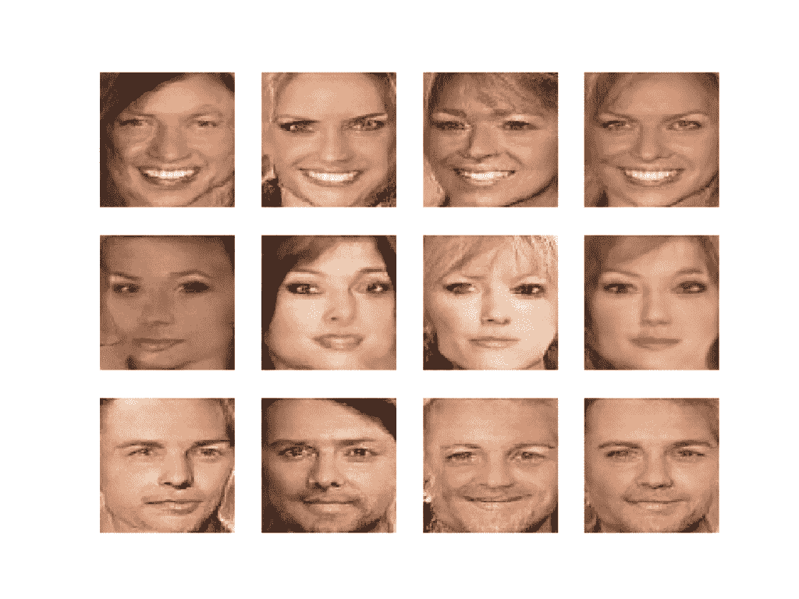

每行的选定生成面和平均生成面图

接下来，向量运算被执行，结果是一个微笑的人，正如我们所期望的。

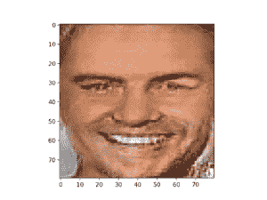

基于矢量算法的潜在空间生成人脸图

## 扩展ˌ扩张

本节列出了一些您可能希望探索的扩展教程的想法。

*   **附加运算**。尝试不同图像特征或不同算法的算法，查看生成的人脸结果。
*   **附加插值**。尝试在潜在空间中的三个或更多点之间进行插值，并查看生成的面的结果。
*   **调谐型号**。更新 GAN 模型配置，使训练更加稳定，可以生成更好质量的人脸。

如果你探索这些扩展，我很想知道。
在下面的评论中发表你的发现。

## 进一步阅读

如果您想更深入地了解这个主题，本节将提供更多资源。

### 书

*   第二十章。深度生成模型，[深度学习](https://amzn.to/2YuwVjL)，2016。
*   第八章。生成式深度学习，[Python 深度学习](https://amzn.to/2U2bHuP)，2017。

### 报纸

*   [生成对抗网络](https://arxiv.org/abs/1406.2661)，2014。
*   [深度卷积生成对抗网络的无监督表示学习](https://arxiv.org/abs/1511.06434)，2015
*   [教程:生成对抗网络，NIPS](https://arxiv.org/abs/1701.00160) ，2016。
*   [使用多任务级联卷积网络的联合人脸检测和对准](https://arxiv.org/abs/1604.02878)，2016。

### 应用程序接口

*   [硬数据集 API](https://keras.io/datasets/) .
*   [Keras 顺序模型 API](https://keras.io/models/sequential/)
*   [Keras 卷积层应用编程接口](https://keras.io/layers/convolutional/)
*   [如何“冻结”Keras 层？](https://keras.io/getting-started/faq/#how-can-i-freeze-keras-layers)
*   [MatplotLib API](https://matplotlib.org/api/)
*   [NumPy 随机采样(numpy.random) API](https://docs.scipy.org/doc/numpy/reference/routines.random.html)
*   [NumPy 数组操作例程](https://docs.scipy.org/doc/numpy/reference/routines.array-manipulation.html)

### 文章

*   [大规模名人脸属性(CelebA)数据集。](http://mmlab.ie.cuhk.edu.hk/projects/CelebA.html)
*   [CelebFaces 属性(CelebA)数据集，Kaggle](https://www.kaggle.com/jessicali9530/celeba-dataset) 。
*   [使用 GANs 的名人脸生成(Tensorflow 实现)，2018](https://medium.com/coinmonks/celebrity-face-generation-using-gans-tensorflow-implementation-eaa2001eef86) 。
*   [MTCNN 人脸检测项目，GitHub](https://github.com/ipazc/mtcnn) 。
*   [线性插值？，dcgan.torch 项目，GitHub](https://github.com/soumith/dcgan.torch/issues/14) 。

## 摘要

在本教程中，您发现了如何为人脸生成开发一个生成对抗网络，并探索了潜在空间的结构以及对生成的人脸的影响。

具体来说，您了解到:

*   如何开发生成对抗网络来生成人脸？
*   如何在潜在空间中的点之间进行插值，并生成从一个面变形到另一个面的图像。
*   如何在潜在空间中执行矢量算法，并在生成的人脸中获得目标结果。

你有什么问题吗？
在下面的评论中提问，我会尽力回答。