# 生成对抗网络的 18 个令人印象深刻的应用

> 原文：<https://machinelearningmastery.com/impressive-applications-of-generative-adversarial-networks/>

最后更新于 2019 年 7 月 12 日

生成对抗网络是一种用于生成建模的神经网络体系结构。

生成性建模包括使用模型来生成新的示例，这些示例似乎来自现有的样本分布，例如生成与现有照片数据集相似但又特别不同的新照片。

GAN 是使用两个神经网络模型训练的生成模型。一种模型被称为“T0”生成器或“T2”生成网络模型，它学习生成新的似是而非的样本。另一个模型称为“*鉴别器*”或“*鉴别网络*”，并学习将生成的示例与真实示例区分开来。

这两个模型是在竞赛或游戏(在博弈论意义上)中建立的，其中生成器模型试图欺骗鉴别器模型，并且鉴别器被提供真实样本和生成样本的例子。

经过训练后，生成模型可以用于按需创建新的似是而非的样本。

GANs 有非常具体的用例，开始时可能很难理解这些用例。

在这篇文章中，我们将回顾大量有趣的 GANs 应用程序，以帮助您对 GANs 可以使用和有用的问题类型形成直觉。这不是一个详尽的列表，但它确实包含了媒体上出现的许多 GANs 的示例用法。

我们将这些应用分为以下几个方面:

*   为图像数据集生成示例
*   生成人脸照片
*   生成逼真的照片
*   生成卡通人物
*   图像到图像的翻译
*   文本到图像的翻译
*   语义-图像-照片翻译
*   正面视图生成
*   生成新的人体姿势
*   表情符号的照片
*   照片编辑
*   面部衰老
*   照片混合
*   超分辨率
*   照片修复
*   服装翻译
*   视频预测
*   三维对象生成

我错过了 GANs 的一个有趣的应用还是一篇关于特定 GAN 应用的优秀论文？
请在评论中告知。

**用我的新书[Python 生成对抗网络](https://machinelearningmastery.com/generative_adversarial_networks/)启动你的项目**，包括*分步教程*和所有示例的 *Python 源代码*文件。

## 为图像数据集生成示例

生成新的似是而非的样本是伊恩·古德费勒等人在 2014 年的论文“[生成对抗网络](https://arxiv.org/abs/1406.2661)”中描述的应用，其中 GANs 用于为 MNIST 手写数字数据集、CIFAR-10 小对象照片数据集和多伦多人脸数据库生成新的似是而非的示例。

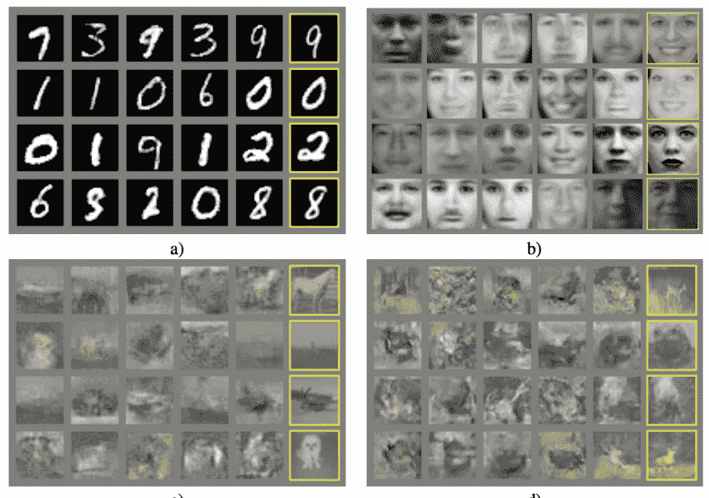

用于为图像数据集生成新的可信示例的 GANs 示例。摘自《生成对抗网络》，2014 年。

这也是亚历克·拉德福德等人在 2015 年发表的题为“深度卷积生成对抗网络的无监督表示学习”的重要论文中使用的演示，该论文名为 DCGAN，演示了如何大规模训练稳定的 GANs。他们演示了生成新卧室示例的模型。

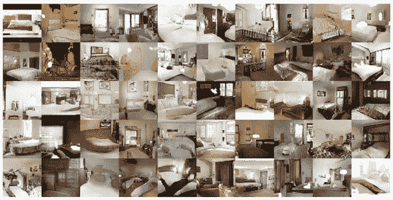

GAN 生成的卧室照片示例。摘自《深度卷积生成对抗网络的无监督表示学习》，2015 年。

重要的是，在这篇论文中，他们还展示了使用生成的卧室和生成的人脸对 GANs(在潜在空间中)进行矢量运算的能力。

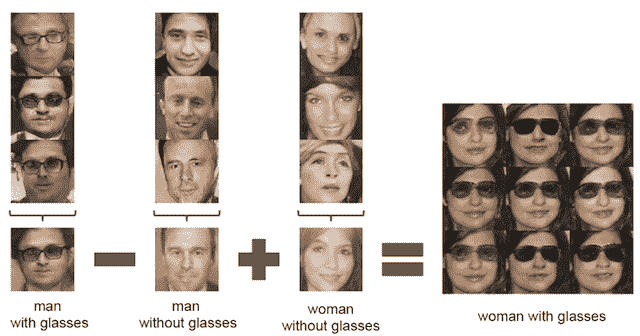

GAN 生成人脸的矢量算法示例。摘自《深度卷积生成对抗网络的无监督表示学习》，2015 年。

## 生成人脸照片

Tero Karras 等人在他们 2017 年发表的题为“为提高质量、稳定性和变化性而进行的 GANs 渐进式增长”的论文中，展示了生成看似真实的人脸照片。事实上，它们看起来如此真实，以至于可以公平地称其结果为非凡。因此，这个结果受到了很多媒体的关注。人脸生成是根据名人的例子进行训练的，这意味着在生成的人脸中有现有名人的元素，使他们看起来很熟悉，但并不完全熟悉。

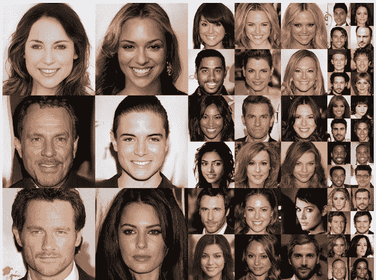

照片真实感 GAN 生成的脸的例子。摘自 2017 年《为提高质量、稳定性和变化性而逐步发展的 GANs》。

他们的方法也被用来演示对象和场景的生成。

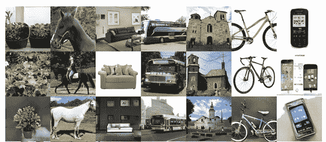

照片真实感甘生成的对象和场景的例子从改进质量，稳定性和变化的甘渐进增长，2017 年。

本文中的例子被用于 2018 年一份名为“人工智能的恶意使用:预测、预防和缓解”的报告中，以展示 2014 年至 2017 年间 GANs 的快速发展(通过伊恩·古德费勒的[推文找到)。](https://twitter.com/goodfellow_ian/status/969776035649675265)

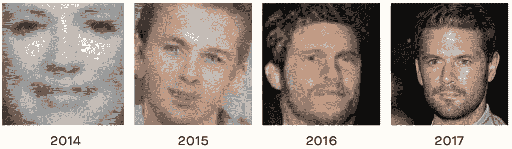

从 2014 年到 2017 年全球网络能力发展的例子。摘自《人工智能的恶意使用:预测、预防和缓解》，2018 年。

## 生成逼真的照片

Andrew Brock 等人在 2018 年发表的题为“高保真自然图像合成的大规模 GAN 训练”的论文中，展示了用他们的技术 BigGAN 生成合成照片，这些照片实际上与真实照片无法区分。

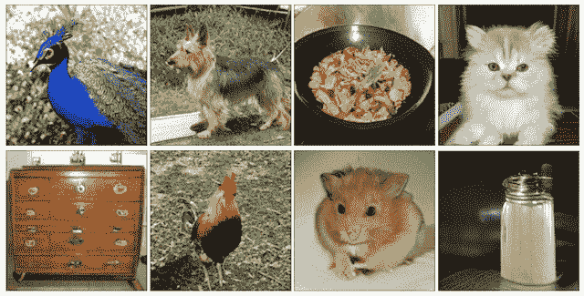

使用 BigGANTaken 从大规模 GAN 训练生成的逼真合成照片示例，用于高保真自然图像合成，2018 年。

## 生成卡通人物

金等人在 2017 年发表的论文《利用生成对抗网络实现动漫角色的自动创作》中演示了生成动漫角色(即日本漫画角色)人脸的 GAN 的训练和使用。

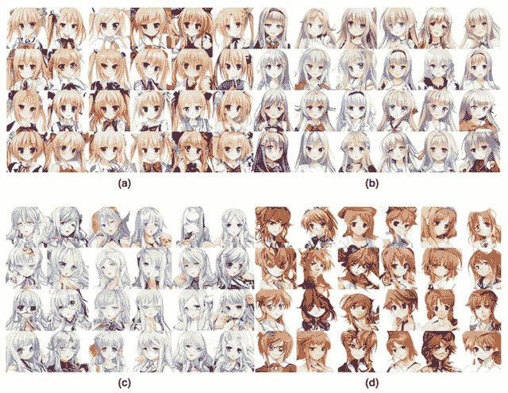

GAN 生成的动漫角色脸示例。摘自《走向生成对抗网络下的自动动漫角色创作》，2017 年。

受动漫例子的启发，很多人都尝试过生成口袋妖怪角色，比如[口袋妖怪项目](https://github.com/moxiegushi/pokeGAN)和[用 DCGAN 项目](https://github.com/kvpratama/gan/tree/master/pokemon)生成口袋妖怪，但成功有限。

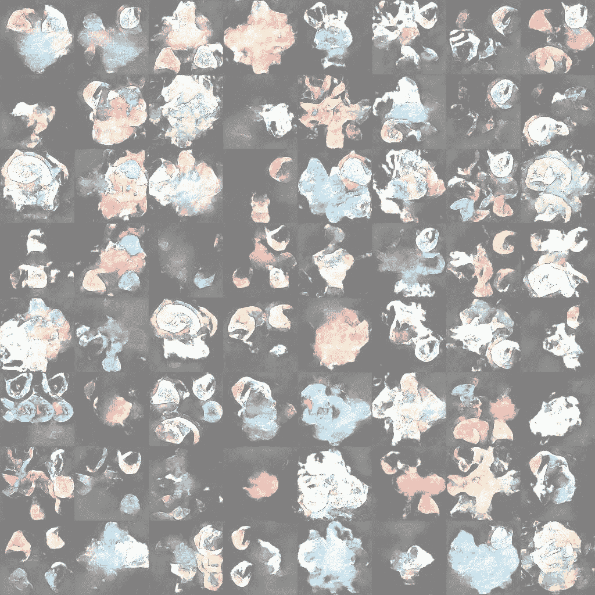

GAN 生成的口袋妖怪角色示例。取自 pokeGAN 项目。

## 图像到图像的翻译

这是一个有点包罗万象的任务，对于那些提出可以做很多图像转换任务的 GANs 的论文来说。

Phillip Isola 等人在他们 2016 年发表的题为“利用条件对抗网络进行图像到图像的翻译”的论文中演示了 GANs，特别是其用于许多图像到图像转换任务的 pix2pix 方法。

示例包括翻译任务，例如:

*   语义图像到城市风景和建筑照片的翻译。
*   将卫星照片翻译成谷歌地图。
*   从白天到晚上的照片翻译。
*   黑白照片的彩色翻译。
*   将草图翻译成彩色照片。

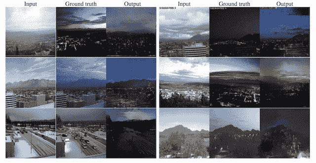

用 pix2pix 拍摄白天城市风景到夜间的照片示例。摘自《条件对抗网络下的图像转换》，2016 年。

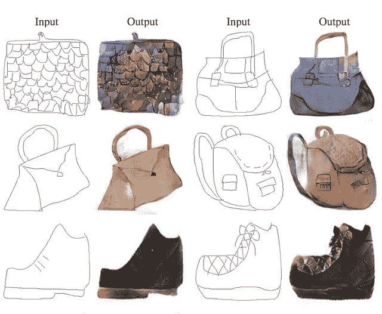

带有 pix2pix 的彩色照片草图示例。摘自《条件对抗网络下的图像转换》，2016 年。

朱俊彦在他们 2017 年的论文《使用循环一致对抗网络的不成对图像到图像的翻译》中介绍了他们著名的[循环根](https://junyanz.github.io/CycleGAN/)和一系列令人印象深刻的图像到图像的翻译例子。

以下示例演示了四种图像转换案例:

*   从照片到艺术画风的翻译。
*   马到斑马的翻译。
*   照片从夏天到冬天的翻译。
*   将卫星照片翻译成谷歌地图视图。

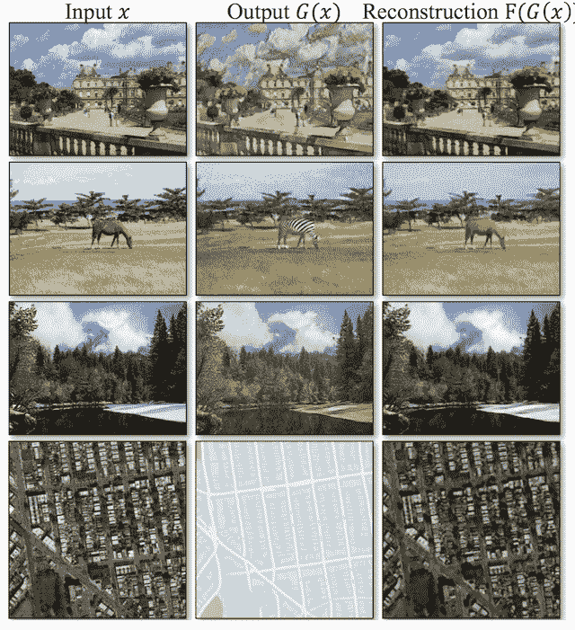

使用循环执行的四种图像到图像转换的示例从使用循环一致对抗网络的不成对图像到图像转换中获得，2017。

本文还提供了许多其他示例，例如:

*   绘画到摄影的翻译。
*   草图到照片的翻译。
*   苹果转橘子。
*   照片到艺术绘画的翻译。

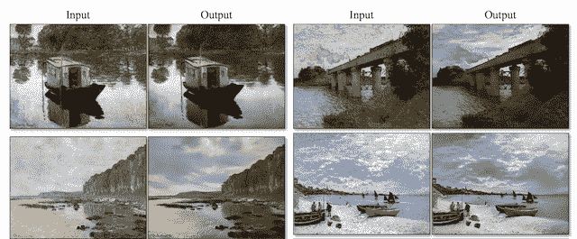

用 CycleGAN 从绘画到照片的翻译示例。摘自《使用循环一致对抗网络的不成对图像到图像转换》，2017 年。

## 文本到图像转换(文本 2 图像)

张寒等人在他们 2016 年的论文《堆叠:利用堆叠生成对抗网络的文本到照片的真实感图像合成》中演示了 GANs 的使用，特别是它们的堆叠，从简单对象(如鸟和花)的文本描述中生成逼真的照片。

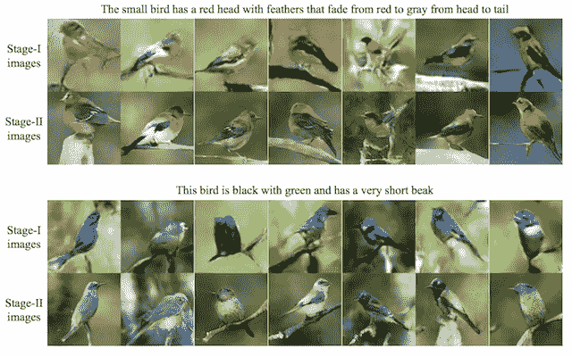

来自 StackGAN 的文本描述和 GAN 生成的鸟瞰照片示例:使用堆叠生成对抗网络的文本到照片真实感图像合成，2016。

斯科特·里德(Scott Reed)等人在 2016 年发表的论文《生成对抗性文本到图像合成》中，也提供了一个早期的例子，说明文本到图像生成小对象和场景，包括鸟、花等等。

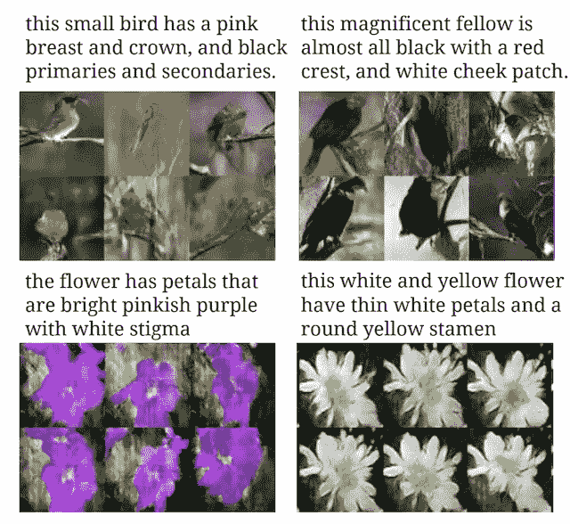

鸟类和花卉的文本描述和 GAN 生成的照片示例。从生成对抗文本到图像合成。

Ayushman Dash 等人在他们 2017 年发表的题为“[TAC-GAN–文本条件辅助分类器生成对抗网络](https://arxiv.org/abs/1703.06412)”的论文中提供了更多关于看似相同数据集的例子。

斯科特·里德(Scott Reed)等人在 2016 年发表的论文《学习在哪里画什么》中扩展了这一功能，并使用 GANs 从文本生成图像，并使用边界框和关键点作为在哪里画一个描述对象(如鸟)的提示。

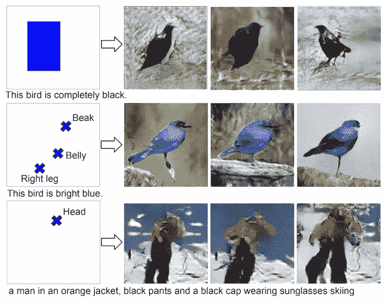

用 GAN 从文本和位置提示生成的对象照片示例。摘自《学习什么和在哪里画画》，2016 年。

## 语义-图像-照片翻译

ting-王春等人在他们 2017 年发表的题为“H [高分辨率图像合成和使用条件 GANs](https://arxiv.org/abs/1711.11585) 的语义处理”的论文中演示了使用条件 GANs 生成给定语义图像或草图作为输入的真实感图像。

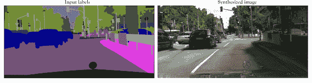

语义图像和 GAN 生成的城市景观照片的例子。摘自 2017 年高分辨率图像合成和条件 GANs 语义处理。

具体例子包括:

*   城市景观照片，给定语义图像。
*   卧室照片，给定语义图像。
*   人脸照片，给定语义图像。
*   人脸照片，给定草图。

他们还演示了一个交互式编辑器来操作生成的图像。

## 正面视图生成

黄锐等人在他们 2017 年的论文《超越人脸旋转:全局和局部感知 GAN 用于照片真实感和身份保持正面视图合成》中演示了在给定角度拍摄的照片的情况下，使用 GAN 来生成人脸的正面视图(即人脸打开)照片。这个想法是，生成的正面照片可以被用作人脸验证或人脸识别系统的输入。

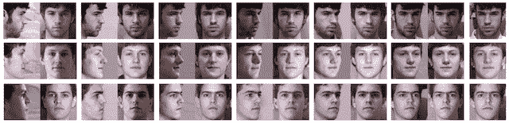

基于 GAN 的人脸正面视图照片生成示例摘自《超越人脸旋转:全局和局部感知 GAN 用于照片真实感和身份保持正面视图合成》，2017 年。

## 生成新的人体姿势

马丽倩等人在 2017 年发表的题为《[姿势引导的人物图像生成](https://arxiv.org/abs/1705.09368)》的论文中提供了一个用新姿势生成人体模型新照片的例子。

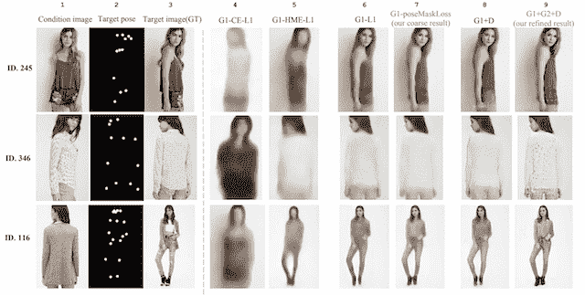

GAN 生成的人体姿势照片示例从姿势引导的人物图像生成中建立，2017 年。

## 表情符号的照片

Yaniv Taigman 等人在 2016 年发表的题为《[无监督跨域图像生成](https://arxiv.org/abs/1611.02200)》的论文中使用了一个 GAN 将图像从一个域翻译到另一个域，包括从街道号码到 MNIST 手写数字，从名人照片到他们所谓的表情符号或小卡通脸。

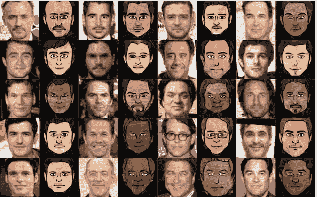

名人照片和 GAN 生成的表情符号示例。摘自《无监督跨域图像生成》，2016 年。

## 照片编辑

Guim Perarnau 等人在 2016 年发表的题为“用于图像编辑的[可逆条件 GANs】”的论文中使用 GAN，特别是他们的 IcGAN，来重建具有特定特定特征的人脸照片，例如头发颜色、风格、面部表情甚至性别的变化。](https://arxiv.org/abs/1611.06355)

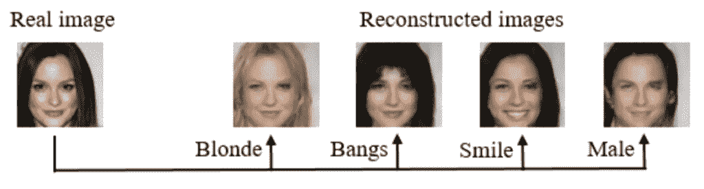

IcGAN 人脸照片编辑示例。摘自《图像编辑用可逆条件遗传》，2016 年。

刘明宇等人在 2016 年发表的论文《耦合生成对抗网络》中也探索了具有特定属性的人脸生成，如头发颜色、面部表情和眼镜。他们还探索其他图像的生成，例如具有不同颜色和深度的场景。

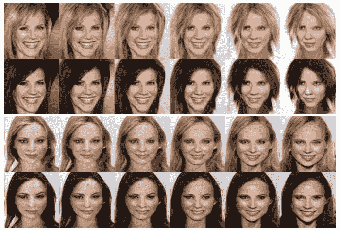

用于生成有和没有金发的人脸的 GANs 示例。摘自《耦合生成对抗网络》，2016 年。

Andrew Brock 等人在他们 2016 年发表的题为“用内省对抗网络进行神经照片编辑”的论文中提出了一种使用可变自动编码器和 GANs 混合的人脸照片编辑器。编辑器允许快速逼真地修改人脸，包括改变头发颜色、发型、面部表情、姿势和添加面部毛发。

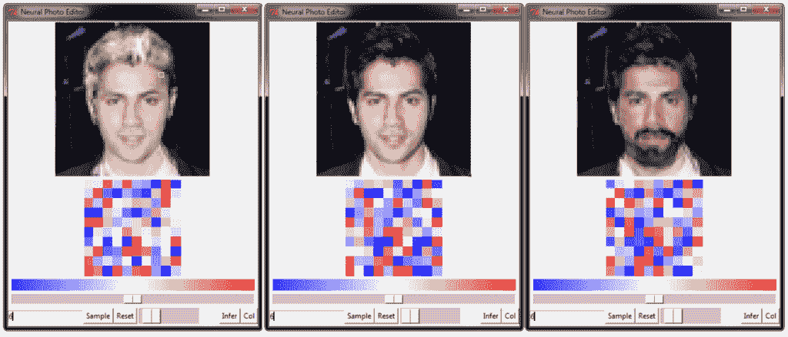

使用基于视觉诱发电位和触觉诱发电位的神经照片编辑器进行面部编辑的示例。摘自神经照片编辑与内省对抗网络，2016 年。

何章等在 2017 年发表的论文《利用条件生成对抗网络进行图像去雨》中使用了 GANs 进行图像编辑，包括从照片中去除雨雪等示例。

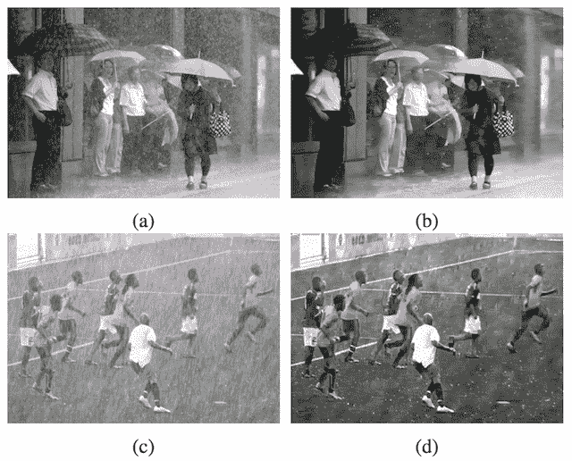

使用有条件生成对抗网络从图像去雨中使用有向神经网络去雨的例子

## 面部衰老

Grigory Antipov 等人在他们 2017 年发表的题为“利用条件生成对抗网络进行面部衰老”的论文中，使用 GANs 生成了不同表观年龄(从年轻到年老)的面部照片。

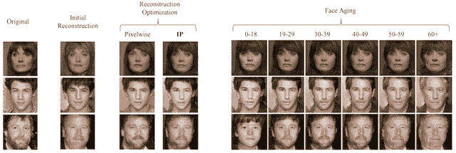

用不同表观年龄的 GAN 生成的人脸照片示例。摘自《条件生成对抗网络下的面部衰老》，2017 年。

张，在他们 2017 年的论文《条件对抗自动编码器的年龄进展/回归》中使用了一种基于 GAN 的人脸照片去老化方法。

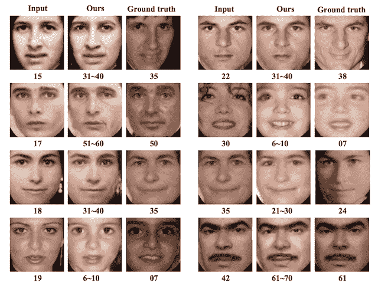

使用 GAN 对面部照片进行老化的示例根据条件对抗自动编码器的年龄进展/回归，2017 年。

## 照片混合

吴等人在 2017 年发表的题为“ [GP-GAN:走向逼真的高分辨率图像混合](https://arxiv.org/abs/1703.07195)”的论文中，演示了 GANs 在混合照片中的使用，特别是来自不同照片的元素，如田野、山脉和其他大型结构。

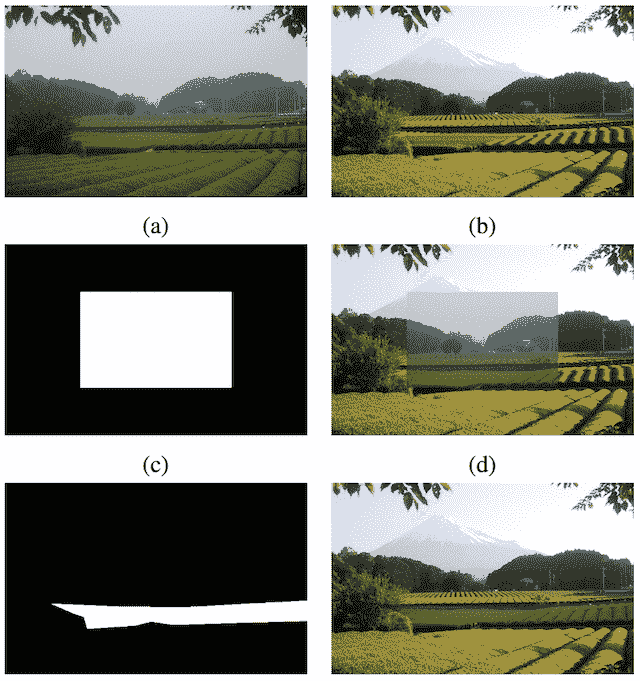

基于 GAN 的照片混合示例。摘自 GP-GAN:走向逼真的高分辨率图像混合，2017 年。

## 超分辨率

克里斯蒂安·莱迪格(Christian Ledig)等人在 2016 年发表的论文《使用生成对抗网络的照片真实感单幅图像超分辨率》中演示了使用 GANs，特别是他们的 SRGAN 模型来生成像素分辨率更高(有时高得多)的输出图像。

GAN 生成的超分辨率图像示例。摘自 2016 年《使用生成对抗网络的照片真实感单幅图像超分辨率》。

黄斌等人在 2017 年的论文中倾斜了“[使用条件生成对抗网络的高质量人脸图像 SR](https://arxiv.org/abs/1707.00737)”使用 GANs 创建人脸照片的版本。

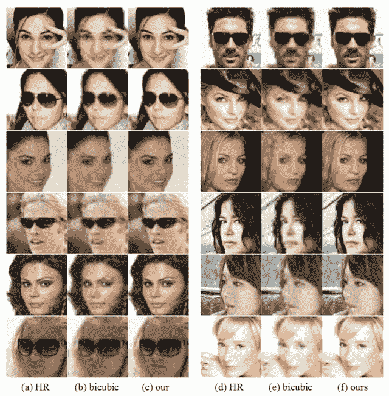

使用条件生成对抗网络从高质量人脸图像 SR 生成高分辨率人脸的示例，2017。

Subeesh 瓦苏等人在他们 2018 年的论文中倾斜了“[使用增强感知超分辨率网络](https://arxiv.org/abs/1811.00344)分析感知-失真权衡”提供了一个 GANs 创建高分辨率照片的例子，聚焦于街道场景。

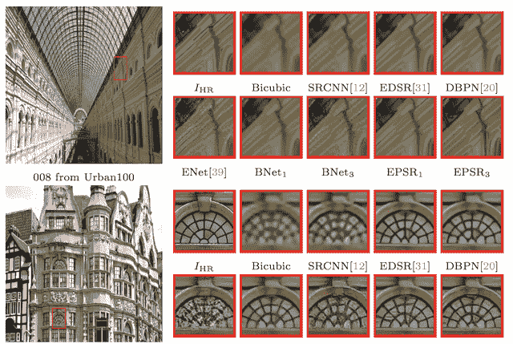

高分辨率 GAN 生成的建筑物照片示例。摘自《使用增强感知超分辨率网络分析感知-失真权衡》，2018 年。

## 照片修复

Deepak Pathak 等人在 2016 年发表的题为“[上下文编码器:通过修复](https://arxiv.org/abs/1604.07379)进行特征学习”的论文中描述了使用 GANs，特别是上下文编码器来执行照片修复或孔洞填充，即填充照片中由于某种原因被移除的区域。

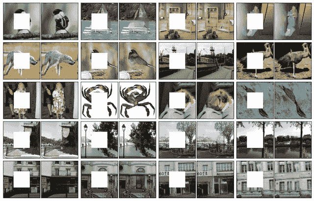

使用上下文编码器的 GAN 生成的照片修复示例。摘自《上下文编码器:通过修复的特征学习》描述了 GANs 的使用，特别是上下文编码器，2016 年。

Raymond A. Yeh 等人在 2016 年发表的题为“深度生成模型的语义图像修复”的论文中使用 GANs 来填充和修复故意损坏的人脸照片。

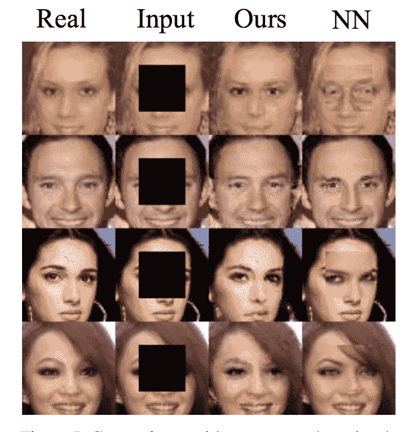

基于 GAN 的人脸照片修复示例来自深度生成模型的语义图像修复，2016。

李翊君等人在 2017 年发表的论文《生成人脸完成》中也使用了 GANs 来修复和重建人脸的受损照片。

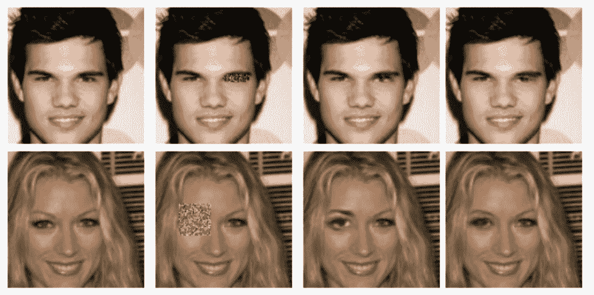

《生成人脸完成》，2017 年。

## 服装翻译

Donggeun 等人在 2016 年发表的论文《像素级域转移》中演示了如何使用 GANs 生成服装照片，这些照片可以在目录或在线商店中看到，基于穿着这些服装的模特的照片。

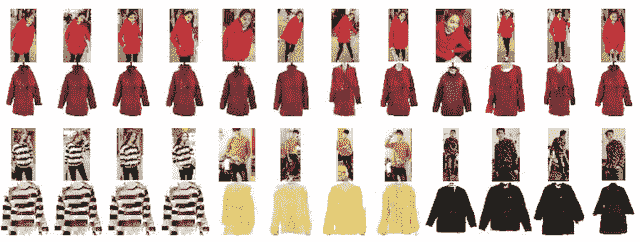

输入照片和 GAN 生成的服装照片示例来自像素级域转移，2016 年。

## 视频预测

Carl Vondrick 等人在 2016 年发表的论文《利用场景动力学生成视频》[中描述了 GANs 在视频预测中的应用，具体来说就是成功预测高达一秒的视频帧，主要针对场景的静态元素。](https://arxiv.org/abs/1609.02612)

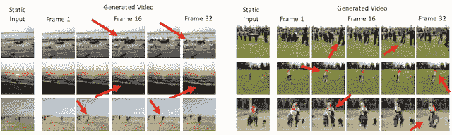

用 GAN 生成的视频帧示例。摘自《用场景动态生成视频》，2016 年。

## 三维对象生成

吴家军等人在他们 2016 年的论文《通过 3D 生成-对抗建模学习对象形状的概率潜在空间》中演示了一种用于生成新的三维对象(例如 3D 模型)的 GAN，例如椅子、汽车、沙发和桌子。

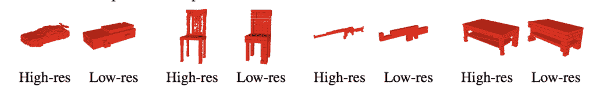

GAN 生成的三维对象的例子。取自通过三维生成对抗建模学习对象形状的概率潜在空间

Matheus Gadelha 等人在 2016 年发表的题为“从多个对象的 2D 视图中进行三维形状归纳”的论文中使用 GANs 从多个视角生成给定对象二维图片的三维模型。

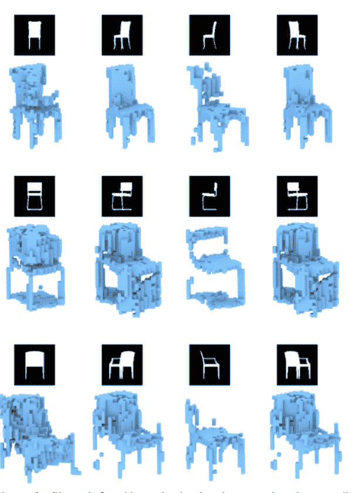

从二维图像对椅子进行三维重建的示例。摘自 2016 年 2D 多对象视图中的三维形状归纳。

## 进一步阅读

本节提供了更多的 GAN 应用程序列表来补充这个列表。

*   [gans-awesome-applications:精选的 awesome GAN 应用和演示列表](https://github.com/nashory/gans-awesome-applications)。
*   [GANs 的一些很酷的应用](https://medium.com/@jonathan_hui/gan-some-cool-applications-of-gans-4c9ecca35900)，2018。
*   [超越世代的 GANs 个替代用例](https://medium.com/@alexrachnog/gans-beyond-generation-7-alternative-use-cases-725c60ba95e8)，2018。

## 摘要

在这篇文章中，你发现了生成对抗网络的大量应用。

我错过了 GANs 的一个有趣的应用还是一篇关于 GAN 具体应用的伟大论文？
请在评论中告知。

你有什么问题吗？
在下面的评论中提问，我会尽力回答。