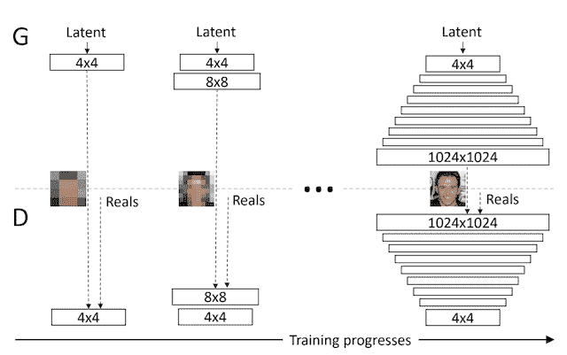
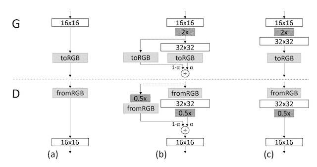
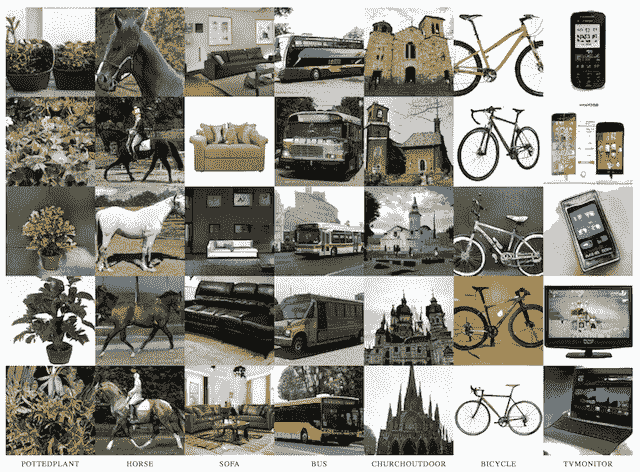
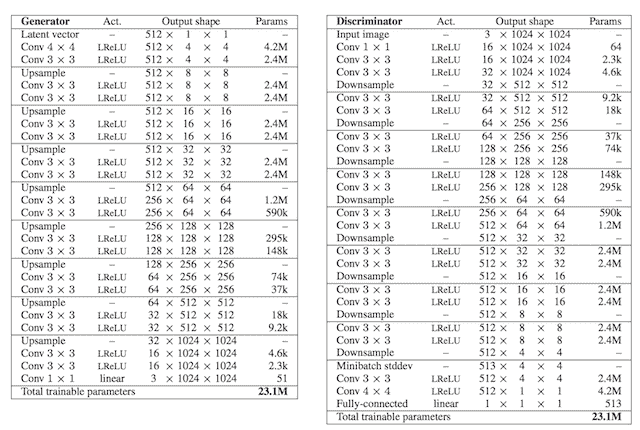

# 渐进式增长 GAN 的温和介绍

> 原文：<https://machinelearningmastery.com/introduction-to-progressive-growing-generative-adversarial-networks/>

渐进式增长 GAN 是 GAN 训练过程的扩展，允许稳定训练发电机模型，可以输出大的高质量图像。

它包括从一个非常小的图像开始，逐步增加层块，增加生成器模型的输出大小和鉴别器模型的输入大小，直到达到所需的图像大小。

事实证明，这种方法可以有效地生成逼真的高质量合成人脸。

在这篇文章中，你将发现用于生成大图像的渐进增长的生成对抗网络。

看完这篇文章，你会知道:

*   GANs 在生成清晰图像方面很有效，尽管由于模型稳定性，它们仅限于小图像尺寸。
*   渐进式增长 GAN 是一种训练 GAN 模型以生成大的高质量图像的稳定方法，包括在训练过程中逐渐增加模型的大小。
*   渐进增长的 GAN 模型能够生成高分辨率的真实感合成人脸和对象，非常逼真。

**用我的新书[Python 生成对抗网络](https://machinelearningmastery.com/generative_adversarial_networks/)启动你的项目**，包括*分步教程*和所有示例的 *Python 源代码*文件。

我们开始吧。

渐进成长的生成对抗网络简介
图片由[桑德琳·内尔](https://www.flickr.com/photos/neelsandrine/36514207683/)提供，版权所有。

## 概观

本教程分为五个部分；它们是:

1.  GANs 通常仅限于小图像
2.  通过逐步添加层生成大图像
3.  如何逐步生长 GAN
4.  渐进式增长 GAN 产生的图像
5.  如何配置渐进式增长 GAN 模型

## GANs 通常仅限于小图像

生成对抗网络，简称 GANs，是一种训练深度卷积神经网络模型以生成合成图像的有效方法。

训练一个 GAN 模型涉及两个模型:一个用于输出合成图像的生成器，一个用于将图像分类为真或假的鉴别器模型，用于训练生成器模型。这两个模型以对抗的方式一起训练，寻求平衡。

与其他方法相比，它们既快又清晰。

GANs 的一个问题是，它们仅限于小数据集大小，通常是几百像素，通常小于 100 像素的正方形图像。

> GANs 产生清晰的图像，尽管只有相当小的分辨率和稍微有限的变化，尽管最近有所进展，训练仍然不稳定。

——[为提高质量、稳定性和变化性而进行的肝的渐进式增长](https://arxiv.org/abs/1710.10196)，2017 年。

生成高分辨率图像被认为对 GAN 模型具有挑战性，因为生成器必须学会如何同时输出大结构和精细细节。

高分辨率使得鉴别器容易发现生成图像的细微细节中的任何问题，并且训练过程失败。

> 高分辨率图像的生成是困难的，因为更高的分辨率使得更容易区分生成的图像和训练图像…

——[为提高质量、稳定性和变化性而进行的肝的渐进式增长](https://arxiv.org/abs/1710.10196)，2017 年。

大图像，如 1024 像素正方形图像，也需要明显更多的内存，与主内存相比，现代 GPU 硬件上的内存供应相对有限。

因此，定义每次训练迭代中用于更新模型权重的图像数量的批量必须减少，以确保大图像适合内存。这反过来又给训练过程带来了进一步的不稳定性。

> 由于内存限制，较大的分辨率也需要使用较小的迷你批次，进一步降低了训练稳定性。

——[为提高质量、稳定性和变化性而进行的肝的渐进式增长](https://arxiv.org/abs/1710.10196)，2017 年。

此外，GAN 模型的训练仍然不稳定，即使存在一套经验技术，旨在提高模型训练过程的稳定性。

## 通过逐步添加层生成大图像

针对较大图像训练稳定 GAN 模型问题的解决方案是在训练过程中逐步增加层数。

这种方法简称为渐进式增长 GAN、渐进 GAN 或 PGGAN。

该方法由英伟达的 Tero Karras 等人在 2017 年的论文中提出，该论文标题为“T2 为提高质量、稳定性和变化性而逐步发展 GANs】”和[在 2018 年 ICLR 会议](https://openreview.net/forum?id=Hk99zCeAb&noteId=Hk99zCeAb)上发表。

> 我们的主要贡献是 GANs 的培训方法，从低分辨率图像开始，然后通过向网络添加层来逐步提高分辨率。

——[为提高质量、稳定性和变化性而进行的肝的渐进式增长](https://arxiv.org/abs/1710.10196)，2017 年。

渐进式增长 GAN 涉及使用具有相同一般结构的生成器和鉴别器模型，并从非常小的图像开始，例如 4×4 像素。

在训练期间，新的卷积层块被系统地添加到生成器模型和鉴别器模型中。

向生成器和鉴别器模型逐步添加层的示例。
取自:为提高质量、稳定性和变异而进行的肝的渐进式增长。

层的增量添加允许模型有效地学习粗略级别的细节，并且稍后学习更精细的细节，在生成器和鉴别器侧都是如此。

> 这种增量性质允许训练首先发现图像分布的大尺度结构，然后将注意力转移到越来越精细的尺度细节，而不是必须同时学习所有尺度。

——[为提高质量、稳定性和变化性而进行的肝的渐进式增长](https://arxiv.org/abs/1710.10196)，2017 年。

这种方法允许生成大的高质量图像，例如不存在的名人的 1024×1024 照片级真实脸。

## 如何逐步生长 GAN

渐进式增长 GAN 要求在训练过程中通过添加层来扩展生成器和鉴别器模型的容量。

这很像在开发 [ReLU](https://machinelearningmastery.com/rectified-linear-activation-function-for-deep-learning-neural-networks/) 和[批处理规范化](https://machinelearningmastery.com/how-to-accelerate-learning-of-deep-neural-networks-with-batch-normalization/)之前开发深度学习神经网络时常见的贪婪逐层训练过程。

例如，查看帖子:

*   [如何开发具有贪婪逐层预处理的深度学习神经网络](https://machinelearningmastery.com/greedy-layer-wise-pretraining-tutorial/)

与贪婪的逐层预训练不同，渐进式增长 GAN 涉及添加层块和逐步添加层块，而不是直接添加它们。

> 当新的层被添加到网络中时，我们会平滑地淡入它们[……]这避免了对已经训练有素、分辨率更低的层的突然冲击。

——[为提高质量、稳定性和变化性而进行的肝的渐进式增长](https://arxiv.org/abs/1710.10196)，2017 年。

此外，所有层在训练过程中都保持可训练性，包括添加新层时的现有层。

> 两个网络中的所有现有层在整个训练过程中都是可训练的。

——[为提高质量、稳定性和变化性而进行的肝的渐进式增长](https://arxiv.org/abs/1710.10196)，2017 年。

新层块的定相包括使用跳跃连接将新块连接到鉴别器的输入或发生器的输出，并通过加权将其添加到现有的输入或输出层。加权控制新块的影响，并使用参数α(a)来实现，该参数从零或非常小的数字开始，并在训练迭代中线性增加到 1.0。

下图展示了这一点，取自论文。

它显示了一个输出 16×16 图像的发生器和一个获取 16×16 像素图像的鉴别器。模型增长到 32×32 的大小。

生成器和鉴别器模型中添加新层的阶段示例。
取自:为提高质量、稳定性和变异而进行的肝的渐进式增长。

让我们仔细看看，当从 16×16 像素到 32×32 像素时，如何逐步向生成器和鉴别器添加层。

### 生长发电机

对于生成器，这包括添加一个新的卷积层块，输出 32×32 的图像。

这个新层的输出与 16×16 层的输出相结合，16×16 层使用最近邻插值向上采样到 32×32。这与许多使用转置卷积层的 GAN 发生器不同。

> …使用最近邻滤波将图像分辨率提高一倍【…】

——[为提高质量、稳定性和变化性而进行的肝的渐进式增长](https://arxiv.org/abs/1710.10196)，2017 年。

上采样的 16×16 层的贡献用(1–α)加权，而新的 32×32 层的贡献用α加权。

Alpha 最初很小，对 16×16 图像的放大版本赋予了最大的权重，尽管慢慢过渡到赋予更多的权重，然后在训练迭代中将所有权重赋予新的 32×32 输出层。

> 在过渡期间，我们将在较高分辨率下工作的层视为残差块，其权重α从 0 到 1 线性增加。

——[为提高质量、稳定性和变化性而进行的肝的渐进式增长](https://arxiv.org/abs/1710.10196)，2017 年。

### 成长歧视者

对于鉴别器，这包括为模型的输入添加一个新的卷积层块，以支持 32×32 像素的图像大小。

使用平均池将输入图像下采样到 16×16，以便它可以通过现有的 16×16 卷积层。新的 32×32 层块的输出也使用平均池进行下采样，以便将其作为输入提供给现有的 16×16 块。这与大多数在卷积层中使用 2×2 步距进行下采样的 GAN 模型不同。

> …使用[…]平均池将图像分辨率减半

——[为提高质量、稳定性和变化性而进行的肝的渐进式增长](https://arxiv.org/abs/1710.10196)，2017 年。

输入的两个下采样版本以加权方式组合，从对下采样原始输入的全加权开始，线性过渡到对新输入层块的解释输出的全加权。

## 渐进式增长 GAN 产生的图像

在本节中，我们可以回顾一下论文中描述的渐进式增长 GAN 所取得的一些令人印象深刻的成果。

论文的[附录中提供了许多示例图像，我建议查看一下。此外，还制作了一段 YouTube 视频，总结了该模型令人印象深刻的结果。](https://arxiv.org/abs/1710.10196)

*   [为提高质量、稳定性和变化性而进行的肝的渐进式增长，YouTube](https://www.youtube.com/watch?v=G06dEcZ-QTg) 。

<iframe loading="lazy" title="Progressive Growing of GANs for Improved Quality, Stability, and Variation" width="500" height="281" src="about:blank" frameborder="0" allow="accelerometer; autoplay; encrypted-media; gyroscope; picture-in-picture" allowfullscreen="" data-rocket-lazyload="fitvidscompatible" data-lazy-src="https://www.youtube.com/embed/G06dEcZ-QTg?feature=oembed"><iframe title="Progressive Growing of GANs for Improved Quality, Stability, and Variation" width="500" height="281" src="https://www.youtube.com/embed/G06dEcZ-QTg?feature=oembed" frameborder="0" allow="accelerometer; autoplay; encrypted-media; gyroscope; picture-in-picture" allowfullscreen=""/>
 
 <h3>名人脸的合成照片</h3> 
渐进式增长 GAN 最令人印象深刻的成就可能是生成了大的 1024×1024 像素的真实感生成人脸。
 
该模型是在一个名为 CELEBA-HQ 的高质量名人脸数据集上训练的。因此，这些面孔看起来很熟悉，因为它们包含了许多真正名人面孔的元素，尽管这些人实际上都不存在。
 

使用渐进式增长 GAN 生成的真实感人脸示例。 取自:为提高质量、稳定性和变异而进行的肝的渐进式增长。

 
有趣的是，生成人脸所需的模型在 8 个 GPU 上训练了 4 天，这可能超出了大多数开发人员的能力范围。
 <blockquote>
我们在 8 个特斯拉 V100 GPUs 上对网络进行了 4 天的训练，之后我们不再观察到连续训练迭代结果之间的定性差异。我们的实现根据当前的输出分辨率使用了自适应的迷你批处理大小，从而优化了可用的内存预算。
</blockquote> 
——<a href="https://arxiv.org/abs/1710.10196">为提高质量、稳定性和变化性而进行的肝的渐进式增长</a>，2017 年。
 <h3>对象的合成照片</h3> 
该模型还演示了如何从 LSUN 数据集生成 256×256 像素的真实感合成对象，如自行车、公共汽车和教堂。
 

使用渐进式增长 GAN 生成的真实感对象示例。 取自:为提高质量、稳定性和变异而进行的肝的渐进式增长。

 <h2>如何配置渐进式增长 GAN 模型</h2> 
本文描述了用于生成 1024×1024 名人脸合成照片的模型的配置细节。
 
具体细节见附录一
 
虽然我们可能不感兴趣，也没有资源来开发这样一个大模型，但是在实现渐进式增长 GAN 时，配置细节可能会很有用。
 
鉴别器和发生器模型都是使用块<a href="https://machinelearningmastery.com/convolutional-layers-for-deep-learning-neural-networks/">卷积层</a>生成的，每个卷积层使用特定数量的大小为 3×3 的滤波器和斜率为 0.2 的 LeakyReLU 激活层。通过最近邻采样实现上采样，使用<a href="https://machinelearningmastery.com/pooling-layers-for-convolutional-neural-networks/">平均池</a>实现下采样。
 <blockquote>
这两个网络主要由我们在培训过程中一个接一个引入的复制 3 层模块组成。[……]我们在两个网络的所有层都使用泄漏率为 0.2 的泄漏 ReLU，除了最后一层使用线性激活。
</blockquote> 
——<a href="https://arxiv.org/abs/1710.10196">为提高质量、稳定性和变化性而进行的肝的渐进式增长</a>，2017 年。
 
生成器使用了<a href="https://machinelearningmastery.com/how-to-generate-random-numbers-in-python/">高斯随机变量</a>的 512 元素潜在向量。它还使用了带有 1×1 尺寸滤波器和线性激活函数的输出层，而不是更常见的双曲正切激活函数(tanh)。鉴别器还使用了一个输出层，该输出层具有 1×1 尺寸的滤波器和线性激活函数。
 
Wasserstein 甘损失与梯度惩罚一起使用，即 2017 年题为“Wasserstein 甘的<a href="https://arxiv.org/abs/1704.00028">改进训练</a>的论文中描述的所谓的 WGAN-GP。”测试了最小二乘损失，结果良好，但不如 WGAN-GP。
 
这些模型从 4×4 的输入图像开始，直到达到 1024×1024 的目标。
 
提供的表格列出了发生器和鉴别器模型的层数和每层中使用的过滤器数量，如下所示。
 

渐进式增长 GAN 的发生器和鉴别器配置表。 取自:为提高质量、稳定性和变异而进行的肝的渐进式增长。

 
<a href="https://machinelearningmastery.com/how-to-accelerate-learning-of-deep-neural-networks-with-batch-normalization/">批次归一化</a>未使用；取而代之的是，增加了另外两种技术，包括迷你批次标准偏差像素化归一化。
 
在鉴别器模型中，在卷积层的最后一个块之前，添加小批量中跨图像激活的标准偏差作为新通道。这被称为“<em>迷你批次标准偏差</em>”
 <blockquote>
我们将跨迷你批次标准偏差作为额外的特征图，以 4×4 的分辨率注入鉴别器的末端
</blockquote> 
——<a href="https://arxiv.org/abs/1710.10196">为提高质量、稳定性和变化性而进行的肝的渐进式增长</a>，2017 年。
 
在每个卷积层之后，在生成器中执行逐像素归一化，该卷积层将通道上的激活图中的每个像素值归一化为单位长度。这是一种激活约束，通常被称为“本地响应标准化”
 
所有层的偏差被初始化为零，模型权重被初始化为使用 he 权重初始化方法重新缩放的随机高斯。
 <blockquote>
我们根据单位方差的正态分布将所有偏差参数和所有权重初始化为零。然而，我们在运行时用特定于层的常数来缩放权重…
</blockquote> 
——<a href="https://arxiv.org/abs/1710.10196">为提高质量、稳定性和变化性而进行的肝的渐进式增长</a>，2017 年。
 
模型使用亚当版本的随机梯度下降进行优化，具有小的<a href="https://machinelearningmastery.com/understand-the-dynamics-of-learning-rate-on-deep-learning-neural-networks/">学习率</a>和低动量。
 <blockquote>
我们使用 Adam 训练网络，a = 0.001，B1=0，B2=0.99，eta = 10^−8.
</blockquote> 
——<a href="https://arxiv.org/abs/1710.10196">为提高质量、稳定性和变化性而进行的肝的渐进式增长</a>，2017 年。
 
图像生成使用先前模型的<a href="https://machinelearningmastery.com/polyak-neural-network-model-weight-ensemble/">加权平均值</a>，而不是给定的模型快照，很像水平集合。
 <blockquote>
…可视化训练期间任何给定点的生成器输出，我们使用衰减为 0.999 的生成器权重的指数运行平均值
</blockquote> 
——<a href="https://arxiv.org/abs/1710.10196">为提高质量、稳定性和变化性而进行的肝的渐进式增长</a>，2017 年。
 <h2>进一步阅读</h2> 
如果您想更深入地了解这个主题，本节将提供更多资源。
 <ul> <li><a href="https://arxiv.org/abs/1710.10196">为改善质量、稳定性和变异而进行的肝的渐进式增长</a>，2017 年。</li> <li><a href="https://research.nvidia.com/publication/2017-10_Progressive-Growing-of">为提高质量、稳定性和变异性而逐渐生长的肝，官方</a>。</li> <li><a href="https://github.com/tkarras/progressive_growing_of_gans">GitHub</a>gans 项目(官方)的递进生长。</li> <li><a href="https://openreview.net/forum?id=Hk99zCeAb&amp;noteId=Hk99zCeAb">为了提高品质、稳定性和变异，进行性生长肝。开启审核</a>。</li> <li><a href="https://www.youtube.com/watch?v=G06dEcZ-QTg">为提高质量、稳定性和变化性而进行的肝的渐进式增长，YouTube </a>。</li> </ul> <h2>摘要</h2> 
在这篇文章中，你发现了用于生成大图像的渐进增长的生成对抗网络。
 
具体来说，您了解到:
 <ul> <li>GANs 在生成清晰图像方面很有效，尽管由于模型稳定性，它们仅限于小图像尺寸。</li> <li>渐进式增长 GAN 是一种训练 GAN 模型以生成大的高质量图像的稳定方法，包括在训练过程中逐渐增加模型的大小。</li> <li>渐进增长的 GAN 模型能够生成高分辨率的真实感合成人脸和对象，非常逼真。</li> </ul> 
你有什么问题吗？ 在下面的评论中提问，我会尽力回答。
 
 </body></html></iframe>