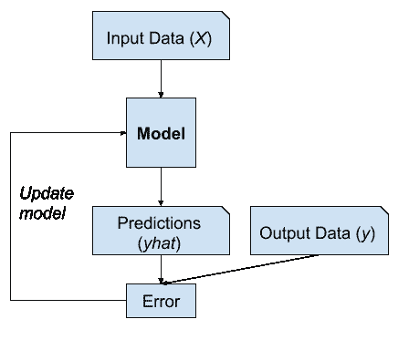
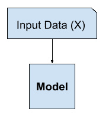
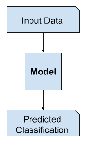
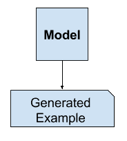
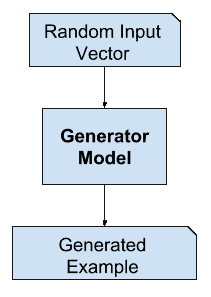
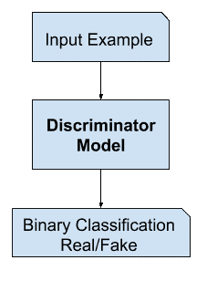
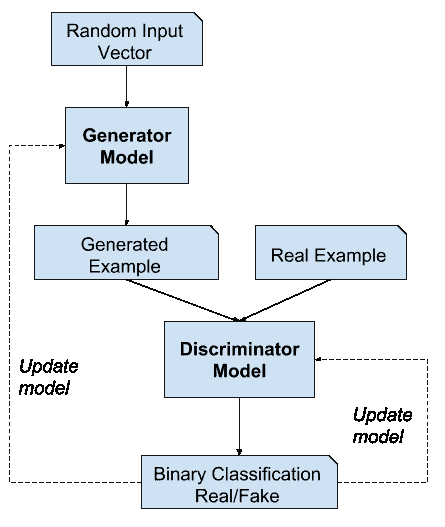
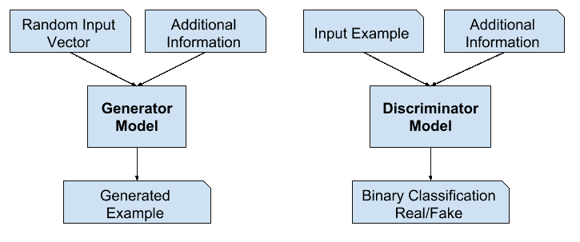
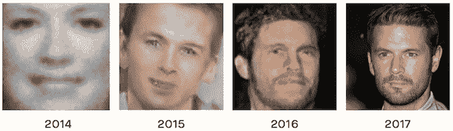

# 生成对抗网络（GANs）的温和介绍

> 原文：<https://machinelearningmastery.com/what-are-generative-adversarial-networks-gans/>

最后更新于 2019 年 7 月 19 日

生成对抗网络，简称 GANs，是一种使用深度学习方法(如卷积神经网络)进行生成建模的方法。

生成性建模是机器学习中的一项无监督学习任务，它涉及自动发现和学习输入数据中的规律或模式，使得该模型可以用来生成或输出新的示例，这些示例似乎是从原始数据集中提取的。

GANs 是一种训练生成模型的聪明方法，它通过两个子模型将问题框架化为有监督的学习问题:生成器模型，我们训练它来生成新的示例，以及鉴别器模型，它试图将示例分类为真实的(来自域)或虚假的(生成的)。这两个模型在一个零和博弈中一起训练，对抗性的，直到鉴别器模型被愚弄了大约一半的时间，这意味着生成器模型正在生成似是而非的例子。

GANs 是一个令人兴奋且快速变化的领域，在生成跨一系列问题领域的真实示例的能力方面实现了生成模型的承诺，最显著的是在图像到图像的翻译任务中，例如将夏天的照片翻译成冬天的照片或白天到晚上的照片，以及生成甚至人类都无法分辨的对象、场景和人的真实感照片是假的。

在这篇文章中，你会发现一个温和的关于生成对抗网络的介绍。

看完这篇文章，你会知道:

*   GANs 的上下文，包括监督学习和非监督学习，以及区分建模和生成建模。
*   GANs 是一种通过将无监督问题视为有监督问题并同时使用生成模型和判别模型来自动训练生成模型的体系结构。
*   GANs 为复杂的特定领域数据扩充提供了一条途径，并为需要生成性解决方案的问题提供了解决方案，例如图像到图像的翻译。

**用我的新书[Python 生成对抗网络](https://machinelearningmastery.com/generative_adversarial_networks/)启动你的项目**，包括*分步教程*和所有示例的 *Python 源代码*文件。

我们开始吧。

生成对抗网络的温和介绍
图片由[巴尼·莫斯](https://www.flickr.com/photos/barneymoss/9548059151/)提供，保留部分权利。

## 概观

本教程分为三个部分；它们是:

1.  什么是生成模型？
2.  什么是生成对抗网络？
3.  为什么是生成对抗网络？

## 什么是生成模型？

在这一节中，我们将回顾生成模型的思想，跨越有监督和无监督的学习范例以及有区别的和生成的建模。

### 监督学习与非监督学习

典型的机器学习问题包括使用模型进行预测，例如[预测建模](https://machinelearningmastery.com/gentle-introduction-to-predictive-modeling/)。

这需要一个用于训练模型的训练数据集，该数据集由多个称为样本的示例组成，每个示例都有输入变量( *X* )和输出类标签( *y* )。模型是通过显示输入的例子，让它预测输出，并修正模型使输出更像预期的输出来训练的。

> 在预测或监督学习方法中，目标是学习从输入 x 到输出 y 的映射，给定一组标记的输入输出对…

—第 2 页，[机器学习:概率视角](https://amzn.to/2HV6cYx)，2012。

模型的这种修正通常被称为监督形式的学习，或监督学习。

监督学习的例子

监督学习问题的例子包括分类和回归，监督学习算法的例子包括逻辑回归和随机森林。

还有一种学习范式，模型只给定输入变量( *X* )，问题没有任何输出变量( *y* )。

通过提取或总结输入数据中的模式来构建模型。模型没有修正，因为模型没有预测任何东西。

> 机器学习的第二种主要类型是描述性或无监督学习方法。这里我们只得到输入，目标是在数据中找到“有趣的模式”。[……]这是一个定义不太明确的问题，因为我们没有被告知要寻找哪种模式，也没有明显的误差度量来使用(不像监督学习，在监督学习中，我们可以将给定 x 的 y 预测与观察值进行比较)。

—第 2 页，[机器学习:概率视角](https://amzn.to/2HV6cYx)，2012。

这种缺乏纠正通常被称为无监督的学习形式，或无监督学习。

无监督学习的例子

无监督学习问题的例子包括聚类和生成建模，无监督学习算法的例子是 K 均值和生成对抗网络。

### 区别建模与生成建模

在监督学习中，我们可能有兴趣开发一个模型来预测给定输入变量示例的类标签。

这种预测建模任务称为分类。

分类在传统上也被称为鉴别建模。

> ……我们使用训练数据找到一个判别函数 f(x)，它将每个 x 直接映射到一个类标签上，从而将推理和决策阶段结合成一个单一的学习问题。

—第 44 页，[模式识别与机器学习](https://amzn.to/2K3EcE3)，2006。

这是因为模型必须跨类区分输入变量的例子；它必须选择或决定一个给定的例子属于哪一类。

判别建模示例

或者，总结输入变量分布的无监督模型可以用于在输入分布中创建或生成新的示例。

因此，这些类型的模型被称为[生成模型](https://en.wikipedia.org/wiki/Generative_model)。

生成建模示例

例如，单个变量可能具有已知的数据分布，如[高斯分布](https://machinelearningmastery.com/statistical-data-distributions/)，或钟形。生成模型可能能够充分总结这种数据分布，然后用于生成似乎适合输入变量分布的新变量。

> 对输入和输出的分布进行显式或隐式建模的方法称为生成模型，因为通过对它们进行采样，可以在输入空间中生成合成数据点。

—第 43 页，[模式识别与机器学习](https://amzn.to/2K3EcE3)，2006。

事实上，一个真正好的生成模型可能能够生成新的例子，这些例子不仅看似合理，而且与问题领域的真实例子没有区别。

### 生成模型的例子

[朴素贝叶斯](https://machinelearningmastery.com/naive-bayes-for-machine-learning/)是生成模型的一个例子，它更经常被用作判别模型。

例如，朴素贝叶斯通过总结每个输入变量和输出类的概率分布来工作。当进行预测时，为每个变量计算每个可能结果的概率，组合独立概率，并预测最可能的结果。反向使用时，可以对每个变量的概率分布进行采样，以生成新的似是而非(独立)的特征值。

生成模型的其他例子包括潜在狄利克雷分配(LDA)和高斯混合模型(GMM)。

深度学习方法可以用作生成模型。两个流行的例子包括受限玻尔兹曼机器(RBM)和深度信念网络(DBN)。

深度学习生成建模算法的两个现代例子包括变分自动编码器(VAE)和生成对抗网络(GAN)。

## 什么是生成对抗网络？

生成对抗网络是一种基于深度学习的生成模式。

更一般地说，GANs 是一种用于训练生成模型的模型架构，在这种架构中使用深度学习模型是最常见的。

2014 年，伊恩·古德费勒等人在题为“T2 生成对抗网络”的论文中首次描述了 GAN 架构

后来，[亚历克·拉德福德](https://github.com/Newmu)等人在 2015 年发表的题为“[利用深度卷积生成对抗网络的无监督表示学习](https://arxiv.org/abs/1511.06434)”的论文中正式提出了一种称为深度卷积生成对抗网络(DCGAN)的标准化方法，该方法导致了更稳定的模型。

> 今天的大多数 GANs 至少是松散地基于 DCGAN 架构的…

——[NIPS 2016 教程:生成对抗网络](https://arxiv.org/abs/1701.00160)，2016。

GAN 模型架构包括两个子模型:用于生成新示例的*生成器模型*和用于分类生成的示例是来自域的真实示例还是生成器模型生成的虚假示例的*鉴别器模型*。

*   **发电机**。用于从问题域生成新的似是而非的示例的模型。
*   **鉴别器**。用于将示例分类为真实(*来自域*)或虚假(*生成*)的模型。

> 生成对抗网络是基于一个博弈论的场景，在这个场景中，生成网络必须与对手竞争。发生器网络直接产生样本。它的对手鉴别器网络试图区分从训练数据提取的样本和从生成器提取的样本。

—第 699 页，[深度学习](https://amzn.to/2YuwVjL)，2016。

### 发电机模型

生成器模型以固定长度的随机向量作为输入，并在域中生成样本。

该向量是从高斯分布中随机抽取的，该向量用于生成过程的种子。训练后，这个多维向量空间中的点将对应问题域中的点，形成数据分布的压缩表示。

这个向量空间被称为潜在空间，或者由[潜在变量](https://en.wikipedia.org/wiki/Latent_variable)组成的向量空间。潜在变量，或者说隐藏变量，是那些对一个领域很重要但不能直接观察到的变量。

> 潜变量是我们不能直接观察的随机变量。

—第 67 页，[深度学习](https://amzn.to/2YuwVjL)，2016。

我们通常将潜在变量或潜在空间称为数据分布的投影或压缩。也就是说，潜在空间提供了观察到的原始数据(例如输入数据分布)的压缩或高级概念。在 GANs 的情况下，生成器模型将意义应用于所选潜在空间中的点，使得从潜在空间中提取的新点可以作为输入提供给生成器模型，并用于生成新的和不同的输出示例。

> 机器学习模型可以学习图像、音乐和故事的统计潜在空间，然后它们可以从这个空间中采样，创建新的艺术品，其特征类似于模型在其训练数据中看到的特征。

—第 270 页，[Python 深度学习](https://amzn.to/2U2bHuP)，2017。

经过训练后，生成器模型被保留并用于生成新的样本。

GAN 发生器模型示例

### 鉴别器模型

鉴别器模型以域中的一个例子作为输入(真实的或生成的)，并预测真实的或虚假的二进制类标签(生成的)。

真实的例子来自训练数据集。生成的示例由生成器模型输出。

鉴别器是一个正常的(并且很好理解的)分类模型。

在训练过程之后，鉴别器模型被丢弃，因为我们对生成器感兴趣。

有时，生成器可以重新调整用途，因为它已经学会从问题领域的示例中有效地提取特征。一些或所有特征提取层可以在使用相同或相似输入数据的迁移学习应用中使用。

> 我们建议，建立良好图像表示的一种方法是训练生成对抗网络(GANs)，然后重用部分生成器和鉴别器网络作为监督任务的特征提取器

——[深度卷积生成对抗网络的无监督表示学习](https://arxiv.org/abs/1511.06434)，2015。

GAN 鉴别器模型示例

### 作为两人游戏的游戏

生成模型是一个无监督的学习问题，正如我们在前面的章节中所讨论的，尽管 GAN 体系结构的一个聪明的特性是生成模型的训练被构造成一个有监督的学习问题。

生成器和鉴别器这两个模型是一起训练的。生成器生成一批样本，这些样本以及来自该域的真实示例被提供给鉴别器，并被分类为真实或虚假。

然后更新鉴别器，以便在下一轮中更好地鉴别真假样本，重要的是，生成器根据生成的样本欺骗鉴别器的程度进行更新。

> 我们可以把生成器想象成一个伪造者，试图制造假币，把鉴别器想象成警察，试图允许合法货币，抓住假币。为了在这个游戏中取得成功，伪造者必须学会制造与真金白银无法区分的货币，生成器网络必须学会创建从与训练数据相同的分布中提取的样本。

——[NIPS 2016 教程:生成对抗网络](https://arxiv.org/abs/1701.00160)，2016。

这样，两个模型就在相互竞争，在博弈论意义上是对抗性的，在玩一个[零和游戏](https://en.wikipedia.org/wiki/Zero-sum_game)。

> 因为 GAN 框架自然可以用博弈论的工具来分析，所以我们称 GAN 为“对抗性的”。

——[NIPS 2016 教程:生成对抗网络](https://arxiv.org/abs/1701.00160)，2016。

在这种情况下，零和意味着当鉴别器成功地识别真实和虚假样本时，它会得到奖励或者不需要改变模型参数，而生成器会因为模型参数的大量更新而受到惩罚。

或者，当生成器欺骗鉴别器时，它得到奖励，或者不需要改变模型参数，但是鉴别器受到惩罚，并且它的模型参数被更新。

在极限情况下，生成器每次都从输入域生成完美的副本，而鉴别器无法分辨两者之间的区别，并且在每种情况下都会预测“不确定”(例如，50%是真的还是假的)。这只是一个理想化案例的例子；我们不需要到达这一点就能得到一个有用的发电机模型。

生成对抗网络模型架构示例

> [训练]驱动鉴别器尝试学习正确地将样本分类为真或假。同时，生成器试图欺骗分类器相信它的样本是真实的。收敛时，发生器的样本与真实数据无法区分，鉴别器处处输出 1/2。然后可以丢弃该鉴别器。

—第 700 页，[深度学习](https://amzn.to/2YuwVjL)，2016。

### 遗传神经网络和卷积神经网络

神经网络通常处理图像数据，并使用卷积神经网络作为生成器和鉴别器模型。

其原因可能是因为该技术的第一次描述是在计算机视觉领域，并使用了 CNN 和图像数据，还因为近年来在更广泛地使用 CNN 来实现一系列计算机视觉任务(如对象检测和人脸识别)的最新成果方面取得了显著进展。

对图像数据建模意味着潜在空间(生成器的输入)提供了用于训练模型的一组图像或照片的压缩表示。这也意味着生成器生成新的图像或照片，提供模型的开发人员或用户可以轻松查看和评估的输出。

可能正是这一超越其他因素的事实，即直观评估生成输出质量的能力，导致了计算机视觉应用对 CNN 的关注，以及与其他基于深度学习或其他方式的生成模型相比，CNN 能力的巨大飞跃。

### 条件 gan

GAN 的一个重要扩展是用于有条件地产生输出。

生成模型可以被训练以从输入域生成新的例子，其中输入，来自潜在空间的随机向量，被提供有(由)一些附加输入。

额外的输入可以是类别值，例如在生成人的照片时是男性或女性，或者在生成手写数字图像时是数字。

> 如果生成器和鉴别器都以某些额外信息为条件，那么生成对抗网可以扩展到条件模型。y 可以是任何类型的辅助信息，例如类标签或来自其他模态的数据。我们可以通过将 y 作为额外的输入层输入鉴别器和发生器来进行调节。

——[条件生成对抗网](https://arxiv.org/abs/1411.1784)，2014。

鉴别器也是有条件的，这意味着它既有真实或虚假的输入图像，也有额外的输入。在分类标签类型条件输入的情况下，鉴别器将期望输入是该类的，反过来教导生成器生成该类的示例，以便欺骗鉴别器。

以这种方式，条件 GAN 可以用于从给定类型的域生成示例。

更进一步，GAN 模型可以基于来自域的示例，例如图像。这允许 GANs 的应用，如文本到图像的翻译，或图像到图像的翻译。这允许 GANs 的一些更令人印象深刻的应用，例如风格转换、照片彩色化、将照片从夏天转换成冬天或从白天转换成夜晚等等。

在用于图像到图像转换的条件 GANs 的情况下，例如将白天转换为夜晚，鉴别器被提供真实的和生成的夜间照片的例子以及(以)真实的白天照片作为输入。生成器提供了来自潜在空间的随机向量以及(根据条件)真实的白天照片作为输入。

条件生成对抗网络模型架构示例

## 为什么是生成对抗网络？

在计算机视觉等领域使用深度学习方法的许多重大进步之一是一种称为[数据扩充](https://machinelearningmastery.com/image-augmentation-deep-learning-keras/)的技术。

数据扩充导致更好的模型表现，既增加了模型技能，又提供了规则效果，减少了泛化误差。它通过从训练模型的输入问题域中创建新的、人工的但看似合理的例子来工作。

在图像数据的情况下，这些技术是基本的，包括裁剪、翻转、缩放和训练数据集中现有图像的其他简单变换。

成功的生成性建模为数据扩充提供了一种替代的、潜在的更特定领域的方法。事实上，数据扩充是生成建模的简化版本，尽管很少这样描述。

> …用潜在的(未观察到的)数据扩大样本。这被称为数据扩充。[……]在其他问题中，潜在数据是本应观察到但却缺失的实际数据。

—第 276 页，[统计学习的要素](https://amzn.to/2UcPeva)，2016。

在复杂领域或数据量有限的领域中，生成式建模为建模提供了更多训练的途径。在深度强化学习等领域，GANs 在这个用例中看到了很多成功。

有许多研究原因可以解释为什么 GANs 有趣、重要，需要进一步研究。伊恩·古德费勒在他 2016 年的会议主题演讲和相关技术报告中概述了其中的一些内容，该报告题为“ [NIPS 2016 教程:生成对抗网络](https://arxiv.org/abs/1701.00160)”

在这些原因中，他强调了 GANs 对高维数据建模、处理缺失数据的成功能力，以及 GANs 提供多模态输出或多个可信答案的能力。

也许 GANs 最引人注目的应用是针对需要生成新示例的任务的条件 GANs。在这里，古德费勒指出了三个主要的例子:

*   **图像超分辨率**。生成输入图像的高分辨率版本的能力。
*   **创造艺术**。伟大的新的和艺术的图像，素描，绘画的能力，等等。
*   **图像到图像的转换**。跨域翻译照片的能力，例如白天到晚上，夏天到冬天，等等。

也许 GANs 被广泛研究、开发和使用的最令人信服的原因是因为它们的成功。GANs 已经能够生成如此逼真的照片，以至于人类无法分辨它们是真实生活中不存在的对象、场景和人。

对他们的能力和成功来说，惊人并不是一个足够的形容词。

从 2014 年到 2017 年全球网络能力发展的例子。摘自[《人工智能的恶意使用:预测、预防和缓解》](https://arxiv.org/abs/1802.07228)，2018 年。

## 进一步阅读

如果您想更深入地了解这个主题，本节将提供更多资源。

### 邮件

*   [开始使用生成对抗网络的最佳资源](https://machinelearningmastery.com/resources-for-getting-started-with-generative-adversarial-networks/)
*   [生成对抗网络的 18 个令人印象深刻的应用](https://machinelearningmastery.com/impressive-applications-of-generative-adversarial-networks/)

### 书

*   [第二十章。深度生成模型，深度学习](https://amzn.to/2YuwVjL)，2016。
*   [第八章。生成式深度学习，Python 深度学习](https://amzn.to/2U2bHuP)，2017。
*   [机器学习:概率视角](https://amzn.to/2HV6cYx)，2012。
*   [模式识别与机器学习](https://amzn.to/2K3EcE3)，2006。
*   [统计学习的要素](https://amzn.to/2UcPeva)，2016。

### 报纸

*   [生成对抗网络](https://arxiv.org/abs/1406.2661)，2014。
*   [深度卷积生成对抗网络的无监督表示学习](https://arxiv.org/abs/1701.00160)，2015。
*   [NIPS 2016 教程:生成对抗网络](https://arxiv.org/abs/1701.00160)，2016。
*   [条件生成对抗网](https://arxiv.org/abs/1411.1784)，2014。
*   [人工智能的恶意使用:预测、预防和缓解](https://arxiv.org/abs/1802.07228)，2018。

### 文章

*   [生成模型，维基百科](https://en.wikipedia.org/wiki/Generative_model)。
*   [潜变量，维基百科](https://en.wikipedia.org/wiki/Latent_variable)。
*   [生成对抗网络，维基百科](https://en.wikipedia.org/wiki/Generative_adversarial_network)。

## 摘要

在这篇文章中，你发现了对生成对抗网络的温和介绍。

具体来说，您了解到:

*   GANs 的上下文，包括监督学习和非监督学习，以及区分建模和生成建模。
*   GANs 是一种通过将无监督问题视为有监督问题并同时使用生成模型和判别模型来自动训练生成模型的体系结构。
*   GANs 为复杂的特定领域数据扩充提供了一条途径，并为需要生成性解决方案的问题提供了解决方案，例如图像到图像的翻译。

你有什么问题吗？
在下面的评论中提问，我会尽力回答。