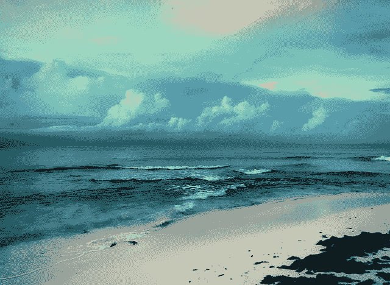
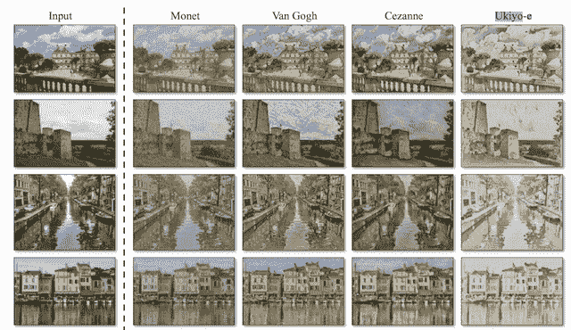
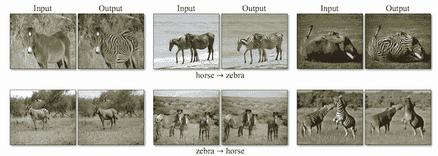
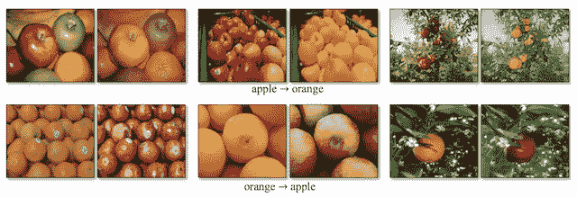
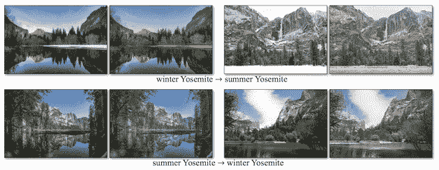
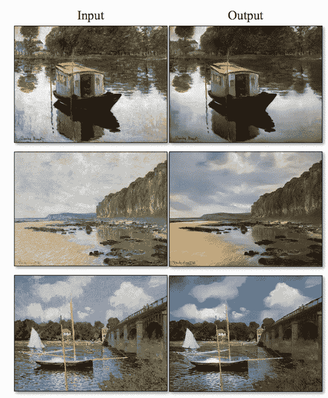
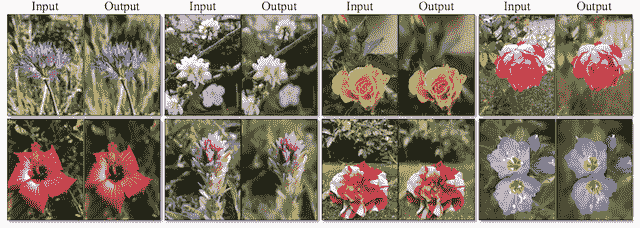

# CycleGAN 图像转换的温和介绍

> 原文：<https://machinelearningmastery.com/what-is-cyclegan/>

最后更新于 2019 年 8 月 17 日

图像到图像的转换包括生成特定修改的给定图像的新合成版本，例如将夏季景观转换为冬季景观。

为图像到图像的转换训练模型通常需要大量成对的例子。这些数据集可能很难准备，也很昂贵，在某些情况下是不可能的，比如早已去世的艺术家的绘画照片。

CycleGAN 是一种在没有成对例子的情况下自动训练图像到图像转换模型的技术。使用来自源域和目标域的不需要以任何方式相关的图像集合，以无监督的方式训练模型。

这种简单的技术非常强大，在一系列应用领域取得了令人印象深刻的视觉效果，最显著的是将马的照片翻译成斑马，反之亦然。

在这篇文章中，你将发现用于不成对图像到图像转换的 CycleGAN 技术。

看完这篇文章，你会知道:

*   图像到图像的转换涉及对图像的受控修改，并且需要准备复杂或有时不存在的成对图像的大数据集。
*   CycleGAN 是一种通过 GAN 架构使用来自两个不同领域的不成对图像集合来训练无监督图像转换模型的技术。
*   CycleGAN 已经在一系列应用中进行了演示，包括季节转换、对象变形、风格转换以及从绘画中生成照片。

**用我的新书[Python 生成对抗网络](https://machinelearningmastery.com/generative_adversarial_networks/)启动你的项目**，包括*分步教程*和所有示例的 *Python 源代码*文件。

我们开始吧。

崔西·哈特曼拍摄的《自行车入门》图片，版权所有。

## 概观

本教程分为五个部分；它们是:

1.  图像到图像转换的问题
2.  基于 CycleGAN 的不成对图像到图像转换
3.  什么是 CycleGAN 模型架构
4.  仙客来的应用
5.  CycleGAN 的实现技巧

## 图像到图像转换的问题

图像到图像的转换是一项图像合成任务，需要生成一个新的图像，该图像是对给定图像的受控修改。

> 图像到图像的转换是一类视觉和图形问题，其目标是使用对齐图像对的训练集来学习输入图像和输出图像之间的映射。

——[使用循环一致对抗网络的不成对图像到图像转换](https://arxiv.org/abs/1703.10593)，2017。

图像到图像转换的例子包括:

*   将夏季景观转换为冬季景观(或相反)。
*   把画翻译成照片(或相反)。
*   把马翻译成斑马(或者相反)。

传统上，训练图像到图像的转换模型需要一个由成对例子组成的数据集。也就是说，输入图像 X(例如夏季风景)和具有期望修改的相同图像的许多示例的大数据集可以用作预期输出图像 Y(例如冬季风景)。

对成对训练数据集的要求是一个限制。这些数据集具有挑战性，并且制作成本高，例如不同条件下不同场景的照片。

在许多情况下，数据集根本不存在，例如名画和它们各自的照片。

> 然而，获得成对的训练数据可能是困难和昂贵的。[……]为艺术风格化等图形任务获取输入输出对可能更加困难，因为所需的输出非常复杂，通常需要艺术创作。对于许多任务，像对象变形(例如斑马马)，期望的输出甚至没有被很好地定义。

——[使用循环一致对抗网络的不成对图像到图像转换](https://arxiv.org/abs/1703.10593)，2017。

因此，需要用于训练不需要成对示例的图像到图像转换系统的技术。具体而言，可以使用任何两个不相关图像的集合，并且从每个集合中提取一般特征并在图像转换过程中使用。

例如，能够以不相关的场景和位置作为第一位置拍摄大量的夏季风景照片和大量的冬季风景照片，并且能够将特定的照片从一组翻译到另一组。

这被称为不成对的图像到图像的翻译问题。

## 基于 CycleGAN 的不成对图像到图像转换

CycleGAN 是一种成功的不成对图像到图像的翻译方法。

CycleGAN 是一种使用生成对抗网络(GAN)模型架构来训练图像到图像转换模型的方法。

> [……]我们提出了一种方法，可以学习[捕获]一个图像集合的特殊特征，并弄清楚如何将这些特征转化为另一个图像集合，所有这些都是在没有任何配对训练示例的情况下进行的。

——[使用循环一致对抗网络的不成对图像到图像转换](https://arxiv.org/abs/1703.10593)，2017。

GAN 体系结构是一种训练图像合成模型的方法，该模型由两个模型组成:生成器模型和鉴别器模型。生成器从潜在空间中获取一个点作为输入，并从域中生成新的似是而非的图像，鉴别器将图像作为输入，并预测它是真实的(来自数据集)还是虚假的(生成的)。这两个模型都是在游戏中训练的，因此生成器被更新以更好地欺骗鉴别器，鉴别器被更新以更好地检测生成的图像。

CycleGAN 是 GAN 架构的扩展，它涉及两个生成器模型和两个鉴别器模型的同时训练。

一个生成器将来自第一域的图像作为输入并输出第二域的图像，另一个生成器将来自第二域的图像作为输入并生成第一域的图像。然后使用鉴别器模型来确定生成的图像有多可信，并相应地更新生成器模型。

仅仅这个扩展可能就足以在每个域中生成看似合理的图像，但是不足以生成输入图像的翻译。

> ……仅仅是对抗损失不能保证学习的函数能够将单个输入 xi 映射到期望的输出 yi

——[使用循环一致对抗网络的不成对图像到图像转换](https://arxiv.org/abs/1703.10593)，2017。

CycleGAN 对称为周期一致性的体系结构进行了额外的扩展。这是由第一发生器输出的图像可以用作第二发生器的输入并且第二发生器的输出应该与原始图像匹配的想法。反之亦然:第二个发生器的输出可以作为第一个发生器的输入，结果应该与第二个发生器的输入相匹配。

循环一致性是机器翻译中的一个概念，从英语翻译成法语的短语应该从法语翻译回英语，并与原始短语相同。相反的过程也应该如此。

> ……我们利用了翻译应该“循环一致”的特性，也就是说，如果我们把一个句子从英语翻译成法语，然后再把它从法语翻译回英语，我们就应该回到原来的句子

——[使用循环一致对抗网络的不成对图像到图像转换](https://arxiv.org/abs/1703.10593)，2017。

CycleGAN 通过增加额外的损耗来测量第二个生成器生成的输出和原始图像之间的差异，从而提高了循环的一致性，反之亦然。这作为生成器模型的正则化，引导新领域中的图像生成过程朝向图像转换。

## 什么是 CycleGAN 模型架构

乍一看，CycleGAN 的架构似乎很复杂。

让我们花点时间浏览一下所有涉及的模型及其输入和输出。

考虑一下我们对从夏天到冬天和从冬天到夏天的图像转换感兴趣的问题。

我们有两组照片，它们不成对，意味着它们是不同时间不同地点的照片；我们在冬天和夏天没有完全相同的场景。

*   **收藏 1** :夏日风景照片。
*   **收藏 2** :冬季风景照。

我们将开发一个由两个 GAN 组成的架构，每个 GAN 都有一个鉴别器和一个生成器模型，这意味着架构中总共有四个模型。

第一个 GAN 将生成冬天的照片给夏天的照片，第二个 GAN 将生成夏天的照片给冬天的照片。

*   **GAN 1** :将夏天(合集 1)的照片翻译成冬天(合集 2)。
*   **GAN 2** :将冬季(集合 2)的照片翻译成夏季(集合 1)。

每个 GAN 都有一个条件发生器模型，它将合成给定输入图像的图像。每个 GAN 都有一个鉴别器模型来预测生成的图像来自目标图像集合的可能性。GAN 的鉴别器和发生器模型像标准 GAN 模型一样在正常对抗损失下训练。

我们可以将 GAN 1 的发生器和鉴别器模型总结如下:

*   **发电机型号 1:**
    *   **输入**:拍夏天的照片(收藏 1)。
    *   **输出**:生成冬天的照片(集合 2)。
*   **鉴别器型号 1** :
    *   **输入**:采集 2 号采集的冬季照片，发电机型号 1 输出。
    *   **输出**:图像的可能性来自集合 2。

同样，我们可以将 GAN 2 中的生成器和鉴别器模型总结如下:

*   **发电机型号 2** :
    *   **输入**:拍摄冬天的照片(收藏 2)。
    *   **输出**:生成夏天的照片(集合 1)。
*   **鉴别器型号 2** :
    *   **输入**:采集 1 号集合的夏天照片，发电机型号 2 输出。
    *   **输出**:图像的可能性来自集合 1。

到目前为止，这些模型足以在目标域中生成似是而非的图像，但不是输入图像的翻译。

每个 GANs 也使用周期一致性损失进行更新。这是为了鼓励目标域中的合成图像是输入图像的翻译。

循环一致性损失将输入照片与生成的照片进行比较，并计算两者之间的差值，例如使用 [L1 范数](https://machinelearningmastery.com/vector-norms-machine-learning/)或像素值的绝对差值总和。

有两种方法可以计算循环一致性损失，并用于在每次训练迭代中更新生成器模型。

第一 GAN (GAN 1)将拍摄夏季景观的图像，生成冬季景观的图像，该图像作为输入提供给第二 GAN (GAN 2)，第二 GAN(GAN 2)又将生成夏季景观的图像。循环一致性损失计算输入到 GAN 1 的图像和 GAN 2 输出的图像之间的差异，并且相应地更新生成器模型以减少图像中的差异。

这是周期一致性损失的正向循环。对于从发电机 2 到发电机 1 的反向循环一致性损失，以及将冬季的原始照片与生成的冬季照片进行比较，同样的过程是反向相关的。

*   **正向循环一致性损失**:
    *   将夏季照片(收藏 1)输入到 GAN 1
    *   GAN 1 的冬季输出照片
    *   从 GAN 1 到 GAN 2 的冬季输入照片
    *   从 GAN 2 输出夏天的照片
    *   将夏季照片(集合 1)与 GAN 2 中的夏季照片进行比较
*   **反向循环一致性损失**:
    *   将冬季照片(收藏 2)输入到 GAN 2
    *   从 GAN 2 输出夏天的照片
    *   从 GAN 2 到 GAN 1 的夏季输入照片
    *   GAN 1 的冬季输出照片
    *   将冬季照片(集合 2)与 GAN 1 中的冬季照片进行比较

## 仙客来的应用

CycleGAN 方法有许多令人印象深刻的应用。

在本节中，我们将回顾其中的五个应用程序，以了解该技术的功能。

### 风格转移

风格转移是指从一个领域(通常是绘画)学习艺术风格，并将艺术风格应用到另一个领域，如照片。

通过将莫奈、T2、梵高、T4、塞尚和浮世绘的艺术风格运用到风景照片中，展示了循环感。

从著名画家到风景照片风格转换的例子。
摘自:使用循环一致对抗网络的不成对图像到图像转换。

### 对象变形

对象变形是指对象从一类对象(如狗)转变为另一类对象(如猫)。

CycleGAN 演示了将马的照片转化为斑马，反之亦然:将斑马的照片转化为马。这种变形很有意义，因为马和斑马除了颜色不同之外，在大小和结构上都很相似。

从马到斑马和斑马到马的对象变形的例子。
摘自:使用循环一致对抗网络的不成对图像到图像转换。

CycleGAN 还演示了如何将苹果的照片翻译成橙子，以及相反的情况:将橙子的照片翻译成苹果。

同样，这种变形是有意义的，因为橘子和苹果都有相同的结构和大小。

从苹果到橘子和橘子到苹果的对象变形的例子。
摘自:使用循环一致对抗网络的不成对图像到图像转换。

### 季节转换

季节转换是指将在一个季节(如夏天)拍摄的照片翻译成另一个季节(如冬天)。

CycleGAN 演示了如何将冬季风景的照片转换为夏季风景，以及将夏季风景转换为冬季风景。

从冬季到夏季和从夏季到冬季的季节转换示例
摘自:使用周期一致对抗网络的不成对图像到图像转换。

### 从绘画中产生照片

顾名思义，从绘画中生成照片是给定一幅画的真实感图像的合成，通常由著名艺术家或著名场景绘制。

在将莫奈的许多画作翻译成看似合理的照片时，展示了循环。

将莫奈的画翻译成真实感场景的例子。
摘自:使用循环一致对抗网络的不成对图像到图像转换。

### 照片增强

照片增强是指以某种方式改善原始图像的变换。

CycleGAN 通过提高花卉特写照片的景深(例如，产生宏观效果)来增强照片效果。

照片增强示例提高花卉照片的景深。
摘自:使用循环一致对抗网络的不成对图像到图像转换。

## CycleGAN 的实现技巧

CycleGAN 论文提供了许多关于如何在实践中实现该技术的技术细节。

发电机网络实现基于[贾斯廷·约翰逊](https://cs.stanford.edu/people/jcjohns/)在 2016 年题为“实时风格转换和超分辨率的[感知损失”的论文中描述的风格转换方法](https://arxiv.org/abs/1603.08155)

生成器模型从使用深度卷积 GAN 的生成器的最佳实践开始，深度卷积 GAN 是使用多个残差块(例如来自 [ResNet](https://machinelearningmastery.com/how-to-implement-major-architecture-innovations-for-convolutional-neural-networks/) )实现的。

鉴别器模型使用 PatchGAN，正如 Phillip Isola 等人在 2016 年发表的题为“利用条件对抗网络的 T2 图像到图像转换”的论文中所描述的

> 这个鉴别器试图分类图像中的每个 NxN 补丁是真的还是假的。我们在图像上运行这个鉴别器卷积，平均所有响应，以提供 d 的最终输出。

——[条件对抗网络下的图像到图像转换](https://arxiv.org/abs/1611.07004)，2016。

在鉴别器模型中使用面片来将输入图像的 70×70 重叠面片分类为属于该域或已经生成。然后将鉴别器输出作为每个补丁的预测平均值。

对抗损失是使用最小二乘损失函数实现的，如毛旭东等人 2016 年的论文《T2 最小二乘生成对抗网络》中所述

> [……]我们提出了最小二乘生成对抗网络，它采用最小二乘损失函数作为鉴别器。这个想法简单而强大:最小二乘损失函数能够将假样本移向决策边界，因为最小二乘损失函数惩罚了位于决策边界正确一侧很远的样本。

——[最小二乘生成对抗网络](https://arxiv.org/abs/1611.04076)，2016。

此外，50 个生成图像的缓冲区用于更新鉴别器模型，而不是新生成的图像，如 [Ashish Shrivastava 的](https://www.linkedin.com/in/ashish-shrivastava-3499127/) 2016 年论文《通过对抗性训练从模拟和无监督图像中学习》中所述

> [……]我们引入了一种方法，通过使用精细图像的历史来更新鉴别器，而不仅仅是当前迷你批次中的图像，从而提高对抗训练的稳定性。

——[通过对抗性训练从模拟和无监督图像中学习](https://arxiv.org/abs/1612.07828)，2016。

用随机梯度下降的[亚当版本](https://machinelearningmastery.com/adam-optimization-algorithm-for-deep-learning/)和 100 个时期的小学习率训练模型，然后再用学习率衰减的 100 个时期。在每个图像之后更新模型，例如批量大小为 1。

论文附录中提供了该技术所基于的每个数据集的其他特定模型细节。

## 进一步阅读

如果您想更深入地了解这个主题，本节将提供更多资源。

### 报纸

*   [使用循环一致对抗网络的不成对图像到图像转换](https://arxiv.org/abs/1703.10593)，2017。
*   [实时风格转移和超分辨率的感知损失](https://arxiv.org/abs/1603.08155)，2016。
*   [条件对抗网络下的图像到图像转换](https://arxiv.org/abs/1611.07004)，2016。
*   [最小二乘生成对抗性网络](https://arxiv.org/abs/1611.04076)，2016。
*   [通过对抗性训练从模拟和无监督图像中学习](https://arxiv.org/abs/1612.07828)，2016。

### 文章

*   [了解并在 TensorFlow 中实现 cycle gan](https://hardikbansal.github.io/CycleGANBlog/)
*   [吉通网 CycleGAN 项目(官方)](https://github.com/junyanz/CycleGAN/)
*   [循环干项目页面(官方)](https://junyanz.github.io/CycleGAN/)

## 摘要

在这篇文章中，您发现了用于不成对图像到图像转换的 CycleGAN 技术。

具体来说，您了解到:

*   图像到图像的转换涉及对图像的受控修改，并且需要准备复杂或有时不存在的成对图像的大数据集。
*   CycleGAN 是一种通过 GAN 架构使用来自两个不同领域的不成对图像集合来训练无监督图像转换模型的技术。
*   CycleGAN 已在一系列应用中得到演示，包括季节转换、对象变形、风格转换以及从绘画中生成照片。

你有什么问题吗？
在下面的评论中提问，我会尽力回答。