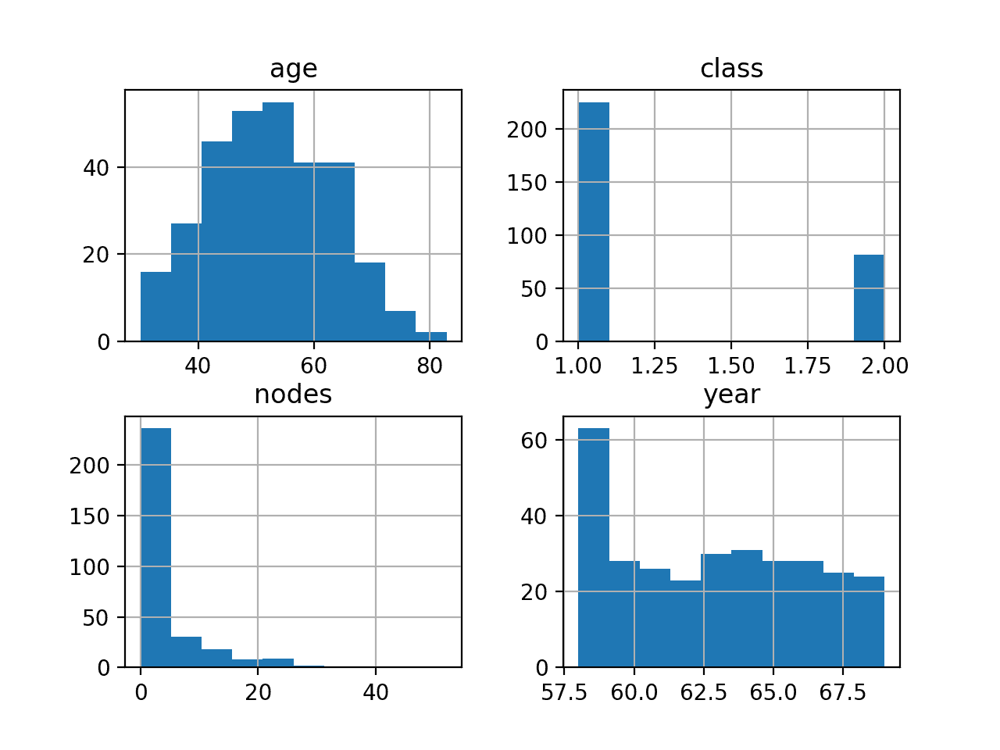
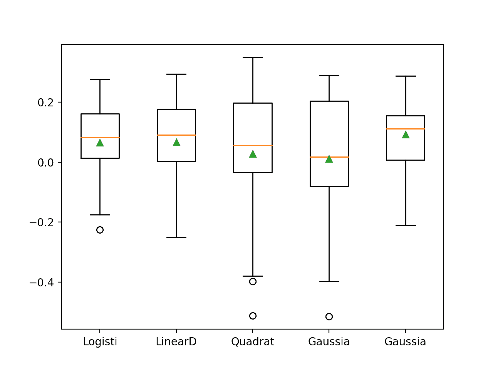
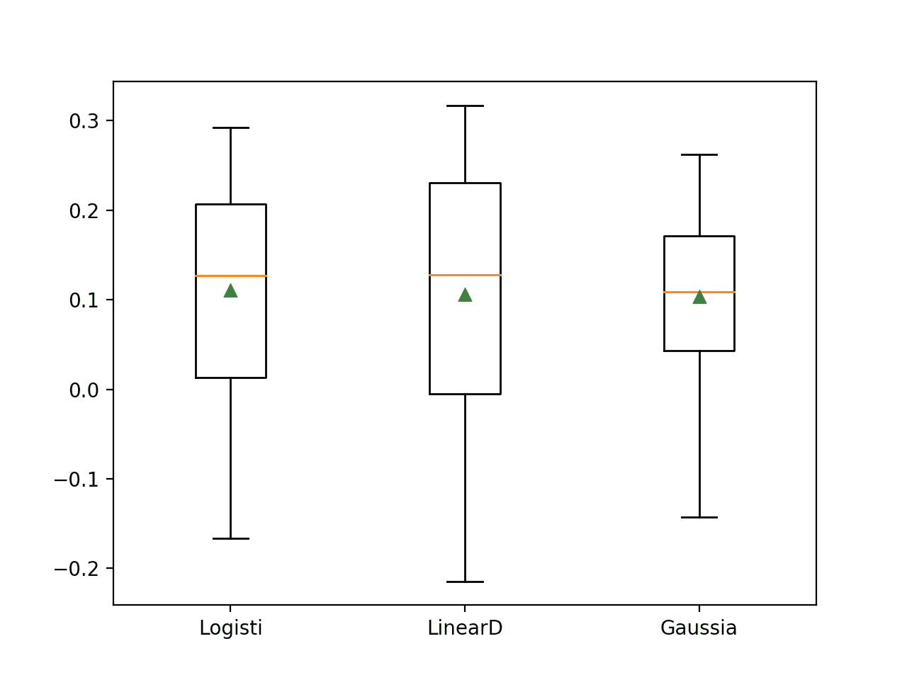

# 如何为乳腺癌患者存活建立概率模型

> 原文：<https://machinelearningmastery.com/how-to-develop-a-probabilistic-model-of-breast-cancer-patient-survival/>

最后更新于 2020 年 8 月 21 日

一般来说，开发一个概率模型是具有挑战性的，尽管当案例的分布存在偏差时，这种挑战性会更大，这种偏差被称为不平衡数据集。

**哈贝曼数据集**描述了 20 世纪 50 年代和 60 年代乳腺癌患者 5 年或更长时间的存活率，并且主要包含存活的患者。这个标准的机器学习数据集可以用作开发概率模型的基础，该概率模型可以预测给定一些患者病例细节的患者的存活概率。

给定数据集中病例的偏斜分布，必须仔细注意预测模型的选择，以确保预测校准的概率，并注意模型评估的选择，以确保模型的选择基于其预测概率的技巧，而不是简单的存活与非存活类别标签。

在本教程中，您将发现如何开发一个模型来预测不平衡数据集上患者的存活概率。

完成本教程后，您将知道:

*   如何加载和探索数据集，并为数据准备和模型选择产生想法。
*   如何评估一套概率模型，并通过适当的数据准备提高它们的表现。
*   如何拟合最终模型并使用它来预测特定情况下的概率。

**用我的新书[Python 不平衡分类](https://machinelearningmastery.com/imbalanced-classification-with-python/)启动你的项目**，包括*分步教程*和所有示例的 *Python 源代码*文件。

我们开始吧。


如何开发乳腺癌患者存活的概率模型
图片由 [Tanja-Milfoil](https://flickr.com/photos/milfoil/35128176284/) 提供，保留部分权利。

## 教程概述

本教程分为五个部分；它们是:

1.  哈贝曼乳腺癌存活数据集
2.  浏览数据集
3.  模型测试和基线结果
4.  评估概率模型
    1.  概率算法评估
    2.  具有缩放输入的模型评估
    3.  用幂变换进行模型评估
5.  对新数据进行预测

## 哈贝曼乳腺癌存活数据集

在这个项目中，我们将使用一个小型乳腺癌存活数据集，通常称为“[哈贝曼数据集](https://archive.ics.uci.edu/ml/datasets/Haberman's+Survival)”

数据集描述了乳腺癌患者数据，结果是患者存活率。具体来说，患者是否存活了 5 年或更长时间，或者患者是否没有存活。

这是一个用于不平衡分类研究的标准数据集。根据数据集描述，手术于 1958 年至 1970 年在芝加哥大学比林斯医院进行。

数据集中有 306 个例子，有 3 个输入变量；它们是:

*   手术时患者的年龄。
*   运营的两位数年份。
*   检测到的“[阳性腋窝淋巴结](https://en.wikipedia.org/wiki/Positive_axillary_lymph_node)的数量，这是癌症已经扩散的一种度量。

因此，除了数据集中可用的情况之外，我们无法控制组成数据集的情况或在这些情况下使用的要素的选择。

尽管数据集描述了乳腺癌患者的存活率，但鉴于数据集规模较小，并且数据基于几十年前的乳腺癌诊断和手术，因此任何基于该数据集构建的模型都不可一概而论。

**说得再清楚不过**，我们不是“*解决乳腺癌*”我们正在探索一个标准的不平衡类别数据集。

您可以在此了解有关数据集的更多信息:

*   [哈贝曼的存活数据](https://raw.githubusercontent.com/jbrownlee/Datasets/master/haberman.names)

我们将选择将此数据集作为患者存活概率的预测框架。

那就是:

> 给定患者乳腺癌手术细节，患者存活至五年或五年以上的概率是多少？

这将为探索可以预测概率而不是类标签的概率算法以及评估预测概率而不是类标签的模型的度量提供基础。

接下来，让我们仔细看看数据。

## 浏览数据集

首先，下载数据集并保存在您当前的工作目录中，名称为“ *haberman.csv* ”。

*   [下载哈贝曼存活数据(haberman.csv)](https://raw.githubusercontent.com/jbrownlee/Datasets/master/haberman.csv)

查看文件的内容。

文件的前几行应该如下所示:

```py
30,64,1,1
30,62,3,1
30,65,0,1
31,59,2,1
31,65,4,1
33,58,10,1
33,60,0,1
34,59,0,2
34,66,9,2
34,58,30,1
...
```

我们可以看到患者的年龄像 30 岁或 31 岁(第 1 栏)，手术分别发生在 1964 年和 1962 年的 64 年和 62 年(第 2 栏)，“*腋窝淋巴结*的值像 1 和 0。

所有值都是数字；具体来说，它们是整数。没有标有“*”的缺失值？*“性格。

我们还可以看到，类别标签(第 3 列)的值为 1 表示患者存活，2 表示患者非存活。

首先，我们可以加载 CSV 数据集，并使用五个数字的摘要来总结每一列。可以使用 [read_csv()熊猫函数](https://pandas.pydata.org/pandas-docs/stable/reference/api/pandas.read_csv.html)将数据集加载为*数据框*，指定列的位置和名称，因为没有标题行。

```py
...
# define the dataset location
filename = 'haberman.csv'
# define the dataset column names
columns = ['age', 'year', 'nodes', 'class']
# load the csv file as a data frame
dataframe = read_csv(filename, header=None, names=columns)
```

然后我们可以调用[description()函数](https://pandas.pydata.org/pandas-docs/stable/reference/api/pandas.DataFrame.describe.html)创建一个每列五个数汇总的报表，并打印报表内容。

一列的[五个数汇总](https://machinelearningmastery.com/how-to-calculate-the-5-number-summary-for-your-data-in-python/)包括有用的细节，如最小值和最大值，如果变量具有[高斯分布](https://machinelearningmastery.com/continuous-probability-distributions-for-machine-learning/)，则平均值和标准偏差有用，如果变量不具有高斯分布，则第 25、50 和 75 四分位数有用。

```py
...
# summarize each column
report = dataframe.describe()
print(report)
```

将这些联系在一起，下面列出了加载和汇总数据集列的完整示例。

```py
# load and summarize the dataset
from pandas import read_csv
# define the dataset location
filename = 'haberman.csv'
# define the dataset column names
columns = ['age', 'year', 'nodes', 'class']
# load the csv file as a data frame
dataframe = read_csv(filename, header=None, names=columns)
# summarize each column
report = dataframe.describe()
print(report)
```

运行该示例将加载数据集，并为三个输入变量和输出变量报告五个数字的摘要。

看年龄，可以看出最小的患者 30 岁，最大的 83 岁；这是相当大的差距。患者平均年龄约为 52 岁。如果癌症的发生有点随机，我们可能会认为这种分布是高斯分布。

我们可以看到所有的手术都是在 1958 年到 1969 年之间进行的。如果乳腺癌患者的数量随着时间的推移有些固定，我们可能会期望这个变量有一个均匀的分布。

我们可以看到节点的值在 0 到 52 之间。这可能是与淋巴结相关的癌症诊断。

```py
              age        year       nodes       class
count  306.000000  306.000000  306.000000  306.000000
mean    52.457516   62.852941    4.026144    1.264706
std     10.803452    3.249405    7.189654    0.441899
min     30.000000   58.000000    0.000000    1.000000
25%     44.000000   60.000000    0.000000    1.000000
50%     52.000000   63.000000    1.000000    1.000000
75%     60.750000   65.750000    4.000000    2.000000
max     83.000000   69.000000   52.000000    2.000000
```

所有变量都是整数。因此，将每个变量视为直方图来了解变量分布可能会有所帮助。

如果我们以后选择对数据分布或数据规模敏感的模型，这可能会有所帮助，在这种情况下，我们可能需要转换或重新缩放数据。

我们可以通过调用 [hist()函数](https://pandas.pydata.org/pandas-docs/stable/reference/api/pandas.DataFrame.hist.html)来创建数据框中每个变量的直方图。

下面列出了完整的示例。

```py
# create histograms of each variable
from pandas import read_csv
from matplotlib import pyplot
# define the dataset location
filename = 'haberman.csv'
# define the dataset column names
columns = ['age', 'year', 'nodes', 'class']
# load the csv file as a data frame
dataframe = read_csv(filename, header=None, names=columns)
# create a histogram plot of each variable
dataframe.hist()
pyplot.show()
```

运行该示例会为每个变量创建一个直方图。

我们可以看到，年龄似乎有高斯分布，正如我们可能预期的那样。我们还可以看到，那一年有一个均匀的分布，大多数情况下，第一年的异常值显示操作数量几乎是第一年的两倍。

我们可以看到节点具有指数型分布，可能大多数示例显示 0 个节点，其后是一长串值。将这个分布转换为非聚集分布可能对以后的一些模型有所帮助。

最后，我们可以看到具有不平等的阶级分布的两个阶级的价值，显示出可能比非存活情况多 2-3 倍的存活。



哈贝曼乳腺癌存活数据集中各变量的直方图

了解数据集实际上有多不平衡可能会有所帮助。

我们可以使用 [Counter 对象](https://docs.python.org/3/library/collections.html#collections.Counter)来统计每个类中的示例数量，然后使用这些计数来总结分布。

下面列出了完整的示例。

```py
# summarize the class ratio
from pandas import read_csv
from collections import Counter
# define the dataset location
filename = 'haberman.csv'
# define the dataset column names
columns = ['age', 'year', 'nodes', 'class']
# load the csv file as a data frame
dataframe = read_csv(filename, header=None, names=columns)
# summarize the class distribution
target = dataframe['class'].values
counter = Counter(target)
for k,v in counter.items():
	per = v / len(target) * 100
	print('Class=%d, Count=%d, Percentage=%.3f%%' % (k, v, per))
```

运行该示例总结了数据集的类分布。

我们可以看到存活类 1 在 225 处有最多的例子，大约占数据集的 74%。我们可以看到非存活类 2 的例子更少，只有 81 个，约占数据集的 26%。

阶级分布是倾斜的，但并不严重不平衡。

```py
Class=1, Count=225, Percentage=73.529%
Class=2, Count=81, Percentage=26.471%
```

现在我们已经回顾了数据集，让我们看看开发一个测试工具来评估候选模型。

## 模型测试和基线结果

我们将使用重复的分层 k 折叠交叉验证来评估候选模型。

[k 倍交叉验证程序](https://machinelearningmastery.com/k-fold-cross-validation/)提供了一个良好的模型表现的总体估计，至少与单个列车测试分割相比，不太乐观。我们将使用 k=10，这意味着每个折叠将包含 306/10 或大约 30 个示例。

分层意味着每一个折叠将包含相同的样本混合类，即大约 74%到 26%的存活率和非存活率。

重复意味着评估过程将执行多次，以帮助避免侥幸结果，并更好地捕捉所选模型的方差。我们将使用三次重复。

这意味着单个模型将被拟合和评估 10 * 3 或 30 次，并且将报告这些运行的平均值和标准偏差。

这可以通过使用[repeated stratifiedfold Sklearn 类](https://Sklearn.org/stable/modules/generated/sklearn.model_selection.RepeatedStratifiedKFold.html)来实现。

鉴于我们对预测存活概率感兴趣，我们需要一个基于预测概率评估模型技能的表现指标。在这种情况下，我们将使用 [Brier 评分](https://machinelearningmastery.com/how-to-score-probability-predictions-in-python/)，计算预测概率和预期概率之间的均方误差。

这可以使用[brier _ score _ loss()sci kit-learn 功能](https://Sklearn.org/stable/modules/generated/sklearn.metrics.brier_score_loss.html)来计算。这个分数被最小化，满分为 0.0 分。我们可以通过将预测分数与参考分数进行比较来将分数反转为最大化，显示模型与 0.0 到 1.0 之间的参考分数相比有多好。任何得分低于 0.0 的模型都表示技能低于参考模型。这被称为 Brier 技能评分，简称 BSS。

*   BrierSkillScore = 1.0 –( modelberscore/ReferenceBrierScore)

习惯上，不平衡数据集会将少数民族类建模为正类。在这个数据集中，正类代表非存活。这意味着，我们将预测不存活的概率，并且需要计算预测概率的补数，以便获得存活的概率。

因此，我们可以将 1 类值(存活)映射到具有 0 类标签的负案例，将 2 类值(非存活)映射到具有 1 类标签的正案例。这可以使用[标签编码器类](https://Sklearn.org/stable/modules/generated/sklearn.preprocessing.LabelEncoder.html)来实现。

例如下面的 *load_dataset()* 函数将加载数据集，将变量列拆分为输入和输出，然后将目标变量编码为 0 和 1 值。

```py
# load the dataset
def load_dataset(full_path):
	# load the dataset as a numpy array
	data = read_csv(full_path, header=None)
	# retrieve numpy array
	data = data.values
	# split into input and output elements
	X, y = data[:, :-1], data[:, -1]
	# label encode the target variable to have the classes 0 and 1
	y = LabelEncoder().fit_transform(y)
	return X, y
```

接下来，我们可以计算模型的 Brier 技能分数。

首先，我们需要一个 Brier 分数作为参考预测。我们预测概率的问题的参考预测是数据集内正类标签的概率。

在这种情况下，正的类标签表示非存活，并且在数据集中出现大约 26%。因此，预测约 0.26471 代表此数据集上预测模型的最坏情况或基线表现。任何比这个布里埃得分高的模型都有一些技能，而任何比这个布里埃得分低的模型都没有技能。简明技能评分抓住了这一重要关系。我们可以在 K 折交叉验证过程中为每个训练集自动计算这个默认预测策略的 Brier 分数，然后将其用作给定模型的比较点。

```py
...
# calculate reference brier score
ref_probs = [0.26471 for _ in range(len(y_true))]
bs_ref = brier_score_loss(y_true, ref_probs)
```

然后，可以为模型中的预测计算布瑞尔分数，并将其用于布瑞尔技能分数的计算。

下面的 *brier_skill_score()* 函数实现了这一点，并为同一测试集上给定的一组真实标签和预测计算 Brier Skill Score。任何达到 0.0 以上的 BSS 的模型都意味着它在这个数据集上显示了技能。

```py
# calculate brier skill score (BSS)
def brier_skill_score(y_true, y_prob):
	# calculate reference brier score
	pos_prob = count_nonzero(y_true) / len(y_true)
	ref_probs = [pos_prob for _ in range(len(y_true))]
	bs_ref = brier_score_loss(y_true, ref_probs)
	# calculate model brier score
	bs_model = brier_score_loss(y_true, y_prob)
	# calculate skill score
	return 1.0 - (bs_model / bs_ref)
```

接下来，我们可以使用 *brier_skill_score()* 函数，使用重复的分层 K 折交叉验证来评估模型。

要使用我们的自定义表现指标，我们可以使用 [make_scorer() Sklearn 函数](https://Sklearn.org/stable/modules/generated/sklearn.metrics.make_scorer.html)，该函数采用我们的自定义函数的名称，并创建一个指标，我们可以使用 Sklearn API 来评估模型。我们将把 *needs_proba* 参数设置为 True，以确保被评估的模型使用 *predict_proba()* 函数进行预测，以确保它们给出概率而不是类标签。

```py
...
# define the model evaluation the metric
metric = make_scorer(brier_skill_score, needs_proba=True)
```

下面的 *evaluate_model()* 函数使用我们的自定义评估指标定义评估过程，将整个训练数据集和模型作为输入，然后返回每个折叠和每个重复的分数样本。

```py
# evaluate a model
def evaluate_model(X, y, model):
	# define evaluation procedure
	cv = RepeatedStratifiedKFold(n_splits=10, n_repeats=3, random_state=1)
	# define the model evaluation the metric
	metric = make_scorer(brier_skill_score, needs_proba=True)
	# evaluate model
	scores = cross_val_score(model, X, y, scoring=metric, cv=cv, n_jobs=-1)
	return scores
```

最后，我们可以使用我们的三个函数来评估一个模型。

首先，我们可以加载数据集并总结输入和输出数组，以确认它们被正确加载。

```py
...
# define the location of the dataset
full_path = 'haberman.csv'
# load the dataset
X, y = load_dataset(full_path)
# summarize the loaded dataset
print(X.shape, y.shape, Counter(y))
```

在这种情况下，我们将评估预测训练集中正例分布的基线策略，作为测试集中每个案例的概率。

这可以通过使用 DummyCollector 类并设置“*策略*”为“*先验*”来自动实现，该策略将预测训练数据集中每个类的先验概率，对于正类，我们知道该概率约为 0.26471。

```py
...
# define the reference model
model = DummyClassifier(strategy='prior')
```

然后，我们可以通过调用我们的 *evaluate_model()* 函数来评估模型，并报告结果的平均值和标准差。

```py
...
# evaluate the model
scores = evaluate_model(X, y, model)
# summarize performance
print('Mean BSS: %.3f (%.3f)' % (mean(scores), std(scores)))
```

将所有这些结合起来，下面列出了使用布瑞尔技能评分在哈贝曼乳腺癌存活数据集上评估基线模型的完整示例。

我们期望基线模型达到 0.0 的 BSS，例如与参考模型相同，因为它是参考模型。

```py
# baseline model and test harness for the haberman dataset
from collections import Counter
from numpy import mean
from numpy import std
from pandas import read_csv
from sklearn.preprocessing import LabelEncoder
from sklearn.model_selection import cross_val_score
from sklearn.model_selection import RepeatedStratifiedKFold
from sklearn.metrics import brier_score_loss
from sklearn.metrics import make_scorer
from sklearn.dummy import DummyClassifier

# load the dataset
def load_dataset(full_path):
	# load the dataset as a numpy array
	data = read_csv(full_path, header=None)
	# retrieve numpy array
	data = data.values
	# split into input and output elements
	X, y = data[:, :-1], data[:, -1]
	# label encode the target variable to have the classes 0 and 1
	y = LabelEncoder().fit_transform(y)
	return X, y

# calculate brier skill score (BSS)
def brier_skill_score(y_true, y_prob):
	# calculate reference brier score
	ref_probs = [0.26471 for _ in range(len(y_true))]
	bs_ref = brier_score_loss(y_true, ref_probs)
	# calculate model brier score
	bs_model = brier_score_loss(y_true, y_prob)
	# calculate skill score
	return 1.0 - (bs_model / bs_ref)

# evaluate a model
def evaluate_model(X, y, model):
	# define evaluation procedure
	cv = RepeatedStratifiedKFold(n_splits=10, n_repeats=3, random_state=1)
	# define the model evaluation the metric
	metric = make_scorer(brier_skill_score, needs_proba=True)
	# evaluate model
	scores = cross_val_score(model, X, y, scoring=metric, cv=cv, n_jobs=-1)
	return scores

# define the location of the dataset
full_path = 'haberman.csv'
# load the dataset
X, y = load_dataset(full_path)
# summarize the loaded dataset
print(X.shape, y.shape, Counter(y))
# define the reference model
model = DummyClassifier(strategy='prior')
# evaluate the model
scores = evaluate_model(X, y, model)
# summarize performance
print('Mean BSS: %.3f (%.3f)' % (mean(scores), std(scores)))
```

运行该示例首先加载数据集，并按照我们的预期正确报告案例数为 306，以及负案例和正案例的类标签分布。

然后使用重复的分层 k 倍交叉验证来评估带有我们默认策略的 *DummyClassifier* ，Brier 技能评分的平均值和标准偏差报告为 0.0。这正如我们所料，因为我们正在使用测试工具来评估参考策略。

```py
(306, 3) (306,) Counter({0: 225, 1: 81})
Mean BSS: -0.000 (0.000)
```

现在我们已经有了测试工具和表现基线，我们可以开始在这个数据集上评估一些模型了。

## 评估概率模型

在本节中，我们将使用上一节中开发的测试工具来评估一套算法，然后对这些算法进行改进，例如数据准备方案。

### 概率算法评估

我们将评估一套已知能有效预测概率的模型。

具体来说，这些模型适用于概率框架，并明确预测每个示例的校准概率。因此，这使得它们非常适合这个数据集，即使是在类不平衡的情况下。

我们将评估 Sklearn 库实现的以下六个概率模型:

*   逻辑回归([逻辑回归](https://Sklearn.org/stable/modules/generated/sklearn.linear_model.LogisticRegression.html)
*   线性判别分析([线性判别分析](https://Sklearn.org/stable/modules/generated/sklearn.discriminant_analysis.LinearDiscriminantAnalysis.html))
*   二次判别分析([四次判别分析](https://Sklearn.org/stable/modules/generated/sklearn.discriminant_analysis.QuadraticDiscriminantAnalysis.html)
*   高斯朴素贝叶斯([高斯年](https://Sklearn.org/stable/modules/generated/sklearn.naive_bayes.GaussianNB.html)
*   多项式朴素贝叶斯([多项式 B](https://Sklearn.org/stable/modules/generated/sklearn.naive_bayes.MultinomialNB.html) )
*   高斯过程分类器([高斯过程分类器](https://Sklearn.org/stable/modules/generated/sklearn.gaussian_process.GaussianProcessClassifier.html))

我们有兴趣直接比较这些算法的结果。我们将根据平均分数以及分数分布来比较每种算法。

我们可以定义一个我们想要评估的模型列表，每个模型都有它们的默认配置或者被配置为不产生警告。

```py
...
# define models
models = [LogisticRegression(solver='lbfgs'), LinearDiscriminantAnalysis(),
	QuadraticDiscriminantAnalysis(), GaussianNB(), MultinomialNB(),
	GaussianProcessClassifier()]
```

然后，我们可以枚举每个模型，记录模型的唯一名称，对其进行评估，并报告平均 BSS，并将结果存储到运行结束时。

```py
...
names, values = list(), list()
# evaluate each model
for model in models:
	# get a name for the model
	name = type(model).__name__[:7]
	# evaluate the model and store results
	scores = evaluate_model(X, y, model)
	# summarize and store
	print('>%s %.3f (%.3f)' % (name, mean(scores), std(scores)))
	names.append(name)
	values.append(scores)
```

在运行结束时，我们可以创建一个方框和触须图，显示每个算法的结果分布，其中方框显示分数的第 25、50 和 75 个百分点，三角形显示平均结果。每幅图的触须都给出了每种分布的极端情况。

```py
...
# plot the results
pyplot.boxplot(values, labels=names, showmeans=True)
pyplot.show()
```

将这些联系在一起，完整的示例如下所示。

```py
# compare probabilistic model on the haberman dataset
from numpy import mean
from numpy import std
from pandas import read_csv
from matplotlib import pyplot
from sklearn.preprocessing import LabelEncoder
from sklearn.model_selection import cross_val_score
from sklearn.model_selection import RepeatedStratifiedKFold
from sklearn.metrics import brier_score_loss
from sklearn.metrics import make_scorer
from sklearn.linear_model import LogisticRegression
from sklearn.discriminant_analysis import LinearDiscriminantAnalysis
from sklearn.discriminant_analysis import QuadraticDiscriminantAnalysis
from sklearn.naive_bayes import GaussianNB
from sklearn.naive_bayes import MultinomialNB
from sklearn.gaussian_process import GaussianProcessClassifier

# load the dataset
def load_dataset(full_path):
	# load the dataset as a numpy array
	data = read_csv(full_path, header=None)
	# retrieve numpy array
	data = data.values
	# split into input and output elements
	X, y = data[:, :-1], data[:, -1]
	# label encode the target variable to have the classes 0 and 1
	y = LabelEncoder().fit_transform(y)
	return X, y

# calculate brier skill score (BSS)
def brier_skill_score(y_true, y_prob):
	# calculate reference brier score
	ref_probs = [0.26471 for _ in range(len(y_true))]
	bs_ref = brier_score_loss(y_true, ref_probs)
	# calculate model brier score
	bs_model = brier_score_loss(y_true, y_prob)
	# calculate skill score
	return 1.0 - (bs_model / bs_ref)

# evaluate a model
def evaluate_model(X, y, model):
	# define evaluation procedure
	cv = RepeatedStratifiedKFold(n_splits=10, n_repeats=3, random_state=1)
	# define the model evaluation the metric
	metric = make_scorer(brier_skill_score, needs_proba=True)
	# evaluate model
	scores = cross_val_score(model, X, y, scoring=metric, cv=cv, n_jobs=-1)
	return scores

# define the location of the dataset
full_path = 'haberman.csv'
# load the dataset
X, y = load_dataset(full_path)
# define models
models = [LogisticRegression(solver='lbfgs'), LinearDiscriminantAnalysis(),
	QuadraticDiscriminantAnalysis(), GaussianNB(), MultinomialNB(),
	GaussianProcessClassifier()]
names, values = list(), list()
# evaluate each model
for model in models:
	# get a name for the model
	name = type(model).__name__[:7]
	# evaluate the model and store results
	scores = evaluate_model(X, y, model)
	# summarize and store
	print('>%s %.3f (%.3f)' % (name, mean(scores), std(scores)))
	names.append(name)
	values.append(scores)
# plot the results
pyplot.boxplot(values, labels=names, showmeans=True)
pyplot.show()
```

运行该示例首先总结了每个算法的平均和标准偏差(分数越大越好)。

**注**:考虑到算法或评估程序的随机性，或数值准确率的差异，您的[结果可能会有所不同](https://machinelearningmastery.com/different-results-each-time-in-machine-learning/)。考虑运行该示例几次，并比较平均结果。

在这种情况下，结果表明，只有两种算法不熟练，显示出负分数，也许逻辑推理(LR)和线性判别分析(LDA)算法表现最好。

```py
>Logisti 0.064 (0.123)
>LinearD 0.067 (0.136)
>Quadrat 0.027 (0.212)
>Gaussia 0.011 (0.209)
>Multino -0.213 (0.380)
>Gaussia -0.141 (0.047)
```

创建了一个方框和触须图，总结了结果的分布。

有趣的是，即使不是所有算法，也有大部分算法显示出一种差异，表明它们在某些运行中可能是不稳定的。这两个表现最好的模型之间的分布似乎大致相当，所以选择一个基于平均表现的模型可能是一个好的开始。


哈贝曼乳腺癌存活数据集概率模型的盒须图

这是一个好的开始；让我们看看能否通过基础数据准备来改善结果。

### 具有缩放输入的模型评估

如果变量有不同的度量单位，那么为某些算法缩放数据可能是一个很好的做法，就像在这种情况下一样。

像 LR 和 LDA 这样的算法对数据的性质很敏感，并假设输入变量为高斯分布，这并不是所有情况下都有的。

然而，我们可以用标准化来测试算法，其中每个变量都被转移到零平均值和单位标准偏差。我们将放弃*多项式*算法，因为它不支持负输入值。

我们可以通过将每个模型包装在[管道](https://Sklearn.org/stable/modules/generated/sklearn.pipeline.Pipeline.html)中来实现这一点，其中第一步是[标准缩放器](https://Sklearn.org/stable/modules/generated/sklearn.preprocessing.StandardScaler.html)，它将正确地适合训练数据集，并应用于每个 k 倍交叉验证评估中的测试数据集，防止任何[数据泄漏](https://machinelearningmastery.com/data-leakage-machine-learning/)。

```py
...
# create a pipeline
pip = Pipeline(steps=[('t', StandardScaler()),('m',model)])
# evaluate the model and store results
scores = evaluate_model(X, y, pip)
```

下面列出了使用标准化输入数据评估其余五种算法的完整示例。

```py
# compare probabilistic models with standardized input on the haberman dataset
from numpy import mean
from numpy import std
from pandas import read_csv
from matplotlib import pyplot
from sklearn.preprocessing import LabelEncoder
from sklearn.model_selection import cross_val_score
from sklearn.model_selection import RepeatedStratifiedKFold
from sklearn.metrics import brier_score_loss
from sklearn.metrics import make_scorer
from sklearn.linear_model import LogisticRegression
from sklearn.discriminant_analysis import LinearDiscriminantAnalysis
from sklearn.discriminant_analysis import QuadraticDiscriminantAnalysis
from sklearn.naive_bayes import GaussianNB
from sklearn.gaussian_process import GaussianProcessClassifier
from sklearn.pipeline import Pipeline
from sklearn.preprocessing import StandardScaler

# load the dataset
def load_dataset(full_path):
	# load the dataset as a numpy array
	data = read_csv(full_path, header=None)
	# retrieve numpy array
	data = data.values
	# split into input and output elements
	X, y = data[:, :-1], data[:, -1]
	# label encode the target variable to have the classes 0 and 1
	y = LabelEncoder().fit_transform(y)
	return X, y

# calculate brier skill score (BSS)
def brier_skill_score(y_true, y_prob):
	# calculate reference brier score
	ref_probs = [0.26471 for _ in range(len(y_true))]
	bs_ref = brier_score_loss(y_true, ref_probs)
	# calculate model brier score
	bs_model = brier_score_loss(y_true, y_prob)
	# calculate skill score
	return 1.0 - (bs_model / bs_ref)

# evaluate a model
def evaluate_model(X, y, model):
	# define evaluation procedure
	cv = RepeatedStratifiedKFold(n_splits=10, n_repeats=3, random_state=1)
	# define the model evaluation the metric
	metric = make_scorer(brier_skill_score, needs_proba=True)
	# evaluate model
	scores = cross_val_score(model, X, y, scoring=metric, cv=cv, n_jobs=-1)
	return scores

# define the location of the dataset
full_path = 'haberman.csv'
# load the dataset
X, y = load_dataset(full_path)
# define models
models = [LogisticRegression(solver='lbfgs'), LinearDiscriminantAnalysis(),
	QuadraticDiscriminantAnalysis(), GaussianNB(), GaussianProcessClassifier()]
names, values = list(), list()
# evaluate each model
for model in models:
	# get a name for the model
	name = type(model).__name__[:7]
	# create a pipeline
	pip = Pipeline(steps=[('t', StandardScaler()),('m',model)])
	# evaluate the model and store results
	scores = evaluate_model(X, y, pip)
	# summarize and store
	print('>%s %.3f (%.3f)' % (name, mean(scores), std(scores)))
	names.append(name)
	values.append(scores)
# plot the results
pyplot.boxplot(values, labels=names, showmeans=True)
pyplot.show()
```

再次运行该示例总结了每个算法的平均和标准偏差。

**注**:考虑到算法或评估程序的随机性，或数值准确率的差异，您的[结果可能会有所不同](https://machinelearningmastery.com/different-results-each-time-in-machine-learning/)。考虑运行该示例几次，并比较平均结果。

在这种情况下，我们可以看到，除了高斯过程分类器(GPC)之外，标准化对算法没有太大影响。具有标准化的 GPC 的表现大幅提升，现在是表现最好的技术。这突出了准备数据以满足每个模型的期望的重要性。

```py
>Logisti 0.065 (0.121)
>LinearD 0.067 (0.136)
>Quadrat 0.027 (0.212)
>Gaussia 0.011 (0.209)
>Gaussia 0.092 (0.106)
```

为每种算法的结果创建方框图和须图，显示平均表现的差异(绿色三角形)和三种表现最好的方法之间相似的分数分布。

这表明所有三种概率方法都在数据集中发现相同的输入到概率的一般映射。



哈贝曼乳腺癌存活数据集数据标准化概率模型的盒须图

有进一步的数据准备，使输入变量更高斯，如幂变换。

### 基于功率变换的模型评估

[幂变换](https://en.wikipedia.org/wiki/Power_transform)，如 Box-Cox 和 Yeo-Johnson 变换，旨在将分布改变为更具高斯性。

这将有助于我们的数据集中的“*年龄*”输入变量，并可能有助于“*节点*”变量和稍微解开分布。

我们可以使用[power transformer](https://Sklearn.org/stable/modules/generated/sklearn.preprocessing.PowerTransformer.html)Sklearn 类来执行 Yeo-Johnson，并根据数据集自动确定要应用的最佳参数，例如如何最好地使每个变量更具高斯性。重要的是，作为转换的一部分，该转换器还将标准化数据集，确保我们保持上一节中看到的收益。

电力变换可以利用 *log()* 函数，该函数对零值不起作用。我们的数据集中有零值，因此我们将使用[最小最大缩放器](https://Sklearn.org/stable/modules/generated/sklearn.preprocessing.MinMaxScaler.html)在幂变换之前缩放数据集。

同样，我们可以在管道中使用这种转换，以确保它适合训练数据集，并正确应用于训练和测试数据集，而不会出现数据泄漏。

```py
...
# create a pipeline
pip = Pipeline(steps=[('t1', MinMaxScaler()), ('t2', PowerTransformer()),('m',model)])
# evaluate the model and store results
scores = evaluate_model(X, y, pip)
```

我们将关注三种表现最好的方法，在本例中是 LR、LDA 和 GPC。

下面列出了完整的示例。

```py
# compare probabilistic models with power transforms on the haberman dataset
from numpy import mean
from numpy import std
from pandas import read_csv
from matplotlib import pyplot
from sklearn.preprocessing import LabelEncoder
from sklearn.model_selection import cross_val_score
from sklearn.model_selection import RepeatedStratifiedKFold
from sklearn.metrics import brier_score_loss
from sklearn.metrics import make_scorer
from sklearn.linear_model import LogisticRegression
from sklearn.discriminant_analysis import LinearDiscriminantAnalysis
from sklearn.discriminant_analysis import QuadraticDiscriminantAnalysis
from sklearn.naive_bayes import GaussianNB
from sklearn.gaussian_process import GaussianProcessClassifier
from sklearn.pipeline import Pipeline
from sklearn.preprocessing import PowerTransformer
from sklearn.preprocessing import MinMaxScaler

# load the dataset
def load_dataset(full_path):
	# load the dataset as a numpy array
	data = read_csv(full_path, header=None)
	# retrieve numpy array
	data = data.values
	# split into input and output elements
	X, y = data[:, :-1], data[:, -1]
	# label encode the target variable to have the classes 0 and 1
	y = LabelEncoder().fit_transform(y)
	return X, y

# calculate brier skill score (BSS)
def brier_skill_score(y_true, y_prob):
	# calculate reference brier score
	ref_probs = [0.26471 for _ in range(len(y_true))]
	bs_ref = brier_score_loss(y_true, ref_probs)
	# calculate model brier score
	bs_model = brier_score_loss(y_true, y_prob)
	# calculate skill score
	return 1.0 - (bs_model / bs_ref)

# evaluate a model
def evaluate_model(X, y, model):
	# define evaluation procedure
	cv = RepeatedStratifiedKFold(n_splits=10, n_repeats=3, random_state=1)
	# define the model evaluation the metric
	metric = make_scorer(brier_skill_score, needs_proba=True)
	# evaluate model
	scores = cross_val_score(model, X, y, scoring=metric, cv=cv, n_jobs=-1)
	return scores

# define the location of the dataset
full_path = 'haberman.csv'
# load the dataset
X, y = load_dataset(full_path)
# define models
models = [LogisticRegression(solver='lbfgs'), LinearDiscriminantAnalysis(), GaussianProcessClassifier()]
names, values = list(), list()
# evaluate each model
for model in models:
	# get a name for the model
	name = type(model).__name__[:7]
	# create a pipeline
	pip = Pipeline(steps=[('t1', MinMaxScaler()), ('t2', PowerTransformer()),('m',model)])
	# evaluate the model and store results
	scores = evaluate_model(X, y, pip)
	# summarize and store
	print('>%s %.3f (%.3f)' % (name, mean(scores), std(scores)))
	names.append(name)
	values.append(scores)
# plot the results
pyplot.boxplot(values, labels=names, showmeans=True)
pyplot.show()
```

再次运行该示例总结了每个算法的平均和标准偏差。

**注**:考虑到算法或评估程序的随机性，或数值准确率的差异，您的[结果可能会有所不同](https://machinelearningmastery.com/different-results-each-time-in-machine-learning/)。考虑运行该示例几次，并比较平均结果。

在这种情况下，我们可以看到被评估的三个模型的模型技能进一步提升。我们可以看到 LR 似乎已经超过了其他两种方法。

```py
>Logisti 0.111 (0.123)
>LinearD 0.106 (0.147)
>Gaussia 0.103 (0.096)
```

为每种算法的结果创建方框图和触须图，这表明与第二好的方法 LDA 相比，LR 的扩散可能更小、更集中。

所有方法仍然平均显示技能，但是分数分布显示在某些情况下低于 0.0(无技能)。



哈贝曼乳腺癌存活数据集上带幂变换的概率模型的盒须图

## 对新数据进行预测

我们将选择对输入数据进行幂变换的逻辑回归模型作为最终模型。

我们可以在整个训练数据集上定义和拟合这个模型。

```py
...
# fit the model
model = Pipeline(steps=[('t1', MinMaxScaler()), ('t2', PowerTransformer()),('m',LogisticRegression(solver='lbfgs'))])
model.fit(X, y)
```

一旦拟合，我们可以通过调用 *predict_proba()* 函数来使用它对新数据进行预测。这将为每个预测返回两个概率，第一个概率用于存活，第二个概率用于非存活，例如它的补码。

例如:

```py
...
row = [31,59,2]
yhat = model.predict_proba([row])
# get percentage of survival
p_survive = yhat[0, 0] * 100
```

为了证明这一点，我们可以使用拟合模型对一些我们知道有存活的情况和一些我们知道没有存活的情况进行概率预测。

下面列出了完整的示例。

```py
# fit a model and make predictions for the on the haberman dataset
from pandas import read_csv
from sklearn.preprocessing import LabelEncoder
from sklearn.linear_model import LogisticRegression
from sklearn.pipeline import Pipeline
from sklearn.preprocessing import PowerTransformer
from sklearn.preprocessing import MinMaxScaler

# load the dataset
def load_dataset(full_path):
	# load the dataset as a numpy array
	data = read_csv(full_path, header=None)
	# retrieve numpy array
	data = data.values
	# split into input and output elements
	X, y = data[:, :-1], data[:, -1]
	# label encode the target variable to have the classes 0 and 1
	y = LabelEncoder().fit_transform(y)
	return X, y

# define the location of the dataset
full_path = 'haberman.csv'
# load the dataset
X, y = load_dataset(full_path)
# fit the model
model = Pipeline(steps=[('t1', MinMaxScaler()), ('t2', PowerTransformer()),('m',LogisticRegression(solver='lbfgs'))])
model.fit(X, y)
# some survival cases
print('Survival Cases:')
data = [[31,59,2], [31,65,4], [34,60,1]]
for row in data:
	# make prediction
	yhat = model.predict_proba([row])
	# get percentage of survival
	p_survive = yhat[0, 0] * 100
	# summarize
	print('>data=%s, Survival=%.3f%%' % (row, p_survive))
# some non-survival cases
print('Non-Survival Cases:')
data = [[44,64,6], [34,66,9], [38,69,21]]
for row in data:
	# make prediction
	yhat = model.predict_proba([row])
	# get percentage of survival
	p_survive = yhat[0, 0] * 100
	# summarize
	print('data=%s, Survival=%.3f%%' % (row, p_survive))
```

运行该示例首先在整个训练数据集上拟合模型。

然后，拟合模型用于预测从数据集文件中选择的我们知道患者存活的病例的存活概率。我们可以看到，对于选择的存活病例，存活的概率很高，在 77%到 86%之间。

然后将一些非存活的情况作为模型的输入，并预测存活的概率。正如我们可能希望的那样，存活的概率不大，在 53%到 63%之间徘徊。

```py
Survival Cases:
>data=[31, 59, 2], Survival=83.597%
>data=[31, 65, 4], Survival=77.264%
>data=[34, 60, 1], Survival=86.776%
Non-Survival Cases:
data=[44, 64, 6], Survival=63.092%
data=[34, 66, 9], Survival=63.452%
data=[38, 69, 21], Survival=53.389%
```

## 进一步阅读

如果您想更深入地了解这个主题，本节将提供更多资源。

### 蜜蜂

*   [熊猫. read_csv API](https://pandas.pydata.org/pandas-docs/stable/reference/api/pandas.read_csv.html)
*   [熊猫。描述应用编程接口](https://pandas.pydata.org/pandas-docs/stable/reference/api/pandas.DataFrame.describe.html)
*   熊猫. DataFrame.hist API
*   [sklearn.model_selection。重复的策略应用编程接口](https://Sklearn.org/stable/modules/generated/sklearn.model_selection.RepeatedStratifiedKFold.html)。
*   硬化。预处理。标签编码 API 。
*   [硬化。预处理。动力变压器 API](https://Sklearn.org/stable/modules/generated/sklearn.preprocessing.PowerTransformer.html)

### 资料组

*   [哈贝曼存活数据集，UCI 机器学习资源库](https://archive.ics.uci.edu/ml/datasets/Haberman's+Survival)。
*   [哈贝曼存活数据集 CSV 文件](https://raw.githubusercontent.com/jbrownlee/Datasets/master/haberman.csv)
*   [哈贝曼存活数据集名称文件](https://raw.githubusercontent.com/jbrownlee/Datasets/master/haberman.names)

## 摘要

在本教程中，您发现了如何开发一个模型来预测不平衡数据集中患者的存活概率。

具体来说，您了解到:

*   如何加载和探索数据集，并为数据准备和模型选择产生想法。
*   如何评估一套概率模型，并通过适当的数据准备提高它们的表现。
*   如何拟合最终模型并使用它来预测特定情况下的概率。

你有什么问题吗？
在下面的评论中提问，我会尽力回答。