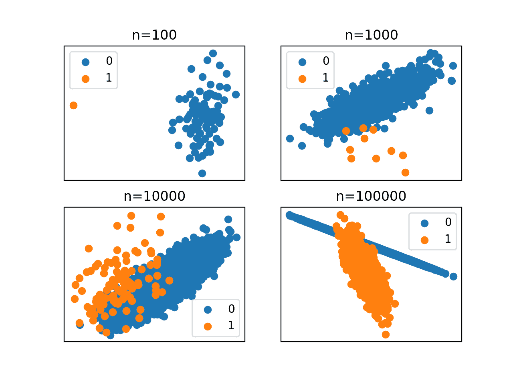
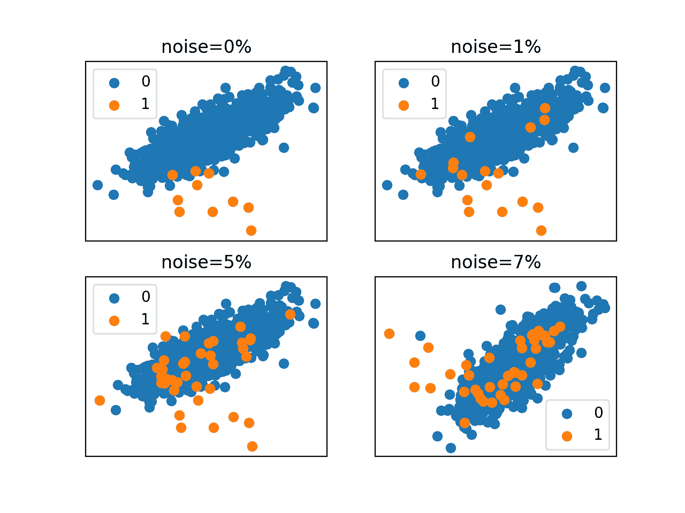
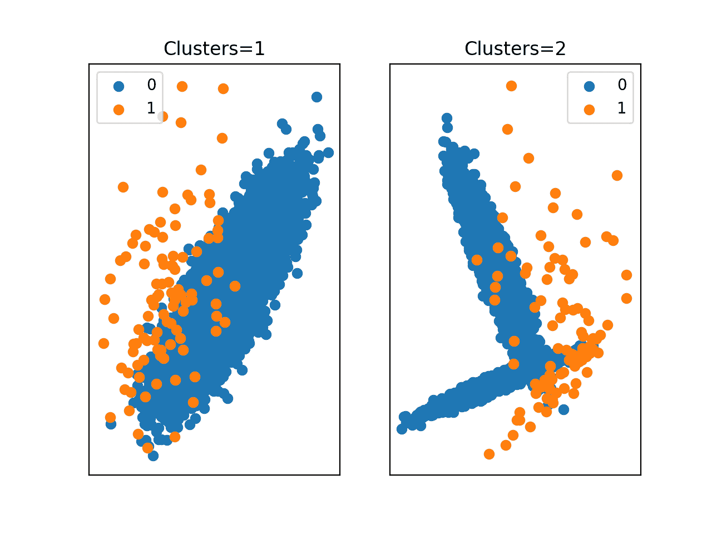

# 不平衡分类为什么难？

> 原文：<https://machinelearningmastery.com/imbalanced-classification-is-hard/>

不平衡分类作为一项预测性建模任务，主要是具有挑战性的，因为类别分布严重倾斜。

这是传统机器学习模型和评估指标表现不佳的原因，这些模型和指标假设了均衡的类分布。

然而，类别数据集还有一些附加的属性，这些属性不仅对预测建模具有挑战性，而且在建模不平衡数据集时会增加或加重难度。

在本教程中，您将发现加剧不平衡分类挑战的数据特征。

完成本教程后，您将知道:

*   不平衡的分类是特别困难的，因为严重倾斜的类分布和不平等的错误分类成本。
*   数据集大小、标签噪声和数据分布等属性加剧了不平衡分类的难度。
*   如何对不同数据集属性对建模难度的复合影响形成直觉？

**用我的新书[Python 不平衡分类](https://machinelearningmastery.com/imbalanced-classification-with-python/)启动你的项目**，包括*分步教程*和所有示例的 *Python 源代码*文件。

我们开始吧。


使不平衡分类变得困难的问题特征
乔舒亚·达马西奥摄，保留部分权利。

## 教程概述

本教程分为四个部分；它们是:

1.  不平衡分类为什么难
2.  数据集大小的复合效应
3.  标签噪声的复合效应
4.  数据分布的复合效应

## 不平衡分类为什么难

不平衡分类是由具有倾斜类分布的数据集定义的。

这通常以二进制(两类)分类任务为例，其中大多数示例属于 0 类，只有少数示例属于 1 类。分布的严重程度可能从 1:2、1:10、1:100 甚至 1:1000 不等。

由于类分布不均衡，大多数机器学习算法将表现不佳，需要修改以避免在所有情况下简单地预测多数类。此外，像分类这样的度量失去了意义，需要评估不平衡例子预测的替代方法，如[曲线下的 ROC 面积](https://machinelearningmastery.com/roc-curves-and-precision-recall-curves-for-classification-in-python/)。

这是不平衡分类的基本挑战。

*   倾斜的阶级分布

一个额外的复杂性来自于问题域，这些例子就是从这个问题域中抽取出来的。

多数类通常代表域中的正常情况，而少数类代表异常情况，如故障、欺诈、异常、异常、疾病状态等。因此，对错误分类错误的解释可能因类而异。

例如，将多数类的例子误分类为少数类的例子称为假阳性通常是不希望的，但不如将少数类的例子分类为属于多数类，即所谓的假阴性那么重要。

这被称为错误分类错误的成本敏感性，并且是不平衡分类的第二个基本挑战。

*   错误分类错误的不等成本

这两个方面，偏斜的类分布和成本敏感性，在描述不平衡分类的困难时被典型地引用。

然而，分类问题还有其他特征，当与这些属性结合时，它们的效果会更好。这些是分类预测建模的一般特征，放大了不平衡分类任务的难度。

> 阶级不平衡被广泛认为是分类的一个复杂因素。然而，一些研究还认为，不平衡比率不是从不平衡数据中学习时表现下降的唯一原因。

—第 253 页，[从不平衡数据集](https://amzn.to/307Xlva)中学习，2018。

这样的特征有很多，但最常见的可能有三个:

*   数据集大小。
*   标签噪音。
*   数据分发。

重要的是，不仅要承认这些属性，而且要对它们的影响形成一种直觉。这将允许您在自己的预测建模项目中选择和开发解决这些问题的技术。

> 了解这些数据的内在特征，以及它们与类别不平衡的关系，对于应用现有技术和开发新技术来处理不平衡数据至关重要。

—第 253-254 页，[从不平衡数据集](https://amzn.to/307Xlva)中学习，2018。

在接下来的部分中，我们将仔细研究这些属性及其对不平衡分类的影响。

## 数据集大小的复合效应

数据集大小只是指从域中收集的适合和评估预测模型的示例数量。

通常情况下，数据越多越好，因为它提供了更多的领域覆盖，也许会达到收益递减的程度。

具体来说，更多的数据提供了特征空间中特征的组合和变化以及它们到类标签的映射的更好的表示。由此，模型可以更好地学习和概括一个类边界，以辨别未来的新例子。

如果多数类和少数类中的示例的比例是固定的，那么随着数据集规模的扩大，少数类中会有更多的示例。

如果我们能收集更多的例子，这很好。

这是一个典型的问题，因为数据很难收集或收集成本很高，而且我们收集和处理的数据通常比我们可能喜欢的要少得多。因此，这可能会极大地影响我们从少数群体中获得足够大或有代表性的样本的能力。

> 分类中经常出现的一个问题是训练实例数量少。这一问题通常被报告为数据稀少或缺乏数据，与“缺乏密度”或“信息不足”有关。

—第 261 页，[从不平衡数据集](https://amzn.to/307Xlva)中学习，2018。

例如，对于具有平衡的类分布的适度分类任务，我们可能会满足于成千上万个例子，以便开发、评估和选择模型。

一个有 10，000 个例子的平衡二进制分类，每个类有 5，000 个例子。具有 1:100 分布且示例数相同的不平衡数据集只有 100 个少数民族示例。

因此，数据集的大小极大地影响了不平衡分类任务，并且当处理不平衡分类问题时，通常被认为大的数据集实际上可能不够大。

> 如果没有足够大的训练集，分类器可能无法概括数据的特征。此外，该分类器还可能过度训练训练数据，在样本外测试实例中表现不佳。

—第 261 页，[从不平衡数据集](https://amzn.to/307Xlva)中学习，2018。

为了有所帮助，让我们用一个工作实例来具体说明这一点。

我们可以使用[make _ classification()sci kit-learn 函数](https://Sklearn.org/stable/modules/generated/sklearn.datasets.make_classification.html)创建一个给定大小的数据集，少数类与多数类的示例比例约为 1:100(1%到 99%)。

```py
...
# create the dataset
X, y = make_classification(n_samples=1000, n_features=2, n_redundant=0,
	n_clusters_per_class=1, weights=[0.99], flip_y=0, random_state=1)
```

然后，我们可以创建数据集的散点图，并用分隔色为每个类的点着色，以了解示例的空间关系。

```py
...
# scatter plot of examples by class label
for label, _ in counter.items():
	row_ix = where(y == label)[0]
	pyplot.scatter(X[row_ix, 0], X[row_ix, 1], label=str(label))
pyplot.legend()
```

然后可以用不同的数据集大小重复这个过程，以直观地显示类不平衡是如何受到影响的。我们将使用 100、1，000、10，000 和 100，000 个示例来比较数据集。

下面列出了完整的示例。

```py
# vary the dataset size for a 1:100 imbalanced dataset
from collections import Counter
from sklearn.datasets import make_classification
from matplotlib import pyplot
from numpy import where
# dataset sizes
sizes = [100, 1000, 10000, 100000]
# create and plot a dataset with each size
for i in range(len(sizes)):
	# determine the dataset size
	n = sizes[i]
	# create the dataset
	X, y = make_classification(n_samples=n, n_features=2, n_redundant=0,
		n_clusters_per_class=1, weights=[0.99], flip_y=0, random_state=1)
	# summarize class distribution
	counter = Counter(y)
	print('Size=%d, Ratio=%s' % (n, counter))
	# define subplot
	pyplot.subplot(2, 2, 1+i)
	pyplot.title('n=%d' % n)
	pyplot.xticks([])
	pyplot.yticks([])
	# scatter plot of examples by class label
	for label, _ in counter.items():
		row_ix = where(y == label)[0]
		pyplot.scatter(X[row_ix, 0], X[row_ix, 1], label=str(label))
	pyplot.legend()
# show the figure
pyplot.show()
```

运行该示例使用四种不同的大小创建并绘制了具有 1:100 类分布的同一数据集。

首先，显示每个数据集大小的类分布。我们可以看到，在一个包含 100 个例子的小数据集中，我们只得到少数民族类中的一个例子，正如我们可能预期的那样。即使数据集中有 100，000 个例子，我们在少数民族类中也只能得到 1，000 个例子。

```py
Size=100, Ratio=Counter({0: 99, 1: 1})
Size=1000, Ratio=Counter({0: 990, 1: 10})
Size=10000, Ratio=Counter({0: 9900, 1: 100})
Size=100000, Ratio=Counter({0: 99000, 1: 1000})
```

为每个不同大小的数据集创建散点图。

我们可以看到，直到非常大的样本量，类分布的底层结构才变得明显。

这些图强调了数据集大小在不平衡分类中的关键作用。很难想象一个给定了 990 个多数阶级和 10 个少数阶级的例子的模型，在画出 100，000 个例子后，如何能在同样的问题上做得很好。



具有不同数据集大小的不平衡类别数据集的散点图

## 标签噪声的复合效应

标签噪声是指属于一个类的例子被分配给另一个类。

对于大多数机器学习算法来说，这可能使得在特征空间中确定类边界成为问题，并且这种困难通常与标签中噪声的百分比成比例地增加。

> 文献中区分了两种类型的噪声:特征噪声(或属性噪声)和类别噪声。在 ML 中，类噪声通常被认为比属性噪声更有害[…]类噪声以某种方式影响观察到的类值(例如，通过某种方式将少数类实例的标签翻转为多数类标签)。

—第 264 页，[从不平衡数据集](https://amzn.to/307Xlva)中学习，2018。

原因通常是问题域中固有的，例如类边界上不明确的观察，甚至数据收集中的错误，这些错误可能会影响特征空间中任何地方的观察。

对于不平衡的分类，有噪声的标签具有更显著的效果。

鉴于正类中的例子如此之少，由于噪声而丢失一些会减少关于副类的可用信息量。

此外，来自多数类的例子被错误地标记为属于少数类会导致少数类的分离或分裂，因为缺少观察，少数类已经是稀疏的。

我们可以想象，如果沿着类边界有模棱两可的例子，我们可以识别并删除或纠正它们。标记为少数类的示例位于大多数类的高密度特征空间区域，也很容易识别、移除或纠正。

在这种情况下，两个类别的观测值在特征空间中都是稀疏的，这个问题通常变得特别困难，特别是对于不平衡分类。正是在这种情况下，未修改的机器学习算法将定义有利于多数类而牺牲少数类的类边界。

> 错误标记的少数民族类别实例将有助于增加感知的不平衡比率，并在少数民族类别的类别区域内引入错误标记的噪声实例。另一方面，错误标记的多数类实例可能导致学习算法或不平衡的处理方法关注输入空间的错误区域。

—第 264 页，[从不平衡数据集](https://amzn.to/307Xlva)中学习，2018。

我们可以举一个例子来说明这个挑战。

我们可以保持数据集大小不变以及 1:100 的类比率，并改变标签噪声的数量。这可以通过将“ *flip_y* ”参数设置为 *make_classification()* 函数来实现，该函数是每个类中更改或翻转标签的示例数量的百分比。

我们将探索从 0%、1%、5%到 7%的变化。

下面列出了完整的示例。

```py
# vary the label noise for a 1:100 imbalanced dataset
from collections import Counter
from sklearn.datasets import make_classification
from matplotlib import pyplot
from numpy import where
# label noise ratios
noise = [0, 0.01, 0.05, 0.07]
# create and plot a dataset with different label noise
for i in range(len(noise)):
	# determine the label noise
	n = noise[i]
	# create the dataset
	X, y = make_classification(n_samples=1000, n_features=2, n_redundant=0,
		n_clusters_per_class=1, weights=[0.99], flip_y=n, random_state=1)
	# summarize class distribution
	counter = Counter(y)
	print('Noise=%d%%, Ratio=%s' % (int(n*100), counter))
	# define subplot
	pyplot.subplot(2, 2, 1+i)
	pyplot.title('noise=%d%%' % int(n*100))
	pyplot.xticks([])
	pyplot.yticks([])
	# scatter plot of examples by class label
	for label, _ in counter.items():
		row_ix = where(y == label)[0]
		pyplot.scatter(X[row_ix, 0], X[row_ix, 1], label=str(label))
	pyplot.legend()
# show the figure
pyplot.show()
```

运行该示例使用四种不同数量的标签噪声创建并绘制了具有 1:100 类分布的同一数据集。

首先，为具有不同标签噪声量的每个数据集打印类别分布。我们可以看到，正如我们可能预期的那样，随着噪音的增加，少数族裔中的例子数量也在增加，其中大多数都被错误地标记了。

我们可能会认为，少数类中这 30 个标签噪声为 7%的额外示例会对试图在特征空间中定义清晰类边界的模型造成相当大的损害。

```py
Noise=0%, Ratio=Counter({0: 990, 1: 10})
Noise=1%, Ratio=Counter({0: 983, 1: 17})
Noise=5%, Ratio=Counter({0: 963, 1: 37})
Noise=7%, Ratio=Counter({0: 959, 1: 41})
```

为具有不同标签噪声的每个数据集创建散点图。

在这个具体的案例中，我们没有看到很多关于类边界混淆的例子。相反，我们可以看到，随着标签噪声的增加，少数类质量中的示例数量(蓝色区域中的橙色点)增加，这表示在建模之前确实应该识别并从数据集中移除的误报。



具有不同标签噪声的不平衡类别数据集的散点图

## 数据分布的复合效应

另一个重要的考虑是特征空间中示例的分布。

如果我们在空间上考虑特征空间，我们可能希望一个类中的所有示例位于空间的一部分，而另一个类中的示例出现在空间的另一部分。

如果是这样的话，我们有很好的类可分性，机器学习模型可以画出清晰的类边界，达到很好的分类表现。这适用于类分布平衡或不平衡的数据集。

很少出现这种情况，更有可能的是，每个类都有多个“*概念*”，从而在特征空间中产生多个不同的示例组或集群。

> ……一个类下面的“概念”被分成几个子概念，分布在输入空间中，这是很常见的。

—第 255 页，[从不平衡数据集](https://amzn.to/307Xlva)中学习，2018。

这些组在形式上被称为“*析取值*”，来自基于规则的系统中的一个定义，该规则涵盖了由子概念组成的一组情况。小析取是指在训练数据集中涉及或“*覆盖*”几个例子的析取。

> 从例子中学习的系统通常不能成功地为每个概念创建一个纯粹的联合定义。相反，他们创建了一个由几个析取项组成的定义，其中每个析取项都是原始概念的子概念的合取定义。

——[概念学习与小析取问题](https://dl.acm.org/citation.cfm?id=1623884)，1989。

这种分组使得类的可分性变得困难，需要隐式或显式地识别每个组或簇并将其包含在类边界的定义中。

在不平衡数据集的情况下，如果少数类在特征空间中有多个概念或聚类，这是一个特殊的问题。这是因为这个类中的例子密度已经很少了，而且很难用这么少的例子来区分不同的分组。它可能看起来像一个大的稀疏分组。

> 这种同质性的缺乏在基于分治策略的算法中尤其成问题，在这种算法中，子概念导致小析取的产生。

—第 255 页，[从不平衡数据集](https://amzn.to/307Xlva)中学习，2018。

例如，我们可以考虑描述患者是健康的(多数类)还是患病的(少数类)的数据。这些数据可能捕捉到许多不同类型的疾病，也可能有类似疾病的分组，但如果病例如此之少，那么类中的任何分组或概念可能都不明显，可能看起来像是与健康病例混合的扩散集合。

为了使这个具体化，我们可以看一个例子。

我们可以使用数据集中的聚类数作为“*概念*”的代理，并将每个类有一个示例聚类的数据集与每个类有两个聚类的第二个数据集进行比较。

这可以通过改变用于创建数据集的 *make_classification()* 函数的“*n _ clusters _ per _ class”*参数来实现。

我们预计，在不平衡的数据集中，例如 1:100 的类分布，集群数量的增加对多数类来说是显而易见的，但对少数类来说并非如此。

下面列出了完整的示例。

```py
# vary the number of clusters for a 1:100 imbalanced dataset
from collections import Counter
from sklearn.datasets import make_classification
from matplotlib import pyplot
from numpy import where
# number of clusters
clusters = [1, 2]
# create and plot a dataset with different numbers of clusters
for i in range(len(clusters)):
	c = clusters[i]
	# define dataset
	X, y = make_classification(n_samples=10000, n_features=2, n_redundant=0,
		n_clusters_per_class=c, weights=[0.99], flip_y=0, random_state=1)
	counter = Counter(y)
	# define subplot
	pyplot.subplot(1, 2, 1+i)
	pyplot.title('Clusters=%d' % c)
	pyplot.xticks([])
	pyplot.yticks([])
	# scatter plot of examples by class label
	for label, _ in counter.items():
		row_ix = where(y == label)[0]
		pyplot.scatter(X[row_ix, 0], X[row_ix, 1], label=str(label))
	pyplot.legend()
# show the figure
pyplot.show()
```

运行该示例使用两个不同数量的聚类创建并绘制了具有 1:100 类分布的同一数据集。

在第一个散点图(左)中，我们可以看到每个类有一个聚类。多数阶级(蓝色)显然有一个集群，而少数阶级(橙色)的结构不太明显。在第二个图(右)中，我们可以再次清楚地看到多数类有两个聚类，少数类(橙色)的结构也是扩散的，并且不明显样本是从两个聚类中提取的。

这突出了数据集的大小与其揭示少数类中示例的底层密度或分布的能力之间的关系。由于例子如此之少，机器学习模型的泛化即使不是很成问题，也是具有挑战性的。



具有不同聚类数的不平衡类别数据集的散点图

## 进一步阅读

如果您想更深入地了解这个主题，本节将提供更多资源。

### 报纸

*   [概念学习与小析取问题](https://dl.acm.org/citation.cfm?id=1623884)，1989。

### 书

*   [从不平衡数据集中学习](https://amzn.to/307Xlva)，2018。
*   [不平衡学习:基础、算法和应用](https://amzn.to/32K9K6d)，2013。

### 蜜蜂

*   [sklearn . datasets . make _ classification API](https://Sklearn.org/stable/modules/generated/sklearn.datasets.make_classification.html)。

## 摘要

在本教程中，您发现了加剧不平衡分类挑战的数据特征。

具体来说，您了解到:

*   不平衡的分类是特别困难的，因为严重倾斜的类分布和不平等的错误分类成本。
*   数据集大小、标签噪声和数据分布等属性加剧了不平衡分类的难度。
*   如何对不同数据集属性对建模难度的复合影响形成直觉？

你有什么问题吗？
在下面的评论中提问，我会尽力回答。