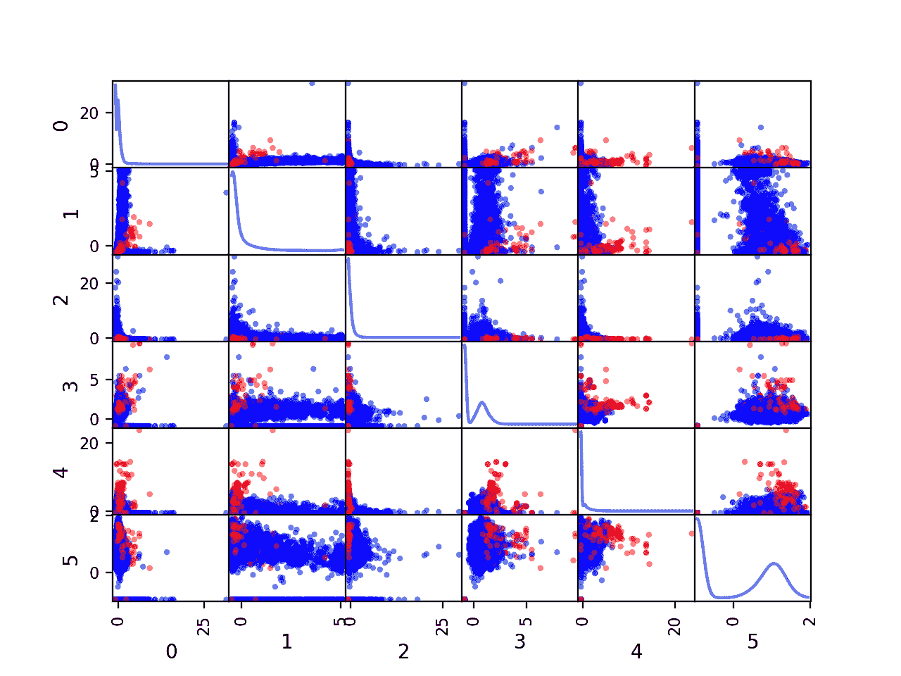
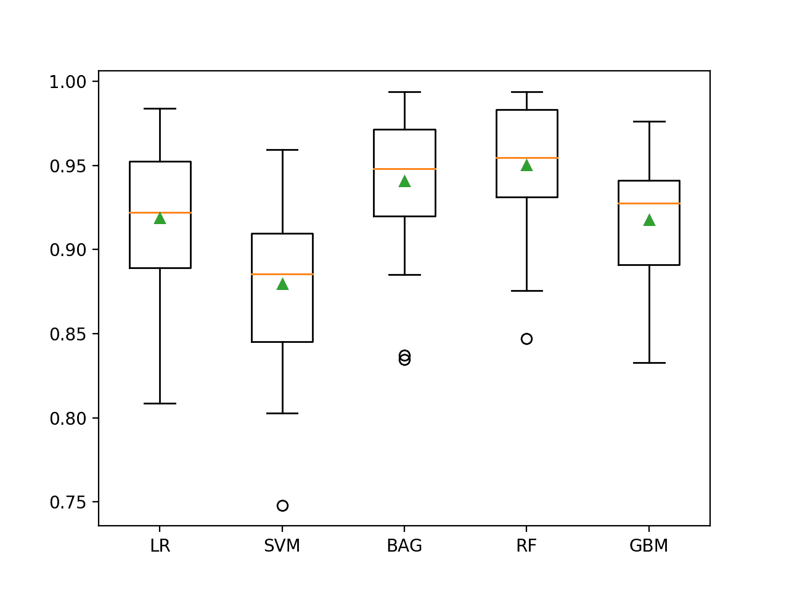
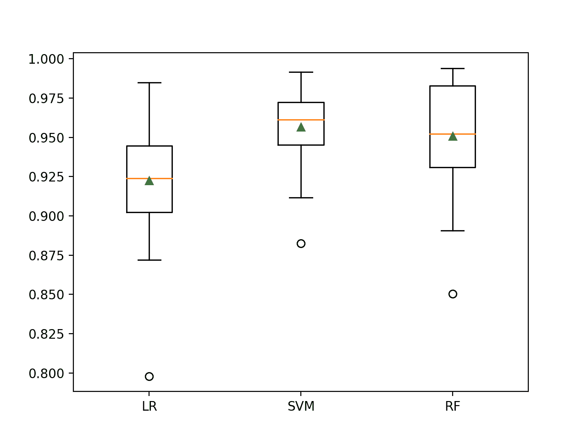

# 检测乳腺摄影微钙化的不平衡分类模型

> 原文：<https://machinelearningmastery.com/imbalanced-classification-model-to-detect-microcalcifications/>

最后更新于 2020 年 8 月 21 日

癌症检测是不平衡分类问题的一个常见例子，因为非癌症病例通常比实际癌症病例多得多。

一个标准的不平衡类别数据集是乳房 x 线摄影数据集，它涉及从放射扫描中检测乳腺癌，特别是在乳房 x 线摄影中出现明亮的微钙化簇。这个数据集是通过扫描图像，将它们分割成候选对象，并使用计算机视觉技术来描述每个候选对象来构建的。

由于严重的类别不平衡，它是不平衡分类的一个流行数据集，具体来说，98%的候选微钙化点不是癌症，只有 2%被有经验的放射技师标记为癌症。

在本教程中，您将发现如何开发和评估不平衡乳腺摄影癌症类别数据集的模型。

完成本教程后，您将知道:

*   如何加载和探索数据集，并为数据准备和模型选择产生想法。
*   如何评估一套机器学习模型，并利用数据成本敏感技术提高其表现。
*   如何拟合最终模型并使用它来预测特定情况下的类标签。

**用我的新书[Python 不平衡分类](https://machinelearningmastery.com/imbalanced-classification-with-python/)启动你的项目**，包括*分步教程*和所有示例的 *Python 源代码*文件。

我们开始吧。


开发一个不平衡的分类模型来检测微钙化
照片由[伯纳德·斯拉格。新西兰](https://flickr.com/photos/volvob12b/44164103752/)，保留部分权利。

## 教程概述

本教程分为五个部分；它们是:

1.  乳腺摄影数据集
2.  浏览数据集
3.  模型测试和基线结果
4.  评估模型
    1.  评估机器学习算法
    2.  评估成本敏感算法
5.  对新数据进行预测

## 乳腺摄影数据集

在这个项目中，我们将使用一个标准的不平衡机器学习数据集，称为“*乳腺摄影*”数据集，有时也称为“*伍兹乳腺摄影*”

该数据集归功于 Kevin Woods 等人和 1993 年发表的题为“乳腺摄影中检测微钙化的模式识别技术的比较评估”的论文

问题的焦点是从放射扫描中检测乳腺癌，特别是在乳房 x 光片上看起来明亮的微钙化簇的存在。

所涉及的数据集首先从扫描的 24 张已知癌症诊断的乳房 x 光照片开始。然后使用图像分割计算机视觉算法对图像进行预处理，以从乳房 x 光照片图像中提取候选对象。一旦被分割，这些对象就被有经验的放射科医生手工标记。

从被认为与模式识别最相关的分割对象中提取了总共 29 个特征，将其减少到 18 个，然后最终减少到 7 个，如下所示(直接取自论文):

*   对象面积(以像素为单位)。
*   对象的平均灰度。
*   对象周边像素的梯度强度。
*   对象中的均方根噪声波动。
*   对比度，对象的平均灰度减去对象周围两像素宽边框的平均值。
*   基于形状描述符的低阶矩。

有两类，目标是使用给定分割对象的特征来区分微钙化和非微钙化。

*   **非微钙化**:阴性，或多数类。
*   **微钙化**:阳性病例，或少数民族。

在最初的论文中对许多模型进行了评估和比较，例如神经网络、决策树和 k 近邻。使用 [ROC 曲线](https://machinelearningmastery.com/roc-curves-and-precision-recall-curves-for-classification-in-python/)对模型进行评估，并使用 ROC 曲线下的面积(简称 ROC AUC)进行比较。

选择 ROC 曲线和 ROC 曲线下面积的目的是最小化假阳性率(特异性的补充)和最大化真阳性率(灵敏度)，ROC 曲线的两个轴。ROC 曲线的使用也暗示了对概率模型的期望，操作员可以从该概率模型中选择概率阈值作为可接受的假阳性率和真阳性率之间的界限。

他们的结果表明“*线性分类器*”(看似是[高斯朴素贝叶斯分类器](https://machinelearningmastery.com/classification-as-conditional-probability-and-the-naive-bayes-algorithm/))表现最好，在 100 次运行中平均 ROC AUC 为 0.936。

接下来，让我们仔细看看数据。

## 浏览数据集

乳腺摄影数据集是一个广泛使用的标准机器学习数据集，用于探索和演示许多专门为不平衡分类设计的技术。

一个例子是流行的 [SMOTE 数据过采样技术](https://arxiv.org/abs/1106.1813)。

该数据集的一个版本与原始论文中描述的数据集有一些不同。

首先，下载数据集并将其保存在您当前的工作目录中，名称为“*乳房 x 线摄影. csv*

*   [下载乳腺摄影数据集(乳腺摄影. csv)](https://raw.githubusercontent.com/jbrownlee/Datasets/master/mammography.csv)

查看文件的内容。

文件的前几行应该如下所示:

```py
0.23001961,5.0725783,-0.27606055,0.83244412,-0.37786573,0.4803223,'-1'
0.15549112,-0.16939038,0.67065219,-0.85955255,-0.37786573,-0.94572324,'-1'
-0.78441482,-0.44365372,5.6747053,-0.85955255,-0.37786573,-0.94572324,'-1'
0.54608818,0.13141457,-0.45638679,-0.85955255,-0.37786573,-0.94572324,'-1'
-0.10298725,-0.3949941,-0.14081588,0.97970269,-0.37786573,1.0135658,'-1'
...
```

我们可以看到数据集有六个而不是七个输入变量。论文中列出的第一个输入变量(以像素为单位的区域)可能已从该版本的数据集中删除。

输入变量是数值型的(实值)，目标变量是多数类的“-1”和少数类的“1”字符串。这些值需要分别编码为 0 和 1，以满足分类算法对二进制不平衡分类问题的期望。

可以使用 [read_csv()熊猫函数](https://pandas.pydata.org/pandas-docs/stable/reference/api/pandas.read_csv.html)将数据集加载为数据帧，指定位置和没有标题行的事实。

```py
...
# define the dataset location
filename = 'mammography.csv'
# load the csv file as a data frame
dataframe = read_csv(filename, header=None)
```

加载后，我们可以通过打印[数据框](https://pandas.pydata.org/pandas-docs/stable/reference/api/pandas.DataFrame.html)的形状来总结行数和列数。

```py
...
# summarize the shape of the dataset
print(dataframe.shape)
```

我们还可以使用 [Counter](https://docs.python.org/3/library/collections.html#collections.Counter) 对象总结每个类中的示例数量。

```py
...
# summarize the class distribution
target = dataframe.values[:,-1]
counter = Counter(target)
for k,v in counter.items():
	per = v / len(target) * 100
	print('Class=%s, Count=%d, Percentage=%.3f%%' % (k, v, per))
```

将这些联系在一起，下面列出了加载和汇总数据集的完整示例。

```py
# load and summarize the dataset
from pandas import read_csv
from collections import Counter
# define the dataset location
filename = 'mammography.csv'
# load the csv file as a data frame
dataframe = read_csv(filename, header=None)
# summarize the shape of the dataset
print(dataframe.shape)
# summarize the class distribution
target = dataframe.values[:,-1]
counter = Counter(target)
for k,v in counter.items():
	per = v / len(target) * 100
	print('Class=%s, Count=%d, Percentage=%.3f%%' % (k, v, per))
```

运行该示例首先加载数据集，并确认行数和列数，即 11，183 行，6 个输入变量和 1 个目标变量。

然后总结阶级分布，确认严重的阶级不平衡，多数阶级(无癌症)大约 98%，少数阶级(癌症)大约 2%。

```py
(11183, 7)
Class='-1', Count=10923, Percentage=97.675%
Class='1', Count=260, Percentage=2.325%
```

数据集似乎与 SMOTE 论文中描述的数据集基本匹配。具体来说就是反面与正面的例子之比。

> 典型的乳腺摄影数据集可能包含 98%的正常像素和 2%的异常像素。

——[SMOTE:合成少数过采样技术](https://arxiv.org/abs/1106.1813)，2002 年。

此外，少数族裔和多数族裔的具体例子数量也与论文相符。

> 实验是在乳腺摄影数据集上进行的。本来多数班有 10923 例，少数班有 260 例。

——[SMOTE:合成少数过采样技术](https://arxiv.org/abs/1106.1813)，2002 年。

我相信这是同一个数据集，尽管我无法解释输入特征数量的不匹配，例如，六个与原始论文中的七个相比。

我们还可以通过为六个数字输入变量创建直方图来查看它们的分布。

下面列出了完整的示例。

```py
# create histograms of numeric input variables
from pandas import read_csv
from matplotlib import pyplot
# define the dataset location
filename = 'mammography.csv'
# load the csv file as a data frame
df = read_csv(filename, header=None)
# histograms of all variables
df.hist()
pyplot.show()
```

运行该示例会为数据集中的六个数字输入变量创建带有一个直方图子图的图形。

我们可以看到，变量有不同的尺度，大多数变量呈指数分布，例如，大多数情况下落入一个仓，其余的落入一个长尾。最后一个变量似乎呈双峰分布。

根据建模算法的选择，我们期望将分布缩放到相同的范围是有用的，并且可能使用一些幂变换。


乳腺摄影数据集数值输入变量的直方图

我们还可以为每对输入变量创建散点图，称为散点图矩阵。

这有助于查看是否有任何变量相互关联或朝同一方向变化，例如相互关联。

我们还可以根据类别标签为每个散点图的点着色。在这种情况下，多数类(无癌症)将被映射到蓝点，少数类(癌症)将被映射到红点。

下面列出了完整的示例。

```py
# create pairwise scatter plots of numeric input variables
from pandas import read_csv
from pandas.plotting import scatter_matrix
from matplotlib import pyplot
# define the dataset location
filename = 'mammography.csv'
# load the csv file as a data frame
df = read_csv(filename, header=None)
# define a mapping of class values to colors
color_dict = {"'-1'":'blue', "'1'":'red'}
# map each row to a color based on the class value
colors = [color_dict[str(x)] for x in df.values[:, -1]]
# pairwise scatter plots of all numerical variables
scatter_matrix(df, diagonal='kde', color=colors)
pyplot.show()
```

运行该示例会创建一个显示散点图矩阵的图形，六个图乘以六个图，将六个数字输入变量相互比较。矩阵的对角线显示了每个变量的密度分布。

每对在从左上方到右下方的对角线的上方和下方出现两次，提供了两种方式来查看相同的变量交互。

我们可以看到，对于两类标签，许多变量的分布确实不同，这表明在癌症和无癌症病例之间进行一些合理的区分是可行的。



乳腺摄影数据集中数值输入变量的分类散点图矩阵

现在我们已经回顾了数据集，让我们看看开发一个测试工具来评估候选模型。

## 模型测试和基线结果

我们将使用重复的分层 k 折叠交叉验证来评估候选模型。

[k 倍交叉验证程序](https://machinelearningmastery.com/k-fold-cross-validation/)提供了一个良好的模型表现的总体估计，至少与单个列车测试分割相比，不太乐观。我们将使用 k=10，这意味着每个折叠将包含大约 11183/10 或大约 1，118 个示例。

分层意味着每个文件夹将包含相同的混合类实例，即大约 98%到 2%的无癌到癌对象。重复表示评估过程将执行多次，以帮助避免侥幸结果，并更好地捕捉所选模型的方差。我们将使用三次重复。

这意味着单个模型将被拟合和评估 10 * 3 或 30 次，并且这些运行的平均值和标准偏差将被报告。

这可以通过使用[repeated stratifiedfold Sklearn 类](https://Sklearn.org/stable/modules/generated/sklearn.model_selection.RepeatedStratifiedKFold.html)来实现。

我们将使用 ROC 曲线下的面积或通过 [roc_auc_score()函数](https://Sklearn.org/stable/modules/generated/sklearn.metrics.roc_auc_score.html)计算的 ROC AUC 来评估和比较模型。

我们可以定义一个函数来加载数据集，并将列分成输入和输出变量。我们将正确地将类标签编码为 0 和 1。下面的 *load_dataset()* 函数实现了这一点。

```py
# load the dataset
def load_dataset(full_path):
	# load the dataset as a numpy array
	data = read_csv(full_path, header=None)
	# retrieve numpy array
	data = data.values
	# split into input and output elements
	X, y = data[:, :-1], data[:, -1]
	# label encode the target variable to have the classes 0 and 1
	y = LabelEncoder().fit_transform(y)
	return X, y
```

然后，我们可以定义一个函数来评估数据集上的给定模型，并返回每次折叠和重复的 ROC AUC 分数列表。

下面的 *evaluate_model()* 函数实现了这一点，将数据集和模型作为参数，返回分数列表。

```py
# evaluate a model
def evaluate_model(X, y, model):
	# define evaluation procedure
	cv = RepeatedStratifiedKFold(n_splits=10, n_repeats=3, random_state=1)
	# evaluate model
	scores = cross_val_score(model, X, y, scoring='roc_auc', cv=cv, n_jobs=-1)
	return scores
```

最后，我们可以使用这个测试工具在数据集上评估一个基线模型。

一个预测随机类与每个类的基本比率成比例的模型将导致 0.5 的 ROC AUC，这是该数据集上表现的基线。这是一个所谓的“无技能”分类器。

这可以通过使用 Sklearn 库中的 [DummyClassifier](https://Sklearn.org/stable/modules/generated/sklearn.dummy.DummyClassifier.html) 类并将“*策略*”参数设置为“*分层*”来实现。

```py
...
# define the reference model
model = DummyClassifier(strategy='stratified')
```

一旦模型被评估，我们可以直接报告 ROC AUC 评分的平均值和标准差。

```py
...
# evaluate the model
scores = evaluate_model(X, y, model)
# summarize performance
print('Mean ROC AUC: %.3f (%.3f)' % (mean(scores), std(scores)))
```

将这些结合起来，下面列出了加载数据集、评估基线模型和报告表现的完整示例。

```py
# test harness and baseline model evaluation
from collections import Counter
from numpy import mean
from numpy import std
from pandas import read_csv
from sklearn.preprocessing import LabelEncoder
from sklearn.model_selection import cross_val_score
from sklearn.model_selection import RepeatedStratifiedKFold
from sklearn.dummy import DummyClassifier

# load the dataset
def load_dataset(full_path):
	# load the dataset as a numpy array
	data = read_csv(full_path, header=None)
	# retrieve numpy array
	data = data.values
	# split into input and output elements
	X, y = data[:, :-1], data[:, -1]
	# label encode the target variable to have the classes 0 and 1
	y = LabelEncoder().fit_transform(y)
	return X, y

# evaluate a model
def evaluate_model(X, y, model):
	# define evaluation procedure
	cv = RepeatedStratifiedKFold(n_splits=10, n_repeats=3, random_state=1)
	# evaluate model
	scores = cross_val_score(model, X, y, scoring='roc_auc', cv=cv, n_jobs=-1)
	return scores

# define the location of the dataset
full_path = 'mammography.csv'
# load the dataset
X, y = load_dataset(full_path)
# summarize the loaded dataset
print(X.shape, y.shape, Counter(y))
# define the reference model
model = DummyClassifier(strategy='stratified')
# evaluate the model
scores = evaluate_model(X, y, model)
# summarize performance
print('Mean ROC AUC: %.3f (%.3f)' % (mean(scores), std(scores)))
```

运行该示例首先加载和汇总数据集。

我们可以看到我们加载了正确的行数，并且我们有六个计算机视觉导出的输入变量。重要的是，我们可以看到类标签正确映射到整数，多数类为 0，少数类为 1，这是不平衡二进制类别数据集的惯例。

接下来，报告 ROC AUC 分数的平均值。

不出所料，无技能分类器实现了平均 ROC AUC 约为 0.5 的最坏情况表现。这提供了一个表现基线，在这个基线之上，模型在这个数据集上可以被认为是熟练的。

```py
(11183, 6) (11183,) Counter({0: 10923, 1: 260})
Mean ROC AUC: 0.503 (0.016)
```

现在我们已经有了测试工具和表现基线，我们可以开始在这个数据集上评估一些模型了。

## 评估模型

在本节中，我们将使用上一节中开发的测试工具来评估数据集上的一套不同技术。

目标是既演示如何系统地解决问题，又演示为不平衡分类问题设计的一些技术的能力。

报告的表现良好，但没有高度优化(例如，超参数没有调整)。

**你能做得更好吗？**如果你能用同样的测试装具达到更好的 ROC AUC 表现，我很想听听。请在下面的评论中告诉我。

### 评估机器学习算法

让我们从评估数据集上的混合机器学习模型开始。

在数据集上抽查一套不同的线性和非线性算法可能是一个好主意，以便快速找出哪些算法运行良好，值得进一步关注，哪些算法运行不佳。

我们将在乳腺摄影数据集上评估以下机器学习模型:

*   逻辑回归
*   支持向量机(SVM)
*   袋装决策树
*   随机森林
*   梯度增压机

我们将主要使用默认的模型超参数，除了集成算法中的树的数量，我们将设置为合理的默认值 1000。

我们将依次定义每个模型，并将它们添加到一个列表中，以便我们可以顺序评估它们。下面的 *get_models()* 函数定义了用于评估的模型列表，以及用于以后绘制结果的模型简称列表。

```py
# define models to test
def get_models():
	models, names = list(), list()
	# LR
	models.append(LogisticRegression(solver='lbfgs'))
	names.append('LR')
	# SVM
	models.append(SVC(gamma='scale'))
	names.append('SVM')
	# Bagging
	models.append(BaggingClassifier(n_estimators=1000))
	names.append('BAG')
	# RF
	models.append(RandomForestClassifier(n_estimators=1000))
	names.append('RF')
	# GBM
	models.append(GradientBoostingClassifier(n_estimators=1000))
	names.append('GBM')
	return models, names
```

然后，我们可以依次列举模型列表，并对每个模型进行评估，报告平均 ROC AUC，并存储分数以供以后绘制。

```py
...
# define models
models, names = get_models()
results = list()
# evaluate each model
for i in range(len(models)):
	# evaluate the model and store results
	scores = evaluate_model(X, y, models[i])
	results.append(scores)
	# summarize and store
	print('>%s %.3f (%.3f)' % (names[i], mean(scores), std(scores)))
```

在运行结束时，我们可以将每个分数样本绘制成一个方框，并用相同的比例绘制晶须图，这样我们就可以直接比较分布。

```py
...
# plot the results
pyplot.boxplot(results, labels=names, showmeans=True)
pyplot.show()
```

将所有这些结合起来，下面列出了在乳腺摄影数据集上评估一套机器学习算法的完整示例。

```py
# spot check machine learning algorithms on the mammography dataset
from numpy import mean
from numpy import std
from pandas import read_csv
from matplotlib import pyplot
from sklearn.preprocessing import LabelEncoder
from sklearn.model_selection import cross_val_score
from sklearn.model_selection import RepeatedStratifiedKFold
from sklearn.linear_model import LogisticRegression
from sklearn.svm import SVC
from sklearn.ensemble import RandomForestClassifier
from sklearn.ensemble import GradientBoostingClassifier
from sklearn.ensemble import BaggingClassifier

# load the dataset
def load_dataset(full_path):
	# load the dataset as a numpy array
	data = read_csv(full_path, header=None)
	# retrieve numpy array
	data = data.values
	# split into input and output elements
	X, y = data[:, :-1], data[:, -1]
	# label encode the target variable to have the classes 0 and 1
	y = LabelEncoder().fit_transform(y)
	return X, y

# evaluate a model
def evaluate_model(X, y, model):
	# define evaluation procedure
	cv = RepeatedStratifiedKFold(n_splits=10, n_repeats=3, random_state=1)
	# evaluate model
	scores = cross_val_score(model, X, y, scoring='roc_auc', cv=cv, n_jobs=-1)
	return scores

# define models to test
def get_models():
	models, names = list(), list()
	# LR
	models.append(LogisticRegression(solver='lbfgs'))
	names.append('LR')
	# SVM
	models.append(SVC(gamma='scale'))
	names.append('SVM')
	# Bagging
	models.append(BaggingClassifier(n_estimators=1000))
	names.append('BAG')
	# RF
	models.append(RandomForestClassifier(n_estimators=1000))
	names.append('RF')
	# GBM
	models.append(GradientBoostingClassifier(n_estimators=1000))
	names.append('GBM')
	return models, names

# define the location of the dataset
full_path = 'mammography.csv'
# load the dataset
X, y = load_dataset(full_path)
# define models
models, names = get_models()
results = list()
# evaluate each model
for i in range(len(models)):
	# evaluate the model and store results
	scores = evaluate_model(X, y, models[i])
	results.append(scores)
	# summarize and store
	print('>%s %.3f (%.3f)' % (names[i], mean(scores), std(scores)))
# plot the results
pyplot.boxplot(results, labels=names, showmeans=True)
pyplot.show()
```

运行该示例依次评估每个算法，并报告平均值和标准差 ROC AUC。

**注**:考虑到算法或评估程序的随机性，或数值准确率的差异，您的[结果可能会有所不同](https://machinelearningmastery.com/different-results-each-time-in-machine-learning/)。考虑运行该示例几次，并比较平均结果。

在这种情况下，我们可以看到所有测试的算法都有技巧，实现了高于默认值 0.5 的 ROC AUC。

结果表明，决策树算法的集成在这个数据集上表现更好，也许随机森林表现最好，ROC AUC 约为 0.950。

有趣的是，尽管我们使用了不同的模型评估程序，但这比论文中描述的 ROC AUC 要好。

该评估对 LR 和 SVM 算法有点不公平，因为我们在拟合模型之前没有缩放输入变量。我们可以在下一节探讨这一点。

```py
>LR 0.919 (0.040)
>SVM 0.880 (0.049)
>BAG 0.941 (0.041)
>RF 0.950 (0.036)
>GBM 0.918 (0.037)
```

创建一个图形，显示每个算法结果样本的一个方框和须图。方框显示中间 50%的数据，每个方框中间的橙色线显示样本的中值，每个方框中的绿色三角形显示样本的平均值。

我们可以看到，BAG 和 RF 都有一个紧密的分布，平均值和中值紧密对齐，这可能表明分数的非偏斜和高斯分布，例如稳定。



不平衡乳腺摄影数据集上机器学习模型的盒须图

现在我们有了第一组好的结果，让我们看看是否可以用成本敏感的分类器来改进它们。

### 评估成本敏感算法

当拟合模型时，一些机器学习算法可以被调整以更加关注一个类而不是另一个类。

这些被称为成本敏感的机器学习模型，它们可以通过指定与类分布成反比的成本来用于不平衡分类。例如，对于多数类和少数类的 98%到 2%的分布，我们可以指定少数类的误差权重为 98，多数类的误差权重为 2。

提供这种功能的三种算法是:

*   逻辑回归
*   支持向量机(SVM)
*   随机森林

这可以在 Sklearn 中通过将“ *class_weight* ”参数设置为“ *balanced* ”来实现，以使这些算法对成本敏感。

例如，下面更新的 *get_models()* 函数定义了要在我们的数据集上评估的这三个算法的成本敏感版本。

```py
# define models to test
def get_models():
	models, names = list(), list()
	# LR
	models.append(LogisticRegression(solver='lbfgs', class_weight='balanced'))
	names.append('LR')
	# SVM
	models.append(SVC(gamma='scale', class_weight='balanced'))
	names.append('SVM')
	# RF
	models.append(RandomForestClassifier(n_estimators=1000))
	names.append('RF')
	return models, names
```

此外，当探索数据集时，我们注意到许多变量具有看似指数的数据分布。有时，我们可以通过对每个变量使用幂变换来更好地传播变量的数据。这将特别有助于 LR 和 SVM 算法，也可能有助于 RF 算法。

我们可以使用[管道](https://Sklearn.org/stable/modules/generated/sklearn.pipeline.Pipeline.html)在交叉验证模型评估过程的每个折叠中实现这一点。第一步将学习训练套摺上的[电力变压器](https://Sklearn.org/stable/modules/generated/sklearn.preprocessing.PowerTransformer.html)，并将其应用于训练和测试套摺。第二步将是我们正在评估的模型。然后可以使用我们的*评估 _ 模型()*函数直接评估管道，例如:

```py
...
# defines pipeline steps
steps = [('p', PowerTransformer()), ('m',models[i])]
# define pipeline
pipeline = Pipeline(steps=steps)
# evaluate the pipeline and store results
scores = evaluate_model(X, y, pipeline)
```

将这些结合起来，下面列出了在乳腺摄影数据集上评估功率转换的成本敏感型机器学习算法的完整示例。

```py
# cost-sensitive machine learning algorithms on the mammography dataset
from numpy import mean
from numpy import std
from pandas import read_csv
from matplotlib import pyplot
from sklearn.preprocessing import LabelEncoder
from sklearn.preprocessing import PowerTransformer
from sklearn.pipeline import Pipeline
from sklearn.model_selection import cross_val_score
from sklearn.model_selection import RepeatedStratifiedKFold
from sklearn.linear_model import LogisticRegression
from sklearn.svm import SVC
from sklearn.ensemble import RandomForestClassifier

# load the dataset
def load_dataset(full_path):
	# load the dataset as a numpy array
	data = read_csv(full_path, header=None)
	# retrieve numpy array
	data = data.values
	# split into input and output elements
	X, y = data[:, :-1], data[:, -1]
	# label encode the target variable to have the classes 0 and 1
	y = LabelEncoder().fit_transform(y)
	return X, y

# evaluate a model
def evaluate_model(X, y, model):
	# define evaluation procedure
	cv = RepeatedStratifiedKFold(n_splits=10, n_repeats=3, random_state=1)
	# evaluate model
	scores = cross_val_score(model, X, y, scoring='roc_auc', cv=cv, n_jobs=-1)
	return scores

# define models to test
def get_models():
	models, names = list(), list()
	# LR
	models.append(LogisticRegression(solver='lbfgs', class_weight='balanced'))
	names.append('LR')
	# SVM
	models.append(SVC(gamma='scale', class_weight='balanced'))
	names.append('SVM')
	# RF
	models.append(RandomForestClassifier(n_estimators=1000))
	names.append('RF')
	return models, names

# define the location of the dataset
full_path = 'mammography.csv'
# load the dataset
X, y = load_dataset(full_path)
# define models
models, names = get_models()
results = list()
# evaluate each model
for i in range(len(models)):
	# defines pipeline steps
	steps = [('p', PowerTransformer()), ('m',models[i])]
	# define pipeline
	pipeline = Pipeline(steps=steps)
	# evaluate the pipeline and store results
	scores = evaluate_model(X, y, pipeline)
	results.append(scores)
	# summarize and store
	print('>%s %.3f (%.3f)' % (names[i], mean(scores), std(scores)))
# plot the results
pyplot.boxplot(results, labels=names, showmeans=True)
pyplot.show()
```

运行该示例依次评估每个算法，并报告平均值和标准差 ROC AUC。

**注**:考虑到算法或评估程序的随机性，或数值准确率的差异，您的[结果可能会有所不同](https://machinelearningmastery.com/different-results-each-time-in-machine-learning/)。考虑运行该示例几次，并比较平均结果。

在这种情况下，我们可以看到，与它们的非转换和成本不敏感的版本相比，所有三种测试算法在 ROC AUC 上都有所提升。在没有转换的情况下重复实验，看看是转换还是算法的成本敏感版本，或者两者都导致了表现的提升，这将是很有趣的。

在这种情况下，我们可以看到 SVM 获得了最佳表现，在本节和上一节中表现优于射频，平均 ROC AUC 约为 0.957。

```py
>LR 0.922 (0.036)
>SVM 0.957 (0.024)
>RF 0.951 (0.035)
```

然后创建方框图和须图，比较 ROC 曲线的分布。

与其他两种模型相比，SVM 分布显得紧凑。因此，表现可能是稳定的，并可能成为最终模型的良好选择。



不平衡乳腺摄影数据集上成本敏感机器学习模型的盒须图

接下来，让我们看看如何使用最终模型对新数据进行预测。

## 对新数据进行预测

在本节中，我们将拟合最终模型，并使用它对单行数据进行预测

我们将使用 SVM 模型的成本敏感版本作为最终模型，并在拟合模型和进行预测之前对数据进行幂变换。使用管道将确保始终对输入数据正确执行转换。

首先，我们可以将模型定义为管道。

```py
...
# define model to evaluate
model = SVC(gamma='scale', class_weight='balanced')
# power transform then fit model
pipeline = Pipeline(steps=[('t',PowerTransformer()), ('m',model)])
```

一旦定义好了，我们就可以在整个训练数据集中使用它。

```py
...
# fit the model
pipeline.fit(X, y)
```

一旦适合，我们可以通过调用 *predict()* 函数来使用它对新数据进行预测。这将返回类别标签 0 表示“T2 无癌症”，或 1 表示“T4 癌症”。

例如:

```py
...
# define a row of data
row = [...]
# make prediction
yhat = model.predict([row])
```

为了证明这一点，我们可以使用拟合模型对一些病例的标签进行一些预测，在这些病例中，我们知道该病例是无癌症还是癌症。

下面列出了完整的示例。

```py
# fit a model and make predictions for the on the mammography dataset
from pandas import read_csv
from sklearn.preprocessing import LabelEncoder
from sklearn.preprocessing import PowerTransformer
from sklearn.svm import SVC
from sklearn.pipeline import Pipeline

# load the dataset
def load_dataset(full_path):
	# load the dataset as a numpy array
	data = read_csv(full_path, header=None)
	# retrieve numpy array
	data = data.values
	# split into input and output elements
	X, y = data[:, :-1], data[:, -1]
	# label encode the target variable to have the classes 0 and 1
	y = LabelEncoder().fit_transform(y)
	return X, y

# define the location of the dataset
full_path = 'mammography.csv'
# load the dataset
X, y = load_dataset(full_path)
# define model to evaluate
model = SVC(gamma='scale', class_weight='balanced')
# power transform then fit model
pipeline = Pipeline(steps=[('t',PowerTransformer()), ('m',model)])
# fit the model
pipeline.fit(X, y)
# evaluate on some no cancer cases (known class 0)
print('No Cancer:')
data = [[0.23001961,5.0725783,-0.27606055,0.83244412,-0.37786573,0.4803223],
	[0.15549112,-0.16939038,0.67065219,-0.85955255,-0.37786573,-0.94572324],
	[-0.78441482,-0.44365372,5.6747053,-0.85955255,-0.37786573,-0.94572324]]
for row in data:
	# make prediction
	yhat = pipeline.predict([row])
	# get the label
	label = yhat[0]
	# summarize
	print('>Predicted=%d (expected 0)' % (label))
# evaluate on some cancer (known class 1)
print('Cancer:')
data = [[2.0158239,0.15353258,-0.32114211,2.1923706,-0.37786573,0.96176503],
	[2.3191888,0.72860087,-0.50146835,-0.85955255,-0.37786573,-0.94572324],
	[0.19224721,-0.2003556,-0.230979,1.2003796,2.2620867,1.132403]]
for row in data:
	# make prediction
	yhat = pipeline.predict([row])
	# get the label
	label = yhat[0]
	# summarize
	print('>Predicted=%d (expected 1)' % (label))
```

运行该示例首先在整个训练数据集上拟合模型。

然后从数据集文件中选择用于预测无癌症病例标签的拟合模型。我们可以看到所有的情况都是正确预测的。

然后将一些实际癌症病例用作模型的输入，并预测标签。正如我们所希望的那样，所有情况下都能预测到正确的标签。

```py
No Cancer:
>Predicted=0 (expected 0)
>Predicted=0 (expected 0)
>Predicted=0 (expected 0)
Cancer:
>Predicted=1 (expected 1)
>Predicted=1 (expected 1)
>Predicted=1 (expected 1)
```

## 进一步阅读

如果您想更深入地了解这个主题，本节将提供更多资源。

### 报纸

*   [乳腺摄影中检测微钙化的模式识别技术的比较评估](https://www.worldscientific.com/doi/abs/10.1142/S0218001493000698)，1993。
*   [SMOTE:合成少数过采样技术](https://arxiv.org/abs/1106.1813)，2002。

### 蜜蜂

*   [sklearn.model_selection。重复的策略应用编程接口](https://Sklearn.org/stable/modules/generated/sklearn.model_selection.RepeatedStratifiedKFold.html)。
*   [硬化. metrics.roc_auc_score API](https://Sklearn.org/stable/modules/generated/sklearn.metrics.roc_auc_score.html) 。
*   [硬化. dummy . dummy class ification API](https://Sklearn.org/stable/modules/generated/sklearn.dummy.DummyClassifier.html)。
*   [硬化. svm.SVC API](https://Sklearn.org/stable/modules/generated/sklearn.svm.SVC.html) 。

### 资料组

*   [乳腺摄影数据集](https://raw.githubusercontent.com/jbrownlee/Datasets/master/mammography.csv)。
*   [乳腺摄影数据集描述](https://raw.githubusercontent.com/jbrownlee/Datasets/master/mammography.names)

## 摘要

在本教程中，您发现了如何开发和评估不平衡乳腺摄影癌症类别数据集的模型。

具体来说，您了解到:

*   如何加载和探索数据集，并为数据准备和模型选择产生想法。
*   如何评估一套机器学习模型，并利用数据成本敏感技术提高其表现。
*   如何拟合最终模型并使用它来预测特定情况下的类标签。

你有什么问题吗？
在下面的评论中提问，我会尽力回答。