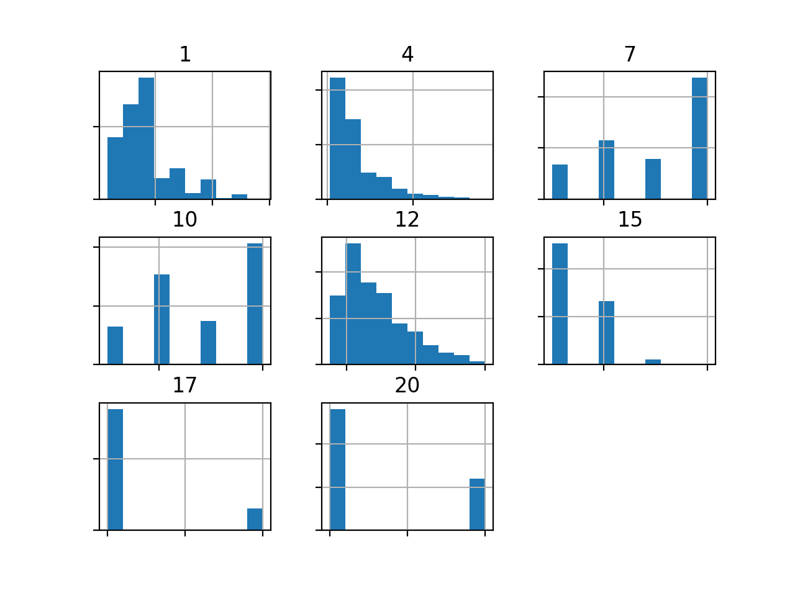
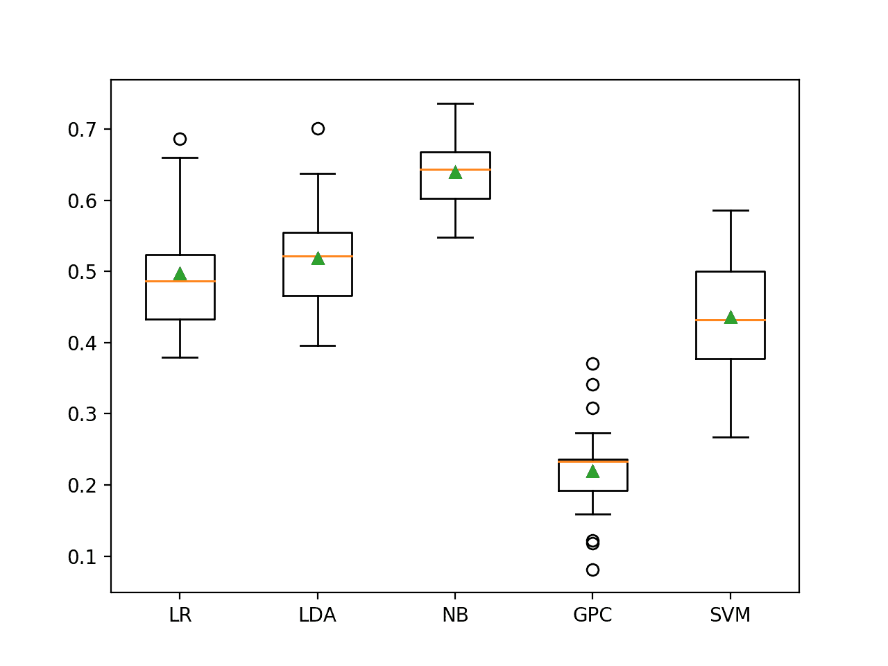
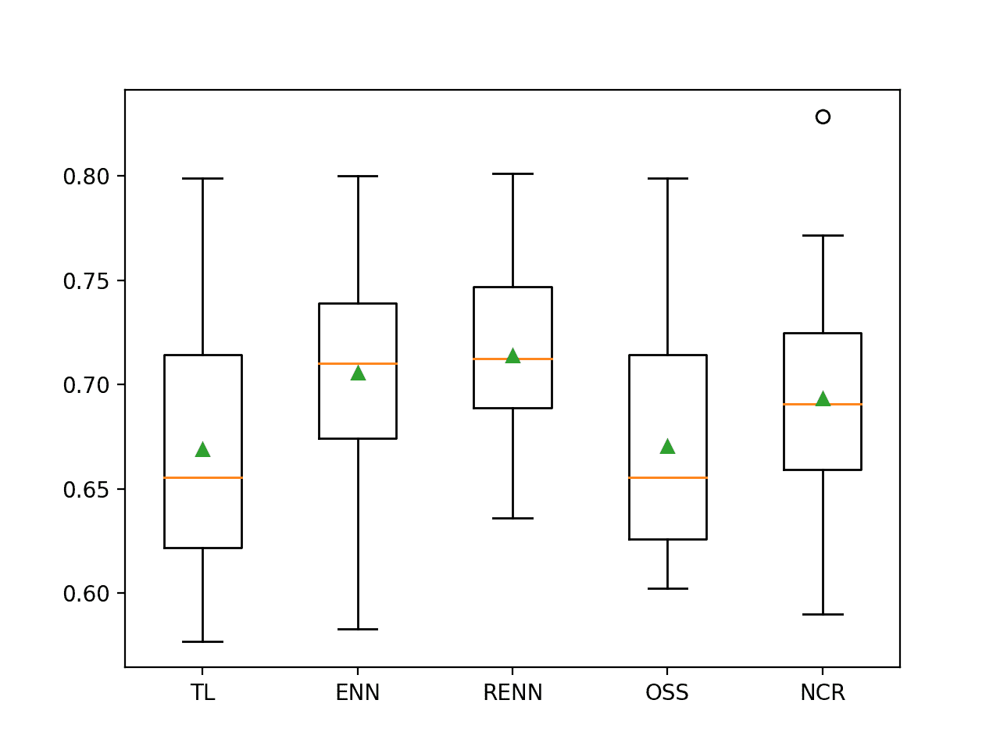

# 开发信用好坏的不平衡分类模型

> 原文：<https://machinelearningmastery.com/imbalanced-classification-of-good-and-bad-credit/>

最后更新于 2021 年 1 月 5 日

对于一些不平衡的分类任务，少数类的错误分类错误比其他类型的预测错误更重要。

一个例子是银行客户是否应该获得贷款的分类问题。向标记为好客户的坏客户提供贷款比拒绝向标记为坏客户的好客户提供贷款会给银行带来更大的成本。

这需要仔细选择一个表现指标，该指标既有助于总体上最小化错误分类错误，又有助于最小化一种类型的错误分类错误。

**德国信用数据集**是一个标准的不平衡类别数据集，它具有对错误分类错误的不同成本的特性。在此数据集上评估的模型可以使用 [Fbeta-Measure](https://machinelearningmastery.com/fbeta-measure-for-machine-learning/) 进行评估，该方法提供了一种方法，既可以总体量化模型表现，又可以满足一种错误分类错误比另一种错误分类错误成本更高的要求。

在本教程中，您将发现如何为不平衡的德国信用类别数据集开发和评估模型。

完成本教程后，您将知道:

*   如何加载和探索数据集，并为数据准备和模型选择产生想法。
*   如何利用数据欠采样技术评估一套机器学习模型并提高其表现？
*   如何拟合最终模型并使用它来预测特定情况下的类标签。

**用我的新书[Python 不平衡分类](https://machinelearningmastery.com/imbalanced-classification-with-python/)启动你的项目**，包括*分步教程*和所有示例的 *Python 源代码*文件。

我们开始吧。

*   **2020 年 2 月更新**:增加了进一步车型改进部分。
*   **2021 年 1 月更新**:更新了 API 文档的链接。


开发一个不平衡的分类模型来预测好的和坏的信用
图片由 [AL Nieves](https://flickr.com/photos/alnieves/43544649282/) 提供，保留部分权利。

## 教程概述

本教程分为五个部分；它们是:

1.  德国信贷数据集
2.  浏览数据集
3.  模型测试和基线结果
4.  评估模型
    1.  评估机器学习算法
    2.  评估欠采样
    3.  进一步的模型改进
5.  对新数据进行预测

## 德国信贷数据集

在这个项目中，我们将使用一个标准的不平衡机器学习数据集，称为“[德语信用](https://archive.ics.uci.edu/ml/datasets/Statlog+(German+Credit+Data))数据集或简称为“*德语*”

该数据集被用作 Statlog 项目的一部分，该项目是 20 世纪 90 年代基于欧洲的一项倡议，旨在评估和比较一系列不同分类任务的大量(当时)机器学习算法。数据集被记入汉斯·霍夫曼。

> 不同学科之间的割裂几乎肯定阻碍了交流和进步。StatLog 项目旨在通过选择分类程序来打破这些划分，而不考虑历史谱系，并在大规模和商业上重要的问题上进行测试，从而确定各种技术在多大程度上满足了行业需求。

—第 4 页，[机器学习，神经和统计分类](https://amzn.to/33oQT1q)，1994。

德国信贷数据集为客户描述金融和银行的详细信息，任务是确定客户是好是坏。假设任务包括预测客户是否会偿还贷款或信贷。

数据集包括 1，000 个示例和 20 个输入变量，其中 7 个是数字(整数)，13 个是分类变量。

*   现有支票账户的状态
*   月持续时间
*   信用记录
*   目的
*   信用保证金额
*   储蓄账户
*   自 2000 年至今的就业情况
*   分期付款率占可支配收入的百分比
*   个人地位和性别
*   其他债务人
*   现居地自
*   财产
*   以年为单位的年龄
*   其他分期付款计划
*   房屋
*   该银行现有的信贷数量
*   职位
*   受抚养人人数
*   电话
*   外籍工人

一些分类变量有序数关系，例如“*储蓄账户*”，尽管大多数没有。

有两类，一类是好客户，二类是坏客户。好客户是默认的或负面的类，而坏客户是例外的或正面的类。总共 70%的例子是好客户，而剩下的 30%的例子是坏客户。

*   **好客户**:负面或多数类(70%)。
*   **不良客户**:阳性或少数类(30%)。

数据集提供了一个成本矩阵，它对正类的每个错误分类错误给出不同的惩罚。具体来说，将 5 的成本应用于假阴性(将坏客户标记为好)，将 1 的成本分配给假阳性(将好客户标记为坏)。

*   **假阴性成本** : 5
*   **假阳性成本** : 1

这表明正类是预测任务的重点，银行或金融机构把钱给坏客户比不给好客户更费钱。选择表现指标时，必须考虑这一点。

接下来，让我们仔细看看数据。

## 浏览数据集

首先，下载数据集并将其保存在您当前的工作目录中，名称为“ *german.csv* ”。

*   [下载德国信用数据集(德文. csv)](https://raw.githubusercontent.com/jbrownlee/Datasets/master/german.csv)

查看文件的内容。

文件的前几行应该如下所示:

```py
A11,6,A34,A43,1169,A65,A75,4,A93,A101,4,A121,67,A143,A152,2,A173,1,A192,A201,1
A12,48,A32,A43,5951,A61,A73,2,A92,A101,2,A121,22,A143,A152,1,A173,1,A191,A201,2
A14,12,A34,A46,2096,A61,A74,2,A93,A101,3,A121,49,A143,A152,1,A172,2,A191,A201,1
A11,42,A32,A42,7882,A61,A74,2,A93,A103,4,A122,45,A143,A153,1,A173,2,A191,A201,1
A11,24,A33,A40,4870,A61,A73,3,A93,A101,4,A124,53,A143,A153,2,A173,2,A191,A201,2
...
```

我们可以看到分类列是用 *Axxx* 格式编码的，其中“ *x* 是不同标签的整数。需要对分类变量进行一次性编码。

我们还可以看到，数值变量有不同的标度，例如第 2 列中的 6、48 和 12，以及 1169、5951 等。在第五栏。这表明，对于那些对缩放敏感的算法，需要对整数列进行缩放。

目标变量或类是最后一列，包含值 1 和 2。这些将需要分别被标签编码为 0 和 1，以满足不平衡二进制分类任务的一般期望，其中 0 代表负情况，1 代表正情况。

可以使用 [read_csv()熊猫函数](https://pandas.pydata.org/pandas-docs/stable/reference/api/pandas.read_csv.html)将数据集加载为数据帧，指定位置和没有标题行的事实。

```py
...
# define the dataset location
filename = 'german.csv'
# load the csv file as a data frame
dataframe = read_csv(filename, header=None)
```

加载后，我们可以通过打印[数据框](https://pandas.pydata.org/pandas-docs/stable/reference/api/pandas.DataFrame.html)的形状来总结行数和列数。

```py
...
# summarize the shape of the dataset
print(dataframe.shape)
```

我们还可以使用 [Counter](https://docs.python.org/3/library/collections.html) 对象总结每个类中的示例数量。

```py
...
# summarize the class distribution
target = dataframe.values[:,-1]
counter = Counter(target)
for k,v in counter.items():
	per = v / len(target) * 100
	print('Class=%d, Count=%d, Percentage=%.3f%%' % (k, v, per))
```

将这些联系在一起，下面列出了加载和汇总数据集的完整示例。

```py
# load and summarize the dataset
from pandas import read_csv
from collections import Counter
# define the dataset location
filename = 'german.csv'
# load the csv file as a data frame
dataframe = read_csv(filename, header=None)
# summarize the shape of the dataset
print(dataframe.shape)
# summarize the class distribution
target = dataframe.values[:,-1]
counter = Counter(target)
for k,v in counter.items():
	per = v / len(target) * 100
	print('Class=%d, Count=%d, Percentage=%.3f%%' % (k, v, per))
```

运行该示例首先加载数据集并确认行数和列数，即 1，000 行、20 个输入变量和 1 个目标变量。

然后总结类别分布，确认好客户和坏客户的数量以及少数和多数类别中的案例百分比。

```py
(1000, 21)
Class=1, Count=700, Percentage=70.000%
Class=2, Count=300, Percentage=30.000%
```

我们还可以通过为七个数字输入变量创建直方图来查看它们的分布。

首先，我们可以通过调用 DataFrame 上的 [select_dtypes()函数](https://pandas.pydata.org/pandas-docs/stable/reference/api/pandas.DataFrame.select_dtypes.html)来选择带有数值变量的列。然后，我们可以从数据框中选择这些列。我们预计会有七个，加上数字类标签。

```py
...
# select columns with numerical data types
num_ix = df.select_dtypes(include=['int64', 'float64']).columns
# select a subset of the dataframe with the chosen columns
subset = df[num_ix]
```

然后，我们可以创建每个数字输入变量的直方图。下面列出了完整的示例。

```py
# create histograms of numeric input variables
from pandas import read_csv
from matplotlib import pyplot
# define the dataset location
filename = 'german.csv'
# load the csv file as a data frame
df = read_csv(filename, header=None)
# select columns with numerical data types
num_ix = df.select_dtypes(include=['int64', 'float64']).columns
# select a subset of the dataframe with the chosen columns
subset = df[num_ix]
# create a histogram plot of each numeric variable
ax = subset.hist()
# disable axis labels to avoid the clutter
for axis in ax.flatten():
	axis.set_xticklabels([])
	axis.set_yticklabels([])
# show the plot
pyplot.show()
```

运行该示例会创建一个图形，其中七个输入变量各有一个直方图子图，数据集中有一个类别标签。每个子图的标题指示数据帧中的列号(例如，从 0 到 20 的零偏移)。

我们可以看到许多不同的分布，有些是[类高斯分布](https://machinelearningmastery.com/continuous-probability-distributions-for-machine-learning/)，有些是看似指数或离散分布。

根据建模算法的选择，我们期望将分布缩放到相同的范围是有用的，并且可能使用一些幂变换。



德国信贷数据集中数值变量的直方图

现在我们已经回顾了数据集，让我们看看开发一个测试工具来评估候选模型。

## 模型测试和基线结果

我们将使用重复的分层 k 折叠交叉验证来评估候选模型。

[k 倍交叉验证程序](https://machinelearningmastery.com/k-fold-cross-validation/)提供了一个良好的模型表现的总体估计，至少与单个列车测试分割相比，不太乐观。我们将使用 k=10，这意味着每个折叠将包含大约 1000/10 或 100 个示例。

分层意味着每个文件夹将包含相同的混合类示例，即大约 70%到 30%的好客户和坏客户。重复意味着评估过程将执行多次，以帮助避免侥幸结果，并更好地捕捉所选模型的方差。我们将使用三次重复。

这意味着单个模型将被拟合和评估 10 * 3 或 30 次，并且这些运行的平均值和标准偏差将被报告。

这可以通过使用[repeated stratifiedfold Sklearn 类](https://Sklearn.org/stable/modules/generated/sklearn.model_selection.RepeatedStratifiedKFold.html)来实现。

我们将预测客户是否优秀的类别标签。因此，我们需要一个适合评估预测类标签的度量。

任务的重点是积极类(坏客户)。精确和召回是一个很好的起点。最大化准确率将最小化误报，最大化召回将最小化模型预测中的误报。

*   准确率=真阳性/(真阳性+假阳性)
*   回忆=真阳性/(真阳性+假阴性)

使用 F-Measure 将计算准确率和召回率之间的调和平均值。这是一个很好的数字，可以用来比较和选择这个问题的模型。问题是假阴性比假阳性更具破坏性。

*   F-Measure = (2 *准确率*召回)/(准确率+召回)

请记住，这个数据集上的假阴性是坏客户被标记为好客户并获得贷款的情况。假阳性是指一个好客户被标记为坏客户，却没有得到贷款。

*   **假阴性**:预测为好客户(0 类)的坏客户(1 类)。
*   **假阳性**:预测为坏客户(1 类)的好客户(0 类)。

假阴性对银行来说比假阳性更昂贵。

*   成本(假阴性) >成本(假阳性)

换句话说，我们对 F 度量感兴趣，它将总结模型最小化正类错误分类错误的能力，但是我们希望更好的模型是最小化假阴性而不是假阳性。

这可以通过使用一个版本的 F-measure 来实现，该版本计算准确率和召回率的加权[调和平均值](https://machinelearningmastery.com/arithmetic-geometric-and-harmonic-means-for-machine-learning/)，但是倾向于较高的召回率分数而不是准确率分数。这被称为 [Fbeta-measure](https://machinelearningmastery.com/fbeta-measure-for-machine-learning/) ，是 F-measure 的推广，其中“ *beta* ”是定义两个分数权重的参数。

*   Fbeta-Measure = ((1 + beta^2) *准确率*召回)/ (beta^2 *准确率+召回)

β值 2 比准确率更重视召回率，被称为 F2-测度。

*   F2-Measure = ((1 + 2^2) *准确率*召回)/ (2^2 *准确率+召回)

我们将使用这一衡量标准来评估德国信贷数据集上的模型。这可以使用 [fbeta_score() Sklearn 功能](https://Sklearn.org/stable/modules/generated/sklearn.metrics.fbeta_score.html)来实现。

我们可以定义一个函数来加载数据集，并将列分成输入和输出变量。我们将对分类变量进行热编码，并对目标变量进行标签编码。您可能还记得，一次性编码为变量的每个值用一个新列替换分类变量，并在该值的列中用 1 标记值。

首先，我们必须将数据帧分成输入和输出变量。

```py
...
# split into inputs and outputs
last_ix = len(dataframe.columns) - 1
X, y = dataframe.drop(last_ix, axis=1), dataframe[last_ix]
```

接下来，我们需要选择所有分类的输入变量，然后应用一个热编码，保留数值变量不变。

这可以通过使用[列转换器](https://Sklearn.org/stable/modules/generated/sklearn.compose.ColumnTransformer.html)并将转换定义为仅适用于分类变量列索引的 [OneHotEncoder](https://Sklearn.org/stable/modules/generated/sklearn.preprocessing.OneHotEncoder.html) 来实现。

```py
...
# select categorical features
cat_ix = X.select_dtypes(include=['object', 'bool']).columns
# one hot encode cat features only
ct = ColumnTransformer([('o',OneHotEncoder(),cat_ix)], remainder='passthrough')
X = ct.fit_transform(X)
```

然后我们可以对目标变量进行标签编码。

```py
...
# label encode the target variable to have the classes 0 and 1
y = LabelEncoder().fit_transform(y)
```

下面的 *load_dataset()* 函数将所有这些联系在一起，并为建模加载和准备数据集。

```py
# load the dataset
def load_dataset(full_path):
	# load the dataset as a numpy array
	dataframe = read_csv(full_path, header=None)
	# split into inputs and outputs
	last_ix = len(dataframe.columns) - 1
	X, y = dataframe.drop(last_ix, axis=1), dataframe[last_ix]
	# select categorical features
	cat_ix = X.select_dtypes(include=['object', 'bool']).columns
	# one hot encode cat features only
	ct = ColumnTransformer([('o',OneHotEncoder(),cat_ix)], remainder='passthrough')
	X = ct.fit_transform(X)
	# label encode the target variable to have the classes 0 and 1
	y = LabelEncoder().fit_transform(y)
	return X, y
```

接下来，我们需要一个函数，该函数将使用*β*设置为 2 的 *fbeta_score()* 函数来评估一组预测。

```py
# calculate f2 score
def f2(y_true, y_pred):
	return fbeta_score(y_true, y_pred, beta=2)
```

然后，我们可以定义一个函数来评估数据集上的给定模型，并返回每次折叠和重复的 F2-Measure 分数列表。

下面的 *evaluate_model()* 函数实现了这一点，将数据集和模型作为参数，返回分数列表。

```py
# evaluate a model
def evaluate_model(X, y, model):
	# define evaluation procedure
	cv = RepeatedStratifiedKFold(n_splits=10, n_repeats=3, random_state=1)
	# define the model evaluation the metric
	metric = make_scorer(f2)
	# evaluate model
	scores = cross_val_score(model, X, y, scoring=metric, cv=cv, n_jobs=-1)
	return scores
```

最后，我们可以使用这个测试工具在数据集上评估一个基线模型。

预测示例的少数类的模型将获得最大召回分数和基线准确率分数。这为模型在这个问题上的表现提供了一个基线，通过这个基线可以比较所有其他模型。

这可以通过使用 Sklearn 库中的 [DummyClassifier](https://Sklearn.org/stable/modules/generated/sklearn.dummy.DummyClassifier.html) 类，并将少数民族类的“*策略*”参数设置为“*常量*”并将“*常量*”参数设置为“ *1* ”来实现。

```py
...
# define the reference model
model = DummyClassifier(strategy='constant', constant=1)
```

一旦评估了模型，我们就可以直接报告 F2-Measure 分数的平均值和标准偏差。

```py
...
# evaluate the model
scores = evaluate_model(X, y, model)
# summarize performance
print('Mean F2: %.3f (%.3f)' % (mean(scores), std(scores)))
```

将这些结合起来，下面列出了加载德国信用数据集、评估基线模型和报告表现的完整示例。

```py
# test harness and baseline model evaluation for the german credit dataset
from collections import Counter
from numpy import mean
from numpy import std
from pandas import read_csv
from sklearn.preprocessing import LabelEncoder
from sklearn.preprocessing import OneHotEncoder
from sklearn.compose import ColumnTransformer
from sklearn.model_selection import cross_val_score
from sklearn.model_selection import RepeatedStratifiedKFold
from sklearn.metrics import fbeta_score
from sklearn.metrics import make_scorer
from sklearn.dummy import DummyClassifier

# load the dataset
def load_dataset(full_path):
	# load the dataset as a numpy array
	dataframe = read_csv(full_path, header=None)
	# split into inputs and outputs
	last_ix = len(dataframe.columns) - 1
	X, y = dataframe.drop(last_ix, axis=1), dataframe[last_ix]
	# select categorical features
	cat_ix = X.select_dtypes(include=['object', 'bool']).columns
	# one hot encode cat features only
	ct = ColumnTransformer([('o',OneHotEncoder(),cat_ix)], remainder='passthrough')
	X = ct.fit_transform(X)
	# label encode the target variable to have the classes 0 and 1
	y = LabelEncoder().fit_transform(y)
	return X, y

# calculate f2 score
def f2(y_true, y_pred):
	return fbeta_score(y_true, y_pred, beta=2)

# evaluate a model
def evaluate_model(X, y, model):
	# define evaluation procedure
	cv = RepeatedStratifiedKFold(n_splits=10, n_repeats=3, random_state=1)
	# define the model evaluation metric
	metric = make_scorer(f2)
	# evaluate model
	scores = cross_val_score(model, X, y, scoring=metric, cv=cv, n_jobs=-1)
	return scores

# define the location of the dataset
full_path = 'german.csv'
# load the dataset
X, y = load_dataset(full_path)
# summarize the loaded dataset
print(X.shape, y.shape, Counter(y))
# define the reference model
model = DummyClassifier(strategy='constant', constant=1)
# evaluate the model
scores = evaluate_model(X, y, model)
# summarize performance
print('Mean F2: %.3f (%.3f)' % (mean(scores), std(scores)))
```

运行该示例首先加载和汇总数据集。

我们可以看到，我们已经加载了正确的行数，并且通过对分类输入变量进行一次性编码，我们已经将输入变量的数量从 20 个增加到 61 个。这表明 13 个分类变量被编码成总共 54 列。

重要的是，我们可以看到类标签正确映射到整数，多数类为 0，少数类为 1，这是不平衡二进制类别数据集的惯例。

接下来，报告 F2-Measure 分数的平均值。

在这种情况下，我们可以看到基线算法实现了大约 0.682 的 F2-Measure。这个分数提供了模特技能的下限；任何获得高于约 0.682 的 F2-Measure 平均值的模型都有技能，而获得低于该值的分数的模型在该数据集上没有技能。

```py
(1000, 61) (1000,) Counter({0: 700, 1: 300})
Mean F2: 0.682 (0.000)
```

现在我们已经有了测试工具和表现基线，我们可以开始在这个数据集上评估一些模型了。

## 评估模型

在本节中，我们将使用上一节中开发的测试工具来评估数据集上的一套不同技术。

目标是既演示如何系统地解决问题，又演示为不平衡分类问题设计的一些技术的能力。

报告的表现良好，但没有高度优化(例如，超参数没有调整)。

**你能做得更好吗？**如果您可以使用相同的测试线束获得更好的 F2-Measure 表现，我很想听听。请在下面的评论中告诉我。

### 评估机器学习算法

让我们从评估数据集上的概率机器学习模型的混合开始。

在数据集上抽查一套不同的线性和非线性算法可能是一个好主意，以便快速找出哪些算法运行良好，值得进一步关注，哪些算法运行不佳。

我们将在德国信用数据集上评估以下机器学习模型:

*   逻辑回归
*   线性判别分析
*   朴素贝叶斯
*   高斯过程分类器
*   支持向量机(SVM)

我们将主要使用默认模型超参数。

我们将依次定义每个模型，并将它们添加到一个列表中，以便我们可以顺序评估它们。下面的 *get_models()* 函数定义了用于评估的模型列表，以及用于以后绘制结果的模型简称列表。

```py
# define models to test
def get_models():
	models, names = list(), list()
	# LR
	models.append(LogisticRegression(solver='liblinear'))
	names.append('LR')
	# LDA
	models.append(LinearDiscriminantAnalysis())
	names.append('LDA')
	# NB
	models.append(GaussianNB())
	names.append('NB')
	# GPC
	models.append(GaussianProcessClassifier())
	names.append('GPC')
	# SVM
	models.append(SVC(gamma='scale'))
	names.append('SVM')
	return models, names
```

然后，我们可以依次列举模型列表，并对每个模型进行评估，存储分数供以后评估。

我们将像上一节一样对分类输入变量进行一次热编码，在这种情况下，我们将对数字输入变量进行标准化。在交叉验证评估过程的每个折叠中，最好使用[最小最大缩放器](https://Sklearn.org/stable/modules/generated/sklearn.preprocessing.MinMaxScaler.html)来执行。

实现这一点的一个简单方法是使用[管道](https://Sklearn.org/stable/modules/generated/sklearn.pipeline.Pipeline.html)，其中第一步是[列转换器](https://Sklearn.org/stable/modules/generated/sklearn.compose.ColumnTransformer.html)，它将 [OneHotEncoder](https://Sklearn.org/stable/modules/generated/sklearn.preprocessing.OneHotEncoder.html) 应用于分类变量，将*最小最大缩放器*应用于数字输入变量。为此，我们需要分类和数字输入变量的列索引列表。

我们可以更新 *load_dataset()* 来返回列索引以及数据集的输入和输出元素。下面列出了该功能的更新版本。

```py
# load the dataset
def load_dataset(full_path):
	# load the dataset as a numpy array
	dataframe = read_csv(full_path, header=None)
	# split into inputs and outputs
	last_ix = len(dataframe.columns) - 1
	X, y = dataframe.drop(last_ix, axis=1), dataframe[last_ix]
	# select categorical and numerical features
	cat_ix = X.select_dtypes(include=['object', 'bool']).columns
	num_ix = X.select_dtypes(include=['int64', 'float64']).columns
	# label encode the target variable to have the classes 0 and 1
	y = LabelEncoder().fit_transform(y)
	return X.values, y, cat_ix, num_ix
```

然后，我们可以调用这个函数来获取数据以及分类变量和数值变量的列表。

```py
...
# define the location of the dataset
full_path = 'german.csv'
# load the dataset
X, y, cat_ix, num_ix = load_dataset(full_path)
```

这可用于在评估每个模型之前准备一个*管道*来包装它。

首先，定义*列转换器*，它指定对每种类型的列应用什么转换，然后这被用作管道的第一步，该管道以将被拟合和评估的特定模型结束。

```py
...
# evaluate each model
for i in range(len(models)):
	# one hot encode categorical, normalize numerical
	ct = ColumnTransformer([('c',OneHotEncoder(),cat_ix), ('n',MinMaxScaler(),num_ix)])
	# wrap the model i a pipeline
	pipeline = Pipeline(steps=[('t',ct),('m',models[i])])
	# evaluate the model and store results
	scores = evaluate_model(X, y, pipeline)
```

我们可以总结每个算法的平均 F2-Measure；这将有助于直接比较算法。

```py
...
# summarize and store
print('>%s %.3f (%.3f)' % (names[i], mean(scores), std(scores)))
```

在运行结束时，我们将为每个算法的结果样本创建一个单独的方框和触须图。

这些图将使用相同的 y 轴比例，因此我们可以直接比较结果的分布。

```py
...
# plot the results
pyplot.boxplot(results, labels=names, showmeans=True)
pyplot.show()
```

将所有这些结合起来，下面列出了在德国信用数据集上评估一套机器学习算法的完整示例。

```py
# spot check machine learning algorithms on the german credit dataset
from numpy import mean
from numpy import std
from pandas import read_csv
from matplotlib import pyplot
from sklearn.preprocessing import LabelEncoder
from sklearn.preprocessing import OneHotEncoder
from sklearn.preprocessing import MinMaxScaler
from sklearn.pipeline import Pipeline
from sklearn.compose import ColumnTransformer
from sklearn.model_selection import cross_val_score
from sklearn.model_selection import RepeatedStratifiedKFold
from sklearn.metrics import fbeta_score
from sklearn.metrics import make_scorer
from sklearn.linear_model import LogisticRegression
from sklearn.discriminant_analysis import LinearDiscriminantAnalysis
from sklearn.naive_bayes import GaussianNB
from sklearn.gaussian_process import GaussianProcessClassifier
from sklearn.svm import SVC

# load the dataset
def load_dataset(full_path):
	# load the dataset as a numpy array
	dataframe = read_csv(full_path, header=None)
	# split into inputs and outputs
	last_ix = len(dataframe.columns) - 1
	X, y = dataframe.drop(last_ix, axis=1), dataframe[last_ix]
	# select categorical and numerical features
	cat_ix = X.select_dtypes(include=['object', 'bool']).columns
	num_ix = X.select_dtypes(include=['int64', 'float64']).columns
	# label encode the target variable to have the classes 0 and 1
	y = LabelEncoder().fit_transform(y)
	return X.values, y, cat_ix, num_ix

# calculate f2-measure
def f2_measure(y_true, y_pred):
	return fbeta_score(y_true, y_pred, beta=2)

# evaluate a model
def evaluate_model(X, y, model):
	# define evaluation procedure
	cv = RepeatedStratifiedKFold(n_splits=10, n_repeats=3, random_state=1)
	# define the model evaluation metric
	metric = make_scorer(f2_measure)
	# evaluate model
	scores = cross_val_score(model, X, y, scoring=metric, cv=cv, n_jobs=-1)
	return scores

# define models to test
def get_models():
	models, names = list(), list()
	# LR
	models.append(LogisticRegression(solver='liblinear'))
	names.append('LR')
	# LDA
	models.append(LinearDiscriminantAnalysis())
	names.append('LDA')
	# NB
	models.append(GaussianNB())
	names.append('NB')
	# GPC
	models.append(GaussianProcessClassifier())
	names.append('GPC')
	# SVM
	models.append(SVC(gamma='scale'))
	names.append('SVM')
	return models, names

# define the location of the dataset
full_path = 'german.csv'
# load the dataset
X, y, cat_ix, num_ix = load_dataset(full_path)
# define models
models, names = get_models()
results = list()
# evaluate each model
for i in range(len(models)):
	# one hot encode categorical, normalize numerical
	ct = ColumnTransformer([('c',OneHotEncoder(),cat_ix), ('n',MinMaxScaler(),num_ix)])
	# wrap the model i a pipeline
	pipeline = Pipeline(steps=[('t',ct),('m',models[i])])
	# evaluate the model and store results
	scores = evaluate_model(X, y, pipeline)
	results.append(scores)
	# summarize and store
	print('>%s %.3f (%.3f)' % (names[i], mean(scores), std(scores)))
# plot the results
pyplot.boxplot(results, labels=names, showmeans=True)
pyplot.show()
```

运行该示例依次评估每个算法，并报告平均值和标准偏差 F2-Measure。

**注**:考虑到算法或评估程序的随机性，或数值准确率的差异，您的[结果可能会有所不同](https://machinelearningmastery.com/different-results-each-time-in-machine-learning/)。考虑运行该示例几次，并比较平均结果。

在这种情况下，我们可以看到，在所有情况下，没有一个测试模型的 F2 度量高于预测多数类的默认值(0.682)。这些模特都不熟练。这是令人惊讶的，尽管这表明这两个类别之间的决策边界可能是嘈杂的。

```py
>LR 0.497 (0.072)
>LDA 0.519 (0.072)
>NB 0.639 (0.049)
>GPC 0.219 (0.061)
>SVM 0.436 (0.077)
```

创建一个图形，显示每个算法结果样本的一个方框和须图。方框显示中间 50%的数据，每个方框中间的橙色线显示样本的中值，每个方框中的绿色三角形显示样本的平均值。



不平衡德国信用数据集上机器学习模型的盒须图

现在我们有了一些结果，让我们看看是否可以通过一些欠采样来改进它们。

### 评估欠采样

在处理不平衡分类任务时，欠采样可能是最不广泛使用的技术，因为大部分注意力都放在用 SMOTE 对多数类进行过采样上。

欠采样有助于沿着决策边界从多数类中移除示例，这使得分类算法面临挑战。

在本实验中，我们将测试以下欠采样算法:

*   托梅克左侧(TL)
*   编辑最近邻居(ENN)
*   重复编辑最近邻
*   单边选择
*   邻里清洁规则(NCR)

Tomek Links 和 ENN 方法从多数类中选择要删除的示例，而 OSS 和 NCR 都选择要保留的示例和要删除的示例。我们将使用逻辑回归算法的平衡版本来测试每种欠采样方法，以保持简单。

可以更新上一节中的 *get_models()* 函数，以返回一个欠采样技术列表，用逻辑回归算法进行测试。我们使用来自不平衡学习库的这些算法的实现。

定义欠采样方法的 *get_models()* 函数的更新版本如下。

```py
# define undersampling models to test
def get_models():
	models, names = list(), list()
	# TL
	models.append(TomekLinks())
	names.append('TL')
	# ENN
	models.append(EditedNearestNeighbours())
	names.append('ENN')
	# RENN
	models.append(RepeatedEditedNearestNeighbours())
	names.append('RENN')
	# OSS
	models.append(OneSidedSelection())
	names.append('OSS')
	# NCR
	models.append(NeighbourhoodCleaningRule())
	names.append('NCR')
	return models, names
```

Sklearn 提供的[管道](https://Sklearn.org/stable/modules/generated/sklearn.pipeline.Pipeline.html)不知道欠采样算法。因此，我们必须使用[不平衡学习库](https://imbalanced-learn.org/stable/)提供的[管道](https://imbalanced-learn.org/stable/generated/imblearn.pipeline.Pipeline.html)实现。

与上一节一样，管道的第一步将是分类变量的热编码和数值变量的标准化，最后一步是拟合模型。这里，中间步骤将是欠采样技术，仅在训练数据集的交叉验证评估中正确应用。

```py
...
# define model to evaluate
model = LogisticRegression(solver='liblinear', class_weight='balanced')
# one hot encode categorical, normalize numerical
ct = ColumnTransformer([('c',OneHotEncoder(),cat_ix), ('n',MinMaxScaler(),num_ix)])
# scale, then undersample, then fit model
pipeline = Pipeline(steps=[('t',ct), ('s', models[i]), ('m',model)])
# evaluate the model and store results
scores = evaluate_model(X, y, pipeline)
```

将这些联系在一起，下面列出了在德国信贷数据集上使用不同欠采样方法评估逻辑回归的完整示例。

我们希望欠采样能够提升逻辑回归的技能，理想情况下，在所有情况下都高于预测少数族裔的基线表现。

下面列出了完整的示例。

```py
# evaluate undersampling with logistic regression on the imbalanced german credit dataset
from numpy import mean
from numpy import std
from pandas import read_csv
from sklearn.preprocessing import LabelEncoder
from sklearn.preprocessing import OneHotEncoder
from sklearn.preprocessing import MinMaxScaler
from sklearn.compose import ColumnTransformer
from sklearn.model_selection import cross_val_score
from sklearn.model_selection import RepeatedStratifiedKFold
from sklearn.metrics import fbeta_score
from sklearn.metrics import make_scorer
from matplotlib import pyplot
from sklearn.linear_model import LogisticRegression
from imblearn.pipeline import Pipeline
from imblearn.under_sampling import TomekLinks
from imblearn.under_sampling import EditedNearestNeighbours
from imblearn.under_sampling import RepeatedEditedNearestNeighbours
from imblearn.under_sampling import NeighbourhoodCleaningRule
from imblearn.under_sampling import OneSidedSelection

# load the dataset
def load_dataset(full_path):
	# load the dataset as a numpy array
	dataframe = read_csv(full_path, header=None)
	# split into inputs and outputs
	last_ix = len(dataframe.columns) - 1
	X, y = dataframe.drop(last_ix, axis=1), dataframe[last_ix]
	# select categorical and numerical features
	cat_ix = X.select_dtypes(include=['object', 'bool']).columns
	num_ix = X.select_dtypes(include=['int64', 'float64']).columns
	# label encode the target variable to have the classes 0 and 1
	y = LabelEncoder().fit_transform(y)
	return X.values, y, cat_ix, num_ix

# calculate f2-measure
def f2_measure(y_true, y_pred):
	return fbeta_score(y_true, y_pred, beta=2)

# evaluate a model
def evaluate_model(X, y, model):
	# define evaluation procedure
	cv = RepeatedStratifiedKFold(n_splits=10, n_repeats=3, random_state=1)
	# define the model evaluation metric
	metric = make_scorer(f2_measure)
	# evaluate model
	scores = cross_val_score(model, X, y, scoring=metric, cv=cv, n_jobs=-1)
	return scores

# define undersampling models to test
def get_models():
	models, names = list(), list()
	# TL
	models.append(TomekLinks())
	names.append('TL')
	# ENN
	models.append(EditedNearestNeighbours())
	names.append('ENN')
	# RENN
	models.append(RepeatedEditedNearestNeighbours())
	names.append('RENN')
	# OSS
	models.append(OneSidedSelection())
	names.append('OSS')
	# NCR
	models.append(NeighbourhoodCleaningRule())
	names.append('NCR')
	return models, names

# define the location of the dataset
full_path = 'german.csv'
# load the dataset
X, y, cat_ix, num_ix = load_dataset(full_path)
# define models
models, names = get_models()
results = list()
# evaluate each model
for i in range(len(models)):
	# define model to evaluate
	model = LogisticRegression(solver='liblinear', class_weight='balanced')
	# one hot encode categorical, normalize numerical
	ct = ColumnTransformer([('c',OneHotEncoder(),cat_ix), ('n',MinMaxScaler(),num_ix)])
	# scale, then undersample, then fit model
	pipeline = Pipeline(steps=[('t',ct), ('s', models[i]), ('m',model)])
	# evaluate the model and store results
	scores = evaluate_model(X, y, pipeline)
	results.append(scores)
	# summarize and store
	print('>%s %.3f (%.3f)' % (names[i], mean(scores), std(scores)))
# plot the results
pyplot.boxplot(results, labels=names, showmeans=True)
pyplot.show()
```

运行该示例使用五种不同的欠采样技术来评估逻辑回归算法。

**注**:考虑到算法或评估程序的随机性，或数值准确率的差异，您的[结果可能会有所不同](https://machinelearningmastery.com/different-results-each-time-in-machine-learning/)。考虑运行该示例几次，并比较平均结果。

在这种情况下，我们可以看到五种欠采样技术中的三种产生了 F2 度量，比基线 0.682 有所改善。具体来说，ENN，雷恩和 NCR，重复编辑最近的邻居导致最好的表现，F2-测量值约为 0.716。

结果表明 *SMOTE* 以 0.604 的 F2-Measure 获得了最佳得分。

```py
>TL 0.669 (0.057)
>ENN 0.706 (0.048)
>RENN 0.714 (0.041)
>OSS 0.670 (0.054)
>NCR 0.693 (0.052)
```

为每种评估的欠采样技术创建方框图和触须图，显示它们通常具有相同的扩展。

令人鼓舞的是，对于表现良好的方法，方框分布在 0.8 左右，所有三种方法的平均值和中值都在 0.7 左右。这强调了分布是偏高的，有时会因为一些不好的评估而降低。



不平衡德国信贷数据集上欠采样逻辑回归的盒须图

接下来，让我们看看如何使用最终模型对新数据进行预测。

### 进一步的模型改进

这是一个新的部分，与上面的部分略有不同。在这里，我们将测试导致 F2-measure 表现进一步提升的特定模型，随着新模型的报告/发现，我将更新这一部分。

#### 改进#1:实例化硬件阈值

使用带有[实例硬度阈值](https://imbalanced-learn.org/stable/generated/imblearn.under_sampling.InstanceHardnessThreshold.html)欠采样的平衡逻辑回归可以获得约为 **0.727** 的 F2 度量。

下面列出了完整的示例。

```py
# improve performance on the imbalanced german credit dataset
from numpy import mean
from numpy import std
from pandas import read_csv
from sklearn.preprocessing import LabelEncoder
from sklearn.preprocessing import OneHotEncoder
from sklearn.preprocessing import MinMaxScaler
from sklearn.compose import ColumnTransformer
from sklearn.model_selection import cross_val_score
from sklearn.model_selection import RepeatedStratifiedKFold
from sklearn.metrics import fbeta_score
from sklearn.metrics import make_scorer
from sklearn.linear_model import LogisticRegression
from imblearn.pipeline import Pipeline
from imblearn.under_sampling import InstanceHardnessThreshold

# load the dataset
def load_dataset(full_path):
	# load the dataset as a numpy array
	dataframe = read_csv(full_path, header=None)
	# split into inputs and outputs
	last_ix = len(dataframe.columns) - 1
	X, y = dataframe.drop(last_ix, axis=1), dataframe[last_ix]
	# select categorical and numerical features
	cat_ix = X.select_dtypes(include=['object', 'bool']).columns
	num_ix = X.select_dtypes(include=['int64', 'float64']).columns
	# label encode the target variable to have the classes 0 and 1
	y = LabelEncoder().fit_transform(y)
	return X.values, y, cat_ix, num_ix

# calculate f2-measure
def f2_measure(y_true, y_pred):
	return fbeta_score(y_true, y_pred, beta=2)

# evaluate a model
def evaluate_model(X, y, model):
	# define evaluation procedure
	cv = RepeatedStratifiedKFold(n_splits=10, n_repeats=3, random_state=1)
	# define the model evaluation metric
	metric = make_scorer(f2_measure)
	# evaluate model
	scores = cross_val_score(model, X, y, scoring=metric, cv=cv, n_jobs=-1)
	return scores

# define the location of the dataset
full_path = 'german.csv'
# load the dataset
X, y, cat_ix, num_ix = load_dataset(full_path)
# define model to evaluate
model = LogisticRegression(solver='liblinear', class_weight='balanced')
# define the data sampling
sampling = InstanceHardnessThreshold()
# one hot encode categorical, normalize numerical
ct = ColumnTransformer([('c',OneHotEncoder(),cat_ix), ('n',MinMaxScaler(),num_ix)])
# scale, then sample, then fit model
pipeline = Pipeline(steps=[('t',ct), ('s', sampling), ('m',model)])
# evaluate the model and store results
scores = evaluate_model(X, y, pipeline)
print('%.3f (%.3f)' % (mean(scores), std(scores)))
```

**注**:考虑到算法或评估程序的随机性，或数值准确率的差异，您的[结果可能会有所不同](https://machinelearningmastery.com/different-results-each-time-in-machine-learning/)。考虑运行该示例几次，并比较平均结果。

运行该示例会得到以下结果。

```py
0.727 (0.033)
```

#### 改进# 2:SMOTENN

使用带有[SMOTENN](https://imbalanced-learn.org/stable/generated/imblearn.combine.SMOTEENN.html)的 LDA 可以获得约为 **0.730** 的 F2 度量，其中 ENN 参数设置为 ENN 实例，采样策略设置为多数。

下面列出了完整的示例。

```py
# improve performance on the imbalanced german credit dataset
from numpy import mean
from numpy import std
from pandas import read_csv
from sklearn.preprocessing import LabelEncoder
from sklearn.preprocessing import OneHotEncoder
from sklearn.preprocessing import MinMaxScaler
from sklearn.compose import ColumnTransformer
from sklearn.model_selection import cross_val_score
from sklearn.model_selection import RepeatedStratifiedKFold
from sklearn.metrics import fbeta_score
from sklearn.metrics import make_scorer
from sklearn.discriminant_analysis import LinearDiscriminantAnalysis
from imblearn.pipeline import Pipeline
from imblearn.combine import SMOTEENN
from imblearn.under_sampling import EditedNearestNeighbours

# load the dataset
def load_dataset(full_path):
	# load the dataset as a numpy array
	dataframe = read_csv(full_path, header=None)
	# split into inputs and outputs
	last_ix = len(dataframe.columns) - 1
	X, y = dataframe.drop(last_ix, axis=1), dataframe[last_ix]
	# select categorical and numerical features
	cat_ix = X.select_dtypes(include=['object', 'bool']).columns
	num_ix = X.select_dtypes(include=['int64', 'float64']).columns
	# label encode the target variable to have the classes 0 and 1
	y = LabelEncoder().fit_transform(y)
	return X.values, y, cat_ix, num_ix

# calculate f2-measure
def f2_measure(y_true, y_pred):
	return fbeta_score(y_true, y_pred, beta=2)

# evaluate a model
def evaluate_model(X, y, model):
	# define evaluation procedure
	cv = RepeatedStratifiedKFold(n_splits=10, n_repeats=3, random_state=1)
	# define the model evaluation metric
	metric = make_scorer(f2_measure)
	# evaluate model
	scores = cross_val_score(model, X, y, scoring=metric, cv=cv, n_jobs=-1)
	return scores

# define the location of the dataset
full_path = 'german.csv'
# load the dataset
X, y, cat_ix, num_ix = load_dataset(full_path)
# define model to evaluate
model = LinearDiscriminantAnalysis()
# define the data sampling
sampling = SMOTEENN(enn=EditedNearestNeighbours(sampling_strategy='majority'))
# one hot encode categorical, normalize numerical
ct = ColumnTransformer([('c',OneHotEncoder(),cat_ix), ('n',MinMaxScaler(),num_ix)])
# scale, then sample, then fit model
pipeline = Pipeline(steps=[('t',ct), ('s', sampling), ('m',model)])
# evaluate the model and store results
scores = evaluate_model(X, y, pipeline)
print('%.3f (%.3f)' % (mean(scores), std(scores)))
```

**注**:考虑到算法或评估程序的随机性，或数值准确率的差异，您的[结果可能会有所不同](https://machinelearningmastery.com/different-results-each-time-in-machine-learning/)。考虑运行该示例几次，并比较平均结果。

运行该示例会得到以下结果。

```py
0.730 (0.046)
```

#### 改进 3:带标准缩放器和脊分类器的 SMOTEENN

大约 0.741 的 F2 测量值可以通过使用脊分类器而不是线性判别分析并使用用于数字输入的标准缩放器而不是最小最大缩放器来进一步改进 SMOTEENN 来实现。

下面列出了完整的示例。

```py
# improve performance on the imbalanced german credit dataset
from numpy import mean
from numpy import std
from pandas import read_csv
from sklearn.preprocessing import LabelEncoder
from sklearn.preprocessing import OneHotEncoder
from sklearn.preprocessing import StandardScaler
from sklearn.compose import ColumnTransformer
from sklearn.model_selection import cross_val_score
from sklearn.model_selection import RepeatedStratifiedKFold
from sklearn.metrics import fbeta_score
from sklearn.metrics import make_scorer
from sklearn.linear_model import RidgeClassifier
from imblearn.pipeline import Pipeline
from imblearn.combine import SMOTEENN
from imblearn.under_sampling import EditedNearestNeighbours

# load the dataset
def load_dataset(full_path):
	# load the dataset as a numpy array
	dataframe = read_csv(full_path, header=None)
	# split into inputs and outputs
	last_ix = len(dataframe.columns) - 1
	X, y = dataframe.drop(last_ix, axis=1), dataframe[last_ix]
	# select categorical and numerical features
	cat_ix = X.select_dtypes(include=['object', 'bool']).columns
	num_ix = X.select_dtypes(include=['int64', 'float64']).columns
	# label encode the target variable to have the classes 0 and 1
	y = LabelEncoder().fit_transform(y)
	return X.values, y, cat_ix, num_ix

# calculate f2-measure
def f2_measure(y_true, y_pred):
	return fbeta_score(y_true, y_pred, beta=2)

# evaluate a model
def evaluate_model(X, y, model):
	# define evaluation procedure
	cv = RepeatedStratifiedKFold(n_splits=10, n_repeats=3, random_state=1)
	# define the model evaluation metric
	metric = make_scorer(f2_measure)
	# evaluate model
	scores = cross_val_score(model, X, y, scoring=metric, cv=cv, n_jobs=-1)
	return scores

# define the location of the dataset
full_path = 'german.csv'
# load the dataset
X, y, cat_ix, num_ix = load_dataset(full_path)
# define model to evaluate
model = RidgeClassifier()
# define the data sampling
sampling = SMOTEENN(enn=EditedNearestNeighbours(sampling_strategy='majority'))
# one hot encode categorical, normalize numerical
ct = ColumnTransformer([('c',OneHotEncoder(),cat_ix), ('n',StandardScaler(),num_ix)])
# scale, then sample, then fit model
pipeline = Pipeline(steps=[('t',ct), ('s', sampling), ('m',model)])
# evaluate the model and store results
scores = evaluate_model(X, y, pipeline)
print('%.3f (%.3f)' % (mean(scores), std(scores)))
```

**注**:考虑到算法或评估程序的随机性，或数值准确率的差异，您的[结果可能会有所不同](https://machinelearningmastery.com/different-results-each-time-in-machine-learning/)。考虑运行该示例几次，并比较平均结果。

运行该示例会得到以下结果。

```py
0.741 (0.034)
```

**你还能做得更好吗？**
在下面的评论里告诉我。

## 对新数据进行预测

考虑到结果的差异，选择任何欠采样方法可能就足够了。在这种情况下，我们将选择重复 ENN 逻辑回归。

在我们的测试线束上，该模型的 F2 测量值约为 0.716。

我们将把它作为我们的最终模型，并利用它对新数据进行预测。

首先，我们可以将模型定义为管道。

```py
...
# define model to evaluate
model = LogisticRegression(solver='liblinear', class_weight='balanced')
# one hot encode categorical, normalize numerical
ct = ColumnTransformer([('c',OneHotEncoder(),cat_ix), ('n',MinMaxScaler(),num_ix)])
# scale, then undersample, then fit model
pipeline = Pipeline(steps=[('t',ct), ('s', RepeatedEditedNearestNeighbours()), ('m',model)])
```

一旦定义好了，我们就可以在整个训练数据集中使用它。

```py
...
# fit the model
pipeline.fit(X, y)
```

一旦适合，我们可以通过调用 *predict()* 函数来使用它对新数据进行预测。这将为“*好客户*”返回类别标签 0，或为“*坏客户*返回类别标签 1。

重要的是，我们必须使用*管道*中训练数据集上的*列转换器*来使用相同的转换正确准备新数据。

例如:

```py
...
# define a row of data
row = [...]
# make prediction
yhat = pipeline.predict([row])
```

为了证明这一点，我们可以使用 fit 模型对一些案例的标签进行一些预测，在这些案例中，我们知道该案例是好客户还是坏客户。

下面列出了完整的示例。

```py
# fit a model and make predictions for the german credit dataset
from pandas import read_csv
from sklearn.preprocessing import LabelEncoder
from sklearn.preprocessing import OneHotEncoder
from sklearn.preprocessing import MinMaxScaler
from sklearn.compose import ColumnTransformer
from sklearn.linear_model import LogisticRegression
from imblearn.pipeline import Pipeline
from imblearn.under_sampling import RepeatedEditedNearestNeighbours

# load the dataset
def load_dataset(full_path):
	# load the dataset as a numpy array
	dataframe = read_csv(full_path, header=None)
	# split into inputs and outputs
	last_ix = len(dataframe.columns) - 1
	X, y = dataframe.drop(last_ix, axis=1), dataframe[last_ix]
	# select categorical and numerical features
	cat_ix = X.select_dtypes(include=['object', 'bool']).columns
	num_ix = X.select_dtypes(include=['int64', 'float64']).columns
	# label encode the target variable to have the classes 0 and 1
	y = LabelEncoder().fit_transform(y)
	return X.values, y, cat_ix, num_ix

# define the location of the dataset
full_path = 'german.csv'
# load the dataset
X, y, cat_ix, num_ix = load_dataset(full_path)
# define model to evaluate
model = LogisticRegression(solver='liblinear', class_weight='balanced')
# one hot encode categorical, normalize numerical
ct = ColumnTransformer([('c',OneHotEncoder(),cat_ix), ('n',MinMaxScaler(),num_ix)])
# scale, then undersample, then fit model
pipeline = Pipeline(steps=[('t',ct), ('s', RepeatedEditedNearestNeighbours()), ('m',model)])
# fit the model
pipeline.fit(X, y)
# evaluate on some good customers cases (known class 0)
print('Good Customers:')
data = [['A11', 6, 'A34', 'A43', 1169, 'A65', 'A75', 4, 'A93', 'A101', 4, 'A121', 67, 'A143', 'A152', 2, 'A173', 1, 'A192', 'A201'],
	['A14', 12, 'A34', 'A46', 2096, 'A61', 'A74', 2, 'A93', 'A101', 3, 'A121', 49, 'A143', 'A152', 1, 'A172', 2, 'A191', 'A201'],
	['A11', 42, 'A32', 'A42', 7882, 'A61', 'A74', 2, 'A93', 'A103', 4, 'A122', 45, 'A143', 'A153', 1, 'A173', 2, 'A191', 'A201']]
for row in data:
	# make prediction
	yhat = pipeline.predict([row])
	# get the label
	label = yhat[0]
	# summarize
	print('>Predicted=%d (expected 0)' % (label))
# evaluate on some bad customers (known class 1)
print('Bad Customers:')
data = [['A13', 18, 'A32', 'A43', 2100, 'A61', 'A73', 4, 'A93', 'A102', 2, 'A121', 37, 'A142', 'A152', 1, 'A173', 1, 'A191', 'A201'],
	['A11', 24, 'A33', 'A40', 4870, 'A61', 'A73', 3, 'A93', 'A101', 4, 'A124', 53, 'A143', 'A153', 2, 'A173', 2, 'A191', 'A201'],
	['A11', 24, 'A32', 'A43', 1282, 'A62', 'A73', 4, 'A92', 'A101', 2, 'A123', 32, 'A143', 'A152', 1, 'A172', 1, 'A191', 'A201']]
for row in data:
	# make prediction
	yhat = pipeline.predict([row])
	# get the label
	label = yhat[0]
	# summarize
	print('>Predicted=%d (expected 1)' % (label))
```

运行该示例首先在整个训练数据集上拟合模型。

然后，拟合模型用于预测从数据集文件中选择的案例的好客户标签。我们可以看到大多数情况都是正确预测的。这就凸显出，虽然我们选择了一个好的模式，但并不完美。

然后将实际不良客户的一些情况作为模型的输入，并对标签进行预测。正如我们所希望的那样，所有情况下都能预测到正确的标签。

```py
Good Customers:
>Predicted=0 (expected 0)
>Predicted=0 (expected 0)
>Predicted=0 (expected 0)
Bad Customers:
>Predicted=0 (expected 1)
>Predicted=1 (expected 1)
>Predicted=1 (expected 1)
```

## 进一步阅读

如果您想更深入地了解这个主题，本节将提供更多资源。

### 书

*   [机器学习，神经和统计分类](https://amzn.to/33oQT1q)，1994。

### 蜜蜂

*   [熊猫。data frame . select _ dt types API](https://pandas.pydata.org/pandas-docs/stable/reference/api/pandas.DataFrame.select_dtypes.html)。
*   [硬化. metrics.fbeta_score API](https://Sklearn.org/stable/modules/generated/sklearn.metrics.fbeta_score.html) 。
*   [硬化。化合物。ColumnTransformer API](https://Sklearn.org/stable/modules/generated/sklearn.compose.ColumnTransformer.html) 。
*   [硬化。预处理。OneHotEncoder API](https://Sklearn.org/stable/modules/generated/sklearn.preprocessing.OneHotEncoder.html) 。
*   [imb learn . pipeline . pipeline API](https://imbalanced-learn.org/stable/generated/imblearn.pipeline.Pipeline.html)。

### 资料组

*   [Statlog(德国信用数据)数据集，UCI 机器学习资源库](https://archive.ics.uci.edu/ml/datasets/Statlog+(German+Credit+Data))。
*   [德国信用数据集](https://raw.githubusercontent.com/jbrownlee/Datasets/master/german.csv)。
*   [德国信贷数据集描述](https://raw.githubusercontent.com/jbrownlee/Datasets/master/german.names)

## 摘要

在本教程中，您发现了如何为不平衡的德国信用类别数据集开发和评估模型。

具体来说，您了解到:

*   如何加载和探索数据集，并为数据准备和模型选择产生想法。
*   如何利用数据欠采样技术评估一套机器学习模型并提高其表现？
*   如何拟合最终模型并使用它来预测特定情况下的类标签。

你有什么问题吗？
在下面的评论中提问，我会尽力回答。