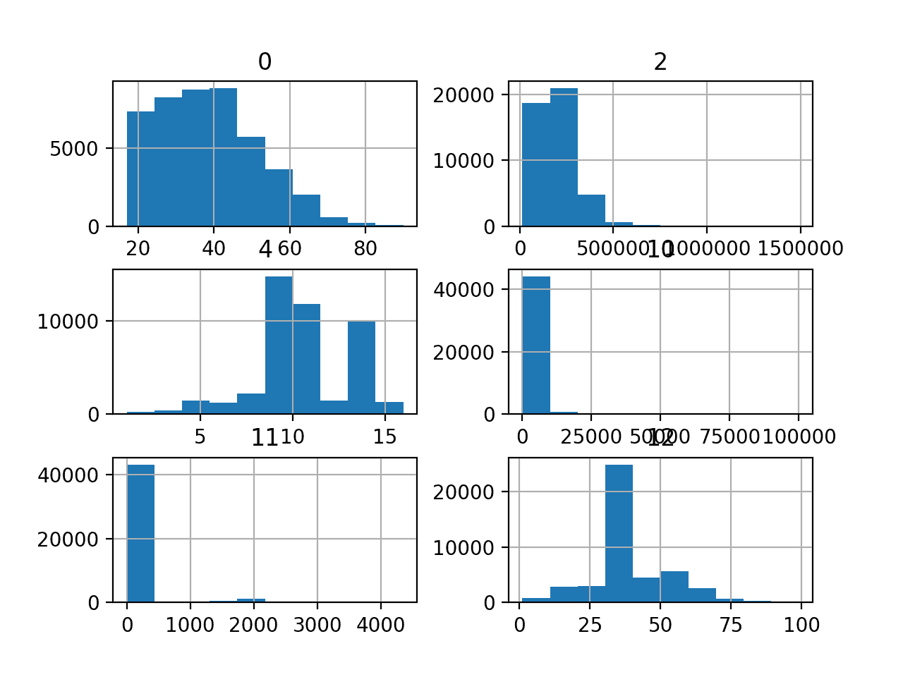
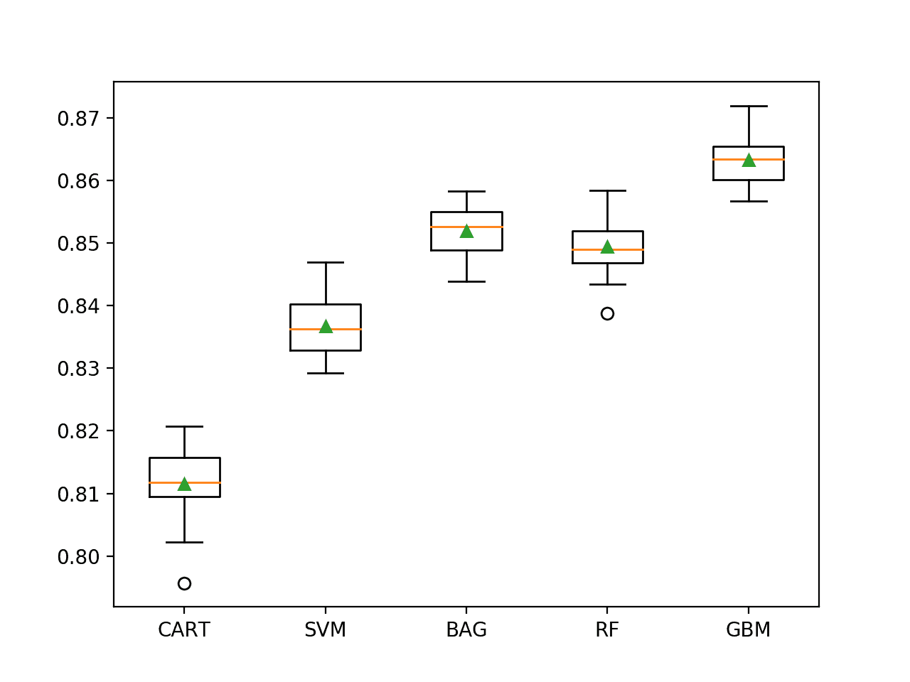

# 成人收入数据集的不平衡分类

> 原文：<https://machinelearningmastery.com/imbalanced-classification-with-the-adult-income-dataset/>

最后更新于 2020 年 10 月 27 日

许多二进制分类任务并不是每个类都有相同数量的例子，例如类分布是倾斜的或者不平衡的。

一个流行的例子是成人收入数据集，该数据集涉及根据关系和教育水平等个人详细信息预测每年高于或低于 5 万美元的个人收入水平。收入低于 5 万美元的案例比高于 5 万美元的案例多得多，尽管这种偏离并不严重。

这意味着可以使用不平衡分类技术，同时仍然可以使用分类准确率来报告模型表现，就像平衡分类问题一样。

在本教程中，您将发现如何为不平衡的成人收入类别数据集开发和评估模型。

完成本教程后，您将知道:

*   如何加载和探索数据集，并为数据准备和模型选择产生想法。
*   如何系统地评估一套具有强大测试工具的机器学习模型。
*   如何拟合最终模型并使用它来预测特定情况下的类标签。

**用我的新书[Python 不平衡分类](https://machinelearningmastery.com/imbalanced-classification-with-python/)启动你的项目**，包括*分步教程*和所有示例的 *Python 源代码*文件。

我们开始吧。


开发一个不平衡的分类模型来预测收入
图片由[科特·埃德布洛姆](https://flickr.com/photos/kirt_edblom/32562259528/)提供，保留部分权利。

## 教程概述

本教程分为五个部分；它们是:

1.  成人收入数据集
2.  浏览数据集
3.  模型测试和基线结果
4.  评估模型
5.  对新数据进行预测

## 成人收入数据集

在这个项目中，我们将使用一个标准的不平衡机器学习数据集，称为“*成人收入*或简称为“ [*成人*](https://archive.ics.uci.edu/ml/datasets/Adult) ”数据集。

数据集由罗尼·科哈维(Ronny Kohavi)和巴里·贝克尔(Barry Becker)获得，取自 1994 年美国人口普查局(T0)的数据，包括使用个人详细信息(如教育水平)来预测个人年收入是高于还是低于 5 万美元。

> 成人数据集来自人口普查局，任务是根据教育、每周工作时间等属性预测给定的成人年收入是否超过 5 万美元..

——[提升朴素贝叶斯分类器的准确性:决策树混合](https://dl.acm.org/citation.cfm?id=3001502)，1996。

数据集提供了 14 个输入变量，它们是分类、序数和数字数据类型的混合。变量的完整列表如下:

*   年龄。
*   工作类。
*   最终重量。
*   教育。
*   教育年限。
*   婚姻状况。
*   职业。
*   关系。
*   种族。
*   做爱。
*   资本收益。
*   资本损失。
*   每周小时数。
*   祖国。

数据集包含用问号字符(？)标记的缺失值).

总共有 48，842 行数据，3，620 行缺少值，剩下 45，222 行完整数据。

有两个类值“ *> 50K* ”和“ *< =50K* ”，意思是一个二分类任务。类别不平衡，偏向“ *< =50K* ”类别标签。

*   **' > 50K'** :多数派，约 25%。
*   **' < =50K'** :少数民族，约 75%。

假设类不平衡不严重，并且两个类标签同等重要，则通常使用分类准确率或分类错误来报告此数据集上的模型表现。

使用预定义的训练集和测试集，报告的良好分类误差约为 14%，分类准确率约为 86%。这可能会在处理此数据集时提供一个目标。

接下来，让我们仔细看看数据。

## 浏览数据集

成人数据集是一个广泛使用的标准机器学习数据集，用于探索和演示许多机器学习算法，包括一般的和专门为不平衡分类设计的算法。

首先，下载数据集并保存在您当前的工作目录中，名称为“*成人-all.csv*

*   [下载成人数据集(成人-all.csv)](https://raw.githubusercontent.com/jbrownlee/Datasets/master/adult-all.csv)

查看文件的内容。

文件的前几行应该如下所示:

```py
39,State-gov,77516,Bachelors,13,Never-married,Adm-clerical,Not-in-family,White,Male,2174,0,40,United-States,<=50K
50,Self-emp-not-inc,83311,Bachelors,13,Married-civ-spouse,Exec-managerial,Husband,White,Male,0,0,13,United-States,<=50K
38,Private,215646,HS-grad,9,Divorced,Handlers-cleaners,Not-in-family,White,Male,0,0,40,United-States,<=50K
53,Private,234721,11th,7,Married-civ-spouse,Handlers-cleaners,Husband,Black,Male,0,0,40,United-States,<=50K
28,Private,338409,Bachelors,13,Married-civ-spouse,Prof-specialty,Wife,Black,Female,0,0,40,Cuba,<=50K
...
```

我们可以看到输入变量是数字和分类或序数数据类型的混合，其中非数字列用字符串表示。至少，分类变量需要是有序的或者单热编码的。

我们还可以看到目标变量是用字符串表示的。对于多数类，此列需要用 0 进行标签编码，对于少数类，需要用 1 进行标签编码，这是二进制不平衡分类任务的习惯。

缺少的值用“*”标记？*'字符。这些值需要估计，或者给定少量示例，可以从数据集中删除这些行。

可以使用 [read_csv()熊猫函数](https://pandas.pydata.org/pandas-docs/stable/reference/api/pandas.read_csv.html)将数据集加载为*数据帧*，指定文件名、没有标题行以及像“*这样的字符串？*'应解析为 *NaN* (缺失)值。

```py
...
# define the dataset location
filename = 'adult-all.csv'
# load the csv file as a data frame
dataframe = read_csv(filename, header=None, na_values='?')
```

加载后，我们可以删除包含一个或多个缺失值的行。

```py
...
# drop rows with missing
dataframe = dataframe.dropna()
```

我们可以通过打印数据框的形状来总结行数和列数。

```py
...
# summarize the shape of the dataset
print(dataframe.shape)
```

我们也可以使用 [Counter 对象](https://docs.python.org/3/library/collections.html#collections.Counter)总结每个类中的例子数量。

```py
...
# summarize the class distribution
target = dataframe.values[:,-1]
counter = Counter(target)
for k,v in counter.items():
	per = v / len(target) * 100
	print('Class=%s, Count=%d, Percentage=%.3f%%' % (k, v, per))
```

将这些联系在一起，下面列出了加载和汇总数据集的完整示例。

```py
# load and summarize the dataset
from pandas import read_csv
from collections import Counter
# define the dataset location
filename = 'adult-all.csv'
# load the csv file as a data frame
dataframe = read_csv(filename, header=None, na_values='?')
# drop rows with missing
dataframe = dataframe.dropna()
# summarize the shape of the dataset
print(dataframe.shape)
# summarize the class distribution
target = dataframe.values[:,-1]
counter = Counter(target)
for k,v in counter.items():
	per = v / len(target) * 100
	print('Class=%s, Count=%d, Percentage=%.3f%%' % (k, v, per))
```

运行该示例首先加载数据集并确认行数和列数，即 45，222 行没有缺失值，14 个输入变量和一个目标变量。

然后总结了班级分布，确认了中等程度的班级不平衡，大多数班级大约为 75%(<=50K) and approximately 25 percent for the minority class (>50K)。

```py
(45222, 15)
Class= <=50K, Count=34014, Percentage=75.216%
Class= >50K, Count=11208, Percentage=24.784%
```

我们还可以通过为每个变量创建直方图来查看数字输入变量的分布。

首先，我们可以通过调用 DataFrame 上的 [select_dtypes()函数](https://pandas.pydata.org/pandas-docs/stable/reference/api/pandas.DataFrame.select_dtypes.html)来选择带有数值变量的列。然后，我们可以从数据框中选择这些列。

```py
...
# select columns with numerical data types
num_ix = df.select_dtypes(include=['int64', 'float64']).columns
# select a subset of the dataframe with the chosen columns
subset = df[num_ix]
```

然后，我们可以创建每个数字输入变量的直方图。下面列出了完整的示例。

```py
# create histograms of numeric input variables
from pandas import read_csv
from matplotlib import pyplot
# define the dataset location
filename = 'adult-all.csv'
# load the csv file as a data frame
df = read_csv(filename, header=None, na_values='?')
# drop rows with missing
df = df.dropna()
# select columns with numerical data types
num_ix = df.select_dtypes(include=['int64', 'float64']).columns
# select a subset of the dataframe with the chosen columns
subset = df[num_ix]
# create a histogram plot of each numeric variable
subset.hist()
pyplot.show()
```

运行该示例会为数据集中的六个输入变量创建带有一个直方图子图的图形。每个子图的标题指示数据帧中的列号(例如零偏移)。

我们可以看到许多不同的分布，有些是类高斯分布，有些是看似指数或离散分布。我们还可以看到，它们似乎都有非常不同的规模。

根据建模算法的选择，我们期望将分布缩放到相同的范围是有用的，并且可能使用一些幂变换。



成人不平衡类别数据集中数值变量的直方图

现在我们已经回顾了数据集，让我们看看开发一个测试工具来评估候选模型。

## 模型测试和基线结果

我们将使用重复的分层 k 折叠交叉验证来评估候选模型。

[k 倍交叉验证程序](https://machinelearningmastery.com/k-fold-cross-validation/)提供了一个良好的模型表现的总体估计，至少与单个列车测试分割相比，不太乐观。我们将使用 k=10，这意味着每个折叠将包含大约 45，222/10，或者大约 4，522 个示例。

分层意味着每个文件夹将包含相同的混合类的例子，即大约 75%到 25%的多数和少数类分别。重复意味着评估过程将执行多次，以帮助避免侥幸结果，并更好地捕捉所选模型的方差。我们将使用三次重复。

这意味着单个模型将被拟合和评估 10 * 3 或 30 次，并且这些运行的平均值和标准偏差将被报告。

这可以使用[repeated stratifiedfold](https://Sklearn.org/stable/modules/generated/sklearn.model_selection.RepeatedStratifiedKFold.html)Sklearn 类来实现。

我们将为每个示例预测一个类标签，并使用分类准确率来衡量模型表现。

下面的 *evaluate_model()* 函数将获取加载的数据集和定义的模型，并使用重复的分层 k 倍交叉验证对其进行评估，然后返回一个准确性分数列表，稍后可以对其进行汇总。

```py
# evaluate a model
def evaluate_model(X, y, model):
	# define evaluation procedure
	cv = RepeatedStratifiedKFold(n_splits=10, n_repeats=3, random_state=1)
	# evaluate model
	scores = cross_val_score(model, X, y, scoring='accuracy', cv=cv, n_jobs=-1)
	return scores
```

我们可以定义一个函数来加载数据集，并对目标列进行标签编码。

我们还将返回一个分类和数字列的列表，以防我们决定以后在拟合模型时转换它们。

```py
# load the dataset
def load_dataset(full_path):
	# load the dataset as a numpy array
	dataframe = read_csv(full_path, header=None, na_values='?')
	# drop rows with missing
	dataframe = dataframe.dropna()
	# split into inputs and outputs
	last_ix = len(dataframe.columns) - 1
	X, y = dataframe.drop(last_ix, axis=1), dataframe[last_ix]
	# select categorical and numerical features
	cat_ix = X.select_dtypes(include=['object', 'bool']).columns
	num_ix = X.select_dtypes(include=['int64', 'float64']).columns
	# label encode the target variable to have the classes 0 and 1
	y = LabelEncoder().fit_transform(y)
	return X.values, y, cat_ix, num_ix
```

最后，我们可以使用这个测试工具在数据集上评估一个基线模型。

当使用分类准确率时，简单模型将预测所有情况下的多数类。这为模型在这个问题上的表现提供了一个基线，通过这个基线可以比较所有其他模型。

这可以通过使用 Sklearn 库中的 [DummyClassifier](https://Sklearn.org/stable/modules/generated/sklearn.dummy.DummyClassifier.html) 类并将“*策略*”参数设置为“*最频繁*”来实现。

```py
...
# define the reference model
model = DummyClassifier(strategy='most_frequent')
```

一旦模型被评估，我们可以直接报告准确性分数的平均值和标准偏差。

```py
...
# evaluate the model
scores = evaluate_model(X, y, model)
# summarize performance
print('Mean Accuracy: %.3f (%.3f)' % (mean(scores), std(scores)))
```

将这些结合起来，下面列出了加载成人数据集、评估基线模型和报告表现的完整示例。

```py
# test harness and baseline model evaluation for the adult dataset
from collections import Counter
from numpy import mean
from numpy import std
from numpy import hstack
from pandas import read_csv
from sklearn.preprocessing import LabelEncoder
from sklearn.model_selection import cross_val_score
from sklearn.model_selection import RepeatedStratifiedKFold
from sklearn.dummy import DummyClassifier

# load the dataset
def load_dataset(full_path):
	# load the dataset as a numpy array
	dataframe = read_csv(full_path, header=None, na_values='?')
	# drop rows with missing
	dataframe = dataframe.dropna()
	# split into inputs and outputs
	last_ix = len(dataframe.columns) - 1
	X, y = dataframe.drop(last_ix, axis=1), dataframe[last_ix]
	# select categorical and numerical features
	cat_ix = X.select_dtypes(include=['object', 'bool']).columns
	num_ix = X.select_dtypes(include=['int64', 'float64']).columns
	# label encode the target variable to have the classes 0 and 1
	y = LabelEncoder().fit_transform(y)
	return X.values, y, cat_ix, num_ix

# evaluate a model
def evaluate_model(X, y, model):
	# define evaluation procedure
	cv = RepeatedStratifiedKFold(n_splits=10, n_repeats=3, random_state=1)
	# evaluate model
	scores = cross_val_score(model, X, y, scoring='accuracy', cv=cv, n_jobs=-1)
	return scores

# define the location of the dataset
full_path = 'adult-all.csv'
# load the dataset
X, y, cat_ix, num_ix = load_dataset(full_path)
# summarize the loaded dataset
print(X.shape, y.shape, Counter(y))
# define the reference model
model = DummyClassifier(strategy='most_frequent')
# evaluate the model
scores = evaluate_model(X, y, model)
# summarize performance
print('Mean Accuracy: %.3f (%.3f)' % (mean(scores), std(scores)))
```

运行该示例首先加载和汇总数据集。

我们可以看到加载了正确的行数。重要的是，我们可以看到类标签具有到整数的正确映射，多数类为 0，少数类为 1，这是不平衡二进制类别数据集的惯例。

接下来，报告平均分类准确度分数。

在这种情况下，我们可以看到基线算法达到了大约 75.2%的准确率。这个分数提供了模特技能的下限；任何平均准确率高于约 75.2%的模型都有技能，而得分低于此值的模型在此数据集上没有技能。

```py
(45222, 14) (45222,) Counter({0: 34014, 1: 11208})
Mean Accuracy: 0.752 (0.000)
```

现在我们已经有了测试工具和表现基线，我们可以开始在这个数据集上评估一些模型了。

## 评估模型

在本节中，我们将使用上一节中开发的测试工具来评估数据集上的一套不同技术。

目标是既演示如何系统地解决问题，又演示为不平衡分类问题设计的一些技术的能力。

报告的表现良好，但没有高度优化(例如，超参数没有调整)。

**你能做得更好吗？**如果你能用同样的测试装具达到更好的分类准确率表现，我很想听听。请在下面的评论中告诉我。

### 评估机器学习算法

让我们从评估数据集上的混合机器学习模型开始。

在数据集上抽查一套不同的非线性算法可能是一个好主意，以便快速找出哪些算法运行良好，值得进一步关注，哪些算法运行不佳。

我们将在成人数据集上评估以下机器学习模型:

*   决策树
*   支持向量机(SVM)
*   袋装决策树
*   随机森林
*   梯度增压机

我们将主要使用默认的模型超参数，除了集成算法中的树的数量，我们将设置为合理的默认值 100。

我们将依次定义每个模型，并将它们添加到一个列表中，以便我们可以顺序评估它们。下面的 *get_models()* 函数定义了用于评估的模型列表，以及用于以后绘制结果的模型简称列表。

```py
# define models to test
def get_models():
	models, names = list(), list()
	# CART
	models.append(DecisionTreeClassifier())
	names.append('CART')
	# SVM
	models.append(SVC(gamma='scale'))
	names.append('SVM')
	# Bagging
	models.append(BaggingClassifier(n_estimators=100))
	names.append('BAG')
	# RF
	models.append(RandomForestClassifier(n_estimators=100))
	names.append('RF')
	# GBM
	models.append(GradientBoostingClassifier(n_estimators=100))
	names.append('GBM')
	return models, names
```

然后，我们可以依次列举模型列表，并对每个模型进行评估，存储分数供以后评估。

我们将使用 [OneHotEncoder](https://Sklearn.org/stable/modules/generated/sklearn.preprocessing.OneHotEncoder.html) 对分类输入变量进行一键编码，并将使用[最小最大缩放器](https://Sklearn.org/stable/modules/generated/sklearn.preprocessing.MinMaxScaler.html)对数字输入变量进行归一化。在交叉验证过程中，这些操作必须在每个训练/测试分割中执行，其中编码和缩放操作适合训练集并应用于训练集和测试集。

实现这一点的一个简单方法是使用[管道](https://Sklearn.org/stable/modules/generated/sklearn.pipeline.Pipeline.html)，其中第一步是[列转换器](https://Sklearn.org/stable/modules/generated/sklearn.compose.ColumnTransformer.html)，它将 *OneHotEncoder* 应用于分类变量，将*最小最大缩放器*应用于数字输入变量。为此，我们需要分类和数字输入变量的列索引列表。

我们在上一节中定义的 *load_dataset()* 函数加载并返回数据集和具有分类和数字数据类型的列列表。这可用于在评估前准备一个*管道*来包装每个模型。首先，定义*列转换器*，它指定要应用于每种类型列的转换，然后这被用作*管道*的第一步，该管道以将要拟合和评估的特定模型结束。

```py
...
# define steps
steps = [('c',OneHotEncoder(handle_unknown='ignore'),cat_ix), ('n',MinMaxScaler(),num_ix)]
# one hot encode categorical, normalize numerical
ct = ColumnTransformer(steps)
# wrap the model i a pipeline
pipeline = Pipeline(steps=[('t',ct),('m',models[i])])
# evaluate the model and store results
scores = evaluate_model(X, y, pipeline)
```

我们可以总结每个算法的平均准确率，这将有助于直接比较算法。

```py
...
# summarize performance
print('>%s %.3f (%.3f)' % (names[i], mean(scores), std(scores)))
```

在运行结束时，我们将为每个算法的结果样本创建一个单独的方框和触须图。这些图将使用相同的 y 轴比例，因此我们可以直接比较结果的分布。

```py
...
# plot the results
pyplot.boxplot(results, labels=names, showmeans=True)
pyplot.show()
```

将所有这些结合起来，下面列出了在成人不平衡数据集上评估一套机器学习算法的完整示例。

```py
# spot check machine learning algorithms on the adult imbalanced dataset
from numpy import mean
from numpy import std
from pandas import read_csv
from matplotlib import pyplot
from sklearn.preprocessing import LabelEncoder
from sklearn.preprocessing import OneHotEncoder
from sklearn.preprocessing import MinMaxScaler
from sklearn.pipeline import Pipeline
from sklearn.compose import ColumnTransformer
from sklearn.model_selection import cross_val_score
from sklearn.model_selection import RepeatedStratifiedKFold
from sklearn.tree import DecisionTreeClassifier
from sklearn.svm import SVC
from sklearn.ensemble import RandomForestClassifier
from sklearn.ensemble import GradientBoostingClassifier
from sklearn.ensemble import BaggingClassifier

# load the dataset
def load_dataset(full_path):
	# load the dataset as a numpy array
	dataframe = read_csv(full_path, header=None, na_values='?')
	# drop rows with missing
	dataframe = dataframe.dropna()
	# split into inputs and outputs
	last_ix = len(dataframe.columns) - 1
	X, y = dataframe.drop(last_ix, axis=1), dataframe[last_ix]
	# select categorical and numerical features
	cat_ix = X.select_dtypes(include=['object', 'bool']).columns
	num_ix = X.select_dtypes(include=['int64', 'float64']).columns
	# label encode the target variable to have the classes 0 and 1
	y = LabelEncoder().fit_transform(y)
	return X.values, y, cat_ix, num_ix

# evaluate a model
def evaluate_model(X, y, model):
	# define evaluation procedure
	cv = RepeatedStratifiedKFold(n_splits=10, n_repeats=3, random_state=1)
	# evaluate model
	scores = cross_val_score(model, X, y, scoring='accuracy', cv=cv, n_jobs=-1)
	return scores

# define models to test
def get_models():
	models, names = list(), list()
	# CART
	models.append(DecisionTreeClassifier())
	names.append('CART')
	# SVM
	models.append(SVC(gamma='scale'))
	names.append('SVM')
	# Bagging
	models.append(BaggingClassifier(n_estimators=100))
	names.append('BAG')
	# RF
	models.append(RandomForestClassifier(n_estimators=100))
	names.append('RF')
	# GBM
	models.append(GradientBoostingClassifier(n_estimators=100))
	names.append('GBM')
	return models, names

# define the location of the dataset
full_path = 'adult-all.csv'
# load the dataset
X, y, cat_ix, num_ix = load_dataset(full_path)
# define models
models, names = get_models()
results = list()
# evaluate each model
for i in range(len(models)):
	# define steps
	steps = [('c',OneHotEncoder(handle_unknown='ignore'),cat_ix), ('n',MinMaxScaler(),num_ix)]
	# one hot encode categorical, normalize numerical
	ct = ColumnTransformer(steps)
	# wrap the model i a pipeline
	pipeline = Pipeline(steps=[('t',ct),('m',models[i])])
	# evaluate the model and store results
	scores = evaluate_model(X, y, pipeline)
	results.append(scores)
	# summarize performance
	print('>%s %.3f (%.3f)' % (names[i], mean(scores), std(scores)))
# plot the results
pyplot.boxplot(results, labels=names, showmeans=True)
pyplot.show()
```

运行该示例依次评估每个算法，并报告平均和标准偏差分类准确率。

**注**:考虑到算法或评估程序的随机性，或数值准确率的差异，您的[结果可能会有所不同](https://machinelearningmastery.com/different-results-each-time-in-machine-learning/)。考虑运行该示例几次，并比较平均结果。

**你考了多少分？**
在下面的评论中发布你的结果。

在这种情况下，我们可以看到所有选择的算法都是熟练的，达到了 75.2%以上的分类准确率。我们可以看到，集成决策树算法表现最好，也许随机梯度提升表现最好，分类准确率约为 86.3%。

这比原始论文中报告的结果稍好，尽管采用了不同的模型评估程序。

```py
>CART 0.812 (0.005)
>SVM 0.837 (0.005)
>BAG 0.852 (0.004)
>RF 0.849 (0.004)
>GBM 0.863 (0.004)
```

创建一个图形，显示每个算法结果样本的一个方框和须图。方框显示中间 50%的数据，每个方框中间的橙色线显示样本的中值，每个方框中的绿色三角形显示样本的平均值。

我们可以看到，每种算法的分数分布似乎都高于约 75%的基线，可能有一些异常值(图中的圆圈)。每种算法的分布看起来都很紧凑，中值和平均值是一致的，这表明模型在这个数据集上非常稳定，分数没有形成偏斜分布。

这突出表明，重要的不仅仅是模型表现的中心趋势，还应该考虑传播甚至最坏情况的结果。尤其是少数民族的例子。



不平衡成人数据集上机器学习模型的盒须图

## 对新数据进行预测

在本节中，我们可以拟合最终模型，并使用它对单行数据进行预测。

我们将使用[梯度提升分类器](https://Sklearn.org/stable/modules/generated/sklearn.ensemble.GradientBoostingClassifier.html)模型作为我们的最终模型，该模型实现了大约 86.3%的分类准确率。拟合最终模型包括定义[列转换器](https://Sklearn.org/stable/modules/generated/sklearn.compose.ColumnTransformer.html)来编码分类变量和缩放数值变量，然后构建[管道](https://Sklearn.org/stable/modules/generated/sklearn.pipeline.Pipeline.html)来在拟合模型之前对训练集执行这些转换。

*管道*然后可以直接用于对新数据进行预测，并将使用与在训练数据集上执行的操作相同的操作来自动编码和缩放新数据。

首先，我们可以将模型定义为管道。

```py
...
# define model to evaluate
model = GradientBoostingClassifier(n_estimators=100)
# one hot encode categorical, normalize numerical
ct = ColumnTransformer([('c',OneHotEncoder(),cat_ix), ('n',MinMaxScaler(),num_ix)])
# define the pipeline
pipeline = Pipeline(steps=[('t',ct), ('m',model)])
```

一旦定义好了，我们就可以在整个训练数据集中使用它。

```py
...
# fit the model
pipeline.fit(X, y)
```

一旦适合，我们可以通过调用 *predict()* 函数来使用它对新数据进行预测。这将为“< =50K”返回类别标签 0，或为“> 50K”返回类别标签 1。

重要的是，我们必须使用*管道*中的*列转换器*来使用相同的转换正确准备新数据。

例如:

```py
...
# define a row of data
row = [...]
# make prediction
yhat = pipeline.predict([row])
```

为了证明这一点，我们可以使用拟合模型对一些我们知道结果的情况下的标签进行一些预测。

下面列出了完整的示例。

```py
# fit a model and make predictions for the on the adult dataset
from pandas import read_csv
from sklearn.preprocessing import LabelEncoder
from sklearn.preprocessing import OneHotEncoder
from sklearn.preprocessing import MinMaxScaler
from sklearn.compose import ColumnTransformer
from sklearn.ensemble import GradientBoostingClassifier
from imblearn.pipeline import Pipeline

# load the dataset
def load_dataset(full_path):
	# load the dataset as a numpy array
	dataframe = read_csv(full_path, header=None, na_values='?')
	# drop rows with missing
	dataframe = dataframe.dropna()
	# split into inputs and outputs
	last_ix = len(dataframe.columns) - 1
	X, y = dataframe.drop(last_ix, axis=1), dataframe[last_ix]
	# select categorical and numerical features
	cat_ix = X.select_dtypes(include=['object', 'bool']).columns
	num_ix = X.select_dtypes(include=['int64', 'float64']).columns
	# label encode the target variable to have the classes 0 and 1
	y = LabelEncoder().fit_transform(y)
	return X.values, y, cat_ix, num_ix

# define the location of the dataset
full_path = 'adult-all.csv'
# load the dataset
X, y, cat_ix, num_ix = load_dataset(full_path)
# define model to evaluate
model = GradientBoostingClassifier(n_estimators=100)
# one hot encode categorical, normalize numerical
ct = ColumnTransformer([('c',OneHotEncoder(),cat_ix), ('n',MinMaxScaler(),num_ix)])
# define the pipeline
pipeline = Pipeline(steps=[('t',ct), ('m',model)])
# fit the model
pipeline.fit(X, y)
# evaluate on some <=50K cases (known class 0)
print('<=50K cases:')
data = [[24, 'Private', 161198, 'Bachelors', 13, 'Never-married', 'Prof-specialty', 'Not-in-family', 'White', 'Male', 0, 0, 25, 'United-States'],
	[23, 'Private', 214542, 'Some-college', 10, 'Never-married', 'Farming-fishing', 'Own-child', 'White', 'Male', 0, 0, 40, 'United-States'],
	[38, 'Private', 309122, '10th', 6, 'Divorced', 'Machine-op-inspct', 'Not-in-family', 'White', 'Female', 0, 0, 40, 'United-States']]
for row in data:
	# make prediction
	yhat = pipeline.predict([row])
	# get the label
	label = yhat[0]
	# summarize
	print('>Predicted=%d (expected 0)' % (label))
# evaluate on some >50K cases (known class 1)
print('>50K cases:')
data = [[55, 'Local-gov', 107308, 'Masters', 14, 'Married-civ-spouse', 'Prof-specialty', 'Husband', 'White', 'Male', 0, 0, 40, 'United-States'],
	[53, 'Self-emp-not-inc', 145419, '1st-4th', 2, 'Married-civ-spouse', 'Exec-managerial', 'Husband', 'White', 'Male', 7688, 0, 67, 'Italy'],
	[44, 'Local-gov', 193425, 'Masters', 14, 'Married-civ-spouse', 'Prof-specialty', 'Wife', 'White', 'Female', 4386, 0, 40, 'United-States']]
for row in data:
	# make prediction
	yhat = pipeline.predict([row])
	# get the label
	label = yhat[0]
	# summarize
	print('>Predicted=%d (expected 1)' % (label))
```

运行该示例首先在整个训练数据集上拟合模型。

然后将用于预测<=50K cases is chosen from the dataset file. We can see that all cases are correctly predicted. Then some > 50K 例标签的拟合模型作为模型的输入，并对标签进行预测。正如我们所希望的，正确的标签是可以预测的。

```py
<=50K cases:
>Predicted=0 (expected 0)
>Predicted=0 (expected 0)
>Predicted=0 (expected 0)
>50K cases:
>Predicted=1 (expected 1)
>Predicted=1 (expected 1)
>Predicted=1 (expected 1)
```

## 进一步阅读

如果您想更深入地了解这个主题，本节将提供更多资源。

### 报纸

*   [提高朴素贝叶斯分类器的准确率:决策树混合](https://dl.acm.org/citation.cfm?id=3001502)，1996。

### 蜜蜂

*   [熊猫。data frame . select _ dt types API](https://pandas.pydata.org/pandas-docs/stable/reference/api/pandas.DataFrame.select_dtypes.html)。
*   [sklearn.model_selection。重复的策略应用编程接口](https://Sklearn.org/stable/modules/generated/sklearn.model_selection.RepeatedStratifiedKFold.html)。
*   [硬化. dummy . dummy class ification API](https://Sklearn.org/stable/modules/generated/sklearn.dummy.DummyClassifier.html)。

### 资料组

*   [成人数据集 CSV](https://raw.githubusercontent.com/jbrownlee/Datasets/master/adult-all.csv) 。
*   [成人数据集描述](https://raw.githubusercontent.com/jbrownlee/Datasets/master/adult.names)。
*   [成人数据集，UCI 机器学习资源库](https://archive.ics.uci.edu/ml/datasets/adult)。

## 摘要

在本教程中，您发现了如何为不平衡的成人收入类别数据集开发和评估模型。

具体来说，您了解到:

*   如何加载和探索数据集，并为数据准备和模型选择产生想法。
*   如何系统地评估一套具有强大测试工具的机器学习模型。
*   如何拟合最终模型并使用它来预测特定情况下的类标签。

你有什么问题吗？
在下面的评论中提问，我会尽力回答。