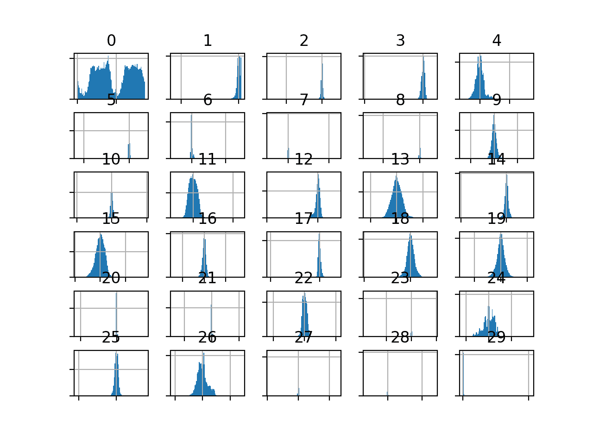
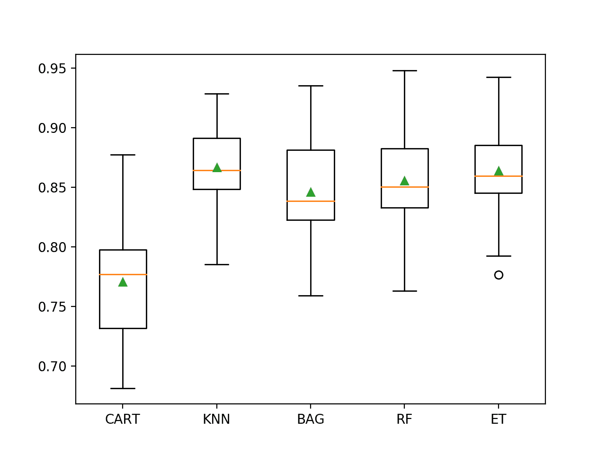

# 欺诈性信用卡交易数据集的不平衡分类

> 原文：<https://machinelearningmastery.com/imbalanced-classification-with-the-fraudulent-credit-card-transactions-dataset/>

最后更新于 2020 年 8 月 21 日

欺诈是信用卡公司的一个主要问题，这既是因为每天完成的交易量很大，也是因为许多欺诈交易看起来很像正常交易。

识别欺诈性信用卡交易是一种常见的不平衡二进制分类，其重点是积极类(即欺诈类)。

因此，当将预测概率映射到类标签时，像准确率和召回率这样的度量可以用来总结类标签方面的模型表现，而准确率-召回率曲线可以用来总结概率阈值范围内的模型表现。

这使得模型的操作者可以控制如何根据模型产生的假阳性或假阴性类型的误差进行预测。

在本教程中，您将发现如何为不平衡的信用卡欺诈数据集开发和评估模型。

完成本教程后，您将知道:

*   如何加载和探索数据集，并为数据准备和模型选择产生想法。
*   如何系统地评估一套具有强大测试工具的机器学习模型。
*   如何拟合最终模型，并使用它来预测特定案例的欺诈概率。

我们开始吧。


如何预测信用卡欺诈交易的概率
图片由[安德里亚·谢弗](https://flickr.com/photos/aschaf/8631407106/)提供，版权所有。

## 教程概述

本教程分为五个部分；它们是:

1.  信用卡欺诈数据集
2.  浏览数据集
3.  模型测试和基线结果
4.  评估模型
5.  对新数据进行预测

## 信用卡欺诈数据集

在这个项目中，我们将使用一个标准的不平衡机器学习数据集，称为“[信用卡欺诈检测](https://www.kaggle.com/mlg-ulb/creditcardfraud)”数据集。

该数据代表了欧洲持卡人在 2013 年 9 月两天内发生的信用卡交易。

该数据集被归功于布鲁塞尔自由大学的机器学习小组和 T2 安德里亚·达尔·波佐洛等人的一套出版物。

持卡人的所有详细信息已通过[主成分分析](https://machinelearningmastery.com/calculate-principal-component-analysis-scratch-python/)(主成分分析)转换匿名化。相反，总共提供了这些匿名特征的 28 个主要成分。此外，还提供了交易间隔的时间(以秒为单位)，以及购买金额(大概以欧元为单位)。

每条记录被分为正常(类别“0”)或欺诈(类别“1”)，交易严重偏向正常。具体而言，在总共 284，807 笔交易中，有 492 笔欺诈性信用卡交易，约占所有交易的 0.172%。

> 它包含两天内发生的在线交易子集，在 284，807 笔交易中，我们有 492 笔欺诈。数据集高度不平衡，正类(欺诈)占所有交易的 0.172%…

——[不平衡分类欠采样校准概率](https://ieeexplore.ieee.org/abstract/document/7376606/)，2015。

一些出版物使用[曲线度量下的 ROC 面积](https://machinelearningmastery.com/roc-curves-and-precision-recall-curves-for-classification-in-python/)，尽管数据集的网站建议使用曲线度量下的准确率-召回面积，因为存在严重的类别不平衡。

> 给定类别不平衡比率，我们建议使用准确率-召回曲线下面积(AUPRC)来测量准确率。

——[信用卡欺诈检测](https://www.kaggle.com/mlg-ulb/creditcardfraud)，卡格尔。

接下来，让我们仔细看看数据。

## 浏览数据集

首先，下载并解压缩数据集，并将其保存在您当前的工作目录中，名称为“ *creditcard.csv* ”。

*   [下载信用卡诈骗(creditcard.csv.zip)](https://raw.githubusercontent.com/jbrownlee/Datasets/master/creditcard.csv.zip)

查看文件的内容。

文件的前几行应该如下所示:

```py
0,-1.3598071336738,-0.0727811733098497,2.53634673796914,1.37815522427443,-0.338320769942518,0.462387777762292,0.239598554061257,0.0986979012610507,0.363786969611213,0.0907941719789316,-0.551599533260813,-0.617800855762348,-0.991389847235408,-0.311169353699879,1.46817697209427,-0.470400525259478,0.207971241929242,0.0257905801985591,0.403992960255733,0.251412098239705,-0.018306777944153,0.277837575558899,-0.110473910188767,0.0669280749146731,0.128539358273528,-0.189114843888824,0.133558376740387,-0.0210530534538215,149.62,"0"
0,1.19185711131486,0.26615071205963,0.16648011335321,0.448154078460911,0.0600176492822243,-0.0823608088155687,-0.0788029833323113,0.0851016549148104,-0.255425128109186,-0.166974414004614,1.61272666105479,1.06523531137287,0.48909501589608,-0.143772296441519,0.635558093258208,0.463917041022171,-0.114804663102346,-0.183361270123994,-0.145783041325259,-0.0690831352230203,-0.225775248033138,-0.638671952771851,0.101288021253234,-0.339846475529127,0.167170404418143,0.125894532368176,-0.00898309914322813,0.0147241691924927,2.69,"0"
1,-1.35835406159823,-1.34016307473609,1.77320934263119,0.379779593034328,-0.503198133318193,1.80049938079263,0.791460956450422,0.247675786588991,-1.51465432260583,0.207642865216696,0.624501459424895,0.066083685268831,0.717292731410831,-0.165945922763554,2.34586494901581,-2.89008319444231,1.10996937869599,-0.121359313195888,-2.26185709530414,0.524979725224404,0.247998153469754,0.771679401917229,0.909412262347719,-0.689280956490685,-0.327641833735251,-0.139096571514147,-0.0553527940384261,-0.0597518405929204,378.66,"0"
1,-0.966271711572087,-0.185226008082898,1.79299333957872,-0.863291275036453,-0.0103088796030823,1.24720316752486,0.23760893977178,0.377435874652262,-1.38702406270197,-0.0549519224713749,-0.226487263835401,0.178228225877303,0.507756869957169,-0.28792374549456,-0.631418117709045,-1.0596472454325,-0.684092786345479,1.96577500349538,-1.2326219700892,-0.208037781160366,-0.108300452035545,0.00527359678253453,-0.190320518742841,-1.17557533186321,0.647376034602038,-0.221928844458407,0.0627228487293033,0.0614576285006353,123.5,"0"
2,-1.15823309349523,0.877736754848451,1.548717846511,0.403033933955121,-0.407193377311653,0.0959214624684256,0.592940745385545,-0.270532677192282,0.817739308235294,0.753074431976354,-0.822842877946363,0.53819555014995,1.3458515932154,-1.11966983471731,0.175121130008994,-0.451449182813529,-0.237033239362776,-0.0381947870352842,0.803486924960175,0.408542360392758,-0.00943069713232919,0.79827849458971,-0.137458079619063,0.141266983824769,-0.206009587619756,0.502292224181569,0.219422229513348,0.215153147499206,69.99,"0"
...
```

请注意，此版本的数据集删除了标题行。如果您[从 Kaggle](https://www.kaggle.com/mlg-ulb/creditcardfraud) 下载数据集，您必须先删除标题行。

我们可以看到第一列是时间，是整数，第二最后一列是购买金额。最后一列包含类标签。我们可以看到，PCA 变换后的特征有正有负，并且包含大量的浮点准确率。

时间列不太可能有用，可能可以删除。主成分分析变量和美元金额之间的比例差异表明，对于那些对输入变量的比例敏感的算法，应该使用数据比例。

可以使用 [read_csv()熊猫](https://pandas.pydata.org/pandas-docs/stable/reference/api/pandas.read_csv.html)函数将数据集加载为数据框，指定列的位置和名称，因为没有标题行。

```py
...
# define the dataset location
filename = 'creditcard.csv'
# load the csv file as a data frame
dataframe = read_csv(filename, header=None)
```

加载后，我们可以通过打印[数据框](https://pandas.pydata.org/pandas-docs/stable/generated/pandas.DataFrame.html)的形状来总结行数和列数。

```py
...
# summarize the shape of the dataset
print(dataframe.shape)
```

我们还可以使用 [Counter](https://docs.python.org/3/library/collections.html) 对象总结每个类中的示例数量。

```py
...
# summarize the class distribution
target = dataframe.values[:,-1]
counter = Counter(target)
for k,v in counter.items():
	per = v / len(target) * 100
	print('Class=%d, Count=%d, Percentage=%.3f%%' % (k, v, per))
```

将这些联系在一起，下面列出了加载和汇总数据集的完整示例。

```py
# load and summarize the dataset
from pandas import read_csv
from collections import Counter
# define the dataset location
filename = 'creditcard.csv'
# load the csv file as a data frame
dataframe = read_csv(filename, header=None)
# summarize the shape of the dataset
print(dataframe.shape)
# summarize the class distribution
target = dataframe.values[:,-1]
counter = Counter(target)
for k,v in counter.items():
	per = v / len(target) * 100
	print('Class=%d, Count=%d, Percentage=%.3f%%' % (k, v, per))
```

运行该示例首先加载数据集并确认行数和列数，它们是 284，807 行、30 个输入变量和 1 个目标变量。

然后总结了类别分布，确认了类别分布的严重偏差，约 99.827%的交易标记为正常，约 0.173%的交易标记为欺诈。这通常与论文中对数据集的描述相匹配。

```py
(284807, 31)
Class=0, Count=284315, Percentage=99.827%
Class=1, Count=492, Percentage=0.173%
```

我们还可以通过为每个变量创建直方图来查看输入变量的分布。

由于大量的变量，图可能看起来很混乱。因此，我们将禁用轴标签，以便我们可以专注于直方图。我们还将增加每个直方图中使用的面元数量，以帮助更好地查看数据分布。

下面列出了创建所有输入变量直方图的完整示例。

```py
# create histograms of input variables
from pandas import read_csv
from matplotlib import pyplot
# define the dataset location
filename = 'creditcard.csv'
# load the csv file as a data frame
df = read_csv(filename, header=None)
# drop the target variable
df = df.drop(30, axis=1)
# create a histogram plot of each numeric variable
ax = df.hist(bins=100)
# disable axis labels to avoid the clutter
for axis in ax.flatten():
	axis.set_xticklabels([])
	axis.set_yticklabels([])
# show the plot
pyplot.show()
```

我们可以看到，大多数主成分分析成分的分布是高斯分布，许多可能以零为中心，这表明变量被标准化为主成分分析变换的一部分。



信用卡欺诈数据集中输入变量的直方图

数量变量可能很有趣，不会出现在直方图上。

这表明金额值的分布可能有偏差。我们可以为这个变量创建一个 5 位数的摘要，以便更好地了解事务大小。

下面列出了完整的示例。

```py
# summarize the amount variable
from pandas import read_csv
# define the dataset location
filename = 'creditcard.csv'
# load the csv file as a data frame
df = read_csv(filename, header=None)
# summarize the amount variable.
print(df[29].describe())
```

运行该示例，我们可以看到大多数数量很小，平均值约为 88，中间 50%的观测值在 5 到 77 之间。

最大值约为 25，691，这拉高了分布，可能是一个异常值(例如，有人用信用卡购买了一辆汽车)。

```py
count    284807.000000
mean         88.349619
std         250.120109
min           0.000000
25%           5.600000
50%          22.000000
75%          77.165000
max       25691.160000
Name: 29, dtype: float64
```

现在我们已经回顾了数据集，让我们看看开发一个测试工具来评估候选模型。

## 模型测试和基线结果

我们将使用重复的分层 k 折叠交叉验证来评估候选模型。

[k 倍交叉验证程序](https://machinelearningmastery.com/k-fold-cross-validation/)提供了一个良好的模型表现的总体估计，至少与单个列车测试分割相比，不太乐观。我们将使用 k=10，这意味着每个折叠将包含大约 284807/10 或 28480 个示例。

分层意味着每个文件夹将包含相同的混合类示例，即正常交易和欺诈交易分别占 99.8%到 0.2%。重复意味着评估过程将执行多次，以帮助避免侥幸结果，并更好地捕捉所选模型的方差。我们将使用 3 次重复。

这意味着单个模型将被拟合和评估 10 * 3 或 30 次，并且这些运行的平均值和标准偏差将被报告。

这可以通过使用[repeated stratifiedfold Sklearn 类](https://Sklearn.org/stable/modules/generated/sklearn.model_selection.RepeatedStratifiedKFold.html)来实现。

我们将使用准确率-召回曲线或 PR AUC 下的推荐面积度量。

这要求给定的算法首先预测一个概率或类似概率的度量。然后，使用准确率和召回率在不同阈值范围内评估预测概率，用于将概率映射到类别标签，并且这些阈值曲线下的区域被报告为模型的表现。

这一指标侧重于正类，这对于如此严重的类失衡是可取的。它还允许最终模型的操作者选择一个阈值，用于将概率映射到类标签(欺诈或非欺诈交易)，从而最好地平衡最终模型的准确率和召回率。

我们可以定义一个函数来加载数据集，并将列分成输入和输出变量。下面的 *load_dataset()* 函数实现了这一点。

```py
# load the dataset
def load_dataset(full_path):
	# load the dataset as a numpy array
	data = read_csv(full_path, header=None)
	# retrieve numpy array
	data = data.values
	# split into input and output elements
	X, y = data[:, :-1], data[:, -1]
	return X, y
```

然后，我们可以定义一个函数，为给定的一组预测计算曲线下的准确率-召回面积。

这包括首先通过[准确率 _ 召回 _ 曲线()](https://Sklearn.org/stable/modules/generated/sklearn.metrics.precision_recall_curve.html)函数计算预测的准确率-召回曲线。然后，每个阈值的输出召回率和准确率值可以作为参数提供给 [auc()](https://Sklearn.org/stable/modules/generated/sklearn.metrics.auc.html) 以计算曲线下的面积。下面的 *pr_auc()* 函数实现了这一点。

```py
# calculate precision-recall area under curve
def pr_auc(y_true, probas_pred):
	# calculate precision-recall curve
	p, r, _ = precision_recall_curve(y_true, probas_pred)
	# calculate area under curve
	return auc(r, p)
```

然后，我们可以定义一个函数来评估数据集上的给定模型，并返回每次折叠和重复的 PR AUC 分数列表。

下面的 *evaluate_model()* 函数实现了这一点，将数据集和模型作为参数，返回分数列表。 [make_scorer()函数](https://Sklearn.org/stable/modules/generated/sklearn.metrics.make_scorer.html)用于定义精确-召回 AUC 度量，并指示模型必须预测概率才能被评估。

```py
# evaluate a model
def evaluate_model(X, y, model):
	# define evaluation procedure
	cv = RepeatedStratifiedKFold(n_splits=10, n_repeats=3, random_state=1)
	# define the model evaluation the metric
	metric = make_scorer(pr_auc, needs_proba=True)
	# evaluate model
	scores = cross_val_score(model, X, y, scoring=metric, cv=cv, n_jobs=-1)
	return scores
```

最后，我们可以使用这个测试工具在数据集上评估一个基线模型。

当使用曲线度量下的精确召回区域时，预测所有示例的正类(类 1)的模型将提供基线表现。

这可以通过使用 Sklearn 库中的 [DummyClassifier](https://Sklearn.org/stable/modules/generated/sklearn.dummy.DummyClassifier.html) 类，并将“*策略*”参数设置为“*常量*”并将“*常量*参数设置为“1”来预测正类来实现。

```py
...
# define the reference model
model = DummyClassifier(strategy='constant', constant=1)
```

一旦模型被评估，我们可以直接报告 PR AUC 分数的平均值和标准差。

```py
...
# evaluate the model
scores = evaluate_model(X, y, model)
# summarize performance
print('Mean PR AUC: %.3f (%.3f)' % (mean(scores), std(scores)))
```

将这些结合起来，下面列出了加载数据集、评估基线模型和报告表现的完整示例。

```py
# test harness and baseline model evaluation for the credit dataset
from collections import Counter
from numpy import mean
from numpy import std
from pandas import read_csv
from sklearn.model_selection import cross_val_score
from sklearn.model_selection import RepeatedStratifiedKFold
from sklearn.metrics import precision_recall_curve
from sklearn.metrics import auc
from sklearn.metrics import make_scorer
from sklearn.dummy import DummyClassifier

# load the dataset
def load_dataset(full_path):
	# load the dataset as a numpy array
	data = read_csv(full_path, header=None)
	# retrieve numpy array
	data = data.values
	# split into input and output elements
	X, y = data[:, :-1], data[:, -1]
	return X, y

# calculate precision-recall area under curve
def pr_auc(y_true, probas_pred):
	# calculate precision-recall curve
	p, r, _ = precision_recall_curve(y_true, probas_pred)
	# calculate area under curve
	return auc(r, p)

# evaluate a model
def evaluate_model(X, y, model):
	# define evaluation procedure
	cv = RepeatedStratifiedKFold(n_splits=10, n_repeats=3, random_state=1)
	# define the model evaluation the metric
	metric = make_scorer(pr_auc, needs_proba=True)
	# evaluate model
	scores = cross_val_score(model, X, y, scoring=metric, cv=cv, n_jobs=-1)
	return scores

# define the location of the dataset
full_path = 'creditcard.csv'
# load the dataset
X, y = load_dataset(full_path)
# summarize the loaded dataset
print(X.shape, y.shape, Counter(y))
# define the reference model
model = DummyClassifier(strategy='constant', constant=1)
# evaluate the model
scores = evaluate_model(X, y, model)
# summarize performance
print('Mean PR AUC: %.3f (%.3f)' % (mean(scores), std(scores)))
```

运行该示例首先加载和汇总数据集。

我们可以看到加载了正确的行数，并且有 30 个输入变量。

接下来，报告 PR AUC 分数的平均值。

在这种情况下，我们可以看到基线算法实现的平均 PR AUC 约为 0.501。

这个分数提供了模特技能的下限；任何平均 PR AUC 达到 0.5 以上的模型都有技能，而得分低于这个值的模型在这个数据集上没有技能。

```py
(284807, 30) (284807,) Counter({0.0: 284315, 1.0: 492})
Mean PR AUC: 0.501 (0.000)
```

现在我们已经有了测试工具和表现基线，我们可以开始在这个数据集上评估一些模型了。

## 评估模型

在本节中，我们将使用上一节中开发的测试工具来评估数据集上的一套不同技术。

目标是既演示如何系统地解决问题，又演示为不平衡分类问题设计的一些技术的能力。

报告的表现良好，但没有高度优化(例如，超参数没有调整)。

**你能做得更好吗？**如果你能用同样的测试装具达到更好的 PR AUC 表现，我很想听听。请在下面的评论中告诉我。

### 评估机器学习算法

让我们从评估数据集上的混合机器学习模型开始。

在数据集上抽查一套不同的非线性算法可能是一个好主意，以便快速找出哪些算法运行良好，值得进一步关注，哪些算法不运行。

我们将在信用卡欺诈数据集上评估以下机器学习模型:

*   决策树
*   k 近邻(KNN)
*   袋装决策树
*   随机森林
*   额外树

我们将主要使用默认的模型超参数，除了集成算法中的树的数量，我们将设置为合理的默认值 100。在将输入变量作为输入提供给 KNN 算法之前，我们还将对它们进行标准化。

我们将依次定义每个模型，并将它们添加到一个列表中，以便我们可以顺序评估它们。下面的 *get_models()* 函数定义了用于评估的模型列表，以及用于以后绘制结果的模型简称列表。

```py
# define models to test
def get_models():
	models, names = list(), list()
	# CART
	models.append(DecisionTreeClassifier())
	names.append('CART')
	# KNN
	steps = [('s',StandardScaler()),('m',KNeighborsClassifier())]
	models.append(Pipeline(steps=steps))
	names.append('KNN')
	# Bagging
	models.append(BaggingClassifier(n_estimators=100))
	names.append('BAG')
	# RF
	models.append(RandomForestClassifier(n_estimators=100))
	names.append('RF')
	# ET
	models.append(ExtraTreesClassifier(n_estimators=100))
	names.append('ET')
	return models, names
```

然后，我们可以依次列举模型列表，并对每个模型进行评估，存储分数供以后评估。

```py
...
# define models
models, names = get_models()
results = list()
# evaluate each model
for i in range(len(models)):
	# evaluate the model and store results
	scores = evaluate_model(X, y, models[i])
	results.append(scores)
	# summarize performance
	print('>%s %.3f (%.3f)' % (names[i], mean(scores), std(scores)))
```

在运行结束时，我们可以将每个分数样本绘制成一个方框，并用相同的比例绘制晶须图，这样我们就可以直接比较分布。

```py
...
# plot the results
pyplot.boxplot(results, labels=names, showmeans=True)
pyplot.show()
```

将所有这些结合起来，下面列出了在信用卡欺诈数据集上评估一套机器学习算法的完整示例。

```py
# spot check machine learning algorithms on the credit card fraud dataset
from numpy import mean
from numpy import std
from pandas import read_csv
from matplotlib import pyplot
from sklearn.preprocessing import StandardScaler
from sklearn.pipeline import Pipeline
from sklearn.model_selection import cross_val_score
from sklearn.model_selection import RepeatedStratifiedKFold
from sklearn.metrics import precision_recall_curve
from sklearn.metrics import auc
from sklearn.metrics import make_scorer
from sklearn.tree import DecisionTreeClassifier
from sklearn.neighbors import KNeighborsClassifier
from sklearn.ensemble import RandomForestClassifier
from sklearn.ensemble import ExtraTreesClassifier
from sklearn.ensemble import BaggingClassifier

# load the dataset
def load_dataset(full_path):
	# load the dataset as a numpy array
	data = read_csv(full_path, header=None)
	# retrieve numpy array
	data = data.values
	# split into input and output elements
	X, y = data[:, :-1], data[:, -1]
	return X, y

# calculate precision-recall area under curve
def pr_auc(y_true, probas_pred):
	# calculate precision-recall curve
	p, r, _ = precision_recall_curve(y_true, probas_pred)
	# calculate area under curve
	return auc(r, p)

# evaluate a model
def evaluate_model(X, y, model):
	# define evaluation procedure
	cv = RepeatedStratifiedKFold(n_splits=10, n_repeats=3, random_state=1)
	# define the model evaluation the metric
	metric = make_scorer(pr_auc, needs_proba=True)
	# evaluate model
	scores = cross_val_score(model, X, y, scoring=metric, cv=cv, n_jobs=-1)
	return scores

# define models to test
def get_models():
	models, names = list(), list()
	# CART
	models.append(DecisionTreeClassifier())
	names.append('CART')
	# KNN
	steps = [('s',StandardScaler()),('m',KNeighborsClassifier())]
	models.append(Pipeline(steps=steps))
	names.append('KNN')
	# Bagging
	models.append(BaggingClassifier(n_estimators=100))
	names.append('BAG')
	# RF
	models.append(RandomForestClassifier(n_estimators=100))
	names.append('RF')
	# ET
	models.append(ExtraTreesClassifier(n_estimators=100))
	names.append('ET')
	return models, names

# define the location of the dataset
full_path = 'creditcard.csv'
# load the dataset
X, y = load_dataset(full_path)
# define models
models, names = get_models()
results = list()
# evaluate each model
for i in range(len(models)):
	# evaluate the model and store results
	scores = evaluate_model(X, y, models[i])
	results.append(scores)
	# summarize performance
	print('>%s %.3f (%.3f)' % (names[i], mean(scores), std(scores)))
# plot the results
pyplot.boxplot(results, labels=names, showmeans=True)
pyplot.show()
```

运行该示例依次评估每个算法，并报告平均值和标准差。

**注**:考虑到算法或评估程序的随机性，或数值准确率的差异，您的[结果可能会有所不同](https://machinelearningmastery.com/different-results-each-time-in-machine-learning/)。考虑运行该示例几次，并比较平均结果。

在这种情况下，我们可以看到所有测试的算法都有技巧，实现了高于默认值 0.5 的 PR AUC。结果表明，决策树算法的集成在该数据集上表现良好，尽管数据集标准化的 KNN 似乎平均表现最好。

```py
>CART 0.771 (0.049)
>KNN 0.867 (0.033)
>BAG 0.846 (0.045)
>RF 0.855 (0.046)
>ET 0.864 (0.040)
```

创建一个图形，显示每个算法结果样本的一个方框和须图。方框显示中间 50%的数据，每个方框中间的橙色线显示样本的中值，每个方框中的绿色三角形显示样本的平均值。

我们可以看到，决策树的 KNN 和集成的分数分布是紧密的，平均值似乎与中间值一致，这表明分布可能是对称的，可能是高斯分布，并且分数可能相当稳定。



不平衡信用卡欺诈数据集上机器学习模型的盒须图

既然我们已经看到了如何在这个数据集上评估模型，让我们看看如何使用最终模型来进行预测。

## 对新数据进行预测

在本节中，我们可以拟合最终模型，并使用它对单行数据进行预测。

我们将使用 KNN 模型作为最终模型，该模型的 PR AUC 约为 0.867。拟合最终模型包括在拟合模型之前定义一个管道来缩放数值变量。

然后，管道可用于直接对新数据进行预测，并将使用对训练数据集执行的相同操作自动缩放新数据。

首先，我们可以将模型定义为管道。

```py
...
# define model to evaluate
model = KNeighborsClassifier()
# scale, then fit model
pipeline = Pipeline(steps=[('s',StandardScaler()), ('m',model)])
```

一旦定义好了，我们就可以在整个训练数据集中使用它。

```py
...
# fit the model
pipeline.fit(X, y)
```

一旦拟合，我们可以通过调用 *predict_proba()* 函数来使用它对新数据进行预测。这将返回每个类的概率。

我们可以检索正类的预测概率，模型的操作者可能会用它来解释预测。

例如:

```py
...
# define a row of data
row = [...]
yhat = pipeline.predict_proba([row])
# get the probability for the positive class
result = yhat[0][1]
```

为了证明这一点，我们可以使用拟合模型对一些我们知道结果的情况下的标签进行一些预测。

下面列出了完整的示例。

```py
# fit a model and make predictions for the on the credit card fraud dataset
from pandas import read_csv
from sklearn.preprocessing import StandardScaler
from sklearn.neighbors import KNeighborsClassifier
from sklearn.pipeline import Pipeline

# load the dataset
def load_dataset(full_path):
	# load the dataset as a numpy array
	data = read_csv(full_path, header=None)
	# retrieve numpy array
	data = data.values
	# split into input and output elements
	X, y = data[:, :-1], data[:, -1]
	return X, y

# define the location of the dataset
full_path = 'creditcard.csv'
# load the dataset
X, y = load_dataset(full_path)
# define model to evaluate
model = KNeighborsClassifier()
# scale, then fit model
pipeline = Pipeline(steps=[('s',StandardScaler()), ('m',model)])
# fit the model
pipeline.fit(X, y)
# evaluate on some normal cases (known class 0)
print('Normal cases:')
data = [[0,-1.3598071336738,-0.0727811733098497,2.53634673796914,1.37815522427443,-0.338320769942518,0.462387777762292,0.239598554061257,0.0986979012610507,0.363786969611213,0.0907941719789316,-0.551599533260813,-0.617800855762348,-0.991389847235408,-0.311169353699879,1.46817697209427,-0.470400525259478,0.207971241929242,0.0257905801985591,0.403992960255733,0.251412098239705,-0.018306777944153,0.277837575558899,-0.110473910188767,0.0669280749146731,0.128539358273528,-0.189114843888824,0.133558376740387,-0.0210530534538215,149.62],
	[0,1.19185711131486,0.26615071205963,0.16648011335321,0.448154078460911,0.0600176492822243,-0.0823608088155687,-0.0788029833323113,0.0851016549148104,-0.255425128109186,-0.166974414004614,1.61272666105479,1.06523531137287,0.48909501589608,-0.143772296441519,0.635558093258208,0.463917041022171,-0.114804663102346,-0.183361270123994,-0.145783041325259,-0.0690831352230203,-0.225775248033138,-0.638671952771851,0.101288021253234,-0.339846475529127,0.167170404418143,0.125894532368176,-0.00898309914322813,0.0147241691924927,2.69],
	[1,-1.35835406159823,-1.34016307473609,1.77320934263119,0.379779593034328,-0.503198133318193,1.80049938079263,0.791460956450422,0.247675786588991,-1.51465432260583,0.207642865216696,0.624501459424895,0.066083685268831,0.717292731410831,-0.165945922763554,2.34586494901581,-2.89008319444231,1.10996937869599,-0.121359313195888,-2.26185709530414,0.524979725224404,0.247998153469754,0.771679401917229,0.909412262347719,-0.689280956490685,-0.327641833735251,-0.139096571514147,-0.0553527940384261,-0.0597518405929204,378.66]]
for row in data:
	# make prediction
	yhat = pipeline.predict_proba([row])
	# get the probability for the positive class
	result = yhat[0][1]
	# summarize
	print('>Predicted=%.3f (expected 0)' % (result))
# evaluate on some fraud cases (known class 1)
print('Fraud cases:')
data = [[406,-2.3122265423263,1.95199201064158,-1.60985073229769,3.9979055875468,-0.522187864667764,-1.42654531920595,-2.53738730624579,1.39165724829804,-2.77008927719433,-2.77227214465915,3.20203320709635,-2.89990738849473,-0.595221881324605,-4.28925378244217,0.389724120274487,-1.14074717980657,-2.83005567450437,-0.0168224681808257,0.416955705037907,0.126910559061474,0.517232370861764,-0.0350493686052974,-0.465211076182388,0.320198198514526,0.0445191674731724,0.177839798284401,0.261145002567677,-0.143275874698919,0],
	[7519,1.23423504613468,3.0197404207034,-4.30459688479665,4.73279513041887,3.62420083055386,-1.35774566315358,1.71344498787235,-0.496358487073991,-1.28285782036322,-2.44746925511151,2.10134386504854,-4.6096283906446,1.46437762476188,-6.07933719308005,-0.339237372732577,2.58185095378146,6.73938438478335,3.04249317830411,-2.72185312222835,0.00906083639534526,-0.37906830709218,-0.704181032215427,-0.656804756348389,-1.63265295692929,1.48890144838237,0.566797273468934,-0.0100162234965625,0.146792734916988,1],
	[7526,0.00843036489558254,4.13783683497998,-6.24069657194744,6.6757321631344,0.768307024571449,-3.35305954788994,-1.63173467271809,0.15461244822474,-2.79589246446281,-6.18789062970647,5.66439470857116,-9.85448482287037,-0.306166658250084,-10.6911962118171,-0.638498192673322,-2.04197379107768,-1.12905587703585,0.116452521226364,-1.93466573889727,0.488378221134715,0.36451420978479,-0.608057133838703,-0.539527941820093,0.128939982991813,1.48848121006868,0.50796267782385,0.735821636119662,0.513573740679437,1]]
for row in data:
	# make prediction
	yhat = pipeline.predict_proba([row])
	# get the probability for the positive class
	result = yhat[0][1]
	# summarize
	print('>Predicted=%.3f (expected 1)' % (result))
```

运行该示例首先在整个训练数据集上拟合模型。

然后使用拟合模型来预测从数据集文件中选择的正常病例的标签。我们可以看到所有的情况都是正确预测的。

然后将一些欺诈案例作为模型的输入，并对标签进行预测。正如我们可能希望的那样，大多数示例都是用默认阈值正确预测的。这突出了模型用户选择适当概率阈值的需要。

正常情况:

```py
>Predicted=0.000 (expected 0)
>Predicted=0.000 (expected 0)
>Predicted=0.000 (expected 0)
Fraud cases:
>Predicted=1.000 (expected 1)
>Predicted=0.400 (expected 1)
>Predicted=1.000 (expected 1)
```

## 进一步阅读

如果您想更深入地了解这个主题，本节将提供更多资源。

### 报纸

*   [不平衡分类欠采样校准概率](https://ieeexplore.ieee.org/abstract/document/7376606/)，2015。

### 蜜蜂

*   [熊猫. read_csv API](https://pandas.pydata.org/pandas-docs/stable/reference/api/pandas.read_csv.html) 。
*   [sklearn . metrics . precision _ recall _ curve API](https://Sklearn.org/stable/modules/generated/sklearn.metrics.precision_recall_curve.html)。
*   硬化.公制.无 API 。
*   [sklearn . metrics . make _ scorer API](https://Sklearn.org/stable/modules/generated/sklearn.metrics.make_scorer.html)。
*   [硬化. dummy . dummy class ification API](https://Sklearn.org/stable/modules/generated/sklearn.dummy.DummyClassifier.html)。

### 资料组

*   [信用卡欺诈检测，卡格尔](https://www.kaggle.com/mlg-ulb/creditcardfraud)。
*   [信用卡诈骗数据集下载](https://raw.githubusercontent.com/jbrownlee/Datasets/master/creditcard.csv.zip)。

## 摘要

在本教程中，您发现了如何为不平衡的信用卡欺诈类别数据集开发和评估模型。

具体来说，您了解到:

*   如何加载和探索数据集，并为数据准备和模型选择产生想法。
*   如何系统地评估一套具有强大测试工具的机器学习模型。
*   如何拟合最终模型，并使用它来预测特定案例的欺诈概率。

你有什么问题吗？
在下面的评论中提问，我会尽力回答。