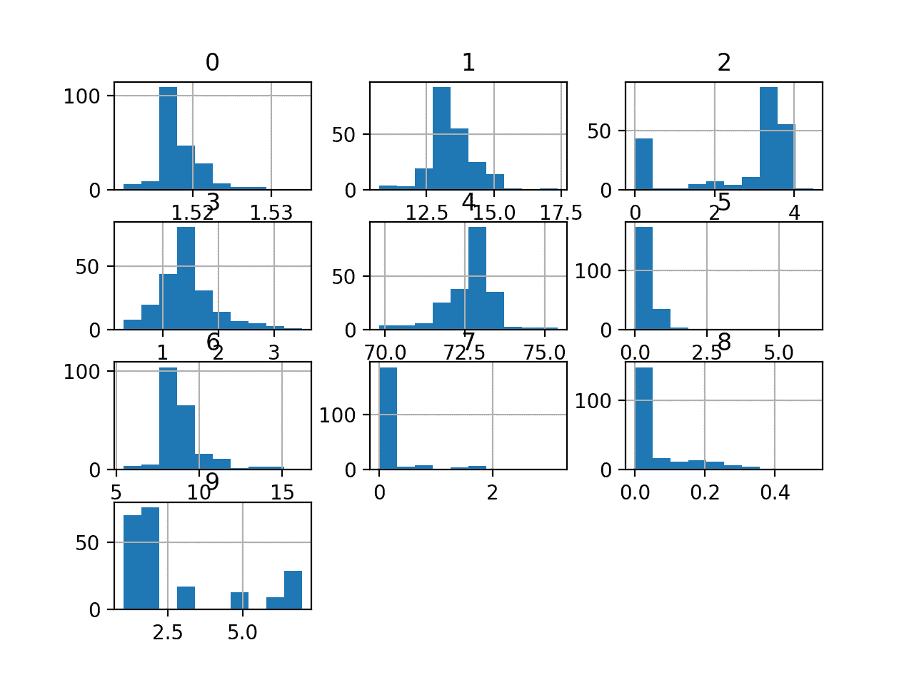
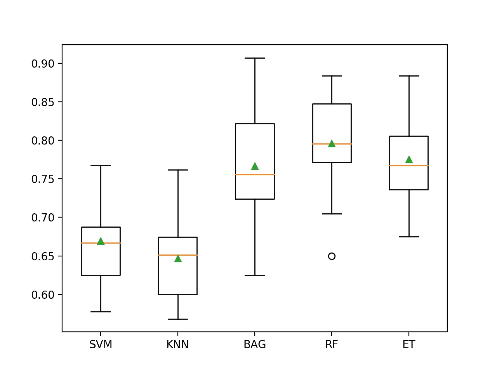

# 玻璃识别数据集的不平衡多类分类

> 原文：<https://machinelearningmastery.com/imbalanced-multiclass-classification-with-the-glass-identification-dataset/>

最后更新于 2020 年 8 月 21 日

多类分类问题是指一个标签必须被预测，但是有两个以上的标签可以被预测。

这些都是具有挑战性的预测建模问题，因为一个模型学习问题需要足够数量的每个类的代表性例子。当每个类中的例子数量不平衡，或者偏向一个或几个类，而其他类的例子很少时，这就变得很有挑战性。

这类问题被称为不平衡多类分类问题，它们需要仔细设计评估指标和测试工具，并选择机器学习模型。玻璃识别数据集是探索不平衡多类分类挑战的标准数据集。

在本教程中，您将发现如何为不平衡的多玻璃识别数据集开发和评估模型。

完成本教程后，您将知道:

*   如何加载和探索数据集，并为数据准备和模型选择产生想法。
*   如何系统地评估一套具有强大测试工具的机器学习模型。
*   如何拟合最终模型并使用它来预测特定示例的类标签。

**用我的新书[Python 不平衡分类](https://machinelearningmastery.com/imbalanced-classification-with-python/)启动你的项目**，包括*分步教程*和所有示例的 *Python 源代码*文件。

我们开始吧。

*   **更新君/2020** :增加了一个实现更好表现的例子。


评估不平衡多玻璃识别数据集的模型
图片由[莎拉·尼科尔斯](https://flickr.com/photos/pocheco/14906013416/)提供，保留部分权利。

## 教程概述

本教程分为五个部分；它们是:

1.  玻璃识别数据集
2.  浏览数据集
3.  模型测试和基线结果
4.  评估模型
    1.  评估机器学习算法
    2.  改进的型号(新)
5.  对新数据进行预测

## 玻璃识别数据集

在这个项目中，我们将使用一个标准的不平衡机器学习数据集，称为“*玻璃识别*”数据集，或简称为“*玻璃*”

该数据集描述了玻璃的化学性质，并涉及使用玻璃样品的化学性质将其分类为六个类别之一。该数据集于 1987 年被记入维娜·斯皮勒名下。

忽略样本识别号，有九个输入变量总结了玻璃数据集的属性；它们是:

*   **RI** :折射率
*   na:钠
*   **镁**:镁
*   **铝**:铝
*   **硅**:硅
*   **K** :钾
*   **钙**:钙
*   **钡**:钡
*   **铁**:铁

化学成分以相应氧化物的重量百分比来测量。

列出了七种类型的玻璃；它们是:

*   **1 级**:建筑窗户(彩车加工)
*   **2 级**:建筑窗户(非浮法加工)
*   **3 级**:车窗(浮法处理)
*   **4 级**:车窗(非浮动加工)
*   **第 5 类**:容器
*   **第 6 类**:餐具
*   **7 级**:大灯

[浮法玻璃](https://en.wikipedia.org/wiki/Float_glass)是指用来制作玻璃的工艺。

数据集中有 214 个观测值，每个类中的观测值数量不平衡。请注意，数据集中没有类别 4(非浮动处理的车窗)的示例。

*   **第 1 类** : 70 例
*   **第二类** : 76 例
*   **第三类** : 17 例
*   **第 4 类** : 0 例
*   **第 5 类** : 13 例
*   **第 6 类** : 9 例
*   **第 7 类** : 29 例

虽然有少数类，但在这个预测问题中，所有类都同等重要。

数据集可分为窗玻璃(1-4 类)和非窗玻璃(5-7 类)。窗玻璃有 163 个例子，非窗玻璃有 51 个例子。

*   **窗玻璃** : 163 个例子
*   **非窗玻璃** : 51 例

观察的另一个部分是浮法加工玻璃和非浮法加工玻璃，仅针对窗户玻璃。这种划分更加平衡。

*   **浮法玻璃** : 87 例
*   **非浮法玻璃** : 76 例

接下来，让我们仔细看看数据。

## 浏览数据集

首先，下载数据集并保存在您当前的工作目录中，名称为“ *glass.csv* ”。

请注意，此版本的数据集删除了第一个列(行)号，因为它不包含用于建模的通用信息。

*   [下载玻璃识别数据集(glass.csv)](https://raw.githubusercontent.com/jbrownlee/Datasets/master/glass.csv)

查看文件的内容。

文件的前几行应该如下所示:

```py
1.52101,13.64,4.49,1.10,71.78,0.06,8.75,0.00,0.00,1
1.51761,13.89,3.60,1.36,72.73,0.48,7.83,0.00,0.00,1
1.51618,13.53,3.55,1.54,72.99,0.39,7.78,0.00,0.00,1
1.51766,13.21,3.69,1.29,72.61,0.57,8.22,0.00,0.00,1
1.51742,13.27,3.62,1.24,73.08,0.55,8.07,0.00,0.00,1
...
```

我们可以看到输入变量是数字，类标签是整数，在最后一列。

所有的化学输入变量都有相同的单位，尽管第一个变量折射率有不同的单位。因此，一些建模算法可能需要数据缩放。

可以使用 [read_csv()熊猫函数](https://pandas.pydata.org/pandas-docs/stable/reference/api/pandas.read_csv.html)将数据集加载为数据帧，指定数据集的位置和没有标题行的事实。

```py
...
# define the dataset location
filename = 'glass.csv'
# load the csv file as a data frame
dataframe = read_csv(filename, header=None)
```

加载后，我们可以通过打印*数据框*的形状来总结行数和列数。

```py
...
# summarize the shape of the dataset
print(dataframe.shape)
```

我们还可以使用 [Counter](https://docs.python.org/3/library/collections.html) 对象总结每个类中的示例数量。

```py
...
# summarize the class distribution
target = dataframe.values[:,-1]
counter = Counter(target)
for k,v in counter.items():
	per = v / len(target) * 100
	print('Class=%d, Count=%d, Percentage=%.3f%%' % (k, v, per))
```

将这些联系在一起，下面列出了加载和汇总数据集的完整示例。

```py
# load and summarize the dataset
from pandas import read_csv
from collections import Counter
# define the dataset location
filename = 'glass.csv'
# load the csv file as a data frame
dataframe = read_csv(filename, header=None)
# summarize the shape of the dataset
print(dataframe.shape)
# summarize the class distribution
target = dataframe.values[:,-1]
counter = Counter(target)
for k,v in counter.items():
	per = v / len(target) * 100
	print('Class=%d, Count=%d, Percentage=%.3f%%' % (k, v, per))
```

运行该示例首先加载数据集并确认行数和列数，它们是 214 行、9 个输入变量和 1 个目标变量。

然后总结类别分布，确认每个类别的观测值存在严重偏差。

```py
(214, 10)
Class=1, Count=70, Percentage=32.710%
Class=2, Count=76, Percentage=35.514%
Class=3, Count=17, Percentage=7.944%
Class=5, Count=13, Percentage=6.075%
Class=6, Count=9, Percentage=4.206%
Class=7, Count=29, Percentage=13.551%
```

我们还可以通过为每个变量创建直方图来查看输入变量的分布。

下面列出了创建所有变量直方图的完整示例。

```py
# create histograms of all variables
from pandas import read_csv
from matplotlib import pyplot
# define the dataset location
filename = 'glass.csv'
# load the csv file as a data frame
df = read_csv(filename, header=None)
# create a histogram plot of each variable
df.hist()
# show the plot
pyplot.show()
```

我们可以看到，一些变量具有类似[高斯分布](https://machinelearningmastery.com/continuous-probability-distributions-for-machine-learning/)，而其他变量似乎具有指数甚至双峰分布。

根据算法的选择，数据可能会受益于某些变量的标准化，或许还会受益于幂变换。



玻璃识别数据集中变量的直方图

现在我们已经回顾了数据集，让我们看看开发一个测试工具来评估候选模型。

## 模型测试和基线结果

我们将使用重复的分层 k 折叠交叉验证来评估候选模型。

[k 倍交叉验证](https://machinelearningmastery.com/k-fold-cross-validation/)程序提供了一个良好的模型表现的总体估计，至少与单个列车测试分割相比，不会过于乐观。我们将使用 k=5，这意味着每个折叠将包含大约 214/5，或者大约 42 个示例。

分层意味着每个文件夹的目标是按类包含与整个训练数据集相同的混合示例。重复意味着评估过程将执行多次，以帮助避免侥幸结果，并更好地捕捉所选模型的方差。我们将使用三次重复。

这意味着单个模型将被拟合和评估 5 * 3 或 15 次，并且这些运行的平均值和标准偏差将被报告。

这可以使用[repeated stratifiedfold](https://Sklearn.org/stable/modules/generated/sklearn.model_selection.RepeatedStratifiedKFold.html)Sklearn 类来实现。

所有的课都同等重要。少数类只占数据的 4%或 6%，但没有一个类在数据集中的优势超过 35%。

因此，在这种情况下，我们将使用分类准确率来评估模型。

首先，我们可以定义一个函数来加载数据集，并将输入变量分成输入和输出变量，并使用标签编码器来确保类标签从 0 到 5 按顺序编号。

```py
# load the dataset
def load_dataset(full_path):
	# load the dataset as a numpy array
	data = read_csv(full_path, header=None)
	# retrieve numpy array
	data = data.values
	# split into input and output elements
	X, y = data[:, :-1], data[:, -1]
	# label encode the target variable to have the classes 0 and 1
	y = LabelEncoder().fit_transform(y)
	return X, y
```

我们可以定义一个函数，使用分层重复的 5 重交叉验证来评估候选模型，然后返回在模型上为每次重复计算的分数列表。下面的 *evaluate_model()* 函数实现了这一点。

```py
# evaluate a model
def evaluate_model(X, y, model):
	# define evaluation procedure
	cv = RepeatedStratifiedKFold(n_splits=5, n_repeats=3, random_state=1)
	# evaluate model
	scores = cross_val_score(model, X, y, scoring='accuracy', cv=cv, n_jobs=-1)
	return scores
```

然后我们可以调用 *load_dataset()* 函数加载并确认玻璃标识数据集。

```py
...
# define the location of the dataset
full_path = 'glass.csv'
# load the dataset
X, y = load_dataset(full_path)
# summarize the loaded dataset
print(X.shape, y.shape, Counter(y))
```

在这种情况下，我们将评估在所有情况下预测多数类的基线策略。

这可以通过使用 [DummyClassifier](https://Sklearn.org/stable/modules/generated/sklearn.dummy.DummyClassifier.html) 类并将“*策略*”设置为“*最频繁*”来自动实现，这将预测训练数据集中最常见的类(例如，类 2)。

因此，鉴于这是训练数据集中最常见类别的分布，我们期望该模型达到大约 35%的分类准确率。

```py
...
# define the reference model
model = DummyClassifier(strategy='most_frequent')
```

然后，我们可以通过调用我们的 *evaluate_model()* 函数来评估模型，并报告结果的平均值和标准差。

```py
...
# evaluate the model
scores = evaluate_model(X, y, model)
# summarize performance
print('Mean Accuracy: %.3f (%.3f)' % (mean(scores), std(scores)))
```

将所有这些结合起来，下面列出了使用分类准确率评估玻璃识别数据集基线模型的完整示例。

```py
# baseline model and test harness for the glass identification dataset
from collections import Counter
from numpy import mean
from numpy import std
from pandas import read_csv
from sklearn.preprocessing import LabelEncoder
from sklearn.model_selection import cross_val_score
from sklearn.model_selection import RepeatedStratifiedKFold
from sklearn.dummy import DummyClassifier

# load the dataset
def load_dataset(full_path):
	# load the dataset as a numpy array
	data = read_csv(full_path, header=None)
	# retrieve numpy array
	data = data.values
	# split into input and output elements
	X, y = data[:, :-1], data[:, -1]
	# label encode the target variable to have the classes 0 and 1
	y = LabelEncoder().fit_transform(y)
	return X, y

# evaluate a model
def evaluate_model(X, y, model):
	# define evaluation procedure
	cv = RepeatedStratifiedKFold(n_splits=5, n_repeats=3, random_state=1)
	# evaluate model
	scores = cross_val_score(model, X, y, scoring='accuracy', cv=cv, n_jobs=-1)
	return scores

# define the location of the dataset
full_path = 'glass.csv'
# load the dataset
X, y = load_dataset(full_path)
# summarize the loaded dataset
print(X.shape, y.shape, Counter(y))
# define the reference model
model = DummyClassifier(strategy='most_frequent')
# evaluate the model
scores = evaluate_model(X, y, model)
# summarize performance
print('Mean Accuracy: %.3f (%.3f)' % (mean(scores), std(scores)))
```

运行该示例首先加载数据集，并按照我们的预期正确地报告案例数为 214，以及类标签的分布。

然后使用重复的分层 k 倍交叉验证来评估带有我们默认策略的 *DummyClassifier* ，并且分类准确度的平均和标准偏差被报告为大约 35.5%。

该分数提供了该数据集的基线，通过该基线可以比较所有其他分类算法。达到大约 35.5%以上的分数表示模型在此数据集上有技能，达到或低于此值的分数表示模型在此数据集上没有技能。

```py
(214, 9) (214,) Counter({1: 76, 0: 70, 5: 29, 2: 17, 3: 13, 4: 9})
Mean Accuracy: 0.355 (0.011)
```

现在我们已经有了测试工具和表现基线，我们可以开始在这个数据集上评估一些模型了。

## 评估模型

在本节中，我们将使用上一节中开发的测试工具来评估数据集上的一套不同技术。

报告的表现良好，但没有高度优化(例如，超参数没有调整)。

**你能做得更好吗？**如果你能用同样的测试装具达到更好的分类准确率，我很想听听。请在下面的评论中告诉我。

### 评估机器学习算法

让我们在数据集上评估机器学习模型的混合。

在数据集上抽查一套不同的非线性算法可能是一个好主意，以便快速找出哪些算法运行良好，值得进一步关注，哪些算法不运行。

我们将在玻璃数据集上评估以下机器学习模型:

*   支持向量机(SVM)
*   k 近邻(KNN)
*   袋装决策树
*   随机森林
*   额外树

我们将主要使用默认的模型超参数，除了集成算法中的树的数量，我们将设置为合理的默认值 1000。

我们将依次定义每个模型，并将它们添加到一个列表中，以便我们可以顺序评估它们。下面的 *get_models()* 函数定义了用于评估的模型列表，以及用于以后绘制结果的模型简称列表。

```py
# define models to test
def get_models():
	models, names = list(), list()
	# SVM
	models.append(SVC(gamma='auto'))
	names.append('SVM')
	# KNN
	models.append(KNeighborsClassifier())
	names.append('KNN')
	# Bagging
	models.append(BaggingClassifier(n_estimators=1000))
	names.append('BAG')
	# RF
	models.append(RandomForestClassifier(n_estimators=1000))
	names.append('RF')
	# ET
	models.append(ExtraTreesClassifier(n_estimators=1000))
	names.append('ET')
	return models, names
```

然后，我们可以依次列举模型列表，并对每个模型进行评估，存储分数供以后评估。

```py
...
# define models
models, names = get_models()
results = list()
# evaluate each model
for i in range(len(models)):
	# evaluate the model and store results
	scores = evaluate_model(X, y, models[i])
	results.append(scores)
	# summarize performance
	print('>%s %.3f (%.3f)' % (names[i], mean(scores), std(scores)))
```

在运行结束时，我们可以将每个分数样本绘制成一个方框，并用相同的比例绘制晶须图，这样我们就可以直接比较分布。

```py
...
# plot the results
pyplot.boxplot(results, labels=names, showmeans=True)
pyplot.show()
```

将所有这些结合起来，下面列出了在玻璃识别数据集上评估一套机器学习算法的完整示例。

```py
# spot check machine learning algorithms on the glass identification dataset
from numpy import mean
from numpy import std
from pandas import read_csv
from matplotlib import pyplot
from sklearn.preprocessing import LabelEncoder
from sklearn.model_selection import cross_val_score
from sklearn.model_selection import RepeatedStratifiedKFold
from sklearn.svm import SVC
from sklearn.neighbors import KNeighborsClassifier
from sklearn.ensemble import RandomForestClassifier
from sklearn.ensemble import ExtraTreesClassifier
from sklearn.ensemble import BaggingClassifier

# load the dataset
def load_dataset(full_path):
	# load the dataset as a numpy array
	data = read_csv(full_path, header=None)
	# retrieve numpy array
	data = data.values
	# split into input and output elements
	X, y = data[:, :-1], data[:, -1]
	# label encode the target variable to have the classes 0 and 1
	y = LabelEncoder().fit_transform(y)
	return X, y

# evaluate a model
def evaluate_model(X, y, model):
	# define evaluation procedure
	cv = RepeatedStratifiedKFold(n_splits=5, n_repeats=3, random_state=1)
	# evaluate model
	scores = cross_val_score(model, X, y, scoring='accuracy', cv=cv, n_jobs=-1)
	return scores

# define models to test
def get_models():
	models, names = list(), list()
	# SVM
	models.append(SVC(gamma='auto'))
	names.append('SVM')
	# KNN
	models.append(KNeighborsClassifier())
	names.append('KNN')
	# Bagging
	models.append(BaggingClassifier(n_estimators=1000))
	names.append('BAG')
	# RF
	models.append(RandomForestClassifier(n_estimators=1000))
	names.append('RF')
	# ET
	models.append(ExtraTreesClassifier(n_estimators=1000))
	names.append('ET')
	return models, names

# define the location of the dataset
full_path = 'glass.csv'
# load the dataset
X, y = load_dataset(full_path)
# define models
models, names = get_models()
results = list()
# evaluate each model
for i in range(len(models)):
	# evaluate the model and store results
	scores = evaluate_model(X, y, models[i])
	results.append(scores)
	# summarize performance
	print('>%s %.3f (%.3f)' % (names[i], mean(scores), std(scores)))
# plot the results
pyplot.boxplot(results, labels=names, showmeans=True)
pyplot.show()
```

运行该示例依次评估每个算法，并报告平均和标准偏差分类准确率。

**注**:考虑到算法或评估程序的随机性，或数值准确率的差异，您的[结果可能会有所不同](https://machinelearningmastery.com/different-results-each-time-in-machine-learning/)。考虑运行该示例几次，并比较平均结果。

在这种情况下，我们可以看到所有测试的算法都有技巧，达到了高于默认的 35.5%的准确率。

结果表明，决策树的集成在这个数据集上表现良好，也许随机森林表现最好，总体分类准确率约为 79.6%。

```py
>SVM 0.669 (0.057)
>KNN 0.647 (0.055)
>BAG 0.767 (0.070)
>RF 0.796 (0.062)
>ET 0.776 (0.057)
```

创建一个图形，显示每个算法结果样本的一个方框和须图。方框显示中间 50%的数据，每个方框中间的橙色线显示样本的中值，每个方框中的绿色三角形显示样本的平均值。

我们可以看到，聚类在一起的决策树集合的分数分布与测试的其他算法是分开的。在大多数情况下，图中的平均值和中位数很接近，这表明分数的分布有些对称，这可能表明模型是稳定的。



不平衡玻璃识别数据集上机器学习模型的盒须图

既然我们已经看到了如何在这个数据集上评估模型，让我们看看如何使用最终模型来进行预测。

### 改进的模型

本节列出了发现比上面列出的模型表现更好的模型，这些模型是在教程发布后添加的。

#### 成本敏感型随机森林(80.8%)

发现具有自定义类权重的随机森林的成本敏感版本可以获得更好的表现。

```py
# cost sensitive random forest with custom class weightings
from numpy import mean
from numpy import std
from pandas import read_csv
from sklearn.preprocessing import LabelEncoder
from sklearn.model_selection import cross_val_score
from sklearn.model_selection import RepeatedStratifiedKFold
from sklearn.ensemble import RandomForestClassifier

# load the dataset
def load_dataset(full_path):
	# load the dataset as a numpy array
	data = read_csv(full_path, header=None)
	# retrieve numpy array
	data = data.values
	# split into input and output elements
	X, y = data[:, :-1], data[:, -1]
	# label encode the target variable
	y = LabelEncoder().fit_transform(y)
	return X, y

# evaluate a model
def evaluate_model(X, y, model):
	# define evaluation procedure
	cv = RepeatedStratifiedKFold(n_splits=5, n_repeats=3, random_state=1)
	# evaluate model
	scores = cross_val_score(model, X, y, scoring='accuracy', cv=cv, n_jobs=-1)
	return scores

# define the location of the dataset
full_path = 'https://raw.githubusercontent.com/jbrownlee/Datasets/master/glass.csv'
# load the dataset
X, y = load_dataset(full_path)
# define the model
weights = {0:1.0, 1:1.0, 2:2.0, 3:2.0, 4:2.0, 5:2.0}
model = RandomForestClassifier(n_estimators=1000, class_weight=weights)
# evaluate the model
scores = evaluate_model(X, y, model)
# summarize performance
print('Mean Accuracy: %.3f (%.3f)' % (mean(scores), std(scores)))
```

运行该示例评估计法并报告平均值和标准偏差准确率。

**注**:考虑到算法或评估程序的随机性，或数值准确率的差异，您的[结果可能会有所不同](https://machinelearningmastery.com/different-results-each-time-in-machine-learning/)。考虑运行该示例几次，并比较平均结果。

在这种情况下，模型达到了约 80.8%的准确率。

```py
Mean Accuracy: 0.808 (0.059)
```

**你能做得更好吗？** 请在下面的评论中告诉我，如果我可以使用相同的测试线束复制结果，我会在这里添加您的模型。

## 对新数据进行预测

在本节中，我们可以拟合最终模型，并使用它对单行数据进行预测。

我们将使用随机森林模型作为最终模型，该模型的分类准确率约为 79%。

首先，我们可以定义模型。

```py
...
# define model to evaluate
model = RandomForestClassifier(n_estimators=1000)
```

一旦定义好了，我们就可以在整个训练数据集中使用它。

```py
...
# fit the model
model.fit(X, y)
```

一旦适合，我们可以通过调用 *predict()* 函数来使用它对新数据进行预测。

这将返回每个示例的类标签。

例如:

```py
...
# define a row of data
row = [...]
# predict the class label
yhat = model.predict([row])
```

为了证明这一点，我们可以使用拟合模型对一些我们知道结果的情况下的标签进行一些预测。

下面列出了完整的示例。

```py
# fit a model and make predictions for the on the glass identification dataset
from pandas import read_csv
from sklearn.preprocessing import LabelEncoder
from sklearn.ensemble import RandomForestClassifier

# load the dataset
def load_dataset(full_path):
	# load the dataset as a numpy array
	data = read_csv(full_path, header=None)
	# retrieve numpy array
	data = data.values
	# split into input and output elements
	X, y = data[:, :-1], data[:, -1]
	# label encode the target variable to have the classes 0 and 1
	y = LabelEncoder().fit_transform(y)
	return X, y

# define the location of the dataset
full_path = 'glass.csv'
# load the dataset
X, y = load_dataset(full_path)
# define model to evaluate
model = RandomForestClassifier(n_estimators=1000)
# fit the model
model.fit(X, y)
# known class 0 (class=1 in the dataset)
row = [1.52101,13.64,4.49,1.10,71.78,0.06,8.75,0.00,0.00]
print('>Predicted=%d (expected 0)' % (model.predict([row])))
# known class 1 (class=2 in the dataset)
row = [1.51574,14.86,3.67,1.74,71.87,0.16,7.36,0.00,0.12]
print('>Predicted=%d (expected 1)' % (model.predict([row])))
# known class 2 (class=3 in the dataset)
row = [1.51769,13.65,3.66,1.11,72.77,0.11,8.60,0.00,0.00]
print('>Predicted=%d (expected 2)' % (model.predict([row])))
# known class 3 (class=5 in the dataset)
row = [1.51915,12.73,1.85,1.86,72.69,0.60,10.09,0.00,0.00]
print('>Predicted=%d (expected 3)' % (model.predict([row])))
# known class 4 (class=6 in the dataset)
row = [1.51115,17.38,0.00,0.34,75.41,0.00,6.65,0.00,0.00]
print('>Predicted=%d (expected 4)' % (model.predict([row])))
# known class 5 (class=7 in the dataset)
row = [1.51556,13.87,0.00,2.54,73.23,0.14,9.41,0.81,0.01]
print('>Predicted=%d (expected 5)' % (model.predict([row])))
```

运行该示例首先在整个训练数据集上拟合模型。

然后，拟合模型用于预测从六个类别中的每一个类别中选取的一个示例的标签。

我们可以看到为每个选择的例子预测了正确的类标签。然而，平均而言，我们预计五分之一的预测是错误的，这些错误可能不会在班级中平均分布。

```py
>Predicted=0 (expected 0)
>Predicted=1 (expected 1)
>Predicted=2 (expected 2)
>Predicted=3 (expected 3)
>Predicted=4 (expected 4)
>Predicted=5 (expected 5)
```

## 进一步阅读

如果您想更深入地了解这个主题，本节将提供更多资源。

### 蜜蜂

*   [熊猫. read_csv API](https://pandas.pydata.org/pandas-docs/stable/reference/api/pandas.read_csv.html) 。
*   [硬化. dummy . dummy class ification API](https://Sklearn.org/stable/modules/generated/sklearn.dummy.DummyClassifier.html)。
*   [硬化。一起。随机应变分类 API](https://Sklearn.org/stable/modules/generated/sklearn.ensemble.RandomForestClassifier.html) 。

### 资料组

*   [玻璃识别数据集，UCI 机器学习资源库](https://archive.ics.uci.edu/ml/datasets/glass+identification)。
*   [玻璃识别数据集](https://raw.githubusercontent.com/jbrownlee/Datasets/master/glass.csv)。
*   [玻璃识别数据集描述](https://raw.githubusercontent.com/jbrownlee/Datasets/master/glass.names)。

## 摘要

在本教程中，您发现了如何为不平衡的多玻璃识别数据集开发和评估模型。

具体来说，您了解到:

*   如何加载和探索数据集，并为数据准备和模型选择产生想法。
*   如何系统地评估一套具有强大测试工具的机器学习模型。
*   如何拟合最终模型并使用它来预测特定示例的类标签。

你有什么问题吗？
在下面的评论中提问，我会尽力回答。