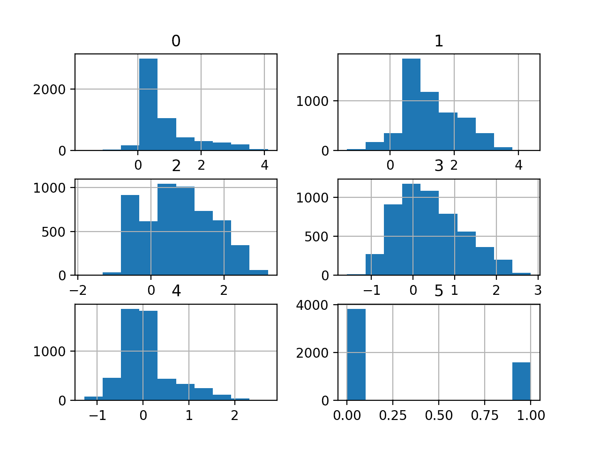
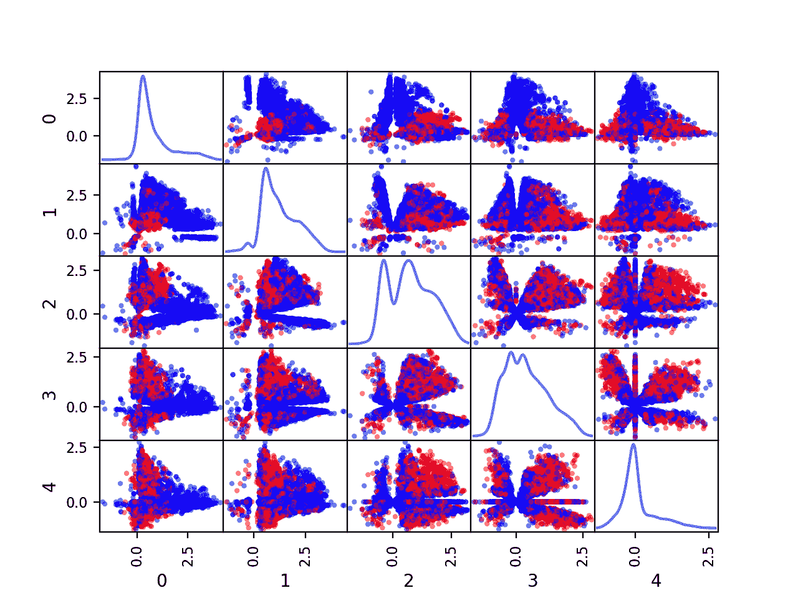
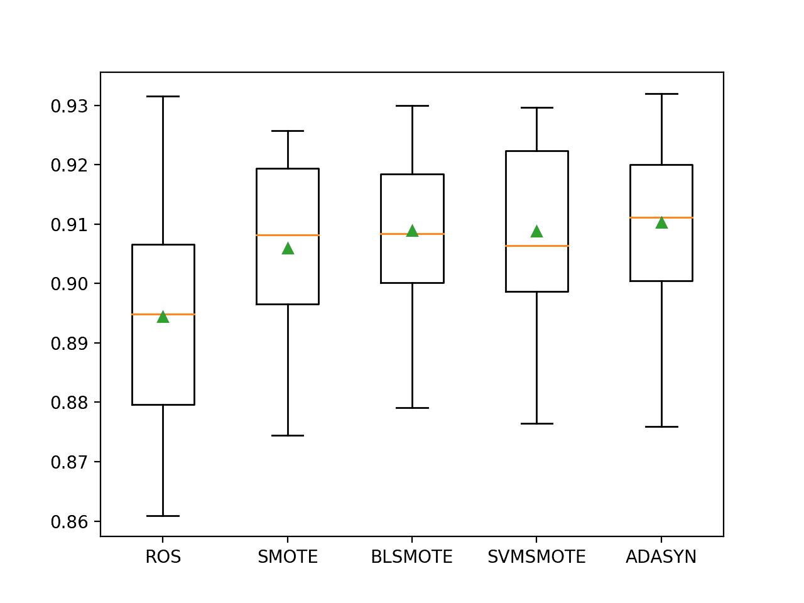

# 音素不平衡类别数据集的预测模型

> 原文：<https://machinelearningmastery.com/predictive-model-for-the-phoneme-imbalanced-classification-dataset/>

最后更新于 2021 年 1 月 5 日

许多二进制分类任务并不是每个类都有相同数量的例子，例如类分布是倾斜的或者不平衡的。

然而，准确性在这两个类别中同样重要。

一个例子是在语音识别中将欧洲语言的元音分类为鼻元音或口元音，其中鼻元音的例子比口元音多得多。分类准确率对于两个类别都很重要，尽管不能直接使用准确率作为度量。此外，在拟合机器学习算法时，可能需要数据采样技术来变换训练数据集，以使其更加平衡。

在本教程中，您将发现如何开发和评估鼻腔和口腔音素的不平衡二分类模型。

完成本教程后，您将知道:

*   如何加载和探索数据集，并为数据准备和模型选择产生想法。
*   如何利用数据过采样技术评估一套机器学习模型并提高其表现？
*   如何拟合最终模型并使用它来预测特定情况下的类标签。

**用我的新书[Python 不平衡分类](https://machinelearningmastery.com/imbalanced-classification-with-python/)启动你的项目**，包括*分步教程*和所有示例的 *Python 源代码*文件。

我们开始吧。

*   **2021 年 1 月更新**:更新了 API 文档的链接。


音素不平衡类别数据集的预测模型
图片由[埃德·邓恩斯](https://flickr.com/photos/blachswan/33812905292/)提供，保留部分权利。

## 教程概述

本教程分为五个部分；它们是:

1.  音素数据集
2.  浏览数据集
3.  模型测试和基线结果
4.  评估模型
    1.  评估机器学习算法
    2.  评估数据过采样算法
5.  对新数据进行预测

## 音素数据集

在这个项目中，我们将使用一个标准的不平衡机器学习数据集，称为“*音素*”数据集。

该数据集被归功于名为“T2”的 ESPRIT(欧洲信息技术研究战略计划)项目，并在该项目的进度报告和技术报告中进行了描述。

> 注重成果的年度报告项目的目标是提高现有分析性语音识别系统(即使用音节、音素和语音特征知识的系统)的鲁棒性，并将其用作具有连接单词和对话能力的语音理解系统的一部分。该系统将针对两种欧洲语言的特定应用进行评估

——[ESPRIT:欧洲信息技术研发战略计划](https://www.aclweb.org/anthology/H91-1007.pdf)。

数据集的目标是区分鼻元音和口元音。

元音被读出并记录到数字文件中。然后从每个声音中自动提取音频特征。

> 选择了五种不同的属性来表征每个元音:它们是五个一次谐波 AHi 的振幅，用总能量 Ene 归一化(在所有频率上积分):AHi/Ene。每个谐波都有符号:当它对应于频谱的局部最大值时为正，否则为负。

— [音素数据集描述](https://raw.githubusercontent.com/jbrownlee/Datasets/master/phoneme.names)。

这两种声音有两个类别；它们是:

*   **0 级**:鼻元音(多数级)。
*   **第 1 类**:口语元音(少数民族类)。

接下来，让我们仔细看看数据。

## 浏览数据集

音素数据集是一个广泛使用的标准机器学习数据集，用于探索和演示许多专门为不平衡分类设计的技术。

一个例子是流行的 [SMOTE 数据过采样技术](https://arxiv.org/abs/1106.1813)。

首先，下载数据集，并将其保存在您当前的工作目录中，名称为“*音素. csv* ”。

*   [下载音素数据集(音素. csv)](https://raw.githubusercontent.com/jbrownlee/Datasets/master/phoneme.csv)

查看文件的内容。

文件的前几行应该如下所示:

```py
1.24,0.875,-0.205,-0.078,0.067,0
0.268,1.352,1.035,-0.332,0.217,0
1.567,0.867,1.3,1.041,0.559,0
0.279,0.99,2.555,-0.738,0.0,0
0.307,1.272,2.656,-0.946,-0.467,0
...
```

我们可以看到，给定的输入变量是数字，鼻腔和口腔的类别标签分别是 0 和 1。

可以使用 [read_csv()熊猫函数](https://pandas.pydata.org/pandas-docs/stable/reference/api/pandas.read_csv.html)将数据集加载为数据帧，指定位置和没有标题行的事实。

```py
...
# define the dataset location
filename = 'phoneme.csv'
# load the csv file as a data frame
dataframe = read_csv(filename, header=None)
```

加载后，我们可以通过打印[数据框](https://pandas.pydata.org/pandas-docs/stable/reference/api/pandas.DataFrame.html)的形状来总结行数和列数。

```py
...
# summarize the shape of the dataset
print(dataframe.shape)
```

我们还可以使用 [Counter](https://docs.python.org/3/library/collections.html#collections.Counter) 对象总结每个类中的示例数量。

```py
...
# summarize the class distribution
target = dataframe.values[:,-1]
counter = Counter(target)
for k,v in counter.items():
	per = v / len(target) * 100
	print('Class=%s, Count=%d, Percentage=%.3f%%' % (k, v, per))
```

将这些联系在一起，下面列出了加载和汇总数据集的完整示例。

```py
# load and summarize the dataset
from pandas import read_csv
from collections import Counter
# define the dataset location
filename = 'phoneme.csv'
# load the csv file as a data frame
dataframe = read_csv(filename, header=None)
# summarize the shape of the dataset
print(dataframe.shape)
# summarize the class distribution
target = dataframe.values[:,-1]
counter = Counter(target)
for k,v in counter.items():
	per = v / len(target) * 100
	print('Class=%s, Count=%d, Percentage=%.3f%%' % (k, v, per))
```

运行该示例首先加载数据集并确认行数和列数，即 5，404 行、5 个输入变量和 1 个目标变量。

然后总结阶级分布，确认适度的阶级不平衡，多数阶级大约 70%(*鼻*)少数阶级大约 30%(*口*)。

```py
(5404, 6)
Class=0.0, Count=3818, Percentage=70.651%
Class=1.0, Count=1586, Percentage=29.349%
```

我们还可以通过为五个数字输入变量创建直方图来查看它们的分布。

下面列出了完整的示例。

```py
# create histograms of numeric input variables
from pandas import read_csv
from matplotlib import pyplot
# define the dataset location
filename = 'phoneme.csv'
# load the csv file as a data frame
df = read_csv(filename, header=None)
# histograms of all variables
df.hist()
pyplot.show()
```

运行该示例会为数据集中的五个数字输入变量中的每一个创建带有一个直方图子图的图形，以及数字类标签。

我们可以看到这些变量有不同的尺度，尽管大多数似乎有高斯或类似高斯的分布。

根据建模算法的选择，我们期望将分布缩放到相同的范围是有用的，并且可能标准化一些幂变换的使用。



音素数据集变量的直方图

我们还可以为每对输入变量创建散点图，称为散点图矩阵。

这有助于查看是否有任何变量相互关联或朝同一方向变化，例如相互关联。

我们还可以根据类别标签为每个散点图的点着色。在这种情况下，多数类(*鼻*)将被映射为蓝点，少数类(*口*)将被映射为红点。

下面列出了完整的示例。

```py
# create pairwise scatter plots of numeric input variables
from pandas import read_csv
from pandas import DataFrame
from pandas.plotting import scatter_matrix
from matplotlib import pyplot
# define the dataset location
filename = 'phoneme.csv'
# load the csv file as a data frame
df = read_csv(filename, header=None)
# define a mapping of class values to colors
color_dict = {0:'blue', 1:'red'}
# map each row to a color based on the class value
colors = [color_dict[x] for x in df.values[:, -1]]
# drop the target variable
inputs = DataFrame(df.values[:, :-1])
# pairwise scatter plots of all numerical variables
scatter_matrix(inputs, diagonal='kde', color=colors)
pyplot.show()
```

运行该示例会创建一个显示散点图矩阵的图形，其中五个图乘以五个图，将五个数字输入变量相互比较。矩阵的对角线显示了每个变量的密度分布。

每对出现两次，从左上角到右下角的对角线的上方和下方，提供了两种方式来查看相同的变量交互。

我们可以看到，对于两个类别标签，许多变量的分布确实不同，这表明类别之间的一些合理区分是可行的。



音素数据集中数字输入变量的分类散点图矩阵

现在我们已经回顾了数据集，让我们看看开发一个测试工具来评估候选模型。

## 模型测试和基线结果

我们将使用重复的分层 k 折叠交叉验证来评估候选模型。

[k 倍交叉验证程序](https://machinelearningmastery.com/k-fold-cross-validation/)提供了一个良好的模型表现的总体估计，至少与单个列车测试分割相比，不太乐观。我们将使用 k=10，这意味着每个折叠将包含大约 5404/10 或大约 540 个示例。

分层意味着每个褶皱将包含相同的混合类例子，即大约 70%到 30%的鼻到口元音。重复表示评估过程将执行多次，以帮助避免侥幸结果，并更好地捕捉所选模型的方差。我们将使用三次重复。

这意味着单个模型将被拟合和评估 10 * 3 或 30 次，并且将报告这些运行的平均值和标准偏差。

这可以通过使用[repeated stratifiedfold Sklearn 类](https://Sklearn.org/stable/modules/generated/sklearn.model_selection.RepeatedStratifiedKFold.html)来实现。

类别标签将被预测，两个类别标签同等重要。因此，我们将选择一个度量来分别量化模型在两个类上的表现。

您可能还记得，灵敏度是阳性类别准确性的衡量标准，特异性是阴性类别准确性的衡量标准。

*   灵敏度=真阳性/(真阳性+假阴性)
*   特异性=真阴性/(真阴性+假阳性)

G 均值寻求这些分数的平衡，即[几何均值](https://en.wikipedia.org/wiki/Geometric_mean)，其中一个或另一个的不良表现导致低 G 均值分数。

*   g-均值= sqrt(灵敏度*特异性)

我们可以使用不平衡学习库提供的[几何均值分数()函数](https://imbalanced-learn.org/stable/generated/imblearn.metrics.geometric_mean_score.html)来计算模型所做的一组预测的 G 均值。

我们可以定义一个函数来加载数据集，并将列分成输入和输出变量。下面的 *load_dataset()* 函数实现了这一点。

```py
# load the dataset
def load_dataset(full_path):
	# load the dataset as a numpy array
	data = read_csv(full_path, header=None)
	# retrieve numpy array
	data = data.values
	# split into input and output elements
	X, y = data[:, :-1], data[:, -1]
	return X, y
```

然后，我们可以定义一个函数来评估数据集上的给定模型，并返回每次折叠和重复的 G 均值分数列表。下面的 *evaluate_model()* 函数实现了这一点，将数据集和模型作为参数，返回分数列表。

```py
# evaluate a model
def evaluate_model(X, y, model):
	# define evaluation procedure
	cv = RepeatedStratifiedKFold(n_splits=10, n_repeats=3, random_state=1)
	# define the model evaluation the metric
	metric = make_scorer(geometric_mean_score)
	# evaluate model
	scores = cross_val_score(model, X, y, scoring=metric, cv=cv, n_jobs=-1)
	return scores
```

最后，我们可以使用这个测试工具在数据集上评估一个基线模型。

预测所有情况下的多数类标签(0)或少数类标签(1)的模型将导致 G 均值为零。因此，一个好的默认策略是以 50%的概率随机预测一个或另一个类别标签，目标是 0.5 左右的 G 均值。

这可以通过使用 Sklearn 库中的 [DummyClassifier](https://Sklearn.org/stable/modules/generated/sklearn.dummy.DummyClassifier.html) 类并将“*策略*”参数设置为“*制服*”来实现。

```py
...
# define the reference model
model = DummyClassifier(strategy='uniform')
```

一旦模型得到评估，我们就可以直接报告 G 均值分数的均值和标准差。

```py
...
# evaluate the model
scores = evaluate_model(X, y, model)
# summarize performance
print('Mean G-Mean: %.3f (%.3f)' % (mean(scores), std(scores)))
```

将这些结合起来，下面列出了加载数据集、评估基线模型和报告表现的完整示例。

```py
# test harness and baseline model evaluation
from collections import Counter
from numpy import mean
from numpy import std
from pandas import read_csv
from sklearn.model_selection import cross_val_score
from sklearn.model_selection import RepeatedStratifiedKFold
from imblearn.metrics import geometric_mean_score
from sklearn.metrics import make_scorer
from sklearn.dummy import DummyClassifier

# load the dataset
def load_dataset(full_path):
	# load the dataset as a numpy array
	data = read_csv(full_path, header=None)
	# retrieve numpy array
	data = data.values
	# split into input and output elements
	X, y = data[:, :-1], data[:, -1]
	return X, y

# evaluate a model
def evaluate_model(X, y, model):
	# define evaluation procedure
	cv = RepeatedStratifiedKFold(n_splits=10, n_repeats=3, random_state=1)
	# define the model evaluation the metric
	metric = make_scorer(geometric_mean_score)
	# evaluate model
	scores = cross_val_score(model, X, y, scoring=metric, cv=cv, n_jobs=-1)
	return scores

# define the location of the dataset
full_path = 'phoneme.csv'
# load the dataset
X, y = load_dataset(full_path)
# summarize the loaded dataset
print(X.shape, y.shape, Counter(y))
# define the reference model
model = DummyClassifier(strategy='uniform')
# evaluate the model
scores = evaluate_model(X, y, model)
# summarize performance
print('Mean G-Mean: %.3f (%.3f)' % (mean(scores), std(scores)))
```

运行该示例首先加载和汇总数据集。

我们可以看到加载了正确的行数，并且有五个音频派生的输入变量。

接下来，报告 G 均值分数的平均值。

在这种情况下，我们可以看到基线算法获得的 G 均值约为 0.509，接近理论最大值 0.5。这个分数提供了模特技能的下限；任何平均 G 均值高于约 0.509(或真正高于 0.5)的模型都有技能，而得分低于该值的模型在该数据集上没有技能。

```py
(5404, 5) (5404,) Counter({0.0: 3818, 1.0: 1586})
Mean G-Mean: 0.509 (0.020)
```

现在我们已经有了测试工具和表现基线，我们可以开始在这个数据集上评估一些模型了。

## 评估模型

在本节中，我们将使用上一节中开发的测试工具来评估数据集上的一套不同技术。

目标是既演示如何系统地解决问题，又演示为不平衡分类问题设计的一些技术的能力。

报告的表现良好，但没有高度优化(例如，超参数没有调整)。

**你能做得更好吗？**如果你能用同样的测试装具获得更好的 G 均值表现，我很想听听。请在下面的评论中告诉我。

### 评估机器学习算法

让我们从评估数据集上的混合机器学习模型开始。

在数据集上抽查一套不同的线性和非线性算法可能是一个好主意，以便快速找出哪些算法运行良好，值得进一步关注，哪些算法运行不佳。

我们将在音素数据集上评估以下机器学习模型:

*   逻辑回归
*   支持向量机(SVM)
*   袋装决策树
*   随机森林
*   额外树

我们将主要使用默认的模型超参数，除了集成算法中的树的数量，我们将设置为合理的默认值 1000。

我们将依次定义每个模型，并将它们添加到一个列表中，以便我们可以顺序评估它们。下面的 *get_models()* 函数定义了用于评估的模型列表，以及用于以后绘制结果的模型简称列表。

```py
# define models to test
def get_models():
	models, names = list(), list()
	# LR
	models.append(LogisticRegression(solver='lbfgs'))
	names.append('LR')
	# SVM
	models.append(SVC(gamma='scale'))
	names.append('SVM')
	# Bagging
	models.append(BaggingClassifier(n_estimators=1000))
	names.append('BAG')
	# RF
	models.append(RandomForestClassifier(n_estimators=1000))
	names.append('RF')
	# ET
	models.append(ExtraTreesClassifier(n_estimators=1000))
	names.append('ET')
	return models, names
```

然后，我们可以依次列举模型列表，并对每个模型进行评估，报告平均 G 均值，并存储分数以供以后绘制。

```py
...
# define models
models, names = get_models()
results = list()
# evaluate each model
for i in range(len(models)):
	# evaluate the model and store results
	scores = evaluate_model(X, y, models[i])
	results.append(scores)
	# summarize and store
	print('>%s %.3f (%.3f)' % (names[i], mean(scores), std(scores)))
```

在运行结束时，我们可以将每个分数样本绘制成一个方框，并用相同的比例绘制晶须图，这样我们就可以直接比较分布。

```py
...
# plot the results
pyplot.boxplot(results, labels=names, showmeans=True)
pyplot.show()
```

将所有这些结合在一起，下面列出了在音素数据集上评估一套机器学习算法的完整示例。

```py
# spot check machine learning algorithms on the phoneme dataset
from numpy import mean
from numpy import std
from pandas import read_csv
from matplotlib import pyplot
from sklearn.model_selection import cross_val_score
from sklearn.model_selection import RepeatedStratifiedKFold
from imblearn.metrics import geometric_mean_score
from sklearn.metrics import make_scorer
from sklearn.linear_model import LogisticRegression
from sklearn.svm import SVC
from sklearn.ensemble import RandomForestClassifier
from sklearn.ensemble import ExtraTreesClassifier
from sklearn.ensemble import BaggingClassifier

# load the dataset
def load_dataset(full_path):
	# load the dataset as a numpy array
	data = read_csv(full_path, header=None)
	# retrieve numpy array
	data = data.values
	# split into input and output elements
	X, y = data[:, :-1], data[:, -1]
	return X, y

# evaluate a model
def evaluate_model(X, y, model):
	# define evaluation procedure
	cv = RepeatedStratifiedKFold(n_splits=10, n_repeats=3, random_state=1)
	# define the model evaluation the metric
	metric = make_scorer(geometric_mean_score)
	# evaluate model
	scores = cross_val_score(model, X, y, scoring=metric, cv=cv, n_jobs=-1)
	return scores

# define models to test
def get_models():
	models, names = list(), list()
	# LR
	models.append(LogisticRegression(solver='lbfgs'))
	names.append('LR')
	# SVM
	models.append(SVC(gamma='scale'))
	names.append('SVM')
	# Bagging
	models.append(BaggingClassifier(n_estimators=1000))
	names.append('BAG')
	# RF
	models.append(RandomForestClassifier(n_estimators=1000))
	names.append('RF')
	# ET
	models.append(ExtraTreesClassifier(n_estimators=1000))
	names.append('ET')
	return models, names

# define the location of the dataset
full_path = 'phoneme.csv'
# load the dataset
X, y = load_dataset(full_path)
# define models
models, names = get_models()
results = list()
# evaluate each model
for i in range(len(models)):
	# evaluate the model and store results
	scores = evaluate_model(X, y, models[i])
	results.append(scores)
	# summarize and store
	print('>%s %.3f (%.3f)' % (names[i], mean(scores), std(scores)))
# plot the results
pyplot.boxplot(results, labels=names, showmeans=True)
pyplot.show()
```

运行该示例依次评估每个算法，并报告均值和标准差。

**注**:考虑到算法或评估程序的随机性，或数值准确率的差异，您的[结果可能会有所不同](https://machinelearningmastery.com/different-results-each-time-in-machine-learning/)。考虑运行该示例几次，并比较平均结果。

在这种情况下，我们可以看到所有测试的算法都有技巧，实现了高于默认值 0.5 的 G 均值。结果表明，决策树算法的集成在这个数据集上表现更好，可能额外树(et)在 G 均值约为 0.896 时表现最好。

```py
>LR 0.637 (0.023)
>SVM 0.801 (0.022)
>BAG 0.888 (0.017)
>RF 0.892 (0.018)
>ET 0.896 (0.017)
```

创建一个图形，显示每个算法结果样本的一个方框和须图。方框显示中间 50%的数据，每个方框中间的橙色线显示样本的中值，每个方框中的绿色三角形显示样本的平均值。

我们可以看到，树算法的所有三个集合(BAG、RF 和 ET)都有一个紧密的分布以及紧密对齐的平均值和中值，这可能表明分数的非偏斜和高斯分布，例如稳定。


不平衡音素数据集上机器学习模型的盒须图

现在我们有了第一组好的结果，让我们看看是否可以用数据过采样方法来改进它们。

### 评估数据过采样算法

数据采样提供了一种在拟合模型之前更好地准备不平衡训练数据集的方法。

最简单的过采样技术是复制少数类中的例子，称为随机过采样。也许最流行的过采样方法是 SMOTE 过采样技术，用于为少数民族创建新的合成示例。

我们将测试五种不同的过采样方法；具体来说:

*   随机过采样
*   SMOTE (SMOTE)
*   边缘性雾霾
*   SVM smote(SVM mote)
*   阿达辛

每种技术都将使用上一节中表现最好的算法进行测试，特别是额外树。

我们将为每个过采样算法使用默认的超参数，该算法将对少数类进行过采样，以获得与训练数据集中多数类相同数量的示例。

预期每种过采样技术与没有过采样的算法相比，都会带来表现提升，随机过采样提供的提升最小，SMOTE 或其变体提供的提升可能最好。

我们可以更新 *get_models()* 函数，返回要评估的过采样算法列表；例如:

```py
# define oversampling models to test
def get_models():
	models, names = list(), list()
	# RandomOverSampler
	models.append(RandomOverSampler())
	names.append('ROS')
	# SMOTE
	models.append(SMOTE())
	names.append('SMOTE')
	# BorderlineSMOTE
	models.append(BorderlineSMOTE())
	names.append('BLSMOTE')
	# SVMSMOTE
	models.append(SVMSMOTE())
	names.append('SVMSMOTE')
	# ADASYN
	models.append(ADASYN())
	names.append('ADASYN')
	return models, names
```

然后，我们可以枚举每一个，并从知道如何过采样训练数据集的不平衡学习库中创建一个[管道](https://imbalanced-learn.org/stable/generated/imblearn.pipeline.Pipeline.html)。这将确保交叉验证模型评估中的训练数据集被正确采样，而不会出现可能导致对模型表现的乐观评估的数据泄漏。

首先，我们将对输入变量进行归一化，因为大多数过采样技术将使用最近邻算法，使用该技术时，所有变量具有相同的比例非常重要。接下来是给定的过采样算法，然后是适合过采样训练数据集的额外树算法。

```py
...
# define the model
model = ExtraTreesClassifier(n_estimators=1000)
# define the pipeline steps
steps = [('s', MinMaxScaler()), ('o', models[i]), ('m', model)]
# define the pipeline
pipeline = Pipeline(steps=steps)
# evaluate the model and store results
scores = evaluate_model(X, y, pipeline)
```

将这些联系在一起，下面列出了在音素数据集上使用额外树评估过采样算法的完整示例。

```py
# data oversampling algorithms on the phoneme imbalanced dataset
from numpy import mean
from numpy import std
from pandas import read_csv
from matplotlib import pyplot
from sklearn.preprocessing import MinMaxScaler
from sklearn.model_selection import cross_val_score
from sklearn.model_selection import RepeatedStratifiedKFold
from imblearn.metrics import geometric_mean_score
from sklearn.metrics import make_scorer
from sklearn.ensemble import ExtraTreesClassifier
from imblearn.over_sampling import RandomOverSampler
from imblearn.over_sampling import SMOTE
from imblearn.over_sampling import BorderlineSMOTE
from imblearn.over_sampling import SVMSMOTE
from imblearn.over_sampling import ADASYN
from imblearn.pipeline import Pipeline

# load the dataset
def load_dataset(full_path):
	# load the dataset as a numpy array
	data = read_csv(full_path, header=None)
	# retrieve numpy array
	data = data.values
	# split into input and output elements
	X, y = data[:, :-1], data[:, -1]
	return X, y

# evaluate a model
def evaluate_model(X, y, model):
	# define evaluation procedure
	cv = RepeatedStratifiedKFold(n_splits=10, n_repeats=3, random_state=1)
	# define the model evaluation the metric
	metric = make_scorer(geometric_mean_score)
	# evaluate model
	scores = cross_val_score(model, X, y, scoring=metric, cv=cv, n_jobs=-1)
	return scores

# define oversampling models to test
def get_models():
	models, names = list(), list()
	# RandomOverSampler
	models.append(RandomOverSampler())
	names.append('ROS')
	# SMOTE
	models.append(SMOTE())
	names.append('SMOTE')
	# BorderlineSMOTE
	models.append(BorderlineSMOTE())
	names.append('BLSMOTE')
	# SVMSMOTE
	models.append(SVMSMOTE())
	names.append('SVMSMOTE')
	# ADASYN
	models.append(ADASYN())
	names.append('ADASYN')
	return models, names

# define the location of the dataset
full_path = 'phoneme.csv'
# load the dataset
X, y = load_dataset(full_path)
# define models
models, names = get_models()
results = list()
# evaluate each model
for i in range(len(models)):
	# define the model
	model = ExtraTreesClassifier(n_estimators=1000)
	# define the pipeline steps
	steps = [('s', MinMaxScaler()), ('o', models[i]), ('m', model)]
	# define the pipeline
	pipeline = Pipeline(steps=steps)
	# evaluate the model and store results
	scores = evaluate_model(X, y, pipeline)
	results.append(scores)
	# summarize and store
	print('>%s %.3f (%.3f)' % (names[i], mean(scores), std(scores)))
# plot the results
pyplot.boxplot(results, labels=names, showmeans=True)
pyplot.show()
```

运行该示例使用数据集上的额外树模型评估每个过采样方法。

**注**:考虑到算法或评估程序的随机性，或数值准确率的差异，您的[结果可能会有所不同](https://machinelearningmastery.com/different-results-each-time-in-machine-learning/)。考虑运行该示例几次，并比较平均结果。

在这种情况下，正如我们所料，除了随机过采样技术之外，每种过采样技术都在没有任何过采样(0.896)的情况下提升了 ET 算法的表现。

结果表明，改进版本的 SMOTE 和 ADASN 比默认 SMOTE 表现更好，在这种情况下，ADASN 获得了 0.910 的最佳 G 均值分数。

```py
>ROS 0.894 (0.018)
>SMOTE 0.906 (0.015)
>BLSMOTE 0.909 (0.013)
>SVMSMOTE 0.909 (0.014)
>ADASYN 0.910 (0.013)
```

结果的分布可以与箱线图和须线图进行比较。

我们可以看到这些分布都大致具有相同的紧密分布，并且结果平均值的差异可以用来选择模型。



不平衡音素数据集上数据过采样的额外树模型的盒须图

接下来，让我们看看如何使用最终模型对新数据进行预测。

## 对新数据进行预测

在本节中，我们将拟合最终模型，并使用它对单行数据进行预测

我们将使用 ADASYN 过采样版本的 Extra Trees 模型作为最终模型，并在拟合模型和进行预测之前对数据进行标准化缩放。使用管道将确保转换始终正确执行。

首先，我们可以将模型定义为管道。

```py
...
# define the model
model = ExtraTreesClassifier(n_estimators=1000)
# define the pipeline steps
steps = [('s', MinMaxScaler()), ('o', ADASYN()), ('m', model)]
# define the pipeline
pipeline = Pipeline(steps=steps)
```

一旦定义好了，我们就可以在整个训练数据集中使用它。

```py
...
# fit the model
pipeline.fit(X, y)
```

一旦适合，我们可以通过调用 *predict()* 函数来使用它对新数据进行预测。这将返回类别标签 0 表示“*鼻腔*，或 1 表示“*口腔*”。

例如:

```py
...
# define a row of data
row = [...]
# make prediction
yhat = pipeline.predict([row])
```

为了证明这一点，我们可以使用拟合模型对一些病例的标签进行一些预测，在这些病例中，我们知道该病例是鼻腔还是口腔。

下面列出了完整的示例。

```py
# fit a model and make predictions for the on the phoneme dataset
from pandas import read_csv
from sklearn.preprocessing import MinMaxScaler
from imblearn.over_sampling import ADASYN
from sklearn.ensemble import ExtraTreesClassifier
from imblearn.pipeline import Pipeline

# load the dataset
def load_dataset(full_path):
	# load the dataset as a numpy array
	data = read_csv(full_path, header=None)
	# retrieve numpy array
	data = data.values
	# split into input and output elements
	X, y = data[:, :-1], data[:, -1]
	return X, y

# define the location of the dataset
full_path = 'phoneme.csv'
# load the dataset
X, y = load_dataset(full_path)
# define the model
model = ExtraTreesClassifier(n_estimators=1000)
# define the pipeline steps
steps = [('s', MinMaxScaler()), ('o', ADASYN()), ('m', model)]
# define the pipeline
pipeline = Pipeline(steps=steps)
# fit the model
pipeline.fit(X, y)
# evaluate on some nasal cases (known class 0)
print('Nasal:')
data = [[1.24,0.875,-0.205,-0.078,0.067],
	[0.268,1.352,1.035,-0.332,0.217],
	[1.567,0.867,1.3,1.041,0.559]]
for row in data:
	# make prediction
	yhat = pipeline.predict([row])
	# get the label
	label = yhat[0]
	# summarize
	print('>Predicted=%d (expected 0)' % (label))
# evaluate on some oral cases (known class 1)
print('Oral:')
data = [[0.125,0.548,0.795,0.836,0.0],
	[0.318,0.811,0.818,0.821,0.86],
	[0.151,0.642,1.454,1.281,-0.716]]
for row in data:
	# make prediction
	yhat = pipeline.predict([row])
	# get the label
	label = yhat[0]
	# summarize
	print('>Predicted=%d (expected 1)' % (label))
```

运行该示例首先在整个训练数据集上拟合模型。

然后使用拟合模型来预测从数据集文件中选择的鼻病例的标签。我们可以看到所有的情况都是正确预测的。

然后将一些口腔病例作为模型的输入，并对标签进行预测。正如我们所希望的那样，所有情况下都能预测到正确的标签。

```py
Nasal:
>Predicted=0 (expected 0)
>Predicted=0 (expected 0)
>Predicted=0 (expected 0)
Oral:
>Predicted=1 (expected 1)
>Predicted=1 (expected 1)
>Predicted=1 (expected 1)
```

## 进一步阅读

如果您想更深入地了解这个主题，本节将提供更多资源。

### 报纸

*   [ESPRIT:欧洲信息技术研发战略计划](https://www.aclweb.org/anthology/H91-1007.pdf)。

### 蜜蜂

*   [sklearn.model_selection。重复的策略应用编程接口](https://Sklearn.org/stable/modules/generated/sklearn.model_selection.RepeatedStratifiedKFold.html)。
*   [硬化. dummy . dummy class ification API](https://Sklearn.org/stable/modules/generated/sklearn.dummy.DummyClassifier.html)。
*   [imb learn . metrics . geometry _ mean _ score API](https://imbalanced-learn.org/stable/generated/imblearn.metrics.geometric_mean_score.html)。

### 资料组

*   [音素数据集](https://raw.githubusercontent.com/jbrownlee/Datasets/master/phoneme.csv)
*   [音素数据集描述](https://raw.githubusercontent.com/jbrownlee/Datasets/master/phoneme.names)
*   [龙骨上的音素数据集](https://sci2s.ugr.es/keel/dataset.php?cod=105)
*   [ELENA 项目上的音素数据集](https://www.elen.ucl.ac.be/neural-nets/Research/Projects/ELENA/databases/REAL/phoneme/)

## 摘要

在本教程中，您发现了如何开发和评估鼻腔和口腔音素的不平衡二分类模型。

具体来说，您了解到:

*   如何加载和探索数据集，并为数据准备和模型选择产生想法。
*   如何利用数据过采样技术评估一套机器学习模型并提高其表现？
*   如何拟合最终模型并使用它来预测特定情况下的类标签。

你有什么问题吗？
在下面的评论中提问，我会尽力回答。