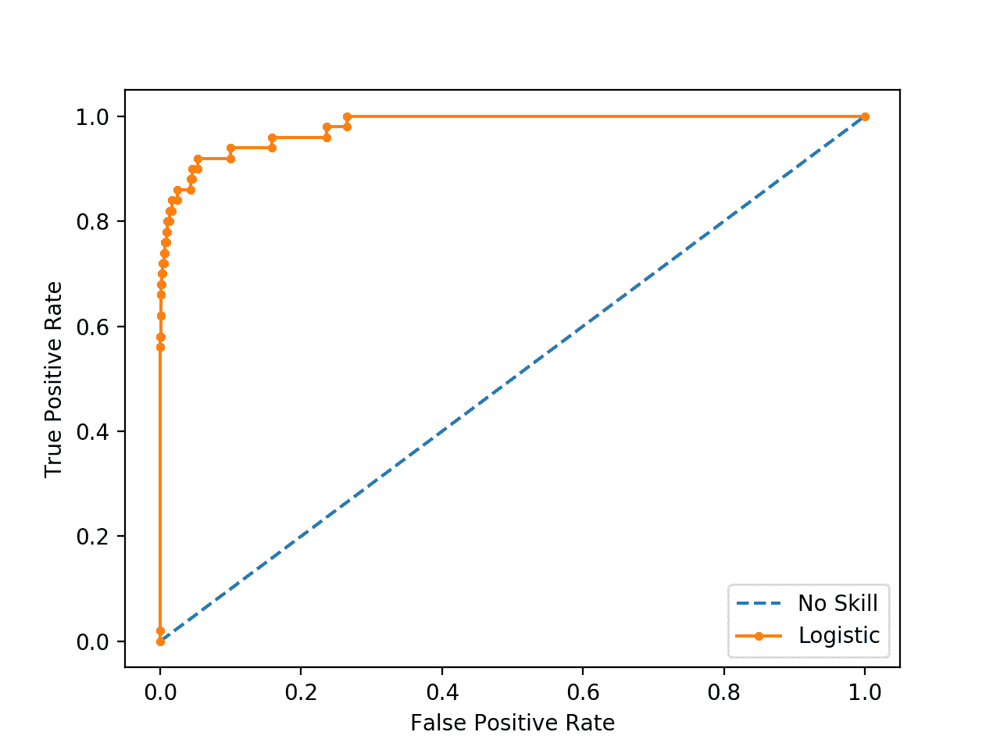
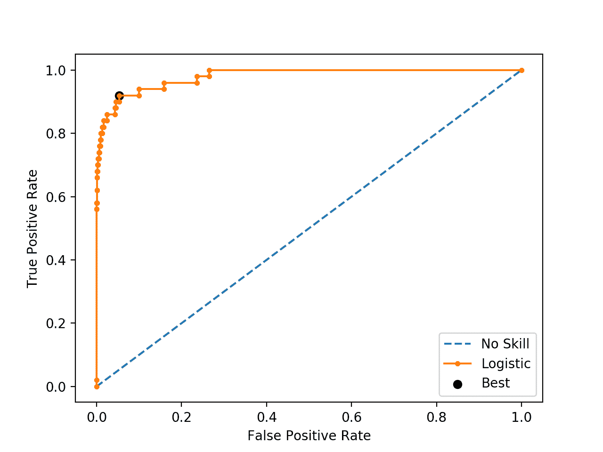
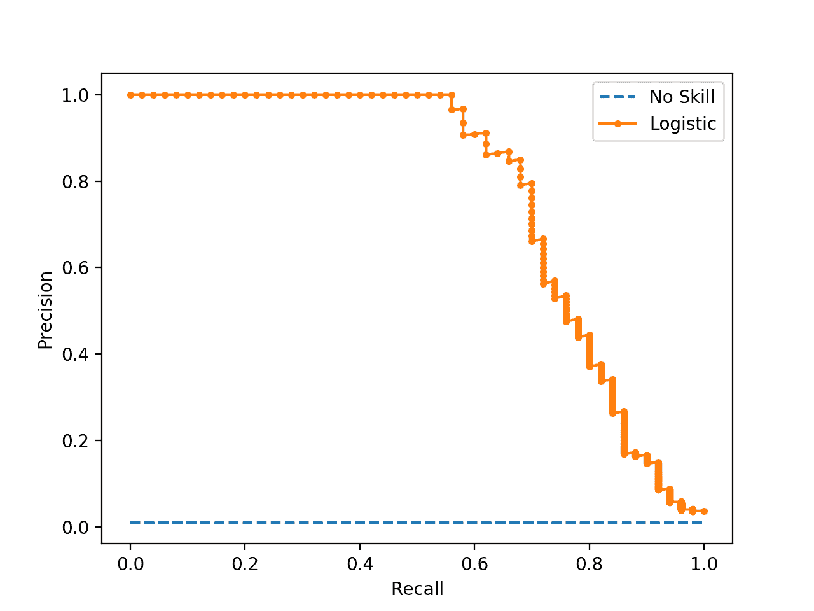
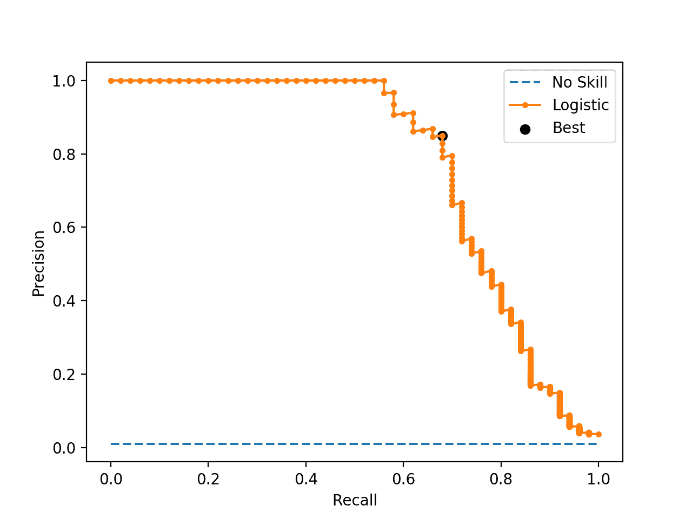

# 用于不平衡分类的阈值移动的温和介绍

> 原文：<https://machinelearningmastery.com/threshold-moving-for-imbalanced-classification/>

最后更新于 2021 年 1 月 5 日

分类预测建模通常包括预测类别标签。

然而，许多机器学习算法能够预测类成员的概率或得分，这必须在映射到清晰的类标签之前进行解释。这是通过使用阈值(如 0.5)来实现的，其中所有等于或大于阈值的值都映射到一个类，而所有其他值都映射到另一个类。

对于那些类别严重失衡的分类问题，默认阈值可能会导致表现不佳。因此，提高预测不平衡分类问题上的概率的分类器的表现的简单和直接的方法是调整用于将概率映射到类别标签的阈值。

在某些情况下，例如当使用 ROC 曲线和准确率-召回曲线时，可以直接计算分类器的最佳或最优阈值。在其他情况下，可以使用网格搜索来调整阈值并定位最佳值。

在本教程中，您将发现如何在将概率转换为清晰的类标签进行不平衡分类时调整最佳阈值。

完成本教程后，您将知道:

*   将概率解释为类标签的默认阈值是 0.5，调整这个超参数称为阈值移动。
*   如何直接计算 ROC 曲线和准确率-召回曲线的最佳阈值。
*   如何手动搜索所选模型和模型评估指标的阈值。

**用我的新书[Python 不平衡分类](https://machinelearningmastery.com/imbalanced-classification-with-python/)启动你的项目**，包括*分步教程*和所有示例的 *Python 源代码*文件。

我们开始吧。

*   **2020 年 2 月更新**:修正了特异性方程的错别字。
*   **2021 年 1 月更新**:更新了 API 文档的链接。


不平衡分类阈值移动介绍
图片由[布鲁纳 cs](https://flickr.com/photos/nabruuc/26880260157/) 提供，保留部分权利。

## 教程概述

本教程分为五个部分；它们是:

1.  将概率转换为类别标签
2.  不平衡分类的阈值移动
3.  ROC 曲线的最佳阈值
4.  精确-召回曲线的最佳阈值
5.  最佳阈值调整

## 将概率转换为类别标签

许多机器学习算法能够预测类成员的概率或得分。

这通常是有用的，因为它提供了预测的确定性或不确定性的度量。它还提供了额外的粒度，而不仅仅是预测可以解释的类标签。

一些分类任务需要清晰的类别标签预测。这意味着，即使预测了类成员的概率或得分，也必须将其转换为清晰的类标签。

用于将预测概率或得分转换成类别标签的决策由被称为“*决策阈值*”、“*判别阈值*或简称为“*阈值*的参数控制对于 0 或 1 范围内的归一化预测概率或分数，阈值的默认值为 0.5。

例如，在类别标签为 0 和 1、归一化预测概率和阈值为 0.5 的二进制分类问题上，小于阈值 0.5 的值被分配给类别 0，大于或等于 0.5 的值被分配给类别 1。

*   预测< 0.5 = 0 级
*   预测> = 0.5 = 1 级

问题是默认阈值可能不代表预测概率的最佳解释。

这可能有许多原因，例如:

*   预测的概率没有被校准，例如由 SVM 或决策树预测的概率。
*   用于训练模型的度量不同于用于评估最终模型的度量。
*   阶级分布严重失衡。
*   一种错误分类的代价比另一种错误分类更重要。

更糟糕的是，这些原因中的一些或全部可能同时发生，例如在不平衡分类问题上使用具有未校准预测概率的神经网络模型。

因此，在解释模型预测时，通常需要更改默认决策阈值。

> ……几乎所有分类器都通过对分数应用阈值来生成正面或负面预测。这个阈值的选择将对正负误差的权衡产生影响。

—第 53 页，[从不平衡数据集](https://amzn.to/307Xlva)中学习，2018。

## 不平衡分类的阈值移动

有许多技术可以用来解决不平衡的分类问题，例如重新采样训练数据集和开发定制版本的机器学习算法。

然而，也许处理严重的阶级不平衡的最简单的方法是改变决策阈值。尽管简单且非常有效，但这种技术经常被实践者和研究学者所忽视，正如福斯特·普罗沃斯特在他 2000 年的文章《不平衡数据集的机器学习》中所指出的那样

> 底线是，当研究数据不平衡的问题时，使用标准机器学习算法产生的分类器而不调整输出阈值很可能是一个严重的错误。

——[来自不平衡数据集的机器学习 101](https://www.aaai.org/Library/Workshops/2000/ws00-05-001.php) ，2000。

选择默认决策阈值的替代方案有很多原因。

例如，您可以使用 [ROC 曲线](https://machinelearningmastery.com/roc-curves-and-precision-recall-curves-for-classification-in-python/)来分析模型的预测概率，并使用 ROC AUC 分数来比较和选择模型，尽管您需要模型中清晰的类别标签。如何在 ROC 曲线上选择阈值，使真阳性率和假阳性率达到最佳平衡？

或者，您可以使用准确率-召回曲线来分析模型的预测概率，准确率-召回 AUC 来比较和选择模型，并需要清晰的类标签作为预测。您如何选择准确率-召回率曲线上的阈值，以实现准确率和召回率之间的最佳平衡？

您可以使用基于概率的度量来训练、评估和比较像对数损失([交叉熵](https://machinelearningmastery.com/cross-entropy-for-machine-learning/))这样的模型，但是需要清晰的类标签来进行预测。如何更一般地从预测概率中选择最佳阈值？

最后，您可能会有与假阳性和假阴性错误分类相关的不同成本，即所谓的成本矩阵，但希望使用和评估对成本不敏感的模型，然后使用对成本敏感的度量来评估它们的预测。如何选择一个阈值，利用成本矩阵找到预测的最佳平衡点？

> 在没有已知成本矩阵的情况下，训练对成本敏感的分类器的流行方法是，当对新数据进行预测时，强调修改分类输出。这通常是通过在正类上设置一个阈值来实现的，低于该阈值，负类将被预测。使用验证集优化该阈值的值，因此可以从训练数据中学习成本矩阵。

—第 67 页，[从不平衡数据集](https://amzn.to/307Xlva)中学习，2018。

这些问题的答案是搜索一系列阈值，以便找到最佳阈值。在某些情况下，可以直接计算最佳阈值。

为了适应分类问题的更广泛要求而调整或移动决策阈值通常被称为“*阈值移动*”、“*阈值调整*”或简称为“*阈值设定*”

> 有人指出，尝试其他方法，如取样，而不仅仅通过设定阈值来尝试，可能会产生误导。阈值移动方法使用原始训练集来训练[模型]，然后移动决策阈值，使得少数类示例更容易被正确预测。

—第 72 页，[不平衡学习:基础、算法和应用](https://amzn.to/32K9K6d)，2013。

该过程包括首先在训练数据集上拟合模型，然后在测试数据集上进行预测。预测是以归一化概率或分数的形式，这些概率或分数被转换成归一化概率。然后尝试不同的阈值，并使用所选的评估度量来评估结果清晰的标签。然后，当对未来的新数据进行预测时，模型采用达到最佳评估指标的阈值。

我们可以在下面总结这个过程。

*   1.在训练数据集上拟合模型。
*   2.预测测试数据集中的概率。
*   3.对于阈值中的每个阈值:
    *   3a .使用阈值将概率转换为类别标签。
    *   3b。评估类别标签。
    *   3c。如果分数优于最佳分数。
        *   3ci。采用阈值。
    *   4.对新数据进行类别预测时，使用采用的阈值。

虽然简单，但根据您的情况，有几种不同的方法来实现阈值移动。我们将在下面几节中看一些最常见的例子。

## ROC 曲线的最佳阈值

[ROC 曲线](https://machinelearningmastery.com/roc-curves-and-precision-recall-curves-for-classification-in-python/)是一种诊断图，用于评估模型在测试数据集上做出的一组概率预测。

一组不同的阈值用于解释阳性(少数)类预测的真阳性率和假阳性率，分数绘制在一条阈值递增的线上，以创建一条曲线。

假阳性率标绘在 x 轴上，真阳性率标绘在 y 轴上，该标绘称为接收器工作特性曲线或 ROC 曲线。图中从左下角到右上角的对角线表示无技能分类器的“*曲线*”(预测所有情况下的多数类)，图左上角的点表示技能完美的模型。

该曲线有助于理解不同阈值下的真阳性率和假阳性率之间的权衡。ROC 曲线下的区域，即所谓的 ROC AUC，提供了一个单一的数字来总结模型在其 ROC 曲线方面的表现，其值介于 0.5(无技能)和 1.0(完美技能)之间。

ROC 曲线是一个有用的诊断工具，用于了解不同阈值之间的权衡，ROC AUC 提供了一个有用的数字，用于根据模型的一般能力进行比较。

如果在这种分析下，模型需要清晰的类标签，那么就需要一个最佳阈值。这将是曲线上最靠近图左上角的一个阈值。

谢天谢地，找到这一点有原则的方法。

首先，让我们拟合一个模型，计算一个 ROC 曲线。

我们可以使用 [make_classification()函数](https://Sklearn.org/stable/modules/generated/sklearn.datasets.make_classification.html)创建一个包含 10，000 个示例(行)的合成二进制分类问题，其中 99%属于多数类，1%属于少数类。

```py
...
# generate dataset
X, y = make_classification(n_samples=10000, n_features=2, n_redundant=0,
	n_clusters_per_class=1, weights=[0.99], flip_y=0, random_state=4)
```

然后，我们可以使用 [train_test_split()函数](https://Sklearn.org/stable/modules/generated/sklearn.model_selection.train_test_split.html)分割数据集，并将一半用于训练集，另一半用于测试集。

```py
...
# split into train/test sets
trainX, testX, trainy, testy = train_test_split(X, y, test_size=0.5, random_state=2, stratify=y)
```

然后，我们可以拟合一个[逻辑推理模型](https://Sklearn.org/stable/modules/generated/sklearn.linear_model.LogisticRegression.html)，并使用它对测试集进行概率预测，只保留少数类的概率预测。

```py
...
# fit a model
model = LogisticRegression(solver='lbfgs')
model.fit(trainX, trainy)
# predict probabilities
lr_probs = model.predict_proba(testX)
# keep probabilities for the positive outcome only
lr_probs = lr_probs[:, 1]
```

然后，我们可以使用 [roc_auc_score()函数](https://Sklearn.org/stable/modules/generated/sklearn.metrics.roc_curve.html)使用一组阈值计算预测的真阳性率和假阳性率，然后使用这些阈值创建 roc 曲线图。

```py
...
# calculate scores
lr_auc = roc_auc_score(testy, lr_probs)
```

我们可以将这些联系在一起，定义数据集，拟合模型，并创建 ROC 曲线图。下面列出了完整的示例。

```py
# roc curve for logistic regression model
from sklearn.datasets import make_classification
from sklearn.linear_model import LogisticRegression
from sklearn.model_selection import train_test_split
from sklearn.metrics import roc_curve
from matplotlib import pyplot
# generate dataset
X, y = make_classification(n_samples=10000, n_features=2, n_redundant=0,
	n_clusters_per_class=1, weights=[0.99], flip_y=0, random_state=4)
# split into train/test sets
trainX, testX, trainy, testy = train_test_split(X, y, test_size=0.5, random_state=2, stratify=y)
# fit a model
model = LogisticRegression(solver='lbfgs')
model.fit(trainX, trainy)
# predict probabilities
yhat = model.predict_proba(testX)
# keep probabilities for the positive outcome only
yhat = yhat[:, 1]
# calculate roc curves
fpr, tpr, thresholds = roc_curve(testy, yhat)
# plot the roc curve for the model
pyplot.plot([0,1], [0,1], linestyle='--', label='No Skill')
pyplot.plot(fpr, tpr, marker='.', label='Logistic')
# axis labels
pyplot.xlabel('False Positive Rate')
pyplot.ylabel('True Positive Rate')
pyplot.legend()
# show the plot
pyplot.show()
```

运行该示例使逻辑回归模型适合训练数据集，然后使用测试集上的一系列阈值对其进行评估，从而创建 ROC 曲线

我们可以看到，在靠近图的左上角有许多点或阈值。

哪个是最佳阈值？



不平衡分类逻辑回归模型的 ROC 曲线

有许多方法可以在假阳性率和真阳性率之间找到最佳平衡点。

首先，真正的阳性率被称为敏感度。假阳性率的倒数称为特异性。

*   灵敏度=真正/(真正+假负)
*   特异性=真阴性/(假阳性+真阴性)

其中:

*   灵敏度=真阳性率
*   特异性= 1–假阳性率

几何平均或 G-均值是不平衡分类的一种度量，如果优化，它将寻求灵敏度和特异性之间的平衡。

*   g-均值= sqrt(灵敏度*特异性)

一种方法是用呼叫返回的每个阈值来测试模型 [roc_auc_score()](https://Sklearn.org/stable/modules/generated/sklearn.metrics.roc_auc_score.html) 并选择具有最大 G 均值的阈值。

假设我们在计算 ROC 曲线时已经计算了敏感性(TPR)和特异性的补充，我们可以直接计算每个阈值的 G 均值。

```py
...
# calculate the g-mean for each threshold
gmeans = sqrt(tpr * (1-fpr))
```

一旦计算出来，我们就可以找到最大 G 均值分数的指数，并使用该指数来确定使用哪个阈值。

```py
...
# locate the index of the largest g-mean
ix = argmax(gmeans)
print('Best Threshold=%f, G-Mean=%.3f' % (thresholds[ix], gmeans[ix]))
```

我们也可以重新绘制 ROC 曲线，突出这一点。

下面列出了完整的示例。

```py
# roc curve for logistic regression model with optimal threshold
from numpy import sqrt
from numpy import argmax
from sklearn.datasets import make_classification
from sklearn.linear_model import LogisticRegression
from sklearn.model_selection import train_test_split
from sklearn.metrics import roc_curve
from matplotlib import pyplot
# generate dataset
X, y = make_classification(n_samples=10000, n_features=2, n_redundant=0,
	n_clusters_per_class=1, weights=[0.99], flip_y=0, random_state=4)
# split into train/test sets
trainX, testX, trainy, testy = train_test_split(X, y, test_size=0.5, random_state=2, stratify=y)
# fit a model
model = LogisticRegression(solver='lbfgs')
model.fit(trainX, trainy)
# predict probabilities
yhat = model.predict_proba(testX)
# keep probabilities for the positive outcome only
yhat = yhat[:, 1]
# calculate roc curves
fpr, tpr, thresholds = roc_curve(testy, yhat)
# calculate the g-mean for each threshold
gmeans = sqrt(tpr * (1-fpr))
# locate the index of the largest g-mean
ix = argmax(gmeans)
print('Best Threshold=%f, G-Mean=%.3f' % (thresholds[ix], gmeans[ix]))
# plot the roc curve for the model
pyplot.plot([0,1], [0,1], linestyle='--', label='No Skill')
pyplot.plot(fpr, tpr, marker='.', label='Logistic')
pyplot.scatter(fpr[ix], tpr[ix], marker='o', color='black', label='Best')
# axis labels
pyplot.xlabel('False Positive Rate')
pyplot.ylabel('True Positive Rate')
pyplot.legend()
# show the plot
pyplot.show()
```

运行该示例首先定位最佳阈值，并报告该阈值和平均得分。

**注**:考虑到算法或评估程序的随机性，或数值准确率的差异，您的[结果可能会有所不同](https://machinelearningmastery.com/different-results-each-time-in-machine-learning/)。考虑运行该示例几次，并比较平均结果。

在这种情况下，我们可以看到最佳阈值约为 0.016153。

```py
Best Threshold=0.016153, G-Mean=0.933
```

然后使用阈值来定位真阳性率和假阳性率，然后在 ROC 曲线上画出该点。

我们可以看到，最佳阈值的点是一个大黑点，它似乎最接近图的左上角。



具有最优阈值的不平衡分类逻辑回归模型的 ROC 曲线

事实证明，有一种更快的方法可以得到同样的结果，叫做[尤登的 J 统计](https://en.wikipedia.org/wiki/Youden%27s_J_statistic)。

统计计算如下:

*   J =灵敏度+特异性–1

假设我们有灵敏度(TPR)和特异性的补充(FPR)，我们可以将其计算为:

*   J =灵敏度+(1–假阳性平均值)-1

我们可以重申为:

*   J =真正平均值–假正平均值

然后我们可以选择具有最大 J 统计值的阈值。例如:

```py
...
# calculate roc curves
fpr, tpr, thresholds = roc_curve(testy, yhat)
# get the best threshold
J = tpr - fpr
ix = argmax(J)
best_thresh = thresholds[ix]
print('Best Threshold=%f' % (best_thresh))
```

插上这个，完整的例子如下。

```py
# roc curve for logistic regression model with optimal threshold
from numpy import argmax
from sklearn.datasets import make_classification
from sklearn.linear_model import LogisticRegression
from sklearn.model_selection import train_test_split
from sklearn.metrics import roc_curve
# generate dataset
X, y = make_classification(n_samples=10000, n_features=2, n_redundant=0,
	n_clusters_per_class=1, weights=[0.99], flip_y=0, random_state=4)
# split into train/test sets
trainX, testX, trainy, testy = train_test_split(X, y, test_size=0.5, random_state=2, stratify=y)
# fit a model
model = LogisticRegression(solver='lbfgs')
model.fit(trainX, trainy)
# predict probabilities
yhat = model.predict_proba(testX)
# keep probabilities for the positive outcome only
yhat = yhat[:, 1]
# calculate roc curves
fpr, tpr, thresholds = roc_curve(testy, yhat)
# get the best threshold
J = tpr - fpr
ix = argmax(J)
best_thresh = thresholds[ix]
print('Best Threshold=%f' % (best_thresh))
```

我们可以看到，这种更简单的方法直接计算最优统计量。

```py
Best Threshold=0.016153
```

## 精确-召回曲线的最佳阈值

与 ROC 曲线不同的是，[准确率-召回率曲线](https://machinelearningmastery.com/roc-curves-and-precision-recall-curves-for-classification-in-python/)只关注正类(少数类)分类器的表现。

准确率是真阳性数除以真阳性和假阳性之和的比率。它描述了一个模型在预测正类方面有多好。回忆的计算方法是真阳性数除以真阳性和假阴性之和。回忆和敏感是一样的。

通过在一组阈值上为概率预测创建清晰的类标签，并计算每个阈值的准确率和召回率，来计算准确率-召回率曲线。将为阈值创建一个折线图，以升序排列，x 轴表示召回率，y 轴表示准确率。

无技能模型由一条水平线表示，其准确率是数据集中正面示例的比率(例如 TP / (TP + TN))，或者在我们的合成数据集中为 0.01。完美技能分类器具有完全的准确率和召回率，右上角有一个点。

我们可以使用上一节中的相同模型和数据集，并使用准确率-召回曲线评估逻辑回归模型的概率预测。[准确率 _ 召回 _ 曲线()函数](https://Sklearn.org/stable/modules/generated/sklearn.metrics.precision_recall_curve.html)可用于计算曲线，返回每个阈值的准确率和召回分数以及使用的阈值。

```py
...
# calculate pr-curve
precision, recall, thresholds = precision_recall_curve(testy, yhat)
```

将这些联系在一起，下面列出了为不平衡分类问题上的逻辑回归计算准确率-召回率曲线的完整示例。

```py
# pr curve for logistic regression model
from sklearn.datasets import make_classification
from sklearn.linear_model import LogisticRegression
from sklearn.model_selection import train_test_split
from sklearn.metrics import precision_recall_curve
from matplotlib import pyplot
# generate dataset
X, y = make_classification(n_samples=10000, n_features=2, n_redundant=0,
	n_clusters_per_class=1, weights=[0.99], flip_y=0, random_state=4)
# split into train/test sets
trainX, testX, trainy, testy = train_test_split(X, y, test_size=0.5, random_state=2, stratify=y)
# fit a model
model = LogisticRegression(solver='lbfgs')
model.fit(trainX, trainy)
# predict probabilities
yhat = model.predict_proba(testX)
# keep probabilities for the positive outcome only
yhat = yhat[:, 1]
# calculate pr-curve
precision, recall, thresholds = precision_recall_curve(testy, yhat)
# plot the roc curve for the model
no_skill = len(testy[testy==1]) / len(testy)
pyplot.plot([0,1], [no_skill,no_skill], linestyle='--', label='No Skill')
pyplot.plot(recall, precision, marker='.', label='Logistic')
# axis labels
pyplot.xlabel('Recall')
pyplot.ylabel('Precision')
pyplot.legend()
# show the plot
pyplot.show()
```

运行该示例会计算每个阈值的准确率和召回率，并创建一个准确率-召回率图，显示模型在该数据集的一系列阈值上具有一定的技能。

如果我们要求这个模型有清晰的类标签，哪个阈值会达到最好的结果？



不平衡分类逻辑回归模型的准确率-召回曲线

如果我们对一个能在准确率和召回率之间取得最佳平衡的阈值感兴趣，那么这就和优化总结两种度量的调和平均值的 F 度量一样。

*   F-Measure = (2 *准确率*召回)/(准确率+召回)

如前一节所述，寻找最佳阈值的简单方法是计算每个阈值的 F 测度。我们可以通过将准确率和召回率直接转换为 F-measure 来达到同样的效果；例如:

```py
...
# convert to f score
fscore = (2 * precision * recall) / (precision + recall)
# locate the index of the largest f score
ix = argmax(fscore)
print('Best Threshold=%f, F-Score=%.3f' % (thresholds[ix], fscore[ix]))
```

然后，我们可以在准确率-召回曲线上绘制该点。

下面列出了完整的示例。

```py
# optimal threshold for precision-recall curve with logistic regression model
from numpy import argmax
from sklearn.datasets import make_classification
from sklearn.linear_model import LogisticRegression
from sklearn.model_selection import train_test_split
from sklearn.metrics import precision_recall_curve
from matplotlib import pyplot
# generate dataset
X, y = make_classification(n_samples=10000, n_features=2, n_redundant=0,
	n_clusters_per_class=1, weights=[0.99], flip_y=0, random_state=4)
# split into train/test sets
trainX, testX, trainy, testy = train_test_split(X, y, test_size=0.5, random_state=2, stratify=y)
# fit a model
model = LogisticRegression(solver='lbfgs')
model.fit(trainX, trainy)
# predict probabilities
yhat = model.predict_proba(testX)
# keep probabilities for the positive outcome only
yhat = yhat[:, 1]
# calculate roc curves
precision, recall, thresholds = precision_recall_curve(testy, yhat)
# convert to f score
fscore = (2 * precision * recall) / (precision + recall)
# locate the index of the largest f score
ix = argmax(fscore)
print('Best Threshold=%f, F-Score=%.3f' % (thresholds[ix], fscore[ix]))
# plot the roc curve for the model
no_skill = len(testy[testy==1]) / len(testy)
pyplot.plot([0,1], [no_skill,no_skill], linestyle='--', label='No Skill')
pyplot.plot(recall, precision, marker='.', label='Logistic')
pyplot.scatter(recall[ix], precision[ix], marker='o', color='black', label='Best')
# axis labels
pyplot.xlabel('Recall')
pyplot.ylabel('Precision')
pyplot.legend()
# show the plot
pyplot.show()
```

运行该示例首先计算每个阈值的 F 度量，然后定位具有最大值的分数和阈值。

**注**:考虑到算法或评估程序的随机性，或数值准确率的差异，您的[结果可能会有所不同](https://machinelearningmastery.com/different-results-each-time-in-machine-learning/)。考虑运行该示例几次，并比较平均结果。

在这种情况下，我们可以看到最佳的 F 值是 0.756，阈值约为 0.25。

```py
Best Threshold=0.256036, F-Score=0.756
```

绘制了准确率-召回率曲线，这次用较大的黑点绘制了具有最佳 F 度量的阈值。

然后，当在未来进行概率预测时，必须将概率转换为清晰的类别标签时，可以使用该阈值。



具有最优阈值的逻辑回归模型的准确率-召回曲线

## 最佳阈值调整

有时，我们只是有一个模型，我们希望直接知道最佳阈值。

在这种情况下，我们可以定义一组阈值，然后评估每个阈值下的预测概率，以便找到并选择最佳阈值。

我们可以用一个成功的例子来证明这一点。

首先，我们可以在我们的综合分类问题上拟合一个逻辑回归模型，然后预测类标签并使用 F-Measure 对它们进行评估，F-Measure 是准确率和召回率的调和平均值。

在解释逻辑回归模型预测的概率时，这将使用默认阈值 0.5。

下面列出了完整的示例。

```py
# logistic regression for imbalanced classification
from sklearn.datasets import make_classification
from sklearn.linear_model import LogisticRegression
from sklearn.model_selection import train_test_split
from sklearn.metrics import f1_score
# generate dataset
X, y = make_classification(n_samples=10000, n_features=2, n_redundant=0,
	n_clusters_per_class=1, weights=[0.99], flip_y=0, random_state=4)
# split into train/test sets
trainX, testX, trainy, testy = train_test_split(X, y, test_size=0.5, random_state=2, stratify=y)
# fit a model
model = LogisticRegression(solver='lbfgs')
model.fit(trainX, trainy)
# predict labels
yhat = model.predict(testX)
# evaluate the model
score = f1_score(testy, yhat)
print('F-Score: %.5f' % score)
```

**注**:考虑到算法或评估程序的随机性，或数值准确率的差异，您的[结果可能会有所不同](https://machinelearningmastery.com/different-results-each-time-in-machine-learning/)。考虑运行该示例几次，并比较平均结果。

运行该示例，我们可以看到该模型在测试数据集上实现了大约 0.70 的 F-Measure。

```py
F-Score: 0.70130
```

现在我们可以在相同的数据集上使用相同的模型，而不是直接预测类标签，我们可以预测概率。

```py
...
# predict probabilities
yhat = model.predict_proba(testX)
```

我们只需要正类的概率。

```py
...
# keep probabilities for the positive outcome only
probs = yhat[:, 1]
```

接下来，我们可以定义一组阈值来评估概率。在这种情况下，我们将测试 0.0 到 1.0 之间的所有阈值，步长为 0.001，也就是说，我们将测试 0.0、0.001、0.002、0.003，以此类推到 0.999。

```py
...
# define thresholds
thresholds = arange(0, 1, 0.001)
```

接下来，我们需要一种使用单一阈值来解释预测概率的方法。

这可以通过将等于或大于阈值的所有值映射为 1 并将小于阈值的所有值映射为 0 来实现。我们将定义一个*到 _labels()* 函数来实现这一点，该函数将概率和阈值作为参数，并返回{0，1}中的整数数组。

```py
# apply threshold to positive probabilities to create labels
def to_labels(pos_probs, threshold):
	return (pos_probs >= threshold).astype('int')
```

然后，我们可以为每个阈值调用该函数，并使用 *f1_score()* 评估结果标签。

我们可以在一行中完成，如下所示:

```py
...
# evaluate each threshold
scores = [f1_score(testy, to_labels(probs, t)) for t in thresholds]
```

我们现在有一系列的分数来评估我们的阈值阵列中的每个阈值。

我们现在需要做的就是找到得分最大的数组索引(最好的 F-Measure)，我们将得到最佳阈值及其评估。

```py
...
# get best threshold
ix = argmax(scores)
print('Threshold=%.3f, F-Score=%.5f' % (thresholds[ix], scores[ix]))
```

将所有这些结合起来，下面列出了在综合不平衡类别数据集上调整逻辑回归模型阈值的完整示例。

```py
# search thresholds for imbalanced classification
from numpy import arange
from numpy import argmax
from sklearn.datasets import make_classification
from sklearn.linear_model import LogisticRegression
from sklearn.model_selection import train_test_split
from sklearn.metrics import f1_score

# apply threshold to positive probabilities to create labels
def to_labels(pos_probs, threshold):
	return (pos_probs >= threshold).astype('int')

# generate dataset
X, y = make_classification(n_samples=10000, n_features=2, n_redundant=0,
	n_clusters_per_class=1, weights=[0.99], flip_y=0, random_state=4)
# split into train/test sets
trainX, testX, trainy, testy = train_test_split(X, y, test_size=0.5, random_state=2, stratify=y)
# fit a model
model = LogisticRegression(solver='lbfgs')
model.fit(trainX, trainy)
# predict probabilities
yhat = model.predict_proba(testX)
# keep probabilities for the positive outcome only
probs = yhat[:, 1]
# define thresholds
thresholds = arange(0, 1, 0.001)
# evaluate each threshold
scores = [f1_score(testy, to_labels(probs, t)) for t in thresholds]
# get best threshold
ix = argmax(scores)
print('Threshold=%.3f, F-Score=%.5f' % (thresholds[ix], scores[ix]))
```

运行该示例报告的最佳阈值为 0.251(默认值为 0.5)，其 F-Measure 值约为 0.75(默认值为 0.70)。

**注**:考虑到算法或评估程序的随机性，或数值准确率的差异，您的[结果可能会有所不同](https://machinelearningmastery.com/different-results-each-time-in-machine-learning/)。考虑运行该示例几次，并比较平均结果。

当您根据自己的问题调整阈值时，可以使用此示例作为模板，允许您替换自己的模型、度量，甚至是要评估的阈值的分辨率。

```py
Threshold=0.251, F-Score=0.75556
```

## 进一步阅读

如果您想更深入地了解这个主题，本节将提供更多资源。

### 报纸

*   [不平衡数据集的机器学习 101](https://www.aaai.org/Library/Workshops/2000/ws00-05-001.php) ，2000。
*   [用解决类不平衡问题的方法训练成本敏感的神经网络](https://ieeexplore.ieee.org/document/1549828)，2005。

### 书

*   [从不平衡数据集中学习](https://amzn.to/307Xlva)，2018。
*   [不平衡学习:基础、算法和应用](https://amzn.to/32K9K6d)，2013。

### 蜜蜂

*   [硬化. metrics.roc_curve API](https://Sklearn.org/stable/modules/generated/sklearn.metrics.roc_curve.html) 。
*   [imb learn . metrics . geometry _ mean _ score API](https://imbalanced-learn.org/stable/generated/imblearn.metrics.geometric_mean_score.html)。
*   [sklearn . metrics . precision _ recall _ curve API](https://Sklearn.org/stable/modules/generated/sklearn.metrics.precision_recall_curve.html)。

### 文章

*   [辨别阈值，黄砖](https://www.scikit-yb.org/en/latest/api/classifier/threshold.html)。
*   [尤登的 J 统计，维基百科](https://en.wikipedia.org/wiki/Youden%27s_J_statistic)。
*   [接收机工作特性，维基百科](https://en.wikipedia.org/wiki/Receiver_operating_characteristic)。

## 摘要

在本教程中，您发现了如何在将概率转换为清晰的类标签以进行不平衡分类时调整最佳阈值。

具体来说，您了解到:

*   将概率解释为类标签的默认阈值是 0.5，调整这个超参数称为阈值移动。
*   如何直接计算 ROC 曲线和准确率-召回曲线的最佳阈值。
*   如何手动搜索所选模型和模型评估指标的阈值。

你有什么问题吗？
在下面的评论中提问，我会尽力回答。