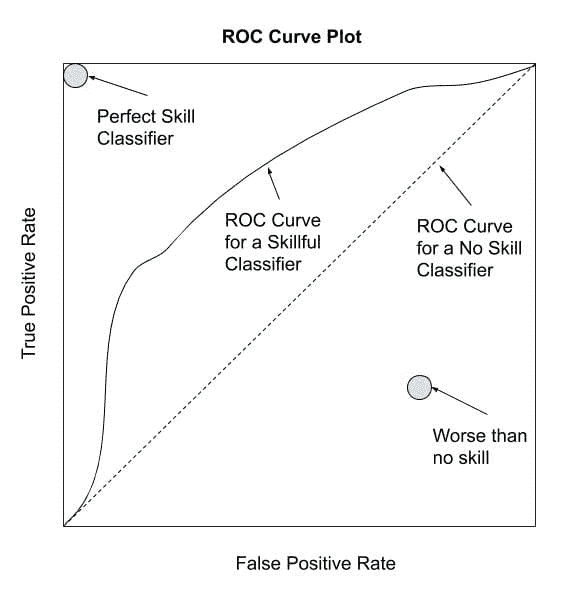
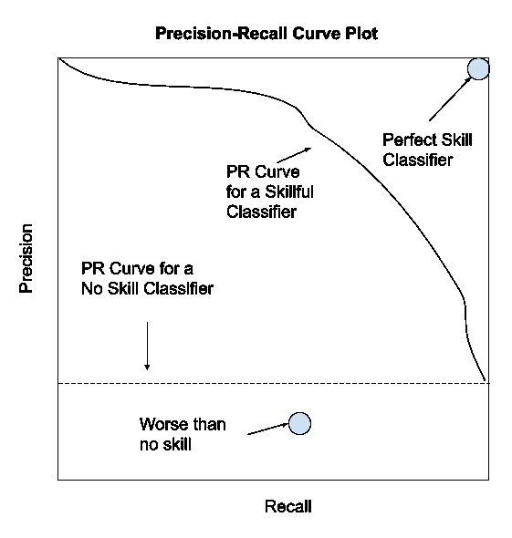

# 不平衡分类的评估指标之旅

> 原文：<https://machinelearningmastery.com/tour-of-evaluation-metrics-for-imbalanced-classification/>

最后更新于 2021 年 5 月 1 日

一个分类器只和用来评估它的度量一样好。

如果您选择了错误的指标来评估您的模型，您很可能会选择一个糟糕的模型，或者在最坏的情况下，在模型的预期表现方面被误导。

在应用机器学习中，选择合适的度量标准通常具有挑战性，但对于不平衡的分类问题尤其困难。首先，因为大多数广泛使用的标准度量假设了平衡的类分布，并且因为通常不是所有的类，因此不是所有的预测误差，对于不平衡的分类是相等的。

在本教程中，您将发现可用于不平衡分类的指标。

完成本教程后，您将知道:

*   关于选择用于分类的度量的挑战，以及当存在偏斜的类分布时如何特别困难。
*   如何评估分类器模型有三种主要的度量，称为等级、阈值和概率。
*   如果你不知道从哪里开始，如何选择不平衡分类的度量。

**用我的新书[Python 不平衡分类](https://machinelearningmastery.com/imbalanced-classification-with-python/)启动你的项目**，包括*分步教程*和所有示例的 *Python 源代码*文件。

我们开始吧。


不平衡分类评估指标之旅
图片由[特拉维斯·怀斯](https://flickr.com/photos/photographingtravis/16665619165/)提供，保留部分权利。

## 教程概述

本教程分为三个部分；它们是:

1.  评估指标的挑战
2.  分类器评估度量的分类
3.  如何选择评估指标

## 评估指标的挑战

评估指标量化了预测模型的表现。

这通常涉及在数据集上训练模型，使用该模型对训练期间未使用的保持数据集进行预测，然后将预测与保持数据集中的期望值进行比较。

对于分类问题，度量包括将预期的类标签与预测的类标签进行比较，或者解释问题的类标签的预测概率。

选择模型，甚至数据准备方法都是一个由评估标准指导的搜索问题。用不同的模型进行实验，每个实验的结果用一个度量来量化。

> 评估措施在评估分类表现和指导分类器建模方面都起着至关重要的作用。

——[不平衡数据的分类:综述](https://www.worldscientific.com/doi/abs/10.1142/S0218001409007326)，2009。

有标准的度量标准被广泛用于评估分类预测模型，例如分类准确率或分类误差。

标准度量在大多数问题上运行良好，这就是为什么它们被广泛采用的原因。但是所有的度量都是对问题或者问题中什么是重要的做出假设。因此，必须选择一个最能抓住您或您的项目涉众认为模型或预测的重要之处的评估指标，这使得选择模型评估指标具有挑战性。

当班级分布出现偏差时，这一挑战变得更加困难。其原因是，当类别不平衡或严重不平衡时，许多标准指标变得不可靠甚至误导，例如少数和多数类别之间的比例为 1:100 或 1:1000。

> 在阶级不平衡的情况下，这个问题甚至更加尖锐，因为当数据倾斜时，用于未类别数据的默认的、相对健壮的过程会崩溃。

—第 187 页，[不平衡学习:基础、算法和应用](https://amzn.to/32K9K6d)，2013。

例如，报告严重不平衡分类问题的分类准确性可能会产生危险的误导。如果项目涉众利用结果得出结论或计划新项目，就会出现这种情况。

> 事实上，在不平衡的领域中使用通用的度量会导致次优的分类模型，并且可能产生误导性的结论，因为这些度量对倾斜的领域不敏感。

——[不平衡分布下的预测建模综述](https://arxiv.org/abs/1505.01658)，2015 年。

重要的是，在处理不平衡分类时，通常需要不同的评估指标。

与将所有类别视为同等重要的标准评估指标不同，不平衡分类问题通常将少数类别的分类错误评定为比多数类别的分类错误更重要。因此，可能需要关注少数群体的表现指标，这很有挑战性，因为少数群体缺乏训练有效模型所需的观察。

> 不平衡数据集的主要问题在于，它们通常与用户偏好倾向于在可用数据样本中表现不佳的情况下的表现有关。

——[不平衡分布下的预测建模综述](https://arxiv.org/abs/1505.01658)，2015 年。

现在我们已经熟悉了选择模型评估指标的挑战，让我们来看一些我们可以从中选择的不同指标的例子。

## 分类器评估度量的分类

当评估分类器模型时，有几十个度量可供选择，如果你考虑学术界提出的度量的所有宠物版本，可能有几百个。

为了掌握可供选择的指标，我们将使用塞萨尔·费里等人在 2008 年发表的题为“T2:分类表现指标的实验比较”的论文中提出的分类法 2013 年的《T4》不平衡学习也采用了这个方法，我认为证明是有用的。

我们可以将评估指标分为三个有用的组；它们是:

1.  阈值度量
2.  排名指标
3.  概率度量。

这种划分是有用的，因为从业者通常用于分类器的顶级度量，特别是不平衡的分类，完全符合分类法。

> 一些机器学习研究人员已经确定了在分类环境中使用的三类评估指标。这些是阈值度量(例如，准确度和 f 测度)、排名方法和度量(例如，接收器操作特性(ROC)分析和 AUC)以及概率度量(例如，均方根误差)。

—第 189 页，[不平衡学习:基础、算法和应用](https://amzn.to/32K9K6d)，2013。

让我们依次仔细看看每一组。

### 不平衡分类的阈值度量

阈值度量是量化分类预测误差的度量。

也就是说，它们旨在总结预测类与保持数据集中的预期类不匹配时的分数、比率或比率。

> 基于阈值的度量和对错误的定性理解……当我们想要一个模型来最小化错误的数量时，使用这些度量。

——[分类表现指标的实验比较](https://www.sciencedirect.com/science/article/abs/pii/S0167865508002687)，2008 年。

也许最广泛使用的阈值度量是分类准确率。

*   **准确性** =正确预测/总预测

而分类准确率的补充称为分类误差。

*   **误差** =不正确的预测/总预测

尽管分类准确率被广泛使用，但它几乎普遍不适用于不平衡分类。原因是，高准确率(或低误差)可以通过只预测多数类的无技能模型来实现。

有关分类准确性失败的更多信息，请参见教程:

*   [不平衡类别分布的分类准确率故障](https://machinelearningmastery.com/failure-of-accuracy-for-imbalanced-class-distributions/)

对于不平衡分类问题，多数类通常称为阴性结果(如“*无变化*”或“*阴性检测结果*”)，少数类通常称为阳性结果(如“*变化*”或“*阳性检测结果*”)。

*   **多数类**:否定结果，0 类。
*   **小众类**:正面结局，1 类。

大多数阈值度量可以通过二进制(两类)分类问题的混淆矩阵中使用的术语来最好地理解。这并不意味着度量被限制用于二进制分类；这只是一种快速理解被测量内容的简单方法。

混淆矩阵不仅能更深入地了解预测模型的表现，还能更深入地了解哪些类被正确预测，哪些被错误预测，以及出现了什么类型的错误。在这种类型的混淆矩阵中，表中的每个单元格都有一个具体且易于理解的名称，总结如下:

```py
               | Positive Prediction | Negative Prediction
Positive Class | True Positive (TP)  | False Negative (FN)
Negative Class | False Positive (FP) | True Negative (TN)
```

有两组度量可能对不平衡分类有用，因为它们集中在一个类上；它们是敏感性-特异性和精确性-回忆。

#### 灵敏度-特异性指标

敏感度指的是真实的阳性率，并总结了阳性等级的预测情况。

*   **灵敏度** =真正/(真正+假负)

特异性是敏感性的补充，或者说是真正的阴性率，总结了阴性等级的预测情况。

*   **特异性** =真阴性/(假阳性+真阴性)

对于不平衡分类，敏感性可能比特异性更有趣。

敏感性和特异性可以结合成一个单一的分数来平衡这两个问题，称为[几何平均值](https://machinelearningmastery.com/arithmetic-geometric-and-harmonic-means-for-machine-learning/)或 G 均值。

*   **G 均值** = sqrt(灵敏度*特异性)

#### 准确率-召回度量

Precision 汇总了分配给正类的属于正类的示例的比例。

*   **准确率** =真正/(真正+假正)

回忆总结了正类的预测效果，与敏感度的计算是一样的。

*   **回忆** =真阳性/(真阳性+假阴性)

精确度和召回率可以合并成一个分数，寻求平衡这两个问题，称为 F 分数或 F 度量。

*   **F-Measure** = (2 *准确率*召回)/(准确率+召回)

F-Measure 是一种流行的不平衡分类度量。

Fbeta 测度是 F 测度的抽象，其中[谐波均值](https://machinelearningmastery.com/arithmetic-geometric-and-harmonic-means-for-machine-learning/)计算中的准确率和召回率的平衡由一个称为*β*的系数控制。

*   **fbeta-measure**=((1+beta^2)*准确率*召回)/ (beta^2 *准确率+召回)

有关不平衡分类的准确率、召回率和 F-measure 的更多信息，请参见教程:

*   [如何计算不平衡分类的准确率、召回率和 F-Measure](https://machinelearningmastery.com/precision-recall-and-f-measure-for-imbalanced-classification/)

#### 附加阈值指标

这些可能是最受欢迎的度量标准，尽管还有很多其他的存在。为了让您品尝一下，这些包括卡帕，宏观平均准确率，平均类加权准确率，优化准确率，调整几何平均，平衡准确率，等等。

阈值指标易于计算和理解。

这些度量的一个限制是，当使用模型进行预测时，它们假设在训练数据集中观察到的类分布将匹配测试集中和真实数据中的分布。这是常有的事，但如果不是这样，表现可能会相当误导。

> 上一节中讨论的所有阈值度量的一个重要缺点是，它们假设完全了解部署分类器的条件。特别是，他们假设训练集中存在的类别不平衡是在分类器的整个运行寿命中会遇到的

—第 196 页，[不平衡学习:基础、算法和应用](https://amzn.to/32K9K6d)，2013。

排名指标不会对类别分布做出任何假设。

### 不平衡分类的排序度量

等级度量更关心的是基于分类器在分类方面的有效性来评估分类器。

> 基于模型如何对示例进行排序的度量标准……这些对于许多应用程序……非常重要，在这些应用程序中，分类器用于选择数据集的最佳 n 个实例，或者当良好的类分离至关重要时。

——[分类表现指标的实验比较](https://www.sciencedirect.com/science/article/abs/pii/S0167865508002687)，2008 年。

这些度量要求分类器预测类别成员的分数或概率。

根据这个分数，可以应用不同的阈值来测试分类器的有效性。那些在一系列阈值上保持良好分数的模型将具有良好的类分离，并且排名会更高。

> …考虑一个分类器，它给出了一个实例的数值分数，该实例被分类为正类。因此，分数引入了一个粒度级别，而不是简单的正或负预测

–第 53 页，[从不平衡数据集](https://amzn.to/307Xlva)中学习，2018。

最常用的排名指标是 ROC 曲线或 ROC 分析。

ROC 是一个首字母缩略词，意思是接收器操作特性，总结了一个基于二进制分类器的分类能力来分析二进制分类器的研究领域。

ROC 曲线是一种诊断图，用于通过计算模型在不同阈值下对一组预测的假阳性率和真阳性率来总结模型的行为。

真正的阳性率是召回率或敏感度。

*   **真阳性** =真阳性/(真阳性+假阴性)

假阳性率计算如下:

*   **假阳性** =假阳性/(假阳性+真阴性)

每个阈值都是图上的一个点，这些点连接起来形成一条曲线。没有技能的分类器(例如，预测所有阈值下的多数类)将由从左下角到右上角的对角线表示。

这条线以下的任何点都比没有技能差。一个完美的模型将是剧情左上角的一个点。



ROC 曲线的描绘

ROC 曲线对一个模型是一个有用的诊断。

可以计算 ROC 曲线下的面积，并提供单个分数来总结可用于比较模型的图。

无技能分类器的得分为 0.5，而完美分类器的得分为 1.0。

*   **ROC AUC** =曲线下的 ROC 面积

虽然一般有效，但 ROC 曲线和 ROC AUC 在严重的阶级不平衡下可以乐观，尤其是当少数阶级的例子数量很少时。

ROC 曲线的另一种选择是准确率-召回率曲线，它可以以类似的方式使用，尽管侧重于少数类分类器的表现。

同样，模型对一组预测使用不同的阈值，在这种情况下，计算准确率和召回率。这些点形成一条曲线，在一系列不同阈值下表现更好的分类器将被排列得更高。

无技能分类器将是图上的一条水平线，其准确率与数据集中的正例数成正比。对于平衡数据集，这将是 0.5。一个完美的分类器由右上角的一个点表示。



精确-召回曲线的描绘

像 ROC 曲线一样，准确率-召回曲线是评估单个分类器的有用诊断工具，但对比较分类器具有挑战性。

像 ROC AUC 一样，我们可以计算曲线下的面积作为分数，并使用该分数来比较分类器。在这种情况下，对少数类的关注使得精确-召回 AUC 对不平衡分类问题更有用。

*   **PR AUC** =曲线下准确率-召回区域

还有其他不太广泛使用的排名指标，例如针对不平衡分类和成本曲线修改 ROC 曲线。

有关不平衡分类的 ROC 曲线和准确率-召回曲线的更多信息，请参见教程:

*   [不平衡分类的 ROC 曲线和准确率-召回曲线](https://machinelearningmastery.com/roc-curves-and-precision-recall-curves-for-imbalanced-classification/)

### 不平衡分类的概率度量

概率度量是专门为量化分类器预测的不确定性而设计的。

对于我们对不正确和正确的班级预测不太感兴趣，而对模型在预测中的不确定性和惩罚那些错误但高度自信的预测更感兴趣的问题，这些是有用的。

> 基于对错误的概率理解的度量，即测量与真实概率的偏差[……]当我们想要评估分类器的可靠性时，这些度量特别有用，不仅测量它们何时失败，而且测量它们是否以高或低的概率选择了错误的类别。

——[分类表现指标的实验比较](https://www.sciencedirect.com/science/article/abs/pii/S0167865508002687)，2008 年。

基于预测概率评估模型需要校准概率。

一些分类器使用概率框架来训练，例如最大似然估计，这意味着它们的概率已经被校准。逻辑回归就是一个例子。

许多非线性分类器不是在概率框架下训练的，因此在通过概率度量评估之前，需要对照数据集校准它们的概率。例子可能包括支持向量机和 k 近邻。

评估预测概率最常用的度量标准可能是二进制分类的对数损失(或负对数似然)，或者更一般地称为[交叉熵](https://machinelearningmastery.com/cross-entropy-for-machine-learning/)。

对于预期值为 y 而预测值为 yhat 的二进制类别数据集，可以通过以下方式计算:

*   **log loss**=(1–y)* log(1–y hat)+y * log(y hat))

分数可以通过简单地添加术语来推广到多个类别；例如:

*   **log loss**=-(C y _ C * log(yhat _ C)中的和 C)

分数总结了两个概率分布之间的平均差异。一个完美的分类器的对数损失为 0.0，更差的值为正直到无穷大。

预测概率的另一个流行分数是布瑞尔分数。

布瑞尔分数的好处是它集中在正类上，对于不平衡分类来说，正类就是少数类。这使得它比关注整个概率分布的对数损失更可取。

Brier 分数计算为正类的预期概率(例如 1.0)和预测概率之间的均方误差。回想一下，均方误差是值之间的平方差的平均值。

*   **brierscore**= 1/n * I 与 n 之和(yhat _ I–y_i)^2

完美的分类器的 Brier 评分为 0.0。尽管典型地用二进制分类任务来描述，布瑞尔分数也可以被计算用于多类分类问题。

不同分类器的 Brier 评分差异可能非常小。为了解决这个问题，可以对照参考分数来缩放分数，例如来自无技能分类器的分数(例如，预测训练数据集中正类的概率分布)。

使用参考分数，可以计算布瑞尔技能分数，即 BSS，其中 0.0 表示没有技能，比没有技能更差的结果为负，完美技能由值 1.0 表示。

*   **BrierSkillScore**= 1 –( BrierScore/BrierScore _ ref)

尽管概率评分方法在平衡分类问题中很受欢迎，但在具有倾斜类分布的分类问题中使用得不太广泛。

有关不平衡分类的概率度量的更多信息，请参见教程:

*   [不平衡分类概率度量的温和介绍](https://machinelearningmastery.com/probability-metrics-for-imbalanced-classification/)

## 如何选择评估指标

有大量的模型评估指标可供选择。

考虑到选择评估指标非常重要，并且有几十个甚至上百个指标可供选择，你应该怎么做？

> 学习模型的正确评估是模式识别中最重要的问题之一。

——[分类表现指标的实验比较](https://www.sciencedirect.com/science/article/abs/pii/S0167865508002687)，2008 年。

也许最好的方法是与项目涉众交谈，弄清楚一个模型或一组预测的重要之处。然后选择几个看起来能抓住重要点的指标，然后用不同的场景测试这个指标。

一个场景可能是一个测试数据集的模拟预测集，它具有与您的问题域相匹配的倾斜类分布。如果一个模型预测了所有的多数类、所有的少数类、做得好、做得差等等，你可以测试这个度量发生了什么。一些小的测试可以快速帮助你了解这个指标的表现。

另一种方法可能是进行文献综述，并发现从事相同类型问题的其他从业者或学者最常用的度量标准。这通常很有见地，但要注意的是，一些研究领域可能会陷入群体思维，并采用一种可能非常适合大规模比较大量模型，但在实践中对模型选择来说很糟糕的度量标准。

还不知道？

以下是一些首要建议:

*   **你在预测概率吗？**
    *   **需要类标签吗？**
        *   **正课更重要吗？**
            *   使用准确率-召回 AUC
        *   **两个班都重要吗？**
            *   使用 ROC AUC
    *   **你需要概率吗？**
        *   使用简短分数和简短技能分数
*   **你在预测类标签吗？**
    *   **正课更重要吗？**
        *   **假阴性和假阳性同等重要吗？**
            *   使用 F1-测量
        *   **假阴性更重要吗？**
            *   使用 F2-测量
        *   **假阳性更重要吗？**
            *   使用 f 0.5-测量
    *   **两个班都重要吗？**
        *   **多数班有< 80%-90%的例子吗？**
            *   使用精确度
        *   **多数班有> 80%-90%的例子吗？**
            *   使用 G 均值

这些建议将重要的情况考虑在内，我们可以使用预测概率的模型，但是需要清晰的类标签。这是一类重要的问题，允许操作者或实现者选择阈值来权衡错误分类错误。在这种情况下，需要考虑所有合理阈值的误差指标，因此需要使用曲线下面积指标。

我们可以将这些建议转化为有用的模板。


如何选择不平衡分类的度量

## 进一步阅读

如果您想更深入地了解这个主题，本节将提供更多资源。

### 报纸

*   [分类表现测量的实验比较](https://www.sciencedirect.com/science/article/abs/pii/S0167865508002687)，2008。
*   [不平衡数据的分类:综述](https://www.worldscientific.com/doi/abs/10.1142/S0218001409007326)，2009。
*   [不平衡分布下的预测建模综述](https://arxiv.org/abs/1505.01658)，2015。

### 书

*   第 8 章不平衡学习的评估指标，[不平衡学习:基础、算法和应用](https://amzn.to/32K9K6d)，2013。
*   [第三章绩效衡量，从不平衡数据集学习](https://amzn.to/307Xlva)，2018。

### 文章

*   [精准与召回，维基百科](https://en.wikipedia.org/wiki/Precision_and_recall)。
*   [敏感性和特异性，维基百科](https://en.wikipedia.org/wiki/Sensitivity_and_specificity)。
*   [接收机工作特性，维基百科](https://en.wikipedia.org/wiki/Receiver_operating_characteristic)。
*   [交叉熵，维基百科](https://en.wikipedia.org/wiki/Cross_entropy)。
*   [布瑞尔评分，维基百科](https://en.wikipedia.org/wiki/Brier_score)。

## 摘要

在本教程中，您发现了可以用于不平衡分类的指标。

具体来说，您了解到:

*   关于选择用于分类的度量的挑战，以及当存在偏斜的类分布时如何特别困难。
*   如何评估分类器模型有三种主要的度量，称为等级、阈值和概率。
*   如果你不知道从哪里开始，如何选择不平衡分类的度量。

你有什么问题吗？
在下面的评论中提问，我会尽力回答。