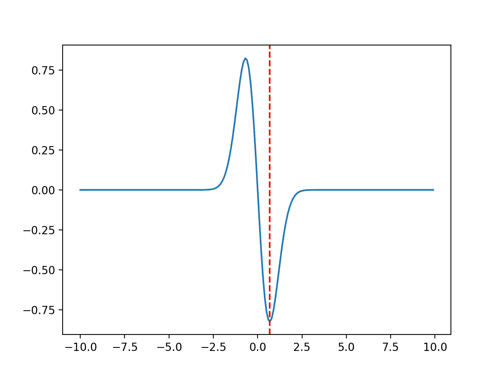
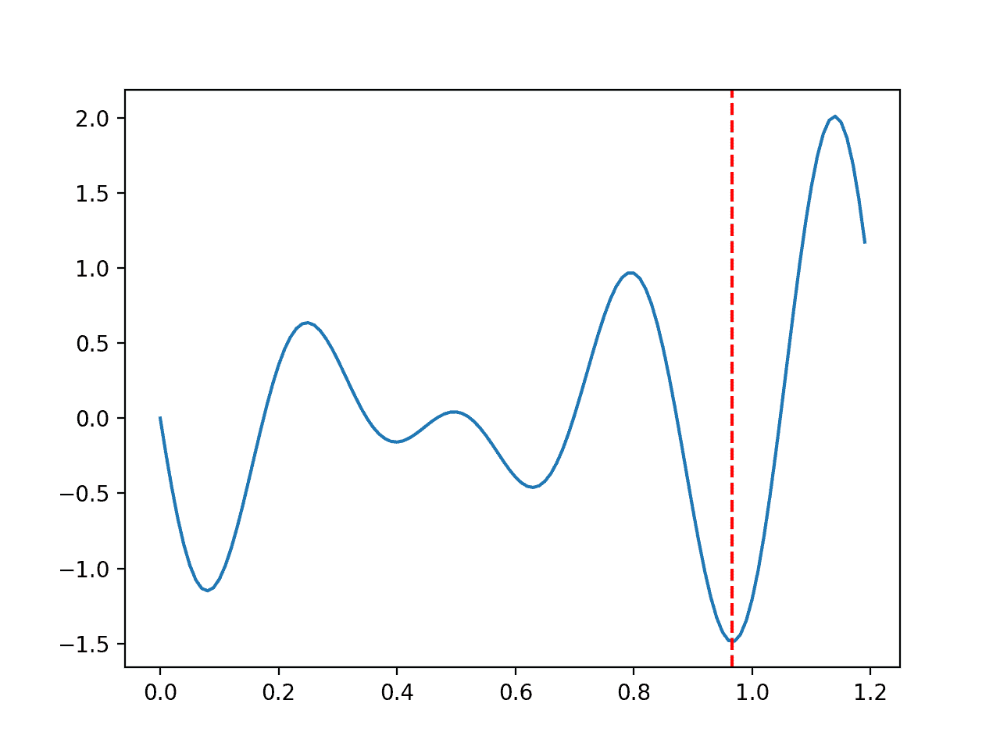
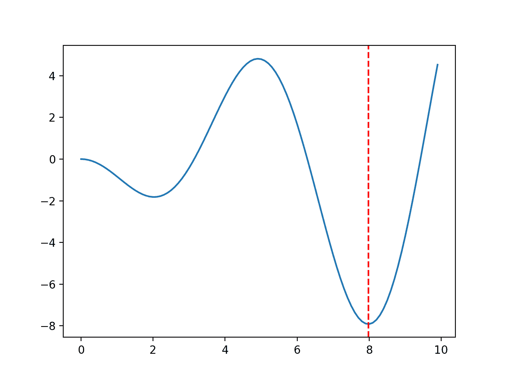
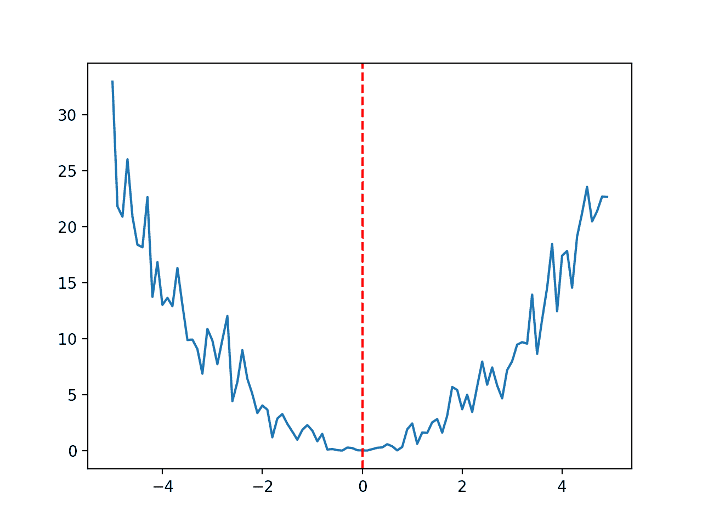

# 用于函数优化的一维测试函数

> 原文：<https://machinelearningmastery.com/1d-test-functions-for-function-optimization/>

最后更新于 2021 年 9 月 25 日

函数优化是一个研究领域，它寻求函数的输入，从而得到函数的最大或最小输出。

有大量的优化算法，在简单和易于可视化的测试函数上研究和开发优化算法的直觉是很重要的。

**一维函数**取单个输入值，输出输入的单个评估。它们可能是研究函数优化时最简单的测试函数。

一维函数的好处是，它们可以被可视化为二维图，x 轴上的函数输入和 y 轴上的函数输出。函数的已知最佳值和函数的任何采样值也可以画在同一个图上。

在本教程中，您将发现学习函数优化时可以使用的标准一维函数。

**用我的新书[机器学习优化](https://machinelearningmastery.com/optimization-for-machine-learning/)启动你的项目**，包括*分步教程*和所有示例的 *Python 源代码*文件。

Let’s get started.

函数优化的一维(1D)测试功能
图片由 [Max Benidze](https://www.flickr.com/photos/maxbenidze/43478502114/) 提供，保留部分权利。

## 教程概述

我们可以使用许多不同类型的简单一维测试函数。

然而，在函数优化领域中，有一些常用的标准测试函数。在测试不同的算法时，我们可能希望选择测试函数的特定属性。

我们将在本教程中探索少量简单的一维测试函数，并用五个不同的组按照它们的属性来组织它们；它们是:

1.  凸单峰函数
2.  非凸单峰函数
3.  多模态函数
4.  不连续函数(非光滑)
5.  噪声函数

每个函数都将使用 Python 代码呈现，带有目标目标函数的函数实现和该函数的示例，该示例显示为带有明确标记的函数最优值的线图。

所有函数都表示为最小化问题，例如，找到导致函数最小(最小值)输出的输入。通过给所有输出加上负号，任何最大化函数都可以变成最小化函数。类似地，任何最小化函数都可以用同样的方法最大化。

这些功能不是我发明的；它们取自文献。有关参考资料，请参见进一步阅读部分。

然后，您可以选择并复制粘贴一个或多个函数的代码，以便在自己的项目中研究或比较优化算法的行为。

## 凸单峰函数

一个[凸函数](https://en.wikipedia.org/wiki/Convex_function)是一个可以在域内任意两点之间画一条线，并且这条线保持在域内的函数。

对于显示为二维图的一维函数，这意味着该函数具有碗形，并且两者之间的线保持在碗的上方。

[单峰](https://en.wikipedia.org/wiki/Unimodality)表示函数有一个单一的最优值。凸函数可以是单峰的，也可以不是单峰的；类似地，单峰函数可以是凸的，也可以不是凸的。

下面函数的范围限制在-5.0 和 5.0 之间，最佳输入值为 0.0。

```py
# convex unimodal optimization function
from numpy import arange
from matplotlib import pyplot

# objective function
def objective(x):
	return x**2.0

# define range for input
r_min, r_max = -5.0, 5.0
# sample input range uniformly at 0.1 increments
inputs = arange(r_min, r_max, 0.1)
# compute targets
results = objective(inputs)
# create a line plot of input vs result
pyplot.plot(inputs, results)
# define optimal input value
x_optima = 0.0
# draw a vertical line at the optimal input
pyplot.axvline(x=x_optima, ls='--', color='red')
# show the plot
pyplot.show()
```

运行该示例会创建函数的线图，并用红线标记 optima。


凸单峰优化函数的线图

通过增加或减少一个恒定值，例如 5 + x^2.，该功能可以在数字线上向前或向后移动

如果希望将最佳输入从 0.0 的值移开，这可能是有用的。

## 非凸单峰函数

如果不能在域中的两点之间画一条线，并且这条线仍在域中，则函数是非凸的。

这意味着可以在域中找到两个点，在这两个点之间的直线与函数的线图相交。

典型地，如果一维函数的一个图有不止一个山或谷，那么我们立即知道该函数是非凸的。然而，非凸函数可以是单峰的，也可以不是单峰的。

我们感兴趣优化的大多数实函数都是非凸的。

下面函数的范围限制在-10.0 和 10.0 之间，最佳输入值为 0.67956。

```py
# non-convex unimodal optimization function
from numpy import arange
from numpy import sin
from numpy import exp
from matplotlib import pyplot

# objective function
def objective(x):
	return -(x + sin(x)) * exp(-x**2.0)

# define range for input
r_min, r_max = -10.0, 10.0
# sample input range uniformly at 0.1 increments
inputs = arange(r_min, r_max, 0.1)
# compute targets
results = objective(inputs)
# create a line plot of input vs result
pyplot.plot(inputs, results)
# define optimal input value
x_optima = 0.67956
# draw a vertical line at the optimal input
pyplot.axvline(x=x_optima, ls='--', color='red')
# show the plot
pyplot.show()
```

运行该示例会创建函数的线图，并用红线标记 optima。



非凸单峰优化函数的线图

## 多模态函数

A [多模态功能](https://en.wikipedia.org/wiki/Multimodal_distribution)是指具有一个以上“*模式*或 optima(如谷值)的功能。

多峰函数是非凸的。

可能有一个全局最优解和一个或多个局部或欺骗性最优解。或者，可能有多个全局最优值，即多个不同的输入导致相同的函数最小输出。

让我们看几个多模态函数的例子。

### 多模式功能 1

范围以-2.7 和 7.5 为界，最佳输入值为 5.145735。

```py
# multimodal function
from numpy import sin
from numpy import arange
from matplotlib import pyplot

# objective function
def objective(x):
	return sin(x) + sin((10.0 / 3.0) * x)

# define range for input
r_min, r_max = -2.7, 7.5
# sample input range uniformly at 0.1 increments
inputs = arange(r_min, r_max, 0.1)
# compute targets
results = objective(inputs)
# create a line plot of input vs result
pyplot.plot(inputs, results)
# define optimal input value
x_optima = 5.145735
# draw a vertical line at the optimal input
pyplot.axvline(x=x_optima, ls='--', color='red')
# show the plot
pyplot.show()
```

运行该示例会创建函数的线图，并用红线标记 optima。


多模态优化函数 1 的线图

## 多模态函数 2

范围以 0.0 和 1.2 为界，最佳输入值为 0.96609。

```py
# multimodal function
from numpy import sin
from numpy import arange
from matplotlib import pyplot

# objective function
def objective(x):
	return -(1.4 - 3.0 * x) * sin(18.0 * x)

# define range for input
r_min, r_max = 0.0, 1.2
# sample input range uniformly at 0.01 increments
inputs = arange(r_min, r_max, 0.01)
# compute targets
results = objective(inputs)
# create a line plot of input vs result
pyplot.plot(inputs, results)
# define optimal input value
x_optima = 0.96609
# draw a vertical line at the optimal input
pyplot.axvline(x=x_optima, ls='--', color='red')
# show the plot
pyplot.show()
```

运行该示例会创建函数的线图，并用红线标记 optima。



多模态优化函数 2 的线图

### 多模态函数 3

范围以 0.0 和 10.0 为界，最佳输入值为 7.9787。

```py
# multimodal function
from numpy import sin
from numpy import arange
from matplotlib import pyplot

# objective function
def objective(x):
	return -x * sin(x)

# define range for input
r_min, r_max = 0.0, 10.0
# sample input range uniformly at 0.1 increments
inputs = arange(r_min, r_max, 0.1)
# compute targets
results = objective(inputs)
# create a line plot of input vs result
pyplot.plot(inputs, results)
# define optimal input value
x_optima = 7.9787
# draw a vertical line at the optimal input
pyplot.axvline(x=x_optima, ls='--', color='red')
# show the plot
pyplot.show()
```

运行该示例会创建函数的线图，并用红线标记 optima。



多模态优化函数 3 的线图

## 不连续函数(非光滑)

一个函数可能有一个[间断](https://en.wikipedia.org/wiki/Classification_of_discontinuities)，这意味着函数输入的平滑变化可能导致输出的非平滑变化。

我们可以将具有这种性质的函数称为非光滑函数或不连续函数。

有许多不同类型的不连续性，尽管一个常见的例子是函数输出值的跳跃或方向的急剧变化，这在函数的图中很容易看到。

间断函数

范围在-2.0 和 2.0 之间，最佳输入值为 1.0。

```py
# non-smooth optimization function
from numpy import arange
from matplotlib import pyplot

# objective function
def objective(x):
	if x > 1.0:
		return x**2.0
	elif x == 1.0:
		return 0.0
	return 2.0 - x

# define range for input
r_min, r_max = -2.0, 2.0
# sample input range uniformly at 0.1 increments
inputs = arange(r_min, r_max, 0.1)
# compute targets
results = [objective(x) for x in inputs]
# create a line plot of input vs result
pyplot.plot(inputs, results)
# define optimal input value
x_optima = 1.0
# draw a vertical line at the optimal input
pyplot.axvline(x=x_optima, ls='--', color='red')
# show the plot
pyplot.show()
```

运行该示例会创建函数的线图，并用红线标记 optima。


不连续优化函数的线图

## 噪声函数

一个函数可能有噪声，这意味着每个评估可能有一个随机分量，每次都会稍微改变函数的输出。

通过向输入值添加小的高斯随机数，可以使任何无噪声函数变得有噪声。

下面函数的范围限制在-5.0 和 5.0 之间，最佳输入值为 0.0。

```py
# noisy optimization function
from numpy import arange
from numpy.random import randn
from matplotlib import pyplot

# objective function
def objective(x):
	return (x + randn(len(x))*0.3)**2.0

# define range for input
r_min, r_max = -5.0, 5.0
# sample input range uniformly at 0.1 increments
inputs = arange(r_min, r_max, 0.1)
# compute targets
results = objective(inputs)
# create a line plot of input vs result
pyplot.plot(inputs, results)
# define optimal input value
x_optima = 0.0
# draw a vertical line at the optimal input
pyplot.axvline(x=x_optima, ls='--', color='red')
# show the plot
pyplot.show()
```

运行该示例会创建函数的线图，并用红线标记 optima。



噪声优化函数的线图

## 进一步阅读

如果您想更深入地了解这个主题，本节将提供更多资源。

### 文章

*   [测试函数进行优化，维基百科](https://en.wikipedia.org/wiki/Test_functions_for_optimization)。
*   [仿真实验虚拟库:测试函数和数据集](https://www.sfu.ca/~ssurjano/optimization.html)
*   [全局优化基准和 AMPGO，一维测试功能](http://infinity77.net/global_optimization/test_functions_1d.html)

## 摘要

在本教程中，您发现了学习函数优化时可以使用的标准一维函数。

**您是否在使用上述任何功能？**
下面的评论让我知道是哪一个。

**你有什么问题吗？**
在下面的评论中提问，我会尽力回答。