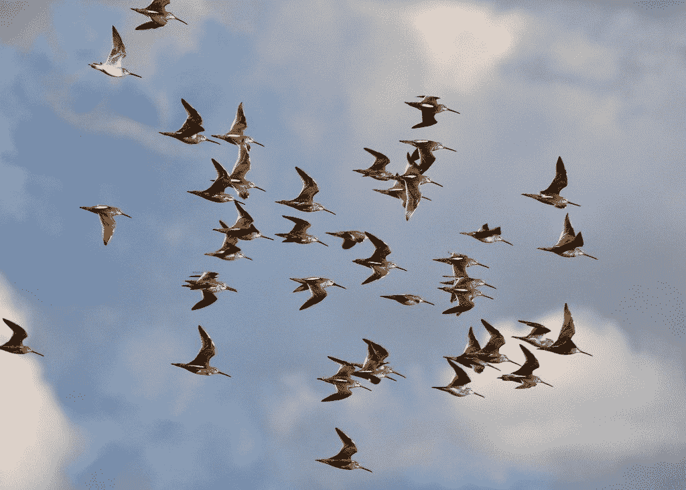
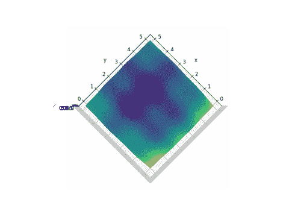
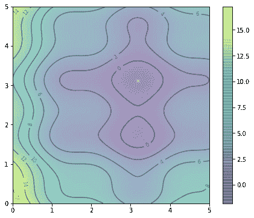
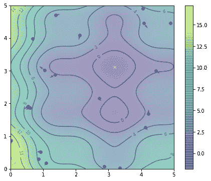
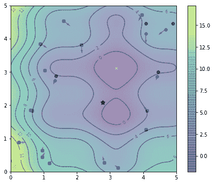
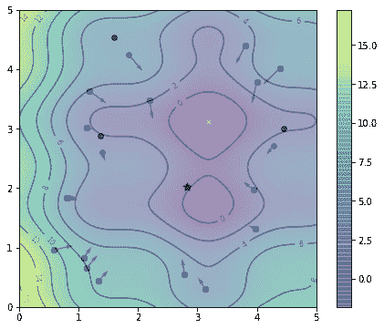
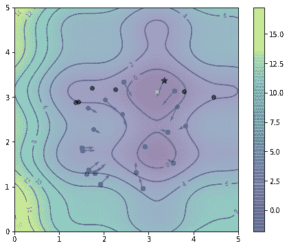
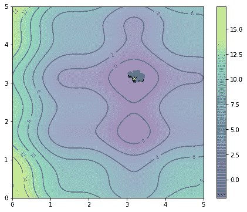

# 粒子群优化的温和介绍

> 原文：<https://machinelearningmastery.com/a-gentle-introduction-to-particle-swarm-optimization/>

最后更新于 2021 年 10 月 12 日

粒子群优化算法是一种生物启发算法，它是一种在解空间中寻找最优解的简单算法。它与其他优化算法的不同之处在于，它只需要目标函数，并且不依赖于目标的梯度或任何微分形式。它的超参数也很少。

在本教程中，您将通过一个例子学习粒子群算法的基本原理及其算法。参加完本教程后，您将会知道:

*   粒子群算法下的粒子群及其行为是什么
*   粒子群算法能解决什么样的优化问题
*   如何使用粒子群优化算法解决问题
*   粒子群算法有哪些变化

**用我的新书[机器学习优化](https://machinelearningmastery.com/optimization-for-machine-learning/)启动你的项目**，包括*分步教程*和所有示例的 *Python 源代码*文件。

Let’s get started.

## 粒子群

**粒子群优化**是肯尼迪和埃伯哈特在 1995 年提出的。正如在原始论文中提到的，社会生物学家认为一群鱼或一群鸟在一个群体中移动“可以从所有其他成员的经验中受益”。换句话说，例如，当一只鸟在飞行并随机寻找食物时，鸟群中的所有鸟都可以分享它们的发现，并帮助整个鸟群获得最佳的狩猎。



粒子群优化。
唐·德博尔德摄，版权所有。

我们可以模拟一群鸟的运动的同时，也可以想象每一只鸟都是帮助我们在高维解空间中寻找最优解，而鸟群找到的最优解就是空间中的最优解。这是一个**启发式解**，因为我们永远无法证明真正的**全局最优**解是可以找到的，而它通常不是。然而，我们经常发现粒子群算法找到的解非常接近全局最优解。

## 示例优化问题

粒子群算法最适合用来寻找多维向量空间上定义的函数的最大值或最小值。假设我们有一个函数$f(X)$从向量参数$X$(如坐标$(x，y)$在一个平面中)产生一个实值，并且$X$可以取空间中几乎任何值(例如，$f(X)$是高度，我们可以为平面上的任何点找到一个)，那么我们可以应用 PSO。粒子群算法将返回它发现的产生最小$f(X)$的参数$X$。

让我们从下面的函数开始

$
f(x，y)=(x-3.14)^2+(y-2.72)^2+\ sin(3x+1.41)+\ sin(4y-1.73)
$



f(x，y)图

从上面的图中我们可以看到，这个函数看起来像一个弯曲的鸡蛋纸盒。它不是一个**凸函数**，因此很难找到它的最小值，因为找到的一个**局部最小值**不一定是**全局最小值**。

那么如何才能找到这个函数的最小值呢？当然，我们可以求助于穷举搜索:如果我们检查平面上每个点的$f(x，y)$的值，我们可以找到最小点。或者我们可以在平面上随机找一些样本点，看看在$f(x，y)$上哪个给出的值最低，如果我们认为搜索每个点太贵的话。然而，我们也从$f(x，y)$的形状中注意到，如果我们找到了一个具有较小值$f(x，y)$的点，那么在它的邻近点附近更容易找到一个更小的值。

粒子群优化就是这样做的。类似于鸟群寻找食物，我们从平面上的多个随机点开始(称之为**粒子**)，让它们在随机方向寻找最小点。在每一步中，每个粒子都应该围绕它曾经找到的最小点以及整个粒子群找到的最小点进行搜索。经过一定的迭代，我们认为函数的最小点是这个粒子群探索过的最小点。

## 算法详细信息

假设我们有$P$粒子，我们把粒子$i$在迭代$t$中的位置表示为$X^i(t)$，在上面的例子中，我们把它表示为坐标$x^i(t =(x^i(t)，y^i(t)).$除了位置，我们还有每个粒子的速度，表示为$V^i(t)=(v_x^i(t)，v_y^i(t))$.在下一次迭代中，每个粒子的位置将被更新为
$
x^i(t+1)= x^i(t)+v^i(t+1)
$
或者等效地，
$
\ begin { aligned }
x^i(t+1)&= x^i(t)+v_x^i(t+1)\ \
y^i(t+1)&= y^i(t)+v_y^i(t+1)
\ end { aligned }
$
同时， 速度也由规则
$
v^i(t+1)=
w v^i(t)+c_1r_1(pbest^i–x^i(t)+c _ 2r _ 2(gbest–x^i(t)】
$
更新，其中$r_1$和$r_2$是 0 到 1 之间的随机数，常量$w$、$c_1$、和$c_2$是粒子群算法的参数，$pbest^i$是粒子$i$和$gbest$探索过的给出最佳$f(X)$值的位置

请注意，$pbest^i$和$X^i(t)$是两个位置向量，$pbest^i-x^i(t)$之间的差异是向量减法。将这个减法与原始速度$V^i(t)$相加，将使粒子回到$pbest^i$.位置 X^i(t)$.的差价也是如此

[](https://en.wikipedia.org/wiki/File:Vector_subtraction.svg)

向量减法。
公共领域本杰明·d·埃沙姆绘制的图表。

我们称参数$w$为惯性重量常数。它介于 0 和 1 之间，决定了粒子应该保持其先前速度(即搜索的速度和方向)的多少。参数$ C1 $和$ C2 $分别称为认知系数和社会系数。它们控制在细化粒子本身的搜索结果和识别群体的搜索结果之间应该给予多少权重。我们可以认为这些参数控制着**勘探**和**开采**之间的权衡。

$pbest^i$和$gbest$的位置在每次迭代中都会更新，以反映迄今为止找到的最佳位置。

该算法区别于其他优化算法的一个有趣的特性是它不依赖于目标函数的梯度。例如，在梯度下降中，我们通过将$X$移动到$-\nabla f(X)$的方向来寻找函数$f(X)$的最小值，因为这是函数下降最快的地方。对于当前位置$X$的任何粒子，它如何移动并不取决于哪个方向是“下坡”，而只取决于$pbest$和$gbest$在哪里。如果区分$f(X)$很困难，这使得粒子群算法特别适合。

粒子群算法的另一个特点是易于并行化。当我们操纵多个粒子来寻找最优解时，每个粒子都可以并行更新，我们只需要在每次迭代中收集一次$gbest$的更新值。这使得地图缩减架构成为实现粒子群优化的完美候选。

## 履行

这里我们展示了如何实现粒子群算法来找到最优解。

对于上面显示的相同函数，我们可以首先将其定义为 Python 函数，并在等高线图中显示:

```py
import numpy as np
import matplotlib.pyplot as plt

def f(x,y):
    "Objective function"
    return (x-3.14)**2 + (y-2.72)**2 + np.sin(3*x+1.41) + np.sin(4*y-1.73)

# Contour plot: With the global minimum showed as "X" on the plot
x, y = np.array(np.meshgrid(np.linspace(0,5,100), np.linspace(0,5,100)))
z = f(x, y)
x_min = x.ravel()[z.argmin()]
y_min = y.ravel()[z.argmin()]
plt.figure(figsize=(8,6))
plt.imshow(z, extent=[0, 5, 0, 5], origin='lower', cmap='viridis', alpha=0.5)
plt.colorbar()
plt.plot([x_min], [y_min], marker='x', markersize=5, color="white")
contours = plt.contour(x, y, z, 10, colors='black', alpha=0.4)
plt.clabel(contours, inline=True, fontsize=8, fmt="%.0f")
plt.show()
```



f(x，y)等值线图

这里我们在$0\le x，y\le 5$的范围内绘制了函数$f(x，y)$的曲线。我们可以在该区域的随机位置创建 20 个粒子，以及在平均值为 0、标准偏差为 0.1 的正态分布上采样的随机速度，如下所示:

```py
n_particles = 20
X = np.random.rand(2, n_particles) * 5
V = np.random.randn(2, n_particles) * 0.1
```

我们可以在相同的等高线图上显示它们的位置:



粒子的初始位置

由此，我们已经可以发现$gbest$是所有粒子找到的最佳位置。由于粒子根本没有探索，它们目前的位置也是它们的$pbest^i$:

```py
pbest = X
pbest_obj = f(X[0], X[1])
gbest = pbest[:, pbest_obj.argmin()]
gbest_obj = pbest_obj.min()
```

向量`pbest_obj`是每个粒子找到的目标函数的最佳值。类似地，`gbest_obj`是群找到的目标函数的最佳标量值。我们在这里使用`min()`和`argmin()`函数，因为我们将其设置为最小化问题。`gbest`的位置标记为下方的一颗星


gbest 的位置标记为星形

让我们设置$c_1=c_2=0.1$和$w=0.8$。然后我们可以根据上面提到的公式更新位置和速度，然后更新$pbest^i$和$gbest$之后:

```py
c1 = c2 = 0.1
w = 0.8
# One iteration
r = np.random.rand(2)
V = w * V + c1*r[0]*(pbest - X) + c2*r[1]*(gbest.reshape(-1,1)-X)
X = X + V
obj = f(X[0], X[1])
pbest[:, (pbest_obj >= obj)] = X[:, (pbest_obj >= obj)]
pbest_obj = np.array([pbest_obj, obj]).max(axis=0)
gbest = pbest[:, pbest_obj.argmin()]
gbest_obj = pbest_obj.min()
```

以下是第一次迭代后的位置。我们用黑点标记每个粒子的最佳位置，以区别于它们的当前位置，当前位置设置为蓝色。



一次迭代后粒子的位置

我们可以多次重复上面的代码段，看看粒子是如何探索的。这是第二次迭代后的结果:



两次迭代后粒子的位置

这是在第五次迭代之后，注意$gbest$的位置(用星号表示)发生了变化:



5 次迭代后粒子的位置

而经过第 20 次迭代，我们已经非常接近最优:



20 次迭代后粒子的位置

这个动画展示了随着算法的发展，我们是如何找到最优解的。看看你是否会发现一群鸟的运动有些相似之处:


粒子运动的动画

那么我们的解决方案有多接近呢？在这个特定的例子中，我们通过穷举搜索找到的全局最小值在坐标$(3.182，3.131)$处，而上面的 PSO 算法找到的最小值在$(3.185，3.130)$。

## 变化

所有的 PSO 算法大部分都和我们上面提到的一样。在上面的例子中，我们将粒子群算法设置为以固定的迭代次数运行。设置迭代次数来动态运行以响应进度是微不足道的。例如，一旦我们在多次迭代中看不到对全局最佳解决方案$gbest$的任何更新，我们就可以让它停止。

对粒子群算法的研究主要集中在如何确定超参数$w$、$c_1$、和$c_2$或随着算法的进展改变它们的值。例如，有人建议惯性权重线性递减。也有建议试图使认知系数 c_1$减少，而社会系数 c_2$增加，以在开始时带来更多的探索，在结束时带来更多的开发。例如，见史和埃伯哈特(1998 年)和埃伯哈特和史(2000 年)。

## 完整示例

应该很容易看出我们如何改变上面的代码来求解更高维的目标函数，或者从最小化切换到最大化。以下是找到上面提出的函数$f(x，y)$的最小值的完整示例，以及生成绘图动画的代码:

```py
import numpy as np
import matplotlib.pyplot as plt
from matplotlib.animation import FuncAnimation

def f(x,y):
    "Objective function"
    return (x-3.14)**2 + (y-2.72)**2 + np.sin(3*x+1.41) + np.sin(4*y-1.73)

# Compute and plot the function in 3D within [0,5]x[0,5]
x, y = np.array(np.meshgrid(np.linspace(0,5,100), np.linspace(0,5,100)))
z = f(x, y)

# Find the global minimum
x_min = x.ravel()[z.argmin()]
y_min = y.ravel()[z.argmin()]

# Hyper-parameter of the algorithm
c1 = c2 = 0.1
w = 0.8

# Create particles
n_particles = 20
np.random.seed(100)
X = np.random.rand(2, n_particles) * 5
V = np.random.randn(2, n_particles) * 0.1

# Initialize data
pbest = X
pbest_obj = f(X[0], X[1])
gbest = pbest[:, pbest_obj.argmin()]
gbest_obj = pbest_obj.min()

def update():
    "Function to do one iteration of particle swarm optimization"
    global V, X, pbest, pbest_obj, gbest, gbest_obj
    # Update params
    r1, r2 = np.random.rand(2)
    V = w * V + c1*r1*(pbest - X) + c2*r2*(gbest.reshape(-1,1)-X)
    X = X + V
    obj = f(X[0], X[1])
    pbest[:, (pbest_obj >= obj)] = X[:, (pbest_obj >= obj)]
    pbest_obj = np.array([pbest_obj, obj]).min(axis=0)
    gbest = pbest[:, pbest_obj.argmin()]
    gbest_obj = pbest_obj.min()

# Set up base figure: The contour map
fig, ax = plt.subplots(figsize=(8,6))
fig.set_tight_layout(True)
img = ax.imshow(z, extent=[0, 5, 0, 5], origin='lower', cmap='viridis', alpha=0.5)
fig.colorbar(img, ax=ax)
ax.plot([x_min], [y_min], marker='x', markersize=5, color="white")
contours = ax.contour(x, y, z, 10, colors='black', alpha=0.4)
ax.clabel(contours, inline=True, fontsize=8, fmt="%.0f")
pbest_plot = ax.scatter(pbest[0], pbest[1], marker='o', color='black', alpha=0.5)
p_plot = ax.scatter(X[0], X[1], marker='o', color='blue', alpha=0.5)
p_arrow = ax.quiver(X[0], X[1], V[0], V[1], color='blue', width=0.005, angles='xy', scale_units='xy', scale=1)
gbest_plot = plt.scatter([gbest[0]], [gbest[1]], marker='*', s=100, color='black', alpha=0.4)
ax.set_xlim([0,5])
ax.set_ylim([0,5])

def animate(i):
    "Steps of PSO: algorithm update and show in plot"
    title = 'Iteration {:02d}'.format(i)
    # Update params
    update()
    # Set picture
    ax.set_title(title)
    pbest_plot.set_offsets(pbest.T)
    p_plot.set_offsets(X.T)
    p_arrow.set_offsets(X.T)
    p_arrow.set_UVC(V[0], V[1])
    gbest_plot.set_offsets(gbest.reshape(1,-1))
    return ax, pbest_plot, p_plot, p_arrow, gbest_plot

anim = FuncAnimation(fig, animate, frames=list(range(1,50)), interval=500, blit=False, repeat=True)
anim.save("PSO.gif", dpi=120, writer="imagemagick")

print("PSO found best solution at f({})={}".format(gbest, gbest_obj))
print("Global optimal at f({})={}".format([x_min,y_min], f(x_min,y_min)))
```

## 进一步阅读

这些是最初提出粒子群优化算法的论文，以及早期关于优化其超参数的研究:

*   粒子群优化算法。在*国际神经网络会议记录*中；电气和电子工程师学会。第四卷。1995.1942-1948 页。DOI: 10.1109/ICNN.1995.488968
*   粒子群优化中惯性权重和收缩因子的比较。在*2000 年进化计算大会(CEC '00)* 的会议记录中。第一卷。2000.第 84-88 页。DOI: 10.1109/CEC.2000.870279
*   一种改进的粒子群优化算法。在 1998 年 IEEE 进化计算国际会议记录中。第 69-73 页。DOI: 10.1109/ICEC.1998.699146

## 摘要

在本教程中，我们学习了:

*   粒子群优化是如何工作的
*   如何实现粒子群算法
*   算法中一些可能的变化

由于粒子群优化算法没有太多的超参数，对目标函数也没有很大的限制，因此可以用来解决很多问题。