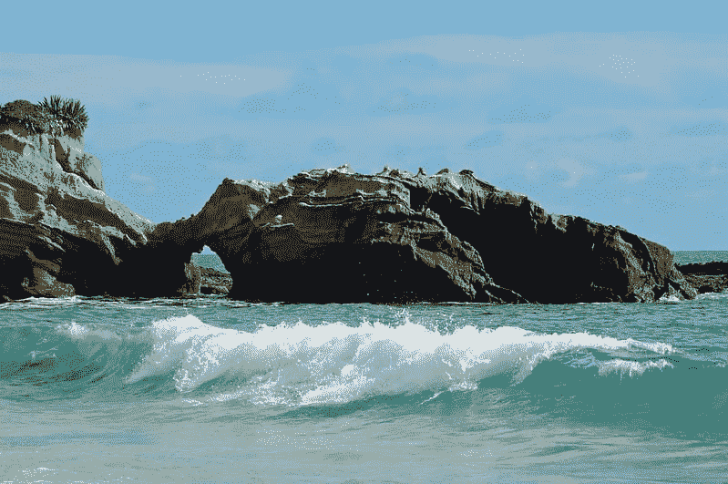

# 从零开始编写 Adam 优化算法

> 原文：<https://machinelearningmastery.com/adam-optimization-from-scratch/>

最后更新于 2021 年 10 月 12 日

梯度下降是一种优化算法，它遵循目标函数的负梯度来定位函数的最小值。

梯度下降的一个限制是对所有输入变量使用单一步长(学习率)。对梯度下降的扩展，如 AdaGrad 和 RMSProp，更新了算法，为每个输入变量使用单独的步长，但可能导致步长迅速减小到非常小的值。

**自适应运动估计**算法，简称为**亚当**，是梯度下降的扩展，是 AdaGrad 和 RMSProp 等技术的自然延续，这些技术自动为目标函数的每个输入变量调整学习率，并通过使用梯度的指数递减移动平均来更新变量，从而进一步平滑搜索过程。

在本教程中，您将发现如何从零开始使用亚当优化算法开发梯度下降。

完成本教程后，您将知道:

*   梯度下降是一种优化算法，它使用目标函数的梯度来导航搜索空间。
*   梯度下降可以更新为使用一个自动自适应步长为每个输入变量使用一个衰减平均偏导数，称为亚当。
*   如何从零开始实现 Adam 优化算法，并将其应用于一个目标函数并评估结果。

**用我的新书[机器学习优化](https://machinelearningmastery.com/optimization-for-machine-learning/)启动你的项目**，包括*分步教程*和所有示例的 *Python 源代码*文件。

Let’s get started.

亚当从零开始的梯度下降优化
唐·格雷厄姆摄，版权所有。

## 教程概述

本教程分为三个部分；它们是:

1.  梯度下降
2.  亚当优化算法
3.  亚当梯度下降
    1.  二维测试问题
    2.  带亚当的梯度下降优化
    3.  亚当的形象

## 梯度下降

[梯度下降](https://en.wikipedia.org/wiki/Gradient_descent)是一种优化算法。

它在技术上被称为一阶优化算法，因为它明确地利用了目标函数的一阶导数。

*   一阶方法依赖于梯度信息来帮助指导搜索最小值…

—第 69 页，[优化算法](https://amzn.to/39KZSQn)，2019。

[一阶导数](https://en.wikipedia.org/wiki/Derivative)，或简称为“*导数*，是目标函数在特定点的变化率或斜率，例如对于特定输入。

如果目标函数有多个输入变量，它被称为多元函数，输入变量可以被认为是一个向量。反过来，多元目标函数的导数也可以作为向量，并且通常被称为[梯度](https://en.wikipedia.org/wiki/Gradient)。

*   **梯度**:多元目标函数的一阶导数。

对于特定输入，导数或梯度指向目标函数最陡上升的方向。

梯度下降是指一种最小化优化算法，它遵循目标函数梯度下降的负值来定位函数的最小值。

梯度下降算法需要一个正在优化的目标函数和目标函数的导数函数。目标函数 *f()* 返回给定输入集的得分，导数函数 *f'()* 给出给定输入集的目标函数的导数。

梯度下降算法要求问题中有一个起点( *x* )，比如输入空间中随机选择的一个点。

然后计算导数，并在输入空间中采取一个步骤，该步骤预计会导致目标函数的下坡运动，假设我们正在最小化目标函数。

下坡移动是通过首先计算在输入空间中移动多远来实现的，计算方法是步长(称为 alpha 或学习率)乘以梯度。然后从当前点减去这一点，确保我们逆着梯度或目标函数向下移动。

*   x(t)= x(t-1)–步长* f'(x(t-1))

给定点处的目标函数越陡，梯度的幅度就越大，反过来，搜索空间中的步长也就越大。使用步长超参数来缩放所采取的步长。

*   **步长**(*α*):超参数，控制算法每次迭代在搜索空间中逆着梯度移动多远。

如果步长太小，搜索空间中的移动将会很小，并且搜索将会花费很长时间。如果步长过大，搜索可能会绕过搜索空间并跳过 optima。

现在我们已经熟悉了梯度下降优化算法，让我们来看看 Adam 算法。

## 亚当优化算法

自适应运动估计算法，简称 Adam，是梯度下降优化算法的扩展。

Diederik Kingma 和 Jimmy 巴雷在 2014 年的论文中描述了该算法，题为“T0”Adam:一种随机优化方法

Adam 旨在加速优化过程，例如减少达到最优所需的函数求值次数，或者提高优化算法的能力，例如产生更好的最终结果。

这是通过计算正在优化的每个输入参数的步长来实现的。重要的是，基于每个变量遇到的梯度(偏导数)，每个步长在搜索过程中自动调整。

> 我们提出了 Adam，这是一种高效的随机优化方法，只需要一阶梯度，几乎不需要内存。该方法根据梯度的第一和第二矩的估计来计算不同参数的个体自适应学习率；亚当这个名字来源于自适应矩估计

——[亚当:一种随机优化的方法](https://arxiv.org/abs/1412.6980)

这包括保持梯度的第一和第二矩，例如每个输入变量的指数衰减平均梯度(第一矩)和方差(第二矩)。

> 移动平均线本身是梯度的第一个矩(平均值)和第二个原始矩(非间隔方差)的估计值。

——[亚当:一种随机优化的方法](https://arxiv.org/abs/1412.6980)

让我们逐步了解算法的每个元素。

首先，作为搜索的一部分，我们必须为每个被优化的参数保持一个矩向量和指数加权无穷范数，分别称为 m 和 v(实际上是希腊字母 nu)。它们在搜索开始时被初始化为 0.0。

*   m = 0
*   v = 0

该算法在时间 t 上迭代执行，从 *t=1* 开始，并且每次迭代包括计算一组新的参数值 *x* ，例如从 *x(t-1)* 到 *x(t)* 。

如果我们专注于更新一个参数，这可能很容易理解算法，这可以推广到通过向量运算更新所有参数。

首先，计算当前时间步长的梯度(偏导数)。

*   g(t) = f'(x(t-1))

接下来，使用梯度和超参数*β1*更新第一时刻。

*   m(t)=β1 * m(t-1)+(1–β1)* g(t)

然后使用平方梯度和超参数*β2*更新第二个时刻。

*   v(t)=β2 * v(t-1)+(1–β2)* g(t)^2

第一和第二矩是有偏差的，因为它们是用零值初始化的。

> ……这些移动平均线被初始化为(向量)0，导致力矩估计偏向于零，尤其是在初始时间步长期间，尤其是当衰减率很小时(即β值接近 1)。好消息是，这种初始化偏差可以很容易地被抵消，导致偏差校正的估计…

——[亚当:一种随机优化的方法](https://arxiv.org/abs/1412.6980)

接下来，第一和第二时刻被偏差校正，从第一时刻开始:

*   mhat(t)= m(t)/(1–β1(t))

然后第二个瞬间:

*   vhat(t)= v(t)/(1–β2(t))

注意，*β1(t)*和*β2(t)*指的是在算法迭代过程中按时间表衰减的β1 和β2 超参数。可以使用静态衰减时间表，尽管本文建议如下:

*   β1(t)= beta1^t
*   β2(t)= beta2^t

最后，我们可以计算这个迭代的参数值。

*   x(t)= x(t-1)-alpha * mhat(t)/(sqrt(vhat(t))+EPS)

其中*α*为步长超参数， *eps* 为小值(*ε*)如 1e-8，保证我们不会遇到被零除的误差， *sqrt()* 为平方根函数。

注意，可以使用对论文中列出的更新规则进行更有效的重新排序:

*   alpha(t)= alpha * sqrt(1–beta 2(t))/(1–beta 1(t))
*   x(t)= x(t-1)-alpha(t)* m(t)/(sqrt(v(t))+EPS)

回顾一下，该算法有三个超参数，它们是:

*   **α**:初始步长(学习率)，典型值为 0.001。
*   **β1**:第一动量衰减因子，典型值为 0.9。
*   **β2**:无穷大范数的衰减因子，典型值为 0.999。

就这样。

关于亚当算法在亚当算法背景下的完整推导，我推荐阅读这篇论文。

*   [亚当:一种随机优化的方法](https://arxiv.org/abs/1412.6980)

接下来，让我们看看如何在 Python 中从零开始实现该算法。

## 亚当梯度下降

在本节中，我们将探索如何用 Adam 实现梯度下降优化算法。

### 二维测试问题

首先，让我们定义一个优化函数。

我们将使用一个简单的二维函数，它对每个维度的输入进行平方，并定义从-1.0 到 1.0 的有效输入范围。

下面的 objective()函数实现了这个功能

```py
# objective function
def objective(x, y):
	return x**2.0 + y**2.0
```

我们可以创建数据集的三维图，以获得对响应表面曲率的感觉。

下面列出了绘制目标函数的完整示例。

```py
# 3d plot of the test function
from numpy import arange
from numpy import meshgrid
from matplotlib import pyplot

# objective function
def objective(x, y):
	return x**2.0 + y**2.0

# define range for input
r_min, r_max = -1.0, 1.0
# sample input range uniformly at 0.1 increments
xaxis = arange(r_min, r_max, 0.1)
yaxis = arange(r_min, r_max, 0.1)
# create a mesh from the axis
x, y = meshgrid(xaxis, yaxis)
# compute targets
results = objective(x, y)
# create a surface plot with the jet color scheme
figure = pyplot.figure()
axis = figure.gca(projection='3d')
axis.plot_surface(x, y, results, cmap='jet')
# show the plot
pyplot.show()
```

运行该示例会创建目标函数的三维表面图。

我们可以看到熟悉的碗形，全局最小值在 f(0，0) = 0。


测试目标函数的三维图

我们还可以创建函数的二维图。这将有助于我们以后绘制搜索进度。

以下示例创建了目标函数的等高线图。

```py
# contour plot of the test function
from numpy import asarray
from numpy import arange
from numpy import meshgrid
from matplotlib import pyplot

# objective function
def objective(x, y):
	return x**2.0 + y**2.0

# define range for input
bounds = asarray([[-1.0, 1.0], [-1.0, 1.0]])
# sample input range uniformly at 0.1 increments
xaxis = arange(bounds[0,0], bounds[0,1], 0.1)
yaxis = arange(bounds[1,0], bounds[1,1], 0.1)
# create a mesh from the axis
x, y = meshgrid(xaxis, yaxis)
# compute targets
results = objective(x, y)
# create a filled contour plot with 50 levels and jet color scheme
pyplot.contourf(x, y, results, levels=50, cmap='jet')
# show the plot
pyplot.show()
```

运行该示例会创建目标函数的二维等高线图。

我们可以看到碗的形状被压缩成带有颜色梯度的轮廓。我们将使用此图来绘制搜索过程中探索的具体点。


测试目标函数的二维等高线图

现在我们有了一个测试目标函数，让我们看看如何实现亚当优化算法。

### 带亚当的梯度下降优化

我们可以将带有 Adam 的梯度下降应用于测试问题。

首先，我们需要一个函数来计算这个函数的导数。

*   f(x) = x^2
*   f'(x) = x * 2

x^2 的导数在每个维度上都是 x * 2。导数()函数实现如下。

```py
# derivative of objective function
def derivative(x, y):
	return asarray([x * 2.0, y * 2.0])
```

接下来，我们可以实现梯度下降优化。

首先，我们可以在问题的边界中选择一个随机点作为搜索的起点。

这假设我们有一个定义搜索范围的数组，每个维度有一行，第一列定义维度的最小值，第二列定义维度的最大值。

```py
...
# generate an initial point
x = bounds[:, 0] + rand(len(bounds)) * (bounds[:, 1] - bounds[:, 0])
score = objective(x[0], x[1])
```

接下来，我们需要将第一和第二时刻初始化为零。

```py
...
# initialize first and second moments
m = [0.0 for _ in range(bounds.shape[0])]
v = [0.0 for _ in range(bounds.shape[0])]
```

然后，我们运行由“ *n_iter* ”超参数定义的算法的固定迭代次数。

```py
...
# run iterations of gradient descent
for t in range(n_iter):
	...
```

第一步是使用*导数()*函数计算当前解的梯度。

```py
...
# calculate gradient
gradient = derivative(solution[0], solution[1])
```

第一步是计算当前参数集的导数。

```py
...
# calculate gradient g(t)
g = derivative(x[0], x[1])
```

接下来，我们需要执行亚当更新计算。为了可读性，我们将使用命令式编程风格一次一个变量地执行这些计算。

实际上，为了提高效率，我建议使用 NumPy 向量运算。

```py
...
# build a solution one variable at a time
for i in range(x.shape[0]):
	...
```

首先，我们需要计算时刻。

```py
...
# m(t) = beta1 * m(t-1) + (1 - beta1) * g(t)
m[i] = beta1 * m[i] + (1.0 - beta1) * g[i]
```

然后第二个瞬间。

```py
...
# v(t) = beta2 * v(t-1) + (1 - beta2) * g(t)^2
v[i] = beta2 * v[i] + (1.0 - beta2) * g[i]**2
```

然后是第一和第二时刻的偏差校正。

```py
...
# mhat(t) = m(t) / (1 - beta1(t))
mhat = m[i] / (1.0 - beta1**(t+1))
# vhat(t) = v(t) / (1 - beta2(t))
vhat = v[i] / (1.0 - beta2**(t+1))
```

然后最后更新变量值。

```py
...
# x(t) = x(t-1) - alpha * mhat(t) / (sqrt(vhat(t)) + eps)
x[i] = x[i] - alpha * mhat / (sqrt(vhat) + eps)
```

然后对每个正在优化的参数重复这一过程。

迭代结束时，我们可以评估新的参数值，并报告搜索的表现。

```py
...
# evaluate candidate point
score = objective(x[0], x[1])
# report progress
print('>%d f(%s) = %.5f' % (t, x, score))
```

我们可以将所有这些联系到一个名为 *adam()* 的函数中，该函数采用目标函数和导数函数以及算法超参数的名称，并返回搜索结束时找到的最佳解及其评估。

下面列出了完整的功能。

```py
# gradient descent algorithm with adam
def adam(objective, derivative, bounds, n_iter, alpha, beta1, beta2, eps=1e-8):
	# generate an initial point
	x = bounds[:, 0] + rand(len(bounds)) * (bounds[:, 1] - bounds[:, 0])
	score = objective(x[0], x[1])
	# initialize first and second moments
	m = [0.0 for _ in range(bounds.shape[0])]
	v = [0.0 for _ in range(bounds.shape[0])]
	# run the gradient descent updates
	for t in range(n_iter):
		# calculate gradient g(t)
		g = derivative(x[0], x[1])
		# build a solution one variable at a time
		for i in range(x.shape[0]):
			# m(t) = beta1 * m(t-1) + (1 - beta1) * g(t)
			m[i] = beta1 * m[i] + (1.0 - beta1) * g[i]
			# v(t) = beta2 * v(t-1) + (1 - beta2) * g(t)^2
			v[i] = beta2 * v[i] + (1.0 - beta2) * g[i]**2
			# mhat(t) = m(t) / (1 - beta1(t))
			mhat = m[i] / (1.0 - beta1**(t+1))
			# vhat(t) = v(t) / (1 - beta2(t))
			vhat = v[i] / (1.0 - beta2**(t+1))
			# x(t) = x(t-1) - alpha * mhat(t) / (sqrt(vhat(t)) + eps)
			x[i] = x[i] - alpha * mhat / (sqrt(vhat) + eps)
		# evaluate candidate point
		score = objective(x[0], x[1])
		# report progress
		print('>%d f(%s) = %.5f' % (t, x, score))
	return [x, score]
```

**注**:为了可读性，我们特意使用了列表和命令式编码风格，而不是矢量化操作。请随意将实现调整为使用 NumPy 阵列的矢量化实现，以获得更好的表现。

然后，我们可以定义我们的超参数，并调用 *adam()* 函数来优化我们的测试目标函数。

在这种情况下，我们将使用算法的 60 次迭代，初始步长为 0.02，β1 和β2 值分别为 0.8 和 0.999。这些超参数值是经过一点点反复试验后发现的。

```py
...
# seed the pseudo random number generator
seed(1)
# define range for input
bounds = asarray([[-1.0, 1.0], [-1.0, 1.0]])
# define the total iterations
n_iter = 60
# steps size
alpha = 0.02
# factor for average gradient
beta1 = 0.8
# factor for average squared gradient
beta2 = 0.999
# perform the gradient descent search with adam
best, score = adam(objective, derivative, bounds, n_iter, alpha, beta1, beta2)
print('Done!')
print('f(%s) = %f' % (best, score))
```

将所有这些联系在一起，下面列出了使用 Adam 进行梯度下降优化的完整示例。

```py
# gradient descent optimization with adam for a two-dimensional test function
from math import sqrt
from numpy import asarray
from numpy.random import rand
from numpy.random import seed

# objective function
def objective(x, y):
	return x**2.0 + y**2.0

# derivative of objective function
def derivative(x, y):
	return asarray([x * 2.0, y * 2.0])

# gradient descent algorithm with adam
def adam(objective, derivative, bounds, n_iter, alpha, beta1, beta2, eps=1e-8):
	# generate an initial point
	x = bounds[:, 0] + rand(len(bounds)) * (bounds[:, 1] - bounds[:, 0])
	score = objective(x[0], x[1])
	# initialize first and second moments
	m = [0.0 for _ in range(bounds.shape[0])]
	v = [0.0 for _ in range(bounds.shape[0])]
	# run the gradient descent updates
	for t in range(n_iter):
		# calculate gradient g(t)
		g = derivative(x[0], x[1])
		# build a solution one variable at a time
		for i in range(x.shape[0]):
			# m(t) = beta1 * m(t-1) + (1 - beta1) * g(t)
			m[i] = beta1 * m[i] + (1.0 - beta1) * g[i]
			# v(t) = beta2 * v(t-1) + (1 - beta2) * g(t)^2
			v[i] = beta2 * v[i] + (1.0 - beta2) * g[i]**2
			# mhat(t) = m(t) / (1 - beta1(t))
			mhat = m[i] / (1.0 - beta1**(t+1))
			# vhat(t) = v(t) / (1 - beta2(t))
			vhat = v[i] / (1.0 - beta2**(t+1))
			# x(t) = x(t-1) - alpha * mhat(t) / (sqrt(vhat(t)) + eps)
			x[i] = x[i] - alpha * mhat / (sqrt(vhat) + eps)
		# evaluate candidate point
		score = objective(x[0], x[1])
		# report progress
		print('>%d f(%s) = %.5f' % (t, x, score))
	return [x, score]

# seed the pseudo random number generator
seed(1)
# define range for input
bounds = asarray([[-1.0, 1.0], [-1.0, 1.0]])
# define the total iterations
n_iter = 60
# steps size
alpha = 0.02
# factor for average gradient
beta1 = 0.8
# factor for average squared gradient
beta2 = 0.999
# perform the gradient descent search with adam
best, score = adam(objective, derivative, bounds, n_iter, alpha, beta1, beta2)
print('Done!')
print('f(%s) = %f' % (best, score))
```

运行该示例将 Adam 优化算法应用于我们的测试问题，并报告算法每次迭代的搜索表现。

**注**:考虑到算法或评估程序的随机性，或数值准确率的差异，您的[结果可能会有所不同](https://machinelearningmastery.com/different-results-each-time-in-machine-learning/)。考虑运行该示例几次，并比较平均结果。

在这种情况下，我们可以看到，在大约 53 次搜索迭代后，找到了一个接近最优的解，输入值接近 0.0 和 0.0，评估为 0.0。

```py
...
>50 f([-0.00056912 -0.00321961]) = 0.00001
>51 f([-0.00052452 -0.00286514]) = 0.00001
>52 f([-0.00043908 -0.00251304]) = 0.00001
>53 f([-0.0003283  -0.00217044]) = 0.00000
>54 f([-0.00020731 -0.00184302]) = 0.00000
>55 f([-8.95352320e-05 -1.53514076e-03]) = 0.00000
>56 f([ 1.43050285e-05 -1.25002847e-03]) = 0.00000
>57 f([ 9.67123406e-05 -9.89850279e-04]) = 0.00000
>58 f([ 0.00015359 -0.00075587]) = 0.00000
>59 f([ 0.00018407 -0.00054858]) = 0.00000
Done!
f([ 0.00018407 -0.00054858]) = 0.000000
```

### 亚当的形象

我们可以在域的等高线图上绘制亚当搜索的进度。

这可以为算法迭代过程中的搜索进度提供直觉。

我们必须更新 *adam()* 函数，以维护搜索过程中找到的所有解决方案的列表，然后在搜索结束时返回该列表。

下面列出了带有这些更改的功能的更新版本。

```py
# gradient descent algorithm with adam
def adam(objective, derivative, bounds, n_iter, alpha, beta1, beta2, eps=1e-8):
	solutions = list()
	# generate an initial point
	x = bounds[:, 0] + rand(len(bounds)) * (bounds[:, 1] - bounds[:, 0])
	score = objective(x[0], x[1])
	# initialize first and second moments
	m = [0.0 for _ in range(bounds.shape[0])]
	v = [0.0 for _ in range(bounds.shape[0])]
	# run the gradient descent updates
	for t in range(n_iter):
		# calculate gradient g(t)
		g = derivative(x[0], x[1])
		# build a solution one variable at a time
		for i in range(bounds.shape[0]):
			# m(t) = beta1 * m(t-1) + (1 - beta1) * g(t)
			m[i] = beta1 * m[i] + (1.0 - beta1) * g[i]
			# v(t) = beta2 * v(t-1) + (1 - beta2) * g(t)^2
			v[i] = beta2 * v[i] + (1.0 - beta2) * g[i]**2
			# mhat(t) = m(t) / (1 - beta1(t))
			mhat = m[i] / (1.0 - beta1**(t+1))
			# vhat(t) = v(t) / (1 - beta2(t))
			vhat = v[i] / (1.0 - beta2**(t+1))
			# x(t) = x(t-1) - alpha * mhat(t) / (sqrt(vhat(t)) + ep)
			x[i] = x[i] - alpha * mhat / (sqrt(vhat) + eps)
		# evaluate candidate point
		score = objective(x[0], x[1])
		# keep track of solutions
		solutions.append(x.copy())
		# report progress
		print('>%d f(%s) = %.5f' % (t, x, score))
	return solutions
```

然后，我们可以像以前一样执行搜索，这次检索解决方案列表，而不是最佳最终解决方案。

```py
...
# seed the pseudo random number generator
seed(1)
# define range for input
bounds = asarray([[-1.0, 1.0], [-1.0, 1.0]])
# define the total iterations
n_iter = 60
# steps size
alpha = 0.02
# factor for average gradient
beta1 = 0.8
# factor for average squared gradient
beta2 = 0.999
# perform the gradient descent search with adam
solutions = adam(objective, derivative, bounds, n_iter, alpha, beta1, beta2)
```

然后，我们可以像以前一样创建目标函数的等高线图。

```py
...
# sample input range uniformly at 0.1 increments
xaxis = arange(bounds[0,0], bounds[0,1], 0.1)
yaxis = arange(bounds[1,0], bounds[1,1], 0.1)
# create a mesh from the axis
x, y = meshgrid(xaxis, yaxis)
# compute targets
results = objective(x, y)
# create a filled contour plot with 50 levels and jet color scheme
pyplot.contourf(x, y, results, levels=50, cmap='jet')
```

最后，我们可以将搜索过程中找到的每个解决方案绘制成由一条线连接的白点。

```py
...
# plot the sample as black circles
solutions = asarray(solutions)
pyplot.plot(solutions[:, 0], solutions[:, 1], '.-', color='w')
```

将所有这些联系在一起，下面列出了对测试问题执行 Adam 优化并将结果绘制在等高线图上的完整示例。

```py
# example of plotting the adam search on a contour plot of the test function
from math import sqrt
from numpy import asarray
from numpy import arange
from numpy.random import rand
from numpy.random import seed
from numpy import meshgrid
from matplotlib import pyplot
from mpl_toolkits.mplot3d import Axes3D

# objective function
def objective(x, y):
	return x**2.0 + y**2.0

# derivative of objective function
def derivative(x, y):
	return asarray([x * 2.0, y * 2.0])

# gradient descent algorithm with adam
def adam(objective, derivative, bounds, n_iter, alpha, beta1, beta2, eps=1e-8):
	solutions = list()
	# generate an initial point
	x = bounds[:, 0] + rand(len(bounds)) * (bounds[:, 1] - bounds[:, 0])
	score = objective(x[0], x[1])
	# initialize first and second moments
	m = [0.0 for _ in range(bounds.shape[0])]
	v = [0.0 for _ in range(bounds.shape[0])]
	# run the gradient descent updates
	for t in range(n_iter):
		# calculate gradient g(t)
		g = derivative(x[0], x[1])
		# build a solution one variable at a time
		for i in range(bounds.shape[0]):
			# m(t) = beta1 * m(t-1) + (1 - beta1) * g(t)
			m[i] = beta1 * m[i] + (1.0 - beta1) * g[i]
			# v(t) = beta2 * v(t-1) + (1 - beta2) * g(t)^2
			v[i] = beta2 * v[i] + (1.0 - beta2) * g[i]**2
			# mhat(t) = m(t) / (1 - beta1(t))
			mhat = m[i] / (1.0 - beta1**(t+1))
			# vhat(t) = v(t) / (1 - beta2(t))
			vhat = v[i] / (1.0 - beta2**(t+1))
			# x(t) = x(t-1) - alpha * mhat(t) / (sqrt(vhat(t)) + ep)
			x[i] = x[i] - alpha * mhat / (sqrt(vhat) + eps)
		# evaluate candidate point
		score = objective(x[0], x[1])
		# keep track of solutions
		solutions.append(x.copy())
		# report progress
		print('>%d f(%s) = %.5f' % (t, x, score))
	return solutions

# seed the pseudo random number generator
seed(1)
# define range for input
bounds = asarray([[-1.0, 1.0], [-1.0, 1.0]])
# define the total iterations
n_iter = 60
# steps size
alpha = 0.02
# factor for average gradient
beta1 = 0.8
# factor for average squared gradient
beta2 = 0.999
# perform the gradient descent search with adam
solutions = adam(objective, derivative, bounds, n_iter, alpha, beta1, beta2)
# sample input range uniformly at 0.1 increments
xaxis = arange(bounds[0,0], bounds[0,1], 0.1)
yaxis = arange(bounds[1,0], bounds[1,1], 0.1)
# create a mesh from the axis
x, y = meshgrid(xaxis, yaxis)
# compute targets
results = objective(x, y)
# create a filled contour plot with 50 levels and jet color scheme
pyplot.contourf(x, y, results, levels=50, cmap='jet')
# plot the sample as black circles
solutions = asarray(solutions)
pyplot.plot(solutions[:, 0], solutions[:, 1], '.-', color='w')
# show the plot
pyplot.show()
```

运行该示例会像以前一样执行搜索，只是在这种情况下，会创建目标函数的等高线图。

在这种情况下，我们可以看到，搜索过程中找到的每个解决方案都显示一个白点，从 optima 上方开始，逐渐靠近图中心的 optima。


显示亚当搜索结果的测试目标函数等高线图

## 进一步阅读

如果您想更深入地了解这个主题，本节将提供更多资源。

### 报纸

*   [亚当:一种随机优化的方法](https://arxiv.org/abs/1412.6980)，2014。

### 书

*   [优化算法](https://amzn.to/39KZSQn)，2019。
*   [深度学习](https://amzn.to/3qSk3C2)，2016 年。

### 蜜蜂

*   num py . random . rand API。
*   num py . asar ray API。
*   [Matplotlib API](https://matplotlib.org/api/pyplot_api.html) 。

### 文章

*   [梯度下降，维基百科](https://en.wikipedia.org/wiki/Gradient_descent)。
*   [随机梯度下降，维基百科](https://en.wikipedia.org/wiki/Stochastic_gradient_descent)。
*   [梯度下降优化算法概述](https://ruder.io/optimizing-gradient-descent/index.html)，2016。

## 摘要

在本教程中，您发现了如何使用亚当优化算法从零开始开发梯度下降。

具体来说，您了解到:

*   梯度下降是一种优化算法，它使用目标函数的梯度来导航搜索空间。
*   梯度下降可以更新为使用一个自动自适应步长为每个输入变量使用一个衰减平均偏导数，称为亚当。
*   如何从零开始实现 Adam 优化算法，并将其应用于一个目标函数并评估结果。

**你有什么问题吗？**
在下面的评论中提问，我会尽力回答。