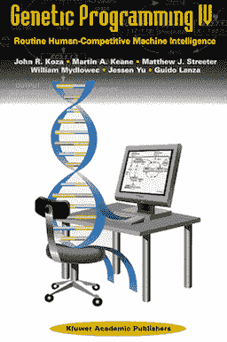
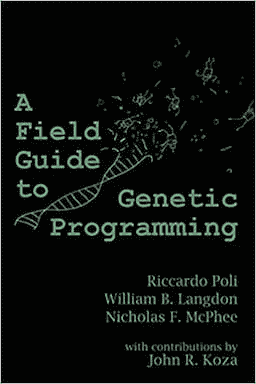
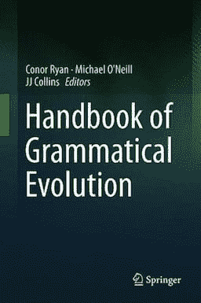
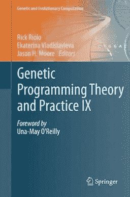
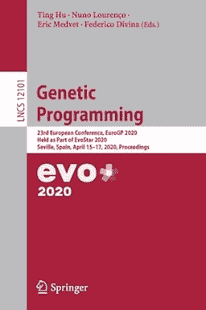
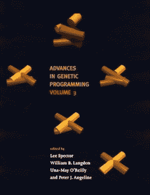

# 遗传编程书籍

> 原文：<https://machinelearningmastery.com/books-on-genetic-programming/>

最后更新于 2021 年 10 月 12 日

[遗传编程](https://en.wikipedia.org/wiki/Genetic_programming) (GP)是一种进化程序以解决特定的定义明确的问题的算法。

这是一种自动编程类型，旨在解决具有挑战性的问题，任务定义明确，解决方案可以很容易地以低成本进行检查，尽管可能的解决方案的搜索空间很大，并且几乎没有解决问题的最佳方法的直觉。

这通常包括开放的问题，如控制器设计、电路设计，以及预测建模任务，如特征选择、分类和回归。

对于初学者来说，很难在这个领域开始，因为有大量的文献可以追溯到几十年前。

在本教程中，您将发现关于遗传编程的顶级书籍。

**用我的新书[机器学习优化](https://machinelearningmastery.com/optimization-for-machine-learning/)启动你的项目**，包括*分步教程*和所有示例的 *Python 源代码*文件。

Let’s get started.

遗传程序设计书籍
摄影作者[卢卡·泰利](https://www.flickr.com/photos/tempo19/32686202343/)版权所有。

## 教程概述

有许多关于遗传编程的书，可以按类型分组。

我们将探索关于基因编程的顶级书籍，分为三大类；它们是:

1.  遗传程序设计
2.  教科书
3.  会议记录

## 遗传程序设计

[约翰·科扎](https://en.wikipedia.org/wiki/John_Koza)是一名计算机科学家，曾在遗传算法的发明者[霍兰德](https://en.wikipedia.org/wiki/John_Henry_Holland)手下学习。

在 20 世纪 80 年代末和 90 年代初，Koza 被认为是统一了新生的基因编程领域。

他以将遗传算法应用于电路设计而闻名，这导致了新的可申请专利的发明，并将遗传算法描述为将例行公事地产生“[人类竞争的](http://www.human-competitive.org/)”结果。

他写了一系列关于遗传编程的四本教科书，如下:

*   [遗传编程:论自然选择的计算机编程](https://amzn.to/3k3idtF)，1992。
*   [遗传编程二:可重用程序的自动发现](https://amzn.to/2GxztJR)，1994。
*   [遗传规划三:达尔文的发明和问题解决](https://amzn.to/36chbXr)，1999。
*   [遗传编程四:常规人机竞争智能](https://amzn.to/366MuTj)，2003。

他最近的一本书《遗传程序设计 4》是一个很好的开始。

本书开头的表格总结了四个关键要点；它们是:

> 1.基因编程现在定期提供高回报的人类竞争机器智能。
> 2。遗传编程是一种自动化的发明机器。
> 3。遗传编程可以以参数化拓扑的形式自动创建问题的一般解决方案。
> 4。遗传程序设计带来了一系列质量上更实质性的结果，与计算机时间消耗的五个大约数量级的增加同步。

—第 1 页，[遗传编程四:常规人机竞争智能](https://amzn.to/366MuTj)，2003。

这本书的目录如下:

*   第一章:引言
*   第二章:遗传程序设计的背景
*   第三章:控制器的自动综合
*   第四章:电路的自动合成
*   第五章:电路拓扑、尺寸、布局和布线的自动综合
*   第六章:天线的自动合成
*   第七章:遗传网络的自动合成
*   第八章:代谢途径的自动合成
*   第九章:控制器参数化拓扑的自动综合
*   第 10 章:电路参数化拓扑的自动综合
*   第 11 章:用电路条件发展算子自动综合参数化拓扑
*   第 12 章:PID 控制器改进整定规则的自动综合
*   第 13 章:改进控制器的参数化拓扑的自动综合
*   第 14 章:负面反馈的重塑
*   第 15 章:六个 2000 年后专利电路的自动化改造
*   第 16 章:遗传编程可能非常适合的问题
*   第 17 章:并行实现和计算机时间
*   第 18 章:摩尔定律的历史观点和遗传程序设计产生的定性更实质性结果的进展
*   第 19 章:结论

遗传编程四:常规人机竞争智能

## 教科书

已经出版了许多关于遗传编程的教科书，是为对该领域感兴趣的本科生和研究生设计的。

也许最受欢迎的书包括以下几本:

*   [遗传程序设计:导论](https://amzn.to/32gW4ls)，1997。
*   [遗传编程和数据结构](https://amzn.to/3k8Xox2)，1998。
*   [遗传编程基础](https://amzn.to/2Ic6OdU)，2002。

我会推荐最近的《遗传程序设计基础》

> 因此，遗传规划的基础不应该仅仅被看作是一个技术的集合，人们需要知道这些技术才能做好遗传规划，还应该被看作是第一次尝试绘制和探索遗传规划作为一种搜索算法背后的机制和基本原则。在写这本书的时候，我们希望对整个人工智能的理论基础有一点点了解。

——IIX 页，[遗传程序设计基础](https://amzn.to/2Ic6OdU)，2002。

这本书的目录如下:

*   第一章:引言
*   第二章:健身景观
*   第三章:程序组件模式理论
*   第四章:悲观的 GP 图式理论
*   第五章:精确 GP 模式定理
*   第六章:全科医生图式理论的启示
*   第七章:遗传规划搜索空间
*   第八章:全科医生搜索空间:理论分析
*   第九章:例子一:人工蚂蚁
*   第十章:例子二:最大值问题
*   第 11 章:全科医生的融合和膨胀
*   第 12 章:结论

遗传程序设计基础

也许关于 GP 的最受欢迎的书籍之一是由该领域的顶尖学者自行出版的，面向对将遗传编程应用于他们的项目感兴趣的学生和开发人员。

*   [基因编程领域指南](https://amzn.to/3p2xcrd)，2008。

这是书中的一个片段:

> 已经写了许多描述全科医生方面的书。有些提供了对整个领域的一般性介绍。然而，在过去的十年里，没有关于 GP 的新入门书籍问世，任何想了解 GP 的人都被迫独自痛苦地绘制地形图。这本书试图填补这一空白，为新手和老前辈提供一个现代的全科医生领域指南。

——[遗传编程领域指南](https://amzn.to/3p2xcrd)，2008 年。

这本书的目录如下:

*   第一章:引言
*   第二章:基于树的遗传规划中的表示、初始化和运算
*   第三章:准备运行基因编程
*   第 4 章:遗传编程运行示例
*   第五章:基于树的遗传规划中的替代初始化和操作
*   第六章:基于模块化、语法化和发展树的全科医生
*   第七章:线性和图形遗传规划
*   第八章:概率遗传规划
*   第九章:多目标遗传规划
*   第 10 章:快速分布式遗传编程
*   第 11 章:GP 理论及其应用
*   第 12 章:应用
*   第 13 章:GP 故障排除
*   第 14 章:结论

遗传程序设计领域指南

通常用新的名称来指代专门用于不同应用和表示的遗传编程算法版本，例如“*线性遗传编程*”、“*笛卡尔遗传编程*”和“*语法进化*”

关于这些专门类型的遗传编程算法的一些教科书包括以下内容:

*   [线性遗传规划](https://amzn.to/34Yra2Z)，2006。
*   [笛卡尔遗传规划](https://amzn.to/2GB5b94)，2011。
*   [语法进化:任意语言的进化自动编程](https://amzn.to/366Y5ls)，2003。
*   [动态环境语法演变的基础](https://amzn.to/3ewVd55)，2009。
*   [语法演变手册](https://amzn.to/2TUcg7L)，2018。

语法进化手册

## 会议记录

在机器学习中分享发现的主要方式是通过会议，会议记录提供了来自会议的顶级论文的集合。

在任何给定的会议上提交的论文都可以围绕主题跳跃，如果没有该领域的一些基础知识，很难理解。然而，它们可以让你快速掌握当前流行的技术。

我建议关注任何程序的最新问题。没有必要追溯这些年。

你可能想看三个会议记录；它们是:

*   遗传规划理论与实践
*   遗传编程欧洲会议
*   遗传规划的进展

让我们依次仔细看看每一个:

### 遗传规划理论与实践

遗传程序设计理论和实践会议每年举行一次，会议记录由斯普林格印刷。

这可能是关于全科医生的第一次会议。在编写本报告时，这是第 17 (XVII)期。

最后三个问题如下:

*   [遗传规划理论与实践 XV](https://amzn.to/3567P05) ，2018。
*   [遗传规划理论与实践十六](https://amzn.to/36nBG3x)，2019。
*   [遗传规划理论与实践 XVII](https://amzn.to/3n95ibF) ，2020。

遗传规划理论与实践

### 遗传编程欧洲会议

基因编程欧洲会议是另一个主要的基因编程会议。

像遗传程序设计理论和实践一样，这次会议及其发表的会议记录已经进行了几十年，在撰写本文时已经是第 23 年了。

最后三个问题如下:

*   [基因编程:第 21 届欧洲会议](https://amzn.to/3p0pQo9)，EuroGP 2018
*   [基因编程:第 22 届欧洲会议](https://amzn.to/38lIaT7)，EuroGP 2019
*   [基因编程:第 23 届欧洲会议](https://amzn.to/38bZ5r3)，EuroGP 2020

遗传程序设计:第 23 届欧洲会议

### 遗传规划的进展

“*遗传程序设计进展*”是麻省理工学院出版社出版的一卷，包含收集到的论文。

90 年代中后期只出版过三次。然而，这些内容可能有助于加深对该领域的理解。

*   [遗传程序设计进展](https://amzn.to/2I9l86y)，1994。
*   [遗传程序设计进展 2](https://amzn.to/2Id5reA) ，1996。
*   [遗传程序设计进展 3](https://amzn.to/2HZbnIJ) ，1999。

遗传程序设计进展 3

## 推荐书籍

我读了大部分列出的书。

如果你想得到一本关于基因编程的书，我会推荐以下几本:

*   [基因编程领域指南](https://amzn.to/3p2xcrd)，2008。

它将介绍该领域，并向您展示如何快速获得结果。

如果你正在寻找一个更全面的图书馆，我会推荐以下三种:

*   [遗传编程四:常规人机竞争智能](https://amzn.to/366MuTj)，2003。
*   [遗传编程基础](https://amzn.to/2Ic6OdU)，2002。
*   [基因编程领域指南](https://amzn.to/3p2xcrd)，2008。

我书架上有这三本书。

有了这三本书，你将有一个坚实的理论基础，一个如何在实践中应用该技术的想法，以及一个已经实现的人类竞争结果的类型和用于实现它们的算法的想法。

## 摘要

在本教程中，您发现了关于遗传编程的顶级书籍。

**你读过以上的书吗？**
你怎么看？

**我错过了你最喜欢的书吗？**
在下面的评论里告诉我。