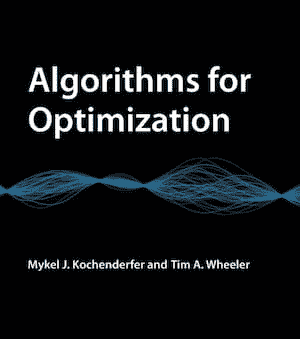
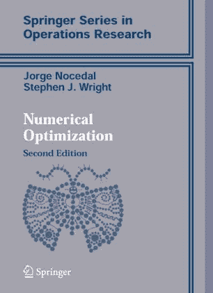
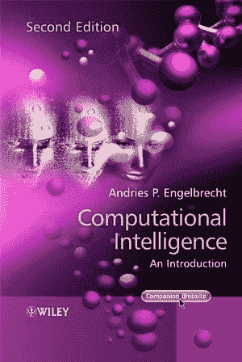

# 3 本机器学习优化书籍

> 原文：<https://machinelearningmastery.com/books-on-optimization-for-machine-learning/>

最后更新于 2021 年 10 月 12 日

**优化**是一个数学领域，关注的是在众多候选中找到一个好的或最好的解。

这是机器学习中需要的一个重要的基础课题，因为大多数机器学习算法都是使用优化算法来拟合历史数据的。此外，更广泛的问题，如模型选择和超参数调整，也可以作为一个优化问题。

尽管拥有一些优化方面的背景对于机器学习从业者来说至关重要，但这可能是一个令人生畏的话题，因为它经常使用高度数学化的语言来描述。

在这篇文章中，你将发现关于优化的顶级书籍，这些书籍将对机器学习实践者有所帮助。

**用我的新书[机器学习优化](https://machinelearningmastery.com/optimization-for-machine-learning/)启动你的项目**，包括*分步教程*和所有示例的 *Python 源代码*文件。

Let’s get started.

机器学习优化书籍
图片作者[帕特里克·亚历山大](https://www.flickr.com/photos/aspidoscelis/13997046712/)，版权所有。

## 概观

优化的领域是巨大的，因为它涉及许多其他的研究领域。

因此，有数百本关于这个主题的书，大多数是用数学和证明归档的教科书。考虑到这是一门高度数学化的学科，这已经足够公平了。

尽管如此，还是有一些书提供了对优化算法更接近的描述。

并非所有优化算法都与机器学习相关；相反，关注一小部分算法是有用的。

坦白说，很难对[优化](https://en.wikipedia.org/wiki/Mathematical_optimization)算法进行分组，因为有很多顾虑。然而，重要的是要对优化有所了解，优化是更简单算法的基础，如线性回归和逻辑回归(如凸优化、最小二乘法、牛顿法等)。)，以及神经网络(一阶方法、梯度下降等)。).

这些是大多数优化教科书中涵盖的基本优化算法。

并非机器学习中的所有优化问题都表现良好，例如在 AutoML 和超参数调整中使用的优化。因此，需要随机优化算法的知识(模拟退火、遗传算法、粒子群等)。).虽然这些都是优化算法，但它们也是一种被称为[生物启发计算](https://en.wikipedia.org/wiki/Bio-inspired_computing)或[计算智能](https://en.wikipedia.org/wiki/Computational_intelligence)的学习算法。

因此，我们将看一看涵盖经典优化算法的书籍以及关于替代优化算法的书籍。

事实上，我们要看的第一本书涵盖了两种类型的算法，还有更多。

## [优化算法](https://amzn.to/3jq8tJU)

本书由[梅克尔·科钦德费尔](https://mykel.kochenderfer.com/)[蒂姆·惠勒](http://timallanwheeler.com/)撰写，于 2019 年出版。

优化算法

这本书可能是我见过的为数不多的广泛涵盖与现代机器学习相关的优化技术领域的教科书之一。

> 这本书提供了优化的广泛介绍，重点是工程系统设计的实用算法。我们涵盖了各种各样的优化主题，介绍了基本的数学问题公式和解决它们的算法。提供图形、例子和练习来传达各种方法背后的直觉。

—第 xiiix 页，[优化算法](https://amzn.to/3jq8tJU)，2019。

重要的是，这些算法的范围从单变量方法(二等分法、线性搜索等)不等。)到一阶方法(梯度下降)、二阶方法(牛顿法)、直接方法(模式搜索)、随机方法(模拟退火)和种群方法(遗传算法、粒子群)等等。

它既包括算法的技术描述和参考文献，也包括朱莉娅的算法实例。遗憾的是，这些例子不是用 Python 编写的，因为这将使这本书在我看来近乎完美。

这本书的完整目录如下。

*   第一章:引言
*   第二章:导数和梯度
*   第三章:包围
*   第四章:本地血统
*   第五章:一阶方法
*   第六章:二阶方法
*   第七章:直接方法
*   第八章:随机方法
*   第九章:人口方法
*   第十章:制约因素
*   第 11 章:线性约束优化
*   第 12 章:多目标优化
*   第 13 章:采样计划
*   第 14 章:代理模型
*   第 15 章:概率代理模型
*   第 16 章:代理优化
*   第 17 章:不确定性下的优化
*   第 18 章:不确定性传播
*   第 19 章:离散优化
*   第 20 章:表达式优化
*   第 21 章:多学科优化

我很喜欢这本书；它充满了宝贵的实用建议。我强烈推荐！

### 了解更多信息:

*   [优化算法](https://amzn.to/3jq8tJU)，2019。

## [数值优化](https://amzn.to/3lCRqX9)

本书由[Jorge Nocedal](https://en.wikipedia.org/wiki/Jorge_Nocedal)[斯蒂芬·赖特](http://pages.cs.wisc.edu/~swright/)撰写，于 2006 年出版。

数值优化

这本书的重点是数学和理论的优化算法提出，并确实涵盖了许多基础技术所使用的常见机器学习算法。对于一般从业者来说可能有点太重了。

这本书打算作为数学学科研究生的教科书。

> 我们打算将这本书用于工程、运筹学、计算机科学和数学系提供的优化研究生课程。

—第十八页，[数值优化](https://amzn.to/3lCRqX9)，2006。

尽管它是高度数学化的，但是算法的描述是精确的，并且可以提供有用的替代描述来补充列出的其他书籍。

这本书的完整目录如下。

*   第一章:引言
*   第二章:无约束优化基础
*   第三章:行搜索方法
*   第 4 章:信任区域方法
*   第五章:共轭梯度法
*   第六章:拟牛顿方法
*   第七章:大规模无约束优化
*   第八章:计算导数
*   第九章:无导数优化
*   第十章:最小二乘问题
*   第 11 章:非线性方程
*   第 12 章:约束优化理论
*   第十三章:线性规划:单纯形法
*   第 14 章:线性规划:内点法
*   第 15 章:非线性约束优化算法基础
*   第 16 章:二次规划
*   第 17 章:惩罚和增广拉格朗日方法
*   第 18 章:序列二次规划
*   第 19 章:非线性规划的内点方法

这是一本关于最优化的扎实的教科书。

### 了解更多信息:

*   [数值优化](https://amzn.to/3lCRqX9)，2006。

如果你确实更喜欢这个主题的理论方法，另一本广泛使用的优化数学书籍是由[史蒂芬·博伊德](https://web.stanford.edu/~boyd/)和[列文·范登贝赫](http://www.seas.ucla.edu/~vandenbe/)撰写并于 2004 年出版的《[凸优化](https://amzn.to/34ThBCO)》。

## [计算智能:简介](https://amzn.to/2YQZGJ3)

本书由 [Andries Engelbrecht](https://engel.pages.cs.sun.ac.za/) 撰写，于 2007 年出版。

计算智能:导论

这本书提供了自然启发的优化算法领域的出色概述，也称为[计算智能](https://en.wikipedia.org/wiki/Computational_intelligence)。这包括[进化计算](https://en.wikipedia.org/wiki/Evolutionary_computation)和[群体智能](https://en.wikipedia.org/wiki/Swarm_intelligence)等领域。

这本书远没有以前的教科书那么数学化，更侧重于启发系统的隐喻以及如何配置和使用具体的算法，并有大量伪代码解释。

> 虽然这些材料本质上是介绍性的，但它并不回避细节，而且确实向感兴趣的读者展示了数学基础。这本书的目的不是提供对所有计算智能范式和算法的全面关注，而是概述最流行和最常用的模型。

—第二十九页，[计算智能:导论](https://amzn.to/2YQZGJ3)，2007 年。

像遗传算法、遗传编程、进化策略、差分进化和粒子群优化这样的算法对于机器学习模型超参数调整甚至模型选择都是有用的。它们也构成了许多现代汽车系统的核心。

这本书的完整目录如下。

*   第一部分导言
    *   第一章:计算智能导论
*   第二部分人工神经网络
    *   第二章:人工神经元
    *   第三章:监督学习神经网络
    *   第四章:无监督学习神经网络
    *   第五章:径向基函数网络
    *   第六章:强化学习
    *   第七章:绩效问题(监督学习)
*   第三部分进化计算
    *   第八章:进化计算导论
    *   第九章:遗传算法
    *   第十章:基因编程
    *   第 11 章:进化编程
    *   第 12 章:进化策略
    *   第 13 章:差分进化
    *   第 14 章:文化算法
    *   第 15 章:共同进化
*   第四部分计算群体智能
    *   第 16 章:粒子群优化
    *   第 17 章:蚂蚁算法
*   第五部分人工免疫系统
    *   第十八章:自然免疫系统
    *   第 19 章:人工免疫模型
*   第六部分模糊系统
    *   第 20 章:模糊集
    *   第 21 章:模糊逻辑和推理

我是这本书的粉丝，推荐一下。

### 了解更多信息:

*   [计算智能:导论](https://amzn.to/2YQZGJ3)，2007。

## 摘要

在这篇文章中，你发现了关于优化算法的书籍，这些书籍有助于了解应用机器学习。

**是不是错过了一本关于优化的好书？**
在下面的评论里告诉我。

**你读过列出的书吗？**
在评论中告诉我你对它的看法。