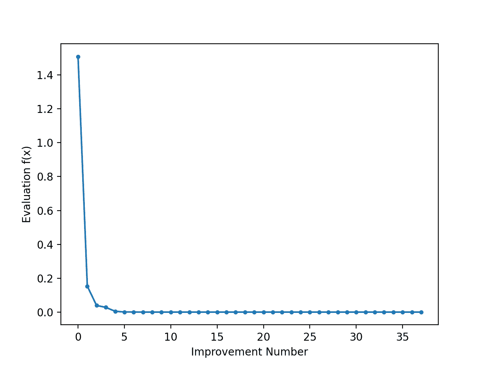

# Python 中从零开始的差分进化

> 原文：<https://machinelearningmastery.com/differential-evolution-from-scratch-in-python/>

最后更新于 2021 年 10 月 12 日

差分进化是非线性不可微连续空间函数全局优化的一种启发式方法。

差分进化算法属于更广泛的进化计算算法家族。类似于其他流行的直接搜索方法，如遗传算法和进化策略，差分进化算法从候选解的初始种群开始。通过在群体中引入突变，并保留产生较低目标函数值的最合适的候选解，这些候选解被迭代地改进。

差分进化算法优于上述流行方法，因为它可以处理非线性和不可微的多维目标函数，同时需要很少的控制参数来控制最小化。这些特性使算法更容易使用，也更实用。

在本教程中，您将发现全局优化的差分进化算法。

完成本教程后，您将知道:

*   差分进化是非线性不可微连续空间函数全局优化的一种启发式方法。
*   如何在 Python 中从头实现差分进化算法？
*   如何将差分进化算法应用于实值 2D 目标函数。

**用我的新书[机器学习优化](https://machinelearningmastery.com/optimization-for-machine-learning/)启动你的项目**，包括*分步教程*和所有示例的 *Python 源代码*文件。

Let’s get started.

*   **2021 年 6 月**:修正了代码中与描述匹配的突变操作。

## 教程概述

本教程分为三个部分；它们是:

1.  差分进化
2.  从零开始的差分进化算法
3.  球面函数上的差分进化算法

## 差分进化

差分进化是非线性不可微连续空间函数全局优化的一种启发式方法。

为了使最小化算法被认为是实用的，它应该满足五个不同的要求:

> (1)处理不可微、非线性和多模态成本函数的能力。
> (2)处理计算密集型成本函数的并行性。
> (3)易用性，即操纵最小化的控制变量很少。
> 这些变量也应该是稳健且易于选择的。
> (4)良好的收敛性，即在
> 连续独立试验中一致收敛到全局最小值。

——[连续空间上全局优化的一种简单有效的启发式算法](https://link.springer.com/article/10.1023/A:1008202821328)，1997。

差分进化算法的优势来自于这样一个事实，即它被设计来满足上述所有要求。

> 差分进化可以说是近年来连续参数空间中最强大和最通用的进化优化器之一。

——[差分进化的最新进展:最新调查](https://link.springer.com/article/10.1007/s10462-009-9137-2)，2016 年。

该算法首先随机启动一组实值决策向量，也称为基因组或染色体。这些代表多维优化问题的候选解决方案。

在每次迭代中，算法都会在群体中引入突变，以生成新的候选解。突变过程将两个群体向量之间的加权差加到第三个向量上，以产生突变向量。在称为交叉的过程中，突变向量的参数再次与另一个预定向量(目标向量)的参数混合，该过程旨在增加扰动参数向量的多样性。得到的向量称为试验向量。

> DE 通过将两个群体向量之间的加权差加到第三个向量来生成新的参数向量。让这个操作叫做突变。
> 为了增加扰动参数向量的多样性，引入了交叉。

——[连续空间上全局优化的一种简单有效的启发式算法](https://link.springer.com/article/10.1023/A:1008202821328)，1997。

这些突变是根据一种突变策略产生的，该策略遵循 DE/x/y/z 的通用命名惯例，其中 DE 代表差分进化，而 x 表示要突变的载体，y 表示为 x 的突变考虑的差异载体的数量，z 是使用中的交叉类型。例如，流行的策略:

*   起始/终止/1/bin
*   DE/best/2/bin

指定向量 x 可以从总体中随机选取(rand)，或者选择成本最低(最好)的向量；所考虑的差向量的数量是 1 或 2；且根据独立二项式(绑定)实验来执行交叉。特别是 DE/best/2/bin 策略，如果种群规模足够大，似乎对提高种群多样性非常有益。

> 如果种群向量 NP 的数量足够高，使用两个差异向量似乎可以提高种群的多样性。

——[连续空间上全局优化的一种简单有效的启发式算法](https://link.springer.com/article/10.1023/A:1008202821328)，1997。

最后的选择操作将目标向量或父向量替换为试验向量及其后代，如果后者产生较低的目标函数值。因此，更适合的后代现在成为新产生的群体的成员，并随后参与更多群体成员的突变。这些迭代一直持续到达到终止标准。

> 迭代一直持续到满足终止标准(例如最大功能评估的耗尽)。

——[差分进化的最新进展:最新调查](https://link.springer.com/article/10.1007/s10462-009-9137-2)，2016 年。

差分进化算法需要很少的参数来操作，即种群大小，NP，一个真实且恒定的比例因子，F ∈ [0，2]，它在变异过程中对差分变化进行加权，以及交叉率，CR ∈ [0，1]，它是通过实验确定的。这使得该算法简单实用。

> 此外，规范的 DE 只需要很少的控制参数(精确地说是 3 个:比例因子、交叉率和群体大小)——这一特性使得从业者很容易使用。

——[差分进化的最新进展:最新调查](https://link.springer.com/article/10.1007/s10462-009-9137-2)，2016 年。

上面描述的标准差分进化算法
还有其他变体，你可以在[差分进化的最新进展中读到——更新的调查](https://link.springer.com/article/10.1007/s10462-009-9137-2)，2016。

现在我们已经熟悉了差分进化算法，下面我们来看看如何从零开始实现。

## 从零开始的差分进化算法

在本节中，我们将探索如何从零开始实现差分进化算法。
差分进化算法从生成候选解的初始种群开始。为此，我们将使用 rand()函数生成一个随机值数组，这些随机值是从[0，1]范围内的均匀分布中采样的。

然后，我们将缩放这些值，以将它们的分布范围更改为(下限、上限)，其中以 2D 数组的形式指定界限，每个维度对应于每个输入变量。

```py
...
# initialise population of candidate solutions randomly within the specified bounds
pop = bounds[:, 0] + (rand(pop_size, len(bounds)) * (bounds[:, 1] - bounds[:, 0]))
```

目标函数也将在这些相同的范围内进行评估。因此，选择的目标函数和每个输入变量的界限可以定义如下:

```py
# define objective function
def obj(x):
  return 0

# define lower and upper bounds
bounds = asarray([-5.0, 5.0])
```

我们可以通过将它作为输入参数传递给目标函数来评估候选解的初始群体。

```py
...
# evaluate initial population of candidate solutions
obj_all = [obj(ind) for ind in pop]
```

随着种群的进化和向最优解的收敛，我们将用更好的值替换 obj_all 中的值。

然后，我们可以循环算法的预定义迭代次数，如参数 iter 指定的 100 或 1000 次，以及所有候选解。

```py
...
# run iterations of the algorithm
for i in range(iter):
  # iterate over all candidate solutions
  for j in range(pop_size):
    ...
```

算法迭代的第一步执行变异过程。为此，从群体中随机选择三个不属于当前候选的随机候选 a、b 和 c，并通过计算生成突变向量:a+F *(b–c)。回想一下，F∏0，2]表示突变比例因子。

```py
...
# choose three candidates, a, b and c, that are not the current one
candidates = [candidate for candidate in range(pop_size) if candidate != j]
a, b, c = pop[choice(candidates, 3, replace=False)]
```

突变过程由函数突变来执行，我们将 a、b、c 和 F 作为输入参数传递给它。

```py
# define mutation operation
def mutation(x, F):
    return x[0] + F * (x[1] - x[2])
...
# perform mutation
mutated = mutation([a, b, c], F)
...
```

由于我们在一个有界的值范围内操作，我们需要检查新突变的向量是否也在指定的范围内，如果不在，则根据需要将其值裁剪到上限或下限。该检查由函数 check_bounds 执行。

```py
# define boundary check operation
def check_bounds(mutated, bounds):
    mutated_bound = [clip(mutated[i], bounds[i, 0], bounds[i, 1]) for i in range(len(bounds))]
    return mutated_bound
```

下一步执行交叉，其中当前、目标、向量的特定值被突变向量中的相应值替换，以创建试验向量。决定替换哪些值是基于为每个输入变量生成的统一随机值是否低于交叉率。如果是这样，那么突变载体的相应值被复制到目标载体。

交叉过程由 crossover()函数实现，该函数将变异和目标向量以及交叉率 Cr∞[0，1]和输入变量的数量作为输入。

```py
# define crossover operation
def crossover(mutated, target, dims, cr):
    # generate a uniform random value for every dimension
    p = rand(dims)
    # generate trial vector by binomial crossover
    trial = [mutated[i] if p[i] < cr else target[i] for i in range(dims)]
    return trial
...
# perform crossover
trial = crossover(mutated, pop[j], len(bounds), cr)
...
```

如果试验向量产生较低的目标函数值，则最后的选择步骤用试验向量代替目标向量。为此，我们对目标函数上的两个向量进行评估，并随后执行选择，如果发现试验向量是两者中最合适的，则将新的目标函数值存储在 obj_all 中。

```py
...
# compute objective function value for target vector
obj_target = obj(pop[j])
# compute objective function value for trial vector
obj_trial = obj(trial)
# perform selection
if obj_trial < obj_target:
    # replace the target vector with the trial vector
    pop[j] = trial
    # store the new objective function value
    obj_all[j] = obj_trial
```

我们可以将所有步骤结合成一个 differential_evolution()函数，该函数将种群大小、每个输入变量的边界、迭代总数、变异比例因子和交叉率作为输入参数，并返回找到的最佳解及其评估。

```py
def differential_evolution(pop_size, bounds, iter, F, cr):
    # initialise population of candidate solutions randomly within the specified bounds
    pop = bounds[:, 0] + (rand(pop_size, len(bounds)) * (bounds[:, 1] - bounds[:, 0]))
    # evaluate initial population of candidate solutions
    obj_all = [obj(ind) for ind in pop]
    # find the best performing vector of initial population
    best_vector = pop[argmin(obj_all)]
    best_obj = min(obj_all)
    prev_obj = best_obj
    # run iterations of the algorithm
    for i in range(iter):
        # iterate over all candidate solutions
        for j in range(pop_size):
            # choose three candidates, a, b and c, that are not the current one
            candidates = [candidate for candidate in range(pop_size) if candidate != j]
            a, b, c = pop[choice(candidates, 3, replace=False)]
            # perform mutation
            mutated = mutation([a, b, c], F)
            # check that lower and upper bounds are retained after mutation
            mutated = check_bounds(mutated, bounds)
            # perform crossover
            trial = crossover(mutated, pop[j], len(bounds), cr)
            # compute objective function value for target vector
            obj_target = obj(pop[j])
            # compute objective function value for trial vector
            obj_trial = obj(trial)
            # perform selection
            if obj_trial < obj_target:
                # replace the target vector with the trial vector
                pop[j] = trial
                # store the new objective function value
                obj_all[j] = obj_trial
        # find the best performing vector at each iteration
        best_obj = min(obj_all)
        # store the lowest objective function value
        if best_obj < prev_obj:
            best_vector = pop[argmin(obj_all)]
            prev_obj = best_obj
            # report progress at each iteration
            print('Iteration: %d f([%s]) = %.5f' % (i, around(best_vector, decimals=5), best_obj))
    return [best_vector, best_obj]
```

现在我们已经实现了差分进化算法，让我们研究如何使用它来优化目标函数。

## 球面函数上的差分进化算法

在本节中，我们将把差分进化算法应用于目标函数。
我们将使用在边界内指定的简单二维球体目标函数，[-5，5]。球函数是连续的、凸的和单峰的，其特征在于 f(0，0) = 0.0 时的单一全局最小值。

```py
# define objective function
def obj(x):
    return x[0]**2.0 + x[1]**2.0
```

我们将基于策略 DE/rand/1/bin，使用差分进化算法最小化这个目标函数。

为此，我们必须定义算法参数的值，特别是种群大小、迭代次数、变异比例因子和交叉率。我们根据经验将这些值分别设置为 10、100、0.5 和 0.7。

```py
...
# define population size
pop_size = 10
# define number of iterations
iter = 100
# define scale factor for mutation
F = 0.5
# define crossover rate for recombination
cr = 0.7
```

我们还定义了每个输入变量的边界。

```py
...
# define lower and upper bounds for every dimension
bounds = asarray([(-5.0, 5.0), (-5.0, 5.0)])
```

接下来，我们进行搜索并报告结果。

```py
...
# perform differential evolution
solution = differential_evolution(pop_size, bounds, iter, F, cr)
```

将这些结合在一起，完整的示例如下所示。

```py
# differential evolution search of the two-dimensional sphere objective function
from numpy.random import rand
from numpy.random import choice
from numpy import asarray
from numpy import clip
from numpy import argmin
from numpy import min
from numpy import around

# define objective function
def obj(x):
    return x[0]**2.0 + x[1]**2.0

# define mutation operation
def mutation(x, F):
    return x[0] + F * (x[1] - x[2])

# define boundary check operation
def check_bounds(mutated, bounds):
    mutated_bound = [clip(mutated[i], bounds[i, 0], bounds[i, 1]) for i in range(len(bounds))]
    return mutated_bound

# define crossover operation
def crossover(mutated, target, dims, cr):
    # generate a uniform random value for every dimension
    p = rand(dims)
    # generate trial vector by binomial crossover
    trial = [mutated[i] if p[i] < cr else target[i] for i in range(dims)]
    return trial

def differential_evolution(pop_size, bounds, iter, F, cr):
    # initialise population of candidate solutions randomly within the specified bounds
    pop = bounds[:, 0] + (rand(pop_size, len(bounds)) * (bounds[:, 1] - bounds[:, 0]))
    # evaluate initial population of candidate solutions
    obj_all = [obj(ind) for ind in pop]
    # find the best performing vector of initial population
    best_vector = pop[argmin(obj_all)]
    best_obj = min(obj_all)
    prev_obj = best_obj
    # run iterations of the algorithm
    for i in range(iter):
        # iterate over all candidate solutions
        for j in range(pop_size):
            # choose three candidates, a, b and c, that are not the current one
            candidates = [candidate for candidate in range(pop_size) if candidate != j]
            a, b, c = pop[choice(candidates, 3, replace=False)]
            # perform mutation
            mutated = mutation([a, b, c], F)
            # check that lower and upper bounds are retained after mutation
            mutated = check_bounds(mutated, bounds)
            # perform crossover
            trial = crossover(mutated, pop[j], len(bounds), cr)
            # compute objective function value for target vector
            obj_target = obj(pop[j])
            # compute objective function value for trial vector
            obj_trial = obj(trial)
            # perform selection
            if obj_trial < obj_target:
                # replace the target vector with the trial vector
                pop[j] = trial
                # store the new objective function value
                obj_all[j] = obj_trial
        # find the best performing vector at each iteration
        best_obj = min(obj_all)
        # store the lowest objective function value
        if best_obj < prev_obj:
            best_vector = pop[argmin(obj_all)]
            prev_obj = best_obj
            # report progress at each iteration
            print('Iteration: %d f([%s]) = %.5f' % (i, around(best_vector, decimals=5), best_obj))
    return [best_vector, best_obj]

# define population size
pop_size = 10
# define lower and upper bounds for every dimension
bounds = asarray([(-5.0, 5.0), (-5.0, 5.0)])
# define number of iterations
iter = 100
# define scale factor for mutation
F = 0.5
# define crossover rate for recombination
cr = 0.7

# perform differential evolution
solution = differential_evolution(pop_size, bounds, iter, F, cr)
print('\nSolution: f([%s]) = %.5f' % (around(solution[0], decimals=5), solution[1]))
```

运行该示例会报告搜索的进度，包括迭代次数，以及每次检测到改进时目标函数的响应。

在搜索结束时，找到最佳解决方案并报告其评估。

**注**:考虑到算法或评估程序的随机性，或数值准确率的差异，您的[结果可能会有所不同](https://machinelearningmastery.com/different-results-each-time-in-machine-learning/)。考虑运行该示例几次，并比较平均结果。

在这种情况下，我们可以看到算法在 100 次迭代中的大约 33 次改进中收敛到非常接近 f(0.0，0.0) = 0.0。

```py
Iteration: 1 f([[ 0.89709 -0.45082]]) = 1.00800
Iteration: 2 f([[-0.5382 0.29676]]) = 0.37773
Iteration: 3 f([[ 0.41884 -0.21613]]) = 0.22214
Iteration: 4 f([[0.34737 0.29676]]) = 0.20873
Iteration: 5 f([[ 0.20692 -0.1747 ]]) = 0.07334
Iteration: 7 f([[-0.23154 -0.00557]]) = 0.05364
Iteration: 8 f([[ 0.11956 -0.02632]]) = 0.01499
Iteration: 11 f([[ 0.01535 -0.02632]]) = 0.00093
Iteration: 15 f([[0.01918 0.01603]]) = 0.00062
Iteration: 18 f([[0.01706 0.00775]]) = 0.00035
Iteration: 20 f([[0.00467 0.01275]]) = 0.00018
Iteration: 21 f([[ 0.00288 -0.00175]]) = 0.00001
Iteration: 27 f([[ 0.00286 -0.00175]]) = 0.00001
Iteration: 30 f([[-0.00059 0.00044]]) = 0.00000
Iteration: 37 f([[-1.5e-04 8.0e-05]]) = 0.00000
Iteration: 41 f([[-1.e-04 -8.e-05]]) = 0.00000
Iteration: 43 f([[-4.e-05 6.e-05]]) = 0.00000
Iteration: 48 f([[-2.e-05 6.e-05]]) = 0.00000
Iteration: 49 f([[-6.e-05 0.e+00]]) = 0.00000
Iteration: 50 f([[-4.e-05 1.e-05]]) = 0.00000
Iteration: 51 f([[1.e-05 1.e-05]]) = 0.00000
Iteration: 55 f([[1.e-05 0.e+00]]) = 0.00000
Iteration: 64 f([[-0\. -0.]]) = 0.00000
Iteration: 68 f([[ 0\. -0.]]) = 0.00000
Iteration: 72 f([[-0\. 0.]]) = 0.00000
Iteration: 77 f([[-0\. 0.]]) = 0.00000
Iteration: 79 f([[0\. 0.]]) = 0.00000
Iteration: 84 f([[ 0\. -0.]]) = 0.00000
Iteration: 86 f([[-0\. -0.]]) = 0.00000
Iteration: 87 f([[-0\. -0.]]) = 0.00000
Iteration: 95 f([[-0\. 0.]]) = 0.00000
Iteration: 98 f([[-0\. 0.]]) = 0.00000
Solution: f([[-0\. 0.]]) = 0.00000
```

我们可以通过稍微修改 differential_evolution()函数来绘制每次改进时返回的目标函数值，以跟踪目标函数值，并在列表 obj_iter 中返回。

```py
def differential_evolution(pop_size, bounds, iter, F, cr):
    # initialise population of candidate solutions randomly within the specified bounds
    pop = bounds[:, 0] + (rand(pop_size, len(bounds)) * (bounds[:, 1] - bounds[:, 0]))
    # evaluate initial population of candidate solutions
    obj_all = [obj(ind) for ind in pop]
    # find the best performing vector of initial population
    best_vector = pop[argmin(obj_all)]
    best_obj = min(obj_all)
    prev_obj = best_obj
    # initialise list to store the objective function value at each iteration
    obj_iter = list()
    # run iterations of the algorithm
    for i in range(iter):
        # iterate over all candidate solutions
        for j in range(pop_size):
            # choose three candidates, a, b and c, that are not the current one
            candidates = [candidate for candidate in range(pop_size) if candidate != j]
            a, b, c = pop[choice(candidates, 3, replace=False)]
            # perform mutation
            mutated = mutation([a, b, c], F)
            # check that lower and upper bounds are retained after mutation
            mutated = check_bounds(mutated, bounds)
            # perform crossover
            trial = crossover(mutated, pop[j], len(bounds), cr)
            # compute objective function value for target vector
            obj_target = obj(pop[j])
            # compute objective function value for trial vector
            obj_trial = obj(trial)
            # perform selection
            if obj_trial < obj_target:
                # replace the target vector with the trial vector
                pop[j] = trial
                # store the new objective function value
                obj_all[j] = obj_trial
        # find the best performing vector at each iteration
        best_obj = min(obj_all)
        # store the lowest objective function value
        if best_obj < prev_obj:
            best_vector = pop[argmin(obj_all)]
            prev_obj = best_obj
            obj_iter.append(best_obj)
            # report progress at each iteration
            print('Iteration: %d f([%s]) = %.5f' % (i, around(best_vector, decimals=5), best_obj))
    return [best_vector, best_obj, obj_iter]
```

然后，我们可以创建这些目标函数值的线图，以查看搜索过程中每一次改进的相对变化。

```py
from matplotlib import pyplot
...
# perform differential evolution
solution = differential_evolution(pop_size, bounds, iter, F, cr)
...
# line plot of best objective function values
pyplot.plot(solution[2], '.-')
pyplot.xlabel('Improvement Number')
pyplot.ylabel('Evaluation f(x)')
pyplot.show()
```

将这些联系在一起，完整的示例如下所示。

```py
# differential evolution search of the two-dimensional sphere objective function
from numpy.random import rand
from numpy.random import choice
from numpy import asarray
from numpy import clip
from numpy import argmin
from numpy import min
from numpy import around
from matplotlib import pyplot

# define objective function
def obj(x):
    return x[0]**2.0 + x[1]**2.0

# define mutation operation
def mutation(x, F):
    return x[0] + F * (x[1] - x[2])

# define boundary check operation
def check_bounds(mutated, bounds):
    mutated_bound = [clip(mutated[i], bounds[i, 0], bounds[i, 1]) for i in range(len(bounds))]
    return mutated_bound

# define crossover operation
def crossover(mutated, target, dims, cr):
    # generate a uniform random value for every dimension
    p = rand(dims)
    # generate trial vector by binomial crossover
    trial = [mutated[i] if p[i] < cr else target[i] for i in range(dims)]
    return trial

def differential_evolution(pop_size, bounds, iter, F, cr):
    # initialise population of candidate solutions randomly within the specified bounds
    pop = bounds[:, 0] + (rand(pop_size, len(bounds)) * (bounds[:, 1] - bounds[:, 0]))
    # evaluate initial population of candidate solutions
    obj_all = [obj(ind) for ind in pop]
    # find the best performing vector of initial population
    best_vector = pop[argmin(obj_all)]
    best_obj = min(obj_all)
    prev_obj = best_obj
    # initialise list to store the objective function value at each iteration
    obj_iter = list()
    # run iterations of the algorithm
    for i in range(iter):
        # iterate over all candidate solutions
        for j in range(pop_size):
            # choose three candidates, a, b and c, that are not the current one
            candidates = [candidate for candidate in range(pop_size) if candidate != j]
            a, b, c = pop[choice(candidates, 3, replace=False)]
            # perform mutation
            mutated = mutation([a, b, c], F)
            # check that lower and upper bounds are retained after mutation
            mutated = check_bounds(mutated, bounds)
            # perform crossover
            trial = crossover(mutated, pop[j], len(bounds), cr)
            # compute objective function value for target vector
            obj_target = obj(pop[j])
            # compute objective function value for trial vector
            obj_trial = obj(trial)
            # perform selection
            if obj_trial < obj_target:
                # replace the target vector with the trial vector
                pop[j] = trial
                # store the new objective function value
                obj_all[j] = obj_trial
        # find the best performing vector at each iteration
        best_obj = min(obj_all)
        # store the lowest objective function value
        if best_obj < prev_obj:
            best_vector = pop[argmin(obj_all)]
            prev_obj = best_obj
            obj_iter.append(best_obj)
            # report progress at each iteration
            print('Iteration: %d f([%s]) = %.5f' % (i, around(best_vector, decimals=5), best_obj))
    return [best_vector, best_obj, obj_iter]

# define population size
pop_size = 10
# define lower and upper bounds for every dimension
bounds = asarray([(-5.0, 5.0), (-5.0, 5.0)])
# define number of iterations
iter = 100
# define scale factor for mutation
F = 0.5
# define crossover rate for recombination
cr = 0.7

# perform differential evolution
solution = differential_evolution(pop_size, bounds, iter, F, cr)
print('\nSolution: f([%s]) = %.5f' % (around(solution[0], decimals=5), solution[1]))

# line plot of best objective function values
pyplot.plot(solution[2], '.-')
pyplot.xlabel('Improvement Number')
pyplot.ylabel('Evaluation f(x)')
pyplot.show()
```

运行该示例会创建一个线图。

线图显示了每次改进的目标函数评估，随着算法收敛到最优值，最初会有较大的变化，而在搜索结束时变化非常小。



差分进化搜索中每次改进的目标函数评估线图

## 进一步阅读

如果您想更深入地了解这个主题，本节将提供更多资源。

### 报纸

*   [连续空间上全局优化的简单有效的启发式算法](https://link.springer.com/article/10.1023/A:1008202821328)，1997。
*   [差分进化的最新进展:最新调查](https://link.springer.com/article/10.1007/s10462-009-9137-2)，2016。

### 书

*   [优化算法](https://amzn.to/2Traqek)，2019。

### 文章

*   [差分进化，维基百科](https://en.wikipedia.org/wiki/Differential_evolution)。

## 摘要

在本教程中，您发现了差分进化算法。
具体来说，你学会了:

*   差分进化是非线性不可微连续空间函数全局优化的一种启发式方法。
*   如何在 Python 中从头实现差分进化算法？
*   如何将差分进化算法应用于实值 2D 目标函数。